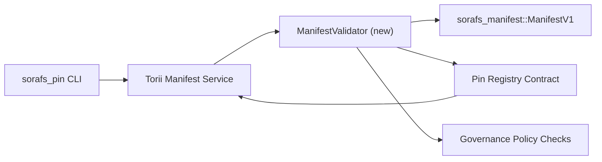

---
id: plano de validação de registro de pin
título: Plano de validação de manifestos do Pin Registry
sidebar_label: Validação do Pin Registry
description: Plano de validação para o gating do ManifestV1 antes do lançamento do Pin Registry SF-4.
---

:::nota Fonte canônica
Esta página espelha `docs/source/sorafs/pin_registry_validation_plan.md`. Mantenha ambos os locais alinhados enquanto a documentação herdada permanece ativa.
:::

# Plano de validação de manifestos do Pin Registry (Preparação SF-4)

Este plano descreve os passos necessários para integrar a validação de
`sorafs_manifest::ManifestV1` no futuro contrato do Pin Registry para que o
trabalho de SF-4 se baseia em nenhuma ferramenta existente sem duplicar a lógica de
codificar/decodificar.

## Objetivos

1. Os caminhos de envio no host verificam a estrutura do manifesto, o perfil de
   chunking e os envelopes de governança antes de aceitar propostas.
2. Torii e os serviços de gateway reutilizam as mesmas rotinas de validação para
   garantir um comportamento determinístico entre hospedeiros.
3. Os testes de integração cobrem casos positivos/negativos para aceitação de
   manifestos, aplicação de política e telemetria de erros.

##Arquitetura

### Componentes

- `ManifestValidator` (novo módulo sem caixa `sorafs_manifest` ou `sorafs_pin`)
  encapsula verificações estruturais e portões de política.
- Torii expõe um endpoint gRPC `SubmitManifest` que chama
  `ManifestValidator` antes de encaminhar ao contrato.
- O caminho de busca do gateway pode opcionalmente extrair o mesmo validador ao
  cachear novos manifestos vindos do registro.

## Desdobramento de tarefas| Tarefa | Descrição | Responsável | Estado |
|--------|-----------|-------------|--------|
| Esqueleto de API V1 | Adicione `validate_manifest(manifest: &ManifestV1, policy: &PinPolicyInputs) -> Result<(), ValidationError>` em `sorafs_manifest`. Inclui verificação de resumo BLAKE3 e pesquisa do registro do chunker. | Infra principal | Concluído | Ajudantes compartilhados (`validate_chunker_handle`, `validate_pin_policy`, `validate_manifest`) agora vivem em `sorafs_manifest::validation`. |
| Fiação de política | Mapear uma configuração de política de registro (`min_replicas`, janelas de expiração, identificadores de chunker permitidos) para as entradas de validação. | Governança / Infraestrutura Central | Pendente - rastreado em SORAFS-215 |
| Integração Torii | Chamar o validador no caminho de submissão Torii; retornar erros Norito estruturados em falhas. | Equipe Torii | Planejado - rastreado em SORAFS-216 |
| Esboço do contrato anfitrião | Garantir que o ponto de entrada do contrato rejeite manifestos que falham no hash de validação; exportar contadores de métricas. | Equipe de contrato inteligente | Concluído | `RegisterPinManifest` agora invoca o validador compartilhado (`ensure_chunker_handle`/`ensure_pin_policy`) antes de alterar o estado e testes unitários cobrirem os casos de falha. |
| Testes | Adicionar testes unitários para o validador + casos trybuild para manifestos inválidos; testes de integração em `crates/iroha_core/tests/pin_registry.rs`. | Guilda de controle de qualidade | Em progresso | Os testes unitários do validador chegaram junto com rejeições on-chain; uma suíte completa de integração segue pendente. |
| Documentos | Atualizar `docs/source/sorafs_architecture_rfc.md` e `migration_roadmap.md` quando o validador chegar; documentar o uso da CLI em `docs/source/sorafs/manifest_pipeline.md`. | Equipe de documentos | Pendente - rastreado em DOCS-489 |

## Dependências

- Finalização do esquema Norito do Pin Registry (ref: item SF-4 sem roadmap).
- Envelopes do registro de chunker assinados pelo conselho (garante mapeamento determinístico do validador).
- Decisões de autenticação do Torii para envio de manifestos.

## Riscos e mitigações

| Risco | Impacto | Mitigação |
|-------|------------|-----------|
| Interpretação divergente de política entre Torii e o contrato | Aceitação não determinística. | Compartilhar caixa de validação + adicionar testes de integração que comparam decisões do host vs on-chain. |
| Regressão de performance para grandes manifestos | Envios mais lentos | Medir via critério carga; considere cachear resultados de digest do manifest. |
| Derivada de mensagens de erro | Confusão do operador | Definir códigos de erro Norito; documentado em `manifest_pipeline.md`. |

## Metas de cronograma

- Semana 1: entregar o esqueleto `ManifestValidator` + testes unitários.
- Semana 2: integrar o caminho de submissão no Torii e atualizar a CLI para expor erros de validação.
- Semana 3: implementar hooks do contrato, adicionar testes de integração, atualizar documentos.
- Semana 4: rodar ensaio ponta a ponta com entrada no registro de migração e capturar aprovação do conselho.

Este plano será referenciado no roteiro assim como o trabalho do validador comecar.