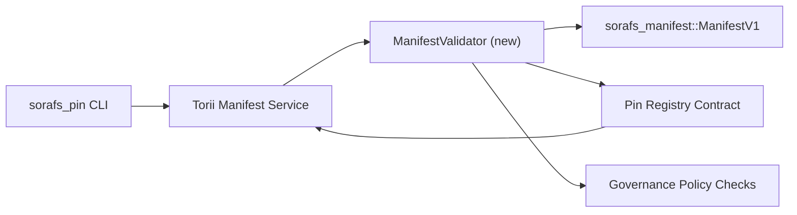

---
id: plano de validação de registro de pin
título: План валидации manifestos para Pin Registry
sidebar_label: Registro de PIN de validação
descrição: Plano de validação para gating ManifestV1 antes do lançamento do Pin Registry SF-4.
---

:::nota História Canônica
Esta página contém `docs/source/sorafs/pin_registry_validation_plan.md`. Verifique se a documentação está ativa.
:::

# Planeje manifestos de validação para Pin Registry (Подготовка SF-4)

Este plano de descrição é necessário para a validação do programa
`sorafs_manifest::ManifestV1` no contrato Pin Registry, чтобы работа SF-4
опиралась на существующий ferramentas para codificar/decodificar lógicas.

##Céli

1. Coloque o manifesto na estrutura de teste da estrutura, perfil
   chunking e envelopes de governança перед принятием предложений.
2. Torii e gateway сервисы переиспользуют те же процедуры валидации para
   детерминированного поведения между хостами.
3. Интеграционные тесты покрывают позитивные/негативные кейсы принятия
   manifestos, política de aplicação e телеметрию ошибок.

## Arquitetura

### Componentes

- `ManifestValidator` (módulo na caixa `sorafs_manifest` ou `sorafs_pin`)
  инкапсулирует структурные проверки и portões de política.
- Torii открывает endpoint gRPC `SubmitManifest`, который вызывает
  `ManifestValidator` foi entregue no contrato.
- Faça com que o gateway fetch possa ser usado opcionalmente para validá-lo
  кешировании новых manifesta-se no registro.

## Разбиение задач| Bem | Descrição | Владелец | Status |
|--------|----------|----------|--------|
| Esqueleto API V1 | Instale `validate_manifest(manifest: &ManifestV1, policy: &PinPolicyInputs) -> Result<(), ValidationError>` em `sorafs_manifest`. Verifique o resumo do BLAKE3 e o registro do chunker de pesquisa. | Infra principal | ✅ Сделано | Os ajudantes de segurança (`validate_chunker_handle`, `validate_pin_policy`, `validate_manifest`) são instalados em `sorafs_manifest::validation`. |
| Políticas de segurança | Verifique a configuração do registro de política (`min_replicas`, operação correta, identificadores de chunker de configuração) em sua validação. | Governança / Infraestrutura Central | В ожидании — отслеживается в SORAFS-215 |
| Integração Torii | Verifique o validador no envio Torii; Instale a estrutura Norito antes da instalação. | Equipe Torii | Запланировано — отслеживается em SORAFS-216 |
| Fechar contrato de compra | Убедиться, что entrypoint контракта отклоняет manifestos, не прошедшие хэш валидации; экспонировать счетчики метрик. | Equipe de contrato inteligente | ✅ Сделано | `RegisterPinManifest` é um validador de teste (`ensure_chunker_handle`/`ensure_pin_policy`) para definir uma configuração e testes de unidade покрывают случаи отказа. |
| Testes | Faça testes de unidade para validar + trybuild para manifestos некорректных; testes de integração em `crates/iroha_core/tests/pin_registry.rs`. | Guilda de controle de qualidade | 🟠 Em processo | Os testes unitários são validados por meio de testes on-chain; suíte de integração integrada pode ser usada. |
| Documentação | Обновить `docs/source/sorafs_architecture_rfc.md` e `migration_roadmap.md` podem ser validados; Selecione CLI em `docs/source/sorafs/manifest_pipeline.md`. | Equipe de documentos | Para informações — registradas em DOCS-489 |

## Зависимости

- Финализация Norito схемы Pin Registry (ref: ponto SF-4 no roteiro).
- Подписанные envelopes do conselho para o registro do chunker (гарантируют детерминированное сопоставление в валидаторе).
- Registro de autenticação Torii para envio de manifestos.

## Риски e меры

| Risco | Влияние | Mitigação |
|------|---------|---------------|
| Política de interface de interface com Torii e contrato | Недетерминированное принятие. | Делить crate валидации + добавить интеграционные тесты сравнения решений host vs on-chain. |
| Registo de distribuição de manifestos | Submissão de Более медленные | Critério de carga Бенчмарк через; рассмотреть кеширование результатов manifesto de resumo. |
| Bebidas de alta qualidade | Operações e operadores | Códigos de segurança padrão Norito; задокументировать em `manifest_pipeline.md`. |

## Цели по времени

- Passo 1: use o esquema `ManifestValidator` + testes de unidade.
- Etapa 2: envie o envio para Torii e abra a CLI para obter a validação.
- Passo 3: Realize o contrato de ganchos, faça testes de integração e obtenha documentos.
- Etapa 4: verifique a repetição de ponta a ponta com a verificação do registro de migração e a implementação da solução atual.

Este plano será implementado no roteiro para iniciar o trabalho de validação.