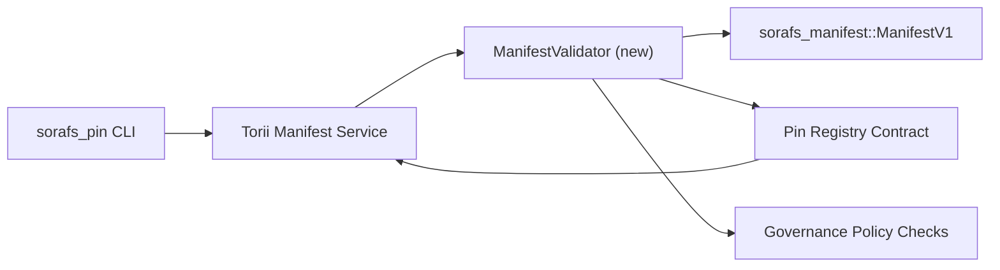

---
id: plano de validação de registro de pin
título: Pin Registry کے manifestos کی توثیقی منصوبہ بندی
sidebar_label: Registro de Pins
descrição: Implementação do SF-4 Pin Registry
---

:::nota مستند ماخذ
یہ صفحہ `docs/source/sorafs/pin_registry_validation_plan.md` کی عکاسی کرتا ہے۔ جب تک پرانی دستاویزات فعال ہیں دونوں مقامات کو ہم آہنگ رکھیں۔
:::

# Plano de validação de manifesto de registro de pinos (preparação para SF-4)

یہ منصوبہ وہ اقدامات بیان کرتا ہے جو `sorafs_manifest::ManifestV1` کی توثیق کو
آنے والے Pin Registry کنٹریکٹ میں جوڑنے کے لیے درکار ہیں تاکہ SF-4 کا کام
Ferramentas de ferramentas para codificar/decodificar

## مقاصد

1. Envio do lado do host راستے manifesto کی ساخت, perfil de chunking, e governança
   envelopes کو propostas قبول کرنے سے پہلے verificar کرتے ہیں۔
2. Torii اور gateway سروسز وہی rotinas de validação دوبارہ استعمال کرتی ہیں تاکہ
   hosts کے درمیان comportamento determinístico برقرار رہے۔
3. Testes de integração مثبت/منفی کیسز کو کور کرتے ہیں, جن میں aceitação manifesta,
   aplicação de política, e telemetria de erro شامل ہیں۔

## Arquitetura

### Componentes

- `ManifestValidator` (`sorafs_manifest` یا `sorafs_pin` caixa میں نیا ماڈیول)
  ساختی چیکس اور portas de política کو encapsular کرتا ہے۔
- Torii ایک endpoint gRPC `SubmitManifest` expor کرتا ہے جو کنٹریکٹ کو avançar
  کرنے سے پہلے `ManifestValidator` کو کال کرتا ہے۔
- Caminho de busca do gateway opcionalmente وہی validador استعمال کرتا ہے جب registro سے
  نئے manifesta cache کیے جائیں۔

## Divisão de tarefas

| Tarefa | Descrição | Proprietário | Estado |
|------|------------|-------|--------|
| Esqueleto da API V1 | `sorafs_manifest` میں `validate_manifest(manifest: &ManifestV1, policy: &PinPolicyInputs) -> Result<(), ValidationError>` شامل کریں۔ Verificação de resumo BLAKE3 e pesquisa de registro de chunker شامل کریں۔ | Infra principal | ✅ Concluído | Auxiliares de ajuda (`validate_chunker_handle`, `validate_pin_policy`, `validate_manifest`) ou `sorafs_manifest::validation` میں ہیں۔ |
| Fiação política | configuração da política de registro (`min_replicas`, janelas de expiração, identificadores de chunker permitidos) کو entradas de validação سے mapa کریں۔ | Governança / Infraestrutura Central | Pendente — SORAFS-215 میں ٹریکڈ |
| Integração Torii | Caminho de envio Torii کے اندر validador کال کریں؛ falha پر erros estruturados Norito واپس کریں۔ | Equipe Torii | Planejado — SORAFS-216 میں ٹریکڈ |
| Esboço do contrato de hospedagem | یقینی بنائیں کہ ponto de entrada do contrato e rejeição de manifestos کرے جو hash de validação میں falha ہوں؛ contadores de métricas | Equipe de contrato inteligente | ✅ Concluído | `RegisterPinManifest` اب estado mutate کرنے سے پہلے validador compartilhado (`ensure_chunker_handle`/`ensure_pin_policy`) چلاتا ہے اور casos de falha de testes de unidade کور کرتے ہیں۔ |
| Testes | validador کے لیے testes unitários + manifestos inválidos کے لیے casos trybuild شامل کریں؛ `crates/iroha_core/tests/pin_registry.rs` Testes de integração de teste | Guilda de controle de qualidade | 🟠 Em andamento | testes unitários do validador, testes de rejeição na cadeia Pacote de integração completo |
| Documentos | validador آنے کے بعد `docs/source/sorafs_architecture_rfc.md` e `migration_roadmap.md` اپڈیٹ کریں؛ CLI استعمال `docs/source/sorafs/manifest_pipeline.md` میں کھیں۔ | Equipe de documentos | Pendente — DOCS-489 میں ٹریکڈ |

## Dependências- Esquema Pin Registry Norito کی تکمیل (ref: roadmap میں SF-4 آئٹم)۔
- Envelopes de registro chunker assinados pelo conselho (mapeamento de validador کو determinístico بناتے ہیں)۔
- Envio de manifesto کے لیے Autenticação Torii فیصلے۔

## Riscos e Mitigações

| Risco | Impacto | Mitigação |
|------|--------|------------|
| Torii اور کنٹریکٹ کے درمیان interpretação de política میں فرق | Aceitação não determinística۔ | caixa de validação شیئر کریں + host vs on-chain فیصلوں کا موازنہ کرنے والی testes de integração شامل کریں۔ |
| بڑے manifesta کے لیے regressão de desempenho | Submissão aqui | critério de carga سے benchmark کریں؛ cache de resultados do resumo do manifesto کرنے پر غور کریں۔ |
| Desvio de mensagens de erro | Operadores میں کنفیوژن | Os códigos de erro Norito definem کریں؛ `manifest_pipeline.md` Documento de arquivo کریں۔ |

## Metas da linha do tempo

- Semana 1: Esqueleto `ManifestValidator` + testes de unidade لینڈ کریں۔
- Semana 2: fio do caminho de envio Torii کریں اور CLI کو erros de validação دکھانے کے لیے اپڈیٹ کریں۔
- Semana 3: ganchos de contrato implementam کریں, testes de integração شامل کریں, docs اپڈیٹ کریں۔
- Semana 4: entrada no registro de migração کے ساتھ ensaio de ponta a ponta چلائیں اور aprovação do conselho حاصل کریں۔

یہ منصوبہ validador کام شروع ہونے کے بعد roteiro میں حوالہ دیا جائے گا۔