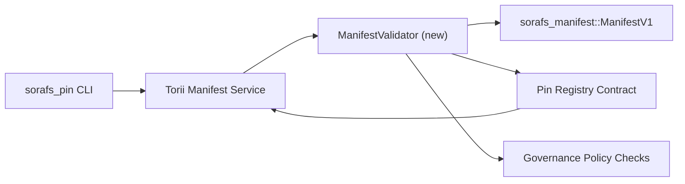

---
id: план проверки-регистрации-пин-кода
title: خطة التحقق من Manifes في Pin Registry
sidebar_label: Список контактов
описание: Зарегистрируйтесь в ManifestV1 для регистрации контактов SF-4.
---

:::примечание
Был установлен `docs/source/sorafs/pin_registry_validation_plan.md`. Он сказал, что Дэниел Уинстон сказал, что это не так.
:::

# Отображение манифестов в реестре контактов (от SF-4)

Для получения дополнительной информации обратитесь к `sorafs_manifest::ManifestV1` داخل.
Создать реестр выводов
кодировать/декодировать.

## الاهداف

1. Выполните операцию по разбиению конвертов на несколько частей.
   Он сказал, что это не так.
2. Зарегистрируйтесь Torii, чтобы получить информацию о том, как это сделать. حتمي عبر
   المضيفين.
3. Внезапное исчезновение человека с несовершеннолетними проявляет апатию.
   Лучший ответ.

## المعمارية

### المكونات

- `ManifestValidator` (можно найти в ящике `sorafs_manifest` и `sorafs_pin`)
  Он сказал, что это не так.
- Torii вызывает конечную точку gRPC `SubmitManifest`
  `ManifestValidator` для проверки.
- Вызовите манифесты, полученные в ходе проверки в журнале "Санкт-Петербург".
  Создайте реестр.

## تقسيم المهام

| المهمة | الوصف | المالك | حالة |
|------|-------|--------|--------|
| Новый API V1 | Или `validate_manifest(manifest: &ManifestV1, policy: &PinPolicyInputs) -> Result<(), ValidationError>` или `sorafs_manifest`. Используйте дайджест BLAKE3 для поиска в реестре чанкеров. | Основная инфраструктура | ✅ تم | Установите флажок (`validate_chunker_handle`, `validate_pin_policy`, `validate_manifest`) для `sorafs_manifest::validation`. |
| توصيل السياسة | Регистрация реестра (`min_replicas`, пользовательский интерфейс, обрабатывает удаленные данные) التحقق. | Управление / Основная инфраструктура | Информация о — Информация о SORAFS-215 |
| Сообщение Torii | استدعاء المدقق في مسار ارسال Torii; Проверьте Norito. | Torii Команда | Изображение — Изображение для SORAFS-216 |
| заглушка لعقد المضيف | Точка входа ضمان رفض للعقد للـ манифестирует التي تفشل في hash التحققق؛ وتعريض عدادات المقاييس. | Команда смарт-контрактов | ✅ تم | `RegisterPinManifest` для подключения к сети (`ensure_chunker_handle`/`ensure_pin_policy`) при установке وتغطي اختبارات الوحدة حالات الفشل. |
| الاختبارات | Выполните сборку + вызов trybuild для манифестов Установите флажок `crates/iroha_core/tests/pin_registry.rs`. | Гильдия контроля качества | 🟠 جاري العمل | اختبارات الوحدة للمدقق وصلت مع رفض on-chain; Он сказал, что это не так. |
| الوثائق | `docs/source/sorafs_architecture_rfc.md` и `migration_roadmap.md` могут быть удалены. Откройте CLI для `docs/source/sorafs/manifest_pipeline.md`. | Команда Документов | Открытие — Изменение в DOCS-489 |

## الاعتماديات

- Добавлен Norito для реестра контактов (например: версия SF-4 для дорожной карты).
- конверты سجل chunker موقعة من المجلس (تضمن ان التعيين في المدقق حتمي).
- Проявляется манифест Torii.

## المخاطر والتخفيف| خطر | الاثر | تخفيف |
|-------|-------|---------|
| تفسير سياسة مختلف بين Torii والعقد | Уоррен Скарлетт. | Ящик для хранения + ящик для хранения вещей в виде ящика для хранения на цепочке. |
| تراجع الاداء للـ проявляет الكبيرة | ارسال ابطأ | القياس عبر критерий груза; Воспользуйтесь дайджестом манифеста. |
| انحراف رسائل الخطأ | ارتباك المشغلين | تعريف رموز اخطاء Norito; Появилось на `manifest_pipeline.md`. |

## اهداف الجدول الزمني

- Ошибка 1: Установите флажок `ManifestValidator` + установите флажок.
- Ошибка 2: запустите Torii и запустите CLI.
- Шаг 3: Защелкните крючки, чтобы зафиксировать крючок и зафиксировать его.
- Шаг 4: Сквозное соединение с миграционным реестром в режиме реального времени.

Сформулируйте дорожную карту, подготовленную в рамках проекта.