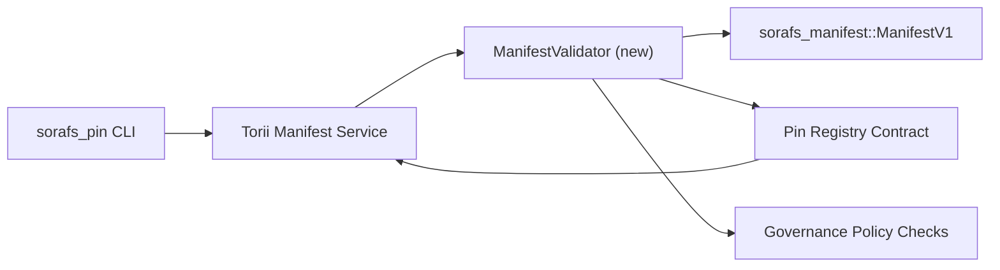

---
id: план проверки-регистрации-пин-кода
заголовок: План проверки деклараций реестра PIN-кодов
Sidebar_label: Проверка реестра PIN-кода
описание: План проверки для входа в ManifestV1 до развертывания реестра контактов SF-4.
---

:::примечание Фуэнте каноника
Эта страница отражает `docs/source/sorafs/pin_registry_validation_plan.md`. Mantén ambas ubicaciones alineadas mientras la documentación hereedada siga active.
:::

# План проверки деклараций реестра PIN-кодов (Подготовка SF-4)

В этом плане опишите необходимые действия для интеграции
`sorafs_manifest::ManifestV1` в будущем контракте с реестром контактов для этого
Работа SF-4 выполняется в существующем инструменте без дублирования логики
кодировать/декодировать.

## Объективос

1. Руты отправки хоста проверяют структуру манифеста,
   разбивая конверты губернатора до получения права собственности.
2. Torii и службы шлюза повторно используют рутинные процедуры проверки.
   для обеспечения совместимости между хостами.
3. Процессы интеграции кубренских положительных/негативных случаев для принятия
   манифесты, соблюдение политики и телеметрия ошибок.

## Архитектура

### Компоненты

- `ManifestValidator` (новый модуль в ящике `sorafs_manifest` или `sorafs_pin`)
  инкапсула структурных проверок и ворот политики.
- Torii демонстрирует конечную точку gRPC `SubmitManifest`, которую вызывает
  `ManifestValidator` перед повторным отправкой контракта.
- Доступ к шлюзу может быть использован дополнительно для проверки подлинности сообщения.
  Al Cachear Nuevos манифестируется из реестра.

## Desglose de Tareas| Тарея | Описание | Ответственный | Эстадо |
|------|-------------|-------------|--------|
| Версия API V1 | Агрегар `validate_manifest(manifest: &ManifestV1, policy: &PinPolicyInputs) -> Result<(), ValidationError>` и `sorafs_manifest`. Включите проверку дайджеста BLAKE3 и поиск в реестре блоков. | Основная инфраструктура | ✅ Хечо | Наши помощники (`validate_chunker_handle`, `validate_pin_policy`, `validate_manifest`) сейчас живут в `sorafs_manifest::validation`. |
| Политический кабель | Подключите политическую конфигурацию реестра (`min_replicas`, отверстия для истечения срока действия, ручки разрешений блоков) и входы проверки. | Управление / Основная инфраструктура | Ожидание — изменение в SORAFS-215 |
| Интеграция Torii | Обратитесь к валидатору посылки манифестов в Torii; Ошибки развертывания Norito были созданы до падения. | Torii Команда | Планирование — изменение в SORAFS-216 |
| Заглушка хоста контракта | Убедитесь, что точка входа в контратаку показывает, что хеш-код проверки упал; экспонер contadores de metricas. | Команда смарт-контрактов | ✅ Хечо | `RegisterPinManifest` сейчас вызывает эль-валидатор компартидо (`ensure_chunker_handle`/`ensure_pin_policy`) до изменения состояния и лос-тестов, унитариев, в случае падения. |
| Тесты | Совокупное тестирование унитарных тестов для валидаторов + случаев trybuild для манифестов недействительных; тесты интеграции на `crates/iroha_core/tests/pin_registry.rs`. | Гильдия контроля качества | 🟠 В процессе | Лос-тесты унитарио дель валидатор атерризарон юнто с лос-реказос в сети; la suite Completea de Integracion Sigue Pendiente. |
| Документы | Actualizar `docs/source/sorafs_architecture_rfc.md` y `migration_roadmap.md` una vez que el validador aterrice; Документация по использованию CLI в `docs/source/sorafs/manifest_pipeline.md`. | Команда Документов | Ожидание — изменение в DOCS-489 |

## Зависимости

- Завершение регистрации номера Norito PIN-кода (ссылка: пункт SF-4 в дорожной карте).
- Конверты реестра блоков для совета (гарантируйте, что отображение действительного морского детерминанта).
- Решения аутентификации Torii для отправки манифестов.

## Рисгос и смягчение последствий

| Рисго | Влияние | Митигасьон |
|--------|---------|------------|
| Различные политические интерпретации между Torii и контрато | Принятие не является детерминистским. | Сравнение ящиков проверки + совокупность тестов интеграции, позволяющих сравнить решения хоста и сети. |
| Регрессия производительности для больших проявлений | Приветствую вас больше всего | Медир по критерию груза; рассмотрите кэширование результатов дайджеста манифеста. |
| Вывод сообщений об ошибках | Путаница операторов | Определите код ошибки Norito; документация в `manifest_pipeline.md`. |

## Объекты хронограммы

- Семана 1: aterrizar el esqueleto `ManifestValidator` + тесты unitarios.
- Семана 2: подключите посылку к Torii и активизируйте CLI для устранения ошибок проверки.
- Семана 3: реализация перехватчиков ошибок, объединение тестов интеграции, актуализация документации.
- Семана 4: сквозное исправление с входом в книгу миграции и получение одобрения совета.Этот план является ссылкой на дорожную карту, которая приведет к началу работы валидатора.