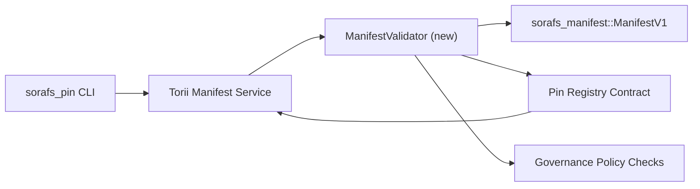

---
id: план проверки-регистрации-пин-кода
заголовок: План проверки деклараций реестра Pin
sidebar_label: Реестр пин-кодов проверки
описание: План проверки для шлюзования ManifestV1 перед развертыванием Pin Registry SF-4.
---

:::note Источник канонический
Эта страница отражена `docs/source/sorafs/pin_registry_validation_plan.md`. Обратите внимание на то, что две точки совпадают с оставшейся активной документацией.
:::

# План проверки деклараций Pin Registry (Подготовка SF-4)

Этот план определяет необходимые этапы для интеграции проверки
`sorafs_manifest::ManifestV1` в контракте Pin Registry, чтобы вернуться к нему
работа SF-4 s'appuie sur letooling существует без дублирования логики
кодировать/декодировать.

## Цели

1. Les chemins de soumission côté hôte verifient la Structure du Manifest, le
   профиль разделения и конверты управления перед приемом файлов
   предложения.
2. Torii и шлюз служб повторно используют процедуры проверки
   для гарантии определенного поведения в доме.
3. Тесты на интеграцию, касающиеся положительных и отрицательных сторон для принятия
   манифестов, политических приложений и телеметрии ошибок.

## Архитектура

### Композиторы

- `ManifestValidator` (новый модуль в корпусе `sorafs_manifest` или `sorafs_pin`)
  заключают в себе структуры контроля и ворота политики.
- Torii предоставляет конечную точку gRPC `SubmitManifest`, которая вызывает обращение.
  `ManifestValidator` перед трансметром или контрактом.
- Вызов шлюза может быть использован для проверки памяти.
  lors de la Mise en Cache de Nouveaux манифестирует из реестра.

## Декупаж ташей| Таче | Описание | Владелец | Статут |
|------|-------------|-------|--------|
| Squelette API V1 | Установите `validate_manifest(manifest: &ManifestV1, policy: &PinPolicyInputs) -> Result<(), ValidationError>` на `sorafs_manifest`. Включите проверку дайджеста BLAKE3 и поиск в реестре блоков. | Основная инфраструктура | ✅ Термине | Частные помощники (`validate_chunker_handle`, `validate_pin_policy`, `validate_manifest`) живут в ужасе в `sorafs_manifest::validation`. |
| Политический кабель | Сопоставление политической конфигурации реестра (`min_replicas`, параметры истечения срока действия, дескрипторы авторизации блоков) и входов проверки. | Управление / Основная инфраструктура | Внимательно — следуйте в SORAFS-215 |
| Интеграция Torii | Appeler le validateur dans le chemin de soumission Torii ; возврат ошибок Norito, структурированных в случае проверки. | Torii Команда | Планирование — управление в SORAFS-216 |
| Заглушка контракта с домом | Убедиться, что вход в контракт отклоняет манифесты, которые подтверждаются хэшем проверки; разоблачитель счетчиков метрик. | Команда смарт-контрактов | ✅ Термине | `RegisterPinManifest` вызовите désormais le validateur partage (`ensure_chunker_handle`/`ensure_pin_policy`) перед muter l'état и унитарными тестами, связанными с cas d'échec. |
| Тесты | Добавление унитарных тестов для валидатора + cas trybuild для недействительных манифестов; тесты интеграции в `crates/iroha_core/tests/pin_registry.rs`. | Гильдия контроля качества | 🟠 Курс | Унитарные тесты проверки подлинности с откатами в цепочке; пакет полной интеграции полностью отдохнул и был внимателен. |
| Документы | Mettre à jour `docs/source/sorafs_architecture_rfc.md` и `migration_roadmap.md` une fois le validateur livré; Документатор по использованию CLI в `docs/source/sorafs/manifest_pipeline.md`. | Команда Документов | Внимательно — следуйте в DOCS-489 |

## Зависимости

- Завершение схемы Norito реестра выводов (ссылка: пункт SF-4 в дорожной карте).
- Конверты реестра блоков подписаны по совету (гарантируйте, что сопоставление определено валидатором).
- Решения аутентификации Torii для получения манифестов.

## Риски и меры по смягчению последствий

| Рискованный | Воздействие | Смягчение последствий |
|--------|--------|------------|
| Различные политические интерпретации между Torii и контрактом | Прием не детерминирован. | Участвуйте в ящике для проверки + проводите тесты интеграции, сравнивающие принимаемые решения по сравнению с онлайн-решениями. |
| Регрессия производительности для больших проявлений | Сумиссы плюс кредиты | Бенчмаркер по критерию груза; предусмотрите кэш результатов манифеста дайджеста. |
| Получение сообщений об ошибках | Оператор путаницы | Определение кодов ошибок Norito ; Документатор в `manifest_pipeline.md`. |

## Календарики

- Semaine 1: livrer le squelette `ManifestValidator` + унитарные тесты.
- Сезон 2: подключите команду вызова Torii и включите CLI для устранения ошибок проверки.
- Сезон 3: внедрение ловушек контракта, добавление тестов по интеграции, просмотр документации.
- Сезон 4: выполнить сквозное повторение с входом в миграционную книгу, получить одобрение совета.Этот план является отсылкой к дорожной карте, которая является трудной задачей валидатора демарра.