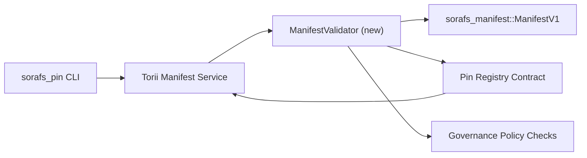

:::note Канонический источник
Эта страница отражает `docs/source/sorafs/pin_registry_validation_plan.md`. Держите оба расположения согласованными, пока наследственная документация остается активной.
:::

# План валидации manifests для Pin Registry (Подготовка SF-4)

Этот план описывает шаги, необходимые для подключения валидации
`sorafs_manifest::ManifestV1` в будущий контракт Pin Registry, чтобы работа SF-4
опиралась на существующий tooling без дублирования логики encode/decode.

## Цели

1. Путь отправки на стороне хоста проверяет структуру manifest, профиль
   chunking и governance envelopes перед принятием предложений.
2. Torii и gateway сервисы переиспользуют те же процедуры валидации для
   детерминированного поведения между хостами.
3. Интеграционные тесты покрывают позитивные/негативные кейсы принятия
   manifests, enforcement политик и телеметрию ошибок.

## Архитектура

### Компоненты

- `ManifestValidator` (новый модуль в crate `sorafs_manifest` или `sorafs_pin`)
  инкапсулирует структурные проверки и policy gates.
- Torii открывает gRPC endpoint `SubmitManifest`, который вызывает
  `ManifestValidator` перед передачей в контракт.
- Путь gateway fetch может опционально использовать тот же валидатор при
  кешировании новых manifests из registry.

## Разбиение задач

| Задача | Описание | Владелец | Статус |
|--------|----------|----------|--------|
| Скелет API V1 | Добавить `validate_manifest(manifest: &ManifestV1, policy: &PinPolicyInputs) -> Result<(), ValidationError>` в `sorafs_manifest`. Включить проверку BLAKE3 digest и lookup chunker registry. | Core Infra | ✅ Сделано | Общие helpers (`validate_chunker_handle`, `validate_pin_policy`, `validate_manifest`) теперь находятся в `sorafs_manifest::validation`. |
| Подключение политики | Смапить конфигурацию политики registry (`min_replicas`, окна истечения, разрешенные chunker handles) в входы валидации. | Governance / Core Infra | В ожидании — отслеживается в SORAFS-215 |
| Интеграция Torii | Вызывать валидатор в пути submission Torii; возвращать структурированные ошибки Norito при сбоях. | Torii Team | Запланировано — отслеживается в SORAFS-216 |
| Заглушка контракта на хосте | Убедиться, что entrypoint контракта отклоняет manifests, не прошедшие хэш валидации; экспонировать счетчики метрик. | Smart Contract Team | ✅ Сделано | `RegisterPinManifest` теперь вызывает общий валидатор (`ensure_chunker_handle`/`ensure_pin_policy`) перед изменением состояния, и unit tests покрывают случаи отказа. |
| Тесты | Добавить unit tests для валидатора + trybuild кейсы для некорректных manifests; интеграционные тесты в `crates/iroha_core/tests/pin_registry.rs`. | QA Guild | 🟠 В процессе | Unit tests валидатора добавлены вместе с on-chain отказами; полноценная интеграционная suite пока в ожидании. |
| Документация | Обновить `docs/source/sorafs_architecture_rfc.md` и `migration_roadmap.md` после внедрения валидатора; описать CLI в `docs/source/sorafs/manifest_pipeline.md`. | Docs Team | В ожидании — отслеживается в DOCS-489 |

## Зависимости

- Финализация Norito схемы Pin Registry (ref: пункт SF-4 в roadmap).
- Подписанные council envelopes для chunker registry (гарантируют детерминированное сопоставление в валидаторе).
- Решения по аутентификации Torii для submission manifests.

## Риски и меры

| Риск | Влияние | Митигирование |
|------|---------|---------------|
| Разная интерпретация политики между Torii и контрактом | Недетерминированное принятие. | Делить crate валидации + добавить интеграционные тесты сравнения решений host vs on-chain. |
| Регрессия производительности для больших manifests | Более медленные submission | Бенчмарк через cargo criterion; рассмотреть кеширование результатов digest manifest. |
| Дрейф сообщений об ошибках | Путаница у операторов | Определить коды ошибок Norito; задокументировать в `manifest_pipeline.md`. |

## Цели по времени

- Неделя 1: приземлить скелет `ManifestValidator` + unit tests.
- Неделя 2: подключить submission путь Torii и обновить CLI для отображения ошибок валидации.
- Неделя 3: реализовать hooks контракта, добавить интеграционные тесты, обновить docs.
- Неделя 4: провести end-to-end репетицию с записью в migration ledger и получить одобрение совета.

Этот план будет указан в roadmap после старта работ по валидатору.
