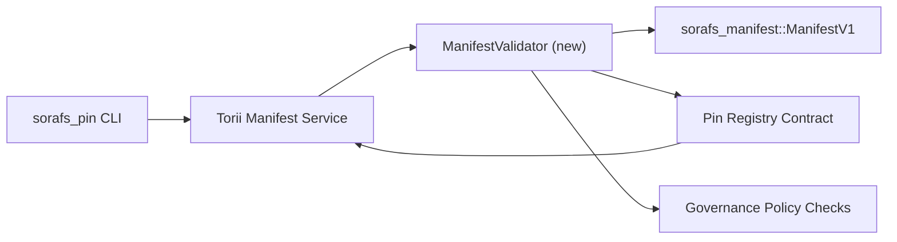

---
id: план проверки-регистрации-пин-кода
title: План проверки деклараций по реестру контактов
Sidebar_label: Проверка реестра контактов
описание: План проверки для блокировки ManifestV1 перед развертыванием в реестре контактов SF-4.
---

:::примечание Fonte canonica
Эта страница написана `docs/source/sorafs/pin_registry_validation_plan.md`. Mantenha ambos os locais alinhados enquanto a documentacao herdada permanecer ativa.
:::

# План проверки деклараций для регистрации контактов (Подготовка SF-4)

В этом плане необходимо определить необходимые для интеграции и подтверждения пропуски.
`sorafs_manifest::ManifestV1` нет будущего контракта с Pin Registry для того, чтобы
Работа SF-4 базируется без каких-либо инструментов и может быть дубликатом и логикой
кодировать/декодировать.

## Объективос

1. Os caminhos de envio no host verificam a estrutura do Manife, или Perfil de
   разрывая конверты правительства до того, как они будут предложены.
2. Torii и сервисы шлюза повторно используются в качестве сообщений проверки подлинности для
   гарантированная совместимость между хостами.
3. Интегрированные тесты могут быть положительными/отрицательными для достижения успеха.
   манифесты, применение политики и телеметрия ошибок.

## Аркитетура

### Компоненты

- `ManifestValidator` (ново по модулю без ящика `sorafs_manifest` или `sorafs_pin`)
  инкапсула проверяет структуру и ворота политики.
- Torii выставляет конечную точку gRPC `SubmitManifest` que chama
  `ManifestValidator` перед тем, как попасть в контрато.
- Чтобы получить доступ к шлюзу, можно дополнительно или еще один валидатор.
  кэшар новос манифестирует виндос делать реестр.

## Десдобраменто де тарефас| Тарефа | Описание | Ответственный | Статус |
|--------|-----------|-------------|--------|
| Версия API V1 | Дополнительный `validate_manifest(manifest: &ManifestV1, policy: &PinPolicyInputs) -> Result<(), ValidationError>` и `sorafs_manifest`. Включите проверку дайджеста BLAKE3 и поиск в реестре блоков. | Основная инфраструктура | Заключение | Помощники по сопоставлению (`validate_chunker_handle`, `validate_pin_policy`, `validate_manifest`) агора живем в `sorafs_manifest::validation`. |
| Политическая проводка | Введите политическую конфигурацию реестра (`min_replicas`, поля истечения срока действия, дескрипторы разрешенных фрагментов) для ввода данных проверки. | Управление / Основная инфраструктура | Пенденте - растрачено на SORAFS-215 |
| Интеграция Torii | Chamar o validador no Caminho de Submissao Torii; вернуть ошибки Norito, которые были устранены. | Torii Команда | Планехадо - растрачено на SORAFS-216 |
| Заглушка хоста контракта | Гарантия, что точка входа в противоречие подтверждает отсутствие хэша проверки; Экспорт контадоров де метрики. | Команда смарт-контрактов | Заключение | `RegisterPinManifest`, прежде чем призвать к проверке соответствия (`ensure_chunker_handle`/`ensure_pin_policy`) до мутара или состояния и унитарных тестов, связанных с случаями отказа. |
| Тесты | Дополнительные унитарные тесты для проверки + случаи trybuild для выявления недействительных; Интегрированные тесты на `crates/iroha_core/tests/pin_registry.rs`. | Гильдия контроля качества | В прогрессе | Os testes unitarios do validador chegaram junto com rejeicoes on-chain; полный комплексный люкс, расположенный в следующем конце. |
| Документы | Установите `docs/source/sorafs_architecture_rfc.md` и `migration_roadmap.md`, когда вы получите подтверждение; Документируйте использование CLI в `docs/source/sorafs/manifest_pipeline.md`. | Команда Документов | Пенденте - растрачено в DOCS-489 |

## Зависимости

- Завершение создания реестра контактов Norito (ссылка: пункт SF-4 без дорожной карты).
- Конверты вносятся в реестр блоков в соответствии с требованиями (гарантированное определение карты для проверки).
- Решения об аутентификации Torii для подачи манифестов.

## Риски и смягчение последствий

| Риско | Влияние | Митигакао |
|-------|---------|-----------|
| Различные политические интерпретации между Torii и контрато | Aceitacao nao deterministica. | Сравните ящик проверки + дополнительные тесты интеграции для сравнения решений хоста и сети. |
| Регресс производительности для больших проявлений | Отправить больше новостей | Медир по критерию груза; рассмотрите кэширование результатов дайджеста, которые проявляются. |
| Вывод сообщений об ошибках | Запутался оператор | Определите код ошибки Norito; документация по `manifest_pipeline.md`. |

## Метахронограммы

- Семана 1: Entregar или esqueleto `ManifestValidator` + унитарные тесты.
- Семана 2: интеграция файла отправки с номером Torii и настройка CLI для экспорта ошибок проверки.
- Семана 3: реализация хуков для контрато, дополнительные интеграционные тесты, актуализация документов.
- Семана 4: сквозной доступ к миграционному реестру и получение одобрения по совету.

Этот план является референсом без дорожной карты, которая предполагает работу по валидации автомобиля.