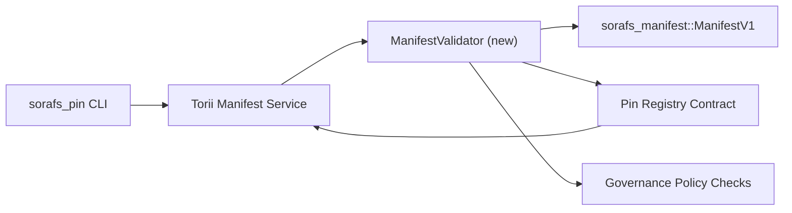

---
id: план проверки-регистрации-пин-кода
title: План валидации манифестов для Pin Registry
sidebar_label: Проверка реестра контактов
описание: План валидации для шлюза ManifestV1 перед развертыванием реестра контактов SF-4.
---

:::note Канонический источник
На этой странице отражено `docs/source/sorafs/pin_registry_validation_plan.md`. Держите оба соглашения, пока наследственная документация остается активной.
:::

# План валидации манифестов для Pin Registry (Подготовка SF-4)

В этом плане описаны шаги, необходимые для валидации подключения.
`sorafs_manifest::ManifestV1` в будущем контракте Pin Registry, для работы SF-4
опиралась на существующий инструментарий без дублирования логики кодирования/декодирования.

## Цели

1. Поместите данные на сторону хоста в виде манифеста, профиля.
   разделение на фрагменты и конверты управления перед составлением предложений.
2. Torii и сервисы шлюза используют одни и те же процедуры проверки для
   определенное поведение между хостами.
3. Интеграционные тесты выявляют положительные/негативные ключи принятия
   манифесты, политика исполнения и телеметрия ошибок.

## Архитектура

### Компоненты

- `ManifestValidator` (новый модуль в ящике `sorafs_manifest` или `sorafs_pin`)
  инкапсулирует структурные проверки и шлюзы политик.
- Torii вызывает конечную точку gRPC `SubmitManifest`, которая возникает
  `ManifestValidator` перед передачей в контракт.
- Путь выборки шлюза может опционально использовать тот же валидатор при
  кеширование новых манифестов из реестра.

## Разбиение задач| Задача | Описание | Владелец | Статус |
|--------|----------|----------|--------|
| API скелета V1 | Добавить `validate_manifest(manifest: &ManifestV1, policy: &PinPolicyInputs) -> Result<(), ValidationError>` в `sorafs_manifest`. Включите проверку дайджеста BLAKE3 и поиск в реестре чанкеров. | Основная инфраструктура | ✅ Сделано | Общие помощники (`validate_chunker_handle`, `validate_pin_policy`, `validate_manifest`) теперь находятся в `sorafs_manifest::validation`. |
| Включение политики | Смапить конфигурацию реестра политики (`min_replicas`, окна истечения, разрешенные дескрипторы чанкеров) во входах валидации. | Управление / Основная инфраструктура | В ожидании — отслеживается в SORAFS-215 |
| Интеграция Torii | Вызывать валидатор в пути подачи Torii; вернуть структурированные ошибки Norito при сбоях. | Torii Команда | Запланировано — отслеживается в SORAFS-216 |
| Заглушка контракта на хосте | Убедиться, что точка входа контракта отклоняет манифесты, не прошедшие хэш-валидацию; экспонировать счетчики метрики. | Команда смарт-контрактов | ✅ Сделано | `RegisterPinManifest` теперь вызывает общий валидатор (`ensure_chunker_handle`/`ensure_pin_policy`) перед изменением состояния, и модульные тесты обнаруживают случаи отказа. |
| Тесты | Добавить модульные тесты для валидатора + ключи trybuild для некорректных манифестов; интеграционные тесты в `crates/iroha_core/tests/pin_registry.rs`. | Гильдия контроля качества | 🟠 В процессе | Модульные тесты валидатора добавлены вместе с ончейн-отказами; полноценный интеграционный пакет пока в ожидании. |
| Документация | Обновить `docs/source/sorafs_architecture_rfc.md` и `migration_roadmap.md` после завершения валидатора; Опишите CLI в `docs/source/sorafs/manifest_pipeline.md`. | Команда Документов | В ожидании — отслеживается в DOCS-489 |

## Зависимости

- Финализация Norito схемы Pin Registry (ссылка: пункт SF-4 в дорожной карте).
- Подписанные конверты совета для реестра чанкеров (гарантируют определение парламента в валидаторе).
- Решения по аутентификации Torii для подачи манифестов.

## Фигки и меры

| Риск | Оценка | Митигирование |
|------|---------|---------------|
| Разная интерпретация политики между Torii и контрактом | Недетерминированное принятие. | Разделить набор валидаций + добавить интеграционные тесты для сравнения решений хоста и ончейна. |
| Регрессия производительности для больших манифестов | Более слабые представления | Бенчмарк по грузовому критерию; следить за кешированием результатов дайджеста манифеста. |
| Дрейф сообщений об ошибках | Путаница у операторов | Определить коды ошибок Norito; задокументировать в `manifest_pipeline.md`. |

## Цели по времени

- Неделя 1: приземлить скелет `ManifestValidator` + юнит-тесты.
- Неделя 2: подключение пути отправки Torii и обновление CLI для отображения ошибок валидации.
- Неделя 3: реализация контракта на хуки, добавление интеграционных тестов, обновление документации.
- Неделя 4: провести сквозное повторение с записью в миграционном журнале и получить одобрение совета.

Этот план будет указан в дорожной карте после начала работ по проверке.