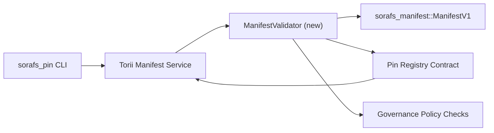

---
id: план проверки-регистрации-пин-кода
title: Реестр выводов, в котором отображается информация о состоянии
Sidebar_label: Реестр контактов
описание: Развертывание реестра выводов SF-4.
---

:::примечание
یہ صفحہ `docs/source/sorafs/pin_registry_validation_plan.md` کی عکاسی کرتا ہے۔ جب تک پرامات کو ہم آہنگ رکھیں۔
:::

# План проверки манифеста реестра контактов (подготовка SF-4)

یہ منصوبہ وہ اقدامات کرتا ہے جو `sorafs_manifest::ManifestV1` کی توثیق کو
Если вы хотите использовать реестр контактов, выберите SF-4 или используйте его.
Инструменты для кодирования/декодирования, необходимые для кодирования/декодирования.

## مقاصد

1. Отправка на стороне хоста манифеста, профиля фрагментации и управления.
   конверты کو предложения قبول کرنے سے پہلے проверить کرتے ہیں۔
2. Torii Запуск шлюза и процедуры проверки, необходимые для проверки.
   хосты کے درمیان детерминированное поведение برقرار رہے۔
3. Интеграционные тесты, необходимые для подтверждения или принятия декларации о приемке.
   Применение политики, телеметрия ошибок شامل ہیں۔

## Архитектура

### Компоненты

- `ManifestValidator` (`sorafs_manifest` یا `sorafs_pin` ящик для хранения)
  Политические ворота могут инкапсулировать کرتا ہے۔
- Torii — конечная точка gRPC. `SubmitManifest` — выставляется вперед.
  `ManifestValidator` کو کال کرتا ہے۔
- Путь выборки шлюза (опционально) и валидатор, доступный в реестре.
  نئے манифестирует кэш کیے جائیں۔

## Разбивка задач

| Задача | Описание | Владелец | Статус |
|------|-------------|-------|--------|
| Скелет API V1 | `sorafs_manifest` - `validate_manifest(manifest: &ManifestV1, policy: &PinPolicyInputs) -> Result<(), ValidationError>` شامل کریں۔ Проверка дайджеста BLAKE3 и поиск в реестре чанкеров. | Основная инфраструктура | ✅ Готово | Дополнительные помощники (`validate_chunker_handle`, `validate_pin_policy`, `validate_manifest`) и `sorafs_manifest::validation`. |
| Политика проводки | Конфигурация политики реестра (`min_replicas`, окна истечения срока действия, разрешенные дескрипторы чанкеров) и входные данные проверки и карта данных. | Управление / Основная инфраструктура | На рассмотрении — SORAFS-215 میں ٹریکڈ |
| Torii интеграция | Torii Путь отправки для проверки подлинности сбой پر структурированные ошибки Norito واپس کریں۔ | Torii Команда | Планируется — SORAFS-216 میں ٹریکڈ |
| Заглушка хост-контракта | Отказ от точки входа в контракт, отклонение манифестов и хэш проверки, сбой. счетчики метрик | Команда смарт-контрактов | ✅ Готово | `RegisterPinManifest` — изменение состояния, общий валидатор (`ensure_chunker_handle`/`ensure_pin_policy`) и список случаев сбоя модульных тестов. ہیں۔ |
| Тесты | валидатор, модульные тесты + недопустимые манифесты, примеры trybuild и т. д. `crates/iroha_core/tests/pin_registry.rs` Интеграционные тесты. | Гильдия контроля качества | 🟠 В процессе | модульные тесты валидатора ончейн-тесты отклонения Полный пакет интеграции |
| Документы | Валидатор может быть установлен `docs/source/sorafs_architecture_rfc.md` или `migration_roadmap.md`. Интерфейс командной строки `docs/source/sorafs/manifest_pipeline.md` | Команда Документов | Ожидается — DOCS-489 Документ |

## Зависимости- Схема реестра контактов Norito (ссылка: дорожная карта SF-4 آئٹم)۔
- Конверты реестра чанкеров, подписанные Советом (сопоставление валидатора или детерминированный вариант)۔
- Отправка манифеста или проверка подлинности Torii.

## Риски и меры по их снижению

| Риск | Воздействие | Смягчение последствий |
|------|--------|------------|
| Torii کنٹریکٹ کے درمیان интерпретация политики میں فرق | Недетерминированная приемка۔ | Крейт проверки Проверка + хост против сети |
| بڑے проявляется کے لیے снижение производительности | Представление критерий груза سے эталон کریں؛ Кэш результатов дайджеста манифеста |
| Дрейф сообщений об ошибках | Операторы میں کنفیوژن | Коды ошибок Norito определяют ошибку. `manifest_pipeline.md` Дополнительный документ |

## Цели временной шкалы

- Неделя 1: скелет `ManifestValidator` + модульные тесты.
- Неделя 2: Torii путь отправки. Проверка CLI и ошибки проверки.
- Неделя 3: контрактные перехватчики реализуют необходимые интеграционные тесты. Дополнительная информация.
- Неделя 4: внесение в миграционную книгу сквозная репетиция и подписание совета в совете.

یہ Воспользуйтесь валидатором, чтобы получить дорожную карту, чтобы узнать, как это сделать.