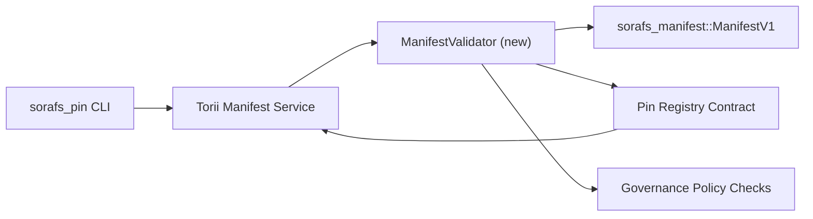

---
ID: پن رجسٹری-توثیق کا منصوبہ
عنوان: پن رجسٹری میں ظاہر ہونے کی تصدیق کے لئے اسکیم
سائڈبار_لیبل: پن رجسٹری چیک کریں
تفصیل: SF-4 کے اندر پن رجسٹری لانچ کرنے سے پہلے مینیفیسٹ وی 1 پر پابندی لگانے کا توثیق کا منصوبہ۔
---

::: منظور شدہ ماخذ کو نوٹ کریں
یہ صفحہ `docs/source/sorafs/pin_registry_validation_plan.md` کی عکاسی کرتا ہے۔ جب تک پرانی دستاویزات موثر ہوں تب تک دونوں سائٹوں کے مابین سیدھ کو برقرار رکھیں۔
:::

# پن رجسٹری (SF-4 تیاری) میں منشور کی تصدیق کرنے کا منصوبہ

اس منصوبے میں `sorafs_manifest::ManifestV1` کی توثیق کے لئے درکار اقدامات کا خاکہ پیش کیا گیا ہے
آئندہ پن رجسٹری یہاں تک کہ موجودہ ٹولنگ کے مقابلے میں SF-4 کی فعالیت پر بھی منطق کی نقل تیار کرتا ہے
انکوڈ/ڈیکوڈ۔

## مقاصد

1. میزبان کے ٹرانسمیشن کے راستے مینی فیسٹ ڈھانچے ، چنکنگ فائل اور لفافوں کی تصدیق کرتے ہیں
   تجاویز کو قبول کرنے سے پہلے حکمرانی۔
2. Torii خدمات اور گیٹ وے ایک ہی توثیق کے معمولات کو دوبارہ استعمال کرتے ہیں تاکہ اس کو یقینی بنائیں
   میزبان
3. انضمام کے ٹیسٹوں کو قبول کرنے کے مثبت اور منفی معاملات اور درخواست کو قبول کرنے کے مثبت اور منفی معاملات کا احاطہ کیا گیا ہے
   پالیسیاں اور ٹیلی میٹرک غلطیاں۔

## آرکیٹیکچرل

### اجزاء

- `ManifestValidator` (کریٹ `sorafs_manifest` میں نیا یونٹ یا `sorafs_pin`)
  ساختی چیکوں اور پالیسی کے دروازوں کو گھیرے میں لیتے ہیں۔
- Torii GRPC اختتامی نقطہ کو `SubmitManifest` کالز کے بطور دکھاتا ہے
  معاہدہ بھیجنے سے پہلے `ManifestValidator`۔
- گیٹ وے میں بازیافت کا راستہ اختیاری طور پر ایک ہی توثیق کنندہ کو استعمال کرسکتا ہے جب ظاہر ہوتا ہے
  رجسٹری سے نیا۔

## کاموں کی تقسیم

| ٹاسک | تفصیل | مالک | حیثیت |
| ------ | ------- | -------- | -------- |
| API V1 ڈھانچہ | `validate_manifest(manifest: &ManifestV1, policy: &PinPolicyInputs) -> Result<(), ValidationError>` کو `sorafs_manifest` میں شامل کریں۔ بلیک 3 ڈائجسٹ چیک اور چنکر رجسٹری کے لئے تلاش شامل کریں۔ | کور انفرا | ✅ کیا ہوا | باہمی ایڈز (`validate_chunker_handle` ، `validate_pin_policy` ، `validate_manifest`) اب `sorafs_manifest::validation` پر رہتے ہیں۔ |
| ترسیل کی پالیسی | تصدیقی اندراجات کے ساتھ رجسٹری پالیسی کی ترتیبات (`min_replicas` ، میعاد ختم ہونے والی ونڈوز ، ہینڈلز کی اجازت)۔ | گورننس / کور انفرا | ہولڈ پر-Sorafs-215 پر جاری ہے
| انضمام Torii | بھیجنے والے راستے پر کال کرنے والے کو کال کریں Torii ؛ ناکامی پر Norito غلطیوں کو دوبارہ ترتیب دیں۔ | Torii ٹیم | اسکیم-اس کے بعد Sorafs-216 |
| میزبان رکھنے کے لئے اسٹب | اس بات کو یقینی بنانا کہ نوڈ کے داخلی نقطہ کو مسترد کرتا ہے جو ہیش کی توثیق میں ناکام رہتا ہے۔ اور میٹر کو بے نقاب کریں۔ | سمارٹ معاہدہ ٹیم | ✅ کیا ہوا | `RegisterPinManifest` اب ریاست کی تبدیلی اور یونٹ ٹیسٹوں میں ناکامیوں سے پہلے مشترکہ جائز (`ensure_chunker_handle`/`ensure_pin_policy`) کو کال کرتا ہے۔ |
| ٹیسٹ | غلط منشور کے ل valid جائز + ٹربولڈ مثالوں میں یونٹ ٹیسٹ شامل کریں۔ `crates/iroha_core/tests/pin_registry.rs` میں انضمام کے ٹیسٹ۔ | QA گلڈ | provide کام میں کام کرنا | ویلڈیٹر یونٹ ٹیسٹ آن چین مسترد ہونے کے ساتھ پہنچے۔ مکمل انضمام سویٹ ابھی بھی انتظار کر رہا ہے۔ |
| دستاویزات | آڈیٹر تک رسائی کے بعد `docs/source/sorafs_architecture_rfc.md` اور `migration_roadmap.md` کو اپ ڈیٹ کریں۔ `docs/source/sorafs/manifest_pipeline.md` میں CLI کے استعمال کی دستاویزات۔ | دستاویزات ٹیم | ہولڈ پر-DOCS-489 پر جاری ہے

## انحصار

- پن رجسٹری Norito کا حتمی شکل (حوالہ: RoadMap میں SF-4 آئٹم)۔
- بورڈ کے ذریعہ دستخط شدہ لفافے چنکر لاگ (اس بات کو یقینی بناتے ہوئے کہ تصدیق کنندہ میں اسائنمنٹ عین مطابق ہے)۔
- Torii توثیق کے فیصلے ظاہر کرنے کے لئے۔

## رسک اور تخفیف| خطرہ | اثر | کمزوری |
| ------- | ------- | --------- |
| Torii اور معاہدہ کے مابین پالیسی کی مختلف تشریح | غیر تصادم کی قبولیت۔ | شیئر کریٹ کی توثیق + انضمام کے ٹیسٹ شامل کریں جو میزبان بمقابلہ چین کے فیصلوں کا موازنہ کرتے ہیں۔ |
| بڑے منشوروں کے لئے کارکردگی کا انحطاط آہستہ بھیجیں | کارگو معیار کے ذریعے پیمائش ؛ ظاہر کے لئے ہضم کے نتائج کو ذخیرہ کرنے پر غور کریں۔ |
| غلطی کے پیغامات skew | آپریٹرز الجھن | غلطی کوڈز کی تعریف Norito ؛ `manifest_pipeline.md` پر دستاویزی۔ |

## ٹائم لائن اہداف

- ہفتہ 1: `ManifestValidator` ڈھانچہ ڈاؤن لوڈ + یونٹ ٹیسٹ۔
- ہفتہ 2: Torii ٹرانسمیشن کے راستے سے رابطہ کریں اور تصدیق کی غلطیاں ظاہر کرنے کے لئے CLI کو اپ ڈیٹ کریں۔
- ہفتہ 3: معاہدے کے لئے ہکس کو نافذ کرنا ، انضمام کے ٹیسٹ شامل کرنا ، دستاویزات کو اپ ڈیٹ کرنا۔
-ہفتہ 4: ہجرت لیجر میں داخلے کے ساتھ اختتام سے آخر میں ورزش کریں اور بورڈ کی منظوری حاصل کریں۔

جب آڈیٹر اپنے کام کا آغاز کرے گا تو اس منصوبے کا روڈ میپ میں حوالہ دیا جائے گا۔