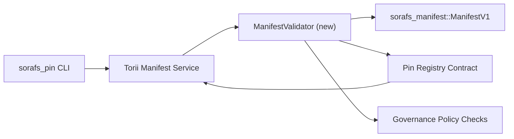

---
ID: پن رجسٹری-توثیق کا منصوبہ
عنوان: پن رجسٹری ظاہر توثیق کا منصوبہ
سائڈبار_لیبل: رجسٹری پن کی توثیق
تفصیل: SF-4 رجسٹری پن رول آؤٹ سے قبل مینیفیسٹ وی 1 گیٹنگ کے لئے توثیق کا منصوبہ۔
---

::: نوٹ کینونیکل ماخذ
یہ صفحہ `docs/source/sorafs/pin_registry_validation_plan.md` کی عکاسی کرتا ہے۔ جب لیگیسی دستاویزات ابھی بھی متحرک ہیں تو دونوں مقامات کو سیدھ میں رکھیں۔
:::

# پن رجسٹری منشور کی توثیق کا منصوبہ (SF-4 تیاری)

اس منصوبے میں توثیق کو مربوط کرنے کے لئے درکار اقدامات کی وضاحت کی گئی ہے
مستقبل میں پن رجسٹری معاہدہ میں `sorafs_manifest::ManifestV1`
SF-4 کام منطق کی نقل کے بغیر موجودہ ٹولنگ پر انحصار کرتا ہے
انکوڈ/ڈیکوڈ۔

## مقاصد

1. میزبان بھیجنے والے راستے مینی فیسٹ ڈھانچے ، پروفائل کی تصدیق کرتے ہیں
   تجاویز کو قبول کرنے سے پہلے چنکنگ اور گورننس لفافے۔
2. Torii اور گیٹ وے سروسز ایک ہی توثیق کے معمولات کو دوبارہ استعمال کریں
   میزبانوں کے مابین تعصب پسندانہ سلوک کو یقینی بنانا۔
3. انضمام کے ٹیسٹ قبولیت کے ل positive مثبت/منفی معاملات کا احاطہ کرتے ہیں
   ظاہر ، پالیسی نافذ کرنے والے اور غلطی ٹیلی میٹری۔

## فن تعمیر

### اجزاء

- `ManifestValidator` (کریٹ `sorafs_manifest` یا `sorafs_pin` میں نیا ماڈیول)
  اس میں ساختی چیک اور پالیسی کے دروازوں کا احاطہ کیا گیا ہے۔
- Torii ایک GRPC اختتامی نقطہ `SubmitManifest` کو بے نقاب کرتا ہے جو کال کرتا ہے
  معاہدہ کرنے سے پہلے `ManifestValidator`۔
- گیٹ وے بازیافت کا راستہ اختیاری طور پر ایک ہی توثیق کنندہ کو استعمال کرسکتا ہے
  جب رجسٹری سے نیا ظاہر ہوتا ہے۔

## ٹاسک خرابی| ٹاسک | تفصیل | ذمہ دار | حیثیت |
| ------ | --------------- | ------------- | -------- |
| API V1 کنکال | `validate_manifest(manifest: &ManifestV1, policy: &PinPolicyInputs) -> Result<(), ValidationError>` کو `sorafs_manifest` میں شامل کریں۔ بلیک 3 ڈائجسٹ کی توثیق اور چنکر رجسٹری کی تلاش شامل کریں۔ | کور انفرا | ✅ کیا ہوا | مشترکہ مددگار (`validate_chunker_handle` ، `validate_pin_policy` ، `validate_manifest`) اب `sorafs_manifest::validation` پر رہتے ہیں۔ |
| سیاسی وائرنگ | نقشہ رجسٹری پالیسی کی ترتیبات (`min_replicas` ، میعاد ختم ہونے والی ونڈوز ، چنکر ہینڈلز کی اجازت) توثیق کے اندراجات کو۔ | گورننس / کور انفرا | زیر التواء-Sorafs-215 میں ٹریک کیا گیا
| انضمام Torii | Torii میں مینی فیسٹ جمع کرانے کے اندر توثیق کنندہ کو کال کریں۔ ناکامیوں پر ساختہ غلطیاں Norito واپس کریں۔ | Torii ٹیم | منصوبہ بند-Sorafs-216 میں ٹریک کیا گیا |
| میزبان معاہدہ اسٹب | اس بات کو یقینی بنائیں کہ معاہدہ کے داخلے کے نقطہ نظر کو مسترد کرتا ہے جو توثیق ہیش میں ناکام ہوجاتے ہیں۔ میٹرک کاؤنٹرز کو بے نقاب کریں۔ | سمارٹ معاہدہ ٹیم | ✅ کیا ہوا | `RegisterPinManifest` اب ریاست اور یونٹ ٹیسٹوں میں تبدیلی سے پہلے مشترکہ جائز (`ensure_chunker_handle`/`ensure_pin_policy`) کی درخواست کرتا ہے۔ |
| ٹیسٹ | باضابطہ مظہروں کے لئے توثیق کرنے والے + ٹر بلڈ کیسز کے لئے یونٹ ٹیسٹ شامل کریں۔ `crates/iroha_core/tests/pin_registry.rs` میں انضمام کے ٹیسٹ۔ | QA گلڈ | 🟠 ترقی میں | ویلڈیٹر یونٹ ٹیسٹ آن چین کے رد re ی کے ساتھ ساتھ اترے۔ مکمل انضمام سویٹ ابھی زیر التوا ہے۔ |
| دستاویزات | ایک بار توثیق کرنے والے کی اترنے کے بعد `docs/source/sorafs_architecture_rfc.md` اور `migration_roadmap.md` کو اپ ڈیٹ کریں۔ `docs/source/sorafs/manifest_pipeline.md` پر دستاویز CLI استعمال۔ | دستاویزات ٹیم | زیر التواء-دستاویزات -489 پر ٹریک کیا گیا |

## انحصار

- Norito رجسٹری پن اسکیم (REF: آئٹم SF-4 روڈ میپ میں) کو حتمی شکل دینا۔
- کونسل کے ذریعہ دستخط شدہ چنکر رجسٹری لفافے (اس بات کو یقینی بناتا ہے کہ توثیق کرنے والے کی نقشہ سازی کا تعی .ن ہے)۔
- Torii منشور بھیجنے کے لئے توثیق کے فیصلے۔

## خطرات اور تخفیف

| خطرہ | اثر | تخفیف |
| -------- | --------- | ------------- |
| Torii اور معاہدہ کے درمیان پالیسی کی مختلف تشریح | غیر تصادم کی قبولیت۔ | توثیق کریٹ شیئر کریں + انضمام کے ٹیسٹ شامل کریں جو میزبان بمقابلہ آن چین کے فیصلوں کا موازنہ کریں۔ |
| بڑے منشور کے لئے کارکردگی کا رجعت | سست شپنگ | چارج کے معیار کے ذریعے پیمائش ؛ کیچنگ مینی فیسٹ ڈائجسٹ کے نتائج پر غور کریں۔ |
| بہتی غلطی کے پیغامات | آپریٹر الجھن | غلطی کوڈز کی وضاحت Norito ؛ ان کو `manifest_pipeline.md` میں دستاویز کریں۔ |

## شیڈول اہداف

- ہفتہ 1: کنکال `ManifestValidator` + یونٹ ٹیسٹ لینڈ کرنا۔
- ہفتہ 2: Torii پر بھیجیں اور توثیق کی غلطیوں کو ظاہر کرنے کے لئے CLI کو اپ ڈیٹ کریں۔
- ہفتہ 3: معاہدے کے ہکس کو نافذ کریں ، انضمام کے ٹیسٹ شامل کریں ، دستاویزات کو اپ ڈیٹ کریں۔
-ہفتہ 4: ہجرت لیجر میں داخلے کے ساتھ اختتام سے آخر میں ٹرائل چلائیں اور بورڈ کی منظوری حاصل کریں۔ایک بار توثیق کنندہ کا کام شروع ہونے کے بعد اس منصوبے کا روڈ میپ میں حوالہ دیا جائے گا۔