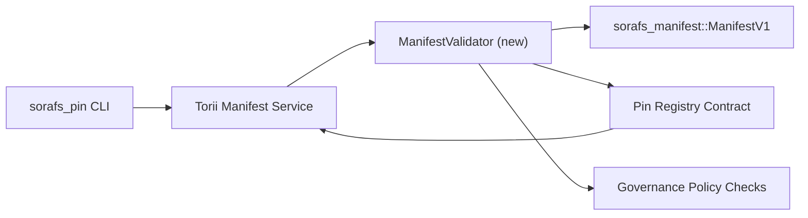

---
ID: پن رجسٹری-توثیق کا منصوبہ
عنوان: پن رجسٹری ظاہر توثیق کا منصوبہ
سائڈبار_لیبل: توثیق پن رجسٹری
تفصیل: پن رجسٹری SF-4 رول آؤٹ سے پہلے مینیفیسٹ وی 1 گیٹنگ کے لئے توثیق کا منصوبہ۔
---

::: نوٹ کینونیکل ماخذ
یہ صفحہ `docs/source/sorafs/pin_registry_validation_plan.md` کی عکاسی کرتا ہے۔ جب تک میراثی دستاویزات فعال رہیں تب تک دونوں مقامات کو منسلک رکھیں۔
:::

# پن رجسٹری مینی فیسٹ توثیق کا منصوبہ (تیاری SF-4)

اس منصوبے میں توثیق کو مربوط کرنے کے لئے ضروری اقدامات کی وضاحت کی گئی ہے
`sorafs_manifest::ManifestV1` آئندہ پن رجسٹری کے معاہدے میں
SF-4 کام موجودہ ٹولنگ پر منطق کی نقل تیار کیے بغیر تعمیر کرتا ہے
انکوڈ/ڈیکوڈ۔

## مقاصد

1. میزبان سائیڈ جمع کرانے والے راستے مینی فیسٹ ڈھانچے کی جانچ کریں ،
   قبول کرنے سے پہلے چنکنگ پروفائل اور گورننس لفافے
   تجاویز
2. Torii اور گیٹ وے سروسز ایک ہی توثیق کے معمولات کو دوبارہ استعمال کریں
   میزبانوں کے مابین تعصب پسندانہ سلوک کی ضمانت دینا۔
3. انضمام کی جانچ قبولیت کے ل positive مثبت/منفی معاملات کا احاطہ کرتی ہے
   ظاہر ، پالیسی نفاذ ، اور غلطی ٹیلی میٹری۔

## فن تعمیر

### اجزاء

- `ManifestValidator` (کریٹ `sorafs_manifest` یا `sorafs_pin` میں نیا ماڈیول)
  ساختی کنٹرولوں اور پالیسی کے دروازوں کو گھیرے میں لیتے ہیں۔
- Torii ایک GRPC اختتامی نقطہ `SubmitManifest` کو بے نقاب کرتا ہے جو کال کرتا ہے
  `ManifestValidator` معاہدے میں منتقل کرنے سے پہلے۔
- گیٹ وے بازیافت کا راستہ اختیاری طور پر ایک ہی توثیق کار کو استعمال کرسکتا ہے
  جب رجسٹری سے نیا ظاہر ہوتا ہے۔

## کاموں کی خرابی| ٹاسک | تفصیل | مالک | حیثیت |
| ------ | ------------- | ------- | -------- |
| API V1 کنکال | `validate_manifest(manifest: &ManifestV1, policy: &PinPolicyInputs) -> Result<(), ValidationError>` کو `sorafs_manifest` میں شامل کریں۔ بلیک 3 ڈائجسٹ چیک اور چنکر رجسٹری کی تلاش شامل کریں۔ | کور انفرا | ✅ کیا ہوا | مشترکہ مددگار (`validate_chunker_handle` ، `validate_pin_policy` ، `validate_manifest`) اب `sorafs_manifest::validation` میں رہتے ہیں۔ |
| پالیسی وائرنگ | نقشہ رجسٹری پالیسی کی ترتیب (`min_replicas` ، میعاد ختم ہونے والی ونڈوز ، چنکر ہینڈلز کی اجازت) توثیق اندراجات کو۔ | گورننس / کور انفرا | انتظار-Sorafs-215 میں ٹریک کیا گیا
| انضمام Torii | PATH Torii میں جمع کروانے والے کو کال کریں۔ ناکامی پر سٹرکچرڈ Norito غلطیاں واپس کریں۔ | Torii ٹیم | منصوبہ بند-Sorafs-216 میں ٹریک کیا گیا |
| میزبان سائیڈ معاہدہ اسٹب | اس بات کو یقینی بنائیں کہ معاہدے کے اندراج سے ظاہر ہوتا ہے کہ جو کمٹ ہیش میں ناکام رہتا ہے۔ میٹرک کاؤنٹرز کو بے نقاب کریں۔ | سمارٹ معاہدہ ٹیم | ✅ کیا ہوا | `RegisterPinManifest` اب مشترکہ جائز (`ensure_chunker_handle`/`ensure_pin_policy`) کی درخواست کرتا ہے اس سے پہلے ریاست اور یونٹ ٹیسٹ میں ناکامی کے معاملات کو تبدیل کرنے سے پہلے۔ |
| ٹیسٹ | باضابطہ مظہروں کے لئے ویلڈیٹر + ٹر بلڈ کیسز کے لئے یونٹ ٹیسٹ شامل کریں۔ `crates/iroha_core/tests/pin_registry.rs` میں انضمام کے ٹیسٹ۔ | QA گلڈ | 🟠 ترقی میں | ویلڈیٹر یونٹ ٹیسٹ آن چین کے رد rects عمل کے ساتھ اترے۔ مکمل انضمام سویٹ زیر التوا ہے۔ |
| دستاویزات | ایک بار توثیق کنندہ کی فراہمی کے بعد `docs/source/sorafs_architecture_rfc.md` اور `migration_roadmap.md` کو اپ ڈیٹ کریں۔ `docs/source/sorafs/manifest_pipeline.md` میں دستاویز CLI استعمال۔ | docsteam | زیر التواء-DOCS-489 | میں پیروی کی گئی

## انحصار

- پن رجسٹری ڈایاگرام Norito (REF: ITEM SF-4 روڈ میپ میں) کو حتمی شکل دینا۔
- بورڈ کے ذریعہ دستخط شدہ چنکر رجسٹری کے لفافے (توثیق کرنے والے کی ڈٹرمینسٹک میپنگ کو یقینی بناتا ہے)۔
- Torii منشور پیش کرنے کے لئے توثیق کے فیصلے۔

## خطرات اور تخفیف

| خطرہ | اثر | تخفیف |
| -------- | -------- | -------------- |
| Torii اور معاہدہ کے درمیان مختلف پالیسی کی ترجمانی | غیر متناسب قبولیت۔ | توثیق کریٹ شیئر کریں + میزبان بمقابلہ آن چین کے فیصلوں کا موازنہ کرتے ہوئے انضمام ٹیسٹ شامل کریں۔ |
| بڑے منشور کے لئے کارکردگی کا رجعت | سست گذارشات | کارگو معیار کے ذریعے بینچ مارک ؛ ہضم کے ایک ذخیرے پر غور کریں۔ |
| بہتی غلطی کے پیغامات | آپریٹر الجھن | غلطی کوڈز Norito مقرر کریں ؛ ان کو `manifest_pipeline.md` میں دستاویز کریں۔ |

## کیلنڈر کے اہداف

- ہفتہ 1: `ManifestValidator` کنکال + یونٹ ٹیسٹ فراہم کریں۔
- ہفتہ 2: جمع کرانے کا راستہ Torii تار کریں اور توثیق کی غلطیوں کی اطلاع دینے کے لئے CLI کو اپ ڈیٹ کریں۔
- ہفتہ 3: معاہدے کے ہکس کو نافذ کریں ، انضمام کے ٹیسٹ شامل کریں ، دستاویزات کو اپ ڈیٹ کریں۔
-ہفتہ 4: لیجر ہجرت کے اندراج کے ساتھ اختتام سے آخر تک کی ریہرسل چلائیں ، بورڈ کی منظوری پر قبضہ کریں۔ایک بار توثیق کرنے والے کا کام شروع ہونے کے بعد اس منصوبے کا روڈ میپ میں حوالہ دیا جائے گا۔