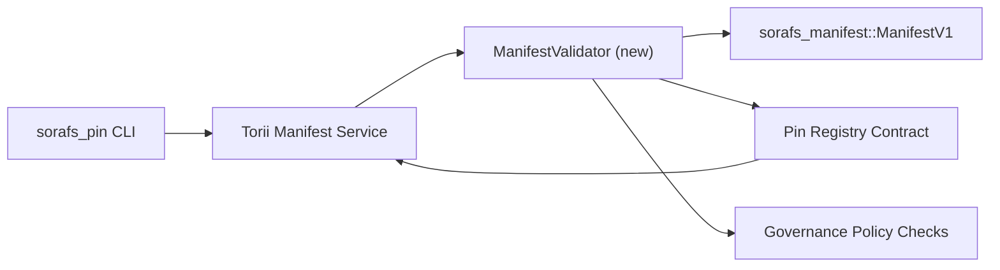

<!-- Auto-generated stub for Urdu (ur) translation. Replace this content with the full translation. -->

---
id: pin-registry-validation-plan
lang: ur
direction: rtl
source: docs/portal/docs/sorafs/pin-registry-validation-plan.md
status: complete
generator: docs/portal/scripts/sync-i18n.mjs
---

:::note مستند ماخذ
یہ صفحہ `docs/source/sorafs/pin_registry_validation_plan.md` کی عکاسی کرتا ہے۔ جب تک پرانی دستاویزات فعال ہیں دونوں مقامات کو ہم آہنگ رکھیں۔
:::

# Pin Registry Manifest Validation Plan (SF-4 Prep)

یہ منصوبہ وہ اقدامات بیان کرتا ہے جو `sorafs_manifest::ManifestV1` کی توثیق کو
آنے والے Pin Registry کنٹریکٹ میں جوڑنے کے لیے درکار ہیں تاکہ SF-4 کا کام
موجودہ tooling پر استوار ہو اور encode/decode منطق کی نقل نہ بنے۔

## مقاصد

1. Host-side submission راستے manifest کی ساخت، chunking profile، اور governance
   envelopes کو proposals قبول کرنے سے پہلے verify کرتے ہیں۔
2. Torii اور gateway سروسز وہی validation routines دوبارہ استعمال کرتی ہیں تاکہ
   hosts کے درمیان deterministic behavior برقرار رہے۔
3. Integration tests مثبت/منفی کیسز کو کور کرتے ہیں، جن میں manifest acceptance،
   policy enforcement، اور error telemetry شامل ہیں۔

## Architecture

### Components

- `ManifestValidator` (`sorafs_manifest` یا `sorafs_pin` crate میں نیا ماڈیول)
  ساختی چیکس اور policy gates کو encapsulate کرتا ہے۔
- Torii ایک gRPC endpoint `SubmitManifest` expose کرتا ہے جو کنٹریکٹ کو forward
  کرنے سے پہلے `ManifestValidator` کو کال کرتا ہے۔
- Gateway fetch path optionally وہی validator استعمال کرتا ہے جب registry سے
  نئے manifests cache کیے جائیں۔

## Task Breakdown

| Task | Description | Owner | Status |
|------|-------------|-------|--------|
| V1 API skeleton | `sorafs_manifest` میں `validate_manifest(manifest: &ManifestV1, policy: &PinPolicyInputs) -> Result<(), ValidationError>` شامل کریں۔ BLAKE3 digest verification اور chunker registry lookup شامل کریں۔ | Core Infra | ✅ Done | مشترکہ helpers (`validate_chunker_handle`, `validate_pin_policy`, `validate_manifest`) اب `sorafs_manifest::validation` میں ہیں۔ |
| Policy wiring | registry policy config (`min_replicas`, expiry windows, allowed chunker handles) کو validation inputs سے map کریں۔ | Governance / Core Infra | Pending — SORAFS-215 میں ٹریکڈ |
| Torii integration | Torii submission path کے اندر validator کال کریں؛ failure پر structured Norito errors واپس کریں۔ | Torii Team | Planned — SORAFS-216 میں ٹریکڈ |
| Host contract stub | یقینی بنائیں کہ contract entrypoint وہ manifests reject کرے جو validation hash میں fail ہوں؛ metrics counters ظاہر کریں۔ | Smart Contract Team | ✅ Done | `RegisterPinManifest` اب state mutate کرنے سے پہلے shared validator (`ensure_chunker_handle`/`ensure_pin_policy`) چلاتا ہے اور unit tests failure cases کور کرتے ہیں۔ |
| Tests | validator کے لیے unit tests + invalid manifests کے لیے trybuild cases شامل کریں؛ `crates/iroha_core/tests/pin_registry.rs` میں integration tests شامل کریں۔ | QA Guild | 🟠 In progress | validator unit tests on-chain rejection tests کے ساتھ آ گئے ہیں؛ مکمل integration suite ابھی باقی ہے۔ |
| Docs | validator آنے کے بعد `docs/source/sorafs_architecture_rfc.md` اور `migration_roadmap.md` اپڈیٹ کریں؛ CLI استعمال `docs/source/sorafs/manifest_pipeline.md` میں لکھیں۔ | Docs Team | Pending — DOCS-489 میں ٹریکڈ |

## Dependencies

- Pin Registry Norito schema کی تکمیل (ref: roadmap میں SF-4 آئٹم)۔
- Council-signed chunker registry envelopes (validator mapping کو deterministic بناتے ہیں)۔
- Manifest submission کے لیے Torii authentication فیصلے۔

## Risks & Mitigations

| Risk | Impact | Mitigation |
|------|--------|------------|
| Torii اور کنٹریکٹ کے درمیان policy interpretation میں فرق | Non-deterministic acceptance۔ | validation crate شیئر کریں + host vs on-chain فیصلوں کا موازنہ کرنے والی integration tests شامل کریں۔ |
| بڑے manifests کے لیے performance regression | Submission سست | cargo criterion سے benchmark کریں؛ manifest digest results cache کرنے پر غور کریں۔ |
| Error messaging drift | Operators میں کنفیوژن | Norito error codes define کریں؛ `manifest_pipeline.md` میں document کریں۔ |

## Timeline Targets

- Week 1: `ManifestValidator` skeleton + unit tests لینڈ کریں۔
- Week 2: Torii submission path wire کریں اور CLI کو validation errors دکھانے کے لیے اپڈیٹ کریں۔
- Week 3: contract hooks implement کریں، integration tests شامل کریں، docs اپڈیٹ کریں۔
- Week 4: migration ledger entry کے ساتھ end-to-end rehearsal چلائیں اور council sign-off حاصل کریں۔

یہ منصوبہ validator کام شروع ہونے کے بعد roadmap میں حوالہ دیا جائے گا۔
