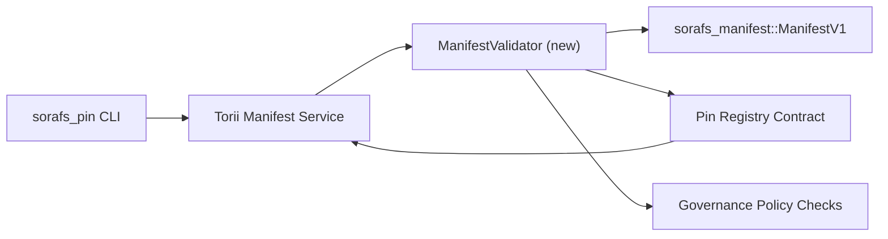

---
ID: پن رجسٹری-توثیق کا منصوبہ
عنوان: پن رجسٹری ظاہر توثیق کا منصوبہ
سائڈبار_لیبل: پن رجسٹری کی توثیق
تفصیل: پن رجسٹری SF-4 رول آؤٹ سے پہلے مینیفیسٹ وی 1 گیٹنگ کے لئے توثیق کا منصوبہ۔
---

::: نوٹ کینونیکل ماخذ
یہ صفحہ `docs/source/sorafs/pin_registry_validation_plan.md` کا آئینہ دار ہے۔ جب تک میراثی دستاویزات فعال رہیں تب تک دونوں مقامات کو سیدھ میں رکھیں۔
:::

# پن رجسٹری منشور کی توثیق کا منصوبہ (SF-4 تیاری)

اس منصوبے میں توثیق کو مربوط کرنے کے لئے ضروری اقدامات کی وضاحت کی گئی ہے
مستقبل میں پن رجسٹری معاہدہ میں `sorafs_manifest::ManifestV1`
SF-4 کام موجودہ ٹولنگ پر منطق کی نقل تیار کیے بغیر تیار کرتا ہے
انکوڈ/ڈیکوڈ۔

## مقاصد

1. میزبان پر راستے بھیجیں ، ظاہر ڈھانچے کو چیک کریں ،
   تجاویز کو قبول کرنے سے پہلے چنکنگ اور گورننس لفافے۔
2. Torii اور گیٹ وے خدمات اسی توثیق کے معمولات کو دوبارہ استعمال کریں
   میزبانوں کے مابین اختیاری سلوک کی ضمانت۔
3. انضمام کے ٹیسٹ قبولیت کے ل positive مثبت/منفی معاملات کا احاطہ کرتے ہیں
   ظاہر ، پالیسی نافذ کرنے والے اور غلطی ٹیلی میٹری۔

## فن تعمیر

### اجزاء

- `ManifestValidator` (کریٹ `sorafs_manifest` یا `sorafs_pin` میں نیا ماڈیول)
  ساختی چیکوں اور پالیسی کے دروازوں کو گھیرے میں لیتے ہیں۔
- Torii ایک GRPC اختتامی نقطہ `SubmitManifest` کو بے نقاب کرتا ہے جو کال کرتا ہے
  معاہدے کو آگے بھیجنے سے پہلے `ManifestValidator`۔
- گیٹ وے بازیافت کا راستہ ایک ہی وقت میں اختیاری طور پر ایک ہی جائز استعمال کرسکتا ہے۔
  رجسٹری سے آنے والے کیشے نئے منشور۔

## ٹاسک تعیناتی| ٹاسک | تفصیل | ذمہ دار | حیثیت |
| -------- | ----------- | ------------- | -------- |
| API کنکال V1 | `validate_manifest(manifest: &ManifestV1, policy: &PinPolicyInputs) -> Result<(), ValidationError>` کو `sorafs_manifest` میں شامل کریں۔ بلیک 3 ڈائجسٹ چیک اور چنکر رجسٹری کی تلاش شامل کریں۔ | کور انفرا | مکمل | مشترکہ مددگار (`validate_chunker_handle` ، `validate_pin_policy` ، `validate_manifest`) اب `sorafs_manifest::validation` میں رہتے ہیں۔ |
| پالیسی وائرنگ | رجسٹری پالیسی کی ترتیب (`min_replicas` ، میعاد ختم ہونے والی ونڈوز ، چنکر ہینڈلز کی اجازت) کی توثیق اندراجات میں نقشہ بنائیں۔ | گورننس / کور انفرا | زیر التواء - Sorafs -215 میں ٹریک کیا گیا
| انضمام Torii | جمع کرانے والے راستے Torii پر توثیق کرنے والے کو کال کریں۔ ناکامیوں پر تشکیل شدہ Norito غلطیاں واپس کریں۔ | Torii ٹیم | منصوبہ بند - Sorafs -216 میں ٹریک کیا گیا |
| میزبان معاہدہ اسٹب | اس بات کو یقینی بنائیں کہ معاہدہ کے داخلے کے نقطہ نظر کو مسترد کرتا ہے جو توثیق ہیش میں ناکام ہوجاتے ہیں۔ میٹرک کاؤنٹرز کو بے نقاب کریں۔ | سمارٹ معاہدہ ٹیم | مکمل | `RegisterPinManifest` اب مشترکہ جائز (`ensure_chunker_handle`/`ensure_pin_policy`) کی درخواست کرتا ہے اس سے پہلے ریاست اور یونٹ ٹیسٹ میں ناکامی کے معاملات کو تبدیل کرنے سے پہلے۔ |
| ٹیسٹ | باضابطہ مظہروں کے لئے توثیق کرنے والے + ٹر بلڈ کیسز کے لئے یونٹ ٹیسٹ شامل کریں۔ `crates/iroha_core/tests/pin_registry.rs` میں انضمام کے ٹیسٹ۔ | QA گلڈ | پیشرفت میں | ویلڈیٹر یونٹ ٹیسٹ آن چین کے رد re ی کے ساتھ ساتھ پہنچے۔ مکمل انضمام سویٹ زیر التوا ہے۔ |
| دستاویزات | `docs/source/sorafs_architecture_rfc.md` اور `migration_roadmap.md` کو اپ ڈیٹ کریں جب توثیق کنندہ آتا ہے۔ `docs/source/sorafs/manifest_pipeline.md` میں دستاویز CLI استعمال۔ | دستاویزات ٹیم | زیر التواء - دستاویزات -489 میں ٹریک کیا گیا |

## انحصار

- پن رجسٹری اسکیم Norito (REF: آئٹم SF-4 روڈ میپ پر حتمی شکل)۔
- بورڈ کے ذریعہ دستخط شدہ چنکر رجسٹری لفافے (ضمانتوں کی تصدیق کرنے والے کی میپنگ کی ضمانت دیتا ہے)۔
- Torii مینی فیسٹ جمع کرانے کے لئے توثیق کے فیصلے۔

## خطرات اور تخفیف

| خطرہ | اثر | تخفیف |
| ------- | -------- | ----------- |
| Torii اور معاہدہ کے درمیان پالیسی کی مختلف تشریح | غیر تصادم کی قبولیت۔ | توثیق کریٹ شیئر کریں + انضمام کے ٹیسٹ شامل کریں جو میزبان بمقابلہ آن چین کے فیصلوں کا موازنہ کریں۔ |
| بڑے منشور کے لئے کارکردگی کا رجعت | سست گذارشات | ملازمت کے معیار کے ذریعے پیمائش ؛ کیچنگ مینی فیسٹ ڈائجسٹ کے نتائج پر غور کریں۔ |
| غلطی کے پیغامات سے ماخوذ | آپریٹر الجھن | غلطی کوڈز Norito مقرر کریں ؛ `manifest_pipeline.md` میں دستاویز۔ |

## شیڈول اہداف

- ہفتہ 1: `ManifestValidator` کنکال + یونٹ ٹیسٹ فراہم کریں۔
- ہفتہ 2: جمع کرانے کے راستے کو Torii میں مربوط کریں اور توثیق کی غلطیوں کو بے نقاب کرنے کے لئے CLI کو اپ ڈیٹ کریں۔
- ہفتہ 3: معاہدے کے ہکس کو نافذ کریں ، انضمام کے ٹیسٹ شامل کریں ، دستاویزات کو اپ ڈیٹ کریں۔
-ہفتہ 4: ہجرت لیجر میں اندراج کے ساتھ اختتام سے آخر میں ٹیسٹ چلائیں اور بورڈ کی منظوری حاصل کریں۔

اس منصوبے کا حوالہ روڈ میپ میں کیا جائے گا جب ایک بار توثیق کرنے والا کام شروع ہوجائے گا۔