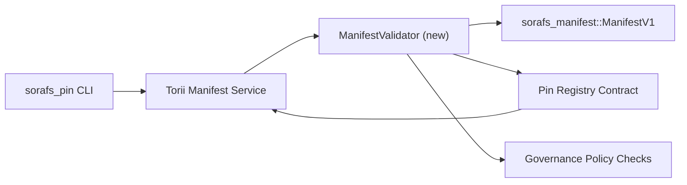

---
ID: پن رجسٹری-توثیق کا منصوبہ
عنوان: پن رجسٹری کے لئے توثیق کا منصوبہ
سائڈبار_لیبل: پن رجسٹری کی توثیق
تفصیل: رول آؤٹ پن رجسٹری SF-4 سے پہلے گیٹنگ مینیفسٹ وی 1 کے لئے توثیق کا منصوبہ۔
---

::: نوٹ کینونیکل ماخذ
یہ صفحہ `docs/source/sorafs/pin_registry_validation_plan.md` کی عکاسی کرتا ہے۔ جب تک کہ پروبیٹ دستاویزات فعال رہیں تب تک دونوں انتظامات کو مستقل رکھیں۔
:::

# توثیق کا منصوبہ پن رجسٹری (SF-4 تیاری) کے لئے ظاہر ہوتا ہے

اس منصوبے میں توثیق کو مربوط کرنے کے لئے درکار اقدامات کی وضاحت کی گئی ہے
`sorafs_manifest::ManifestV1` مستقبل کے پن رجسٹری میں SF-4 کام کرنے کے معاہدے میں
انکوڈ/ڈیکوڈ منطق کی نقل تیار کیے بغیر موجودہ ٹولنگ پر انحصار کیا۔

## اہداف

1. میزبان سائیڈ بھیجنے والا راستہ چیک مینی فیسٹ ڈھانچہ ، پروفائل
   تجاویز کو قبول کرنے سے پہلے چنکنگ اور گورننس لفافے۔
2. Torii اور گیٹ وے خدمات اسی توثیق کے طریقہ کار کو دوبارہ استعمال کریں
   میزبانوں کے مابین تعصب پسندانہ سلوک۔
3. انضمام کے ٹیسٹ مثبت/منفی گود لینے کے معاملات کا احاطہ کرتے ہیں
   ظاہر ، نفاذ کی پالیسیاں اور غلطی ٹیلی میٹری۔

## فن تعمیر

### اجزاء

- `ManifestValidator` (کریٹ `sorafs_manifest` یا `sorafs_pin` میں نیا ماڈیول)
  ساختی چیکوں اور پالیسی کے دروازوں کو گھیرے میں لیتے ہیں۔
- Torii GRPC اختتامی نقطہ `SubmitManifest` کھولتا ہے ، جو کال کرتا ہے
  `ManifestValidator` معاہدے میں منتقل ہونے سے پہلے۔
- گیٹ وے بازیافت کا راستہ اختیاری طور پر اسی توثیق کار کو استعمال کرسکتا ہے جب
  رجسٹری سے نئے منشور کیچنگ کرنا۔

## کاموں کی خرابی| مسئلہ | تفصیل | مالک | حیثیت |
| -------- | --------- | ---------- | -------- |
| کنکال API V1 | `validate_manifest(manifest: &ManifestV1, policy: &PinPolicyInputs) -> Result<(), ValidationError>` کو `sorafs_manifest` میں شامل کریں۔ بلیک 3 ڈائجسٹ چیک اور تلاش چنکر رجسٹری کو فعال کریں۔ | کور انفرا | ✅ کیا ہوا | عام مددگار (`validate_chunker_handle` ، `validate_pin_policy` ، `validate_manifest`) اب `sorafs_manifest::validation` میں واقع ہیں۔ |
| کنکشن پالیسی | رجسٹری پالیسی کی ترتیب (`min_replicas` ، چنکر ہینڈلز کے ذریعہ میعاد ختم ہونے والی ونڈوز) کی توثیق ان پٹ میں نقشہ بنائیں۔ | گورننس/کور انفرا | زیر التواء - Sorafs -215 میں ٹریک کیا گیا
| انضمام Torii | جمع کرانے کے راستے میں توثیق کرنے والے کو کال کریں Torii ؛ ناکامیوں پر ساختہ غلطیاں Norito واپس کریں۔ | Torii ٹیم | منصوبہ بند - Sorafs -216 میں ٹریک کیا گیا |
| میزبان پر معاہدہ اسٹب | اس بات کو یقینی بنائیں کہ معاہدے کے داخلی نقطہ نظر کو مسترد کرتا ہے جو ہیش کی توثیق نہیں کرتا ہے۔ میٹرک کاؤنٹرز کو بے نقاب کریں۔ | سمارٹ معاہدہ ٹیم | ✅ کیا ہوا | `RegisterPinManifest` ریاست کو تبدیل کرنے سے پہلے اب ایک مشترکہ جائز (`ensure_chunker_handle`/`ensure_pin_policy`) کال کرتا ہے ، اور یونٹ ٹیسٹ میں ناکامی کے معاملات کا احاطہ کرتا ہے۔ |
| ٹیسٹ | غلط منشور کے ل the ویلیویٹر + ٹر بلڈ کیسز کے لئے یونٹ ٹیسٹ شامل کریں۔ `crates/iroha_core/tests/pin_registry.rs` میں انضمام کے ٹیسٹ۔ | QA گلڈ | 🟠 ترقی میں | آن چین کی ناکامیوں کے ساتھ ویلڈیٹر یونٹ ٹیسٹ شامل کیے گئے۔ ایک مکمل انضمام سوٹ ابھی بھی زیر التوا ہے۔ |
| دستاویزات | توثیق کار کے نفاذ کے بعد `docs/source/sorafs_architecture_rfc.md` اور `migration_roadmap.md` کو اپ ڈیٹ کریں۔ `docs/source/sorafs/manifest_pipeline.md` میں CLI کی وضاحت کریں۔ | دستاویزات ٹیم | زیر التواء - دستاویزات -489 میں ٹریک کیا گیا |

## انحصار

- Norito پن رجسٹری اسکیم (REF: آئٹم SF-4 روڈ میپ میں) کا حتمی شکل۔
- چنکر رجسٹری کے لئے کونسل کے لفافے پر دستخط شدہ (تصدیق کرنے والے میں ڈٹرمینسٹک مماثلت کی ضمانت)۔
- جمع کرانے کے لئے توثیق کے حل Torii۔

## خطرات اور اقدامات

| خطرہ | اثر | تخفیف |
| ------ | --------- | ---------------- |
| Torii اور معاہدہ کے مابین پالیسی کی مختلف تشریح | غیر تصادم کی قبولیت۔ | توثیق کریٹ کو تقسیم کریں + میزبان بمقابلہ آن چین حلوں کا موازنہ کرتے ہوئے انضمام ٹیسٹ شامل کریں۔ |
| بڑے منشور کے لئے کارکردگی کا رجعت | سست گذارشات | کارگو معیار کے ذریعے بینچ مارک ؛ کیچنگ ڈائجسٹ کے ظاہر نتائج پر غور کریں۔ |
| غلطی کا پیغام بڑھنے | آپریٹر الجھن | غلطی کے کوڈ Norito کا تعین کریں ؛ `manifest_pipeline.md` میں دستاویز۔ |

## وقت کے اہداف

- ہفتہ 1: لینڈ کنکال `ManifestValidator` + یونٹ ٹیسٹ۔
- ہفتہ 2: جمع کرانے کا راستہ Torii سے مربوط کریں اور توثیق کی غلطیوں کو ظاہر کرنے کے لئے CLI کو اپ ڈیٹ کریں۔
- ہفتہ 3: معاہدے کے ہکس کو نافذ کریں ، انضمام کے ٹیسٹ شامل کریں ، دستاویزات کو اپ ڈیٹ کریں۔
-ہفتہ 4: ہجرت لیجر میں اندراج کے ساتھ اختتام سے آخر تک مشق کریں اور بورڈ سے منظوری حاصل کریں۔

اس منصوبے کی نشاندہی کرنے والے پر کام کے آغاز کے بعد روڈ میپ میں اشارہ کیا جائے گا۔