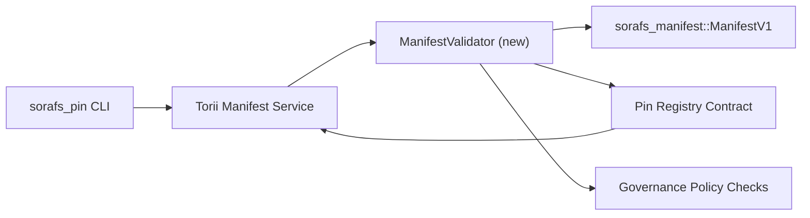

:::注意规范来源
:::

# Pin 注册表清单验证计划 (SF-4 Prep)

该计划概述了线程 `sorafs_manifest::ManifestV1` 所需的步骤
验证即将到来的密码注册合同，以便 SF-4 工作可以
基于现有工具构建，无需重复编码/解码逻辑。

## 目标

1. 主机端提交路径验证清单结构、分块配置文件和
   在接受提案之前先确定治理信封。
2. Torii 和网关服务重用相同的验证例程以确保
   跨主机的确定性行为。
3. 集成测试涵盖明显接受的正面/负面案例，
   策略执行和错误遥测。

## 架构

### 组件

- `ManifestValidator`（`sorafs_manifest` 或 `sorafs_pin` 板条箱中的新模块）
  封装结构检查和策略门。
- Torii 暴露了调用的 gRPC 端点 `SubmitManifest`
  `ManifestValidator` 在转发到合约之前。
- 网关获取路径在缓存新内容时可以选择使用相同的验证器
  从注册表中体现出来。

## 任务分解

|任务|描述 |业主|状态 |
|------|-------------|--------|--------|
| V1 API 骨架 |将 `validate_manifest(manifest: &ManifestV1, policy: &PinPolicyInputs) -> Result<(), ValidationError>` 添加到 `sorafs_manifest`。包括 BLAKE3 摘要验证和分块器注册表查找。 |核心基础设施| ✅ 完成 |共享助手（`validate_chunker_handle`、`validate_pin_policy`、`validate_manifest`）现在位于 `sorafs_manifest::validation` 中。 |
|政策布线|将注册表策略配置（`min_replicas`、到期窗口、允许的分块句柄）映射到验证输入。 |治理/核心基础设施|待定 — 在 SORAFS-215 中跟踪 |
| Torii 集成 |在 Torii 清单提交路径内调用验证器；失败时返回结构化 Norito 错误。 | Torii 团队 |已计划 — 在 SORAFS-216 中跟踪 |
|主机合同存根 |确保合约入口点拒绝验证哈希失败的清单；公开指标计数器。 |智能合约团队 | ✅ 完成 | `RegisterPinManifest` 现在在改变状态之前调用共享验证器 (`ensure_chunker_handle`/`ensure_pin_policy`)，并且单元测试覆盖失败案例。 |
|测试 |为无效清单添加验证器 + trybuild 案例的单元测试； `crates/iroha_core/tests/pin_registry.rs` 中的集成测试。 |质量保证协会 | 🟠 进行中 |验证器单元测试与链上拒绝测试同时进行；完整的集成套件仍在等待中。 |
|文档 |验证器登陆后更新 `docs/source/sorafs_architecture_rfc.md` 和 `migration_roadmap.md`；在 `docs/source/sorafs/manifest_pipeline.md` 中记录 CLI 用法。 |文档团队 |待处理 — 在 DOCS-489 中跟踪 |

## 依赖关系

- Pin 注册表 Norito 架构最终确定（参考：路线图中的 SF-4 项目）。
- 理事会签署的分块注册信封（确保验证器映射是
  确定性）。
- Torii 清单提交的身份验证决定。

## 风险与缓解措施

|风险|影响 |缓解措施 |
|------|--------|------------|
| Torii与合同政策解读分歧|非确定性接受。 |共享验证箱+添加集成测试来比较主机与链上决策。 |
|大型清单的性能回归 |提交速度较慢 |通过货物标准进行基准；考虑缓存清单摘要结果。 |
|错误消息漂移|操作员困惑|定义Norito错误代码；将它们记录在 `manifest_pipeline.md` 中。 |

## 时间表目标

- 第 1 周：登陆 `ManifestValidator` 骨架 + 单元测试。
- 第 2 周：连接 Torii 提交路径并更新 CLI 以显示验证错误。
- 第 3 周：实施合约挂钩、添加集成测试、更新文档。
- 第 4 周：进行端到端排练，包括迁移分类账录入、捕获委员会签字。

验证器工作开始后，该计划将在路线图中引用。