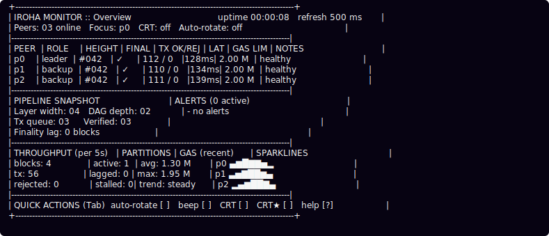
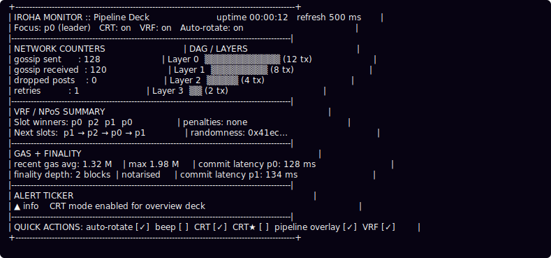

# Iroha Monitor

The refactored Iroha monitor pairs a lightweight terminal UI with animated
festival ASCII art and the traditional Etenraku theme.  It focuses on two
simple workflows:

- **Spawn-lite mode** – start ephemeral status/metrics stubs that mimic peers.
- **Attach mode** – point the monitor at existing Torii HTTP endpoints.

The UI renders three regions on every refresh:

1. **Torii skyline header** – animated torii gate, Mt. Fuji, koi waves, and star
   field that scroll in sync with the refresh cadence.
2. **Summary strip** – aggregated blocks/transactions/gas plus refresh timing.
3. **Peer table & festival whispers** – peer rows on the left, rotating event
   log on the right that captures warnings (timeouts, oversized payloads, etc.).
4. **Optional gas trend** – enable `--show-gas-trend` to append a sparkline
   summarising total gas usage across all peers.

New in this refactor:

- Animated Japanese-style ASCII scene with koi, torii, and lanterns.
- Simplified command surface (`--spawn-lite`, `--attach`, `--interval`).
- Intro banner with optional audio playback of the gagaku theme (external MIDI
  player or the built-in soft synth when the platform/audio stack supports it).
- `--no-theme` / `--no-audio` flags for CI or fast smoke runs.
- Per-peer “mood” column showing the latest warning, commit time, or uptime.

## Quickstart

Build the monitor and run it against the stubbed peers:

```bash
cargo run -p iroha_monitor -- --spawn-lite --peers 3
```

Attach to existing Torii endpoints:

```bash
cargo run -p iroha_monitor -- \
  --attach http://127.0.0.1:8080 http://127.0.0.1:8081 \
  --interval 500
```

CI-friendly invocation (skip intro animation and audio):

```bash
cargo run -p iroha_monitor -- --spawn-lite --no-theme --no-audio
```

### CLI flags

```
--spawn-lite         start local status/metrics stubs (default if no --attach)
--attach <URL...>    attach to existing Torii endpoints
--interval <ms>      refresh interval (default 800ms)
--peers <N>          stub count when spawn-lite is active (default 4)
--no-theme           skip the animated intro splash
--no-audio           mute theme playback (still prints the intro frames)
--midi-player <cmd>  external MIDI player for the built-in Etenraku .mid
--midi-file <path>   custom MIDI file for --midi-player
--show-gas-trend     render the aggregate gas sparkline panel
--art-speed <1-8>    multiply the animation step rate (1 = default)
--art-theme <name>   choose between night, dawn, or sakura palettes
--headless-max-frames <N>
                     cap headless fallback to N frames (0 = unlimited)
```

## Theme intro

By default, startup plays a short ASCII animation while the Etenraku score
begins.  Audio selection order:

1. If `--midi-player` is provided, generate the demo MIDI (or use `--midi-file`)
   and spawn the command.
2. Otherwise, on macOS/Windows (or Linux with `--features iroha_monitor/linux-builtin-synth`)
   render the score with the built-in gagaku soft synth (no external audio
   assets required).
3. If audio is disabled or initialization fails, the intro still prints the
   animation and immediately enters the TUI.

The CPAL-powered synth auto-enables on macOS and Windows. On Linux it is
opt-in to avoid missing ALSA/Pulse headers during workspace builds; enable it
with `--features iroha_monitor/linux-builtin-synth` if your system provides a
working audio stack.

Use `--no-theme` or `--no-audio` when running in CI or headless shells.

The soft synth now follows the arrangement captured in *MIDI synth design in
Rust.pdf*: hichiriki and ryūteki share a heterophonic melody while the shō
provides the aitake pads described in the document.  The timed note data lives
in `etenraku.rs`; it powers both the CPAL callback and the generated demo MIDI.
When audio output is unavailable the monitor skips playback but still renders
the ASCII animation.

## UI overview

- **Header art** – generated each frame by `AsciiAnimator`; koi, torii lanterns,
  and waves drift to give continuous motion.
- **Summary strip** – shows online peers, reported peer count, block totals,
  non-empty block totals, tx approvals/rejections, gas usage, and refresh rate.
- **Peer table** – columns for alias/endpoint, blocks, transactions, queue size,
  gas usage, latency, and a “mood” hint (warnings, commit time, uptime).
- **Festival whispers** – rolling log of warnings (connection errors, payload
  limit breaches, slow endpoints).  Messages are reversed (latest on top).

Keyboard shortcuts:

- `n` / Right / Down – move focus to the next peer.
- `p` / Left / Up – move focus to the previous peer.
- `q` / Esc / Ctrl-C – exit and restore the terminal.

The monitor uses crossterm + ratatui with an alternate-screen buffer; on exit it
restores the cursor and clears the screen.

## Smoke tests

The crate ships integration tests that exercise both modes and the HTTP limits:

- `spawn_lite_smoke_renders_frames`
- `attach_mode_with_stubs_runs_cleanly`
- `invalid_endpoint_surfaces_warning`
- `status_limit_warning_is_rendered`
- `attach_mode_with_slow_peer_renders_multiple_frames`

Run just the monitor tests:

```bash
cargo test -p iroha_monitor -- --nocapture
```

The workspace has heavier integration tests (`cargo test --workspace`). Running
the monitor tests separately is still useful for quick validation when you do
not need the full suite.

## Updating screenshots

The docs demo now focuses on the torii skyline and peer table.  To refresh the
assets, run:

```bash
make monitor-screenshots
```

This wraps `scripts/iroha_monitor_demo.sh` (spawn-lite mode, fixed seed/viewport,
no intro/audio, dawn palette, art-speed 1, headless cap 24) and writes the
SVG/ANSI frames plus `manifest.json` and `checksums.json` into
`docs/source/images/iroha_monitor_demo/`. `make check-iroha-monitor-docs`
wraps both CI guards (`ci/check_iroha_monitor_assets.sh` and
`ci/check_iroha_monitor_screenshots.sh`) so generator hashes, manifest fields,
and checksums stay in sync; the screenshot check also ships as
`python3 scripts/check_iroha_monitor_screenshots.py`. Pass `--no-fallback` to
the demo script if you want the capture to fail instead of falling back to the
baked frames when the monitor output is empty; when fallback is used the raw
`.ans` files are rewritten with the baked frames so the manifest/checksums stay
deterministic.

## Deterministic screenshots

The shipped snapshots live in `docs/source/images/iroha_monitor_demo/`:




Reproduce them with a fixed viewport/seed:

```bash
scripts/iroha_monitor_demo.sh \
  --cols 120 --rows 48 \
  --interval 500 \
  --seed iroha-monitor-demo
```

The capture helper fixes `LANG`/`LC_ALL`/`TERM`, forwards
`IROHA_MONITOR_DEMO_SEED`, mutes audio, and pins the art theme/speed so the
frames render identically across platforms. It writes `manifest.json` (generator
hashes + sizes) and `checksums.json` (SHA-256 digests) under
`docs/source/images/iroha_monitor_demo/`; CI runs
`ci/check_iroha_monitor_assets.sh` and `ci/check_iroha_monitor_screenshots.sh`
to fail when the assets drift from the recorded manifests.

## Troubleshooting

- **No audio output** – the monitor falls back to muted playback and continues.
- **Headless fallback exits early** – the monitor caps headless runs to a couple
  dozen frames (about 12 seconds at the default interval) when it cannot switch
  the terminal into raw mode; pass `--headless-max-frames 0` to keep it running
  indefinitely.
- **Oversized status payloads** – the peer’s mood column and the festival log
  show `body exceeds …` with the configured limit (`128 KiB`).
- **Slow peers** – the event log records timeout warnings; focus that peer to
  highlight the row.

Enjoy the festival skyline!  Contributions for additional ASCII motifs or
metrics panels are welcome—keep them deterministic so clusters render the same
frame-by-frame regardless of terminal.
