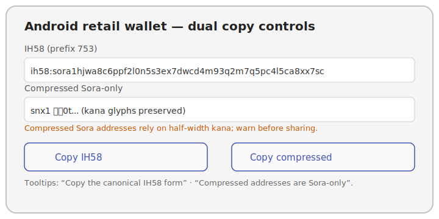
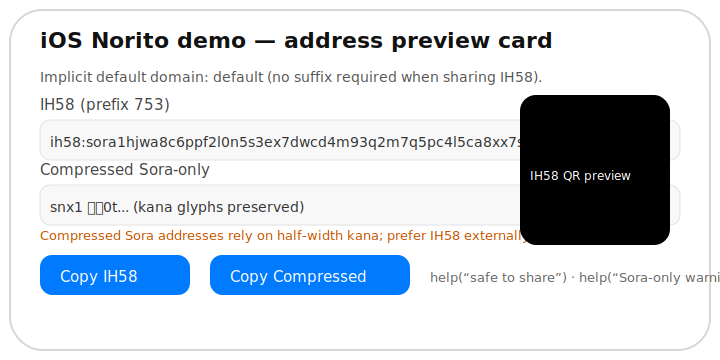

# Sora Address Display Guidelines (ADDR-6)

Wallets, explorers, and SDK samples must treat account addresses as immutable
payloads. The Android retail wallet sample in
`examples/android/retail-wallet` now demonstrates the required UX pattern:

- **Dual copy targets.** Ship two explicit copy buttons—I105 and the
  i105-default Sora-only form (`i105`). I105 is always safe to share externally
  and powers the QR payload. The i105-default variant must include an inline
  warning because it only works inside Sora-aware apps. The Android retail wallet
  sample wires both Material buttons and their tooltips in
  `examples/android/retail-wallet/src/main/res/layout/activity_main.xml`, and the
  iOS SwiftUI demo mirrors the same UX via `AddressPreviewCard` inside
  `examples/ios/NoritoDemo/Sources/ContentView.swift`.
- **Monospace, selectable text.** Render both strings with a monospace font and
  `textIsSelectable="true"` so users can inspect values without invoking an IME.
  Avoid editable fields: IMEs can rewrite kana or inject zero-width code points.
- **Domainless address hints.** Canonical account literals are domainless; when a workflow needs domain context, render it separately from the account literal. When the selector points at the implicit
  `default` domain, surface a caption that reminds operators no suffix is
  required. Explorers should also highlight the canonical domain label when the
  selector encodes a digest.
- **I105 QR payloads.** QR codes must encode the I105 string. If QR generation
  fails, display an explicit error instead of a blank image.
- **Clipboard messaging.** After copying the i105-default form, emit a toast or
  snackbar reminding users that it is Sora-only and prone to IME mangling.

Following these guardrails prevents Unicode/IME corruption and satisfies the
ADDR-6 roadmap acceptance criteria for wallet/explorer UX.

## Screenshot fixtures

Use the following fixtures during localization reviews to ensure button labels,
tooltips, and warnings stay aligned across platforms:

- Android reference: `images/address_copy_android.svg`

  

- iOS reference: `images/address_copy_ios.svg`

  

## SDK helpers

Each SDK now exposes a convenience helper that returns the I105 forms alongside
the warning string so UI layers can stay consistent:

- JavaScript: `AccountAddress.displayFormats(networkPrefix?: number)` (`javascript/iroha_js/src/address.js`)
- JavaScript (global selectors): `AccountAddress.fromAccount({ registryId, publicKey })` builds
  registry-backed addresses when Local selectors are retired; `domainSummary().kind` returns
  `global` with no warning so wallets can suppress the Local-12 banner during the cutover.
- Python: `AccountAddress.display_formats(network_prefix: int = 753)`
- Swift: `AccountAddress.displayFormats(networkPrefix: UInt16 = 753)`
- Java/Kotlin: `AccountAddress.displayFormats(int networkPrefix = 753)` (`java/iroha_android/src/main/java/org/hyperledger/iroha/android/address/AccountAddress.java`)

Use these helpers instead of reimplementing the encode logic in UI layers.
Every helper returns a `domainSummary` payload alongside the I105
strings. The summary exposes `kind` (`default`, `local12`, `global`, `unknown`)
and an optional `warning` message that mirrors the Local-12 cutover guidance in
this document. Use the warning string to show inline banners when Local-12
digests appear so operators know they must refresh cached addresses once
registry-backed selectors become mandatory. The JavaScript helper also exposes
selector details (`tag`, `digest_hex`, `registry_id`, `label`) so UIs can
surface whether the selector is default, Local-12, or backed by a registry id
without re-parsing the canonical payload.
- JavaScript inspector: `inspectAccountId(...)` returns the `i105Warning`
  string and appends it to `warnings` whenever a `i105` literal is provided, so
  explorers and wallet dashboards can surface the Sora-only notice during paste/
  validation flows instead of only when they generate the i105-default form
  themselves.
The JavaScript parser accepts the same canonical formats as Torii (I105,
i105-default `sora`, and canonical `0x…` hex). Bare hex without the `0x` sentinel
is rejected by Torii, so SDKs must preserve the prefix when emitting hex
literals.

## Alphabet reference

Operators often ask which glyphs are considered valid when validating copy/paste telemetry.
The canonical tables live in `crates/iroha_data_model/src/account/address.rs` and are summarised
below so wallet/explorer UIs can surface them inline without spelunking the codebase.

### I105 alphabet (58 symbols)

| Group | Characters | Count |
|-------|------------|-------|
| Digits | `1 2 3 4 5 6 7 8 9` | 9 |
| Uppercase letters | `A B C D E F G H J K L M N P Q R S T U V W X Y Z` | 24 |
| Lowercase letters | `a b c d e f g h i j k m n o p q r s t u v w x y z` | 25 |

> ℹ️ I105 deliberately omits `0`, `O`, `I`, and `l` to avoid look‑alike glyphs. Surface that rule
> in inline help text when users type an unsupported character so validation failures are actionable.

### i105-default Sora alphabet (47 symbols)

| Half-width glyphs | Count |
|-------------------|-------|
| `ｲ ﾛ ﾊ ﾆ ﾎ ﾍ ﾄ ﾁ ﾘ ﾇ ﾙ ｦ ﾜ ｶ ﾖ ﾀ ﾚ ｿ ﾂ ﾈ ﾅ ﾗ ﾑ ｳ ヰ ﾉ ｵ ｸ ﾔ ﾏ ｹ ﾌ ｺ ｴ ﾃ ｱ ｻ ｷ ﾕ ﾒ ﾐ ｼ ヱ ﾋ ﾓ ｾ ｽ` | 47 |

The i105-default alphabet accepts both half-width and full-width kana, and the `sora` sentinel
may also be typed in full-width form (`ｓｏｒａ`). Render the half-width glyphs in UI copy while
allowing screen readers to expand the descriptive text (see Accessibility guidance below). When
exposing printable cheat-sheets or QR legends, include both tables so operators can validate
telemetry exports offline.

## Torii API account literal contract

Torii/Explorer endpoints emit I105 literals by default and accept the optional
canonical `i105` literals only (no format-override fields) on both query strings
(`GET /v1/accounts`, `/v1/kaigi/relays`, `/v1/repo/agreements`, explorer routes,
asset-holder endpoints, etc.) and JSON envelopes
(`POST /v1/accounts/{id}/transactions/query`, `/v1/repo/agreements/query`,
`/v1/assets/{definition}/holders/query`). Because format overrides are removed, the response
body renders every account literal (initiator/counterparty/custodian,
transaction participants, account summaries, telemetry DTOs) using the
`i105` representation while preserving I105 canonicalisation for the
underlying identifiers. Unknown override values (for example `base64`)
return `HTTP 400` so misconfigured SDKs fail fast.

Requests always accept I105 selectors. Canonical
I105 strings remain the wire format for manifests, telemetry, and QR payloads,
so only opt into `canonical I105 output` when rendering UX where the Sora
alphabet offers material ergonomic wins.

Offline reporting endpoints reuse the same contract. `/v1/offline/allowances{,/query}`,
`/v1/offline/certificates{,/query}`, `/v1/offline/transfers{,/query}`,
`/v1/offline/settlements{,/query}`, `/v1/offline/receipts{,/query}`, and
`/v1/offline/summaries{,/query}` now
validate `controller_id`, `receiver_id`, and `deposit_account_id` filter literals strictly: GET and
POST filters accept only canonical I105 `AccountId` selectors (including `in`/`nin` arrays).
i105-default literals, any `@<domain>` suffix, and implicit default-domain reconstruction are
rejected on strict parser paths.
If a workflow needs domain context, carry it in separate fields (for example domain filters,
`ScopedAccountId`-bearing records, or resolver metadata), not by decorating strict `AccountId`
input literals.

## Accessibility + implicit domain metadata

- **Copy mode controls.** When rendering the I105/I105/QR toggle, mark each button with
  `aria-pressed` and an explicit `aria-label` (for example, “Copy canonical I105 account address”
  vs “Copy i105-default Sora address—works only inside Sora-aware apps”). Include a visually-hidden
  `(safe to share)` or `(Sora-only)` suffix so screen readers convey the warnings present in the UI.
- **Implicit domain hints.** Reuse the caption text from the main layout but also expose it via
  `aria-describedby` on the address container (e.g., “Default domain: omit `.wonderland` in Sora
  dashboards”). This keeps the implicit-domain cue available even when the caption is collapsed on
  mobile.
- **QR metadata.** The `/v1/explorer/accounts/{id}/qr` endpoint returns both the literal and SVG
  payload. Wrap the SVG with `<figure role="img" aria-label="I105 QR for snx…">` so assistive tech
  can reference the literal field when announcing the image. If QR rendering fails, surface a
  live-region alert that quotes the I105 literal instead of leaving a blank canvas.
- **Telemetry hooks.** Tag each copy button or context menu entry with `data-copy-mode="i105"`,
  `"i105-default"`, or `"qr"` and emit those values alongside the `torii_address_format_total` counter
  to the `address_ingest` dashboard. The roadmap’s ADDR-6b acceptance test reads that telemetry to
  prove wallets/explorers actually expose all three formats. Also surface the Torii counters that
  prove Local-12 retirement progress (`torii_address_domain_total{domain_kind="local12"}` and
  `torii_address_local8_total`). Grafana board `dashboards/grafana/address_ingest.json` plus the
  alert bundle `dashboards/alerts/address_ingest_rules.yml` expect those labels so operators can
  attach a 30-day zero-usage export to the ADDR-7 readiness review.
- **Reduced-motion + keyboard flows.** Respect `prefers-reduced-motion` when animating QR refreshes,
  and ensure keyboard users can tab through I105/I105/QR controls without losing the focus
  ring. Tooltips should be paired with aria hints so that high-contrast and screen-reader users get
  the same warnings as pointer users.

## Local → Global migration toolkit

Wallets, explorers, and back-office tools must retire Local selectors ahead of
the Local-8/Local-12 enforcement gates. The [Local → Global toolkit](local_to_global_toolkit.md)
packages the CLI automation (audit + conversion), dashboard references, and
evidence checklist operators should follow when updating manifests or customer
records. Integrate the script into CI and attach the generated artefacts to the
release/change tickets that accompany your UX updates.

## Binary layout quick reference (ADDR-1a)

When SDKs surface advanced address tooling (inspectors, validation hints, manifest builders), point
developers at the canonical wire format captured in [`docs/account_structure.md`](../../account_structure.md).
The layout is always `header · selector · controller`, where the header bits are:

```
bit index:   7        5 4      3 2      1 0
             ┌─────────┬────────┬────────┬────┐
payload bit: │version  │ class  │  norm  │ext │
             └─────────┴────────┴────────┴────┘
```

- `addr_version = 0` (bits 7‑5) today; non‑zero values are reserved and must raise
  `AccountAddressError::InvalidHeaderVersion`.
- `addr_class` distinguishes single (`0`) vs multisig (`1`) controllers.
- `norm_version = 1` encodes the Norm v1 selector rules. Future norms will reuse the same 2‑bit field.
- `ext_flag` is always `0`—set bits indicate unsupported payload extensions.

The selector immediately follows the header:

```
┌──────────┬──────────────────────────────────────────────┐
│ tag (u8) │ payload (depends on selector kind)           │
└──────────┴──────────────────────────────────────────────┘
```

UI and SDK surfaces should be ready to display the selector kind:

- `0x00` = implicit default domain (no payload).
- `0x01` = local digest (12‑byte `blake2s_mac("SORA-LOCAL-K:v1", label)`).
- `0x02` = global registry entry (big‑endian `registry_id:u32`).

Canonical hex examples that wallet tooling can link or embed in docs/tests:

| Selector kind | Canonical hex |
|---------------|---------------|
| Implicit default | `0x020001203b6a27bcceb6a42d62a3a8d02a6f0d73653215771de243a63ac048a18b59da29` |
| Local digest (`treasury`) | `0x0201b18fe9c1abbac45b3e38fc5d0001208a88e3dd7409f195fd52db2d3cba5d72ca6709bf1d94121bf3748801b40f6f5c` |
| Global registry (`registry_id = 42`) | `0x02020000002a000120641297079357229f295938a4b5a333de35069bf47b9d0704e45805713d13c201` |

Linking this quick reference from SDK docs keeps binary and UX guidance in one place and lets operators
cross‑check Local vs global selectors without spelunking the RFC every time.

## Torii response knobs

- Explorers consuming Torii via `/v1/accounts` and `/v1/accounts/query` always receive canonical I105 literals in `items[*].id`.
- `GET /v1/accounts/{account_id}/transactions` and `POST .../transactions/query` also emit canonical I105 in `items[*].authority`.
- `GET /v1/explorer/accounts/{account_id}/qr` returns canonical I105 payload metadata (`canonical_id`, `literal`, `modules`, `error_correction`, `qr_version`, `svg`) without any format override.
- Asset-holder listings (`GET /v1/assets/{definition_id}/holders`) and `POST .../holders/query` return canonical I105 `items[*].account_id` values consistently.

## Local selector cutover toolkit (ADDR-5c)

Local-domain selectors (`domain.kind = local12`) remain temporary encodings until every registered
domain is backed by the Nexus registry. To detect lingering Local payloads and guide operators
through the migration:

1. Run `iroha tools address convert <address-or-account_id> --format json`. The payload now includes a
   `domain` object with `kind`/`warning` fields and echoes any provided domain via the `input_domain`
   field. When `kind` is `local12`, the CLI prints a warning to stderr and the JSON summary echoes the
   same guidance so CI pipelines and SDKs can surface it. Pass `legacy  suffix` whenever you want the
   converted encoding replayed as `<i105>@<domain>`.
2. SDKs can surface the same warning/summary via the JavaScript helper:

   ```js
   import { inspectAccountId } from "@iroha/iroha-js";

   const summary = inspectAccountId("sora...");
   if (summary.domain.warning) {
     console.warn(summary.domain.warning);
   }
   console.log(summary.i105.value, summary.i105Warning);
   ```
   The helper preserves the I105 prefix detected from the literal unless you provide
   `networkPrefix`, so summaries for non-default networks do not silently re-render with the
   default prefix.

3. Convert the canonical payload by reusing the `i105.value` or `canonicalHex` from the summary
   (or request another encoding via `--format`). These strings are already safe to share externally.
4. Update manifests, registries, and customer-facing documents with the canonical form and notify
   counterparties that Local selectors will be rejected once the cutover completes.
5. For bulk data sets, run `iroha tools address audit --input addresses.txt --network-prefix 753`. The command
   reads newline-separated literals (comments starting with `#` are ignored, and `--input -` or no flag uses STDIN),
   emits a JSON report with canonical/preferred I105/I105 summaries for every entry, and counts both parse errors
   automation with `strict CI post-check` once operators are ready to block Local selectors in CI.
6. When you need a newline-to-newline rewrite, use
   The helper skips non-Local rows by default, converts every remaining entry into the requested encoding
   (canonical I105/hex/JSON), and preserves the original domain when `legacy  suffix` is set. Pair it with
   `--allow-errors` to keep scanning even when a dump contains malformed literals.
7. CI/lint automation can run `ci/check_address_normalize.sh`, which extracts the Local selectors from
   `fixtures/account/address_vectors.json`, converts them via `iroha tools address normalize`, and replays
   `iroha tools address audit` to prove releases no longer emit Local digests.

`torii_address_local8_total{endpoint}` plus
`torii_address_collision_total{endpoint,kind="local12_digest"}`,
`torii_address_collision_domain_total{endpoint,domain}`, and the Grafana board
`dashboards/grafana/address_ingest.json` provide the enforcement signal: once production dashboards
show zero legitimate Local submissions and zero Local-12 collisions for 30 consecutive days, Torii
will flip the Local-8 gate to hard-fail on mainnet, followed by Local-12 once global domains have
matching registry entries.
Consider the CLI output the operator-facing notice for this freeze—the same warning string is used
across SDK tooltips and automation to keep parity with the roadmap exit criteria. The accompanying
Alertmanager pack (`dashboards/alerts/address_ingest_rules.yml`) surfaces three guardrails:

- `AddressLocal8Resurgence` pages whenever any context reports a fresh Local-8 increment. Treat this
  as a release blocker—identify the offending SDK surface via the dashboards, ship a fix, and keep
  the gate closed until the signal returns to zero.
- `AddressLocal12Collision` fires when two Local-12 labels hash to the same digest. Pause manifest
  promotions, run the Local → Global toolkit to audit the digest mapping, and coordinate with Nexus
  governance before reissuing the registry entry or re-enabling downstream rollouts.
- `AddressInvalidRatioSlo` warns when the fleet-wide invalid ratio exceeds the 0.1 % SLO for ten
  minutes. Investigate `torii_address_invalid_total` by reason/context and coordinate with the
  responsible SDK team before declaring the incident resolved.

`torii_address_format_total{endpoint,format}` complements the ingest metrics by counting every
`canonical I105 literal rendering` request that Torii serves. Dashboard the metric alongside
`torii_address_invalid_total` to prove that wallet/explorer traffic is gradually switching to the
i105-default output before you disable Local selectors, and wire alert thresholds to catch any sudden
fallback to the default I105 responses.

### Release note snippet (wallet & explorer)

Include the following bullet in the wallet/explorer release notes when shipping the cutover:
