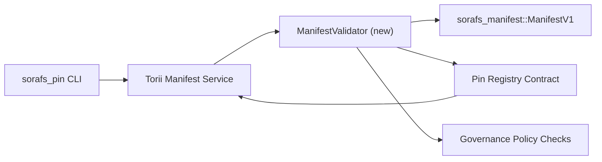

# Plan de validacion de manifiestos del Pin Registry (prep SF-4)

Este plan describe los pasos necesarios para encadenar la validacion de
`sorafs_manifest::ManifestV1` dentro del futuro contrato Pin Registry, para que
el trabajo SF-4 pueda apoyarse en el tooling existente sin duplicar logica de
encode/decode.

## Objetivos

1. Los paths de submission del host verifican la estructura del manifiesto, el
   perfil de chunking y los sobres de governance antes de aceptar propuestas.
2. Torii y los servicios gateway reutilizan las mismas rutinas de validacion
   para asegurar comportamiento determinista entre hosts.
3. Los tests de integracion cubren casos positivos/negativos para aceptacion de
   manifiestos, enforcement de politica y telemetria de errores.

## Arquitectura

### Componentes

- `ManifestValidator` (modulo nuevo en el crate `sorafs_manifest` o `sorafs_pin`)
  encapsula checks estructurales y gates de politica.
- Torii expone un endpoint gRPC `SubmitManifest` que llama a `ManifestValidator`
  antes de reenviar al contrato.
- El path de fetch del gateway puede consumir opcionalmente el mismo validador
  al cachear manifiestos nuevos desde el registry.

## Desglose de tareas

| Tarea | Descripcion | Owner | Estado |
|------|-------------|-------|--------|
| V1 API skeleton | Agregar `validate_manifest(manifest: &ManifestV1, policy: &PinPolicyInputs) -> Result<(), ValidationError>` a `sorafs_manifest`. Incluir verificacion de digest BLAKE3 y lookup en el registry de chunker. | Core Infra | ✅ Done | Los helpers compartidos (`validate_chunker_handle`, `validate_pin_policy`, `validate_manifest`) viven ahora en `sorafs_manifest::validation`. |
| Cableado de politica | Mapear config de politica del registry (`min_replicas`, ventanas de expiry, handles de chunker permitidos) hacia inputs de validacion. | Governance / Core Infra | Pendiente — tracked en SORAFS-215 |
| Integracion Torii | Llamar el validador dentro del path de submission de manifiestos Torii; retornar errores Norito estructurados ante fallo. | Torii Team | Planeado — tracked en SORAFS-216 |
| Stub de contrato host | Asegurar que el entrypoint del contrato rechace manifiestos que fallen el hash de validacion; exponer counters de metricas. | Smart Contract Team | ✅ Done | `RegisterPinManifest` ahora invoca el validador compartido (`ensure_chunker_handle`/`ensure_pin_policy`) antes de mutar estado y los unit tests cubren casos de fallo. |
| Tests | Agregar unit tests para el validador + casos trybuild para manifiestos invalidos; integration tests en `crates/iroha_core/tests/pin_registry.rs`. | QA Guild | 🟠 In progress | Unit tests del validador aterrizaron junto con tests de rechazo on-chain; el suite de integracion completo sigue pendiente. |
| Docs | Actualizar `docs/source/sorafs_architecture_rfc.md` y `migration_roadmap.md` una vez que el validador aterrice; documentar uso CLI en `docs/source/sorafs/manifest_pipeline.md`. | Docs Team | Pendiente — tracked en DOCS-489 |

## Dependencias

- Finalizacion del schema Norito de Pin Registry (ref: item SF-4 en roadmap).
- Sobres de registro de chunker firmados por el council (asegura mapping determinista del validador).
- Decisiones de autenticacion Torii para la submission de manifiestos.

## Riesgos y mitigaciones

| Riesgo | Impacto | Mitigacion |
|--------|---------|------------|
| Interpretacion de politica divergente entre Torii y contrato | Aceptacion no determinista. | Compartir crate de validacion + agregar tests de integracion que comparen decisiones host vs on-chain. |
| Regresion de performance para manifiestos grandes | Submissions mas lentas | Benchmark via cargo criterion; considerar cachear resultados de digest. |
| Drift en mensajes de error | Confusion operativa | Definir codigos de error Norito; documentarlos en `manifest_pipeline.md`. |

## Objetivos de timeline

- Semana 1: aterrizar skeleton `ManifestValidator` + unit tests.
- Semana 2: cablear submission Torii y actualizar CLI para exponer errores de validacion.
- Semana 3: implementar hooks del contrato, agregar integration tests, actualizar docs.
- Semana 4: correr ensayo end-to-end con entrada en migration ledger, capturar sign-off del council.

Este plan se referenciara en el roadmap una vez que inicie el trabajo del validador.
