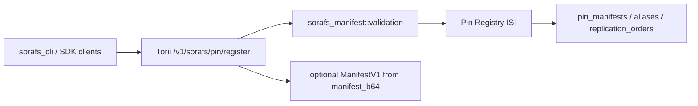

# Pin Registry Manifest Validation Status (SF-4)

This page records the completed SF-4 manifest-validation wiring for SoraFS pin
registration. The shared validation path now lives in `sorafs_manifest`, is used
by Torii submission handling, and is enforced by the on-chain pin registry entry
points before state or fee side effects.

## Implemented Goals

1. Host-side submission paths verify manifest structure, chunking profile, pin
   policy, and governance envelopes before accepting proposals.
2. Torii and gateway-facing services reuse the same validation routines so hosts
   and clients see deterministic acceptance and refusal labels.
3. Unit and integration tests cover positive registration, validator error cases,
   governance-policy rejections, and no-side-effect failures.

## Current Architecture

## Shipped Components

- `sorafs_manifest::validation` provides shared chunker, pin-policy, and
  `ManifestV1` validation helpers.
- `manifest_pin_policy_constraints_from_config` maps governance configuration
  into `sorafs_manifest::PinPolicyConstraints`.
- `/v1/sorafs/pin/register` validates DTO fields through the shared validator,
  accepts optional `manifest_b64` for full Norito `ManifestV1` validation, checks
  digest/chunker/content-length/policy consistency, and returns stable
  `sorafs_pin_*` application-validation labels.
- `RegisterPinManifest` invokes the shared validation path before mutating pin
  state or applying fee side effects.
- Tests cover chunker/profile checks, council-signature policy,
  replica floors/ceilings, retention ceilings, storage-class allowlists,
  on-chain registration acceptance, and governance-policy rejections.

## Completion Matrix

| Area | Status | Evidence |
|------|--------|----------|
| Shared validator | Done | `validate_chunker_handle`, `validate_pin_policy`, and `validate_manifest` live in `sorafs_manifest::validation`. |
| Policy wiring | Done | Governance config is mapped into `PinPolicyConstraints`; DTO and full-manifest paths use the same limits. |
| Torii integration | Done | `/v1/sorafs/pin/register` emits stable `sorafs_pin_*` error labels and supports optional full manifest validation. |
| Contract enforcement | Done | `RegisterPinManifest` validates before state mutation and unit tests cover failure cases. |
| Tests | Done | Validator and integration tests cover policy, chunker, council-signature, and side-effect guarantees. |
| Docs | Done | Architecture, manifest-pipeline, CLI, OpenAPI, status, and roadmap docs describe the shared validation path. |

## Operational Notes

- Manifest validation rejects unknown registered chunker profile IDs instead of
  inferring layout from inline parameters.
- Council-signature requirements are driven by governance configuration; when a
  policy requires signatures, Torii requires `manifest_b64` so the full
  governance envelope can be checked.
- Error labels are part of the operator contract. Keep Torii, CLI, OpenAPI, and
  tests aligned whenever adding validation cases.
- Large-manifest performance should be measured in release rehearsals; cache only
  deterministic digest results and never bypass validation.

## Remaining Rollout Evidence

1. Archive release-candidate logs for positive registration and governed-policy
   rejection through Torii and on-chain execution.
2. Attach OpenAPI/CLI examples that demonstrate the stable `sorafs_pin_*` labels
   for common failures.
3. Record any production performance baseline for large manifests in the
   migration ledger before widening operator usage.
