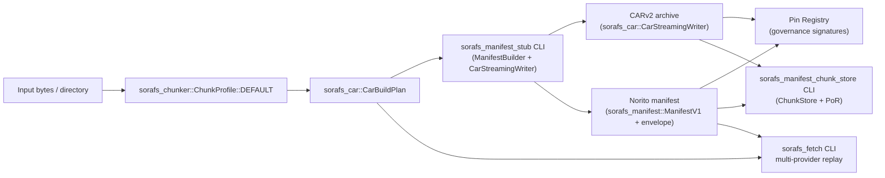
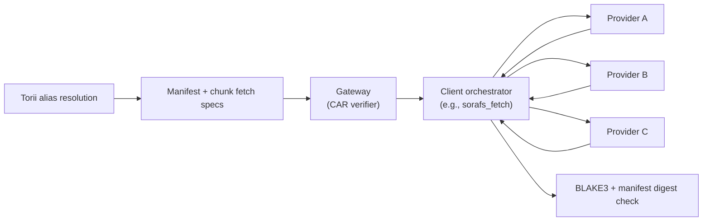

# SoraFS Architecture RFC (SF-1)

This RFC captures the baseline architecture for **SoraFS**, the decentralized
content-addressed storage fabric that underpins the SORA Nexus documentation and
artifact pipeline. It defines the primitives that client/host implementations
must share so that nodes, gateways, and governance tooling can interoperate
without bespoke configuration.

> Status: Ratified by council (2025-10-29). Minutes: [`docs/source/sorafs/council_minutes_2025-10-29.md`](sorafs/council_minutes_2025-10-29.md).

The immediate deliverable for SF-1 is a ratified specification that downstream
teams (storage, networking, smart contracts, devrel) can implement against. The
scope deliberately focuses on single-shard correctness and governance controls;
distributed incentives (SF-8), PoR automation (SF-9), and API ergonomics (SF-6)
are covered in later tasks but inherit the data formats described here.

## Goals

1. **Deterministic chunking and addressing** – all SoraFS nodes produce identical
   chunk boundaries, CIDs, and manifests when presented with the same bytes.
2. **Portable manifests** – Norito-encoded manifests capture DAG roots,
   chunking profiles, pin policies, and governance attestations that Torii,
   gateways, and CLI tooling can verify without RPC backchannels.
3. **CAR interoperability** – CAR archives produced by the reference tooling can
   be streamed, partially fetched, or re-packed by any SoraFS node while
   retaining canonical multihash commitments.
4. **Security-first posture** – the spec must embed threat considerations (DoS,
   alias hijack, stale/poisoned chunks) and assign clear responsibilities to
   manifests, gateways, and governance registries.
5. **Migration-ready** – it must be possible to dual-publish docs/artifacts over

## Non-goals

- Incentive economics, probabilistic payments, and PoR scheduling (SF-8/SF-9).
- Gateway anycast, DNS resolver deployment, and TLS automation (DG workstream).
- Off-chain metadata registries outside of the pin/alias manifests described
  here.

## Terminology

| Term | Definition |
|------|------------|
| **Chunk** | Output of the content-defined chunker before digesting. |
| **Block** | CAR block: multicodec-coded node inside the DAG. |
| **Manifest** | Norito record that binds DAG roots, chunking settings, and governance proofs. |
| **Pin Set** | Ordered list of manifests that a governance actor has approved for replication. |
| **Alias** | Human-friendly name (e.g., `docs.sora`) mapped to one or more manifests. |

## Chunking Profile

SoraFS uses a Rabin-based content defined chunking (CDC) scheme inspired by
FastCDC. The chunker operates with the following deterministic parameters:

| Parameter | Value | Notes |
|-----------|-------|-------|
| Rolling polynomial | `0x3DA3358B4DC173` | Same as FastCDC default. |
| Target size | 262,144 bytes (256 KiB) | Midpoint; governs threshold mask. |
| Minimum size | 65,536 bytes (64 KiB) | Prevents thrashing on small files. |
| Maximum size | 524,288 bytes (512 KiB) | Caps tail chunks. |
| Gear table | Fixed 64 KiB table derived from SHA3-256 seed `sorafs-v1-gear`. |
| Break mask | `0x0000FFFF` | Adaptive mask derived from `target_size`. |

Determinism requirements:

- The chunker MUST discard any platform-dependent SIMD shortcuts and emit the
  same splits regardless of endianness or pointer width.
- Nodes MAY vectorise the rolling hash but must use the reference constants.
- Empty files yield a single zero-length chunk with its own CID (to preserve
  manifest ordering).

Public test vectors are published under [`fixtures/sorafs_chunker`](../../fixtures/sorafs_chunker). The canonical
SF1 profile (`1 MiB` PRNG stream, seed `0x0000000000DEC0DED`) emits five chunks
with lengths `[177082, 210377, 403145, 187169, 70803]`, offsets
`[0, 177082, 387459, 790604, 977773]`, a SHA3-256 boundary digest of
`13fa919c67e55a2e95a13ff8b0c6b40b2e51d6ef505568990f3bc7754e6cc482`, and
BLAKE3 chunk digests
`["7789b490337d16c51b59a92e354a657ba450da4bab872c31e85e4d4fedcb3a27", "56397fe0ff8cc24c790e0719505fff05c49dca09289b595d17455bedcc1f7438", "2a2a47eedcc11effdb5d13190fe09143d6b31f959c72980bb0f2b8a5058971fd", "8dbb40d7a3439aa57bd69a3adfe98ff43b9043764072bc42d7dc211942e46ef8", "194c8180f4b90e021a86199d17092af3b2bd29792dc028e401258d903616b664"]`.
`cargo run -p sorafs_chunker --bin export_vectors` regenerates the JSON/Rust/Go/TS
fixtures alongside a BLAKE3 manifest for provenance checks. The
`ci/check_sorafs_fixtures.sh` job replays this generator in CI; any unsigned or
drifted output fails the pipeline so governance signatures remain attached to
the published vectors. Conformance details and steward responsibilities live in
`docs/source/sorafs/chunker_conformance.md`.

The constants above are enforced by
[`ChunkProfile::DEFAULT`](../../crates/sorafs_chunker/src/lib.rs), and the same
descriptor drives [`CarBuildPlan`](../../crates/sorafs_car/src/lib.rs) +
`CarStreamingWriter` when staging CARs. Registry lookups thread through
[`sorafs_manifest::chunker_registry`](../../crates/sorafs_manifest/src/chunker_registry.rs)
so manifests, CAR tooling, and fixtures stay aligned.

### Implementation Reference Map

| Artifact | Location | Highlights |
|----------|----------|------------|
| Chunker profile & CLI | [`sorafs_chunker`](../../crates/sorafs_chunker/src/lib.rs) · [`export_vectors`](../../crates/sorafs_chunker/src/bin/export_vectors.rs) | `ChunkProfile::DEFAULT` implements the SF-1 parameters, and the CLI regenerates signed fixtures (guarded by council signatures unless `--allow-unsigned` is supplied). |
| CAR planner & fetch tooling | [`sorafs_car`](../../crates/sorafs_car/src/lib.rs) · [`sorafs_fetch`](../../crates/sorafs_car/src/bin/sorafs_fetch.rs) | `CarBuildPlan`, `CarStreamingWriter`, and `ChunkFetchPlan` emit deterministic chunk metadata and PoR descriptors; the fetch CLI replays manifests across multi-provider inputs, enforcing BLAKE3 digests before reassembly. |
| Manifest builder & stub CLI | [`sorafs_manifest`](../../crates/sorafs_manifest/src/lib.rs) · [`sorafs_manifest_stub`](../../crates/sorafs_car/src/bin/sorafs_manifest_stub.rs) | `ManifestBuilder` encodes Norito manifests, attaches pin policy and alias claims, and writes governance envelopes; the stub orchestrates end-to-end CAR + manifest generation for CI and release pipelines. |
| Manifest validator & PoR CLI | [`sorafs_manifest_chunk_store`](../../crates/sorafs_car/src/bin/sorafs_manifest_chunk_store.rs) | Replays CAR payloads through `ChunkStore`, derives PoR trees, and emits manifest reports for QA and governance tooling. |
| Fixture bundle | [`fixtures/sorafs_chunker`](../../fixtures/sorafs_chunker) | Signed JSON/Rust/Go/TS vectors plus manifest digests; CI (`ci/check_sorafs_fixtures.sh`) replays the generator to enforce determinism. |

## DAG & CID Layout

- Each chunk becomes a `raw` block (multicodec `0x55`). The block CID uses
  `multihash` code `0x13` (BLAKE3-256) for CPU efficiency and GPU acceleration
  parity.
- File DAGs follow UnixFS-like balanced trees: leaves reference chunk blocks,
  and intermediate `dag-cbor` nodes (`0x71`) encode balanced fan-out (default
  fan-out = 128) plus file metadata.
- Directory DAGs (for doc builds) use `dag-cbor` with deterministic lexicographic
  ordering by path.
- CAR archives MUST be emitted in CAR v2 format so that chunk indexes can be
  shipped alongside payloads. The index uses little-endian offsets and BLAKE3
  digests to keep hashing uniform.

## Norito Manifest Schema

Manifests are Norito-encoded records that tie together DAG metadata, pinning
policies, and governance attestations. Draft schema:

````norito
struct SoraFsManifestV1 {
    version: u8,                   // Always 1 for SF-1 scope.
    root_cid: [u8; 36],            // Multibase-decoded CID bytes (CIDv1). 
    dag_codec: DagCodecId,         // 0x71 for dag-cbor roots, 0x0129 for dag-json, etc.
    chunking: ChunkingProfileV1,   // Captures CDC parameters + multihash codes.
    content_length: u64,           // Total bytes represented by the DAG.
    car_digest: [u8; 32],          // BLAKE3-256 of the CAR payload section.
    car_size: u64,                 // Bytes of the CAR file (payload + index).
    pin_policy: PinPolicy,         // Minimum replicas, storage class, retention TTL.
    governance: GovernanceProofs,  // Signatures / VRF proofs authorising the pin.
    alias_claims: [AliasClaim; N], // Optional alias bindings bundled with the manifest.
    metadata: MetadataMap,         // Arbitrary Norito map for build info, SBOM hashes, etc.
}
````

The canonical encoding ships as [`ManifestV1`](../../crates/sorafs_manifest/src/lib.rs) with
[`ManifestBuilder`](../../crates/sorafs_manifest/src/lib.rs) wiring Norito values
into manifests that the CLI emits.

Supporting structures:

- `ChunkingProfileV1` re-states the mask, polynomial, and min/avg/max sizes so
  validators can detect unsupported chunkers.
- `PinPolicy` includes `min_replicas`, `storage_class` (`Hot`, `Warm`, `Cold`),
  and `retention_epoch`. Storage nodes resolve the effective retention epoch as
  the minimum of `pin_policy.retention_epoch` and optional metadata caps
  (`sorafs.retention.deal_end_epoch`, `sorafs.retention.governance_cap_epoch`).
- `GovernanceProofs` is a Norito enum that references on-chain pin registry
  entries. For SF-1 the proof list is populated by council signatures over the
  manifest digest (BLAKE3 of canonical Norito encoding).
- `AliasClaim` contains `alias_name`, `alias_namespace` (`sora`, `nexus`), and a
  Merkle proof proving that the alias exists in the registry tree.

## Discovery & Provider Advertisements

Provider discovery is handled by signed Norito adverts propagated via the
discovery mesh. The canonical layout, TTL constraints (24 h max, refresh at
`min(TTL/2, 12 h)`), and path-diversity policy are defined in
[`sorafs_node_client_protocol.md`](sorafs_node_client_protocol.md). Governance-
registered keys must sign the advert body; Torii and gateways reject adverts
from unregistered providers before they reach clients. Adverts include a
`signature_strict` flag so tooling can distinguish governance-signed payloads
(`true`) from diagnostic fixtures (`false`).

The Norito payload is realised by
[`ProviderAdvertV1`](../../crates/sorafs_manifest/src/provider_advert.rs) and
the corresponding builder/validation helpers.

Manifest digests feed directly into the Pin Registry contract (SF-4). The seed
for the digest is `"sorafs-manifest-v1" || canonical_bytes` to keep future
versions distinct.

## Protocol Flows



### Publication

1. The builder invokes `sorafs_manifest_stub` (commonly via `cargo run -p sorafs_car --bin sorafs_manifest_stub -- <payload>`), which:
   1. Streams the payload through `ChunkProfile::DEFAULT`.
   2. Uses `CarBuildPlan` + `CarStreamingWriter` to emit deterministic CAR payload/index files.
   3. Calls `ManifestBuilder` to materialise the `ManifestV1` Norito record, governance envelope, and optional JSON reports.
   4. Optionally exports chunk fetch plans (`--chunk-fetch-plan-out`) for `sorafs_fetch`.

   ```bash
  cargo run -p sorafs_car --bin sorafs_manifest_stub -- docs/book \
     --manifest-out target/sorafs/docs.manifest \
     --manifest-signatures-out target/sorafs/docs.manifest_signatures.json \
     --car-out target/sorafs/docs.car \
     --chunk-fetch-plan-out target/sorafs/docs.fetch_plan.json
   ```
2. Builder submits the manifest to the Pin Registry along with desired
   pin-policy overrides.
3. Governance actors co-sign the manifest digest and update the on-chain pin set.
4. Storage nodes pull manifests from the registry, verify signatures, download
   CARs, and begin seeding.

### Retrieval

1. Client resolves an alias via SoraDNS or Torii APIs and receives the manifest
   root CID + CAR digest.
2. Client requests the CAR (or a subset) from a gateway.
3. Gateway validates the CAR digest and ensures chunk multihashes match manifest
   expectations before serving.
4. Optional: Client verifies alias proof bundle to guarantee the alias was bound
   to this manifest.



### Mutation / Versioning

- Manifests are immutable; a new build publishes a new manifest and optionally
  updates alias pointers atomically via governance proposals.
- Gateways keep `N` historical manifests per alias for rollback.
- The Pin Registry enforces `retention_epoch` to prevent premature garbage
  collection; storage nodes apply the resolved retention epoch (minimum of pin
  policy plus metadata caps) when running GC.

## Governance Controls

### Provider Admission Policy

SoraFS replication remains permissioned throughout SF-1. The council-managed
Provider Registry contract is the canonical allowlist for advertisement keys
and capability TLVs, and Torii rejects `ProviderAdvertV1` payloads that do not
map to an active registry entry. Admission proceeds as follows:

1. The candidate assembles a `ProviderAdmissionProposalV1` Norito payload that
   captures the provider’s Ed25519 advertisement key, Torii endpoints,
   jurisdiction tags, stake pointer, supported chunker handle, and declared
   capability TLVs (streaming, CARv1 bridge, ISO bridge, etc.).
2. The proposal’s canonical encoding is hashed as
   `blake3("sorafs-provider-admission-v1" || canonical_bytes)` and submitted to
   the governance queue together with the signed `ProviderAdvertV1` body and
   remote-attestation bundle. The digest becomes the proposal identifier.
3. A supermajority (≥ 2f + 1) of council signers co-sign the digest. The
   signatures and rotation metadata are published as
   `ProviderAdmissionEnvelope` JSON under
   `governance/providers/<provider_id>/admission.json` and pinned alongside the
   manifest signature bundle.
4. The governance service writes the resulting record into the Provider
   Registry, including an expiry epoch and the chunker handle. Torii, gateways,
   and `sorafs-node` processes drop adverts whenever the envelope hash, handle,
   or expiry does not match the active registry entry.
5. Providers must renew before the resolved retention epoch (minimum of pin
   policy, deal end, and governance cap). When a record lapses, nodes enter
   drain mode, stop accepting new pin allocations from that provider, and gossip
   a `provider_unregistered` event so operators can rotate capacity.

`RegisterPinManifest` now invokes the shared validator from
`sorafs_manifest`, rejecting submissions whose chunker descriptors or pin
policies deviate from the governance constraints. This keeps direct ISI
submissions aligned with the Torii manifest checks while the full registry
policy API comes online.

Admission and renewal events surface through the governance API, and CI ensures
that admission envelopes ship alongside the public chunker fixtures so SDK
teams can exercise parity checks offline.

### Chunker Profile Upgrade Process

All manifests currently point at the `sorafs.sf1@1.0.0` descriptor (numeric
`ProfileId(1)`) which maps to `ChunkProfile::DEFAULT` inside
`sorafs_chunker`. Upgrading the chunker profile follows a governance-controlled
 pipeline (see the detailed authoring guidance in
[`docs/source/sorafs/chunker_profile_authoring.md`](sorafs/chunker_profile_authoring.md)):

1. A profile author drafts `ChunkerProfileProposalV1` specifying the new
   `(namespace, name, semver)` triple, CDC parameters, multihash code, and
   `fixtures/sorafs_chunker/<namespace>.<name>@<semver>/`, Proof-of-Retrievability
   corpora, and cross-language diff reports. If aliases are defined, they MUST be
   listed alongside the canonical handle so provider adverts can propagate them
   via `profile_aliases`.
2. Tooling WG runs the deterministic fuzz/diff suite and extends
   `crates/sorafs_car/src/chunker_registry_data.rs` with a new descriptor id.
   IDs are monotonically increasing; existing profile IDs and handles never
   change.
3. Council members review the proposal, sign the
   `chunker_profile_digest = blake3("sorafs-chunker-profile-v1" || canonical_bytes)`,
   and publish a `ChunkerProfileEnvelope` JSON next to the fixture manifest
   signatures.
4. Once the envelope lands, the registry crate ships the new descriptor, docs
   update `docs/source/sorafs/chunker_registry.md`, and the CLI/gateway tooling
   gated by `--chunker-profile` gains opt-in support. Existing manifests remain
   valid and continue pointing at `sorafs.sf1@1.0.0` until they are rebuilt
   against the new profile.
5. After two successful release trains, governance may mark the previous
   metadata; consumers must still accept historical manifests, but CI warns when

### Hybrid Envelope Migration Plan

During SF-1 the manifest digest is attested both on-chain and via JSON envelopes
so downstream consumers can verify artifacts even before the governance
contracts reach mainnet. The migration plan keeps both paths alive while the
Pin Registry rolls out:

- **H0 — Dual publication (current).** `sorafs_manifest_stub` emits `manifest_signatures.json` containing the manifest
  digest, chunk digest SHA3-256 summary, and council signatures. The envelope is
  stored next to the CAR and manifest in SoraFS and mirrored in
  `fixtures/sorafs_chunker`. Off-chain consumers verify artifacts exclusively
  with the envelope.
- **H1 — Pin Registry integration.** Once the Pin Registry contract is
  deployed, the same digest and envelope hash are recorded on-chain. Governance
  automation verifies that the on-chain digest matches the envelope before
  marking a manifest as `Approved`. Storage nodes accept pins if either
  (a) the registry entry is live, or (b) the envelope verifies under the current
  council key set and the entry is within the migration grace window.
- **H2 — Envelope as audit trail.** After two registry releases with parity
  checks, manifest publication always records the digest on-chain, but the
  envelope continues shipping for offline audit and provenance. CI jobs
  (`ci/check_sorafs_fixtures.sh` and the nightly `sorafs-fixtures` verification
  workflow) fail if a manifest is missing either the registry entry or the
  envelope signature bundle.
- **H3 — Full registry enforcement.** When governance declares the migration
  complete, new manifests must have an active registry entry; envelopes remain
  as immutable audit records but are no longer sufficient on their own. Older
  manifests stay grandfathered and can be served as long as their envelope
  verifies.

The hybrid approach allows documentation pipelines and SDK consumers to adopt
SoraFS gradually without losing the determinism guarantees already provided by
the signed envelopes.

#### Hybrid Payload Envelope V1 (Groundwork)

`sorafs_manifest::hybrid_envelope::HybridPayloadEnvelopeV1` now implements the
cryptographic framing for SF-4b. The helper encapsulates X25519 (`StaticSecret`
→ ephemeral public) and ML-KEM-768 (Kyber) material, feeds the concatenated
secrets through HKDF-SHA3-256 with the domain strings
`"sorafs.hybrid.kem.hkdf:v1"`/`"sorafs.hybrid.kem.material:v1"`/`"sorafs.hybrid.kem.rekey:v1"`,
and derives:

- `encryption_key` — 32-byte ChaCha20-Poly1305 key used to seal the manifest or
  chunk payload alongside caller-provided AAD (`norito` manifest digest, alias,
  etc.).
- `rekey_secret` — deterministic 32-byte secret reserved for rolling envelope
  refresh without rotating the long-term hybrid keys.

The envelope serialises to Norito as:

| Field | Type | Description |
|-------|------|-------------|
| `version` | `u8` | `1` for the initial release. |
| `suite` | `String` | Canonical suite label (`"x25519-mlkem768-chacha20poly1305"`). |
| `kem.ephemeral_public` | `Vec<u8>` | Sender X25519 ephemeral public key. |
| `kem.kyber_ciphertext` | `Vec<u8>` | Kyber encapsulation ciphertext. |
| `nonce` | `[u8; 12]` | ChaCha20-Poly1305 nonce generated per envelope. |
| `ciphertext` | `Vec<u8>` | AEAD output (`payload || tag`). |

The canonical associated data for manifest envelopes is
`sorafs.hybrid.manifest.v1 || manifest_digest || chunk_digest_sha3 || len(name) || name`,
anchoring the ciphertext to both the manifest digest and the CAR summary. The
`sorafs_manifest_stub` CLI now exposes
`--hybrid-recipient-x25519[(-file)]`, `--hybrid-recipient-kyber[(-file)]`, and
`--hybrid-envelope-{out,json-out}` so publishers can generate Norito-encoded
`HybridPayloadEnvelopeV1` artefacts alongside manifests and CARs. The helper
automatically adds `manifest.requires_envelope=true` and
`manifest.hybrid_suite=x25519-mlkem768-chacha20poly1305` metadata, emits binary
and JSON envelopes on demand, and records envelope fingerprints in the CLI
report for downstream tooling. Gateways and SDKs reuse the same helper so
decryptors can round-trip without bespoke logic.

## Migration Roadmap

deterministic SoraFS pinning, and alias discovery in sync. Each subsection
below details the expected owner actions and success criteria so downstream
teams can execute in parallel without blocking the rollout.

### Deterministic Pinning Adoption

- **Stage (M0).** Storage operators follow the `sorafs_chunker` fixtures and
  publish weekly dry-run reports in `docs/source/sorafs/reports/determinism.md`
  confirming their chunk digests match the canonical vectors.
- **Enforce (M1).** CI blocks merges when `ci/check_sorafs_fixtures.sh` or the
  nightly `sorafs-fixtures` workflow detects unsigned manifests. Operators must
  document deviations and attach governance waivers before proceeding.
- **Registry-first (M2).** Pin requests are enqueued through the registry
  contract; manual envelope approval becomes a fallback path that expires after
  14 days. The storage CLI defaults to `--require-registry`.
- **Audit (M3).** Observability dashboards emit parity alerts comparing live
  chunk inventories with the manifests recorded in the registry. Operators must
  resolve discrepancies within one publishing window (24 hours) or fail over to
  the contingency providers listed in the pin policy.

### Alias Transition Timeline

| Phase | Alias Source | Gateway Behaviour | Operator Action |
|-------|--------------|-------------------|-----------------|

### Downstream Change Log

- **M0:** Teams consume new chunker fixtures; pipelines emit CAR + manifest
- **M1:** CI enforces deterministic fixtures; alias proofs published in staging;
  docs tooling gains expectation flags on `sorafs_manifest_stub` (`--car-digest`,
  `--car-size`, `--root-cid`, etc.).
  assets switch to read-only; gateways prefer registry proofs over envelopes.
- **M3:** Alias-only access enforced; observability alerts on registry parity;

The change log above is mirrored in `docs/source/sorafs/migration_ledger.md` so
SDK and operator teams can subscribe to updates. Future adjustments MUST update
the ledger and this section simultaneously to maintain a single source of
truth.

### Council Review & Publication

The council reviewed and ratified this RFC on 2025-10-29. The review outcome and
attestation steps are recorded in
[`docs/source/sorafs/council_minutes_2025-10-29.md`](sorafs/council_minutes_2025-10-29.md).
Artifacts validated during the session:

1. The rendered RFC (Markdown/PDF) and the latest
   `manifest_signatures.json`.
2. Provider admission and chunker profile envelopes used by governance tooling.
3. CI gates ensuring fixture signatures remain in sync (`ci/check_sorafs_fixtures.sh`).

Future revisions must update the minutes and status log when additional
governance decisions modify SF-1 requirements.

## Appendix A: Threat Model & Mitigations

### Adversary Classes

SoraFS inherits the trust assumptions of the Nexus governance layer, but the
storage fabric adds several distinct adversary profiles that the protocol must
defend against:

- **Poisoned providers** — storage nodes that attempt to serve corrupted chunks,
  deny service selectively, or pollute manifests during publication.
- **Replayed manifest operators** — actors who replay stale manifests, chunker
  profiles, or governance envelopes in order to pin clients to superseded data or bypass
  revocation.
- **Store-now-decrypt-later observers** — parties that archive encrypted payload
  envelopes today with the intent of decrypting them once post-quantum attacks
  on classical primitives become practical.
- **Opportunistic disruptors** — clients who abuse publication APIs or alias
  updates to exhaust gateway resources or eclipse honest peers.

The controls below map each adversary to enforceable countermeasures. Future
roadmap items (SF-2, SF-4b, SF-5) build additional defence-in-depth but do not
weaken the guarantees stated here.

### Poisoned Providers (Malicious Replicators)

**Capabilities.** A poisoned provider can advertise itself legitimately (via
valid governance envelopes) and then attempt to serve malformed CAR streams,
withhold specific chunks, or inject garbage into manifests during replication.

**Mitigations.**

- Provider admission remains gated by council-signed envelopes in the Provider
  Registry, so poisoned nodes can be evicted by revoking their manifest entry.
- Every chunk is addressed by a BLAKE3 multihash; gateways and clients validate
  the digest before forwarding blocks. The manifest digest binds the CAR index,
  eliminating room for tampering once governance has signed the manifest.
- Provider adverts list deterministic chunker handles. `ChunkProfile::DEFAULT`
  is the only handle admitted during SF-1, so mismatched chunk boundaries are an
  immediate policy violation.
- Retrieval flows MUST sample at least two distinct providers (SF-2), and the
  Pin Registry enforces replica minimums so a single poisoned provider cannot
  starve consumers.
- Telemetry exporters record chunk failures per provider; council policy can
  revoke offenders by removing their advertisement envelope from the registry.

### Replayed or Stale Manifests

**Capabilities.** Replay operators attempt to trick clients into accepting an
older manifest (e.g., pre-rotation keys, revoked aliases) by serving cached
artifacts or forging timestamps.

**Mitigations.**

- The manifest contains `pin_policy.retention_epoch` and `alias_version`. Torii
  APIs and gateways reject payloads that fall outside the active governance
  window or present stale alias versions. Optional metadata caps
  (`sorafs.retention.deal_end_epoch`, `sorafs.retention.governance_cap_epoch`)
  bound the effective retention used by storage nodes.
- Alias proofs include a Merkle path against the on-chain registry. Clients
  verify the proof hash against the current registry root fetched from Torii,
  preventing stale manifests from gaining alias authority.
- Governance envelopes carry monotonically increasing `revision` numbers. Nodes
  MUST cache the latest revision and refuse envelopes that do not advance the
  sequence.
- CI pipelines regenerate fixtures on every publish; `ci/check_sorafs_fixtures.sh`
  fails if manifests do not match the signed baseline, so stale artefacts never
  enter release bundles.
- Gossip `manifest_superseded` events and require clients to drop cached
  manifests whose sequence does not match the latest registry pointer.

### Store-Now-Decrypt-Later Observers

**Capabilities.** An adversary captures encrypted payloads or manifests today
and waits for classical cryptography (X25519 + Ed25519) to become breakable,
revealing sensitive data retroactively.

**Mitigations.**

- Manifest digests do not expose plaintext; sensitive blobs remain in chunk
  payloads. Even so, SF-4b introduces hybrid KEM/DEM (X25519 + ML-KEM-768 over
  ChaCha20-Poly1305) envelopes so that payloads remain confidential under PQ
- Governance policy documents rotation intervals for hybrid envelopes; new
  manifests require explicit council waivers.
- Manifests carry classification metadata (`sensitivity`) and optional
  retention caps so CLI and SDK tooling can warn when ciphertext sits beyond
  its approved cryptoperiod.
- Clients MAY supply per-request additional-authentication material (AAM) that
  stays off providers, ensuring stored ciphertext cannot be decrypted even if a
  future primitive weakens.

### Additional Threats

| Threat | Mitigation |
|--------|------------|
| Alias hijack | Alias claims include Merkle proofs against the registry; gateways refuse responses without fresh proofs and Torii exposes revocation telemetry. |
| Partial availability | Pin policies mandate minimum replicas; observability hooks sample retrieval latency and chunk presence to trigger re-replication. |
| DoS via oversized manifests | Builders enforce maximum CAR size and chunk count; gateways rate-limit uploads, verify manifests before acceptance, and can shunt abusive clients. |
| Gossip eclipse | Discovery protocol (SF-2) requires multi-peer gossip and path diversity; manifests list bootstrap peers so clients can reseed when eclipsed. |

Operational expectations:

- Gateways MUST staple `Sora-Name`, `Sora-CID`, and `Sora-Proof` headers on
  every response so clients can verify alias bindings without extra round-trips.
- CLI tooling MUST expose expectation flags (`--car-digest=<hex>`,
  `--car-size=<bytes>`, `--root-cid=<hex>`, etc.) so build pipelines can pin
  exact outputs and detect tampering automatically.

## Migration Plan (M0 → M3)

- **M0 (Weeks 1–6):**
  - Land reference chunker crate + Norito manifest schema in workspace.
  - Ship `sorafs_manifest_stub` CLI plumbing that emits CAR + manifest + digest file.
  - Stand up a single-node gateway that serves from local disk; publish docs via
- **M1 (Weeks 7–12):**
  - Deploy Pin Registry smart contract with manifest digest verification.
  - Finalise the pin registry Norito schemas in
    `crates/sorafs_manifest/src/pin_registry.rs` so Torii, the contract, and CLI
    fixtures share an identical encoding.
  - Add CLI commands (`sorafs pin propose`, `sorafs pin approve`).
  - Record availability metrics (success/failure counters) but no incentives yet.
- **M2 (Weeks 13–20):**
  - Hook observability exporters (Prometheus + Grafana dashboards) to storage
    nodes and gateways.
  - Integrate preliminary deal engine skeleton so governance can schedule
    replicas per storage class.
- **M3 (Week 21+):**
  - Roll out probabilistic payments and PoR automation (handoff to SF-8/SF-9).
  - Anycast the gateway fleet and finish rollout of alias-only access for docs.

## Open Questions

1. Do we need a compact multi-alias proof format to reduce gateway header size?
2. Should CAR signatures live inside the manifest or remain separate artifacts
   for Sigstore/Supply-chain tooling?
3. How aggressively should gateways cache manifests given governance update
   cadence? (Current strawman: 10-minute TTL with backoff.)

These questions are tracked in the roadmap hot list; answers will update this
RFC before SF-1 is marked complete.

## Next Steps

- Circulate the migration roadmap deliverable (`docs/source/sorafs/migration_roadmap.md`) for council review and operator feedback (tracking updates in the migration ledger).
- Socialise the new CLI sample (`docs/source/examples/sorafs_manifest/cli_end_to_end.md`) with release engineering and expand with SDK-driven retrieval examples.
- Execute the Pin Registry validation plan (`docs/source/sorafs/pin_registry_validation_plan.md`) so Torii and the contract share deterministic manifest checks.
