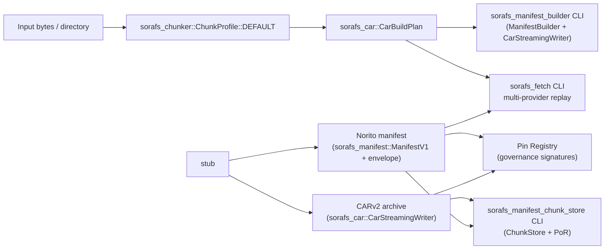
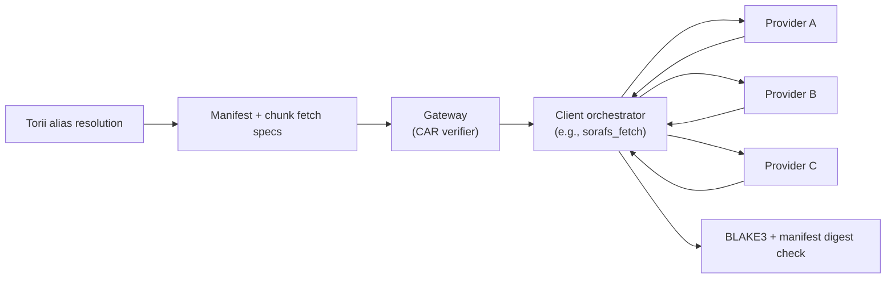

# SoraFS Architecture RFC (SF-1)

This RFC captures the baseline architecture for **SoraFS**, the decentralized
content-addressed storage fabric that underpins the SORA Nexus documentation and
artifact pipeline. It defines the primitives that client/host implementations
must share so that nodes, gateways, and governance tooling can interoperate
without bespoke configuration.

> Status: first-release specification implemented in the repository and under
> production-readiness validation. Council ratification and deployment evidence
> are external release inputs; this repository does not contain council minutes
> for the previously claimed 2025-10-29 review.

SF-1 defines the first-release contract that storage, networking, smart-contract,
and developer tooling must implement consistently. Hosted promotion additionally
requires the signed, deployment-bound evidence enforced by
`scripts/check_sorafs_production_readiness.py`; repository implementation alone
does not prove that a production fleet has been deployed or reviewed.

## Goals

1. **Deterministic chunking and addressing** – all SoraFS nodes produce identical
   chunk boundaries, CIDs, and manifests when presented with the same bytes.
2. **Portable manifests** – Norito-encoded manifests capture DAG roots,
   chunking profiles, pin policies, and governance attestations that Torii,
   gateways, and CLI tooling can verify without RPC backchannels.
3. **CAR interoperability** – CAR archives produced by the reference tooling can
   be streamed, partially fetched, or re-packed by any SoraFS node while
   retaining canonical multihash commitments.
4. **Security-first posture** – the spec must embed threat considerations (DoS,
   alias hijack, stale/poisoned chunks) and assign clear responsibilities to
   manifests, gateways, and governance registries.
5. **Single first-release path** – publication and retrieval use the canonical
   V1 manifest, Pin Registry, and alias-proof contracts. Pre-release envelope-only
   or caller-summary paths are not accepted.

## Non-goals

- Incentive economics, probabilistic payments, and PoR scheduling (SF-8/SF-9).
- Gateway anycast, DNS resolver deployment, and TLS automation (DG workstream).
- Off-chain metadata registries outside of the pin/alias manifests described
  here.

## Terminology

| Term | Definition |
|------|------------|
| **Chunk** | Output of the content-defined chunker before digesting. |
| **Block** | CAR block: multicodec-coded node inside the DAG. |
| **Manifest** | Norito record that binds DAG roots, chunking settings, and governance proofs. |
| **Pin Set** | Ordered list of manifests that a governance actor has approved for replication. |
| **Alias** | Human-friendly name (e.g., `docs.sora`) mapped to one or more manifests. |

## Chunking Profile

SoraFS uses a FastCDC-style gear rolling hash for content defined chunking
(CDC). The chunker operates with the following deterministic parameters:

| Parameter | Value | Notes |
|-----------|-------|-------|
| Rolling hash | Rotate-left-by-1 plus gear-table addition | No Rabin polynomial state is used. |
| Target size | 262,144 bytes (256 KiB) | Midpoint; governs threshold mask. |
| Minimum size | 65,536 bytes (64 KiB) | Prevents thrashing on small files. |
| Maximum size | 524,288 bytes (512 KiB) | Caps tail chunks. |
| Gear table | 256 deterministic `u64` entries derived from SHA3-256 seed `sorafs-v1-gear` plus the little-endian byte index. |
| Break mask | `0x0000FFFF` | Adaptive mask derived from `target_size`. |

Determinism requirements:

- The chunker MUST discard any platform-dependent SIMD shortcuts and emit the
  same splits regardless of endianness or pointer width.
- Nodes MAY vectorise the rolling hash but must use the reference constants.
- Empty files yield a single zero-length chunk with its own CID (to preserve
  manifest ordering).

Public test vectors are published under [`fixtures/sorafs_chunker`](../../fixtures/sorafs_chunker). The canonical
SF1 profile (`1 MiB` PRNG stream, seed `0x0000000000DEC0DED`) emits five chunks
with lengths `[177082, 210377, 403145, 187169, 70803]`, offsets
`[0, 177082, 387459, 790604, 977773]`, a SHA3-256 boundary digest of
`13fa919c67e55a2e95a13ff8b0c6b40b2e51d6ef505568990f3bc7754e6cc482`, and
BLAKE3 chunk digests
`["7789b490337d16c51b59a92e354a657ba450da4bab872c31e85e4d4fedcb3a27", "56397fe0ff8cc24c790e0719505fff05c49dca09289b595d17455bedcc1f7438", "2a2a47eedcc11effdb5d13190fe09143d6b31f959c72980bb0f2b8a5058971fd", "8dbb40d7a3439aa57bd69a3adfe98ff43b9043764072bc42d7dc211942e46ef8", "194c8180f4b90e021a86199d17092af3b2bd29792dc028e401258d903616b664"]`.
`cargo run -p sorafs_chunker --bin export_vectors` regenerates the JSON/Rust/Go/TS
fixtures alongside a BLAKE3 manifest for provenance checks. The
`ci/check_sorafs_fixtures.sh` job replays this generator in CI; any unsigned or
drifted output fails the pipeline so governance signatures remain attached to
the published vectors. Conformance details and steward responsibilities live in
`docs/source/sorafs/chunker_conformance.md`.

The constants above are enforced by
[`ChunkProfile::DEFAULT`](../../crates/sorafs_chunker/src/lib.rs), and the same
descriptor drives [`CarBuildPlan`](../../crates/sorafs_car/src/lib.rs) +
`CarStreamingWriter` when staging CARs. Registry lookups thread through
[`sorafs_manifest::chunker_registry`](../../crates/sorafs_manifest/src/chunker_registry.rs)
so manifests, CAR tooling, and fixtures stay aligned.

### Implementation Reference Map

| Artifact | Location | Highlights |
|----------|----------|------------|
| Chunker profile & CLI | [`sorafs_chunker`](../../crates/sorafs_chunker/src/lib.rs) · [`export_vectors`](../../crates/sorafs_chunker/src/bin/export_vectors.rs) | `ChunkProfile::DEFAULT` implements the SF-1 parameters, and the CLI regenerates signed fixtures with mandatory council signatures. |
| CAR planner & fetch tooling | [`sorafs_car`](../../crates/sorafs_car/src/lib.rs) · [`sorafs_fetch`](../../crates/sorafs_car/src/bin/sorafs_fetch.rs) | `CarBuildPlan`, `CarStreamingWriter`, and `ChunkFetchPlan` emit deterministic chunk metadata and PoR descriptors; the fetch CLI replays manifests across multi-provider inputs, enforcing BLAKE3 digests before reassembly. |
| Manifest builder CLI | [`sorafs_manifest`](../../crates/sorafs_manifest/src/lib.rs) · [`sorafs_manifest_builder`](../../crates/sorafs_car/src/bin/sorafs_manifest_builder.rs) | `ManifestBuilder` encodes Norito manifests, attaches pin policy and alias claims, and writes governance envelopes; the builder orchestrates end-to-end CAR + manifest generation for CI and release pipelines. |
| Manifest validator & PoR CLI | [`sorafs_manifest_chunk_store`](../../crates/sorafs_car/src/bin/sorafs_manifest_chunk_store.rs) | Replays CAR payloads through `ChunkStore`, derives PoR trees, and emits manifest reports for QA and governance tooling. |
| Fixture bundle | [`fixtures/sorafs_chunker`](../../fixtures/sorafs_chunker) | Signed JSON/Rust/Go/TS vectors plus manifest digests; CI (`ci/check_sorafs_fixtures.sh`) replays the generator to enforce determinism. |

## DAG & CID Layout

- Each chunk becomes a `raw` block (multicodec `0x55`). The block CID uses
  `multihash` code `0x1f` (BLAKE3-256) for CPU efficiency and GPU acceleration
  parity.
- File DAGs follow UnixFS-like balanced trees: leaves reference chunk blocks,
  and intermediate `dag-cbor` nodes (`0x71`) encode balanced fan-out (default
  fan-out = 128) plus file metadata.
- Directory DAGs (for doc builds) use `dag-cbor` with deterministic lexicographic
  ordering by path.
- CAR archives MUST be emitted in CAR v2 format so that chunk indexes can be
  shipped alongside payloads. The index uses little-endian offsets and BLAKE3
  digests to keep hashing uniform.

## Norito Manifest Schema

Manifests are Norito-encoded records that tie together DAG metadata, pinning
policies, and governance attestations. The implemented V1 schema is:

````norito
struct SoraFsManifestV1 {
    version: u8,                   // Always 1 for SF-1 scope.
    root_cid: [u8; 36],            // Multibase-decoded CID bytes (CIDv1).
    dag_codec: DagCodecId,         // 0x71 for dag-cbor roots, 0x0129 for dag-json, etc.
    chunking: ChunkingProfileV1,   // Captures CDC parameters + multihash codes.
    chunk_digest_sha3_256: [u8; 32], // SHA3-256 of ordered LE64 offsets, LE64 lengths, and BLAKE3 digests.
    content_length: u64,           // Total bytes represented by the DAG.
    car_digest: [u8; 32],          // BLAKE3-256 of the CAR payload section.
    car_size: u64,                 // Bytes of the CAR file (payload + index).
    pin_policy: PinPolicy,         // Minimum replicas, storage class, retention TTL.
    governance: GovernanceProofs,  // Signatures / VRF proofs authorising the pin.
    alias_claims: [AliasClaim; N], // Optional alias bindings bundled with the manifest.
    metadata: MetadataMap,         // Arbitrary Norito map for build info, SBOM hashes, etc.
}
````

The canonical encoding ships as [`ManifestV1`](../../crates/sorafs_manifest/src/lib.rs) with
[`ManifestBuilder`](../../crates/sorafs_manifest/src/lib.rs) wiring Norito values
into manifests that the CLI emits.

Supporting structures:

- `ChunkingProfileV1` re-states the mask, polynomial, and min/avg/max sizes so
  validators can detect unsupported chunkers.
- `PinPolicy` includes `min_replicas`, `storage_class` (`Hot`, `Warm`, `Cold`),
  and `retention_epoch`. Storage nodes resolve the effective retention epoch as
  the minimum of `pin_policy.retention_epoch` and optional metadata caps
  (`sorafs.retention.deal_end_epoch`, `sorafs.retention.governance_cap_epoch`).
- `GovernanceProofs` is a Norito enum that references on-chain pin registry
  entries. For SF-1 the proof list is populated by council signatures over the
  manifest digest (BLAKE3 of canonical Norito encoding).
- `AliasClaim` contains `alias_name`, `alias_namespace` (`sora`, `nexus`), and a
  Merkle proof proving that the alias exists in the registry tree.

## Discovery & Provider Advertisements

Provider discovery is handled by signed Norito adverts propagated via the
discovery mesh. The canonical layout, TTL constraints (24 h max, refresh at
`min(TTL/2, 12 h)`), and path-diversity policy are defined in
[`sorafs_node_client_protocol.md`](sorafs_node_client_protocol.md). Governance-
registered keys must sign the domain-separated canonical advert envelope,
including timestamps and policy fields; Torii and gateways reject adverts from
unregistered providers before they reach clients. Torii requires
`signature_strict=true`, rejects future issuance and non-monotonic provider
updates, and never lets a remote advert bypass signature verification. Each
accepted provider high-water timestamp and advert fingerprint is committed to a
bounded canonical Norito checkpoint before the live cache changes. Atomic writes,
private file mode, no-follow path checks, and fail-closed startup validation keep
restart, corruption, and symlink attacks from reopening the replay window. A
lifetime OS lock on the adjacent checkpoint lock file rejects multiple Torii
owners of one replay store and prevents cross-process last-writer-wins rollback.

The Norito payload is realised by
[`ProviderAdvertV1`](../../crates/sorafs_manifest/src/provider_advert.rs) and
the corresponding builder/validation helpers.

Manifest digests feed directly into the Pin Registry contract (SF-4). The
digest input is the exact canonical Norito `ManifestV1` byte sequence, hashed
with BLAKE3 as implemented by `ManifestV1::digest`. Version separation is
carried inside those signed bytes by `version = 1`; validators must not prepend
an undocumented domain string and thereby derive a different registry key.

## Protocol Flows



### Publication

1. The builder invokes `sorafs_manifest_builder` (commonly via `cargo run -p sorafs_car --bin sorafs_manifest_builder -- <payload>`), which:
   1. Streams the payload through `ChunkProfile::DEFAULT`.
   2. Uses `CarBuildPlan` + `CarStreamingWriter` to emit deterministic CAR payload/index files.
   3. Calls `ManifestBuilder` to materialise the `ManifestV1` Norito record, governance envelope, and optional JSON reports.
   4. Optionally exports chunk fetch plans (`--chunk-fetch-plan-out`) for `sorafs_fetch`.

   ```bash
  cargo run -p sorafs_car --bin sorafs_manifest_builder -- docs/book \
     --manifest-out target/sorafs/docs.manifest \
     --manifest-signatures-out target/sorafs/docs.manifest_signatures.json \
     --car-out target/sorafs/docs.car \
     --chunk-fetch-plan-out target/sorafs/docs.fetch_plan.json
   ```
2. Builder submits the manifest to the Pin Registry along with desired
   pin-policy overrides.
3. Governance actors co-sign the manifest digest and update the on-chain pin set.
4. Storage nodes pull manifests from the registry, verify signatures, download
   CARs, and begin seeding.

### Retrieval

1. Client resolves an alias via SoraDNS or Torii APIs and receives the manifest
   root CID + CAR digest.
2. Client requests the CAR (or a subset) from a gateway.
3. Gateway validates the CAR digest and ensures chunk multihashes match manifest
   expectations before serving.
4. Client verifies the alias proof bundle against the current registry root to
   guarantee that the alias is bound to this manifest.



### Mutation / Versioning

- Manifests are immutable; a new build publishes a new manifest and optionally
  updates alias pointers atomically via governance proposals.
- Gateways keep `N` historical manifests per alias for rollback.
- The Pin Registry enforces `retention_epoch` to prevent premature garbage
  collection; storage nodes apply the resolved retention epoch (minimum of pin
  policy plus metadata caps) when running GC.

## Governance Controls

### Provider Admission Policy

SoraFS replication remains permissioned throughout SF-1. The council-managed
Provider Registry contract is the canonical allowlist for advertisement keys
and capability TLVs, and Torii rejects `ProviderAdvertV1` payloads that do not
map to an active registry entry. Admission proceeds as follows:

1. The candidate assembles a `ProviderAdmissionProposalV1` Norito payload that
   captures the provider’s Ed25519 advertisement key, Torii endpoints,
   jurisdiction tags, stake pointer, supported chunker handle, and declared
   capability TLVs (streaming, CARv1 bridge, ISO bridge, etc.).
2. The proposal’s canonical encoding is hashed as
   `blake3("sorafs-provider-admission-v1" || canonical_bytes)` and submitted to
   the governance queue together with the signed `ProviderAdvertV1` body and
   remote-attestation bundle. The digest becomes the proposal identifier.
3. A supermajority (≥ 2f + 1) of council signers co-sign the digest. The
   signatures and rotation metadata are published as
   `ProviderAdmissionEnvelope` JSON under
   `governance/providers/<provider_id>/admission.json` and pinned alongside the
   manifest signature bundle.
4. The governance service writes the resulting record into the Provider
   Registry, including an expiry epoch and the chunker handle. Torii, gateways,
   and `sorafs-node` processes drop adverts whenever the envelope hash, handle,
   or expiry does not match the active registry entry.
5. Providers must renew before the resolved retention epoch (minimum of pin
   policy, deal end, and governance cap). An expired record is ineligible for
   new allocations. Production qualification must prove that the deployed
   orchestrator drains the provider, schedules replacement capacity, and emits
   the required operational evidence; this repository does not claim a
   `provider_unregistered` gossip message that is absent from the implementation.

`RegisterPinManifest` carries the complete canonical Norito `ManifestV1`, not
caller-provided summaries. Consensus decodes it under explicit resource limits,
revalidates the root/chunk-plan/CAR commitments, immutable chunker geometry, pin policy,
metadata, aliases, and any embedded signatures, then derives the manifest
digest and distinct content root CID before fees or state mutation. Direct ISI
submission therefore has the same authority checks as Torii ingress and cannot
substitute a manifest digest, chunk-plan digest, root, profile, length, or policy summary.

Admission and renewal events surface through the governance API, and CI ensures
that admission envelopes ship alongside the public chunker fixtures so SDK
teams can exercise parity checks offline.

### Chunker Profile Upgrade Process

All manifests currently point at the `sorafs.sf1@1.0.0` descriptor (numeric
`ProfileId(1)`) which maps to `ChunkProfile::DEFAULT` inside
`sorafs_chunker`. Upgrading the chunker profile follows a governance-controlled
 pipeline (see the detailed authoring guidance in
[`docs/source/sorafs/chunker_profile_authoring.md`](sorafs/chunker_profile_authoring.md)):

1. A profile author drafts `ChunkerProfileProposalV1` specifying the new
   `(namespace, name, semver)` triple, CDC parameters, multihash code, and
   `fixtures/sorafs_chunker/<namespace>.<name>@<semver>/`, Proof-of-Retrievability
   corpora, and cross-language diff reports. If aliases are defined, they MUST be
   listed alongside the canonical handle so provider adverts can propagate them
   via `profile_aliases`.
2. Tooling WG runs the deterministic fuzz/diff suite and extends
   `crates/sorafs_car/src/chunker_registry_data.rs` with a new descriptor id.
   IDs are monotonically increasing within the first-release registry snapshot.
3. Council members review the proposal, sign the
   `chunker_profile_digest = blake3("sorafs-chunker-profile-v1" || canonical_bytes)`,
   and publish a `ChunkerProfileEnvelope` JSON next to the fixture manifest
   signatures.
4. Once the envelope lands, the registry crate ships the new descriptor, docs
   update `docs/source/sorafs/chunker_registry.md`, and the CLI/gateway tooling
   gains support only after its conformance fixtures pass. Because this is the
   first release, a profile replacement may invalidate pre-release manifests;
   the release bundle and registry snapshot must be regenerated atomically.
5. Governance selects exactly one admitted first-release profile set. CI rejects
   manifests that reference a profile absent from that signed registry snapshot.

### Registry and Audit-Envelope Contract

The first release has one admission path. `sorafs_manifest_builder` emits
`manifest_signatures.json` containing the manifest digest, chunk digest
SHA3-256 commitment, and governance signatures. Publication records the same
canonical manifest and signature-envelope commitment in the Pin Registry.
Storage nodes accept a pin only when the active registry entry, canonical
manifest, and signature bundle agree. The JSON envelope remains an immutable
offline audit and provenance artifact; it is never an alternative authority.

There is no grace window, envelope-only fallback, or grandfathered pre-release
manifest. CI verifies the checked-in fixture bundles, and the production gate
requires deployment-bound evidence from the authoritative registry before a
release can be marked ready.

#### Hybrid Payload Envelope V1 (Groundwork)

`sorafs_manifest::hybrid_envelope::HybridPayloadEnvelopeV1` now implements the
cryptographic framing for SF-4b. The helper encapsulates X25519 (`StaticSecret`
→ ephemeral public) and ML-KEM-768 (Kyber) material, feeds the concatenated
secrets through HKDF-SHA3-256 with the domain strings
`"sorafs.hybrid.kem.hkdf:transcript-v1"`/`"sorafs.hybrid.kem.material:transcript-v1"`/`"sorafs.hybrid.kem.rekey:transcript-v1"`,
and derives:

- `encryption_key` — 32-byte ChaCha20-Poly1305 key used to seal the manifest or
  chunk payload alongside caller-provided AAD (`norito` manifest digest, alias,
  etc.).
- `rekey_secret` — deterministic 32-byte secret reserved for rolling envelope
  refresh without rotating the long-term hybrid keys.

The envelope serialises to Norito as:

| Field | Type | Description |
|-------|------|-------------|
| `version` | `u8` | `1` for the initial release. |
| `suite` | `String` | Canonical suite label (`"x25519-mlkem768-chacha20poly1305-transcript-v1"`). |
| `kem.ephemeral_public` | `Vec<u8>` | Sender X25519 ephemeral public key. |
| `kem.kyber_ciphertext` | `Vec<u8>` | Kyber encapsulation ciphertext. |
| `nonce` | `[u8; 12]` | ChaCha20-Poly1305 nonce generated per envelope. |
| `ciphertext` | `Vec<u8>` | AEAD output (`payload || tag`). |

The canonical associated data for manifest envelopes is
`sorafs.hybrid.manifest.v1 || manifest_digest || chunk_digest_sha3 || len(name) || name`,
anchoring the ciphertext to both the manifest digest and the CAR summary. The
`sorafs_manifest_builder` CLI now exposes
`--hybrid-recipient-x25519[(-file)]`, `--hybrid-recipient-kyber[(-file)]`, and
`--hybrid-envelope-{out,json-out}` so publishers can generate Norito-encoded
`HybridPayloadEnvelopeV1` artefacts alongside manifests and CARs. The helper
automatically adds `manifest.requires_envelope=true` and
`manifest.hybrid_suite=x25519-mlkem768-chacha20poly1305-transcript-v1` metadata, emits binary
and JSON envelopes on demand, and records envelope fingerprints in the CLI
report for downstream tooling. Gateways and SDKs reuse the same helper so
decryptors can round-trip without bespoke logic.

The envelope schema is the first release (`version = 1`) and does not carry a
legacy path: decryptors reject the old pre-release bare suite label.

## First-Release Rollout Contract

The retained migration documents describe deployment sequencing, not wire-format
compatibility. Every environment must use the canonical V1 pin, provider, and
alias contracts from its first accepted manifest.

### Deterministic Pinning Adoption

- **Local conformance.** `ci/check_sorafs_fixtures.sh` verifies deterministic,
  signed fixture output; CLI and SDK guards reject retired duplicate summaries
  and require the exact canonical manifest payload.
- **Authoritative admission.** Pin requests enter through the registry-backed
  transaction path. Direct ISI and Torii submissions apply the same validation
  and authority checks, with no manual-envelope bypass.
- **Deployment qualification.** Operators exercise alias proofs, provider
  adverts, multi-provider retrieval, repair, proofs, settlement, moderation,
  and observability in the reviewed production deployment. Evidence is stored
  outside source control and summarized through the per-lane readiness checkers.
- **Promotion.** `scripts/check_sorafs_production_readiness.py` must emit a
  deployment-bound `ready` aggregate for a final `prod` or `production`
  environment. Missing lanes or evidence keep promotion blocked.

### Alias Admission

Aliases are registry-owned from first release. Gateways serve an alias only with
a fresh proof against the active registry root, and clients verify the proof
before accepting the resolved manifest. Raw content-CID retrieval remains
available where policy permits, but it conveys no alias authority.

Deployment-sequencing changes are mirrored in
`docs/source/sorafs/migration_ledger.md` so SDK and operator teams can subscribe
to updates. Future adjustments MUST update the ledger and this section
simultaneously to maintain a single source of truth.

### Governance Review & Publication

Release operators must attach the reviewed RFC digest, canonical fixture and
manifest-signature hashes, provider-admission and chunker-profile envelope
hashes, deployment identifier, and signed approval record to the external
production evidence archive. This repository deliberately does not invent or
backfill council minutes. Until those external artifacts pass the aggregate
production-readiness gate, hosted promotion remains blocked.

## Appendix A: Threat Model & Mitigations

### Adversary Classes

SoraFS inherits the trust assumptions of the Nexus governance layer, but the
storage fabric adds several distinct adversary profiles that the protocol must
defend against:

- **Poisoned providers** — storage nodes that attempt to serve corrupted chunks,
  deny service selectively, or pollute manifests during publication.
- **Replayed manifest operators** — actors who replay stale manifests, chunker
  profiles, or governance envelopes in order to pin clients to superseded data
  or bypass revocation.
- **Store-now-decrypt-later observers** — parties that archive encrypted payload
  envelopes today with the intent of decrypting them once post-quantum attacks
  on classical primitives become practical.
- **Opportunistic disruptors** — clients who abuse publication APIs or alias
  updates to exhaust gateway resources or eclipse honest peers.

The controls below map each adversary to enforceable countermeasures. Future
roadmap items (SF-2, SF-4b, SF-5) build additional defence-in-depth but do not
weaken the guarantees stated here.

### Poisoned Providers (Malicious Replicators)

**Capabilities.** A poisoned provider can advertise itself legitimately (via
valid governance envelopes) and then attempt to serve malformed CAR streams,
withhold specific chunks, or inject garbage into manifests during replication.

**Mitigations.**

- Provider admission remains gated by council-signed envelopes in the Provider
  Registry, so poisoned nodes can be evicted by revoking their manifest entry.
- Every chunk is addressed by a BLAKE3 multihash; gateways and clients validate
  the digest before forwarding blocks. The manifest digest binds the CAR index,
  eliminating room for tampering once governance has signed the manifest.
- Provider adverts list deterministic chunker handles. `ChunkProfile::DEFAULT`
  is the only handle admitted during SF-1, so mismatched chunk boundaries are an
  immediate policy violation.
- Retrieval flows MUST sample at least two distinct providers (SF-2), and the
  Pin Registry enforces replica minimums so a single poisoned provider cannot
  starve consumers.
- Telemetry exporters record chunk failures per provider; council policy can
  revoke offenders by removing their advertisement envelope from the registry.

### Replayed or Stale Manifests

**Capabilities.** Replay operators attempt to trick clients into accepting an
older manifest (e.g., pre-rotation keys, revoked aliases) by serving cached
artifacts or forging timestamps.

**Mitigations.**

- The manifest contains `pin_policy.retention_epoch`; alias authority comes from
  the separate active registry proof, not a nonexistent `alias_version`
  manifest field. Torii APIs and gateways reject expired policy and stale alias
  proofs. Optional metadata caps (`sorafs.retention.deal_end_epoch`,
  `sorafs.retention.governance_cap_epoch`) bound the effective retention used by
  storage nodes.
- Alias proofs include a Merkle path against the on-chain registry. Clients
  verify the proof hash against the current registry root fetched from Torii,
  preventing stale manifests from gaining alias authority.
- Registry state supplies the authoritative alias and admission revision. A
  deployed cache MUST retain a durable high-water mark and refuse rollback to
  an older registry state.
- CI pipelines regenerate fixtures on every publish; `ci/check_sorafs_fixtures.sh`
  fails if manifests do not match the signed baseline, so stale artefacts never
  enter release bundles.
- Cached manifests have no independent alias authority. Clients re-resolve the
  active registry pointer and drop a cached alias binding when its proof no
  longer matches that pointer.

### Store-Now-Decrypt-Later Observers

**Capabilities.** An adversary captures encrypted payloads or manifests today
and waits for classical cryptography (X25519 + Ed25519) to become breakable,
revealing sensitive data retroactively.

**Mitigations.**

- Manifest digests do not expose plaintext; sensitive blobs remain in chunk
  payloads. SF-4b hybrid KEM/DEM envelopes combine X25519 and ML-KEM-768 with
  ChaCha20-Poly1305 so confidentiality does not rely only on a classical KEM.
- Governance policy defines rotation intervals for hybrid envelopes. Payloads
  marked as requiring an envelope are rejected if the canonical suite metadata
  or envelope is absent, malformed, or inconsistent.
- Manifests carry classification metadata (`sensitivity`) and optional
  retention caps so CLI and SDK tooling can warn when ciphertext sits beyond
  its approved cryptoperiod.
- Clients MAY supply per-request additional-authentication material (AAM) that
  stays off providers, ensuring stored ciphertext cannot be decrypted even if a
  future primitive weakens.

### Additional Threats

| Threat | Mitigation |
|--------|------------|
| Alias hijack | Alias claims include Merkle proofs against the registry; gateways refuse responses without fresh proofs and Torii exposes revocation telemetry. |
| Partial availability | Pin policies mandate minimum replicas; observability hooks sample retrieval latency and chunk presence to trigger re-replication. |
| DoS via oversized manifests | Builders enforce maximum CAR size and chunk count; gateways rate-limit uploads, verify manifests before acceptance, and can shunt abusive clients. |
| Gossip eclipse | Discovery protocol (SF-2) requires multi-peer gossip and path diversity; manifests list bootstrap peers so clients can reseed when eclipsed. |

Operational expectations:

- Gateways MUST staple `Sora-Name`, `Sora-CID`, and `Sora-Proof` headers on
  every response so clients can verify alias bindings without extra round-trips.
- CLI tooling MUST expose expectation flags (`--car-digest=<hex>`,
  `--car-size=<bytes>`, `--root-cid=<hex>`, etc.) so build pipelines can pin
  exact outputs and detect tampering automatically.

## Release Decisions

- Alias proofs use the canonical V1 proof representation. A compact replacement
  requires an explicit first-release schema change and regenerated fixtures; it
  is not negotiated dynamically.
- Governance signatures remain in the manifest signature bundle and are bound
  to the on-chain registry entry. They are not embedded as an unverifiable CAR
  trailer or accepted as an envelope-only authority.
- Gateways derive cache validity from the active registry revision and policy
  limits. A fixed TTL must never extend an entry past revocation or expiry.

## Next Steps

- Keep `docs/source/sorafs/migration_roadmap.md` and the migration ledger
  aligned as hosted rollout evidence lands.
- Keep the CLI and SDK examples aligned with the canonical V1 payload and
  multi-provider retrieval contract.
- Keep Torii's required canonical `manifest_payload` admission, structured error labels, and SDK request builders aligned with `docs/source/sorafs/pin_registry_validation_plan.md`; reject retired duplicate summary fields.
