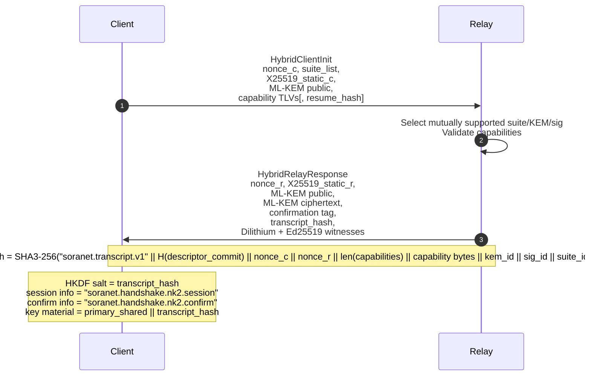
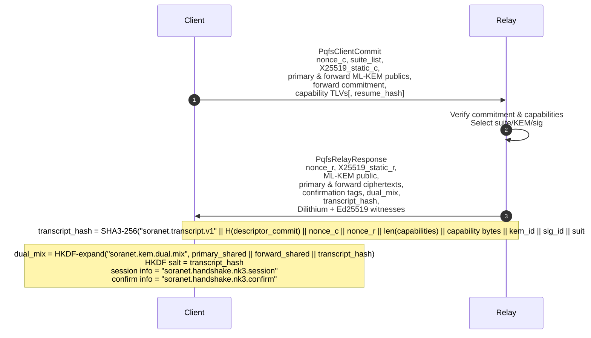

# SoraNet Handshake & Salt Rotation Draft

This document captures the initial outline for the SoraNet anonymous networking
handshake (roadmap items SNNet-1a/1b/1c). It exists as a living skeleton until
the full RFC is authored.

## Decision Summary (WG Resolution — Feb 2026)

- **Transport:** QUIC transport with embedded Noise XX handshake carrying
  ML-KEM-768 (mandatory) and ML-KEM-1024 (optional) client key shares. Classical
  clients that omit ML-KEM are rejected with a downgrade log entry.
- **Signatures:** Dual Dilithium3 (primary) and Ed25519 (witness) signatures are
  required on salt announcements, relay descriptors, and consensus bundles.
- **Capability TLV registry:** Type codes finalised: `0x0101 snnet.pqkem`,
  `0x0102 snnet.pqsig`, `0x0103 snnet.transcript_commit`, `0x0201 snnet.role`,
  `0x0202 snnet.padding`. GREASE space `0x7F00–0x7FFF` reserved for
  ossification resistance.
- **Salt governance:** Daily SaltAnnouncementV1 rotations signed by the Salt
  Council (3-of-5 Dilithium3 multisig plus Ed25519 witness). Emergency rotations
  require an incident ticket reference in `notes`.
- **Padding policy:** Circuits use 1024-byte frames with Poisson batching
  (λ = 6.0/s) and target ≤18 % mean cover-traffic overhead.
- **Telemetry:** Relays emit signed `SoraNetTelemetryV1` Norito records hourly
  exporting downgrade counters, cover ratio, and salt adoption metrics; alerts
  trigger when `lagging_clients` > 5 % or `pq_disabled_sessions` > 0.

## Scope

- Define the transport handshake between SoraNet clients and relays (entry,
  middle, exit) with transcript binding and downgrade protection.
- Capture the daily salt rotation procedure used for blinded content IDs and
  error recovery during missed rotations.
- Describe the capability TLV surface advertised by relays/clients to
  negotiate PQ KEM/signature support and future extension points.

## Implementation

- The deterministic handshake simulation, salt tooling, and telemetry builders now live
  in `iroha_crypto::soranet::handshake`. The `soranet-handshake-harness` crate
  re-exports those helpers so runtime components, fixture generation, and SDK tests share
  one implementation.
- `iroha_p2p` drives its outbound and inbound QUIC/TCP handshakes through the same
  module (`build_client_hello`, `process_client_hello`, `client_handle_relay_hello`,
  `relay_finalize_handshake`), so the transport derives the exact transcript hash,
  ML-KEM shared secret, and telemetry payloads published in the fixtures.
## Handshake Message Flow

### Transcript Hashing (Draft)

Regardless of the transport decision, the handshake MUST bind the following
fields into a transcript hash `T`:

1. Relay descriptor hash (`H(desc)`)
2. Client nonce `Nc`
3. Relay nonce `Nr`
4. Serialized capability TLV vector (`caps`) — including GREASE placeholders
5. Negotiated PQ KEM/sig identifiers
6. Any resumed session ticket hash (for 0-RTT resumptions)

Recommended construction:

```text
T = SHA3-256(
    domain_sep || H(desc) || Nc || Nr || len(caps)||caps || kem_id || sig_id || resume_hash
)
```

The dual-KDF then becomes:

```
classical_secret = HKDF-Extract(classical_share, transcript_hash=T)
pq_secret        = HKDF-Extract(pq_share, transcript_hash=T)
traffic_secret   = HKDF-Expand(classical_secret || pq_secret, context="soranet-handshake")
```

Classical-only initiators (missing ML-KEM-768 share) MUST abort prior to key
derivation and increment the `downgrade_attempts` metric.

The handshake between a SoraNet client (C) and an entry relay (R) proceeds over
QUIC using the Noise XX pattern. Clients MUST offer ML-KEM-768 key shares (and
MAY additionally advertise ML-KEM-1024); relays expose the same capabilities
and reject classical-only initiators. The flow below records the normative
sequence.

1. **Descriptor fetch**
   - Client retrieves the relay microdescriptor (signed by the directory
     authority) containing relay identity key, supported capability TLVs and
     current salt epoch pointer.
   - Operators publish a companion `RelayDescriptorManifestV1` JSON document
     alongside the descriptor. It carries the private Ed25519 identity seed as
     `identity.ed25519_private_key_hex`; relays reference it via
     `handshake.descriptor_manifest_path` when `identity_private_key_hex` is
     omitted from the local configuration. Startup fails if the manifest omits
     the key or provides a value that does not decode to 32 bytes.
2. **ClientHello / Noise Initiate**
   - Client sends a random nonce, supported capability TLVs, and padded
     extensions. If PQ KEM support exists it includes a Kyber public share.
3. **ServerHello / Noise Respond**
   - Relay responds with its own nonce, selected capabilities, certificate or
     static Noise key, and PQ confirmation. Transcript binding includes all
     TLVs hashed into the handshake secret to prevent downgrade.
4. **Handshake completion**
   - Both sides derive traffic keys using a dual-KDF: `K = HKDF(classical_inputs
     ∥ pq_inputs, context=transcript_hash)`. Until PQ inputs are mandatory the
     relay must reject mismatched TLVs when the client advertised capabilities
     the relay cannot fulfill.
5. **Circuit confirmation**
   - Relay issues a circuit confirmation record containing entry ticket ID,
     salt epoch, and retry token. Client caches this for inclusion in
     subsequent middle/exit hops.

When PoW is enabled in the directory consensus, the client prepends a
`PowTicketV1` frame to the Noise stream before transmitting `ClientHello`. The
frame layout is identical to the main spec:

```norito
struct PowTicketV1 {
    version: u8,
    difficulty: u8,
    expires_at: u64,
    client_nonce: [u8; 32],
    solution: [u8; 32],
}
```

Relays derive the challenge from their descriptor commitment and the client
nonce (`BLAKE3("soranet.pow.challenge.v1" ∥ descriptor_commit ∥ client_nonce ∥
expires_at)`), then verify the solution hash has the required number of leading
zero bits. Tickets must not be excessively far in the future and must remain
valid for the configured TTL window; relays abort with a downgrade alert if the
ticket is missing or invalid.

Relay admission now layers adaptive defenses on top of the base PoW check:

- **Adaptive difficulty.** Each entry relay tracks PoW failures and clean handshakes in
  a sliding window. Repeated invalid tickets automatically raise the difficulty (up
  to `pow.adaptive.max_difficulty`), while healthy traffic allows the relay to relax
  back toward the configured minimum. Operators can monitor the live requirement via
  the `soranet_handshake_pow_difficulty{mode=…}` Prometheus gauge.
- **Per-hop quotas.** Handshake bursts per remote IP and per descriptor commit are capped
  (`pow.quotas`), with optional hop-specific overrides exposed via `pow.quotas_per_mode` so
  entry, middle, and exit relays can enforce independent ceilings. Exhausting a quota now
  increments dedicated Prometheus counters (`soranet_handshake_throttled_remote_quota_total`
  / `soranet_handshake_throttled_descriptor_quota_total`), updates the live cooldown gauges
  (`soranet_abuse_remote_cooldowns`, `soranet_abuse_descriptor_cooldowns`), and records a
  compliance log entry including a structured `throttle` payload that captures the enforced
  scope, cooldown, burst limit, and observation window.
- **Emergency throttles.** Directory consensus can ship an emergency throttle list via
  `pow.emergency`. The relay periodically reloads the file (or inline `descriptor_commit_hex`
  list) and rejects handshakes whose descriptor commitments appear in the set. These events
  increment `soranet_handshake_throttled_emergency_total`, emit privacy telemetry via
  `soranet_privacy_throttles_total{scope="emergency"}`, and record `scope="emergency_consensus"`
  compliance entries so operators can correlate throttles with governance directives.
  The configuration accepts an optional `file_path` pointing to a Norito JSON document with
  `descriptor_commit_hex` (array) and optional `cooldown_secs`; the relay merges the file with
  any statically configured entries and refreshes the set every `refresh_secs`.
- **Slowloris detection.** Clients that repeatedly time out or take longer than
  `pow.slowloris.max_handshake_millis` accrue penalty points. Hitting the threshold applies
  the same throttle path so padding/congestion resources are not tied up by intentionally
  slow peers.

All thresholds are configurable in the relay JSON (`pow.adaptive`, `pow.quotas`,
`pow.quotas_per_mode`, `pow.slowloris`) so deployments can tune the policy to their client
population.

### Argon2 Puzzle Service (SNNet-6a)

SNNet-16D the Argon2 path ships enabled-by-default; deployments only fall back to
hashcash if they explicitly disable the puzzle (`pow.puzzle.enabled = false`). The
relay verifies the incoming ticket by hashing the client solution against the
descriptor commitment with Argon2id. Tickets retain the exact same on-wire layout
(version/difficulty/expiry/nonces) so clients can submit a single frame regardless
of which policy a relay enforces.

- **Parameters.** Operators control the Argon2 cost factors via
  `pow.puzzle.memory_kib` (RAM in KiB), `pow.puzzle.time_cost` (iterations), and
  `pow.puzzle.lanes` (parallelism). The adaptive difficulty controller drives the
  continue to operate without special cases.
- **TTL enforcement.** Puzzle tickets reuse the existing `pow` `min_ticket_ttl_secs`
  and `max_future_skew_secs` bounds. Verification rejects expired tickets, TTLs that
  fall below the policy minimum, or expiry windows that exceed the allowed skew.
- **Issuance service.** The `tools/soranet-puzzle-service` daemon exposes Norito JSON
  endpoints at `/v2/puzzle/config` and `/v2/puzzle/mint`, allowing edge relays to delegate
  ticket minting. Config responses surface the active difficulty and TTL bounds, while
  mint requests accept an optional `ttl_secs` override and return a base64-encoded ticket
  with expiry metadata. A `/healthz` endpoint publishes readiness for relay supervisors.
  to the adaptive pipeline, so brownout telemetry and quota throttles require no
  and is only executed when the puzzle gate is explicitly disabled for brownout or
  debugging scenarios.
- **Telemetry.** The relay exports Prometheus counters for negotiated handshakes
  (`sn16_handshake_mode_total`), downgrade reasons (`sn16_handshake_downgrade_total` –
  reported as deterministic snake-case slugs such as `suite_no_overlap` or
  `relay_suite_list_missing`), transferred bytes (`sn16_handshake_bytes_total`), and a
  summary pair for Argon2 verification time
  (`sn16_puzzle_verify_seconds_sum`/`_count`). These feed the Grafana
  “SoraNet SNNet-16 Handshake Observability” board and the Alertmanager rules
  covering mixed-mode detection, downgrade surges, and slow puzzle verification.

#### Dashboards & Alerts

- **Grafana dashboard.** The `dashboards/grafana/soranet_sn16_handshake.json` board
  visualises handshake suite mix, downgrade reasons, byte volume, and puzzle
  verification latency with a 5-minute lookback. Operators can filter by relay
  mode to correlate PQ rollout stages with observed behaviour.
- **Alerting.** Prometheus rules in `dashboards/alerts/soranet_handshake_rules.yml`
  raise `SoranetSn16MixedMode` when more than 5 % of recent handshakes negotiate
  non-hybrid suites and `SoranetSn16DowngradeSpike` when downgrade counters exceed
  the burst budget. The companion test at
  `dashboards/alerts/tests/soranet_handshake_rules.test.yml` exercises the rule
  logic for CI.
- **Log schema.** Relay handshake logs now emit on the `soranet.handshake` target
  with structured fields (`mode`, `remote`, `handshake_bytes`, `downgrade`
  `warnings`, etc.), making it easier to link alerts to raw event volume and to
  feed proxy policy automation. Downgrade bursts now drive the orchestrator’s
  proxy remediation hook so local QUIC proxies automatically shift to
  metadata-only mode and recover once downgrade noise subsides (SNNet-16E).
- **Proxy remediation feed.** The relay admin service exposes `/policy/proxy-toggle`
  alongside `/privacy/events`. The NDJSON feed publishes only downgrade failures;
  orchestrators poll it and feed `DowngradeRemediator`, which flips local proxies
  to metadata-only until downgrade volume falls below the configured threshold.

Clients must update their puzzle minting loop to iterate over 32-byte solutions until
the Argon2 digest satisfies the advertised difficulty. The sample harness in
`iroha_crypto::soranet::puzzle::mint_ticket` demonstrates a reference implementation.

For operators that want external issuance, the `soranet-puzzle-service` binary (under
`tools/soranet-puzzle-service/`) exposes a minimal HTTP API backed by a relay JSON
configuration. The service loads `handshake.descriptor_commit_hex` **and** the relay
identity (from `handshake.identity_private_key_hex` or the descriptor manifest), binding
every minted puzzle ticket to the relay identifier + supplied transcript hash so tickets
cannot be replayed against other relays. It derives the puzzle parameters from
`pow.*`/`pow.puzzle.*` and offers two endpoints:

- `GET /v2/puzzle/config` — returns the active difficulty, timing bounds, and puzzle cost
  factors so clients can size their workloads.
- `POST /v2/puzzle/mint` — mints a fresh ticket and returns a base64 payload. Callers may
  supply `{ "ttl_secs": <override> }` and `transcript_hash_hex` to bind the ticket to a
  resume hash; the service clamps TTL overrides to the configured policy.
- `GET /v2/token/config` — surfaces the ML-DSA admission-token policy (suite, TTL bounds,
  issuer fingerprint, relay identifier, and active revocations) when `pow.token.enabled = true`.
- `POST /v2/token/mint` — returns a base64 admission token bound to the supplied
  `transcript_hash_hex`. Configure the issuer secret via CLI (`--token-secret-hex` or
  `--token-secret-path`); operators may optionally point the service at a revocation file
  (`--token-revocation-file`) and control the reload cadence with
  `--token-revocation-refresh-secs`.

The issuance service is optional—clients can still mint locally—but it provides a
deterministic way to pre-authorise uploads or seed tickets into orchestration pipelines.

All handshake messages must be padded to fixed frames (multiple of 1024 bytes)
with GREASE TLVs to resist traffic analysis.

### Admission Tokens

Relays can bypass the puzzle gate for trusted clients by provisioning ML-DSA-44
admission tokens. Tokens bind to a relay identifier, the negotiated resume
transcript hash, and carry an issuance/expiry window constrained by
`pow.token.max_ttl_secs` and `pow.token.clock_skew_secs`. Verification rejects
tokens whose revocation digest appears in either inline configuration or the
external revocation list loaded from disk.

- **Minting.** The `soranet-admission-token` binary (new in SNNet-16D) replaces the

  ```bash
  cargo run -p soranet-relay --bin soranet_admission_token -- mint \
    --issuer-public-hex "$(cat issuer_mldsa_public.hex)" \
    --issuer-secret-hex "$(cat issuer_mldsa_secret.hex)" \
    --relay-id-hex "$RELAY_ID_HEX" \
    --transcript-hash-hex "$RESUME_HASH_HEX" \
    --ttl-secs 300 \
    --format json
  ```

  The command emits a Norito JSON object with the base64 and hex encodings, token
  identifier, issuer fingerprint, flags, and RFC3339 timestamps. Set `--output`
  to persist the JSON bundle or switch `--format` to `base64`/`hex` to print the
  raw frame.

- **Inspection.** `soranet_admission_token inspect --token <base64|hex>` (or
  `--input <path>`) decodes a frame, verifies its signature against the issuer
  fingerprint, and prints the bound relay/resume hash to help operators audit
  cached credentials.

- **Revocation.** Maintain a Norito JSON array of token identifiers (each a
  32-byte hex string). The CLI provides a safe helper:

  ```bash
  cargo run -p soranet-relay --bin soranet_admission_token -- revoke \
    --list /etc/soranet/relay/token_revocations.json \
    --token-id-hex "$TOKEN_ID_HEX"
  ```

  `--dry-run` previews the entry without touching disk and `list-revocations`
  prints the merged set (`norito::json::from_slice` validates the file during
  relay startup).

- **Configuration.** Enable tokens with `pow.token.enabled = true` and supply the
  ML-DSA public key via `pow.token.issuer_public_key_hex`. Inline token IDs live
  in `pow.token.revocation_list_hex`, while `pow.token.revocation_list_path`
  points to the JSON document maintained by the CLI. Both sources are loaded at
  startup and deduplicated before `DoSControls` enforce the revocation set.

Every token is scoped to a single relay and resume hash: clients must refresh
credentials whenever the descriptor commitment rotates or a new transcript hash
is negotiated. When `pow.token.enabled = false` the relay falls back to the
puzzle gate, preserving the default onboarding flow. Token-authenticated
sessions still emit downgrade telemetry and compliance log entries so operations
retain a full audit trail.

### PoW replay guard

- The relay/node loads a bounded Norito revocation store on startup using
  `pow.revocation_store_capacity`, `pow.revocation_max_ttl_secs`, and
  `pow.revocation_store_path`. Each verified PoW or puzzle ticket is inserted
  into the store; replays return `pow::Error::Replay` and the handshake fails.
- The store is pruned on load and can be purged in-process via the
  `purge_expired_revocations` helper or by replacing the Norito snapshot on
  disk. Capacity/TTL validation or an unreadable path raises a
  `HandshakeSoranet` error during startup, so operators will see explicit
  failures rather than silently disabling replay protection.
- Telemetry: `soranet_pow_revocation_store_total{reason}` increments whenever the
  relay falls back to the in-memory replay cache (e.g., missing/invalid snapshot)
  so dashboards can alert on misconfigured paths or permissions.
- Snapshots are compact Norito lists of fingerprints only; deleting the file
  resets the replay guard (useful for lab environments) but should be avoided
  in production where deterministic replay blocking is required.

### Relay descriptor manifest

Relays expect a private manifest emitted by the directory tooling containing
the secret material required for the handshake. The daemon consumes the file
via `handshake.descriptor_manifest_path` and rejects startup if any key material
is malformed. The manifest now carries both the Ed25519 identity seed and the
ML-KEM-768 key pair used for SoraNet transport negotiation. Minimal manifest
example (replace the placeholders with real 32-byte and 2400/1184-byte hex
strings respectively):

```json
{
  "version": 1,
  "identity": {
    "ed25519_private_key_hex": "00112233445566778899aabbccddeeff00112233445566778899aabbccddeeff",
    "ml_kem_private_key_hex": "aa...aa",
    "ml_kem_public_hex": "bb...bb"
  }
}
```

`ml_kem_private_key_hex` MUST decode to 2400 bytes (Kyber-768 secret key) and
`ml_kem_public_hex` MUST decode to 1184 bytes (Kyber-768 public key). Future
revisions may extend the manifest with signed operator metadata or rotation
hints, but the identity section above is required whenever the hot key is not
embedded directly in the configuration.

Relays can also ingest the signed directory artefacts directly via the
`handshake.certificate` section. Supplying a CBOR-encoded
`RelayCertificateBundleV2` (`bundle_path`) alongside the governance issuer
keys (`issuer_ed25519_hex`, `issuer_mldsa_hex`) causes the daemon to verify the
dual signatures, adopt the certified descriptor commitment, and cache the
handshake suite/KEM policy advertised in the bundle. The `validation_phase`
parameter mirrors directory rollout gates (`phase1_allow_single`,
`phase2_prefer_dual`, `phase3_require_dual`). Startup fails if the local
Ed25519 identity or ML-KEM public key diverge from the certificate, ensuring
the manifest secrets, relay identity, and certificate snapshot remain in lock
step.

## Salt Announcement Schema

### Example Salt Announcement Payload

For regression testing the Norito salt payload serializes as JSON (before
signing) similar to the following:

```json
{
  "epoch_id": 42,
  "valid_after": 1767225600000000000,
  "valid_until": 1767312000000000000,
  "blinded_cid_salt_hex": "ee4fd5a8a2b4e9c0f1dc1a67c962e8d9b4a1c0ffee112233445566778899aabb",
  "previous_epoch": 41,
  "emergency_rotation": false,
  "notes": "Routine rotation",
  "signature": null
}
```

The canonical Norito encoding stores the `blinded_cid_salt` as raw 32-byte data
and the timestamp fields in nanoseconds since Unix epoch. Fixtures expose the
salt as a hex string for readability; test vectors MUST re-encode this payload
and verify the signature envelope.


Salt rotations are published daily via a Norito payload signed by the Salt Council
(3-of-5 Dilithium3 qSig) and countersigned by the directory authority with
Ed25519. Clients and relays consume the announcement before accepting new
circuits.

```norito
struct SaltAnnouncementV1 {
    epoch_id: u32,               // Monotonic epoch counter (seconds since Unix epoch / 86400)
    valid_after: Timestamp,
    valid_until: Timestamp,
    blinded_cid_salt: [u8; 32],   // Random 256-bit salt used for CID blinding
    previous_epoch: Option<u32>,  // Expected predecessor; None for genesis
    emergency_rotation: bool,     // True if rotation triggered outside schedule
    notes: Option<String>,        // Optional operator notes or mitigation guidance
}
```

- The announcement is wrapped in a Norito header advertising KEM/signature
  requirements.
- Signature envelope: Ed25519 or Dilithium (dual signatures recommended). The
  signature covers the serialized Norito payload plus a domain separation tag
  `"soranet.salt_announcement"`.
- Distribution: published via SoraNS under `soranet.salt.<epoch_id>` and pushed
  to relays over the control plane.

**Recovery workflow**
- Clients track the latest `epoch_id`. Missing epochs trigger a recovery RPC to
  the directory service to fetch intervening announcements.
- Relays cache at least two epochs and reject circuits using stale salts.
- Emergency rotations set `emergency_rotation=true`; clients must refresh
  immediately and drop existing circuits when the new salt no longer matches.

### Schema Versioning & Signed Test Vectors

- **Wire envelope.** Salt announcements are wrapped in the Norito header
  `SaltAnnouncementWire` with `version_major = 1`, `version_minor = 0`, and
  feature-bit set `0x01` (`pq-required`). Future breaking changes bump the major
  version; additive fields bump the minor version. Relays MUST reject payloads
  whose major version they do not recognise and SHOULD log minor-version bumps.
- **On-chain manifests.** The salt authority manifest lists the active version
  tuple and public keys; governance updates MUST roll the manifest alongside the
  code so peers can pin expected versions.
- **Regression vectors.** Once the Salt Council approves the production key set,
  the council generates three signed announcements (normal rotation, emergency
  rotation, and recovery catch-up) and stores them under
  `docs/assets/soranet/salt_vectors/v2/`. Each vector includes: Norito binary
  (`.to`), JSON projection, Dilithium3 signature, Ed25519 witness signature, and
  a README describing the validation procedure. CI jobs use these artefacts to
- **Validation tooling.** `tools/soranet-handshake-harness` exposes a
  `salt-verify --vector <path>` command that deserialises the payload, enforces
  the version policy above, and checks both signatures against the manifest.
  Operators run this command before promoting new council keys.

## Baseline Requirements

1. **Security Goals**
   - Confidentiality and integrity for relay circuits.
   - Mutual authentication of relay descriptors; client anonymity against
     network observers.
   - Downgrade resistance when classical-only peers connect to PQ-capable
     relays.
2. **Protocol Constraints**
   - Build on QUIC transport with either embedded Noise patterns or a PQ-ready
     TLS 1.3 profile (decision pending).
   - Capability negotiation via TLV vectors embedded in handshake extensions.
   - Deterministic replay detection so multiple peers produce identical
     decisions under the same transcripts.
3. **Operational Considerations**
   - Salt epoch publication cadence (target: 24 h) with governance-approved
     signing keys.
   - Recovery workflow for clients that miss one or more salt rotations.
   - Deterministic logging and telemetry hooks for downgrade alarms and failed
     circuit establishment.


## Capability TLV Encoding

### Format

Capability advertisements travel inside a **Capability Vector** placed in both
the client and relay handshake messages. The vector is a concatenation of TLV
records:

```
CapabilityVector = 1*CapabilityTLV
CapabilityTLV    = Type(2 bytes, BE) || Length(2 bytes, BE) || Value(Length bytes)
```

The serialized vector is hashed into the transcript prior to the dual KDF so any
modification (stripping or reordering TLVs) changes the derived keys and is
detected.

### Registry

Types below `0x4000` are controlled by SoraNet governance. Clients MUST send the
TLVs they are prepared to use sorted by type; relays MAY respond in any order
but SHOULD maintain the same ordering to simplify transcript analysis. The
`0x7Fxx` range is reserved for GREASE values and MUST be ignored by parsers.

| Type (hex) | Label                | Payload layout                                                                 | Notes |
|-----------:|----------------------|--------------------------------------------------------------------------------|-------|
| 0x0101     | `snnet.pqkem`        | `kem_id:u8` `flags:u8`                                                         | `flags & 0x01` marks the KEM as *required* for the advertising side. |
| 0x0102     | `snnet.pqsig`        | `sig_id:u8` `flags:u8`                                                         | Multiple TLVs allowed when dual-signing. |
| 0x0103     | `snnet.transcript_commit` | `sha256` digest (32 bytes) of the descriptor-advertised capabilities.       | Binds directory metadata into the session. |
| 0x0104     | `snnet.suite_list`   | `ordered:u8[]` handshake suite identifiers (first byte MSB marks *required*) | Values: `0x02` = `nk2.hybrid`, `0x03` = `nk3.pq_forward_secure`; unknown identifiers are ignored for negotiation. Clients list suites in preference order; relays intersect and select the client's highest-ranked common entry. Negotiation aborts when the TLV is missing or no overlap exists. |
| 0x0201     | `snnet.role`         | `role_bits:u8` (`0x01` guard, `0x02` middle, `0x04` exit)                      | Relays MUST emit exactly one entry; clients omit. |
| 0x0202     | `snnet.padding`      | `u16` padded cell size (little-endian)                                         | Used to negotiate circuit padding buckets. |
| 0x7Fxx     | GREASE fillers       | Arbitrary bytes                                                                | Implementations MUST ignore and preserve order. Clients emit ≥2 per handshake. |

#### Handshake suites (SNNet-16)

SNNet-16 adds an explicit suite negotiation surface so the relay and client
agree on the transport pattern before the Noise/QUIC machinery runs. The
`snnet.suite_list` TLV encodes the caller’s preference order; the first byte’s
MSB is recycled as the existing “required” bit so parsers strip it
automatically. Negotiation proceeds as follows:

> **Deployment note:** the staged rollout for these suites is now documented in
> `docs/source/soranet/pq_rollout_plan.md`. Update `sorafs.gateway.rollout_phase`
> (and the client-side `sorafs.rollout_phase`) according to that playbook so
> the SNNet-16G promotion progresses in lock-step across relays and SDKs.

1. Parse both vectors, discard duplicates, and ignore unknown suite identifiers while preserving order.
2. Identify the first suite in the client list that also appears in the relay
   list; that suite is selected.
3. Emit downgrade telemetry if the chosen suite differs from either party’s
   first entry.
4. Abort the handshake when the TLV is missing or no overlap exists; the
   transcript hash still incorporates the advertised suite so mismatch
   manifests as a different key schedule.

Relays MUST reject `ClientHello` frames whose `kem_id` or `sig_id` do not appear
in the negotiated capability intersection. When a relay is configured with a
certificate bundle it advertises the suite order from the certificate;
otherwise it defaults to `[nk2.hybrid, nk3.pq_forward_secure]`.

Supported suite identifiers are:

| ID | Label                 | Description |
|----|----------------------|-------------|
| 0x02 | `nk2.hybrid`          | Two-message hybrid handshake that carries classical and ML-KEM material in the first flight. |
| 0x03 | `nk3.pq_forward_secure` | Forward-secure variant with dual ML-KEM commitments and post-handshake rekey. |

`NK2` and `NK3` now ship on the runtime path. When either suite is negotiated
the relay responds with the new hybrid/PQFS frames and the client derives the
session key immediately—no `ClientFinish` frame is exchanged. The helper APIs
(`build_client_hello`, `process_client_hello`, `client_handle_relay_hello`, and
`relay_finalize_handshake`) still return an optional finish payload, but it is
always `None` for the current suites. Deterministic unit tests exercise each
path and assert that both peers produce identical transcript hashes and
session keys for NK2 and NK3 handshakes.【crates/iroha_crypto/src/soranet/handshake.rs:4720】【crates/iroha_crypto/src/soranet/handshake.rs:5290】

##### NK2 hybrid (`nk2.hybrid`) state machine



- Relay-only confirmation lets the client detect tampering without
  re-transmitting `ClientFinish`. Runtime coverage ensures the relay skips the
  third flight and that negotiated warnings stay empty when suite lists align.

##### NK3 forward-secure (`nk3.pq_forward_secure`) state machine



- The client recomputes the forward commitment and dual-mix before accepting.
  Tests cover the validation path and the requirement that NK3 derives the key
  without emitting an additional frame.

### Algorithm identifiers

| `snnet.pqkem` `kem_id` | Meaning              | Status |
|------------------------|----------------------|--------|
| `0x00`                 | ML-KEM-512 (Kyber)   | Lightweight PQ profile; opt-in when guarding mobile/edge peers. |
| `0x01`                 | ML-KEM-768 (Kyber)   | Default PQ profile; SHOULD be marked required once SNNet-16 lands. |
| `0x02`                 | ML-KEM-1024 (Kyber)  | Reserved for high-security tier. |

| `snnet.pqsig` `sig_id` | Meaning         | Status |
|------------------------|-----------------|--------|
| `0x00`                 | Ed25519         | Classical baseline. |
| `0x01`                 | Dilithium3      | Preferred PQ signature. |
| `0x02`                 | Falcon-512      | Optional extension for constrained deployments. |

Governance maintains the canonical registry in
`docs/source/soranet/capability_registry.md` and the directory service publishes
matching manifests. Any new identifier MUST ship with fixtures and downgrade
simulation cases before activation.

### Negotiation rules

1. **Client advertisement** — Clients send all capability TLVs they can support.
   TLVs with `flags & 0x01 == 1` indicate the client will abort if the relay
   fails to echo the capability.
2. **Relay filtering** — Relays intersect the request with their local policy.
   For each class (KEM, signature, padding) they select the strongest mutually
   supported option. If a requested capability is marked required but is not
   available, the relay MUST abort and emit a downgrade alarm.
3. **Echo** — Relays respond with a Capability Vector containing the selected
   capabilities, copying the `flags` bits supplied by the client to prove the
   value was honored.
4. **Client verification** — Clients recompute the transcript hash and verify
   that required TLVs are present, `snnet.transcript_commit` matches the digest
   from the directory descriptor, and no classical-only downgrade occurred.

Relays MUST NOT advertise a capability they cannot sustain for the entire
lifespan of the circuit. Clients MUST raise telemetry when a downgrade occurs
(`downgrade_detected`, containing relay identity, type code, and transcript ID).

### Example vectors

Example client advertisement (hex, ASCII comments):

```
01 01 00 02 01 01  # snnet.pqkem { id=0x01 (ML-KEM-768), required }
01 02 00 02 01 01  # snnet.pqsig { id=0x01 (Dilithium3), required }
01 04 00 02 02 03  # snnet.suite_list { preferred=[nk2.hybrid, nk3.pq_forward_secure] }
02 02 00 02 04 00  # snnet.padding { 1024-byte cells }
7F 10 00 04 DE AD BE EF  # GREASE
7F 11 00 04 CA FE BA BE  # GREASE
```

Example relay echo for a PQ-capable guard:

```
01 01 00 02 01 01
01 02 00 02 01 01
01 03 00 20 <32-byte SHA-256 descriptor commit>
01 04 00 02 02 03
02 01 00 01 01
02 02 00 02 04 00
7F 12 00 04 12 34 56 78
```

Classical-only relays omit `snnet.pqkem` entirely. Because the client marked the
PQ KEM as `required`, the absence of the TLV triggers a downgrade alarm and the
handshake aborts.

## Handshake suites

The negotiated suite (advertised via the required `snnet.suite_list` TLV) now
controls the shape of the transcript and informs the HKDF domains used by the
session key schedule:

| Suite | Messages | Purpose |
|-------|----------|---------|
| `nk2.hybrid` | `HybridClientInit` → `HybridRelayResponse` | Two-message hybrid handshake that folds the confirmation and classical+PQ material into the relay response while still hashing the descriptor commit and capability vector. |
| `nk3.pq_forward_secure` | `PqfsClientCommit` → `PqfsRelayResponse` | Forward secure profile that binds two ML-KEM commitments (baseline + FS) and carries a mix commitment alongside the transcript hash. |

All suites continue to hash the same capability bytes and descriptor commit to
guarantee downgrade detection. The transcript hash feeds the labelled HKDF
domains (`handshake/nk2/*`, `handshake/nk3/*`) so telemetry and session keys
diverge across suites even when the same nonces circulate.

`HybridClientInit` and `PqfsClientCommit` now emit deterministic Dilithium +
Ed25519 witnesses that cover the handshake payload and transcript hash. Relay
responses mirror the witnesses and surface the negotiated suite in their
telemetry JSON (`handshake_suite` field) so downstream tooling can flag mixed
mode sessions. The sequence diagrams above highlight the message flow, the
transcript binding inputs, and the labelled HKDF domains each suite relies on.

### Parser sketch

```text
fn parse_cap_vector(buf):
    caps = OrderedMultiMap::new()
    cursor = 0
    while cursor + 4 <= buf.len():
        ty = read_u16_be(&buf[cursor..cursor+2])
        len = read_u16_be(&buf[cursor+2..cursor+4])
        cursor += 4
        if cursor + len > buf.len():
            raise Error("capability TLV truncated")
        val = buf[cursor..cursor+len]
        cursor += len
        if 0x7F00 <= ty && ty <= 0x7FFF:
            continue // GREASE
        caps.insert(ty, val)
    if cursor != buf.len():
        raise Error("extra bytes in capability vector")
    return caps
```

Implementations MUST preserve duplicate TLVs for multi-entry capabilities
(`snnet.pqkem`, `snnet.pqsig`) and reject duplicate singleton TLVs. Unknown
non-GREASE types are rejected in v1. Malformed lengths are rejected.

### Interop fixtures

The handshake interop suite MUST publish Norito fixture bundles under
`tests/interop/soranet/capabilities/`. Regenerate them with
`cargo xtask soranet-fixtures` (defaults to the same directory; use
`--out <path>` to redirect, or `--verify` to compare against the checked-in
artifacts). Each bundle is a Norito map encoded in canonical
order with the schema below:

```norito
struct CapabilityFixtureV1 {
    fixture_id: String,
    description: String,
    client_vector_hex: String,
    relay_vector_hex: String,
    descriptor_commit_hex: String,
    client_nonce_hex: String,
    relay_nonce_hex: String,
    resume_hash_hex: Option<String>,
    kem_id: u8,
    sig_id: u8,
    transcript_hash_hex: String,
    warnings: [String],
    expected_outcome: String,
    expected_alarm: Option<DowngradeAlarmStub>,
    fixture_signature: Option<String>,
}

struct DowngradeAlarmStub {
    relay_id: String,
    capability_type_hex: String,
    reason: String,
    capability_value_hex: Option<String>,
}
```

Initial fixtures to ship:

| Fixture ID | Purpose | Notes |
|------------|---------|-------|
| `snnet-cap-001-success` | Successful negotiation: both sides advertise ML-KEM-768 + Dilithium3, transcript digest matches. | `expected_outcome="success"`, `expected_alarm=None`. |
| `snnet-cap-002-downgrade` | Relay strips `snnet.pqkem`; client aborts and records alarm with `reason="pqkem_missing"`. | `expected_alarm` populated. |
| `snnet-cap-003-digest-mismatch` | Relay echoes PQ TLVs but modifies `snnet.transcript_commit`. Clients abort due to digest mismatch. | `expected_outcome="digest_mismatch"`. |
| `snnet-cap-004-grease` | Vector contains two GREASE TLVs; negotiation succeeds and transcript hash matches value in fixture. | Validates GREASE preservation. |
| `snnet-cap-006-constant-rate` | Client requires `snnet.constant_rate` while the relay omits it; handshake aborts with a downgrade warning/telemetry slug for SNNet‑17A2 dogfood. | `expected_outcome="downgrade_abort"`, warning includes `type=0x0203 (snnet.constant_rate)`. |

Example (success case) encoded as Norito JSON:

```json
{
  "fixture_id": "snnet-cap-001-success",
  "description": "PQ-capable guard echoes ML-KEM-768 + Dilithium3",
  "client_vector_hex": "0101000201010102000201010104000282030202000200047f100004deadbeef7f110004cafebabe",
  "relay_vector_hex": "0101000201010102000201010103002076d0f4f511391e6548e6f9c80f30ed61c4cbbb98b5ecec922d8af67233f21f1f01040002820302010001010202000200047f12000412345678",
  "descriptor_commit_hex": "76d0f4f511391e6548e6f9c80f30ed61c4cbbb98b5ecec922d8af67233f21f1f",
  "client_nonce_hex": "2c1f64028dbe42410d1921cd9a316bed4f8f5b52ffb62b4dcaf149048393ca8a",
  "relay_nonce_hex": "d5f4f2f9c2b1a39e88bbd3c0a4f9e178d93e7bfacaf0c3e872b712f4a341c9de",
  "resume_hash_hex": null,
  "kem_id": 1,
  "sig_id": 1,
  "transcript_hash_hex": "fd92a86d953dfa161d27c79785d495108bfd6991d3ed3baff11752baff4e0bf8",
  "expected_outcome": "success",
  "warnings": [],
  "expected_alarm": null,
  "fixture_signature": null
}
```

> **Note:** The harness recomputes the transcript hash from the descriptor
> commit, nonces, and capability vectors before emitting the fixture. CI must
> verify that recomputing the hash from those fields reproduces
> `transcript_hash_hex`.

All fixture files also carry a `fixture_signature` field when published in CI,
produced by the interop harness key to guarantee tamper detection. Clients and
relays SHOULD refuse to consume unsigned fixtures in automated test runs.

Telemetry fixtures accompanying downgrade scenarios live under
`tests/interop/soranet/telemetry/`. For example,
`snnet-cap-002-downgrade-alarm.norito.json` mirrors the schema from
DowngradeAlarmReportV1, wiring the computed `transcript_hash_hex`, relay identity,
and reason code into a ready-to-validate sample.

### Exit Stream Negotiation (`RouteOpenFrame`)

SoraNet circuits open application streams by issuing a fixed-length
`RouteOpenFrame` on a fresh bidirectional QUIC stream before sending any
payload. The relay inspects the frame to determine the exit adapter and to
record GAR policy categories.

| Offset | Field        | Description |
|--------|--------------|-------------|
| `0`    | `tag`        | `0x01` designates a Norito streaming circuit (`norito-stream`); `0x02` designates a Kaigi conferencing circuit (`kaigi-stream`).|
| `1`    | `flags`      | Bit 0 (`0x01`) set indicates the channel is authenticated; unset means anonymous/read-only. Remaining bits are reserved and must be zero. |
| `2..34`| `channel_id` | 32-byte blinded channel identifier used for logging and policy. All-zero identifiers are rejected. |

Exit relays translate the frame into the following GAR labels:

- `stream.norito.read_only` — anonymous observers (flag bit clear)
- `stream.norito.authenticated` — authenticated channels (flag bit set)
- `stream.norito.unsupported` — relay lacks a configured Norito route (diagnostic fallback)
- `stream.kaigi.public` — Kaigi conferences bridged in public mode (flag bit clear)
- `stream.kaigi.authenticated` — Kaigi conferences requiring authenticated viewers (flag bit set)
- `stream.kaigi.unsupported` — relay lacks Kaigi routing configured (diagnostic fallback)

Relays now use the frame to establish a WebSocket session with the configured
exit adapter. Norito circuits send a Norito-encoded `NoritoStreamOpen`
handshake containing the channel/route identifiers, access kind, optional
padding budget, and HPKE-wrapped `exit_token`, then forward the QUIC stream
bidirectionally. When a Norito stream is idle the relay emits zero-length
padding frames on a deterministic cadence derived from the channel identifier
(respecting the per-route padding budget or the relay default) so Torii
maintains low-latency pacing while keeping schedules stable across restarts.

Kaigi circuits emit a `KaigiStreamOpen` handshake that adds a blinded `room_id`
derived from the channel/route identifiers as well as the original
`exit_multiaddr`. Exits dial either the multiaddr-provided hub or the
configured fallback `hub_ws_url`, authenticate the viewer if required, and then
bridge Kaigi datagrams bidirectionally without injecting synthetic padding so
interactive media latency remains minimal.

### Torii CLI helpers

- `iroha app sorafs handshake show` fetches `/v2/config` and prints the live descriptor commit, capability vectors, negotiated suite identifiers, resume hash, and PoW admission window. Operators can diff this output against the directory bundle before rotating relays.
- `iroha app sorafs handshake update --descriptor-commit <hex> --client-capabilities <hex> --relay-capabilities <hex> --resume-hash <hex> --pow-difficulty <u8> ...` submits a partial update via `/v2/config`. Any combination of flags is accepted, and `--clear-resume-hash` removes the advertisement entirely. The command reuses the existing logger settings so the update remains idempotent with other config knobs.

## Open Design Items

- **Interop harness:** Build cross-language fixtures that replay successful and
  rejected handshakes (Rust harness owner).
- **Automation:** Extend CI to generate GREASE TLVs and verify transcript hash
  parity for each test vector.
- **Fixture bundle:** Produce signed handshake transcripts and
  SaltAnnouncementV1 samples for SDK parity suites.
- **Telemetry export:** Automate ingestion of hourly `SoraNetTelemetryV1`
  records into monitoring dashboards.

## Next Steps

1. Draft the full RFC text (with diagrams) and circulate for cross-team review by **2026-03-15**.
2. Implement a reference handshake harness (`soranet-handshake-harness`) that validates transcript hashes, TLV parsing, and padding rules by **2026-04-01**.
3. Generate the signed fixture bundle (`fixtures/soranet_handshake/`) — handshake transcripts, capability vectors, SaltAnnouncementV1 samples — and integrate into CI by **2026-04-15**.
4. Track padding and telemetry metrics in nightly testnet runs and report progress in `status.md`.

### SDK Parity Guidance

- **Checkout & verification.** Every SDK pins the fixture bundle at
  `fixtures/soranet_handshake/` and runs
  `cargo run -p soranet-handshake-harness -- fixtures --verify` as part of its
  CI smoke step. This guarantees the vendored vectors match the canonical set.
- **Transcript parity.** SDK harnesses replay the provided capability vectors and
  transcripts, comparing their computed transcript hash against the JSON emitted
  by `cargo run -p soranet-handshake-harness -- simulate --json-out - …`.
  Mismatches fail the build and instruct contributors to regenerate bindings or
  fix parsing bugs.
- **Salt payloads.** For SaltAnnouncementV1 fixtures, SDKs decode the `.json`
  projection, re-encode to Norito, and verify Dilithium3 + Ed25519 signatures
  before accepting the payload. Languages without native Norito bindings call
  `salt-verify --vector …` to cross-check expected fields.
- **Reporting.** Each SDK publishes a short `docs/soranet_handshake_parity.md`
  (or equivalent) summarising supported capability TLVs, verified transcript
  hashes, and salt announcement versions so operators can confirm parity at a
  glance.


## Circuit Padding & Traffic Shaping (Draft)

- **Frame size:** All relay cells padded to 1024-byte multiples. Idle periods emit
  cover traffic every 150 ms with jitter (±25 ms).
- **Burst masking:** Clients schedule batches via Poisson process to avoid
  deterministic spikes; relays throttle bursts using token buckets aligned to
  advertised QoS tier.
- **Failure behaviour:** On circuit teardown, relays send three cover frames
  before FIN to avoid timing leaks. Clients MUST follow with matching cover
  frames when aborting circuits early.
- **Bandwidth overhead target:** Maintain a moving-average cover ratio
  (`cover_bytes / total_bytes`) ≤ 0.18 over 10-minute windows, derived from the
  `cover_ratio` field in `SoraNetTelemetryV1`. Nightly CI uses
  `cargo run -p soranet-handshake-harness -- simulate --telemetry-out` to emit a
  sample payload and a Prometheus check asserts the ratio stays below the
  threshold. Production relays alarm when the rolling mean exceeds 0.20 for two
  consecutive windows.


## Directory Publication Flow (Draft)

1. Directory authority aggregates relay descriptors + capability vectors.
2. Generates consensus bundle `consensus.car` with:
   - Relay microdescriptors
   - Salt announcement pointers (`soranet.salt.<epoch_id>`)
   - Capability registry version
3. Publishes bundle to SoraNS under `soranet.consensus.current` with signature.
4. Relays fetch consensus hourly; clients fetch on startup and when notified via
   gossip.
5. Consensus diff format: binary Merkle diff (`consensus_diff.car`). Quorum =
   4/5 directory operators; emergency quorum 3/5 with incident ticket logged in
   the governance ledger.


## Telemetry & Governance Hooks (Draft)

### Downgrade alarm schema

All downgrade events raised during capability negotiation MUST emit a Norito
record matching the schema below and submit it to the SoraNet telemetry bus
within 5 seconds of detection.

```norito
struct DowngradeAlarmReportV1 {
    relay_id: String,              // base58 relay identity key
    relay_role: u8,                // bitfield: guard/middle/exit
    client_id: Option<String>,     // opaque client telemetry ID (if opt-in)
    capability_type: u16,          // offending TLV type
    capability_value_hex: Option<String>, // raw value if available
    reason_code: DowngradeReason,
    transcript_hash: [u8; 32],     // SHA-256 transcript hash
    observed_at: Timestamp,
    circuit_id: Option<u64>,       // anonymized circuit handle
    counter: u32,                  // running count for rate limiting
    signature: DetachedSignature,  // Ed25519 or Dilithium signature
}

enum DowngradeReason {
    ClassicalOnlyFallback,
    MissingRequiredKEM,
    MissingRequiredSignature,
    TranscriptCommitMismatch,
    CapabilityParseError,
}

### Hourly telemetry report

Relays MUST emit `SoraNetTelemetryV1` once per hour with the following fields:

```norito
struct SoraNetTelemetryV1 {
    epoch: u32,
    downgrade_attempts: u32,
    pq_disabled_sessions: u32,
    cover_ratio: f32,
    lagging_clients: u32,
    max_latency_ms: u32,
    incident_reference: Option<String>,
}
```

Alerts fire when `lagging_clients > 0.05 * total_clients` or
`pq_disabled_sessions > 0`. Relays have one hour to resolve and attach the
incident reference (ticket ID) to the telemetry feed.
```

- `relay_id` and `relay_role` align with directory descriptors so governance can
  corroborate alarms.
- `counter` increments for each alarm emitted by the same relay per epoch to
  support tamper-evident rate limiting.
- `signature` covers the serialized payload with domain separation tag
  `"soranet.downgrade_alarm.v1"`.

Relays MUST persist the last 100 alarms locally for 7 days. Governance tooling
aggregates alarms into the following metrics exported via OpenTelemetry:

- `snnet.downgrade.attempts` (counter, labels: `reason`, `relay_role`)
- `snnet.downgrade.clients_impacted` (gauge)
- `snnet.transcript.mismatch` (counter)

### Additional telemetry

- Track salt rotation adoption (`current_epoch`, `lagging_clients`).
- Emit anonymized traffic stats (cover vs data ratio) for SLO tracking.
- Governance watchers consume telemetry via signed Norito reports; failure to
  meet thresholds triggers compliance workflows.


## Working Group Review Checklist (Draft)

- [ ] Confirm transport selection (QUIC+Noise vs PQ-TLS) and update message flow accordingly.
- [ ] Validate transcript hash inputs and downgrade logging requirements against the published fixtures.
- [ ] Approve capability TLV registry (type codes, semantics, GREASE policy).
- [ ] Ratify SaltAnnouncementV1 governance process and signature envelope.
- [ ] Review circuit padding parameters and target overhead budgets.
- [ ] Agree on directory consensus publication cadence and diff format.
- [ ] Review DowngradeAlarmReportV1 telemetry schema, alert thresholds, and governance escalation path.
- [x] Produce signed fixture bundle for CI (cap vectors, salt announcements, transcript hashes) and ensure generator tooling runs in CI (`cargo test -p soranet-handshake-harness` now exercises `verify_fixtures` against the canonical bundles).
- `cargo xtask soranet-fixtures` now emits capability fixtures under
  `tests/interop/soranet/capabilities/` together with sample telemetry and
  salt announcements in `fixtures/soranet_handshake/`.
- Developers can inspect raw TLVs or render SaltAnnouncement payloads via
  `cargo run -p soranet-handshake-harness -- inspect …` and `-- salt …` while the full
  handshake simulation is being implemented.
