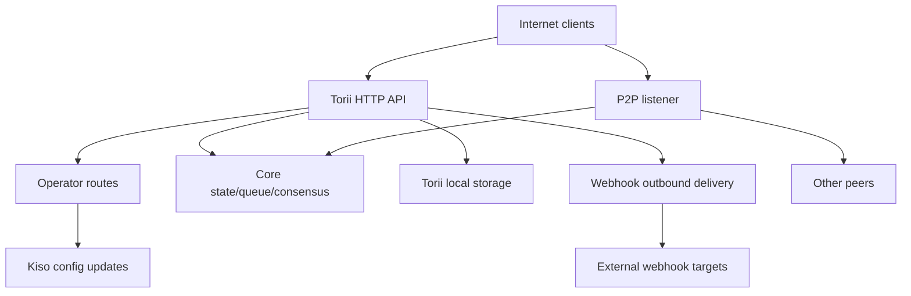

<!-- Auto-generated stub for Amharic (Ethiopian) (am) translation. Replace this content with the full translation. -->

---
lang: am
direction: ltr
source: iroha-threat-model.md
status: complete
generator: scripts/sync_docs_i18n.py
source_hash: 766928cf0dcbfe3513c728bcf0b9fa697a330e8000bc6944ab61e8fcd59751ad
source_last_modified: "2026-02-07T13:27:25.009145+00:00"
translation_last_reviewed: 2026-04-02
translator: machine-google-reviewed
---

# Iroha አስጊ ሞዴል (ሪፖ፡ `iroha`)

## አስፈፃሚ ማጠቃለያ
በይነመረብ በተጋለጠ የህዝብ-ብሎክቼይን ስርጭት የኦፕሬተር መንገዶች ሆን ተብሎ ከህዝብ በይነመረብ መድረስ የሚችሉበት ነገር ግን በጥያቄ ፊርማዎች መረጋገጥ አለባቸው እና የዌብ መንጠቆዎች/አባሪዎች በይፋዊ Torii የመጨረሻ ነጥብ ላይ የነቁ ዋና ዋናዎቹ አደጋዎች፡ ከዋኝ-አይሮፕላን ስምምነት (የማይረጋገጥ ወይም እንደገና መጫወት) ሌሎች ከዋኝ መንገዶች)፣ SSRF እና ወደ ውጭ የሚሄዱ አላግባብ መጠቀም በዌብ መንጠቆ አቅርቦት፣ እና ከፍተኛ መጠን ያለው DoS በግብይት/መጠይቅ + የፍጻሜ ነጥቦች በሁኔታዎች የተነደፉ የፍጥነት ገደቦች; በተጨማሪም በ `x-forwarded-client-cert` መገኘት ላይ የሚመረኮዝ ማንኛውም "mTLS የሚፈለግ" አቀማመጥ Torii በቀጥታ ሲጋለጥ ሊታከም ይችላል። ማስረጃ፡ `crates/iroha_torii/src/lib.rs` (ራውተር + መካከለኛ ዌር + ኦፕሬተር መንገዶች)፣ `crates/iroha_torii/src/operator_auth.rs` (ኦፕሬተር ማረጋገጫ ማንቃት/ማሰናከል + `x-forwarded-client-cert` ቼክ)፣ `crates/iroha_torii/src/webhook.rs` (የወጪ HTTP ደንበኛ)፣ Norito

## ወሰን እና ግምቶችውስጠ-ወሰን (የአሂድ ጊዜ / የምርት ገጽታዎች)
- Torii ኤችቲቲፒ ኤፒአይ አገልጋይ እና ሚድልዌር፣የ"ከዋኝ" መንገዶችን፣ መተግበሪያ ኤፒአይን፣ የድር መንጠቆዎችን፣ አባሪዎችን፣ ይዘትን እና የዥረት ማጠናቀቂያ ነጥቦችን ጨምሮ፡ `crates/iroha_torii/`፣ `crates/iroha_torii_shared/`
- የመስቀለኛ መንገድ ቡት ማሰሪያ እና አካል ሽቦ (Torii + P2P + ሁኔታ / ወረፋ / ማዋቀር ተዋናይ): `crates/irohad/src/main.rs`
- P2P ማጓጓዣ እና የእጅ መጨባበጥ ቦታዎች: `crates/iroha_p2p/`
- የማዋቀር ቅርጾች እና ነባሪዎች (በተለይ Torii auth ነባሪዎች): `crates/iroha_config/src/parameters/{actual,defaults}.rs`
- የደንበኛ ትይዩ የማዋቀር DTO (`/v1/configuration` ሊለውጠው የሚችለው)፡ `crates/iroha_config/src/client_api.rs`
- የማሰማራት ማሸጊያ መሰረታዊ ነገሮች፡- `Dockerfile`፣ እና በ`defaults/` ውስጥ ያሉ የምሳሌ ውቅሮችን (በምርት ውስጥ የተከተቱ የምሳሌ ቁልፎችን አይጠቀሙ)።

ከወሰን ውጪ (በግልጽ ካልተጠየቀ)፡
- CI የስራ ፍሰቶች እና የተለቀቀው አውቶማቲክ፡ `.github/`፣ `ci/`፣ `scripts/`
- የሞባይል/የደንበኛ ኤስዲኬዎች እና መተግበሪያዎች፡ `IrohaSwift/`፣ `java/`፣ `examples/`
- የሰነድ-ብቻ ቁሳቁስ: `docs/`ግልጽ ግምቶች (በእርስዎ ማብራሪያዎች ላይ በመመስረት)
- Torii በይነመረብ የተጋለጠ እና ያልተረጋገጡ ደንበኞች ሊደረስበት የሚችል ነው (አንዳንድ የመጨረሻ ነጥቦች አሁንም ፊርማ ወይም ሌላ ማረጋገጫ ሊፈልጉ ይችላሉ)።
- የኦፕሬተር መስመሮች (`/v1/configuration`፣ `/v1/nexus/lifecycle`፣ እና ከዋኝ-ጌት ቴሌሜትሪ/መገለጫ ሲነቃ) ለህዝብ ተደራሽ እንዲሆኑ የታቀዱ እና በኦፕሬተር ቁጥጥር ስር ባለው የግል ቁልፍ ፊርማ ማረጋገጥ አለባቸው። ማስረጃ (የአሁኑ ሁኔታ)፡ `crates/iroha_torii/src/lib.rs` (`add_core_info_routes` `operator_layer` ይተገበራል)፣ `crates/iroha_torii/src/operator_auth.rs` (`enforce_operator_auth` / `authorize_operator_endpoint`)።
- የኦፕሬተር ፊርማ ማረጋገጫ በውቅረት ውስጥ የኦፕሬተር የህዝብ ቁልፎችን መስቀለኛ-አካባቢያዊ የተፈቀደ ዝርዝር መጠቀም አለበት (በአሁኑ ራውተር ውስጥ እንደ ተግባራዊ ኦፕሬተር በር አይታይም)። የአሁኑ የኦፕሬተር በር ማስረጃ፡- `crates/iroha_torii/src/operator_auth.rs` (`authorize_operator_endpoint`) እና የነባር ቀኖናዊ ጥያቄ ፊርማ ረዳት (የመልእክት ግንባታ)፡ `crates/iroha_torii/src/app_auth.rs` (`canonical_request_message`)።
- Torii የግድ ከታመነ መግባቱ ጀርባ አልተሰማራም። ስለዚህ፣ እንደ `x-forwarded-client-cert` ያሉ ራስጌዎች Torii በቀጥታ ሲጋለጥ እንደ አጥቂ ቁጥጥር ሊደረግላቸው ይገባል። ማስረጃ፡ `crates/iroha_torii/src/lib.rs` (`HEADER_MTLS_FORWARD`፣ `norito_rpc_mtls_present`) እና `crates/iroha_torii/src/operator_auth.rs` (`HEADER_MTLS_FORWARD`፣ `mtls_present`)።
- የድር መንጠቆዎች እና ዓባሪዎች በይፋዊ Torii የመጨረሻ ነጥብ ላይ ነቅተዋል። ማስረጃ፡ `crates/iroha_torii/src/lib.rs` (የ`/v1/webhooks` እና `/v1/zk/attachments` መንገዶች)፣ `crates/iroha_torii/src/webhook.rs`፣ `crates/iroha_torii/src/zk_attachments.rs`።- ኦፕሬተር `torii.require_api_token = false` ሊያቀናጅ ወይም ሊያቆይ ይችላል (ነባሪው `false` ነው)። ማስረጃ፡ `crates/iroha_config/src/parameters/defaults.rs` (`torii::REQUIRE_API_TOKEN`)።
- `/transaction` እና `/query` ለህዝብ ሰንሰለት ሊደረስባቸው እንደሚችሉ ይጠበቃል። ማሳሰቢያ፡ በተጨማሪም በ"Norito-RPC" የመልቀቂያ ደረጃ እና በአማራጭ "mTLS ያስፈልጋል" የራስጌ መኖር ማረጋገጫ ተዘግተዋል። ማስረጃ፡ `crates/iroha_torii/src/lib.rs` (`ConnScheme::from_request`፣ `evaluate_norito_rpc_gate`) እና `crates/iroha_config/src/parameters/defaults.rs` (`torii::transport::norito_rpc::STAGE = "disabled"`)።

የአደጋ ደረጃን በቁሳዊ መልኩ የሚቀይሩ ጥያቄዎችን ይክፈቱ፡-
- የኦፕሬተር የህዝብ ቁልፎች የት ነው የተዋቀሩ (የትኛው የማዋቀር ቁልፍ/ቅርጸት) እና ቁልፎች እንዴት ተለይተው ይታወቃሉ/የሚሽከረከሩት (የቁልፍ መታወቂያ፣ በርካታ ገባሪ ቁልፎች፣ ስረዛ)?
- ትክክለኛው የኦፕሬተር ፊርማ የመልእክት ቅርጸት እና የድጋሚ አጫውት ጥበቃ (የጊዜ ማህተም/Nonce/ቆጣሪ + የአገልጋይ ጎን መልሶ ማጫወት መሸጎጫ) ምንድን ነው ፣ እና የትኛው የሰዓት-skew ፖሊሲ ተቀባይነት አለው? አሁን ያለው የቀኖናዊ ጥያቄ ረዳት ምንም ትኩስነት እንደሌለው የሚያሳይ ማስረጃ፡ `crates/iroha_torii/src/app_auth.rs` (`canonical_request_message`)።
- ማንነታቸው ለማይታወቅ የድር መንጠቆዎች፣ Torii የዘፈቀደ መዳረሻዎችን ይፈቅዳል ተብሎ ይጠበቃል ወይንስ የSSRF መድረሻ ፖሊሲን ያስፈጽማል (RFC1918/localhost/link-local/metadata እና እንደ አማራጭ HTTPS ያስፈልገዋል)?
- በግንባታዎ ውስጥ የትኞቹ የTorii ባህሪዎች የነቁ (`telemetry` ፣ `profiling` ፣ `p2p_ws` ፣ `app_api_https` ፣ `app_api_wss` ፣ `app_api_wss`) እና 091010 ጥቅም ላይ የዋለ ማስረጃ፡ `crates/iroha_torii/Cargo.toml` (`[features]`)።

## የስርዓት ሞዴል### ዋና አካላት
- ** የበይነመረብ ደንበኞች *** (ቦርሳዎች ፣ ጠቋሚዎች ፣ አሳሾች ፣ ቦቶች): HTTP/Norito ጥያቄዎችን ይላኩ እና የWS/SSE ግንኙነቶችን ይክፈቱ።
- **Torii (ኤችቲቲፒ ኤፒአይ)**፡ አክሱም ራውተር ከመሃከለኛ ዌር ጋር ለቅድመ-auth gating፣ አማራጭ የኤፒአይ ማስመሰያ ማስፈጸሚያ፣ የኤፒአይ ስሪት ድርድር፣ የርቀት አድራሻ መርፌ እና ሜትሪክስ። ማስረጃ፡ `crates/iroha_torii/src/lib.rs` (`create_api_router`፣ `enforce_preauth`፣ `enforce_api_token`፣ `enforce_api_version`፣ `inject_remote_addr_header`)።
- ** ኦፕሬተር/አውዝ መቆጣጠሪያ አውሮፕላን (የአሁኑ) እና የሚፈለገው አቀማመጥ**፡ የኦፕሬተር መንገዶች በአሁኑ ጊዜ በ`operator_auth::enforce_operator_auth` (WebAuthn/tokens፤ በውጤታማነት ሊሰናከሉ ይችላሉ)፣ ነገር ግን የማሰማራቱ መስፈርት በፊርማ ላይ የተመሰረተ የኦፕሬተር ማረጋገጫ ውቅረት ከኦፕሬተር የህዝብ ቁልፎች ዝርዝር ጋር የተረጋገጠ ነው። ቀኖናዊ የጥያቄ መልእክት አጋዥ አለ እና ለመልእክት ግንባታ እንደገና ጥቅም ላይ ሊውል ይችላል፣ ነገር ግን የማዋቀሪያ ቁልፎችን ለመጠቀም (የአለም-ግዛት መለያዎችን ሳይሆን) ማረጋገጫ ማስተካከል ያስፈልጋል። ማስረጃ፡ `crates/iroha_torii/src/lib.rs` (`add_core_info_routes` `operator_layer` ይጠቀማል)፣ `crates/iroha_torii/src/operator_auth.rs` (`authorize_operator_endpoint`)፣ `crates/iroha_torii/src/app_auth.rs` (Sumeragi`crates/iroha_torii/src/app_auth.rs`)።- ** የኮር መስቀለኛ መንገድ ክፍሎች (በሂደት ላይ) ***: የግብይት ወረፋ, ግዛት / WSV, ስምምነት (Sumeragi), የማገጃ ማከማቻ (Kura), ውቅር አዘምን ተዋናይ (ኪሶ), ወዘተ, ወደ Torii አልፏል. ማስረጃ፡ `crates/irohad/src/main.rs` (`Torii::new_with_handle(...)` `queue` ይቀበላል፣`state`፣`kura`፣`kiso`፣`kiso`፣`kiso`፣Sumeragi `torii.start(...)`).
- ** P2P አውታረ መረብ ***: የተመሰጠረ፣ የተቀረጸ የአቻ-ለ-አቻ ማጓጓዝ እና መጨባበጥ; አማራጭ TLS-over-TCP አለ ነገር ግን ሆን ተብሎ በእውቅና ማረጋገጫ ማረጋገጫ ላይ ተፈቅዷል። ማስረጃ: `crates/iroha_p2p/src/lib.rs` (አይነት ቅጽል `NetworkHandle<..., X25519Sha256, ChaCha20Poly1305>`), `crates/iroha_p2p/src/transport.rs` (`p2p_tls` ሞጁል `NoCertificateVerification` ጋር).
- ** Torii የአካባቢ ጽናት ***: `./storage/torii` ነባሪ ቤዝ dir ለአባሪዎች / webhooks / ወረፋዎች. ማስረጃ፡ `crates/iroha_config/src/parameters/defaults.rs` (`torii::data_dir()`)፣ `crates/iroha_torii/src/webhook.rs` (የቀጠለ `webhooks.json`)፣ `crates/iroha_torii/src/zk_attachments.rs` (በ`./storage/torii/zk_attachments/` የተቀመጠ)።
- ** ወደ ውጪ የድረ-ገጽ መንጠቆ ኢላማዎች ***: Torii ክስተቶችን ወደ የዘፈቀደ `http://` URLs (እና `https://`/`ws(s)://` ከባህሪያት ጋር ብቻ) ሊያደርስ ይችላል። ማስረጃ፡ `crates/iroha_torii/src/webhook.rs` (`http_post_plain`፣ `http_post_https`፣ `ws_send`)።### ውሂብ ይፈስሳል እና ድንበሮችን ያመኑ
- የበይነመረብ ደንበኛ → Torii HTTP API
  - ውሂብ፡ Norito ባለ ሁለትዮሽ (`SignedTransaction`፣ `SignedQuery`)፣ JSON DTOs (መተግበሪያ ኤፒአይ)፣ WS/SSE ምዝገባዎች፣ ራስጌዎች (`x-api-token` ጨምሮ)።
  - ቻናል: HTTP/1.1 + WebSocket + SSE (አክሱም).
  - ዋስትናዎች፡- አማራጭ የኤፒአይ ማስመሰያ (`torii.require_api_token`)፣ የቅድመ-ማረጋገጫ ግንኙነት/ተመን መጠን፣ የኤፒአይ ስሪት ድርድር; ብዙ ተቆጣጣሪዎች በቅድመ-ፍጻሜ ዋጋን በመገደብ ሁኔታዊ በሆነ ሁኔታ (`enforce=false` ሊታለፍ ይችላል)። ማስረጃ፡ `crates/iroha_torii/src/lib.rs` (`enforce_preauth`፣ `validate_api_token`፣ `handler_post_transaction`፣ `handler_signed_query`)፣ `crates/iroha_torii/src/limits.rs` (Sumeragi)።
  - ማረጋገጫ፡ የሰውነት ገደቦች በአንዳንድ የመጨረሻ ነጥቦች (ለምሳሌ፡ ግብይቶች)፣ Norito መፍታት፣ ለአንዳንድ የመተግበሪያ የመጨረሻ ነጥቦች መፈረም (ቀኖናዊ የጥያቄ ራስጌዎች)። ማስረጃ፡ `crates/iroha_torii/src/lib.rs` (`add_transaction_routes` `DefaultBodyLimit::max(...)` ይጠቀማል)፣ `crates/iroha_torii/src/app_auth.rs` (`verify_canonical_request`) ይጠቀማል።- የበይነመረብ ደንበኛ → “ኦፕሬተር” መንገዶች (Torii)
  - ውሂብ፡ የማዋቀር ማሻሻያ (`ConfigUpdateDTO`)፣ የሌይን የሕይወት ዑደት ዕቅዶች፣ ቴሌሜትሪ/ማረሚያ/ሁኔታ/ሜትሪክስ (ሲነቃ)።
  ቻናል፡ HTTP
  - ዋስትናዎች፡ የአሁን ሪፖ በሮች እነዚህን መንገዶች በ `operator_auth::enforce_operator_auth` መካከለኛ ዌር፣ ይህም `torii.operator_auth.enabled=false` ጊዜ ውጤታማ የሆነ ምንም-op ነው; የፈለጉት አቀማመጥ ከኮንፊኬር ከኦፕሬተር የህዝብ ቁልፎችን በመጠቀም ፊርማ ላይ የተመሰረተ ማረጋገጫ ነው፣ እሱም በዚህ ወሰን መተግበር እና መተግበር አለበት (እና Torii በቀጥታ ከተጋለጠ በ `x-forwarded-client-cert` ላይ መተማመን የለበትም)። ማስረጃ፡ `crates/iroha_torii/src/lib.rs` (`add_core_info_routes` ይተገበራል `operator_layer`)፣ `crates/iroha_torii/src/operator_auth.rs` (`authorize_operator_endpoint`፣ `mtls_present`)።
  - ማረጋገጫ: በአብዛኛው DTO መተንተን; በራሱ በ `handle_post_configuration` ውስጥ ምንም ክሪፕቶግራፊክ ፍቃድ የለም (ለ`kiso.update_with_dto` ውክልና ይሰጣል)። ማስረጃ፡ `crates/iroha_torii/src/routing.rs` (`handle_post_configuration`)።

- Torii → ኮር ወረፋ/ግዛት/መግባባት (በሂደት ላይ)
  - ውሂብ፡ የግብይት ማቅረቢያዎች፣ የጥያቄ አፈጻጸም፣ የግዛት ንባብ/ይጽፋል፣ የጋራ የቴሌሜትሪ መጠይቆች።
  - ሰርጥ፡ በሂደት ላይ ያለ የዝገት ጥሪዎች (የተጋሩ `Arc` መያዣዎች)።
  - ዋስትናዎች: የታመነ ድንበር; ደህንነት በTorii ላይ የተመረኮዙ ልዩ ስራዎችን ከመጥራት በፊት ጥያቄዎችን በትክክል በማረጋገጥ/በመፍቀድ ላይ ነው። ማስረጃ፡ `crates/irohad/src/main.rs` (`Torii::new_with_handle(...)` wiring) እና Torii ተቆጣጣሪዎች `routing::handle_*` ይደውሉ።- Torii → Kiso (የማዋቀር ተዋናይ)
  - ውሂብ: `ConfigUpdateDTO` ምዝግብ ማስታወሻ, P2P ACL, አውታረ መረብ / የመጓጓዣ ቅንብሮች, SoraNet የእጅ መጨባበጥ, ወዘተ መቀየር ይችላሉ.
  - ቻናል፡ በሂደት ላይ ያለ መልእክት/አያያዝ።
  - ዋስትናዎች፡ ፍቃድ በTorii ድንበር ይጠበቃል። ማዘመን DTO ራሱ አቅምን የሚቋቋም ነው። ማስረጃ፡ `crates/iroha_config/src/client_api.rs` (`ConfigUpdateDTO` መስኮች `network_acl`፣ `transport.norito_rpc`፣ `soranet_handshake`፣ ወዘተ ያካትታሉ)።

- Torii → የአካባቢ ዲስክ (`./storage/torii`)
  - ውሂብ: webhook መዝገብ እና ወረፋ ማድረስ; አባሪዎች እና ሳኒታይዘር ሜታዳታ; GC/TTL ባህሪ።
  - ሰርጥ: የፋይል ስርዓት.
  ዋስትናዎች፡- የአካባቢ ስርዓተ ክወና ፈቃዶች (ኮንቴይነር በ Dockerfile ውስጥ ስር-አልባ ሆኖ ይሰራል)። በ"ተከራይ" አመክንዮ ማግለል በኤፒአይ ማስመሰያ ወይም የርቀት አይፒ አርዕስት በመካከለኛ ዌር በመርፌ የተመሰረተ ነው። ማስረጃ፡ `Dockerfile` (`USER iroha`)፣ `crates/iroha_torii/src/lib.rs` (`inject_remote_addr_header`፣ `zk_attachments_tenant`)።

- Torii → Webhook ኢላማዎች (ወደ ውጪ)
  - ውሂብ፡ የክስተት ጭነት + የፊርማ ራስጌ።
  - ሰርጥ: ጥሬ TCP HTTP ደንበኛ ለ `http://`; አማራጭ `hyper+rustls` ለ `https://` ሲነቃ; ሲነቃ አማራጭ WS/WSS።
  - ዋስትናዎች: የጊዜ ማብቂያዎች / ሙከራዎች; በኮድ ውስጥ ምንም የመድረሻ ፍቃድ ዝርዝር አይታይም; የዌብ መንጠቆ CRUD ክፍት ከሆነ URL በአጥቂ ተጽዕኖ ያሳርፋል። ማስረጃ፡ `crates/iroha_torii/src/webhook.rs` (`handle_create_webhook`፣ `http_post_plain/http_post`)።- P2P እኩዮች (የማይታመን አውታረ መረብ) → P2P ማጓጓዝ/መጨባበጥ
  - ውሂብ: የእጅ መጨባበጥ ቅድመ-ገጽ/ዲበ ውሂብ፣ የተመሰጠሩ መልእክቶች፣ የጋራ መግባባት መልዕክቶች።
  - ቻናል: P2P ትራንስፖርት (TCP/QUIC/ወዘተ፣ ባህሪ-ጥገኛ)፣ ኢንክሪፕትድ የተደረገ ጭነት; አማራጭ TLS-over-TCP በእውቅና ማረጋገጫ ላይ በግልፅ የተፈቀደ ነው።
  - ዋስትናዎች፡ ምስጠራ እና የተፈረመ የእጅ መጨባበጥ በመተግበሪያ ንብርብር; ትራንስፖርት-ንብርብር TLS በእውቅና ማረጋገጫ አያረጋግጥም። ማስረጃ፡ `crates/iroha_p2p/src/lib.rs` (የምስጠራ አይነቶች)፣ `crates/iroha_p2p/src/transport.rs` (`NoCertificateVerification` አስተያየት እና ትግበራ)።

#### ሥዕላዊ መግለጫ

## ንብረቶች እና የደህንነት አላማዎች| ንብረት | ለምን አስፈለገ | የደህንነት ዓላማ (ሲ/አይ/ኤ) |
|---|---|---|
| ሰንሰለት ሁኔታ / WSV / ብሎኮች | የታማኝነት ውድቀቶች የጋራ መግባባት ውድቀቶች ይሆናሉ; የመገኘት አለመሳካቶች ሰንሰለቱን ያቆማሉ | እኔ/አ |
| የጋራ መግባባት መኖር (Sumeragi) | የህዝብ blockchain ዋጋ የሚወሰነው በዘላቂው የማገጃ ምርት ላይ ነው። አ |
| መስቀለኛ መንገድ የግል ቁልፎች (የአቻ ማንነት፣ የመፈረሚያ ቁልፎች) | ቁልፍ ስምምነት ማንነትን መውሰዱን፣ አላግባብ መጠቀምን መፈረም ወይም የአውታረ መረብ መከፋፈልን ያስችላል | ሐ/I |
| የአሂድ ጊዜ ውቅረት (ኪሶ-የዘመነ) | የአውታረ መረብ ኤሲኤሎችን እና የትራንስፖርት ቅንብሮችን ይቆጣጠራል; አላግባብ መጠቀም ጥበቃን ማሰናከል ወይም እኩዮችን መቀበል ይችላል | እኔ |
| የግብይት ወረፋ / mempool | የጎርፍ መጥለቅለቅ መግባባትን ሊራብ እና ሲፒዩ/ማስታወስ ሊያጠፋ ይችላል | አ |
| Torii ጽናት (`./storage/torii`) | የዲስክ ድካም መስቀለኛ መንገድን ሊያበላሽ ይችላል; የተከማቸ ውሂብ የታችኛው ተፋሰስ ሂደት ላይ ተጽዕኖ ሊኖረው ይችላል | A (እና አንዳንድ ጊዜ ሲ / I) |
| የወጪ webhook ቻናል | ለSSRF አላግባብ መጠቀም ይቻላል፣ ከውስጥ ኔትወርኮች የተገኘ መረጃን ማውጣት፣ ወይም ከታመነ egress IP | ሲ/አይ/አ |
| ቴሌሜትሪ/ሜትሪክስ/የማረሚያ ውሂብ | ለተነጣጠሩ ጥቃቶች ጠቃሚ የኔትወርክ ቶፖሎጂ እና የክወና ሁኔታን ማፍሰስ ይችላል | ሐ |

## አጥቂ ሞዴል## ችሎታዎች
- የርቀት፣ ያልተረጋገጠ የኢንተርኔት አጥቂ የዘፈቀደ የኤችቲቲፒ ጥያቄዎችን መላክ፣ ረጅም ዕድሜ ያላቸውን የWS/SSE ግንኙነቶችን ማቆየት እና የክፍያ ጭነቶችን (botnet) እንደገና ማጫወት ወይም መርጨት ይችላል።
- ማንኛውም አካል ከፍተኛ መጠን ያለው አይፈለጌ መልዕክትን ጨምሮ ቁልፎችን ማመንጨት እና የተፈረመ ግብይቶችን/ጥያቄዎችን (የህዝብ እገዳን) ማቅረብ ይችላል።
- ተንኮል አዘል/ተደራዳሪ አቻ ከP2P ጋር መገናኘት እና በተፈቀደ ገደቦች ውስጥ የፕሮቶኮል አላግባብ መጠቀምን፣ ጎርፍን ወይም የእጅ መጨባበጥን መሞከር ይችላል።
- የዌብ መንጠቆ CRUD ከተጋለጠ አጥቂው በአጥቂ ቁጥጥር ስር ያሉ የዌብ መንጠቆ ዩአርኤሎችን መመዝገብ እና ወደ ውጭ የሚደረጉ ጥሪዎችን መቀበል (እና ወደ ውስጣዊ መዳረሻዎች ሊመራቸው ይችላል)።

### አቅም የሌላቸው
- ምንም ቀጥተኛ የአካባቢ ፋይል ስርዓት መዳረሻ የተጋለጠ የመጨረሻ ነጥብ ወይም የተሳሳተ የተዋቀረ የድምጽ ፍቃዶች የለም።
- ያለ ቁልፍ ስምምነት ለነባር አቻ/ኦፕሬተር ቁልፎች ፊርማ የመፍጠር ችሎታ የለም።
- ዘመናዊውን ክሪፕቶግራፊ (X25519, ChaCha20-Poly1305, Ed25519) በመደበኛ ሁኔታዎች ውስጥ የመስበር ችሎታ የለውም።

## የመግቢያ ነጥቦች እና የጥቃት ቦታዎች| ወለል | እንዴት ደረሰ | አደራ ድንበር | ማስታወሻ | ማስረጃ (repo ዱካ / ምልክት) |
|---|---|---|---|---|
| `POST /transaction` | ኢንተርኔት HTTP | ኢንተርኔት → Torii | Norito ሁለትዮሽ የተፈረመ ግብይት; ተመን መገደብ ሁኔታዊ ነው (`enforce` ሐሰት ሊሆን ይችላል) | `crates/iroha_torii/src/lib.rs` (`handler_post_transaction`፣ `ConnScheme::from_request`) |
| `POST /query` | ኢንተርኔት HTTP | ኢንተርኔት → Torii | Norito ሁለትዮሽ የተፈረመ መጠይቅ; ተመን መገደብ ሁኔታዊ ነው (`enforce` ሐሰት ሊሆን ይችላል) | `crates/iroha_torii/src/lib.rs` (`handler_signed_query`) |
| Norito-RPC በር | የበይነመረብ HTTP ራስጌዎች | ኢንተርኔት → Torii | የልቀት ደረጃ + አማራጭ "mTLS ያስፈልጋል" በራስጌ መገኘት; ካናሪ `x-api-token` ይጠቀማል `crates/iroha_torii/src/lib.rs` (`evaluate_norito_rpc_gate`፣ `HEADER_MTLS_FORWARD`) |
| `POST/GET/DELETE /v1/webhooks...` | የበይነመረብ HTTP (መተግበሪያ ኤፒአይ) | ኢንተርኔት → Torii → ወደ ውጪ | በንድፍ ስም-አልባ; webhook CRUD ወደ የዘፈቀደ ዩአርኤሎች ወደ ውጪ መላክን ያስችላል። SSRF ስጋት | `crates/iroha_torii/src/lib.rs` (`handler_webhooks_*`)፣ `crates/iroha_torii/src/webhook.rs` (`http_post`) |
| `POST/GET /v1/zk/attachments...` | የበይነመረብ HTTP (መተግበሪያ ኤፒአይ) | በይነመረብ → Torii → ዲስክ | በንድፍ ስም-አልባ; ተያያዥ ማጽጃ + መበስበስ + ጽናት; የዲስክ/ሲፒዩ አድካሚ ወለል (ተከራይ ከነቃ ኤፒአይ-ቶከን ነው፣ሌላ ሌላ የርቀት አይፒ በተከተተ ራስጌ) | `crates/iroha_torii/src/lib.rs` (`handler_zk_attachments_*`፣ `zk_attachments_tenant`)፣ `crates/iroha_torii/src/zk_attachments.rs` || `GET /v1/content/{bundle}/{path...}` | ኢንተርኔት HTTP | ኢንተርኔት → Torii → ግዛት/ማከማቻ | የድጋፍ ሁነታዎች + PoW + ክልል; egress limiter | `crates/iroha_torii/src/content.rs` (`handle_get_content`፣ `enforce_pow`፣ `enforce_auth`) |
| ዥረት: `/v1/events/sse`, `/events` (WS), `/block/stream` (WS) | ኢንተርኔት | ኢንተርኔት → Torii | ለረጅም ጊዜ የሚቆዩ ግንኙነቶች; DoS ወለል | `crates/iroha_torii/src/lib.rs` (`add_network_stream_routes`) |
| `GET/POST /v1/configuration` | ኢንተርኔት HTTP | ኢንተርኔት → ከዋኝ መንገዶች → ኪሶ | የማሰማራት ዓላማ፡ ከቅንጅት የተፈቀደ ዝርዝር ቁልፎች አንጻር የተረጋገጡ የኦፕሬተር ፊርማዎች፤ current repo የሚጠብቀው በኦፕሬተር ሚድዌር ብቻ ነው (በመንገድ ቡድኑ ላይ የፊርማ በር የለም) እና ልዑካን መተግበሪያን ወደ ኪሶ አዘምን | `crates/iroha_torii/src/lib.rs` (`add_core_info_routes`፣ `handler_post_configuration`)፣ `crates/iroha_torii/src/operator_auth.rs` (`enforce_operator_auth`)፣ `crates/iroha_torii/src/routing.rs` (`crates/iroha_torii/src/app_auth.rs`20e) ቀኖናዊ ጥያቄ ፊርማ ረዳት) |
| `POST /v1/nexus/lifecycle` | ኢንተርኔት HTTP | ኢንተርኔት → ከዋኝ መንገዶች → ኮር | ፊርማ-የተረጋገጠ እንዲሆን የታሰበ ኦፕሬተር የመጨረሻ ነጥብ; በአሁኑ ጊዜ በኦፕሬተር ሚድዌር የተጠበቀ እና ኦፕሬተር auth ከተሰናከለ ይፋዊ ሊሆን ይችላል። `crates/iroha_torii/src/lib.rs` (`add_core_info_routes`፣ `handler_post_nexus_lane_lifecycle`)፣ `crates/iroha_torii/src/operator_auth.rs` (`authorize_operator_endpoint`) || ቴሌሜትሪ/መገለጫ የመጨረሻ ነጥቦች (ባህሪ-የተከለለ) | ኢንተርኔት HTTP | ኢንተርኔት → ከዋኝ መንገዶች | ኦፕሬተር-የተዘጋ የመንገድ ቡድኖች; ኦፕሬተር auth ከተሰናከለ እና የፊርማ በር ከሌለ እነዚህ ይፋ ይሆናሉ እና የተግባር መረጃ ሊያወጡ ወይም የ DoS ቬክተሮች ሊሆኑ ይችላሉ | `crates/iroha_torii/src/lib.rs` (`add_telemetry_routes`፣ `add_profiling_routes`)፣ `crates/iroha_torii/src/operator_auth.rs` (`authorize_operator_endpoint`) |
| P2P TCP/TLS ማጓጓዣ | ኢንተርኔት / የአቻ አውታረ መረብ | ኢንተርኔት/እኩዮች → P2P | የተመሰጠሩ P2P ክፈፎች + መጨባበጥ; የTLS ማረጋገጫ ማረጋገጫ ሲነቃ ይፈቀዳል | `crates/iroha_p2p/src/lib.rs` (`NetworkHandle`), `crates/iroha_p2p/src/transport.rs` (`p2p_tls::NoCertificateVerification`) |

## ከፍተኛ የመጎሳቆል መንገዶች

1. **የአጥቂ ግብ፡ በመስቀለኛ መንገድ ባህሪን በ runtime ውቅር ዝመናዎች ተቆጣጠር ***
   1) ከኢንተርኔት የተጋለጠ Torii አግኝ የኦፕሬተር መንገዶች ሊደረስባቸው የሚችሉበት እና የኦፕሬተር ማረጋገጫ በሌለበት/በማይተላለፍበት (ለምሳሌ፡ ከዋኝ ማረጋገጥ የተሰናከለ እና ፊርማ የሌለበት)።  
   2) `POST /v1/configuration` ከ `ConfigUpdateDTO` ጋር የኔትወርክ ኤሲኤሎችን የሚፈታ ወይም የትራንስፖርት መቼቶችን የሚቀይር።  
   3) እንደ እኩያ ይቀላቀሉ ወይም ክፍልፍል / የተሳሳተ ውቅርን ያመጣሉ; በአጥቂ ቁጥጥር ስር ባሉ መሠረተ ልማቶች ስምምነትን እና/ወይም ግብይቶችን ማጥፋት።  
   ተጽዕኖ፡ የአቋራጭ (እና የአውታረ መረቡ ሊሆን የሚችል) ታማኝነት እና ተገኝነት ስምምነት።2. **የአጥቂ ግብ፡ የተያዘውን ከዋኝ የተፈረመ ጥያቄን እንደገና አጫውት**
   1) አንድ ትክክለኛ የተፈረመ የኦፕሬተር ጥያቄ (ለምሳሌ፣ በተበላሸ ኦፕሬተር ማሽን፣ በተሳሳተ መንገድ በተዘጋጀ ፕሮክሲ ሎግ ወይም TLS ደህንነቱ ባልተጠበቀ ሁኔታ የተቋረጠበትን አካባቢ) ያግኙ።  
   2) የፊርማ መርሃ ግብሩ ትኩስነት ከሌለው (የጊዜ ማህተም/የማይታወቅ) እና ከአገልጋይ ወገን ድጋሚ አጫውት ካለመቀበል ተመሳሳይ ጥያቄን በህዝብ ኦፕሬተር መንገዶች ላይ እንደገና ያጫውቱ።  
   3) ተገኝነትን የሚያበላሹ ወይም መከላከያዎችን የሚያዳክሙ ተደጋጋሚ የውቅረት ለውጦች፣ መልሶ መመለሻዎች ወይም የግዳጅ መቀያየሪያዎችን ያድርጉ።  
   ተጽዕኖ፡ የታማኝነት/የተገኝነት ስምምነት “ፊርማ ማረጋገጫ” ቢሆንም።  

3. **የአጥቂ ግብ፡ Norito-RPC ልቀት በመቀየር ጥበቃን ያሰናክሉ**
   1) `POST /v1/configuration` ለማዘመን `transport.norito_rpc.stage` ወይም `require_mtls`።  
   2) `/transaction` እና `/query`ን በግድ ክፈት ወይም ዝጋ፣ተገኝነት እና የመግቢያ ቁጥጥሮች ላይ ተጽእኖ ያሳድራል።  
   ተጽዕኖ፡ የታለመ መቋረጥ ወይም የመግቢያ መቆጣጠሪያ ማለፊያ።4. **የአጥቂ ግብ፡ SSRF ወደ ኦፕሬተር ውስጣዊ አውታረ መረብ ***
   1) በ `POST /v1/webhooks` በኩል ወደ ውስጣዊ መድረሻ (ለምሳሌ RFC1918 አስተናጋጅ ፣ ሜታዳታ አይፒ ፣ የቁጥጥር አውሮፕላን) የዌብ መንጠቆ ግቤት ይፍጠሩ።  
   2) ተዛማጅ ክስተቶችን ይጠብቁ; Torii የወጪ HTTP ጥያቄዎችን ከአውታረ መረብ ቦታው ያቀርባል።  
   3) ምላሾችን/ሁኔታዎችን/ጊዜን እና የውስጥ አገልግሎቶችን ለመፈተሽ ተደጋጋሚ ሙከራዎችን ተጠቀም (እና የምላሽ ይዘት በሌላ ቦታ ከታየ ሊገለጽ ይችላል።)  
   ተጽዕኖ፡ የውስጥ አውታረ መረብ መጋለጥ፣ የኋለኛው የእንቅስቃሴ ስካፎልዲንግ፣ መልካም ስም ያለው ጉዳት፣ በሜታዳታ የመጨረሻ ነጥቦች በኩል እምቅ ምስክርነት መጋለጥ።  

5. **የአጥቂ ግብ፡ የግብይቱን አገልግሎት መከልከል/የጥያቄ መግባትን መከልከል**
   1) የጎርፍ `POST /transaction` እና `POST /query` ከትክክለኛ/ልክ ያልሆነ Norito አካላት።  
   2) ብዙ የWS/SSE ምዝገባዎችን እና ቀርፋፋ ደንበኞችን አቆይ።  
   3) ስሮትላንትን ለማስቀረት በተለመደው አሠራር ሁኔታዊ መጠን መገደብን (`enforce=false`) ይጠቀሙ።  
   ተፅዕኖ፡ ሲፒዩ/የማስታወሻ መድከም፣ የወረፋ ሙሌት፣ የጋራ መግባባት መሸጫዎች።  

6. **የአጥቂ ግብ፡ የዲስክ ማስወጣት በአባሪዎች**
   1) የጎርፍ `/v1/zk/attachments` ከፍተኛ መጠን ያላቸው የመጫኛ ጭነቶች እና/ወይም የተጨመቁ ማህደሮች የማስፋፊያ ገደቦች አጠገብ።  
   2) የተከራይ ካፒታልን ለማስወገድ ብዙ ምንጭ አይፒዎችን (ወይም ማንኛውንም የተከራይ ቁልፍ ድክመት) ይጠቀሙ።  
   3) ቲቲኤል/ጂሲ እስኪዘገይ ድረስ ይቆዩ; ሙላ `./storage/torii`.  
   ተፅዕኖ፡ የመስቀለኛ መንገድ ብልሽት፣ ብሎኮች/ግብይቶችን ማስኬድ አለመቻል።7. **የአጥቂ ግብ፡ Torii በቀጥታ ሲጋለጥ "mTLS ያስፈልጋል" በሮች ማለፍ ***
   1) ኦፕሬተር `require_mtls` ለNorito-RPC ወይም ከዋኝ አዉት ያነቃል።  
   2) አጥቂ ጥያቄዎችን በ`x-forwarded-client-cert: <anything>` ይልካል።  
   3) ምንም የታመነ ጣልቃ ገብነት የራስጌውን ካልነቀለው የራስጌ-መገኘት ቼክ ያልፋል።  
   ተፅዕኖ፡ መቆጣጠሪያዎች አላግባብ ተፈጻሚ ሆነዋል; ኦፕሬተር mTLS በማይሆንበት ጊዜ ተፈጻሚ እንደሚሆን ያምናል።  

8. **የአጥቂ ግብ፡ የአቻ ግንኙነትን አዋርዱ/ሃብቶችን ተጠቀሙ ***
   1) ተንኮል አዘል እኩያ በተደጋጋሚ የእጅ መጨባበጥ ወይም የጎርፍ ፍሬሞችን ከከፍተኛው መጠኖች አጠገብ ይሞክራል።  
   2) በእውቅና ማረጋገጫዎች ላይ ተመስርተው ቀደም ብሎ አለመቀበልን ለማስወገድ የሚፈቀድ ትራንስፖርት-ንብርብር TLS (ከነቃ) ይጠቀሙ።  
   ተፅዕኖ፡ የግንኙነት መቆራረጥ፣ የሲፒዩ አጠቃቀም፣ የአቻ ተገኝነት ቀንሷል።  

9. **የአጥቂ ግብ፡ በቴሌሜትሪ/በማስተካከያ የመጨረሻ ነጥቦችን እንደገና ማደስ**
   1) ቴሌሜትሪ/መገለጫ ከነቃ እና የኦፕሬተር ማረጋገጫ ከጠፋ/ሊታለፍ የማይችል ከሆነ፣ `/status`፣ `/metrics`፣ መንገዶችን ማረም።  
   2) ሾልኮ የወጣ ቶፖሎጂ/የጤና መረጃን በጊዜ ጥቃቶች እና የተወሰኑ አካላትን ኢላማ ማድረግ።  
   ተፅዕኖ: የአጥቂ ስኬት መጠን መጨመር; የሚቻል መረጃ ይፋ ማድረግ.  

## የዛቻ ሞዴል ሠንጠረዥ| የዛቻ መታወቂያ | የዛቻ ምንጭ | ቅድመ ሁኔታዎች | የማስፈራሪያ እርምጃ | ተጽዕኖ | ተጽዕኖ የተደረገባቸው ንብረቶች | ነባር መቆጣጠሪያዎች (ማስረጃዎች) | ክፍተቶች | የሚመከሩ ቅነሳዎች | የማወቂያ ሃሳቦች | ዕድል | ተጽዕኖ ከባድነት | ቅድሚያ |
|---|---|---|---|---|---|---|---|---|| TM-001 | የርቀት ኢንተርኔት አጥቂ | Torii በይነመረብ የተጋለጠ; የኦፕሬተር መንገዶች የህዝብ ናቸው; ኦፕሬተር auth የለም/የሚያልፍ ነው ወይም ፊርማ ላይ የተመሰረተ ኦፕሬተር ማረጋገጫ አልተተገበረም/ተሳስቶ አልተተገበረም | የአሂድ ጊዜ ውቅረትን፣ የአውታረ መረብ ኤሲኤሎችን ወይም የትራንስፖርት መቼቶችን ለመቀየር የኦፕሬተር መንገዶችን (ለምሳሌ፡ `/v1/configuration`፣ `/v1/nexus/lifecycle`) ጥራ | መስቀለኛ መንገድ መውሰድ / ክፍልፍል; ተንኮል አዘል እኩዮችን መቀበል; ጥበቃን አሰናክል | የአሂድ ጊዜ ማዋቀር; የጋራ መግባባት መኖር; ሰንሰለት ታማኝነት; የአቻ ቁልፎች | የኦፕሬተር መስመሮች ከኦፕሬተር መካከለኛ ዌር ጀርባ ናቸው, ነገር ግን `authorize_operator_endpoint` ሲሰናከል `Ok(())` ይመልሳል; ያለ ተጨማሪ ማረጋገጫ ወደ Kiso ውክልናዎችን አስተካክል። ማስረጃ፡ `crates/iroha_torii/src/lib.rs` (`add_core_info_routes`)፣ `crates/iroha_torii/src/operator_auth.rs` (`authorize_operator_endpoint`)፣ `crates/iroha_torii/src/routing.rs` (`handle_post_configuration`)፣ Sumeragi በኦፕሬተር መስመር ቡድኖች ላይ ፊርማ ላይ የተመሰረተ ኦፕሬተር ማረጋገጫ የለም፤ በርዕስ ላይ የተመሰረተ "mTLS" Torii በቀጥታ ሲጋለጥ ሊታለል የሚችል ነው; እንደገና አጫውት ጥበቃ ያልተገለጸ | ከዋኝ የህዝብ ቁልፎች ውቅረት ዝርዝር (በርካታ ቁልፎችን + ቁልፍ መታወቂያዎችን ይደግፉ) ለኦፕሬተር መንገዶች የግዴታ ፊርማ ላይ የተመሠረተ ኦፕሬተር ውትን ተግባራዊ ያድርጉ። አዲስነት (የጊዜ ማህተም + ኖንስ) ከተገደበ የመድገም መሸጎጫ ጋር ያካትቱ። TLS ከጫፍ እስከ ጫፍ (`x-forwarded-client-cert` አትመኑ); በሁሉም የኦፕሬተር ድርጊቶች ላይ ጥብቅ የዋጋ ገደቦችን + የኦዲት ምዝገባን ተግብር | በማንኛውም የኦፕሬተር መንገድ ላይ ማንቂያ ደወል; የኦዲት-ሎግ ውቅረት ልዩነት; ተደጋጋሚ ፊርማዎችን/ያልሆኑን መለየት; ያልተለመደ ዝመናን ይቆጣጠሩድግግሞሽ እና ምንጭ አይፒዎች | ከፍተኛ (ፊርማ auth + ድጋሚ አጫውት ጥበቃ እስኪተገበር እና እስኪተገበር ድረስ) | ከፍተኛ | ** ወሳኝ *** || TM-002 | የርቀት ኢንተርኔት አጥቂ | Webhook CRUD የማይታወቅ እና በይነመረብ ሊደረስበት የሚችል ነው; ምንም SSRF መድረሻ ፖሊሲ | የውስጥ/ልዩ ልዩ ዩአርኤሎችን የሚያነጣጥሩ የድር መንጠቆዎችን ይፍጠሩ እና አቅርቦቶችን ያስነሳሉ | SSRF፣ የውስጥ ቅኝት፣ የሜታዳታ ምስክርነት መጋለጥ እና ወደ ውጭ የሚወጣ DoS | Webhook ሰርጥ; የውስጥ አውታረመረብ; ተገኝነት | Webhooks አሉ; ማጓጓዣዎች የጊዜ ማብቂያዎችን/የኋለኛውን / ከፍተኛ ሙከራዎችን ይጠቀማሉ; `http://` መላኪያ ጥሬ TCP ይጠቀማል። ማስረጃ፡ `crates/iroha_torii/src/lib.rs` (`handler_webhooks_*`), `crates/iroha_torii/src/webhook.rs` (`handle_create_webhook`, `http_post_plain`, `WebhookPolicy`) | ምንም የመድረሻ ፍቃድ ዝርዝር / አይፒ-ክልል ብሎኮች; `http://` ተፈቅዷል; የዲ ኤን ኤስ መልሶ ማያያዝ/ማዞር መቆጣጠሪያዎች አይታዩም; webhook CRUD መጠን መገደብ ሁኔታዊ ነው (በተረጋጋ ሁኔታ ላይ ውጤታማ ሊሆን ይችላል) | የዌብ መንጠቆዎችን እንደነቃ ያቆዩት ነገር ግን የኤስኤስአርኤፍ መቆጣጠሪያዎችን ይጨምሩ፡ የግል/loopback/link-local/metadata IP ክልሎችን እና የአስተናጋጅ ስሞችን አግድ፣ መፍታት + ፒን አድራሻዎች፣ ማዘዋወሪያዎችን መገደብ፣ ወደ ውጭ የሚወጣ ተጓዳኝ ፍጥረት ስም-አልባ ስለሆነ ሁል ጊዜ በአይፒ ኮታዎች + ዓለም አቀፍ ኮታዎችን ጨምሩ እና ለድር መንጠቆ መፍጠር/ዝማኔዎች አማራጭ የPoW ማስመሰያ አስቡበት | ሎግ እና ሜትሪክ webhook ዒላማ URL + የተፈቱ አይፒዎች; በታገዱ መድረሻዎች ላይ ማንቂያ; በግል-IP ሙከራዎች እና በከፍተኛ ውድቀት / እንደገና መሞከር ላይ ማንቂያ; የዌብ መንጠቆን ይቆጣጠሩ CRUD ተመን እና የወረፋ ሙሌት | ከፍተኛ | ከፍተኛ | ** ወሳኝ *** || TM-003 | የርቀት ኢንተርኔት አጥቂ / አይፈለጌ መልእክት | የህዝብ `/transaction` እና `/query`; ሁኔታዊ ተመን መገደብ በጋራ ሁነታዎች ላይ አይተገበርም | የጎርፍ tx/ጥያቄ ማስረከብ፣ እና WS/SSE ዥረቶች | የሲፒዩ / የማስታወስ ድካም; የወረፋ ሙሌት; የጋራ መግባባት | ተገኝነት (Torii + ስምምነት); ወረፋ / mempool | የቅድመ ማረጋገጫ በር በአይፒ ግንኙነቶችን ይገድባል እና ሊከለክል ይችላል። ማስረጃ፡ `crates/iroha_torii/src/lib.rs` (`enforce_preauth`)፣ `crates/iroha_torii/src/limits.rs` (`PreAuthGate`) | ብዙ የቁልፍ መጠን ገደቦች ሁኔታዊ ናቸው (`allow_conditionally` እውነት ሲመለስ `enforce=false`); የተከፋፈሉ አጥቂዎች በየአይ ፒ ገደቦች ማለፍ | በይነመረቡ ሲጋለጥ ለ tx/ጥያቄ/ዥረቶች ሁልጊዜ-ላይ የዋጋ ገደቦችን ያክሉ። ከክፍያ ፖሊሲ ነፃ በሆነ የመጨረሻ ነጥብ ሊዋቀር የሚችል የዋጋ ገደቦችን ይጨምሩ። ውድ የመጨረሻ ነጥቦችን በPoW ጠብቅ ወይም ፊርማ/በመለያ ላይ የተመሰረተ ኮታ ጠይቅ | ክትትል፡ ቅድመ-አውድ ውድቅ ያደርጋል፣ የወረፋ ርዝመት፣ tx/የመጠይቅ ተመኖች፣ WS/SSE ንቁ ግንኙነቶች; ያልተለመዱ እና ዘላቂ የአቅም ገደቦች ላይ ማንቂያ | ከፍተኛ | ከፍተኛ | ** ከፍተኛ *** || TM-004 | የርቀት ኢንተርኔት አጥቂ | ቴሌሜትሪ/መገለጫ ባህሪያት ነቅተዋል; ኦፕሬተር auth ተሰናክሏል ወይም የፊርማ በር ጠፍቷል | Scrape `/status`፣ `/metrics`፣ የማረም የመጨረሻ ነጥቦችን; ውድ የማረም ሁኔታ ይጠይቁ | መረጃን ይፋ ማድረግ; ተግባራዊ DoS; ዒላማ የተደረገ ጥቃት ማስቻል | ቴሌሜትሪ / ማረም ውሂብ; ተገኝነት | የቴሌሜትሪ/የመገለጫ መስመር ቡድኖች በ `operator_auth::enforce_operator_auth` ተደራራቢ ናቸው። ማስረጃ፡ `crates/iroha_torii/src/lib.rs` (`add_telemetry_routes`፣ `add_profiling_routes`)፣ `crates/iroha_torii/src/operator_auth.rs` (`authorize_operator_endpoint`) | ኦፕሬተር ሚድዌር ሲሰናከል ምንም-op ነው; ፊርማ ላይ የተመሰረተ ኦፕሬተር auth በእነዚህ የመንገድ ቡድኖች ላይ አይታይም | ለእነዚህ የመንገድ ቡድኖች አንድ አይነት የግዴታ ፊርማ ላይ የተመሰረተ ኦፕሬተር ማረጋገጥን ጠይቅ። በተቻለ መጠን የጠንካራ መጠን ገደቦችን እና የምላሽ መሸጎጫ መጨመር; በነባሪነት በሕዝብ አንጓዎች ላይ የመገለጫ/የማረሚያ የመጨረሻ ነጥቦችን ከማጋለጥ ይቆጠቡ | የመዳረሻ ምዝግብ ማስታወሻዎችን ይከታተሉ; ስርዓተ ጥለቶችን እና ቀጣይነት ያለው ከፍተኛ ወጪ ጥያቄዎች ላይ ማንቂያ | መካከለኛ | መካከለኛ | **መካከለኛ** || TM-005 | የርቀት የኢንተርኔት አጥቂ ( misconfig ብዝበዛ) | ኦፕሬተር `require_mtls`ን ያነቃል ግን Torii በቀጥታ የተጋለጠ ነው (ወይም ፕሮክሲ/ራስጌ ማፅዳት ዋስትና የለውም) | Spoof `x-forwarded-client-cert` "mTLS ያስፈልጋል" ቼኮች ለማርካት | የውሸት የደህንነት ስሜት; ለNorito-RPC / ከዋኝ ማረጋገጫ ፖሊሲዎች | ኦፕሬተር / የዋጋ ወሰን; የመግቢያ ቁጥጥር | `require_mtls` በራስ መገኘት ተረጋግጧል። ማስረጃ፡ `crates/iroha_torii/src/lib.rs` (`HEADER_MTLS_FORWARD`፣ `norito_rpc_mtls_present`)፣ `crates/iroha_torii/src/operator_auth.rs` (`mtls_present`) | በ Torii ላይ የደንበኛ የምስክር ወረቀት ምንም ምስጢራዊ ማረጋገጫ የለም; በውጫዊ የመግቢያ ውል ላይ ይመሰረታል | Torii በይፋ ሊደረስበት በሚችልበት ጊዜ ለደህንነት በ`x-forwarded-client-cert` አይታመኑ; mTLS የሚያስፈልግ ከሆነ፣ የደንበኛ ማረጋገጫን በTorii ወይም የደንበኛ ራስጌዎችን በሚያራግፍ የታመነ መግቢያ ያስፈጽሙ። ያለበለዚያ በይነመረብን ለሚመለከት ማሰማራት በራስጌ ላይ የተመሰረተውን በር ያስወግዱ/ይተውት | `x-forwarded-client-cert` በያዘ ማንኛውም ጥያቄ ላይ ማንቂያ Torii የሚደርስ; የሎግ ጌት ውጤቶች ለ Norito-RPC እና ኦፕሬተር auth; በተፈቀደው ትራፊክ ላይ ድንገተኛ ለውጦችን ይቆጣጠሩ | ከፍተኛ | ከፍተኛ | ** ከፍተኛ *** || TM-006 | የርቀት ኢንተርኔት አጥቂ | አባሪዎች የመጨረሻ ነጥቦች ስም-አልባ እና በይነመረብ ሊደረስባቸው የሚችሉ ናቸው; አጥቂ ከፍተኛ መጠን ያለው ወይም የመጭመቂያ-ቦምብ ጭነት መላክ ይችላል | አላግባብ መጠቀም ማጽጃ / መበስበስ / ሲፒዩ/ዲስክን ለመጠቀም ጽናት | የመስቀለኛ ክፍል አለመረጋጋት; የዲስክ ድካም; የተዋረደ የመተላለፊያ ይዘት | Torii ማከማቻ; ተገኝነት | የአባሪ ገደቦች + ሳኒታይዘር እና ከፍተኛ የማስፋፊያ/የመዝገብ ጥልቀት አሉ። ማስረጃ፡ `crates/iroha_config/src/parameters/defaults.rs` (`ATTACHMENTS_MAX_BYTES`፣ `ATTACHMENTS_MAX_EXPANDED_BYTES`፣ `ATTACHMENTS_MAX_ARCHIVE_DEPTH`፣ `ATTACHMENTS_SANITIZER_MODE`)፣ `crates/iroha_torii/src/zk_attachments.rs` (Norito) `crates/iroha_torii/src/lib.rs` (`handler_zk_attachments_*`፣ `zk_attachments_tenant`) | የኤፒአይ ማስመሰያዎች ሲጠፉ የተከራይ ማንነት በአብዛኛው በአይፒ ላይ የተመሰረተ ነው። የተከፋፈሉ ምንጮች ማለፊያ መያዣዎች; ቲቲኤል አሁንም የብዙ-ቀን ክምችት ይፈቅዳል | ዓባሪዎች ለሕዝብ የሚያዩ እና የማይታወቁ መሆን ስላለባቸው፣ ዓለም አቀፋዊ የዲስክ ኮታዎችን + የኋላ ግፊትን ያስፈጽሙ፣ ነባሪዎችን (TTL/max bytes) ያጠናክሩ፣ በስርዓተ ክወና ደረጃ ማጠሪያ ማጽጃን በንዑስ ሂደት ሁነታ ያስቀምጡ እና አማራጭ የPoW gating ለ ጽሕፈት ያስቡ። በአይፒ ኮታዎች በተነጠቁ ራስጌዎች ሊታለፉ እንደማይችሉ ያረጋግጡ (`inject_remote_addr_header` መጠቀምዎን ይቀጥሉ) | የ `./storage/torii` የዲስክ አጠቃቀምን ይቆጣጠሩ; ስለ አባሪ አፈጣጠር መጠን፣ ሳኒታይዘር ውድቅ ያደርጋል፣ እና በእያንዳንዱ ተከራይ ክምችት ላይ ማንቂያ; ትራክ GC መዘግየት | መካከለኛ | ከፍተኛ | ** ከፍተኛ *** || TM-007 | ተንኮለኛ አቻ | እኩያ P2P አድማጭ ሊደርስ ይችላል; በአማራጭ TLS ነቅቷል | የጎርፍ መጨባበጥ / ክፈፎች; የሀብት ድካም መሞከር; ቀደም አለመቀበልን ለማስቀረት የተፈቀደ TLS ይጠቀሙ | የግንኙነት መበላሸት; የንብረት ማቃጠል; ከፊል መለያየት | ተገኝነት; የአቻ ግንኙነት | የተመሰጠሩ ክፈፎች + ከመጠን በላይ ለሆኑ መልዕክቶች የመጨባበጥ ስህተቶች። ማስረጃ፡ `crates/iroha_p2p/src/lib.rs` (`Error::FrameTooLarge`፣ የመጨባበጥ ስህተቶች)፣ `crates/iroha_p2p/src/transport.rs` (`p2p_tls` የተፈቀደ ነው ግን በመተግበሪያ-ንብርብር የተፈረመ የእጅ መጨባበጥ ይጠበቃል) | መጓጓዣ-ንብርብር አያረጋግጥም; ከከፍተኛ ደረጃ ማረጋገጫ በፊት DoS ይቻላል; በአቻ/IP ስሮትል በቂ ላይሆን ይችላል | በአይፒ / ASN ጥብቅ የግንኙነት ገደቦችን ያክሉ; መጠን-ገደብ የእጅ መጨባበጥ ሙከራዎች; በሕዝብ አንጓዎች ላይ የተፈቀዱ የአቻ ቁልፎችን እንደሚፈልጉ ያስቡ; ከፍተኛው የፍሬም መጠኖች ወግ አጥባቂ መሆናቸውን ያረጋግጡ; ላልተረጋገጠ እኩዮች የኋላ ግፊት እና ቀደምት ጠብታ ይጨምሩ | ወደ ውስጥ የሚገቡ የP2P ግንኙነት ፍጥነትን ይቆጣጠሩ; ተደጋጋሚ የእጅ መጨባበጥ ውድቀቶች እና ፍሬም-በጣም ትልቅ ስህተቶች ላይ ማንቂያ | መካከለኛ | መካከለኛ | **መካከለኛ** || TM-008 | የአቅርቦት ሰንሰለት / ኦፕሬተር ስህተት | ኦፕሬተር በምሳሌ ቁልፎች/ማዋቀሪያዎች ያሰማራል። ጥገኝነቶች ተበላሽተዋል | ነባሪ/ምሳሌ ቁልፎችን ወይም ደህንነታቸው ያልተጠበቁ ነባሪዎች ተጠቀም፤ ጥገኝነት ጠለፋ | ቁልፍ ስምምነት; ሰንሰለት ክፍፍል; ስም ማጣት | ቁልፎች; ታማኝነት; ተገኝነት | Docker ስር ያልሆነ ይሰራል እና ነባሪዎችን ወደ `/config` ይቀዳል። ማስረጃ፡ `Dockerfile` (`USER iroha`, `COPY defaults ...`) | የምሳሌ አወቃቀሮች የተከተቱ ምሳሌ የግል ቁልፎችን ሊይዙ ይችላሉ፤ እንደ `require_api_token=false` እና `operator_auth.enabled=false` ያሉ አስተማማኝ ያልሆኑ ነባሪዎች | የታወቁ የአብነት ቁልፎችን ሲያገኙ የጅምር ማስጠንቀቂያ/የተዘጉ ቼኮችን ይጨምሩ። "የሕዝብ መስቀለኛ መንገድ" የተጠናከረ የውቅር መገለጫ መላክ; `cargo deny`/SBOM ቼኮችን በመለቀቂያ ቧንቧው ላይ ማስፈጸም | በ `defaults/` ውስጥ ለሚስጥር CI gating; ደህንነቱ ባልተጠበቀ የውቅር ውህዶች ላይ የአሂድ ጊዜ ምዝግብ ማስታወሻ ማስጠንቀቂያ | መካከለኛ | ከፍተኛ | ** ከፍተኛ *** || TM-009 | የርቀት ኢንተርኔት አጥቂ | ፊርማ ላይ የተመሰረተ ኦፕሬተር አዉት ያለ ትኩስነት ይተገበራል፤ አጥቂ ቢያንስ አንድ ትክክለኛ ፊርማ የኦፕሬተር ጥያቄን ማየት ይችላል። ከዚህ ቀደም ተቀባይነት ያለው የተፈረመ የኦፕሬተር ጥያቄ በህዝብ ኦፕሬተር መንገዶች ላይ እንደገና ያጫውቱ | ተደጋጋሚ የውቅረት ለውጦች/ተመለስ; የታለመ መቋረጥ; የመከላከያ መዳከም | የአሂድ ጊዜ ማዋቀር; ተገኝነት; የኦዲት ታማኝነት | ቀኖናዊ ፊርማ አጋዥ ከዘዴ/መንገድ/ጥያቄ/አካል-ሀሽ መልእክት ይገነባል እና የጊዜ ማህተም/nonceን አያካትትም። ማስረጃ፡ `crates/iroha_torii/src/app_auth.rs` (`canonical_request_message`) | የድጋሚ አጫውት ጥበቃ ለፊርማዎች ተፈጥሯዊ አይደለም; ኦፕሬተር መስመሮች በአሁኑ ጊዜ የድጋሚ ማጫወቻ መሸጎጫ/ያለማቋረጥ መከታተያ አያሳዩም | በተፈረመው መልእክት ውስጥ `timestamp` + `nonce` (ወይም ነጠላ ቆጣሪ) ያካትቱ ፣ ጥብቅ የሰዓት ማሽከርከርን ያስፈጽሙ እና በኦፕሬተር መታወቂያ የተከፈተ የተገደበ የድጋሚ ማጫወቻ መሸጎጫ ይያዙ። መዝገብ እና ቅጂዎችን ውድቅ | በተባዙ nonces/መጠየቅ ሃሽ; የኦፕሬተር ድርጊቶችን በማንነት እና በምንጭ ማዛመድ; ድጋሚ አጫውት ውድቅ ለማድረግ መለኪያዎች ያክሉ | መካከለኛ | ከፍተኛ | ** ከፍተኛ *** || TM-010 | የርቀት አጥቂ / ውስጣዊ | ኦፕሬተር ፊርማ የግል ቁልፍ ሊወጣ በሚችልበት ቦታ ይከማቻል (ዲስክ/ማዋቀር/CI artifacts) | ከዋኝ የግል ቁልፍ ሰርቆ ትክክለኛ የተፈረመ የኦፕሬተር ጥያቄዎችን አውጣ | ሙሉ ከዋኝ-አይሮፕላን ስምምነት ዝቅተኛ የመለየት ችሎታ | ኦፕሬተር ቁልፎች; የሩጫ ጊዜ ማዋቀር; የጋራ መግባባት መኖር | አንዳንድ የTorii ክፍሎች ከውቅረት (ለምሳሌ ከመስመር ውጭ ሰጭ ኦፕሬተር ቁልፍ) የግል ቁልፎችን አስቀድመው ይጭናሉ። ማስረጃ፡ `crates/iroha_torii/src/lib.rs` (`torii.offline_issuer.operator_private_key` ወደ `KeyPair` ያነባል)፣ `Dockerfile` (ሥር-ያልሆነ ይሰራል) | ቁልፍ ማከማቻ/ማሽከርከር/ኤችኤስኤም አጠቃቀም በኮድ አይተገበርም ፤ የፊርማ ማረጋገጫ ይህንን አደጋ ይወርሳል | ከተቻለ በሃርድዌር የሚደገፉ ቁልፎችን (ኤችኤስኤም/ደህንነቱ የተጠበቀ ማቀፊያ) ይጠቀሙ። በሪፖ ወይም በአለም ሊነበብ በሚችል ውቅረት ውስጥ የኦፕሬተር ቁልፎችን ከመክተት መቆጠብ; ጥብቅ የፋይል ፍቃዶችን እና ማሽከርከርን ማስፈጸም; ለኦፕሬተር ድርጊቶች ባለብዙ-ሲግ / ገደብ ግምት ውስጥ ያስገቡ | ከአዲስ አይፒዎች/ኤኤንኤስ ስለ ኦፕሬተር ድርጊቶች ማስጠንቀቂያ; የኦፕሬተሮች ድርጊቶች የማይለዋወጥ የኦዲት መዝገብ መያዝ; ቁልፎችን በጥርጣሬ አሽከርክር | መካከለኛ | ከፍተኛ | ** ከፍተኛ *** |

## የሂሳዊነት ልኬት

ለዚህ repo + ግልጽ የሆነ የማሰማራት አውድ (በይነመረቡ የተጋለጠ የህዝብ ሰንሰለት፣ የኦፕሬተር መስመሮች ይፋዊ ናቸው እና ፊርማ-የተረጋገጠ፣ ምንም ዋስትና ያለው የታመነ መግባት)፣ የክብደት ደረጃዎች ማለት፡-- ** ወሳኝ ***፡ የርቀት፣ ያልተረጋገጠ አጥቂ የመስቀለኛ መንገድ/የአውታረ መረብ ባህሪን ሊለውጥ ወይም በብዙ መስቀለኛ መንገድ ላይ ምርትን በአስተማማኝ ሁኔታ ማቆም ይችላል።
  - ምሳሌዎች፡ የሚጎድል/የሚታለፍ ፊርማ auth እንደ `/v1/configuration` (TM-001) ላሉት ኦፕሬተሮች መንገዶች; webhook SSRF ወደ ሜታዳታ የመጨረሻ ነጥቦች/የክላስተር መቆጣጠሪያ አውሮፕላን ከ ልዩ መብት (TM-002); ትክክለኛ ፊርማ የኦፕሬተር ድርጊቶችን (TM-010) የሚያነቃ ቁልፍ ስርቆትን በመፈረም ላይ።

- ** ከፍተኛ ***: የርቀት አጥቂ ቀጣይነት ያለው DoS የመስቀለኛ መንገድን ሊያስከትል ወይም ኦፕሬተሮች ሊተማመኑበት የሚችሉትን የደህንነት መቆጣጠሪያ ሊያልፍ ይችላል፣ ከእውነታዊ ቅድመ ሁኔታዎች ጋር።
  - ምሳሌዎች፡ ከፍተኛ መጠን tx/የመጠይቅ መግቢያ DoS ሁኔታዊ መጠን መገደብ ከቦዘነ (TM-003); በማያያዝ የሚነዳ ዲስክ / ሲፒዩ ድካም (TM-006); ትኩስነት/የድጋሚ ማጫወት ውድቅ ከተደረገ (TM-009) የተያዘ የተፈረመ ኦፕሬተር ጥያቄን እንደገና ማጫወት።

- ** መካከለኛ ***: ጥቃቶች ትርጉም ባለው መልኩ እንደገና እንዲታደስ ወይም አፈጻጸሙን የሚያዋርዱ ነገር ግን በባህሪ የተከለሉ፣ ከፍ ያለ የአጥቂ ቦታ የሚጠይቁ ወይም ቀድሞውንም ጉልህ የሆነ ቅነሳ ያላቸው ጥቃቶች።
  - ምሳሌዎች: ቴሌሜትሪ / የመገለጫ መጋለጥ ሲነቃ (TM-004); P2P የእጅ መጨባበጥ ከተገደበ ፍንዳታ ራዲየስ (TM-007) ጋር።- ** ዝቅተኛ ***፡ የማይመስል ቅድመ ሁኔታዎች፣ የተገደበ የፍንዳታ ራዲየስ፣ ወይም በዋናነት የሚሠራ የእግር ሽጉጥ የሚያስፈልጋቸው ጥቃቶች ቀላል ቅነሳ።
  - ምሳሌዎች፡ ለብሎክቼይን ይፋዊ ይሆናሉ ተብለው ከሚጠበቁ ይፋዊ ተነባቢ-ብቻ የመጨረሻ ነጥቦች ጥቃቅን የመረጃ ፍንጣቂዎች (ለምሳሌ፡ `/v1/health`፣ `/v1/peers`) እና በዋናነት ከቀጥታ ስምምነት ይልቅ ለሪኮን ጠቃሚ ናቸው (እዚህ ላይ እንደ ዋና ስጋቶች አልተዘረዘሩም)። ማስረጃ፡ `crates/iroha_torii_shared/src/lib.rs` (`uri::HEALTH`፣ `uri::PEERS`)።

## ለደህንነት ግምገማ የትኩረት መንገዶች| መንገድ | ለምን አስፈለገ | ተዛማጅ ስጋት መታወቂያዎች |
|---|---|---|
| `crates/iroha_torii/src/lib.rs` | የራውተር ግንባታ፣ የመካከለኛው ዌር ማዘዣ፣ የኦፕሬተር መስመር ቡድኖች፣ tx/ጥያቄ ተቆጣጣሪዎች፣ የተረጋገጠ/የተመን ውሳኔዎች፣ እና የመተግበሪያ ኤፒአይ ሽቦዎች (ዌብሆክስ/አባሪዎች) | TM-001፣ TM-002፣ TM-003፣ TM-004፣ TM-005፣ TM-006 |
| `crates/iroha_torii/src/operator_auth.rs` | ኦፕሬተር ማረጋገጥ ባህሪን ማንቃት/ማሰናከል; በርዕስ ላይ የተመሠረተ mTLS ቼክ; ክፍለ-ጊዜዎች / ምልክቶች; ለኦፕሬተር-አውሮፕላን ጥበቃ እና ማለፊያ ሁኔታዎችን ለመረዳት ወሳኝ | TM-001, TM-004, TM-005 |
| `crates/iroha_torii/src/routing.rs` | `/v1/configuration` ተቆጣጣሪዎች ያለ ተጨማሪ ማረጋገጫ ወደ ኪሶ ውክልና ይሰጣሉ። ትልቅ ላዩን ተቆጣጣሪዎች | TM-001, TM-003 |
| `crates/iroha_config/src/client_api.rs` | የ`ConfigUpdateDTO` ችሎታዎች (የአውታረ መረብ ኤሲኤሎች፣ የትራንስፖርት ለውጦች፣ የእጅ መጨባበጥ ዝመናዎች) ይገልጻል | TM-001, TM-009 |
| `crates/iroha_config/src/parameters/defaults.rs` | ለ API tokens/operator auth/Norito-RPC ደረጃ ነባሪ አቀማመጥ; አባሪ ነባሪዎች | TM-003, TM-006, TM-008 |
| `crates/iroha_torii/src/webhook.rs` | ወደ ውጪ የኤችቲቲፒ ደንበኛ እና የእቅድ ድጋፍ; የኤስኤስአርኤፍ ወለል; ጽናት እና መላኪያ ሰራተኛ | TM-002 |
| `crates/iroha_torii/src/zk_attachments.rs` | አባሪ ማጽጃ፣ የመበስበስ ገደቦች፣ ጽናት፣ ተከራይ ቁልፍ | TM-006 |
| `crates/iroha_torii/src/limits.rs` | የቅድመ ማረጋገጫ በር እና ደረጃን የሚገድቡ ረዳቶች; ሁኔታዊ የማስፈጸሚያ ባህሪ | TM-003 |
| `crates/iroha_torii/src/content.rs` | የይዘት የመጨረሻ ነጥብ ማረጋገጫ/PoW/ክልል እና የመውጣት ገደብ; የውሂብ exfil እና DoS ግምት | TM-003 || `crates/iroha_torii/src/app_auth.rs` | ቀኖናዊ ጥያቄ መፈረም (የመልእክት ግንባታ እና የፊርማ ማረጋገጫ); ለኦፕሬተር auth እንደገና ጥቅም ላይ ከዋለ የድጋሚ-አደጋ ግምት | TM-001, TM-003, TM-009 |
| `crates/iroha_p2p/src/lib.rs` | የ Crypto ምርጫዎች, የፍሬም ገደቦች, የእጅ መጨባበጥ ስህተት አያያዝ; P2P ስጋት ወለል | TM-007 |
| `crates/iroha_p2p/src/transport.rs` | TLS-over-TCP የሚፈቀድ ነው; የመጓጓዣ ባህሪያት በ DoS ገጽ ላይ ተጽዕኖ ያሳድራሉ | TM-007 |
| `crates/irohad/src/main.rs` | Bootstraps Torii + P2P + ማዋቀር ተዋናይ; የትኞቹ ንጣፎች እንደነቁ ይወስናል | TM-001, TM-008 |
| `defaults/nexus/config.toml` | የምሳሌ ውቅር የተካተቱ የምሳሌ ቁልፎችን እና የህዝብ ማሰሪያ አድራሻዎችን ሊያካትት ይችላል። የእግረኛ ጠመንጃ ማሰማራት | TM-008 |
| `Dockerfile` | የኮንቴይነር አሂድ ጊዜ ተጠቃሚ/ፍቃዶች እና ነባሪ ውቅር ማካተት (ቁልፍ ቁሳቁስ እና ኦፕሬተር-አውሮፕላን መጋለጥ ማሰማራት-ትብ ናቸው) | TM-008, TM-010 |### የጥራት ማረጋገጫ
- የተሸፈኑ የመግቢያ ነጥቦች፡ tx/መጠይቅ፣ ዥረት መልቀቅ፣ ዌብ መንጠቆዎች፣ አባሪዎች፣ ይዘት፣ ኦፕሬተር/ውቅረት፣ ቴሌሜትሪ/መገለጫ (ባህሪ-ጋት)፣ P2P.
- የእምነት ድንበሮች በስጋቶች የተሸፈኑ ናቸው፡ በይነመረብ →Torii፣ Torii →ኪሶ/ኮር/ዲስክ፣ Torii→የዌብሆክ ኢላማዎች፣እኩዮች →P2P።
- የሩጫ ጊዜ vs CI/dev መለያየት፡ CI/docs/ሞባይል በግልፅ ወሰን የለውም።
የተጠቃሚ ማብራሪያዎች ተንፀባርቀዋል፡- በይነመረቡ የተጋለጠ፣ ኦፕሬተር መንገዶች ይፋዊ ናቸው ነገር ግን በፊርማ የተረጋገጠ፣ ምንም ዋስትና ያለው የታመነ መግቢያ፣ የዌብ መንጠቆዎች/አባሪዎች በይፋዊ Torii የመጨረሻ ነጥብ ላይ የነቁ መሆን አለባቸው።
- ግምቶች / ክፍት ጥያቄዎች በ "ወሰን እና ግምቶች" ውስጥ በግልጽ ተዘርዝረዋል.

አጠቃቀም ላይ ## ማስታወሻዎች
- ይህ ሰነድ ሆን ተብሎ የተደገፈ ነው (የማስረጃ መልህቆች የአሁኑን ኮድ ያመለክታሉ); በርካታ ከፍተኛ ቅድሚያ የሚሰጡ ማቃለያዎች (የኦፕሬተር ፊርማ በር፣ የዌብ መንጠቆ SSRF መድረሻ ፖሊሲ) እስካሁን ያልነበረ አዲስ ኮድ/ውቅር ያስፈልጋቸዋል።
- ማንኛዉንም ራስጌ ላይ የተመሰረቱ የ"mTLS" ምልክቶችን (ለምሳሌ `x-forwarded-client-cert`) እንደ አጥቂ ቁጥጥር ስር ያለ የታመነ ሰው ቆርጦ ካልከተተላቸው በቀር።