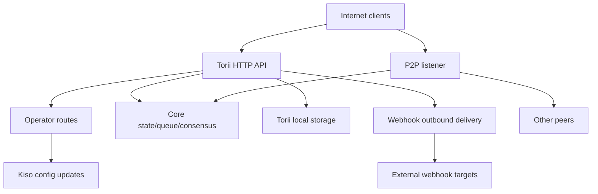

<!-- Auto-generated stub for Arabic (ar) translation. Replace this content with the full translation. -->

---
lang: ar
direction: rtl
source: iroha-threat-model.md
status: complete
generator: scripts/sync_docs_i18n.py
source_hash: 766928cf0dcbfe3513c728bcf0b9fa697a330e8000bc6944ab61e8fcd59751ad
source_last_modified: "2026-02-07T13:27:25.009145+00:00"
translation_last_reviewed: 2026-04-02
translator: machine-google-reviewed
---

# Iroha نموذج التهديد (الريبو: `iroha`)

## ملخص تنفيذي
في عملية نشر blockchain عامة مكشوفة على الإنترنت حيث يمكن الوصول إلى مسارات المشغل عن قصد من الإنترنت العام ولكن يجب المصادقة عليها من خلال توقيعات الطلب، وحيث يتم تمكين خطافات الويب/المرفقات على نقطة نهاية Torii العامة، تتمثل المخاطر الرئيسية في: تسوية مستوى المشغل (الطلبات الموقعة غير المصادق عليها أو القابلة لإعادة التشغيل إلى `/v1/configuration` ومسارات المشغل الأخرى)، وSSRF وإساءة الاستخدام الصادرة عبر تسليم خطاف الويب، وDoS عالي النفوذ عبر نقاط النهاية للمعاملة/الاستعلام + البث حيث يتم فرض حدود المعدل بشكل مشروط؛ بالإضافة إلى ذلك، فإن أي وضع "يتطلب mTLS" يعتمد على وجود `x-forwarded-client-cert` يكون قابلاً للانتحال عندما يتم كشف Torii مباشرة. الدليل: `crates/iroha_torii/src/lib.rs` (جهاز التوجيه + البرامج الوسيطة + مسارات المشغل)، `crates/iroha_torii/src/operator_auth.rs` (تمكين/تعطيل مصادقة المشغل + التحقق من `x-forwarded-client-cert`)، `crates/iroha_torii/src/webhook.rs` (عميل HTTP الصادر)، `crates/iroha_torii/src/limits.rs` (تحديد المعدل المشروط).

## النطاق والافتراضاتداخل النطاق (وقت التشغيل/أسطح الإنتاج):
- Torii خادم HTTP API والبرامج الوسيطة، بما في ذلك مسارات "المشغل" وواجهة برمجة التطبيقات للتطبيقات وخطافات الويب والمرفقات والمحتوى ونقاط نهاية البث: `crates/iroha_torii/`، `crates/iroha_torii_shared/`
- تمهيد العقدة وأسلاك المكونات (Torii + P2P + ممثل تحديث الحالة/قائمة الانتظار/التكوين): `crates/irohad/src/main.rs`
- أسطح النقل والمصافحة P2P: `crates/iroha_p2p/`
- أشكال التكوين والإعدادات الافتراضية (خصوصًا إعدادات المصادقة Torii الافتراضية): `crates/iroha_config/src/parameters/{actual,defaults}.rs`
- تحديث التكوين الذي يواجه العميل DTO (ما يمكن أن يتغير `/v1/configuration`): `crates/iroha_config/src/client_api.rs`
- أساسيات حزمة النشر: `Dockerfile`، وأمثلة التكوينات في `defaults/` (لا تستخدم مفاتيح الأمثلة المضمنة في الإنتاج).

خارج النطاق (ما لم يطلب ذلك صراحة):
- سير عمل CI وأتمتة الإصدار: `.github/`، `ci/`، `scripts/`
- حزم SDK وتطبيقات الهاتف المحمول/العميل: `IrohaSwift/`، `java/`، `examples/`
- مادة التوثيق فقط: `docs/`افتراضات صريحة (بناءً على توضيحاتك):
- Torii معرض للإنترنت ويمكن للعملاء غير المصادقين الوصول إليه (قد تظل بعض نقاط النهاية تتطلب توقيعات أو مصادقة أخرى).
- مسارات المشغل (`/v1/configuration`، `/v1/nexus/lifecycle`، والقياس عن بعد/التوصيف الخاص ببوابة المشغل عند تمكينه) مصممة لتكون قابلة للوصول للعامة ويجب المصادقة عليها عبر التوقيع من مفتاح خاص يتحكم فيه المشغل. الدليل (الحالة الحالية): `crates/iroha_torii/src/lib.rs` (`add_core_info_routes` ينطبق على `operator_layer`)، `crates/iroha_torii/src/operator_auth.rs` (`enforce_operator_auth` / `authorize_operator_endpoint`).
- يجب أن يستخدم التحقق من توقيع المشغل القائمة المسموح بها للعقدة المحلية للمفاتيح العامة للمشغل في التكوين (لا تظهر كبوابة مشغل مطبقة في جهاز التوجيه الحالي). دليل بوابة المشغل الحالية: `crates/iroha_torii/src/operator_auth.rs` (`authorize_operator_endpoint`)، ومساعد توقيع الطلب القانوني الحالي (إنشاء الرسالة): `crates/iroha_torii/src/app_auth.rs` (`canonical_request_message`).
- لا يتم نشر Torii بالضرورة خلف مدخل موثوق به؛ لذلك، يجب التعامل مع الرؤوس مثل `x-forwarded-client-cert` على أنها يتحكم فيها المهاجم عندما يتم كشف Torii مباشرة. الدليل: `crates/iroha_torii/src/lib.rs` (`HEADER_MTLS_FORWARD`، `norito_rpc_mtls_present`) و`crates/iroha_torii/src/operator_auth.rs` (`HEADER_MTLS_FORWARD`، `mtls_present`).
- يتم تمكين خطافات الويب والمرفقات على نقطة النهاية Torii العامة. الدليل: `crates/iroha_torii/src/lib.rs` (المسارات لـ `/v1/webhooks` و`/v1/zk/attachments`)، `crates/iroha_torii/src/webhook.rs`، `crates/iroha_torii/src/zk_attachments.rs`.- يمكن للمشغل تعيين `torii.require_api_token = false` أو الاحتفاظ به (الإعداد الافتراضي هو `false`). الدليل: `crates/iroha_config/src/parameters/defaults.rs` (`torii::REQUIRE_API_TOKEN`).
- من المتوقع أن يكون من الممكن الوصول إلى `/transaction` و`/query` لسلسلة عامة. ملحوظة: يتم ربطها بالإضافة إلى ذلك من خلال مرحلة الطرح "Norito-RPC" والتحقق من وجود الرأس الاختياري "mTLS مطلوب". الدليل: `crates/iroha_torii/src/lib.rs` (`ConnScheme::from_request`، `evaluate_norito_rpc_gate`) و`crates/iroha_config/src/parameters/defaults.rs` (`torii::transport::norito_rpc::STAGE = "disabled"`).

أسئلة مفتوحة من شأنها أن تغير تصنيف المخاطر بشكل جوهري:
- أين يتم تكوين المفاتيح العامة للمشغل (أي مفتاح/تنسيق التكوين)، وكيف يتم تحديد/تدوير المفاتيح (معرف المفتاح، المفاتيح النشطة المتعددة، الإلغاء)؟
- ما هو التنسيق الدقيق لرسالة توقيع المشغل وحماية إعادة التشغيل (الطابع الزمني/الرقم/العداد + ذاكرة التخزين المؤقت لإعادة التشغيل من جانب الخادم)، وما هي سياسة انحراف الساعة المقبولة؟ دليل على أن مساعد الطلب الأساسي الحالي ليس له نضارة: `crates/iroha_torii/src/app_auth.rs` (`canonical_request_message`).
- بالنسبة لخطافات الويب المجهولة، هل من المتوقع أن يسمح Torii بوجهات عشوائية، أم يجب أن يفرض سياسة وجهة SSRF (حظر RFC1918/localhost/link-local/metadata ويتطلب HTTPS بشكل اختياري)؟
- ما هي ميزات Torii التي تم تمكينها في الإصدار الخاص بك (`telemetry`، `profiling`، `p2p_ws`، `app_api_https`، `app_api_wss`)، وهل تم استخدام محتوى `app_api`؟ الدليل: `crates/iroha_torii/Cargo.toml` (`[features]`).

## نموذج النظام### المكونات الأساسية
- **عملاء الإنترنت** (المحافظ والمفهرسات والمستكشفات والروبوتات): إرسال طلبات HTTP/Norito وفتح اتصالات WS/SSE.
- **Torii (HTTP API)**: جهاز توجيه axum مزود ببرامج وسيطة لبوابة المصادقة المسبقة، وفرض الرمز المميز لواجهة برمجة التطبيقات (API) الاختياري، والتفاوض بشأن إصدار واجهة برمجة التطبيقات (API)، وإدخال العنوان عن بُعد، والمقاييس. الدليل: `crates/iroha_torii/src/lib.rs` (`create_api_router`، `enforce_preauth`، `enforce_api_token`، `enforce_api_version`، `inject_remote_addr_header`).
- **مستوى تحكم المشغل/المصادقة (الحالي) والوضع المطلوب**: مسارات المشغل محمية حاليًا بواسطة `operator_auth::enforce_operator_auth` (يمكن تعطيل WebAuthn/الرموز المميزة بشكل فعال عن طريق التكوين)، ولكن متطلبات النشر الخاصة بك هي مصادقة المشغل المستندة إلى التوقيع والتي تم التحقق منها مقابل القائمة المسموح بها من المفاتيح العامة للمشغل في التكوين. يوجد مساعد رسالة طلب أساسي ويمكن إعادة استخدامه لإنشاء الرسالة، ولكن يجب تكييف التحقق لاستخدام مفاتيح التكوين (وليس حسابات الحالة العالمية). الدليل: `crates/iroha_torii/src/lib.rs` (`add_core_info_routes` يستخدم `operator_layer`)، `crates/iroha_torii/src/operator_auth.rs` (`authorize_operator_endpoint`)، `crates/iroha_torii/src/app_auth.rs` (`canonical_request_message`، `verify_canonical_request`).- **مكونات العقدة الأساسية (قيد المعالجة)**: قائمة انتظار المعاملات، الحالة/WSV، الإجماع (Sumeragi)، تخزين الكتلة (Kura)، ممثل تحديث التكوين (Kiso)، وما إلى ذلك، تم تمريرها إلى Torii. الدليل: `crates/irohad/src/main.rs` (`Torii::new_with_handle(...)` يتلقى `queue`، `state`، `kura`، `kiso`، `sumeragi`، ويتم البدء عبر `torii.start(...)`).
- **شبكات P2P**: نقل ومصافحة مشفرة ومؤطرة من نظير إلى نظير؛ يوجد TLS-over-TCP الاختياري ولكنه يسمح عمدًا بالتحقق من الشهادة. الدليل: `crates/iroha_p2p/src/lib.rs` (اكتب الاسم المستعار `NetworkHandle<..., X25519Sha256, ChaCha20Poly1305>`)، `crates/iroha_p2p/src/transport.rs` (وحدة `p2p_tls` مع `NoCertificateVerification`).
- **Torii الثبات المحلي**: `./storage/torii` الدليل الأساسي الافتراضي للمرفقات/خطافات الويب/قوائم الانتظار. الدليل: `crates/iroha_config/src/parameters/defaults.rs` (`torii::data_dir()`)، `crates/iroha_torii/src/webhook.rs` (`webhooks.json` المستمر)، `crates/iroha_torii/src/zk_attachments.rs` (مخزن تحت `./storage/torii/zk_attachments/`).
- **أهداف خطاف الويب الصادر**: يمكن لـ Torii تسليم الأحداث إلى عناوين URL `http://` التعسفية (و`https://`/`ws(s)://` فقط مع الميزات). الدليل: `crates/iroha_torii/src/webhook.rs` (`http_post_plain`، `http_post_https`، `ws_send`).### تدفقات البيانات وحدود الثقة
- عميل الإنترنت → Torii HTTP API
  - البيانات: Norito ثنائي (`SignedTransaction`، `SignedQuery`)، JSON DTOs (app API)، اشتراكات WS/SSE، الرؤوس (بما في ذلك `x-api-token`).
  - القناة: HTTP/1.1 + WebSocket + SSE (أكسوم).
  - الضمانات: رمز واجهة برمجة التطبيقات الاختياري (`torii.require_api_token`)، واتصال المصادقة المسبقة/بوابة المعدل، والتفاوض بشأن إصدار واجهة برمجة التطبيقات؛ يطبق العديد من المعالجات تحديد معدل لكل نقطة نهاية بشكل مشروط (يمكن تجاوزه عند `enforce=false`). الدليل: `crates/iroha_torii/src/lib.rs` (`enforce_preauth`، `validate_api_token`، `handler_post_transaction`، `handler_signed_query`)، `crates/iroha_torii/src/limits.rs` (`allow_conditionally`).
  - التحقق من الصحة: ​​حدود النص على بعض نقاط النهاية (مثل المعاملات)، وفك تشفير Norito، وتوقيع الطلب لبعض نقاط نهاية التطبيق (رؤوس الطلب الأساسية). الدليل: `crates/iroha_torii/src/lib.rs` (`add_transaction_routes` يستخدم `DefaultBodyLimit::max(...)`)، `crates/iroha_torii/src/app_auth.rs` (`verify_canonical_request`).- عميل الإنترنت ← مسارات "المشغل" (Torii)
  - البيانات: تحديثات التكوين (`ConfigUpdateDTO`)، وخطط دورة حياة المسار، والقياس عن بعد/تصحيح الأخطاء/الحالة/المقاييس (عند التمكين).
  - القناة: HTTP.
  - الضمانات: بوابات الريبو الحالية هذه المسارات باستخدام البرنامج الوسيط `operator_auth::enforce_operator_auth`، وهو أمر محظور فعليًا عندما يكون `torii.operator_auth.enabled=false`؛ الموقف المطلوب الخاص بك هو المصادقة المستندة إلى التوقيع باستخدام المفاتيح العامة للمشغل من التكوين، والتي يجب تنفيذها وتنفيذها عند هذه الحدود (ويجب ألا تعتمد على `x-forwarded-client-cert` إذا تم كشف Torii مباشرة). الدليل: `crates/iroha_torii/src/lib.rs` (`add_core_info_routes` ينطبق `operator_layer`)، `crates/iroha_torii/src/operator_auth.rs` (`authorize_operator_endpoint`، `mtls_present`).
  - التحقق من الصحة: ​​في الغالب تحليل DTO؛ لا يوجد ترخيص تشفير في `handle_post_configuration` نفسه (إنه يفوض إلى `kiso.update_with_dto`). الدليل: `crates/iroha_torii/src/routing.rs` (`handle_post_configuration`).

- Torii → قائمة الانتظار/الحالة/الإجماع الأساسية (قيد المعالجة)
  - البيانات: عمليات تقديم المعاملات، وتنفيذ الاستعلام، وقراءة/كتابة الحالة، واستعلامات القياس عن بعد المتفق عليها.
  - القناة: مكالمات Rust قيد التشغيل (مقابض `Arc` المشتركة).
  - الضمانات: الحدود الموثوقة المفترضة؛ يعتمد الأمان على Torii لمصادقة/تفويض الطلبات بشكل صحيح قبل استدعاء العمليات المميزة. الدليل: `crates/irohad/src/main.rs` (أسلاك `Torii::new_with_handle(...)`) ومعالجات Torii التي تستدعي `routing::handle_*`.- Torii → Kiso (ممثل تحديث التكوين)
  - البيانات: يمكن لـ `ConfigUpdateDTO` تعديل التسجيل، وP2P ACL، وإعدادات الشبكة/النقل، ومصافحة SoraNet، وما إلى ذلك.
  - القناة: رسالة/مقبض قيد التشغيل.
  - الضمانات: من المتوقع الحصول على الترخيص عند حدود Torii؛ تحديث DTO نفسه يحمل القدرة. الدليل: `crates/iroha_config/src/client_api.rs` (تتضمن الحقول `ConfigUpdateDTO` `network_acl`، و`transport.norito_rpc`، و`soranet_handshake`، وما إلى ذلك).

- Torii → القرص المحلي (`./storage/torii`)
  - البيانات: تسجيل خطاف الويب وعمليات التسليم في قائمة الانتظار؛ المرفقات والبيانات الوصفية المطهر؛ سلوك GC/TTL.
  - القناة: نظام الملفات.
  - الضمانات: أذونات نظام التشغيل المحلي (تعمل الحاوية كغير جذر في Dockerfile)؛ يعتمد العزل المنطقي بواسطة "المستأجر" على رمز API المميز أو رأس IP البعيد الذي يتم حقنه بواسطة البرامج الوسيطة. الدليل: `Dockerfile` (`USER iroha`)، `crates/iroha_torii/src/lib.rs` (`inject_remote_addr_header`، `zk_attachments_tenant`).

- Torii ← أهداف Webhook (صادرة)
  - البيانات: حمولات الحدث + رأس التوقيع.
  - القناة: عميل TCP HTTP الخام لـ `http://`؛ اختياري `hyper+rustls` لـ `https://` عند تمكينه؛ WS/WSS اختياري عند التمكين.
  - الضمانات: المهلات/إعادة المحاولة؛ لا توجد قائمة مسموح بها للوجهة مرئية في الكود؛ يتأثر عنوان URL بالمهاجم إذا كان webhook CRUD مفتوحًا. الدليل: `crates/iroha_torii/src/webhook.rs` (`handle_create_webhook`، `http_post_plain/http_post`).- أقران P2P (شبكة غير موثوقة) → نقل/مصافحة P2P
  - البيانات: مقدمة المصافحة/البيانات الوصفية، والرسائل المشفرة المؤطرة، ورسائل الإجماع.
  - القناة: نقل P2P (TCP/QUIC/إلخ، يعتمد على الميزة)، حمولات مشفرة؛ يعتبر TLS-over-TCP الاختياري مسموحًا به بشكل صريح عند التحقق من الشهادة.
  - الضمانات: التشفير والمصافحة الموقعة في طبقة التطبيق؛ لا تتم مصادقة TLS لطبقة النقل بواسطة الشهادة. الدليل: `crates/iroha_p2p/src/lib.rs` (أنواع التشفير)، `crates/iroha_p2p/src/transport.rs` (`NoCertificateVerification` التعليق والتنفيذ).

#### الرسم البياني

## الأصول والأهداف الأمنية| الأصول | لماذا يهم | الهدف الأمني ​​(C/I/A) |
|---|---|---|
| حالة السلسلة / WSV / الكتل | ويتحول الفشل في النزاهة إلى فشل في الإجماع؛ فشل التوفر يعطل السلسلة | أنا/أ |
| حيوية الإجماع (Sumeragi) | تعتمد قيمة blockchain العامة على إنتاج الكتل المستدام | أ |
| المفاتيح الخاصة للعقدة (هوية النظير، مفاتيح التوقيع) | يؤدي التنازل الرئيسي إلى تمكين الاستيلاء على الهوية أو إساءة استخدام التوقيع أو تقسيم الشبكة | ج/أنا |
| تكوين وقت التشغيل (تم تحديث Kiso) | يتحكم في قوائم ACL للشبكة وإعدادات النقل؛ يمكن أن تؤدي إساءة الاستخدام إلى تعطيل الحماية أو الاعتراف بالأقران الضارين | أنا |
| قائمة انتظار المعاملات/مجمع الذاكرة | يمكن أن يؤدي الفيضان إلى تجويع الإجماع واستنفاد وحدة المعالجة المركزية/الذاكرة | أ |
| ثبات Torii (`./storage/torii`) | قد يؤدي استنفاد القرص إلى تعطل العقدة؛ قد تؤثر البيانات المخزنة على المعالجة النهائية | أ (وأحيانًا C/I) |
| قناة webhook الصادرة | يمكن إساءة استخدامه من أجل SSRF، أو استخراج البيانات من الشبكات الداخلية، أو المسح من عنوان IP خروج موثوق به | ج/أنا/أ |
| القياس عن بعد/المقاييس/بيانات التصحيح | يمكن أن يتسرب طوبولوجيا الشبكة والحالة التشغيلية المفيدة للهجمات المستهدفة | ج |

## نموذج المهاجم### القدرات
- يمكن لمهاجم الإنترنت عن بعد وغير المصادق عليه إرسال طلبات HTTP عشوائية، والاحتفاظ باتصالات WS/SSE طويلة الأمد، وإعادة تشغيل الحمولات أو رشها (شبكة الروبوتات).
- يمكن لأي طرف إنشاء مفاتيح وإرسال المعاملات/الاستفسارات الموقعة (بلوكشين العامة)، بما في ذلك الرسائل غير المرغوب فيها ذات الحجم الكبير.
- يمكن للأقران الضارين/المخترقين الاتصال بـ P2P ومحاولة إساءة استخدام البروتوكول أو الغمر أو التلاعب بالمصافحة ضمن القيود المسموح بها.
- إذا تم الكشف عن خطاف الويب CRUD، فيمكن للمهاجم تسجيل عناوين URL لخطاف الويب الذي يتحكم فيه المهاجم وتلقي عمليات رد الاتصال الصادرة (وربما توجيهها إلى وجهات داخلية).

### عدم القدرات
- لا يوجد وصول مباشر إلى نظام الملفات المحلي في غياب نقطة نهاية مكشوفة أو أذونات وحدة تخزين تم تكوينها بشكل خاطئ.
- عدم القدرة على تزوير التوقيعات لمفاتيح النظير/المشغل الموجودة دون التنازل عن المفاتيح.
- لا توجد قدرة مفترضة على كسر التشفير الحديث (X25519، ChaCha20-Poly1305، Ed25519) في الظروف العادية.

## نقاط الدخول وأسطح الهجوم| السطح | كيف وصلت | حدود الثقة | ملاحظات | الدليل (مسار الريبو/الرمز) |
|---|---|---|---|---|
| `POST /transaction` | الإنترنت HTTP | الإنترنت → Torii | Norito معاملة ثنائية موقعة؛ تحديد المعدل مشروط (`enforce` يمكن أن يكون خطأ) | `crates/iroha_torii/src/lib.rs` (`handler_post_transaction`، `ConnScheme::from_request`) |
| `POST /query` | الإنترنت HTTP | الإنترنت → Torii | Norito استعلام ثنائي موقّع؛ تحديد المعدل مشروط (`enforce` يمكن أن يكون خطأ) | `crates/iroha_torii/src/lib.rs` (`handler_signed_query`) |
| بوابة Norito-RPC | رؤوس HTTP للإنترنت | الإنترنت → Torii | مرحلة الطرح + "mTLS مطلوب" الاختياري عبر وجود الرأس؛ الكناري يستخدم `x-api-token` | `crates/iroha_torii/src/lib.rs` (`evaluate_norito_rpc_gate`، `HEADER_MTLS_FORWARD`) |
| `POST/GET/DELETE /v1/webhooks...` | الإنترنت HTTP (API التطبيق) | الإنترنت → Torii → صادر | مجهول حسب التصميم؛ يتيح webhook CRUD التسليم للخارج إلى عناوين URL التعسفية؛ خطر SSRF | `crates/iroha_torii/src/lib.rs` (`handler_webhooks_*`)، `crates/iroha_torii/src/webhook.rs` (`http_post`) |
| `POST/GET /v1/zk/attachments...` | الإنترنت HTTP (API التطبيق) | الإنترنت → Torii → القرص | مجهول حسب التصميم؛ مطهر مرفق + تخفيف الضغط + الثبات؛ سطح استنفاد القرص/وحدة المعالجة المركزية (المستأجر هو رمز واجهة برمجة التطبيقات (API) إذا تم تمكينه، وإلا IP البعيد عبر الرأس المحقون) | `crates/iroha_torii/src/lib.rs` (`handler_zk_attachments_*`، `zk_attachments_tenant`)، `crates/iroha_torii/src/zk_attachments.rs` || `GET /v1/content/{bundle}/{path...}` | الإنترنت HTTP | الإنترنت → Torii → الحالة/التخزين | يدعم أوضاع المصادقة + PoW + Range؛ محدد الخروج | `crates/iroha_torii/src/content.rs` (`handle_get_content`، `enforce_pow`، `enforce_auth`) |
| البث المباشر: `/v1/events/sse`، `/events` (WS)، `/block/stream` (WS) | الانترنت | الإنترنت → Torii | اتصالات طويلة الأمد؛ سطح دوس | `crates/iroha_torii/src/lib.rs` (`add_network_stream_routes`) |
| `GET/POST /v1/configuration` | الإنترنت HTTP | الإنترنت → طرق المشغل → Kiso | هدف النشر: تم التحقق من توقيعات المشغل مقابل مفاتيح القائمة المسموح بها للتكوين؛ يحميه الريبو الحالي فقط عبر البرنامج الوسيط للمشغل (لا تظهر بوابة التوقيع في مجموعة المسار) ويقوم المندوبون بتحديث التطبيق إلى Kiso | `crates/iroha_torii/src/lib.rs` (`add_core_info_routes`، `handler_post_configuration`)، `crates/iroha_torii/src/operator_auth.rs` (`enforce_operator_auth`)، `crates/iroha_torii/src/routing.rs` (`handle_post_configuration`)، `crates/iroha_torii/src/app_auth.rs` (موجود مساعد توقيع الطلب الكنسي) |
| `POST /v1/nexus/lifecycle` | الإنترنت HTTP | الإنترنت → طرق المشغل → الأساسية | نقطة نهاية المشغل مخصصة للمصادقة على التوقيع؛ محمي حاليًا بواسطة البرنامج الوسيط للمشغل ويمكن أن يصبح عامًا إذا تم تعطيل مصادقة المشغل | `crates/iroha_torii/src/lib.rs` (`add_core_info_routes`، `handler_post_nexus_lane_lifecycle`)، `crates/iroha_torii/src/operator_auth.rs` (`authorize_operator_endpoint`) || القياس عن بعد/نقاط نهاية التنميط (بوابات الميزات) | الإنترنت HTTP | الإنترنت → طرق المشغل | مجموعات الطرق ذات البوابات الخاصة بالمشغل؛ إذا تم تعطيل مصادقة المشغل وعدم وجود بوابة توقيع، فإنها تصبح عامة وقد تتسرب البيانات التشغيلية أو تكون متجهات DoS | `crates/iroha_torii/src/lib.rs` (`add_telemetry_routes`، `add_profiling_routes`)، `crates/iroha_torii/src/operator_auth.rs` (`authorize_operator_endpoint`) |
| نقل P2P TCP/TLS | الإنترنت / شبكة الأقران | الإنترنت/الأقران → P2P | إطارات P2P مشفرة + مصافحة؛ التحقق من شهادة TLS مسموح به عند التمكين | `crates/iroha_p2p/src/lib.rs` (`NetworkHandle`)، `crates/iroha_p2p/src/transport.rs` (`p2p_tls::NoCertificateVerification`) |

## أعلى مسارات سوء الاستخدام

1. **هدف المهاجم: السيطرة على سلوك العقدة عبر تحديثات تكوين وقت التشغيل**
   1) ابحث عن Torii المعرض للإنترنت حيث يمكن الوصول إلى مسارات المشغل وتكون مصادقة المشغل غائبة/قابلة للتجاوز (على سبيل المثال، تم تعطيل مصادقة المشغل ولا توجد بوابة توقيع).  
   2) `POST /v1/configuration` مع `ConfigUpdateDTO` الذي يعمل على فك قوائم ACL للشبكة أو تغيير إعدادات النقل.  
   3) الانضمام كنظير أو التسبب في التقسيم/التكوين الخاطئ؛ تدهور الإجماع و/أو توجيه المعاملات من خلال البنية التحتية التي يتحكم فيها المهاجم.  
   التأثير: تسوية سلامة العقدة وتوافرها (وربما الشبكة).2. **هدف المهاجم: إعادة تشغيل طلب موقع من قبل المشغل**
   1) الحصول على طلب مشغل واحد صالح وموقّع (على سبيل المثال، عبر جهاز مشغل مخترق، أو سجلات وكيل تم تكوينها بشكل خاطئ، أو بيئة يتم فيها إنهاء TLS بشكل غير آمن).  
   2) إعادة تشغيل نفس الطلب على مسارات المشغل العام إذا كان نظام التوقيع يفتقر إلى الحداثة (الطابع الزمني/الرقم) ورفض إعادة التشغيل من جانب الخادم.  
   3) التسبب في تغييرات متكررة في التكوين، أو عمليات التراجع، أو التبديل القسري الذي يؤدي إلى تقليل التوفر أو إضعاف الدفاعات.  
   التأثير: تسوية السلامة/التوفر على الرغم من "مصادقة التوقيع".  

3. **هدف المهاجم: تعطيل/حماية البوابة عن طريق تغيير طرح Norito-RPC**
   1) `POST /v1/configuration` لتحديث `transport.norito_rpc.stage` أو `require_mtls`.  
   2) الفتح القسري أو الإغلاق القسري `/transaction` و`/query`، مما يؤثر على ضوابط التوفر والقبول.  
   التأثير: انقطاع مستهدف أو تجاوز التحكم في القبول.4. **هدف المهاجم: دخول SSRF إلى الشبكة الداخلية للمشغل**
   1) قم بإنشاء إدخال خطاف ويب يشير إلى وجهة داخلية (على سبيل المثال، مضيف RFC1918، وبيانات التعريف IP، ومستوى التحكم) عبر `POST /v1/webhooks`.  
   2) انتظر الأحداث المطابقة؛ يقوم Torii بتسليم طلبات HTTP الصادرة من موضع الشبكة الخاص به.  
   3) استخدم الاستجابات/الحالات/التوقيت وإعادة المحاولة المتكررة لاستكشاف الخدمات الداخلية (وربما التصفية إذا ظهر محتوى الاستجابة في مكان آخر).  
   التأثير: التعرض للشبكة الداخلية، وسقالات الحركة الجانبية، والإضرار بالسمعة، والتعرض المحتمل لبيانات الاعتماد عبر نقاط نهاية البيانات التعريفية.  

5. **هدف المهاجم: رفض خدمة قبول المعاملة/الاستعلام**
   1) الفيضان `POST /transaction` و`POST /query` مع أجسام Norito صالحة/غير صالحة.  
   2) الحفاظ على العديد من اشتراكات WS/SSE والعملاء البطيئين.  
   3) استغلال تحديد المعدل المشروط (`enforce=false`) في التشغيل العادي لتجنب الاختناق.  
   التأثير: استنفاد وحدة المعالجة المركزية/الذاكرة، وتشبع قائمة الانتظار، وتوقف الإجماع.  

6. **هدف المهاجم: قرص العادم عبر المرفقات**
   1) الفيضان `/v1/zk/attachments` مع الحمولات ذات الحجم الأقصى و/أو الأرشيفات المضغوطة بالقرب من حدود التوسعة.  
   2) استخدم عناوين IP متعددة المصدر (أو أي نقطة ضعف في مفتاح المستأجر) لتجنب الحدود القصوى لكل مستأجر.  
   3) استمر حتى يتأخر TTL/GC؛ املأ `./storage/torii`.  
   التأثير: تعطل العقدة، وعدم القدرة على معالجة الكتل/المعاملات.7. **هدف المهاجم: تجاوز بوابات "mTLS المطلوبة" عندما يتم كشف Torii مباشرة**
   1) يقوم المشغل بتمكين Norito لـ Norito-RPC أو مصادقة المشغل.  
   2) يرسل المهاجم الطلبات باستخدام `x-forwarded-client-cert: <anything>`.  
   3) يتم اجتياز فحص وجود الرأس في حالة عدم وجود دخول موثوق به يزيل الرأس.  
   التأثير: سوء تطبيق الضوابط؛ يعتقد المشغل أن mTLS يتم فرضه عندما لا يكون كذلك.  

8. **هدف المهاجم: إضعاف الاتصال بين الأقران / استهلاك الموارد**
   1) يحاول الأقران الضارون بشكل متكرر المصافحة أو إغراق الإطارات بأحجام قريبة من الحد الأقصى.  
   2) استغلال طبقة النقل TLS المسموح بها (في حالة تمكينها) لتجنب الرفض المبكر بناءً على الشهادات.  
   التأثير: انقطاع الاتصال، واستخدام وحدة المعالجة المركزية (CPU)، وانخفاض توفر الأقران.  

9. **هدف المهاجم: الاستطلاع عبر القياس عن بعد/نقاط نهاية التصحيح**
   1) إذا تم تمكين القياس عن بعد/التوصيف وكانت مصادقة المشغل مفقودة/يمكن تجاوزها، فقم بكشط `/status`، `/metrics`، ومسارات التصحيح.  
   2) استخدم البيانات الهيكلية/الصحية المسربة لتحديد توقيت الهجمات واستهداف مكونات محددة.  
   التأثير: زيادة معدل نجاح المهاجم؛ الكشف عن المعلومات المحتملة.  

## جدول نماذج التهديد| معرف التهديد | مصدر التهديد | المتطلبات الأساسية | عمل التهديد | التأثير | الأصول المتأثرة | الضوابط الموجودة (الدليل) | فجوات | عمليات التخفيف الموصى بها | أفكار كشفية | احتمال | شدة التأثير | الأولوية |
|---|---|---|---|---|---|---|---|---|---|---|---|---|| TM-001 | مهاجم الإنترنت عن بعد | Torii مكشوف للإنترنت؛ طرق المشغلين عامة؛ مصادقة المشغل غائبة/يمكن تجاوزها أو لم يتم تنفيذ/خطأ في تنفيذ مصادقة المشغل القائمة على التوقيع | استدعاء مسارات المشغل (على سبيل المثال، `/v1/configuration`، `/v1/nexus/lifecycle`) لتغيير تكوين وقت التشغيل أو قوائم ACL للشبكة أو إعدادات النقل | الاستيلاء على العقدة/التقسيم؛ الاعتراف بأقرانهم الخبيثين؛ تعطيل الحماية | تكوين وقت التشغيل؛ حيوية الإجماع؛ سلامة السلسلة مفاتيح الأقران | توجد مسارات المشغل خلف البرامج الوسيطة للمشغل، لكن `authorize_operator_endpoint` يُرجع `Ok(())` عند تعطيله؛ يقوم تحديث التكوين بتفويض Kiso دون مصادقة إضافية. الدليل: `crates/iroha_torii/src/lib.rs` (`add_core_info_routes`)، `crates/iroha_torii/src/operator_auth.rs` (`authorize_operator_endpoint`)، `crates/iroha_torii/src/routing.rs` (`handle_post_configuration`)، `crates/iroha_config/src/client_api.rs` (`ConfigUpdateDTO`) | لا تظهر مصادقة المشغل المستندة إلى التوقيع في مجموعات مسارات المشغل؛ يكون "mTLS" القائم على الرأس قابلاً للانتحال عندما يكون Torii مكشوفًا بشكل مباشر؛ إعادة الحماية غير محددة | تنفيذ مصادقة المشغل الإلزامية القائمة على التوقيع لمسارات المشغل التي تم التحقق منها مقابل القائمة المسموح بها للتكوين للمفاتيح العامة للمشغل (دعم المفاتيح المتعددة + معرفات المفاتيح)؛ تضمين الحداثة (الطابع الزمني + nonce) مع ذاكرة تخزين مؤقت لإعادة التشغيل محدودة؛ فرض TLS من طرف إلى طرف (لا تثق في `x-forwarded-client-cert`)؛ تطبيق حدود صارمة للمعدلات + تسجيل التدقيق على جميع إجراءات المشغل | تنبيه عند وصول أي طريق للمشغل؛ اختلافات تكوين سجل التدقيق؛ كشف التوقيعات المتكررة / غير المميزة؛ مراقبة التحديث غير العاديالتردد ومصدر IPs | عالي (حتى يتم تنفيذ وفرض حماية مصادقة التوقيع + إعادة التشغيل) | عالية | **حرجة** || TM-002 | مهاجم الإنترنت عن بعد | Webhook CRUD مجهول ويمكن الوصول إليه عبر الإنترنت؛ لا توجد سياسة وجهة SSRF | أنشئ خطافات ويب تستهدف عناوين URL الداخلية/المميزة وقم بتشغيل عمليات التسليم | SSRF، والمسح الداخلي، وعرض بيانات اعتماد البيانات الوصفية، وDoS الصادرة | قناة الويب هوك؛ الشبكة الداخلية التوفر | توجد خطافات الويب؛ تستخدم عمليات التسليم المهلات/التراجع/الحد الأقصى للمحاولات؛ يستخدم تسليم `http://` TCP الخام. الدليل: `crates/iroha_torii/src/lib.rs` (`handler_webhooks_*`)، `crates/iroha_torii/src/webhook.rs` (`handle_create_webhook`، `http_post_plain`، `WebhookPolicy`) | لا توجد قائمة مسموح بها للوجهة / كتل لنطاق IP؛ `http://` مسموح به؛ عناصر التحكم في إعادة ربط/إعادة توجيه DNS غير مرئية؛ تحديد معدل webhook CRUD مشروط (قد يكون متوقفًا بشكل فعال في حالة مستقرة) | حافظ على تمكين خطافات الويب مع إضافة عناصر تحكم SSRF: حظر نطاقات IP الخاصة/الاسترجاع/الارتباط المحلي/البيانات الوصفية وأسماء المضيفين، والعناوين + الدبوس، والحد من عمليات إعادة التوجيه، والحد من التزامن الصادر؛ نظرًا لأن الإنشاء مجهول، أضف حصصًا دائمة التشغيل لكل IP + أحرف استهلالية عامة وفكر في رمز PoW اختياري لإنشاء/تحديث خطاف الويب | عنوان URL المستهدف للسجل والمقياس على الويب + عناوين IP التي تم حلها؛ التنبيه على الوجهات المحظورة. تنبيه بشأن محاولات IP الخاصة ومعدلات الفشل/إعادة المحاولة المرتفعة؛ مراقبة معدل webhook CRUD وتشبع قائمة الانتظار | عالية | عالية | **حرجة** || TM-003 | مهاجم الإنترنت عن بعد / مرسلي البريد العشوائي | العام `/transaction` و`/query`؛ لا يتم فرض تحديد المعدل المشروط في الأوضاع الشائعة | إرسال طلب Flood/Tx، بالإضافة إلى تدفقات WS/SSE | استنفاد وحدة المعالجة المركزية/الذاكرة؛ تشبع قائمة الانتظار؛ أكشاك الإجماع | التوفر (Torii + الإجماع)؛ قائمة الانتظار/مجمع الذاكرة | بوابة المصادقة المسبقة تحد من الاتصالات لكل IP ويمكن حظرها. الدليل: `crates/iroha_torii/src/lib.rs` (`enforce_preauth`)، `crates/iroha_torii/src/limits.rs` (`PreAuthGate`) | العديد من محددات معدل المفاتيح مشروطة (`allow_conditionally` تُرجع صحيحًا عندما يكون `enforce=false`)؛ يتجاوز المهاجمون الموزعون حدود IP | إضافة حدود معدل التشغيل دائمًا لـ tx/query/streams عند التعرض للإنترنت؛ إضافة حدود المعدلات القابلة للتكوين لكل نقطة نهاية بشكل مستقل عن سياسة الرسوم؛ حماية نقاط النهاية باهظة الثمن باستخدام إثبات العمل (PoW) أو طلب حصص تعتمد على التوقيع/الحساب | المراقبة: رفض المصادقة المسبقة، وطول قائمة الانتظار، ومعدلات الإرسال/الاستعلام، واتصالات WS/SSE النشطة؛ تنبيه بشأن الحالات الشاذة وحدود القدرة المستدامة | عالية | عالية | **عالية** || TM-004 | مهاجم الإنترنت عن بعد | تمكين ميزات القياس عن بعد/التنميط؛ تم تعطيل مصادقة المشغل أو بوابة التوقيع مفقودة | كشط `/status`، `/metrics`، نقاط النهاية التصحيحية؛ طلب حالة التصحيح باهظة الثمن | الكشف عن المعلومات؛ حجب الخدمة التشغيلي؛ تمكين الهجوم المستهدف | بيانات القياس عن بعد/تصحيح الأخطاء؛ التوفر | يتم وضع مجموعات مسارات القياس عن بعد/التوصيف في طبقات مع `operator_auth::enforce_operator_auth`. الدليل: `crates/iroha_torii/src/lib.rs` (`add_telemetry_routes`، `add_profiling_routes`)، `crates/iroha_torii/src/operator_auth.rs` (`authorize_operator_endpoint`) | تعتبر البرامج الوسيطة للمشغل محظورة عند تعطيلها؛ لا تظهر مصادقة المشغل المستندة إلى التوقيع في مجموعات المسارات هذه | تتطلب نفس مصادقة المشغل الإلزامية المستندة إلى التوقيع لمجموعات المسارات هذه؛ إضافة حدود المعدل الثابت والتخزين المؤقت للاستجابة حيثما أمكن ذلك؛ تجنب كشف نقاط نهاية التوصيف/التصحيح على العقد العامة بشكل افتراضي | تتبع سجلات الوصول؛ تنبيه بشأن أنماط الكشط والطلبات المستمرة عالية التكلفة | متوسطة | متوسطة | **متوسطة** || TM-005 | مهاجم الإنترنت عن بعد (استغلال التكوين الخاطئ) | يقوم المشغل بتمكين `require_mtls` ولكن Torii مكشوف بشكل مباشر (أو لا يتم ضمان تعقيم الوكيل/الرأس) | محاكاة ساخرة `x-forwarded-client-cert` لتلبية فحوصات "mTLS المطلوبة" | شعور زائف بالأمان؛ تجاوز البوابة لسياسات مصادقة المشغل Norito-RPC / | حدود المشغل/المصادقة؛ مراقبة القبول | يتم التحقق من `require_mtls` من خلال وجود الرأس. الدليل: `crates/iroha_torii/src/lib.rs` (`HEADER_MTLS_FORWARD`، `norito_rpc_mtls_present`)، `crates/iroha_torii/src/operator_auth.rs` (`mtls_present`) | لا يوجد تحقق تشفيري لشهادة العميل على Torii؛ يعتمد على عقد دخول خارجي | لا تعتمد على `x-forwarded-client-cert` للأمان عندما يكون Torii قابلاً للوصول بشكل عام؛ إذا كان mTLS مطلوبًا، فقم بفرض التحقق من شهادة العميل على Torii أو عند مدخل موثوق به يزيل رؤوس العميل؛ وإلا قم بإزالة/تجاهل البوابة المستندة إلى الرأس لعمليات النشر التي تواجه الإنترنت | التنبيه على أي طلب يحتوي على `x-forwarded-client-cert` يصل إلى Torii مباشرة؛ نتائج بوابة السجل لـ Norito-RPC ومصادقة المشغل؛ مراقبة التغيرات المفاجئة في حركة المرور المسموح بها | عالية | عالية | **عالية** || TM-006 | مهاجم الإنترنت عن بعد | نقاط نهاية المرفقات مجهولة ويمكن الوصول إليها عبر الإنترنت؛ يمكن للمهاجم إرسال حمولات ذات حجم أقصى أو قنبلة ضغط | إساءة استخدام المطهر/إلغاء الضغط/الاستمرار في استهلاك وحدة المعالجة المركزية/القرص | عدم استقرار العقدة؛ استنفاد القرص. الإنتاجية المتدهورة | تخزين Torii؛ التوفر | توجد حدود للمرفقات + المطهر والحد الأقصى لعمق التوسيع/الأرشفة. الدليل: `crates/iroha_config/src/parameters/defaults.rs` (`ATTACHMENTS_MAX_BYTES`، `ATTACHMENTS_MAX_EXPANDED_BYTES`، `ATTACHMENTS_MAX_ARCHIVE_DEPTH`، `ATTACHMENTS_SANITIZER_MODE`)، `crates/iroha_torii/src/zk_attachments.rs` (`inspect_bytes`، الحدود)، `crates/iroha_torii/src/lib.rs` (`handler_zk_attachments_*`، `zk_attachments_tenant`) | تعتمد هوية المستأجر إلى حد كبير على IP عندما تكون الرموز المميزة لواجهة برمجة التطبيقات (API) متوقفة عن التشغيل؛ قبعات تجاوز المصادر الموزعة ؛ لا يزال TTL يسمح بالتراكم لعدة أيام | نظرًا لأن المرفقات يجب أن تكون علنية ومجهولة، قم بفرض حصص القرص العالمية + الضغط الخلفي، وتشديد الإعدادات الافتراضية (TTL/max بايت)، والحفاظ على المطهر في وضع المعالجة الفرعية مع وضع الحماية على مستوى نظام التشغيل، والنظر في بوابة إثبات العمل (PoW) الاختيارية للكتابة؛ تأكد من أنه لا يمكن تجاوز الحصص النسبية لكل IP بواسطة الرؤوس المخادعة (استمر في استخدام `inject_remote_addr_header`) | مراقبة استخدام القرص `./storage/torii`؛ تنبيه بشأن معدل إنشاء المرفقات، ورفض المطهر، وتراكم كل مستأجر؛ تتبع تأخر GC | متوسطة | عالية | **عالية** || TM-007 | الأقران الخبيثة | يمكن أن يصل النظير إلى مستمع P2P؛ تمكين TLS اختياريًا | مصافحات/إطارات الفيضانات؛ محاولة استنفاد الموارد؛ استغلال TLS المسموح به لتجنب الرفض المبكر | تدهور الاتصال. حرق الموارد؛ التقسيم الجزئي | التوفر؛ اتصال الأقران | الإطارات المشفرة + أخطاء المصافحة للرسائل كبيرة الحجم. الدليل: `crates/iroha_p2p/src/lib.rs` (`Error::FrameTooLarge`، أخطاء المصافحة)، `crates/iroha_p2p/src/transport.rs` (`p2p_tls` مسموح به ولكن من المتوقع المصافحة الموقعة على طبقة التطبيق) | لا تتم مصادقة طبقة النقل؛ DoS ممكن قبل المصادقة ذات المستوى الأعلى؛ قد تكون عناصر التحكم لكل نظير/IP غير كافية | إضافة حدود اتصال صارمة لكل IP/ASN؛ محاولات المصافحة ذات الحد الأقصى للمعدل؛ النظر في طلب مفاتيح نظيرة مدرجة في القائمة المسموح بها على العقد العامة؛ التأكد من أن الحد الأقصى لأحجام الإطارات محافظ؛ إضافة الضغط الخلفي والإسقاط المبكر للأقران غير المصادقين | مراقبة معدل اتصال P2P الوارد؛ تنبيه بشأن حالات فشل المصافحة المتكررة وأخطاء الإطار الكبيرة جدًا | متوسطة | متوسطة | **متوسطة** || TM-008 | سلسلة التوريد / خطأ المشغل | يقوم المشغل بالنشر مع أمثلة للمفاتيح/التكوينات؛ التبعيات للخطر | استخدم مفاتيح افتراضية/مثالية أو مفاتيح افتراضية غير آمنة؛ اختطاف التبعية | الحل الوسط الرئيسي؛ قسم السلسلة فقدان السمعة | مفاتيح؛ نزاهة؛ التوفر | يقوم Docker بتشغيل نظام غير جذر وينسخ الإعدادات الافتراضية إلى `/config`. الدليل: `Dockerfile` (`USER iroha`، `COPY defaults ...`) | قد تحتوي تكوينات المثال على مفاتيح خاصة مضمنة؛ الإعدادات الافتراضية غير الآمنة مثل `require_api_token=false` و`operator_auth.enabled=false` | إضافة تحذيرات بدء التشغيل/فحوصات الفشل المغلقة عند اكتشاف مفاتيح الأمثلة المعروفة؛ شحن ملف تعريف التكوين المقوى "للعقدة العامة"؛ فرض عمليات التحقق من `cargo deny`/SBOM في مسار الإصدار | بوابة CI للأسرار في `defaults/`؛ تحذير سجل وقت التشغيل على مجموعات التكوين غير الآمنة | متوسطة | عالية | **عالية** || TM-009 | مهاجم الإنترنت عن بعد | يتم تنفيذ مصادقة المشغل المستندة إلى التوقيع دون حداثة؛ يمكن للمهاجم ملاحظة طلب عامل موقع واحد صالح على الأقل | إعادة تشغيل طلب عامل موقع صالح مسبقًا مقابل مسارات المشغل العام | تغييرات/تراجعات التكوين المتكررة؛ الانقطاعات المستهدفة؛ إضعاف الدفاعات | تكوين وقت التشغيل؛ التوفر؛ نزاهة التدقيق | يقوم مساعد التوقيع الأساسي بإنشاء رسالة من الطريقة/المسار/الاستعلام/تجزئة النص ولا يتضمن الطابع الزمني/رقم nonce. الدليل: `crates/iroha_torii/src/app_auth.rs` (`canonical_request_message`) | حماية إعادة التشغيل ليست متأصلة في التوقيعات؛ لا تُظهر مسارات المشغل حاليًا ذاكرة تخزين مؤقت لإعادة التشغيل/تتبع nonce | تضمين `timestamp` + `nonce` (أو العداد الرتيب) في الرسالة الموقعة، وفرض انحراف محكم على مدار الساعة، والحفاظ على ذاكرة تخزين مؤقت لإعادة التشغيل محدودة مرتبطة بهوية المشغل؛ تسجيل ورفض التكرارات | تنبيه بشأن التكرارات غير المكررة/تجزئات الطلب؛ ربط إجراءات المشغل حسب الهوية والمصدر؛ إضافة مقاييس لإعادة الرفض | متوسطة | عالية | **عالية** || TM-010 | مهاجم عن بعد / من الداخل | يتم تخزين المفتاح الخاص لتوقيع المشغل حيث يمكن سحبه (القرص/التكوين/عناصر CI) | سرقة المفتاح الخاص للمشغل وإصدار طلبات مشغل موقعة صالحة | تسوية كاملة بين المشغل والطائرة مع إمكانية اكتشاف منخفضة | مفاتيح المشغل؛ تكوين وقت التشغيل؛ حيوية الإجماع | تقوم بعض مكونات Torii بالفعل بتحميل المفاتيح الخاصة من التكوين (على سبيل المثال، مفتاح مشغل المُصدر غير المتصل). الدليل: `crates/iroha_torii/src/lib.rs` (يقرأ `torii.offline_issuer.operator_private_key` في `KeyPair`)، `Dockerfile` (يعمل كغير جذر) | تخزين المفاتيح/التدوير/استخدام HSM لا يتم فرضه بواسطة التعليمات البرمجية؛ مصادقة التوقيع سوف ترث هذا الخطر | استخدم المفاتيح المدعومة بالأجهزة (HSM/المنطقة الآمنة) حيثما أمكن ذلك؛ تجنب تضمين مفاتيح المشغل في الريبو أو التكوين القابل للقراءة عالميًا؛ فرض أذونات الملفات الصارمة والتناوب؛ ضع في الاعتبار عتبة التوقيع/العتبة المتعددة لإجراءات المشغل | تنبيه بشأن إجراءات المشغل من عناوين IP/ASN الجديدة؛ الاحتفاظ بسجل تدقيق ثابت لإجراءات المشغل؛ تدوير المفاتيح عند الشبهة | متوسطة | عالية | **عالية** |

## معايرة الحرجة

بالنسبة لسياق النشر الموضح في الريبو + (السلسلة العامة المكشوفة على الإنترنت؛ مسارات المشغل عامة ومخصصة للمصادقة على التوقيع؛ لا يوجد دخول موثوق به مضمون)، تعني مستويات الخطورة:- **حرج**: يمكن لمهاجم بعيد غير مصادق عليه تغيير سلوك العقدة/الشبكة أو إيقاف إنتاج الكتلة بشكل موثوق عبر العديد من العقد.
  - أمثلة: مصادقة التوقيع المفقودة/القابلة للتجاوز لمسارات المشغل مثل `/v1/configuration` (TM-001)؛ webhook SSRF إلى نقاط نهاية البيانات الوصفية/مستوى التحكم في المجموعة من الخروج المميز (TM-002)؛ سرقة مفتاح توقيع المشغل لتمكين إجراءات المشغل الموقعة الصالحة (TM-010).

- **مرتفع**: يمكن للمهاجم عن بعد أن يتسبب في انقطاع الخدمة المستمر لعقدة ما أو تجاوز التحكم الأمني ​​الذي قد يعتمد عليه المشغلون، بشروط مسبقة واقعية.
  - أمثلة: قبول الإرسال/الاستعلام بكميات كبيرة DoS عندما يكون تحديد المعدل المشروط غير نشط (TM-003)؛ استنفاد وحدة المعالجة المركزية/القرص القائم على المرفقات (TM-006)؛ إعادة تشغيل طلب عامل موقع تم التقاطه في حالة فقدان الحداثة/رفض إعادة التشغيل (TM-009).

- **متوسطة**: الهجمات التي تساعد بشكل هادف في إعادة تحسين الأداء أو خفضه ولكنها إما تكون مقيدة بالميزات، أو تتطلب موقعًا مرتفعًا للمهاجم، أو لديها إجراءات تخفيف كبيرة موجودة بالفعل.
  - أمثلة: القياس عن بعد/توصيف التعرض عند تمكينه (TM-004)؛ فيضانات مصافحة P2P مع نصف قطر انفجار محدود (TM-007).- **منخفض**: الهجمات التي تتطلب شروطًا مسبقة غير متوقعة، أو نطاق انفجار محدود، أو بنادق تشغيلية في المقام الأول مع سهولة التخفيف.
  - أمثلة: تسرب معلومات بسيطة من نقاط النهاية العامة للقراءة فقط والتي من المتوقع أن تكون عامة لـ blockchain (على سبيل المثال، `/v1/health`، `/v1/peers`) وهي مفيدة في المقام الأول للاستطلاع بدلاً من التسوية المباشرة (لم يتم ذكرها كأهم التهديدات هنا). الدليل: `crates/iroha_torii_shared/src/lib.rs` (`uri::HEALTH`، `uri::PEERS`).

## مسارات التركيز للمراجعة الأمنية| المسار | لماذا يهم | معرفات التهديدات ذات الصلة |
|---|---|---|
| `crates/iroha_torii/src/lib.rs` | إنشاء جهاز التوجيه، وترتيب البرامج الوسيطة، ومجموعات مسارات المشغل، ومعالجات الإرسال/الاستعلام، وقرارات المصادقة/حدود المعدل، وأسلاك واجهة برمجة تطبيقات التطبيق (خطافات الويب/المرفقات) | TM-001، TM-002، TM-003، TM-004، TM-005، TM-006 |
| `crates/iroha_torii/src/operator_auth.rs` | مصادقة المشغل على تمكين/تعطيل السلوك؛ فحص mTLS القائم على الرأس؛ الجلسات/الرموز؛ مهم لحماية طائرة المشغل وفهم ظروف الالتفافية | TM-001، TM-004، TM-005 |
| `crates/iroha_torii/src/routing.rs` | معالجات `/v1/configuration` تفوض إلى Kiso دون مصادقة إضافية؛ مساحة كبيرة من المعالجات | TM-001، TM-003 |
| `crates/iroha_config/src/client_api.rs` | يحدد إمكانيات `ConfigUpdateDTO` (قوائم ACL للشبكة وتغييرات النقل وتحديثات المصافحة) | TM-001، TM-009 |
| `crates/iroha_config/src/parameters/defaults.rs` | الوضع الافتراضي لرموز واجهة برمجة التطبيقات/مصادقة المشغل/Norito-RPC؛ افتراضيات المرفقات | TM-003، TM-006، TM-008 |
| `crates/iroha_torii/src/webhook.rs` | عميل HTTP الصادر ودعم المخطط؛ سطح SSRF؛ عامل الثبات والتسليم | TM-002 |
| `crates/iroha_torii/src/zk_attachments.rs` | معقم المرفقات، حدود تخفيف الضغط، الثبات، مفتاح المستأجر | TM-006 |
| `crates/iroha_torii/src/limits.rs` | بوابة المصادقة المسبقة ومساعدي تحديد المعدل؛ سلوك التنفيذ المشروط | TM-003 |
| `crates/iroha_torii/src/content.rs` | مصادقة نقطة نهاية المحتوى/إثبات العمل/النطاق وتحديد الخروج؛ تصدير البيانات واعتبارات DoS | TM-003 || `crates/iroha_torii/src/app_auth.rs` | توقيع الطلب الأساسي (إنشاء الرسالة والتحقق من التوقيع)؛ اعتبارات مخاطر إعادة التشغيل في حالة إعادة استخدامها لمصادقة المشغل | TM-001، TM-003، TM-009 |
| `crates/iroha_p2p/src/lib.rs` | خيارات التشفير، وحدود الإطارات، ومعالجة أخطاء المصافحة؛ سطح خطر P2P | TM-007 |
| `crates/iroha_p2p/src/transport.rs` | TLS-over-TCP مسموح به؛ تؤثر سلوكيات النقل على سطح DoS | TM-007 |
| `crates/irohad/src/main.rs` | Bootstraps Torii + P2P + ممثل تحديث التكوين؛ يحدد الأسطح التي تم تمكينها | TM-001، TM-008 |
| `defaults/nexus/config.toml` | قد يتضمن تكوين المثال مفاتيح الأمثلة المضمنة وعناوين الربط العامة؛ بنادق النشر | TM-008 |
| `Dockerfile` | مستخدم/أذونات وقت تشغيل الحاوية وإدراج التكوين الافتراضي (المواد الأساسية وتعرض مستوى المشغل حساسة للنشر) | TM-008، TM-010 |### فحص الجودة
- نقاط الإدخال المغطاة: الإرسال/الاستعلام، والبث، وخطافات الويب، والمرفقات، والمحتوى، والمشغل/التكوين، والقياس عن بعد/التنميط (بوابة الميزات)، P2P.
- حدود الثقة المغطاة بالتهديدات: الإنترنت → Torii، Torii → Kiso/core/disk، Torii → أهداف webhook، الأقران → P2P.
- وقت التشغيل مقابل فصل CI/dev: CI/docs/mobile خارج النطاق بشكل واضح.
- تنعكس توضيحات المستخدم: مسارات المشغل المكشوفة على الإنترنت عامة ولكن يجب المصادقة على التوقيع، ولا يوجد دخول موثوق به مضمون، وتم تمكين خطافات الويب/المرفقات على نقطة نهاية Torii العامة.
- الافتراضات/الأسئلة المفتوحة المدرجة صراحة في "النطاق والافتراضات".

##ملاحظات حول الاستخدام
- تم إعادة تخزين هذه الوثيقة عن عمد (تشير نقاط ربط الأدلة إلى الكود الحالي)؛ تتطلب العديد من عمليات التخفيف ذات الأولوية العالية (بوابة توقيع المشغل، وسياسة وجهة SSRF للخطاف على الويب) رمزًا/تكوينًا جديدًا غير موجود بعد.
- تعامل مع أي إشارات "mTLS" قائمة على الرأس (على سبيل المثال، `x-forwarded-client-cert`) على أنها خاضعة لسيطرة المهاجم ما لم يجردها دخول موثوق به ويدخلها.