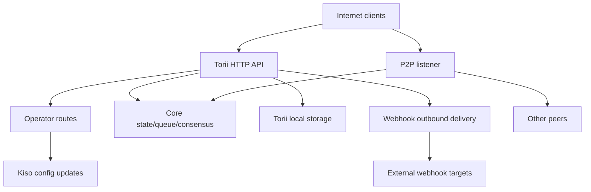

<!-- Auto-generated stub for Azerbaijani (az) translation. Replace this content with the full translation. -->

---
lang: az
direction: ltr
source: iroha-threat-model.md
status: complete
generator: scripts/sync_docs_i18n.py
source_hash: 766928cf0dcbfe3513c728bcf0b9fa697a330e8000bc6944ab61e8fcd59751ad
source_last_modified: "2026-02-07T13:27:25.009145+00:00"
translation_last_reviewed: 2026-04-02
translator: machine-google-reviewed
---

# Iroha Təhdid Modeli (repo: `iroha`)

## İcra xülasəsi
Operator marşrutlarının qəsdən ictimai internetdən əldə oluna bildiyi, lakin sorğu imzaları vasitəsilə təsdiq edilməli olduğu və ictimai Torii son nöqtəsində veb-qoşmaların aktivləşdirildiyi internetə məruz qalan ictimai blokçeyn yerləşdirməsində əsas risklər bunlardır: operator-təyyarə güzəşti və ya təkrar ifa olunmayan imzalanmış sorğular `/v1/configuration` və digər operator marşrutları), webhook çatdırılması vasitəsilə SSRF və gedən sui-istifadə və tarif məhdudiyyətlərinin şərti olaraq tətbiq edildiyi əməliyyat/sorğu + axın son nöqtələri vasitəsilə yüksək leverajlı DoS; əlavə olaraq, `x-forwarded-client-cert`-in mövcudluğuna əsaslanan istənilən “mTLS tələb olunan” duruş, Torii birbaşa məruz qaldıqda saxtalaşdırıla bilər. Sübut: `crates/iroha_torii/src/lib.rs` (marşrutlaşdırıcı + ara proqram + operator marşrutları), `crates/iroha_torii/src/operator_auth.rs` (operator authunu aktivləşdir/deaktiv edin + `x-forwarded-client-cert` yoxlayın), `crates/iroha_torii/src/webhook.rs` (giden HTTP müştəri), Sumeragi limiti (məhdudlaşdırma Sumeragi).

## Əhatə dairəsi və fərziyyələrƏhatə daxilində (işləmə vaxtı / istehsal səthləri):
- Torii HTTP API serveri və ara proqram, o cümlədən “operator” marşrutları, proqram API, veb-qancalar, qoşmalar, məzmun və axın son nöqtələri: `crates/iroha_torii/`, `crates/iroha_torii_shared/`
- Node açılış kəməri və komponent naqilləri (Torii + P2P + vəziyyət/növbə/konfiqurasiya yeniləmə aktyoru): `crates/irohad/src/main.rs`
- P2P nəqliyyat və əl sıxma səthləri: `crates/iroha_p2p/`
- Konfiqurasiya formaları və defoltları (xüsusilə Torii auth defoltları): `crates/iroha_config/src/parameters/{actual,defaults}.rs`
- Müştəri ilə bağlı DTO konfiqurasiya yeniləməsi (`/v1/configuration` dəyişə bilər): `crates/iroha_config/src/client_api.rs`
- Yerləşdirmə qablaşdırma əsasları: `Dockerfile` və `defaults/` nümunə konfiqurasiyaları (istehsalda daxil edilmiş nümunə açarlarından istifadə etməyin).

Əhatə dairəsi xaricində (açıq şəkildə tələb olunmadıqda):
- CI iş axınları və buraxılış avtomatlaşdırılması: `.github/`, `ci/`, `scripts/`
- Mobil/müştəri SDK-ları və proqramları: `IrohaSwift/`, `java/`, `examples/`
- Yalnız sənədləşdirmə materialı: `docs/`Açıq fərziyyələr (açıqlamalarınız əsasında):
- Torii internetə məruz qalır və təsdiqlənməmiş müştərilər tərəfindən əlçatandır (bəzi son nöqtələr hələ də imza və ya digər auth tələb edə bilər).
- Operator marşrutları (`/v1/configuration`, `/v1/nexus/lifecycle` və aktiv olduqda operator-qapılı telemetriya/profilləşdirmə) ictimaiyyət üçün əlçatan olmaq üçün nəzərdə tutulub və operator tərəfindən idarə olunan şəxsi açardan imza vasitəsilə autentifikasiya edilməlidir. Sübut (cari vəziyyət): `crates/iroha_torii/src/lib.rs` (`add_core_info_routes` tətbiq olunur `operator_layer`), `crates/iroha_torii/src/operator_auth.rs` (`enforce_operator_auth` / `authorize_operator_endpoint`).
- Operator imzasının yoxlanılması konfiqurasiyada operator açıq açarlarının qovşaq-lokal icazə siyahısından istifadə etməlidir (cari marşrutlaşdırıcıda tətbiq edilmiş operator qapısı kimi göstərilmir). Cari operator qapısının sübutu: `crates/iroha_torii/src/operator_auth.rs` (`authorize_operator_endpoint`) və mövcud kanonik sorğu imzalama köməkçisinin (mesaj quruluşu): `crates/iroha_torii/src/app_auth.rs` (`canonical_request_message`).
- Torii mütləq etibarlı girişin arxasında yerləşdirilmir; buna görə də Torii birbaşa məruz qaldıqda `x-forwarded-client-cert` kimi başlıqlar təcavüzkar tərəfindən idarə olunan kimi qəbul edilməlidir. Sübut: `crates/iroha_torii/src/lib.rs` (`HEADER_MTLS_FORWARD`, `norito_rpc_mtls_present`) və `crates/iroha_torii/src/operator_auth.rs` (`HEADER_MTLS_FORWARD`, `mtls_present`).
- Webhooks və qoşmalar ictimai Torii son nöqtəsində aktivləşdirilib. Sübut: `crates/iroha_torii/src/lib.rs` (`/v1/webhooks` və `/v1/zk/attachments` üçün marşrutlar), `crates/iroha_torii/src/webhook.rs`, `crates/iroha_torii/src/zk_attachments.rs`.- Operator `torii.require_api_token = false` təyin edə və ya saxlaya bilər (defolt olaraq `false`). Sübut: `crates/iroha_config/src/parameters/defaults.rs` (`torii::REQUIRE_API_TOKEN`).
- `/transaction` və `/query` ictimai zəncir üçün əlçatan olması gözlənilir. Qeyd: onlar əlavə olaraq “Norito-RPC” buraxılış mərhələsi və isteğe bağlı “mTLS tələb olunur” başlıq varlığının yoxlanılması ilə təmin edilir. Sübut: `crates/iroha_torii/src/lib.rs` (`ConnScheme::from_request`, `evaluate_norito_rpc_gate`) və `crates/iroha_config/src/parameters/defaults.rs` (`torii::transport::norito_rpc::STAGE = "disabled"`).

Risk sıralamasını əhəmiyyətli dərəcədə dəyişdirəcək açıq suallar:
- Operatorun açıq açarları harada konfiqurasiya edilir (hansı konfiqurasiya açarı/formatı) və açarlar necə müəyyən edilir/fırlanır (açar identifikatoru, çoxsaylı aktiv açarlar, ləğvetmə)?
- Dəqiq operator imzalayan mesaj formatı və təkrar oxutma mühafizəsi (vaxt damğası/nonce/counter + server tərəfində təkrar oxutma keşi) nədir və hansı saat əyri siyasəti məqbuldur? Mövcud kanonik sorğu köməkçisinin təravətli olmadığına dair sübut: `crates/iroha_torii/src/app_auth.rs` (`canonical_request_message`).
- Anonim webhooks üçün Torii-in ixtiyari təyinatlara icazə verməsi gözlənilir, yoxsa o, SSRF təyinat siyasətini tətbiq etməlidir (RFC1918/localhost/link-local/metadata-nı bloklamaq və isteğe bağlı olaraq HTTPS tələb edir)?
- Quruluşunuzda hansı Torii funksiyaları aktiv edilib (`telemetry`, `profiling`, `p2p_ws`, `app_api_https`, `app_api_wss`) və I00? məzmunu istifadə olunur? Sübut: `crates/iroha_torii/Cargo.toml` (`[features]`).

## Sistem modeli### Əsas komponentlər
- **İnternet müştəriləri** (pul kisələri, indeksləşdiricilər, tədqiqatçılar, botlar): HTTP/Norito sorğuları göndərin və WS/SSE bağlantılarını açın.
- **Torii (HTTP API)**: auth-dan əvvəl tənzimləmə, isteğe bağlı API token tətbiqi, API versiyası danışıqları, uzaq ünvan inyeksiyası və ölçülər üçün ara proqram ilə axum marşrutlaşdırıcısı. Sübut: `crates/iroha_torii/src/lib.rs` (`create_api_router`, `enforce_preauth`, `enforce_api_token`, `enforce_api_version`, `inject_remote_addr_header`).
- **Operator/auth-nəzarət müstəvisi (cari) və istədiyiniz duruş**: operator marşrutları hazırda `operator_auth::enforce_operator_auth` (WebAuthn/tokenlər; konfiqurasiya ilə effektiv şəkildə deaktiv edilə bilər) tərəfindən qorunur, lakin sizin yerləşdirmə tələbiniz operatorun açıq açarlarının icazə siyahısına uyğun olaraq təsdiqlənmiş imza əsaslı operator autentifikasiyasıdır. Kanonik sorğu mesajı köməkçisi mövcuddur və mesajın qurulması üçün təkrar istifadə edilə bilər, lakin doğrulama konfiqurasiya açarlarından istifadə etmək üçün uyğunlaşdırılmalıdır (dünya dövlət hesabları deyil). Sübut: `crates/iroha_torii/src/lib.rs` (`add_core_info_routes` `operator_layer` istifadə edir), `crates/iroha_torii/src/operator_auth.rs` (`authorize_operator_endpoint`), `crates/iroha_torii/src/app_auth.rs` (`crates/iroha_torii/src/app_auth.rs` (Sumeragi, Sumeragi, Sumeragi).- **Əsas node komponentləri (prosesdə olan)**: əməliyyat növbəsi, vəziyyət/WSV, konsensus (Sumeragi), blok yaddaşı (Kura), konfiqurasiya yeniləmə aktyoru (Kiso) və s. Torii-ə ötürülür. Sübut: `crates/irohad/src/main.rs` (`Torii::new_with_handle(...)` qəbul edir `queue`, `state`, `kura`, `kiso`, I116NI030 vasitəsilə işə salınır, `torii.start(...)`).
- **P2P şəbəkəsi**: şifrəli, çərçivəli həmyaşıdlara nəqliyyat və əl sıxma; isteğe bağlı TLS-over-TCP mövcuddur, lakin sertifikatın yoxlanılmasına qəsdən icazə verilir. Sübut: `crates/iroha_p2p/src/lib.rs` (növ ləqəbi `NetworkHandle<..., X25519Sha256, ChaCha20Poly1305>`), `crates/iroha_p2p/src/transport.rs` (`p2p_tls` modulu `NoCertificateVerification`).
- **Torii yerli davamlılıq**: qoşmalar/webhooks/növbələr üçün `./storage/torii` defolt əsas dir. Sübut: `crates/iroha_config/src/parameters/defaults.rs` (`torii::data_dir()`), `crates/iroha_torii/src/webhook.rs` (davamlı `webhooks.json`), `crates/iroha_torii/src/zk_attachments.rs` (`./storage/torii/zk_attachments/` altında saxlanılır).
- **Gidən webhook hədəfləri**: Torii hadisələri ixtiyari `http://` URL-lərinə çatdıra bilər (və `https://`/`ws(s)://` yalnız funksiyalarla). Sübut: `crates/iroha_torii/src/webhook.rs` (`http_post_plain`, `http_post_https`, `ws_send`).### Məlumat axını və etibar sərhədləri
- İnternet müştəri → Torii HTTP API
  - Məlumat: Norito binar (`SignedTransaction`, `SignedQuery`), JSON DTOs (app API), WS/SSE abunəlikləri, başlıqlar (`x-api-token` daxil olmaqla).
  - Kanal: HTTP/1.1 + WebSocket + SSE (axum).
  - Zəmanətlər: isteğe bağlı API tokeni (`torii.require_api_token`), auth-dan əvvəl əlaqə/dərəcə keçidi, API versiyası danışıqları; bir çox işləyicilər son nöqtəyə görə sürət limitini şərti olaraq tətbiq edir (`enforce=false` zaman yan keçə bilər). Sübut: `crates/iroha_torii/src/lib.rs` (`enforce_preauth`, `validate_api_token`, `handler_post_transaction`, `handler_signed_query`), `crates/iroha_torii/src/limits.rs` (Sumeragi).
  - Təsdiqləmə: bəzi son nöqtələr üzrə əsas məhdudiyyətlər (məsələn, əməliyyatlar), Norito kodlaşdırması, bəzi tətbiq son nöqtələri üçün sorğu imzalanması (kanonik sorğu başlıqları). Sübut: `crates/iroha_torii/src/lib.rs` (`add_transaction_routes` `DefaultBodyLimit::max(...)` istifadə edir), `crates/iroha_torii/src/app_auth.rs` (`verify_canonical_request`).- İnternet müştəri → “Operator” marşrutları (Torii)
  - Məlumat: konfiqurasiya yeniləmələri (`ConfigUpdateDTO`), zolağın həyat dövrü planları, telemetriya/debug/status/metrics (aktiv olduqda).
  - Kanal: HTTP.
  - Zəmanətlər: cari repo bu marşrutları `torii.operator_auth.enabled=false` zamanı effektiv şəkildə qeyri-op olan `operator_auth::enforce_operator_auth` ara proqramı ilə təmin edir; İstədiyiniz duruş bu sərhəddə həyata keçirilməli və tətbiq edilməli olan konfiqurasiyadan operator açıq açarlarından istifadə edərək imza əsaslı autentifikasiyadır (və Torii birbaşa məruz qaldıqda `x-forwarded-client-cert`-ə etibar etməməlidir). Sübut: `crates/iroha_torii/src/lib.rs` (`add_core_info_routes` tətbiq olunur `operator_layer`), `crates/iroha_torii/src/operator_auth.rs` (`authorize_operator_endpoint`, `mtls_present`).
  - Validasiya: əsasən DTO təhlili; `handle_post_configuration`-in özündə heç bir kriptoqrafik icazə yoxdur (o, `kiso.update_with_dto`-ə səlahiyyət verir). Sübut: `crates/iroha_torii/src/routing.rs` (`handle_post_configuration`).

- Torii → Əsas növbə/dövlət/konsensus (prosesdə)
  - Məlumat: əməliyyatların təqdim edilməsi, sorğunun icrası, vəziyyətin oxunması/yazılması, konsensus telemetriya sorğuları.
  - Kanal: prosesdə olan Rust zəngləri (paylaşılan `Arc` tutacaqları).
  - Zəmanətlər: güman edilən etibarlı sərhəd; təhlükəsizlik Torii imtiyazlı əməliyyatlara müraciət etməzdən əvvəl sorğuların düzgün autentifikasiyası/icazə verilməsindən asılıdır. Sübut: `crates/irohad/src/main.rs` (`Torii::new_with_handle(...)` naqilləri) və `routing::handle_*` zəng edən Torii işləyiciləri.- Torii → Kiso (konfiqurasiya yeniləmə aktyoru)
  - Məlumat: `ConfigUpdateDTO` giriş, P2P ACL, şəbəkə/nəqliyyat parametrləri, SoraNet əl sıxma və s. dəyişdirə bilər.
  - Kanal: prosesdə olan mesaj/sap.
  - Zəmanətlər: icazə Torii sərhədində gözlənilir; yeniləmə DTO özü qabiliyyət daşıyan edir. Sübut: `crates/iroha_config/src/client_api.rs` (`ConfigUpdateDTO` sahələrinə `network_acl`, `transport.norito_rpc`, `soranet_handshake` və s. daxildir).

- Torii → Yerli disk (`./storage/torii`)
  - Data: webhook reyestri və növbəli çatdırılmalar; qoşmalar və təmizləyici metadata; GC/TTL davranışı.
  - Kanal: fayl sistemi.
  - Zəmanətlər: yerli ƏS icazələri (konteyner Dockerfile-də kök olmayan kimi işləyir); “icarəçi” tərəfindən məntiqi izolyasiya API işarəsinə və ya ara proqram tərəfindən daxil edilmiş uzaq IP başlığına əsaslanır. Sübut: `Dockerfile` (`USER iroha`), `crates/iroha_torii/src/lib.rs` (`inject_remote_addr_header`, `zk_attachments_tenant`).

- Torii → Webhook hədəfləri (giden)
  - Məlumat: hadisə yükləri + imza başlığı.
  - Kanal: `http://` üçün xam TCP HTTP müştərisi; aktiv olduqda `https://` üçün isteğe bağlı `hyper+rustls`; aktiv olduqda isteğe bağlı WS/WSS.
  - Zəmanətlər: fasilələr/yenidən cəhdlər; kodda görünən təyinat icazəli siyahısı yoxdur; Webhook CRUD açıqdırsa, URL təcavüzkardan təsirlənir. Sübut: `crates/iroha_torii/src/webhook.rs` (`handle_create_webhook`, `http_post_plain/http_post`).- P2P həmyaşıdları (etibarsız şəbəkə) → P2P nəqliyyat/əl sıxma
  - Məlumat: əl sıxma ön söz/metadata, çərçivəli şifrəli mesajlar, konsensus mesajları.
  - Kanal: P2P nəqliyyatı (TCP/QUIC/və s, xüsusiyyətdən asılı), şifrələnmiş faydalı yüklər; isteğe bağlı TLS-over-TCP sertifikatın yoxlanılmasına açıq şəkildə icazə verilir.
  - Zəmanətlər: proqram səviyyəsində şifrələmə və imzalanmış əl sıxma; nəqliyyat qatı TLS sertifikatla autentifikasiya etmir. Sübut: `crates/iroha_p2p/src/lib.rs` (şifrələmə növləri), `crates/iroha_p2p/src/transport.rs` (`NoCertificateVerification` şərh və tətbiq).

#### Diaqram

## Aktivlər və təhlükəsizlik məqsədləri| Aktiv | Niyə vacibdir | Təhlükəsizlik məqsədi (C/I/A) |
|---|---|---|
| Zəncir vəziyyəti / WSV / bloklar | Dürüstlük uğursuzluqları konsensusun uğursuzluğuna çevrilir; mövcudluq uğursuzluqları zənciri dayandırır | I/A |
| Konsensus canlılığı (Sumeragi) | İctimai blockchain dəyəri davamlı blok istehsalından asılıdır | A |
| Node şəxsi açarları (peer şəxsiyyəti, imza açarları) | Açar kompromis şəxsiyyətin ələ keçirilməsinə, imzadan sui-istifadəyə və ya şəbəkənin bölünməsinə imkan verir | C/I |
| İş vaxtı konfiqurasiyası (Kiso-yeniləndi) | Şəbəkə ACL-lərinə və nəqliyyat parametrlərinə nəzarət edir; sui-istifadə qorumaları söndürə və ya zərərli həmyaşıdları qəbul edə bilər | I |
| Əməliyyat növbəsi / mempool | Daşqınlar konsensusu acdıra və CPU/yaddaşın tükənməsinə səbəb ola bilər | A |
| Torii davamlılıq (`./storage/torii`) | Diskin tükənməsi qovşağın çökməsinə səbəb ola bilər; saxlanılan məlumatlar aşağı axın emalına təsir edə bilər | A (və bəzən C/I) |
| Giden webhook kanalı | SSRF, daxili şəbəkələrdən məlumatların çıxarılması və ya etibarlı çıxış IP-dən skan edilməsi üçün sui-istifadə edilə bilər | C/I/A |
| Telemetriya/ölçmə/debug data | Məqsədli hücumlar üçün faydalı olan şəbəkə topologiyası və əməliyyat vəziyyətini sızdıra bilər | C |

## Hücumçu modeli### Bacarıqlar
- Uzaqdan, təsdiqlənməmiş internet təcavüzkarı ixtiyari HTTP sorğuları göndərə, uzun ömürlü WS/SSE bağlantılarını saxlaya bilər və faydalı yükləri (botnet) təkrarlaya və ya sprey edə bilər.
- İstənilən tərəf açarlar yarada və imzalanmış əməliyyatlar/sorğular (ictimai blokçeyn), o cümlədən yüksək həcmli spam göndərə bilər.
- Zərərli/məhdudiyyətli həmyaşıd P2P-yə qoşula bilər və icazə verilən məhdudiyyətlər daxilində protokoldan sui-istifadə, daşqın və ya əl sıxma manipulyasiyasına cəhd edə bilər.
- Əgər webhook CRUD ifşa olunarsa, təcavüzkar təcavüzkar tərəfindən idarə olunan webhook URL-lərini qeyd edə və gedən geri zəngləri qəbul edə bilər (və potensial olaraq onları daxili təyinatlara yönləndirə bilər).

### Qeyri-bacarıqlar
- Açıq son nöqtə və ya səhv konfiqurasiya edilmiş həcm icazələri olmayan birbaşa yerli fayl sisteminə giriş yoxdur.
- Açar güzəşti olmadan mövcud həmyaşıd/operator açarları üçün imzaları saxtalaşdırmaq imkanı yoxdur.
- Normal şəraitdə müasir kriptoqrafiyanı (X25519, ChaCha20-Poly1305, Ed25519) pozmaq ehtimalı yoxdur.

## Giriş nöqtələri və hücum səthləri| Səthi | Necə çatdı | Güvən sərhədi | Qeydlər | Sübut (repo yolu / simvolu) |
|---|---|---|---|---|
| `POST /transaction` | İnternet HTTP | İnternet → Torii | Norito ikili imzalı əməliyyat; dərəcənin məhdudlaşdırılması şərtidir (`enforce` yanlış ola bilər) | `crates/iroha_torii/src/lib.rs` (`handler_post_transaction`, `ConnScheme::from_request`) |
| `POST /query` | İnternet HTTP | İnternet → Torii | Norito ikili imzalı sorğu; dərəcənin məhdudlaşdırılması şərtidir (`enforce` yanlış ola bilər) | `crates/iroha_torii/src/lib.rs` (`handler_signed_query`) |
| Norito-RPC qapısı | İnternet HTTP başlıqları | İnternet → Torii | Yayım mərhələsi + başlıq mövcudluğu vasitəsilə isteğe bağlı “mTLS tələb olunur”; kanareyka `x-api-token` | istifadə edir `crates/iroha_torii/src/lib.rs` (`evaluate_norito_rpc_gate`, `HEADER_MTLS_FORWARD`) |
| `POST/GET/DELETE /v1/webhooks...` | İnternet HTTP (app API) | İnternet → Torii → gedən | Dizayna görə anonim; webhook CRUD ixtiyari URL-lərə gedən çatdırılmanı təmin edir; SSRF riski | `crates/iroha_torii/src/lib.rs` (`handler_webhooks_*`), `crates/iroha_torii/src/webhook.rs` (`http_post`) |
| `POST/GET /v1/zk/attachments...` | İnternet HTTP (app API) | İnternet → Torii → disk | Dizayna görə anonim; əlavə sanitizer + dekompressiya + davamlılıq; disk/CPU tükənmə səthi (icarəyə götürmə, əgər aktivdirsə, API-tokendir, əks halda yeridilmiş başlıq vasitəsilə uzaqdan IP) | `crates/iroha_torii/src/lib.rs` (`handler_zk_attachments_*`, `zk_attachments_tenant`), `crates/iroha_torii/src/zk_attachments.rs` || `GET /v1/content/{bundle}/{path...}` | İnternet HTTP | İnternet → Torii → dövlət/saxlama | Doğrulama rejimlərini dəstəkləyir + PoW + Range; çıxış məhdudlaşdırıcı | `crates/iroha_torii/src/content.rs` (`handle_get_content`, `enforce_pow`, `enforce_auth`) |
| Yayım: `/v1/events/sse`, `/events` (WS), `/block/stream` (WS) | İnternet | İnternet → Torii | Uzun ömürlü əlaqələr; DoS səthi | `crates/iroha_torii/src/lib.rs` (`add_network_stream_routes`) |
| `GET/POST /v1/configuration` | İnternet HTTP | İnternet → operator marşrutları → Kiso | Yerləşdirmə niyyəti: konfiqurasiya icazə siyahısı açarları ilə təsdiqlənmiş operator imzaları; cari repo onu yalnız operator ara proqramı vasitəsilə qoruyur (marşrut qrupunda heç bir imza qapısı göstərilmir) və nümayəndələr tətbiqi Kiso | `crates/iroha_torii/src/lib.rs` (`add_core_info_routes`, `handler_post_configuration`), `crates/iroha_torii/src/operator_auth.rs` (`enforce_operator_auth`), `crates/iroha_torii/src/routing.rs` (`handle_post_configuration` (Sumeragi) kanonik sorğu imzalama köməkçisi) |
| `POST /v1/nexus/lifecycle` | İnternet HTTP | İnternet → operator marşrutları → əsas | İmza ilə təsdiqlənmək üçün nəzərdə tutulmuş operatorun son nöqtəsi; hazırda operator ara proqram təminatı ilə qorunur və operator auth funksiyası deaktiv edilərsə ictimai ola bilər | `crates/iroha_torii/src/lib.rs` (`add_core_info_routes`, `handler_post_nexus_lane_lifecycle`), `crates/iroha_torii/src/operator_auth.rs` (`authorize_operator_endpoint`) || Telemetriya/profilləşdirmə son nöqtələri (xüsusiyyət qapalı) | İnternet HTTP | İnternet → operator marşrutları | Operator tərəfindən idarə olunan marşrut qrupları; operator auth deaktivdirsə və heç bir imza qapısı mövcud deyilsə, bunlar ictimai olur və əməliyyat məlumatlarını sızdıra və ya DoS vektorları ola bilər | `crates/iroha_torii/src/lib.rs` (`add_telemetry_routes`, `add_profiling_routes`), `crates/iroha_torii/src/operator_auth.rs` (`authorize_operator_endpoint`) |
| P2P TCP/TLS daşımaları | İnternet / həmyaşıd şəbəkə | İnternet/peers → P2P | Şifrələnmiş P2P çərçivələri + əl sıxma; Aktiv olduqda TLS sertifikatının doğrulanması icazəlidir | `crates/iroha_p2p/src/lib.rs` (`NetworkHandle`), `crates/iroha_p2p/src/transport.rs` (`p2p_tls::NoCertificateVerification`) |

## Ən yaxşı sui-istifadə yolları

1. **Hücumçu məqsədi: İş vaxtı konfiqurasiya yeniləmələri vasitəsilə node davranışını ələ keçirin**
   1) Operator marşrutlarının əlçatan olduğu və operatorun autentifikasiyasının olmadığı/yan keçmək mümkün olmadığı (məsələn, operator autentifikasiyası deaktiv edilib və imza qapısı yoxdur) internetə məruz qalan Torii tapın.  
   2) `POST /v1/configuration` şəbəkə ACL-lərini gevşeten və ya nəqliyyat parametrlərini dəyişdirən `ConfigUpdateDTO` ilə.  
   3) Həmyaşıd olaraq qoşulun və ya bölmə/yanlış konfiqurasiyaya səbəb olun; təcavüzkar tərəfindən idarə olunan infrastruktur vasitəsilə konsensusu və/və ya marşrut əməliyyatlarını pisləşdirin.  
   Təsir: qovşağın (və potensial olaraq şəbəkənin) bütövlüyü və əlçatanlığının pozulması.2. **Hücumçu məqsədi: tutulan operator tərəfindən imzalanmış sorğunu təkrarlayın**
   1) Etibarlı bir imzalanmış operator sorğusu əldə edin (məsələn, təhlükəyə məruz qalmış operator maşını, yanlış konfiqurasiya edilmiş proksi qeydləri və ya TLS-in etibarsız şəkildə dayandırıldığı mühit vasitəsilə).  
   2) İmza sxemində təzəlik (vaxt damğası/nonce) və server tərəfindən təkrar oxutmadan imtina olarsa, eyni sorğunu ictimai operator marşrutlarına qarşı təkrarlayın.  
   3) Mövcudluğu pisləşdirən və ya müdafiəni zəiflədən konfiqurasiyada təkrar dəyişikliklərə, geriyə dönmələrə və ya məcburi keçidlərə səbəb olun.  
   Təsir: “imza autith”inə baxmayaraq, bütövlük/əlçatanlıq güzəşti.  

3. **Hücumçu məqsədi: Norito-RPC yayımını dəyişməklə/qapı qorumalarını deaktiv edin**
   1) `transport.norito_rpc.stage` və ya `require_mtls` yeniləmək üçün `POST /v1/configuration`.  
   2) `/transaction` və `/query`-i zorla açın və ya zorla bağlayın, əlçatanlığa və qəbula nəzarətə təsir edir.  
   Təsir: hədəflənmiş kəsinti və ya qəbula nəzarət keçidi.4. **Hücumçu məqsədi: SSRF operatorun daxili şəbəkəsinə**
   1) `POST /v1/webhooks` vasitəsilə daxili təyinat yerinə (məsələn, RFC1918 host, metadata IP, idarəetmə müstəvisi) işarə edən webhook girişi yaradın.  
   2) Uyğun hadisələri gözləyin; Torii öz şəbəkə mövqeyindən gedən HTTP sorğularını çatdırır.  
   3) Daxili xidmətləri yoxlamaq üçün cavablar/statuslar/vaxt və təkrar cəhdlərdən istifadə edin (və cavab məzmunu başqa yerdə aşkar olunarsa, potensial olaraq sızma).  
   Təsir: daxili şəbəkəyə məruz qalma, yanal hərəkət iskele, nüfuza zərər, metadata son nöqtələri vasitəsilə potensial etimadnaməyə məruz qalma.  

5. **Hücumçu məqsədi: Əməliyyat/sorğu qəbulu xidmətini rədd edin**
   1) Daşqın `POST /transaction` və `POST /query` etibarlı/etibarsız Norito gövdələri ilə.  
   2) Çoxlu WS/SSE abunələrini və yavaş müştəriləri qoruyun.  
   3) Qısqanclığın qarşısını almaq üçün normal əməliyyatda şərti sürət məhdudiyyətindən (`enforce=false`) istifadə edin.  
   Təsir: CPU/yaddaşın tükənməsi, növbənin doyması, konsensus dayanmaları.  

6. **Hücumçu məqsədi: Qoşmalar vasitəsilə egzoz diski**
   1) `/v1/zk/attachments` daşqını, maksimum ölçülü yükləri və/və ya sıxılmış arxivləri genişləndirmə limitlərinə yaxındır.  
   2) İcarəyə götürənlərin qapaqlarının qarşısını almaq üçün çoxlu mənbə IP-lərindən (yaxud hər hansı icarəçi açarı zəifliyindən) istifadə edin.  
   3) TTL/GC gecikənə qədər davam edin; `./storage/torii` doldurun.  
   Təsir: node qəzası, blokları/əməliyyatları emal edə bilməmək.7. **Hücumçu məqsədi: Torii birbaşa məruz qaldıqda “mTLS tələb olunur” qapılarını keçin**
   1) Operator Norito-RPC və ya operator auth üçün `require_mtls`-i aktivləşdirir.  
   2) Təcavüzkar `x-forwarded-client-cert: <anything>` ilə sorğular göndərir.  
   3) Başlıq-mövcudluq yoxlanışı başlığı heç bir etibarlı daxil etməzsə keçir.  
   Təsir: idarəetmə vasitələri səhv tətbiq olundu; operator mTLS-in tətbiq olunmadığı zaman tətbiq olunduğuna inanır.  

8. **Hücumçu məqsədi: Həmyaşıdların əlaqəsini zəiflədin / resursları istehlak edin**
   1) Zərərli həmyaşıd dəfələrlə əl sıxmağa cəhd edir və ya çərçivələri maksimum ölçülərə yaxınlaşdırır.  
   2) Sertifikatlar əsasında erkən imtinanın qarşısını almaq üçün icazə verilən daşıma qatı TLS-dən istifadə edin (əgər aktivdirsə).  
   Təsir: əlaqə pozğunluğu, CPU istifadəsi, həmyaşıdların əlçatanlığının azalması.  

9. **Hücumçunun məqsədi: telemetriya/debug son nöqtələri vasitəsilə kəşfiyyat**
   1) Telemetriya/profilləşdirmə aktivdirsə və operatorun autentifikasiyası yoxdursa/yan keçə bilərsə, `/status`, `/metrics`, debug marşrutlarını silin.  
   2) Hücumlara vaxt ayırmaq və xüsusi komponentləri hədəfə almaq üçün sızan topologiya/sağlamlıq məlumatlarından istifadə edin.  
   Təsir: təcavüzkarın müvəffəqiyyət nisbətinin artması; mümkün məlumatların açıqlanması.  

## Təhdid modeli cədvəli| Təhdid ID | Təhdid mənbəyi | İlkin şərtlər | Təhdid hərəkəti | Təsir | Təsirə məruz qalan aktivlər | Mövcud nəzarət vasitələri (sübutlar) | Boşluqlar | Tövsiyə olunan təsir azaltma tədbirləri | Aşkarlama ideyaları | Ehtimal | Təsirin şiddəti | Prioritet |
|---|---|---|---|---|---|---|---|---|---|---|---|---|| TM-001 | Uzaqdan internet hücumçusu | Torii internetə məruz qalır; operator marşrutları ictimaidir; operator auth yoxdur/yan keçə bilər və ya imzaya əsaslanan operator auth həyata keçirilməyib/yanlış həyata keçirilib | İş vaxtı konfiqurasiyasını, şəbəkə ACL-lərini və ya nəqliyyat parametrlərini dəyişmək üçün operator marşrutlarını (məsələn, `/v1/configuration`, `/v1/nexus/lifecycle`) çağırın | Node qəbulu/bölmə; zərərli həmyaşıdları qəbul etmək; qorumaları söndürün | İş vaxtı konfiqurasiyası; konsensus canlılığı; zəncir bütövlüyü; peer açarları | Operator marşrutları operator ara proqramının arxasındadır, lakin `authorize_operator_endpoint` söndürüldükdə `Ok(())` qaytarır; əlavə doğrulama olmadan Kiso-ya yeniləmə nümayəndələrini konfiqurasiya edin. Sübut: `crates/iroha_torii/src/lib.rs` (`add_core_info_routes`), `crates/iroha_torii/src/operator_auth.rs` (`authorize_operator_endpoint`), `crates/iroha_torii/src/routing.rs` (`handle_post_configuration`), Sumeragi Operator marşrut qruplarında imza əsaslı operator auth göstərilmir; başlığa əsaslanan “mTLS” Torii birbaşa məruz qaldıqda saxtalaşdırıla bilər; replay qorunması müəyyən edilməmiş | Operatorun ictimai açarlarının konfiqurasiya icazəli siyahısı ilə təsdiqlənmiş operator marşrutları üçün məcburi imza əsaslı operator authını həyata keçirin (birdən çox açar + açar identifikatorlarını dəstəkləyin); məhdud təkrar keşi ilə təravət (vaxt damğası + vaxt) daxil edin; TLS-ni uçdan uca tətbiq edin (`x-forwarded-client-cert`-ə etibar etməyin); ciddi tarif limitləri tətbiq edin + bütün operator hərəkətləri üzrə audit qeydi | Hər hansı bir operator marşrutu barədə xəbərdarlıq; audit-log konfiqurasiya fərqləri; təkrar imzaları/qeydiyyatları aşkar etmək; qeyri-adi yeniləməyə nəzarət edintezlik və mənbə IP-ləri | Yüksək (imza auth + təkrar qorunma həyata keçirilənə və tətbiq olunana qədər) | Yüksək | **kritik** || TM-002 | Uzaqdan internet hücumçusu | Webhook CRUD anonimdir və internetlə əlçatandır; SSRF təyinat siyasəti yoxdur | Daxili/imtiyazlı URL-ləri hədəfləyən veb-qancalar yaradın və çatdırılmaları tetikleyin | SSRF, daxili tarama, metadata etimadnaməyə məruz qalma və gedən DoS | Webhook kanalı; daxili şəbəkə; mövcudluğu | Webhooks mövcuddur; çatdırılmalarda fasilələr/geri çəkilmə/maksimum cəhdlər istifadə olunur; `http://` çatdırılması xam TCP istifadə edir. Sübut: `crates/iroha_torii/src/lib.rs` (`handler_webhooks_*`), `crates/iroha_torii/src/webhook.rs` (`handle_create_webhook`, `http_post_plain`, `WebhookPolicy`) | Təyinat icazəli siyahısı / IP diapazonu blokları yoxdur; `http://` icazə verilir; DNS yenidən bağlama/yönləndirmə nəzarətləri görünmür; webhook CRUD sürətinin məhdudlaşdırılması şərtidir (sabit vəziyyətdə effektiv şəkildə söndürülə bilər) | Veb kancaları aktiv saxlayın, lakin SSRF nəzarətlərini əlavə edin: şəxsi/loopback/link-local/metadata IP diapazonlarını və host adlarını bloklayın, + pin ünvanlarını həll edin, yönləndirmələri məhdudlaşdırın, gedən paralelliyi məhdudlaşdırın; yaratma anonim olduğundan, IP başına hər zaman aktiv olan kvotalar + qlobal qapaqlar əlavə edin və vebhook yaradılması/güncəlləmələri üçün isteğe bağlı PoW tokenini nəzərdən keçirin | Giriş və metrik webhook hədəf URL + həll edilmiş IP-lər; bloklanmış istiqamətlər barədə xəbərdarlıq; şəxsi IP cəhdləri və yüksək uğursuzluq/yenidən cəhd dərəcələri barədə xəbərdarlıq; monitor webhook CRUD dərəcəsi və növbə doyma | Yüksək | Yüksək | **kritik** || TM-003 | Uzaqdan internet hücumçusu / spammer | İctimai `/transaction` və `/query`; şərti tarif məhdudiyyəti ümumi rejimlərdə tətbiq edilmir | Flood tx/sorğu təqdimi, üstəgəl WS/SSE axınları | CPU/yaddaşın tükənməsi; növbənin doyması; konsensus stendləri | Mövcudluq (Torii + konsensus); növbə/mempool | Pre-auth gate hər IP üçün bağlantıları məhdudlaşdırır və qadağan edə bilər. Sübut: `crates/iroha_torii/src/lib.rs` (`enforce_preauth`), `crates/iroha_torii/src/limits.rs` (`PreAuthGate`) | Bir çox əsas dərəcə məhdudlaşdırıcıları şərtidir (`allow_conditionally` `enforce=false` olduqda doğru qaytarır); paylanmış təcavüzkarlar hər IP limitini aşırlar | İnternetə məruz qaldıqda tx/query/streams üçün həmişə aktiv olan tarif limitləri əlavə edin; rüsum siyasətindən asılı olmayaraq son nöqtə başına konfiqurasiya edilə bilən tarif limitləri əlavə edin; bahalı son nöqtələri PoW ilə qoruyun və ya imza/hesab əsaslı kvotalar tələb edin | Monitor: qabaqcadan rədd cavabı, növbə uzunluğu, tx/sorğu dərəcələri, WS/SSE aktiv əlaqələri; anomaliyalar və davamlı tutum limitləri haqqında xəbərdarlıq | Yüksək | Yüksək | **yüksək** || TM-004 | Uzaqdan internet hücumçusu | Telemetriya/profilləşdirmə funksiyaları aktivdir; operator auth əlil və ya imza qapısı itkin | Scrape `/status`, `/metrics`, debug endpoints; bahalı debug statusu tələb | Məlumatların açıqlanması; əməliyyat DoS; hədəflənmiş hücumun aktivləşdirilməsi | Telemetriya/debaq məlumatları; mövcudluğu | Telemetriya/profilləşdirmə marşrut qrupları `operator_auth::enforce_operator_auth` ilə qatlanır. Sübut: `crates/iroha_torii/src/lib.rs` (`add_telemetry_routes`, `add_profiling_routes`), `crates/iroha_torii/src/operator_auth.rs` (`authorize_operator_endpoint`) | Operatorun orta proqramı söndürüldükdə qeyri-op edir; imza əsaslı operator auth bu marşrut qruplarında göstərilmir | Bu marşrut qrupları üçün eyni məcburi imza əsaslı operator authunu tələb edin; mümkün olduqda sərt sürət limitləri və cavab keşini əlavə edin; defolt olaraq ictimai qovşaqlarda profilləşdirmə/sazlama son nöqtələrini ifşa etməkdən çəkinin | Giriş qeydlərini izləyin; qırıntı nümunələri və davamlı yüksək qiymətli sorğular haqqında xəbərdarlıq | Orta | Orta | **orta** || TM-005 | Uzaqdan internet hücumçusu (yanlış konfiqurasiya istismarı) | Operator `require_mtls`-i aktivləşdirir, lakin Torii birbaşa məruz qalır (və ya proxy/başlığın sanitarlaşdırılmasına zəmanət verilmir) | “mTLS tələb olunur” çeklərini təmin etmək üçün `x-forwarded-client-cert` saxtakarlığı | Yanlış təhlükəsizlik hissi; Norito-RPC / operator auth siyasətləri üçün keçid qapısı | Operator/auth sərhədi; qəbul nəzarəti | `require_mtls` başlığın mövcudluğu ilə yoxlanılır. Sübut: `crates/iroha_torii/src/lib.rs` (`HEADER_MTLS_FORWARD`, `norito_rpc_mtls_present`), `crates/iroha_torii/src/operator_auth.rs` (`mtls_present`) | Torii-də müştəri sertifikatının kriptoqrafik yoxlanışı yoxdur; xarici giriş müqaviləsinə əsaslanır | Torii ictimaiyyət üçün əlçatan olduqda təhlükəsizlik üçün `x-forwarded-client-cert`-ə etibar etməyin; mTLS tələb olunarsa, Torii-də və ya müştəri başlıqlarını silən etibarlı girişdə müştəri sertifikatının yoxlanılmasını tətbiq edin; əks halda internetlə üzbəüz yerləşdirmələr üçün başlıq əsaslı qapını silin/iqnor edin | Birbaşa Torii-ə çatan `x-forwarded-client-cert` ehtiva edən hər hansı sorğu ilə bağlı xəbərdarlıq; Norito-RPC və operator auth üçün giriş qapısı nəticələri; icazə verilən trafikdə qəfil dəyişikliklərə nəzarət edin | Yüksək | Yüksək | **yüksək** || TM-006 | Uzaqdan internet hücumçusu | Qoşmaların son nöqtələri anonimdir və internetlə əlçatandır; təcavüzkar maksimum ölçülü və ya sıxılma bomba yükləri göndərə bilər | CPU/disk istehlak etmək üçün dezinfeksiyaedicidən/dekompressiyadan/əzmkarlıqdan sui-istifadə edin | Düyün qeyri-sabitliyi; diskin tükənməsi; deqradasiya olunmuş ötürmə qabiliyyəti | Torii saxlama; mövcudluğu | Qoşma məhdudiyyətləri + dezinfeksiyaedici və maksimum genişlənmə/arxiv dərinliyi mövcuddur. Sübut: `crates/iroha_config/src/parameters/defaults.rs` (`ATTACHMENTS_MAX_BYTES`, `ATTACHMENTS_MAX_EXPANDED_BYTES`, `ATTACHMENTS_MAX_ARCHIVE_DEPTH`, `ATTACHMENTS_SANITIZER_MODE`), `crates/iroha_torii/src/zk_attachments.rs` (Sumeragi, limitlər), `crates/iroha_torii/src/lib.rs` (`handler_zk_attachments_*`, `zk_attachments_tenant`) | API tokenləri söndürüldükdə kirayəçinin şəxsiyyəti əsasən IP-ə əsaslanır; paylanmış mənbələr bypass qapaqları; TTL hələ də çoxgünlük yığılmağa imkan verir | Qoşmalar ictimaiyyətə açıq və anonim olmalıdır, çünki qlobal disk kvotalarını + əks təzyiq tətbiq edin, defoltları (TTL/maks bayt) sərtləşdirin, OS səviyyəli sandboxing ilə dezinfeksiyaedicini subproses rejimində saxlayın və yazılar üçün isteğe bağlı PoW qapısını nəzərdən keçirin; IP başına kvotaların saxta başlıqlarla keçə bilməyəcəyinə əmin olun (`inject_remote_addr_header` istifadə edin) | `./storage/torii` disk istifadəsinə nəzarət edin; qoşma yaratma dərəcəsi, dezinfeksiyaedici maddələrin rədd edilməsi və kirayəçi başına yığılma barədə xəbərdarlıq; track GC lag | Orta | Yüksək | **yüksək** || TM-007 | Zərərli həmyaşıd | Peer P2P dinləyicisinə çata bilər; isteğe bağlı olaraq TLS aktivdir | Daşqın əl sıxma/çərçivələr; resursların tükənməsinə cəhd; erkən rədd edilməməsi üçün icazə verilən TLS-dən istifadə edin | Bağlantının pozulması; resurs yanması; qismən bölmə | Mövcudluq; peer bağlantısı | Şifrələnmiş çərçivələr + böyük ölçülü mesajlar üçün əl sıxma səhvləri. Sübut: `crates/iroha_p2p/src/lib.rs` (`Error::FrameTooLarge`, əl sıxma xətaları), `crates/iroha_p2p/src/transport.rs` (`p2p_tls` icazəlidir, lakin tətbiq səviyyəsində imzalanmış əl sıxma gözlənilir) | Nəqliyyat qatı autentifikasiya etmir; DoS daha yüksək səviyyəli audentifikasiyadan əvvəl mümkündür; per-peer/IP tənzimləmələri qeyri-kafi ola bilər | IP/ASN üçün ciddi əlaqə məhdudiyyətləri əlavə edin; sürəti məhdudlaşdıran əl sıxma cəhdləri; ictimai qovşaqlarda icazə verilən həmyaşıd açarların tələb edilməsini nəzərdən keçirin; maksimum çərçivə ölçülərinin mühafizəkar olmasını təmin edin; təsdiqlənməmiş həmyaşıdları üçün əks təzyiq və erkən düşmə əlavə edin | Daxil olan P2P əlaqə sürətinə nəzarət edin; təkrar əl sıxma uğursuzluqları və çərçivə-çox böyük səhvlər haqqında xəbərdarlıq | Orta | Orta | **orta** || TM-008 | Təchizat zənciri / operator xətası | Operator nümunə açarlar/konfiqurasiyalarla yerləşdirir; asılılıqlar güzəştə getdi | Defolt/nümunə açarlardan və ya etibarsız defoltlardan istifadə edin; asılılıq qaçırma | Əsas kompromis; zəncir bölməsi; reputasiya itkisi | açarlar; bütövlük; mövcudluğu | Docker kök olmayan işləyir və defoltları `/config`-ə kopyalayır. Sübut: `Dockerfile` (`USER iroha`, `COPY defaults ...`) | Nümunə konfiqurasiyalarda daxil edilmiş nümunə xüsusi açarlar ola bilər; `require_api_token=false` və `operator_auth.enabled=false` kimi etibarsız defoltlar | Məlum nümunə açarları aşkar edərkən başlanğıc xəbərdarlıqları/uğursuz bağlı yoxlamalar əlavə edin; “ictimai node” bərkidilmiş konfiqurasiya profilini göndərin; buraxılış boru kəmərində `cargo deny`/SBOM yoxlamalarını tətbiq edin | `defaults/`-də sirlər üçün CI qapısı; Təhlükəsiz konfiqurasiya birləşmələri haqqında iş vaxtı jurnalı xəbərdarlığı | Orta | Yüksək | **yüksək** || TM-009 | Uzaqdan internet hücumçusu | İmza əsaslı operator auth təravətsiz həyata keçirilir; təcavüzkar ən azı bir etibarlı imzalanmış operator sorğusunu müşahidə edə bilər | İctimai operator marşrutlarına qarşı əvvəl etibarlı imzalanmış operator sorğusunu təkrarlayın | Təkrarlanan konfiqurasiya dəyişiklikləri/geri qaytarmalar; məqsədyönlü kəsilmələr; müdafiənin zəifləməsi | İş vaxtı konfiqurasiyası; mövcudluq; audit dürüstlük | Kanonik imzalama köməkçisi metod/yol/query/body-hesh-dən mesaj qurur və vaxt damğası/nonce daxil deyil. Sübut: `crates/iroha_torii/src/app_auth.rs` (`canonical_request_message`) | Təkrardan qorunma imzalara xas deyil; operator marşrutları hazırda replay keşini göstərmir/bir dəfə izləmə | İmzalanmış mesaja `timestamp` + `nonce` (və ya monoton sayğac) daxil edin, sıx saat əyriliyini tətbiq edin və operator identifikasiyası ilə bağlanmış məhdud təkrar keşini qoruyun; dublikatları daxil edin və rədd edin | Dublikat qeyri-rəsmi/istək hashləri haqqında xəbərdarlıq; operatorun hərəkətlərini şəxsiyyət və mənbə ilə əlaqələndirmək; təkrar oxutma rəddləri üçün ölçülər əlavə edin | Orta | Yüksək | **yüksək** || TM-010 | Uzaqdan hücum edən / insayder | Operator imzalayan şəxsi açar onun xaric edilə biləcəyi yerdə saxlanılır (disk/konfiqurasiya/CI artefaktları) | Operatorun şəxsi açarını oğurlayın və etibarlı imzalanmış operator sorğularını verin | Aşağı aşkarlanma ilə tam operator-təyyarə güzəşti | Operator açarları; iş vaxtı konfiqurasiyası; konsensus canlılığı | Bəzi Torii komponentləri artıq konfiqurasiyadan şəxsi açarları yükləyir (məsələn, oflayn emitent operator açarı). Sübut: `crates/iroha_torii/src/lib.rs` (`torii.offline_issuer.operator_private_key`-i `KeyPair`-də oxuyur), `Dockerfile` (kök olmayan kimi işləyir) | Açarın saxlanması/fırlanması/HSM istifadəsi kod tərəfindən tətbiq edilmir; imza auth bu riski miras alacaq | Mümkünsə, hardware tərəfindən dəstəklənən açarlardan (HSM/təhlükəsiz anklav) istifadə edin; operator açarlarını repo və ya dünya tərəfindən oxuna bilən konfiqurasiyaya daxil etməkdən çəkinin; ciddi fayl icazələri və fırlanma tətbiq etmək; operator hərəkətləri üçün çox işarəli/ərəfəni nəzərə alın | Yeni IP/ASN-lərdən operator hərəkətləri haqqında xəbərdarlıq; operator hərəkətlərinin dəyişməz audit jurnalını saxlamaq; şübhə ilə düymələri döndürün | Orta | Yüksək | **yüksək** |

## Kritikliyin kalibrlənməsi

Bu repo + aydınlaşdırılmış yerləşdirmə konteksti (internetə məruz qalan ictimai zəncir; operator marşrutları ictimaidir və imza ilə təsdiqlənmək nəzərdə tutulur; zəmanətli etibarlı giriş yoxdur) üçün ciddilik səviyyələri:- **kritik**: Uzaqdan, təsdiqlənməmiş təcavüzkar qovşaq/şəbəkə davranışını dəyişdirə və ya bir çox qovşaqda blok istehsalını etibarlı şəkildə dayandıra bilər.
  - Nümunələr: `/v1/configuration` (TM-001) kimi operator marşrutları üçün çatışmayan/yan keçmək mümkün olan imza auth; imtiyazlı çıxışdan (TM-002) metadata son nöqtələrinə/klaster idarəetmə müstəvisinə webhook SSRF; operatorun imzalanmış açar oğurluğu etibarlı imzalanmış operator hərəkətlərinə imkan verir (TM-010).

- **yüksək**: Uzaqdan hücum edən şəxs qovşağın davamlı DoS-inə səbəb ola bilər və ya real ilkin şərtlərlə operatorların etibar edə biləcəyi təhlükəsizlik nəzarətindən yan keçə bilər.
  - Nümunələr: şərti sürət məhdudiyyəti qeyri-aktiv olduqda yüksək həcmli tx/sorğu qəbulu DoS (TM-003); əlavə ilə idarə olunan disk/CPU tükənməsi (TM-006); təzəlik/təkrardan imtina yoxdursa, tutulan imzalanmış operator sorğusunun təkrarı (TM-009).

- **orta**: kəşfiyyata əhəmiyyətli dərəcədə kömək edən və ya performansı aşağı salan, lakin ya xüsusiyyət qapalı, hücumçunun yüksək mövqeyi tələb edən və ya artıq əhəmiyyətli dərəcədə azaldılması olan hücumlar.
  - Nümunələr: aktivləşdirildikdə telemetriya/profilləşdirmə ekspozisiyası (TM-004); Məhdud partlayış radiusu ilə P2P əl sıxma su basması (TM-007).- **aşağı**: Mümkün olmayan ilkin şərtlər, məhdud partlayış radiusu və ya asan yumşaldılan ilk növbədə əməliyyat tapançaları tələb edən hücumlar.
  - Nümunələr: blokçeyn (məsələn, `/v1/health`, `/v1/peers`) üçün açıq olması gözlənilən ictimai yalnız oxunan son nöqtələrdən kiçik məlumat sızması və birbaşa kompromisdən daha çox kəşfiyyat üçün faydalıdır (burada əsas təhlükələr kimi sadalanmır). Sübut: `crates/iroha_torii_shared/src/lib.rs` (`uri::HEALTH`, `uri::PEERS`).

## Təhlükəsizliyin nəzərdən keçirilməsi üçün yollara diqqət yetirin| Yol | Niyə vacibdir | Əlaqədar Təhdid İdentifikatorları |
|---|---|---|
| `crates/iroha_torii/src/lib.rs` | Router tikintisi, ara proqram sifarişi, operator marşrut qrupları, tx/sorğu işləyiciləri, auth/rate-limit qərarları və app API naqilləri (webhooks/qoşmalar) | TM-001, TM-002, TM-003, TM-004, TM-005, TM-006 |
| `crates/iroha_torii/src/operator_auth.rs` | Operator auth davranışını aktivləşdir/deaktiv edir; başlıq əsaslı mTLS yoxlaması; sessiyalar/tokenlər; operator-təyyarə mühafizəsi və bypass şərtlərini başa düşmək üçün vacibdir | TM-001, TM-004, TM-005 |
| `crates/iroha_torii/src/routing.rs` | `/v1/configuration` işləyiciləri əlavə doğrulama olmadan Kiso-ya nümayəndə verir; işləyicilərin böyük səth sahəsi | TM-001, TM-003 |
| `crates/iroha_config/src/client_api.rs` | `ConfigUpdateDTO` imkanlarını müəyyən edir (şəbəkə ACL-ləri, nəqliyyat dəyişiklikləri, əl sıxma yeniləmələri) | TM-001, TM-009 |
| `crates/iroha_config/src/parameters/defaults.rs` | API tokenləri/operator auth/Norito-RPC mərhələsi üçün defolt duruş; qoşma defoltları | TM-003, TM-006, TM-008 |
| `crates/iroha_torii/src/webhook.rs` | Giden HTTP müştəri və sxem dəstəyi; SSRF səthi; əzmkarlıq və çatdırılma işçisi | TM-002 |
| `crates/iroha_torii/src/zk_attachments.rs` | Qoşma sanitizer, dekompressiya limitləri, əzmkarlıq, kiracı açarı | TM-006 |
| `crates/iroha_torii/src/limits.rs` | Əvvəlcədən auth qapısı və sürəti məhdudlaşdıran köməkçilər; şərti icra davranışı | TM-003 |
| `crates/iroha_torii/src/content.rs` | Məzmun son nöqtəsinin auth/PoW/Range və çıxış məhdudlaşdırması; data exfil və DoS mülahizələri | TM-003 || `crates/iroha_torii/src/app_auth.rs` | Kanonik sorğunun imzalanması (mesajın qurulması və imzanın yoxlanılması); operator auth üçün təkrar istifadə edildikdə təkrar risk mülahizələri | TM-001, TM-003, TM-009 |
| `crates/iroha_p2p/src/lib.rs` | Kripto seçimləri, çərçivə limitləri, əl sıxma xətalarının idarə edilməsi; P2P risk səthi | TM-007 |
| `crates/iroha_p2p/src/transport.rs` | TLS-over-TCP icazəlidir; nəqliyyat davranışları DoS səthinə təsir göstərir | TM-007 |
| `crates/irohad/src/main.rs` | Bootstraps Torii + P2P + konfiqurasiya yeniləmə aktyoru; hansı səthlərin işə salındığını müəyyən edir | TM-001, TM-008 |
| `defaults/nexus/config.toml` | Nümunə konfiqurasiyaya daxil edilmiş nümunə açarları və ictimai bağlama ünvanları daxil ola bilər; yerləşdirilməsi ayaq tüfəngləri | TM-008 |
| `Dockerfile` | Konteynerin işləmə vaxtı istifadəçisi/icazələri və defolt konfiqurasiya daxil edilməsi (əsas material və operator təyyarəsinə məruz qalma yerləşdirməyə həssasdır) | TM-008, TM-010 |### Keyfiyyət yoxlanışı
- Əhatə olunan giriş nöqtələri: tx/query, streaming, webhooks, qoşmalar, məzmun, operator/konfiqurasiya, telemetriya/profilləşdirmə (xüsusiyyət qapalı), P2P.
- Təhdidlərin əhatə etdiyi etibar sərhədləri: İnternet→Torii, Torii→Kiso/core/disk, Torii→webhook hədəfləri, peers→P2P.
- Runtime vs CI/dev separation: CI/docs/mobile açıq şəkildə əhatə dairəsindən kənardır.
- İstifadəçi izahatları əks olundu: internetə məruz qalan, operator marşrutları ictimaidir, lakin imza ilə təsdiqlənməlidir, zəmanətli etibarlı giriş yoxdur, ictimai Torii son nöqtəsində aktivləşdirilən webhooks/qoşmalar.
- “Əhatə dairəsi və fərziyyələr”də açıq şəkildə sadalanan fərziyyələr/açıq suallar.

## İstifadəyə dair qeydlər
- Bu sənəd qəsdən repo əsaslandırılmışdır (dəlil ankerləri cari kodu göstərir); bir neçə yüksək prioritet azaltma tədbirləri (operator imza qapısı, webhook SSRF təyinat siyasəti) hələ mövcud olmayan yeni kod/konfiqurasiya tələb edir.
- Etibarlı giriş onları silib yeritməsə, başlıq əsaslı "mTLS" siqnallarını (məsələn, `x-forwarded-client-cert`) hücumçu tərəfindən idarə olunan kimi qəbul edin.