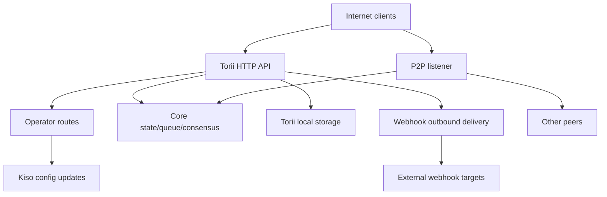

<!-- Auto-generated stub for Dzongkha (dz) translation. Replace this content with the full translation. -->

---
lang: dz
direction: ltr
source: iroha-threat-model.md
status: complete
generator: scripts/sync_docs_i18n.py
source_hash: 766928cf0dcbfe3513c728bcf0b9fa697a330e8000bc6944ab61e8fcd59751ad
source_last_modified: "2026-02-07T13:27:25.009145+00:00"
translation_last_reviewed: 2026-04-02
translator: machine-google-reviewed
---

# Iroha ཉེན་ཁའི་དཔེ་ཚད་ (རི་པོ་: `iroha`)

## འཛིན་སྐྱོང་གནད་བསྡུས།
མི་མང་ཡོངས་འབྲེལ་ལས་ བཀོལ་སྤྱོད་པའི་ལམ་ཚུ་ བསམ་ཞིབ་འབད་དེ་ འཐོབ་ཚུགསཔ་ཨིན་རུང་ ཞུ་བ་མིང་རྟགས་བརྒྱུད་དེ་ བདེན་བཤད་འབད་དགོཔ་དང་ མི་མང་ Torii མཐའ་མཚམས་ལུ་ ཝེབ་ཧུཀ་/མཉམ་སྦྲགས་ཚུ་ ལྕོགས་ཅན་བཟོ་སྟེ་ཡོད་མི་ ཡོངས་འབྲེལ་གྱི་ མི་མང་བཀག་ཆའི་བཀྲམ་སྤེལ་ནང་ ཉེན་ཁ་ཆེ་ཤོས་འདི་: operator-rom-playable complane to `/v1/configuration` དང་གཞན་བཀོལ་སྤྱོད་ལམ་ལུགས་ཚུ་) SSRF དང་ ཝེབ་ཧུག་བརྒྱུད་དེ་ ཕྱི་ཁར་ལོག་སྤྱོད་འབད་ནི་ དེ་ལས་ ཚད་གཞི་ཚད་གཞི་ཚུ་ ཆ་རྐྱེན་དང་འཁྲིལ་ཏེ་ བསྟར་སྤྱོད་འབད་སའི་ ཚོང་འབྲེལ་/འདྲི་དཔྱད་བརྒྱུད་དེ་ མཐོ་དྲགས་ཅན་གྱི་ DoS ཚུ་ཨིན། ད་རུང་ གང་རུང་ཅིག་ “mTLS required” ཟེར་མི་འདི་ `x-forwarded-client-cert` ཡོད་མི་ལུ་བརྟེན་པའི་ གནས་སྟངས་འདི་ Torii ཐད་ཀར་དུ་ ཕྱི་ཁར་ཐོན་པའི་སྐབས་ མགུ་སྐོར་རྐྱབ་ཚུགསཔ་ཨིན། བདེན་ཁུངས་: `crates/iroha_torii/src/lib.rs` (རའུ་ཊར་ + བར་མའི་མཉེན་ཆས་ + བཀོལ་སྤྱོད་པའི་ལམ་ཚུ་), `crates/iroha_torii/src/operator_auth.rs` (བཀོལ་སྤྱོད་པའི་བདེན་བཤད་ལྕོགས་ཅན་/ལྕོགས་མིན་ + `x-forwarded-client-cert` ཞིབ་དཔྱད་), `x-forwarded-client-cert` (ཕྱིར་འཐོན་ཨེཆ་ཊི་༠ཊི་པི་ཨེགསི་༨༠) ཚད་འཛིན་)།

## ཁྱབ་ཁོངས་དང་ཚོད་དཔག།ཁྱབ་ཁོངས་ནང་ (གཡོག་བཀོལ་དུས་ཚོད་ / ཐོན་སྐྱེད་ཁ་ཐོག་ཚུ་):
- Torii HTTP API སར་བར་དང་ བར་མའི་མཉེན་ཆས་ དེ་ཡང་ “བཀོལ་སྤྱོད་པ་” ལམ་ཚུ་ ཨེཔ་ཨེ་པི་ཨའི་ ཝེབ་ཧུཀ་ མཉམ་སྦྲགས་ ནང་དོན་ དེ་ལས་ རྒྱུན་ལམ་མཇུག་སྣོད་ཚུ་ཨིན།
- མཐུད་མཚམས་བུཊི་སི་ཊརཔ་དང་ཆ་ཤས་གློག་ཐག་ (Torii + P2P + གནས་སྟངས་/བང་རིམ་/རིམ་སྒྲིག་དུས་མཐུན་བཟོ་མི་): `crates/irohad/src/main.rs`
- P2P སྐྱེལ་འདྲེན་དང་ལག་འཇུ་ཁ་ཐོག: `crates/iroha_p2p/`
- རིམ་སྒྲིག་དབྱིབས་ཚུ་དང་སྔོན་སྒྲིག་ཚུ་ (དམིགས་བསལ་དུ་ Torii auth སྔོན་སྒྲིག་ཚུ་): `crates/iroha_config/src/parameters/{actual,defaults}.rs`
- མཁོ་སྤྲོད་འབད་མི་ལུ་གདོང་ལེན་འབད་མི་རིམ་སྒྲིག་དུས་མཐུན་ཌི་ཊི་ཨོ་ (`/v1/configuration` གིས་བསྒྱུར་བཅོས་འབད་ཚུགས་མི་འདི་): `crates/iroha_config/src/client_api.rs`
- བཀྲམ་སྤེལ་ཐུམ་སྒྲིལ་གཞི་བརྟེན་ཚུ་: `Dockerfile`, དང་ `defaults/` ནང་དཔེ་རིམ་སྒྲིག་ཚུ་ (ཐོན་སྐྱེད་ནང་བཙུགས་ཡོད་པའི་དཔེ་ལྡེ་མིག་ཚུ་ལག་ལེན་མ་འཐབ)།

ཁྱབ་ཁོངས་ལས་ཕྱི་ཁར་ (གསལ་ཏོག་ཏོ་སྦེ་ཞུ་བ་མ་འབད་བ་ཅིན་):
- CI ལཱ་གི་རྒྱུན་རིམ་དང་ རང་འགུལ་བཏོན་གཏང་ནི།: `.github/`, `ci/`, `scripts/`
- འགྲུལ་འཕྲིན་/མཁོ་སྤྲོད་པ་ཨེསི་ཌི་ཀེ་ཨེསི་དང་མཉེན་ཆས་ཚུ་: ཨའི་༡༨ཨེན་ཨའི་༠༠༠༠༠༠༠༠༩༣ཨེགསི་, ཨའི་༡༨ཨེན་ཨའི་༠༠༠༠༠༠༠༠༩༤ཨེགསི་, ཨའི་༡༨ཨེན་ཨའི་༠༠༠༠༠༠༠༠༩༥ཨེགསི་
- ཡིག་ཆ་རྐྱངམ་གཅིག་གི་རྒྱུ་ཆ།: `docs/`གསལ་ཏོག་ཏོ་གི་བསམ་ཚུལ་ཚུ་ (ཁྱོད་ཀྱི་གསལ་བཤད་ལུ་གཞི་བཞག་སྟེ་):
- Torii འདི་ ཡོངས་འབྲེལ་ནང་ གསལ་སྟོན་འབད་ཡོདཔ་དང་ བདེན་བཤད་མ་འབད་བའི་ མཁོ་མངགས་འབད་མི་ཚུ་གིས་ འཐོབ་ཚུགསཔ་ཨིན་ (མཐའ་མཚམས་ལ་ལོ་ཅིག་ལུ་ ད་ལྟོ་ཡང་ མིང་རྟགས་ཡང་ན་ བདེན་བཤད་གཞན་དགོཔ་འོང་།)
- བཀོལ་སྤྱོད་པའི་འགྲུལ་ལམ་ཚུ་ (`/v1/configuration`, `/v1/nexus/lifecycle`, དང་ བཀོལ་སྤྱོད་པ་-gated telemetry/profiling ལྕོགས་ཅན་བཟོ་བའི་སྐབས་) ཚུ་ མི་མང་ལུ་ལྷོད་ཚུགསཔ་སྦེ་ དམིགས་གཏད་བསྐྱེད་དེ་ཡོདཔ་ལས་ བཀོལ་སྤྱོད་པ་ཚད་འཛིན་འབད་མི་ སྒེར་གྱི་ལྡེ་མིག་ལས་ མིང་རྟགས་བརྒྱུད་དེ་ བདེན་བཤད་འབད་དགོ། སྒྲུབ་བྱེད་ (ད་ལྟོའི་གནས་སྟངས་): ཨའི་༡༨ཨེན་ཨའི་༠༠༠༠༠༠༩༩ཨེགསི་ (ཨའི་༡༨ཨེན་ཨའི་༠༠༠༠༠༠༡༠༠ཨེགསི་གིས་ ཨའི་༡༨ཨེན་ཨའི་༠༠༠༠༠༠༡༠༡ཨེགསི་འཇུག་སྤྱོད་འབདཝ་ཨིན་) ཨའི་༡༨ཨེན་ཨའི་༠༠༠༠༠༠༡༠༢ཨེགསི་ (ཨའི་༡༨ཨེན་ཨའི་༠༠༠༠༠༡༠༣ཨེགསི་ / ཨའི་༡༨ཨེན་ཨའི་༠༠༠༡༠༤ཨེགསི་)།
- བཀོལ་སྤྱོད་པའི་མིང་རྟགས་བདེན་དཔྱད་འདི་གིས་ རིམ་སྒྲིག་ནང་ བཀོལ་སྤྱོད་པའི་མི་མང་ལྡེ་མིག་ཚུ་གི་ མཐུད་མཚམས་-ས་གནས་ཀྱི་ཆོག་ཐམ་ཐོ་ཡིག་ཅིག་ལག་ལེན་འཐབ་དགོཔ་ཨིན་ (ད་ལྟོའི་རའུ་ཊར་ནང་ ལག་ལེན་འཐབ་ཡོད་པའི་བཀོལ་སྤྱོད་པའི་སྒོ་སྒྲིག་སྦེ་སྟོན་མི་བཏུབ།) ད་ལྟོའི་བཀོལ་སྤྱོད་སྒོ་སྒྲིག་གི་སྒྲུབ་བྱེད་: `crates/iroha_torii/src/operator_auth.rs` (`authorize_operator_endpoint`), དང་ ད་ལྟོ་ཡོད་པའི་ ཁྲིམས་མཐུན་ཞུ་བ་མིང་རྟགས་བཀོད་མི་ གྲོགས་རམ་འབད་མི་ (བརྡ་འཕྲིན་བཟོ་བསྐྲུན་): `crates/iroha_torii/src/app_auth.rs` (`canonical_request_message`)།
- Torii འདི་ བློ་གཏད་ཅན་གྱི་ནང་འཛུལ་གྱི་རྒྱབ་ལུ་ བཀྲམ་སྤེལ་འབད་དགོཔ་མེདཔ་ཨིན། དེ་འབདཝ་ལས་ `x-forwarded-client-cert` བཟུམ་གྱི་མགོ་ཡིག་ཚུ་ Torii ཐད་ཀར་དུ་གསལ་སྟོན་འབད་བའི་སྐབས་ གནོདཔ་བཀལ་མི་ཚད་འཛིན་འབད་མི་སྦེ་ བརྩི་དགོཔ་ཨིན། བདེན་དཔང་: `crates/iroha_torii/src/lib.rs` (`HEADER_MTLS_FORWARD`, `norito_rpc_mtls_present`) དང་ `crates/iroha_torii/src/operator_auth.rs` (`HEADER_MTLS_FORWARD`, `mtls_present`) བཅས་ཡིན།
- ཝེབ་ཧུཀ་དང་མཉམ་སྦྲགས་ཚུ་ མི་མང་ Torii མཐའ་མཚམས་གུ་ལྕོགས་ཅན་བཟོ་ཡོདཔ་ཨིན། བདེན་ཁུངས་: `crates/iroha_torii/src/lib.rs` (`/v1/webhooks` དང་ `/v1/zk/attachments` གི་དོན་ལུ་ལམ་ཚུ), `crates/iroha_torii/src/webhook.rs`, `crates/iroha_torii/src/zk_attachments.rs`.- བཀོལ་སྤྱོད་པ་གིས་ `torii.require_api_token = false` གཞི་སྒྲིག་ཡང་ན་བཞག་བཏུབ་ (སྔོན་སྒྲིག་འདི་ `false` ཨིན་)། བདེན་དཔང་: `crates/iroha_config/src/parameters/defaults.rs` (`torii::REQUIRE_API_TOKEN`)།
- `/transaction` དང་ `/query` ཚུ་ མི་མང་རིམ་སྒྲིག་ཅིག་གི་དོན་ལུ་ ལྷོད་ཚུགས་པའི་རེ་བ་ཡོདཔ་ཨིན། དྲན་འཛིན་: དེ་ཚུ་ཁ་སྐོང་སྦེ་ “Norito-RPC” བཤུད་བརྙན་གནས་རིམ་དང་ གདམ་ཁ་ཅན་གྱི་ “mTLS required” མགོ་ཡིག་ཡོད་མེད་བརྟག་དཔྱད་ཀྱི་ཐོག་ལས་ བཀག་ཆ་འབད་ཡོདཔ་ཨིན། བདེན་དཔང་: `crates/iroha_torii/src/lib.rs` (`ConnScheme::from_request`, `evaluate_norito_rpc_gate`) དང་ `crates/iroha_config/src/parameters/defaults.rs` (`torii::transport::norito_rpc::STAGE = "disabled"`) བཅས་ཡིན།

ཉེན་ཁའི་གནས་རིམ་འདི་ དངོས་པོའི་ཐོག་ལས་ འགྱུར་བཅོས་འབད་ཚུགས་པའི་ དྲི་བ་ཁ་ཕྱེ།
- བཀོལ་སྤྱོད་པ་མི་མང་ལྡེ་མིག་ཚུ་ག་ཏེ་རིམ་སྒྲིག་འབད་ཡོདཔ་ཨིན་ན་ (རིམ་སྒྲིག་ལྡེ་མིག་/རྩ་སྒྲིག་ག་ཅི་ཨིན་ན) དང་ལྡེ་མིག་ཚུ་ངོས་འཛིན་/བསྒྱིར་ཡོདཔ་ཨིན་ (ལྡེ་མིག་ཨའི་ཌི་ ཤུགས་ལྡན་ལྡེ་མིག་སྣ་མང་ ཆ་མེད་གཏང་ཡོདཔ་)?
- བཀོལ་སྤྱོད་པ་གིས་ མིང་རྟགས་བཀོད་མི་འཕྲིན་དོན་རྩ་སྒྲིག་དང་ བསྐྱར་གཏང་ཉེན་སྲུང་ (དུས་ཚོད་བརྡ་མཚོན་/ནོནསི་/གྱངས་ཁ་ + སར་བར་གྱི་ཕྱོགས་བསྐྱར་གཏང་འདྲ་མཛོད་) ངོ་མ་ག་ཅི་ཨིན་ན་དང་ ཆུ་ཚོད་-སི་ཀིའུ་སྲིད་བྱུས་ག་ཅི་ ངོས་ལེན་འབད་ཚུགསཔ་ཨིན་ན། ད་ལྟོ་ཡོད་པའི་ ཀེ་ནོ་ནིཀ་ཞུ་བ་གྲོགས་རམ་འབད་མི་ལུ་ གསརཔ་མེད་པའི་སྒྲུབ་བྱེད་: `crates/iroha_torii/src/app_auth.rs` (`canonical_request_message`).
- མིང་མེད་ཝེབ་ཧུཀ་ཚུ་གི་དོན་ལུ་ Torii གིས་ གང་བྱུང་འགྲོ་ཡུལ་ཚུ་ གནང་བ་བྱིན་ནི་གི་རེ་བ་ཡོདཔ་ཨིན་ན་ ཡང་ན་ ཨེསི་ཨེསི་ཨར་ཨེཕ་འགྲོ་ཡུལ་སྲིད་བྱུས་ཅིག་ བསྟར་སྤྱོད་འབད་དགོཔ་ཨིན་ན་ (RFC1918/localhost/link-local/metadata བཀག་ཆ་འབད་དེ་ གདམ་ཁ་ཅན་སྦེ་ HTTPS དགོཔ་ཨིན་)?
- ཁྱོད་ཀྱི་བཟོ་བསྐྲུན་ནང་ལུ་ Torii ཁྱད་རྣམ་ག་འདི་ལྕོགས་ཅན་བཟོ་ཡོདཔ་ཨིན་ན? བདེན་དཔང་: `crates/iroha_torii/Cargo.toml` (`[features]`)།

## རིམ་ལུགས་དཔེ་ཚད།### གཞི་རིམ་ཆ་ཤས།
- **ཨིན་ཊར་ནེཊི་མགྲོན་པོ་** (དངུལ་ཁུག་ ཟུར་ཐོ་ འཚོལ་ཞིབ་པ་ བོཊི་ཚུ་): HTTP/Norito ཞུ་བ་ཚུ་གཏང་ཞིནམ་ལས་ WS/SSE མཐུད་ལམ་ཚུ་ཁ་ཕྱེ།
- **Torii (HTTP API)**: སྔོན་སྒྲིག་བདེན་བཤད་ཀྱི་སྒོ་སྒྲིག་དང་ གདམ་ཁ་ཅན་གྱི་ཨེ་པི་ཨའི་ཊོ་ཀེན་བཀག་དམ་ ཨེ་པི་ཨའི་ཐོན་རིམ་གྲོས་བསྟུན་ ཐག་རིང་ཁ་བྱང་བཙུགས་ནི་ དེ་ལས་ མེ་ཊིགསི་ཚུ་གི་དོན་ལུ་ བར་མའི་མཉེན་ཆས་དང་གཅིག་ཁར་ ཨེགསི་ཨུམ་རའུ་ཊར། བདེན་དཔང་: `crates/iroha_torii/src/lib.rs` (`create_api_router`, `enforce_preauth`, `enforce_api_token`, `enforce_api_version`, `inject_remote_addr_header`)།
- **བཀོལ་སྤྱོད་པ་/བདེན་བཤད་ཚད་འཛིན་ཁོད་སྙོམས་ (ད་ལྟོ) དང་འདོད་པའི་གནས་སྟངས་**: བཀོལ་སྤྱོད་པའི་ལམ་ཚུ་ད་ལྟོ་ `operator_auth::enforce_operator_auth` (WebAuthn/tokens; རིམ་སྒྲིག་གིས་ ཕན་ནུས་ཅན་སྦེ་ལྕོགས་མིན་བཟོ་ཚུགས།) གིས་སྲུང་སྐྱོབ་འབད་ཡོདཔ་ཨིན། ཁྲིམས་མཐུན་གྱི་ཞུ་བ་འཕྲིན་དོན་གྲོགས་རམ་འབད་མི་འདི་ཡོདཔ་ལས་ འཕྲིན་དོན་བཟོ་བསྐྲུན་གྱི་དོན་ལུ་ ལོག་སྟེ་ལག་ལེན་འཐབ་ཚུགས་ནི་ཨིན་རུང་ བདེན་དཔྱད་འདི་ རིམ་སྒྲིག་ལྡེ་མིག་ཚུ་ལག་ལེན་འཐབ་ནི་ལུ་ མཐུན་སྒྲིག་འབད་དགོཔ་ཨིན། ༼འཛམ་གླིང་མངའ་སྡེའི་རྩིས་ཐོ་ཚུ་མེན།༽ བདེན་ཁུངས་: `crates/iroha_torii/src/lib.rs` (`add_core_info_routes` གིས་ `operator_layer` ལག་ལེན་འཐབ་ཨིན།) `crates/iroha_torii/src/operator_auth.rs` (`authorize_operator_endpoint`), `crates/iroha_torii/src/app_auth.rs` (I00NI5000000)།- **Core node components (in-process)**: ཚོང་འབྲེལ་གྲལ་ཐིག་ གནས་སྟངས་/WSV མོས་མཐུན་ (Sumeragi) སྡེབ་ཚན་གསོག་འཇོག་ (Kura) རིམ་སྒྲིག་དུས་མཐུན་འཁྲབ་རྩེདཔ་ (Kiso) ལ་སོགས་པ་ཚུ་ Torii ནང་ལུ་སྤྲོད་ཡོདཔ་ཨིན། བདེན་དཔང་: `crates/irohad/src/main.rs` (`Torii::new_with_handle(...)` གིས་ `queue`, `state`, `kura`, `kura`, `kiso`, `kiso` འགོ་བཙུགས་ཏེ་, Sumeragi ཨིན། `torii.start(...)`).
- **P2P ཡོངས་འབྲེལ་**: གསང་བཟོ་འབད་ཡོད་པའི་ གཞི་སྒྲིག་འབད་ཡོད་པའི་ མཉམ་རོགས་སྐྱེལ་འདྲེན་དང་ ལགཔ་འཐུད། གདམ་ཁ་ཅན་ TLS-over-TCP ཡོདཔ་ཨིན་ དེ་འབདཝ་ད་ ལག་ཁྱེར་བདེན་དཔྱད་ལུ་ བསམ་བཞིན་དུ་ གནང་བ་བྱིནམ་ཨིན། བདེན་ཁུངས་: `crates/iroha_p2p/src/lib.rs` (དབྱེ་བ་མིང་གཞན་`NetworkHandle<..., X25519Sha256, ChaCha20Poly1305>`), `crates/iroha_p2p/src/transport.rs` (`p2p_tls` ཚད་གཞི་ `NoCertificateVerification` དང་གཅིག་ཁར་)།
- **Torii ས་གནས་ཀྱི་བརྟན་བཞུགས་**: མཉམ་སྦྲགས་/ཝེབ་ཧུཀ་/བང་རིམ་ཚུ་གི་དོན་ལུ་ `./storage/torii` སྔོན་སྒྲིག་གཞི་རྟེན་ཌི་ཨར་. བདེན་ཁུངས་: `crates/iroha_config/src/parameters/defaults.rs` (`torii::data_dir()`), `crates/iroha_torii/src/webhook.rs` (ཡུན་གནས་ `webhooks.json`), `crates/iroha_torii/src/zk_attachments.rs` (`./storage/torii/zk_attachments/` འོག་ལུ་གསོག་འཇོག་འབད་ཡོདཔ།)
- **ཕྱིར་ཐོན་ཝེབ་ཧུག་དམིགས་གཏད་**: Torii གིས་ བྱུང་ལས་ཚུ་ གང་བྱུང་ `http://` ཡུ་ཨར་ཨེལ་ཚུ་ལུ་ བཀྲམ་སྤེལ་འབད་ཚུགས། བདེན་དཔང་: `crates/iroha_torii/src/webhook.rs` (`http_post_plain`, `http_post_https`, `ws_send`)།### གནད་སྡུད་རྒྱུན་འབབ་དང་བློ་གཏད་མཐའ་མཚམས།
- ཡོངས་འབྲེལ་མཉེན་ཆས་ → Torii HTTP API
  - གནད་སྡུད་: Norito གཉིས་ལྡན་ (`SignedTransaction`, `SignedQuery`), ཇེ་ཨེསི་ཨོ་ཨེན་ཌི་ཊི་ཨོ་ཨེསི་ (ཨེཔ་ཨེ་པི་ཨའི་), ཌབ་ལུ་ཨེསི་/ཨེསི་ཨེསི་ཨི་མཁོ་སྒྲུབ་ཚུ་, མགོ་ཡིག་ཚུ་ (`x-api-token` ཚུ་རྩིས་ཏེ་)།
  - རྒྱུན་ལམ་: ཨེཆ་ཊི་ཊི་པི་/༡.༡ + ཝེབ་སོ་ཀེཊི་ + ཨེསི་ཨེསི་ཨི་ (axum)།
  - ངེས་གཏན་ཚུ་: གདམ་ཁ་ཅན་གྱི་ཨེ་པི་ཨའི་ཊོ་ཀེན་ (`torii.require_api_token`), སྔོན་བདེན་བཤད་མཐུད་ལམ་/གོང་ཚད་གེ་ཊིང་, ཨེ་པི་ཨའི་ཐོན་རིམ་གྲོས་བསྟུན།; འཛིན་སྐྱོང་པ་མང་ཤོས་ཅིག་གིས་ གནས་སྟངས་དང་འཁྲིལ་ཏེ་ མཐའ་མཚམས་རེ་ལུ་ཚད་འཛིན་འབད་ནིའི་ཚད་གཞི་འཇུག་སྤྱོད་འབདཝ་ཨིན་ (`enforce=false` འབད་བའི་སྐབས་ བརྒལ་ཚུགས།) བདེན་དཔང་: `crates/iroha_torii/src/lib.rs` (`enforce_preauth`, `validate_api_token`, `handler_post_transaction`, `handler_signed_query`), `crates/iroha_torii/src/limits.rs` (Sumeragi)།
  - བདེན་དཔྱད་: མཐའ་མཚམས་ལ་ལོ་ཅིག་གུ་གཟུགས་ཚད་ (དཔེར་ན་ ཚོང་འབྲེལ་) Norito ཌི་ཀོཌིང་ གློག་རིམ་མཐའ་མཚམས་ལ་ལོ་ཅིག་གི་དོན་ལུ་ མཚན་རྟགས་བཀོད་ནིའི་ཞུ་བ་ (ཀེ་ནོ་ནིཀ་ཞུ་བ་མགོ་ཡིག་)། བདེན་ཁུངས་: `crates/iroha_torii/src/lib.rs` (`add_transaction_routes` གིས་ `DefaultBodyLimit::max(...)` ལག་ལེན་འཐབ་ཨིན།) `crates/iroha_torii/src/app_auth.rs` (`verify_canonical_request`)།- ཡོངས་འབྲེལ་མཉེན་ཆས་ → “བཀོལ་སྤྱོད་པ་” ལམ་ཚུ་ (Torii)
  - གནད་སྡུད་: རིམ་སྒྲིག་དུས་མཐུན་བཟོ་མི་ཚུ་ (`ConfigUpdateDTO`) ལམ་གྱི་མི་ཚེ་འཁོར་རིམ་འཆར་གཞི་ཚུ་ ཊེ་ལི་མི་ཊི་/རྐྱེན་སེལ་/གནས་ཚད་/མེ་ཊིགསི་ (ལྕོགས་ཅན་བཟོ་བའི་སྐབས་)།
  - རྒྱུན་ལམ་: ཨེཆ་ཊི་ཊི་པི།
  - ངེས་གཏན་ཚུ་: ད་ལྟོའི་རི་པོ་གཱེཊི་འདི་ཚུ་ `operator_auth::enforce_operator_auth` བར་མའི་མཉེན་ཆས་དང་གཅིག་ཁར་ ཕན་ནུས་ཅན་སྦེ་ `torii.operator_auth.enabled=false` འབད་བའི་སྐབས་ ནོ་ཨོ་པི་ཨིན། ཁྱོད་ཀྱི་རེ་འདོད་བསྐྱེད་མི་གནས་སྟངས་འདི་ རིམ་སྒྲིག་ལས་ བཀོལ་སྤྱོད་པ་མི་མང་ལྡེ་མིག་ཚུ་ལག་ལེན་འཐབ་སྟེ་ མིང་རྟགས་གཞི་བཞག་པའི་བདེན་བཤད་ཨིན་ དེ་ཡང་ མཚམས་འདི་ནང་ ལག་ལེན་འཐབ་དགོཔ་དང་ བསྟར་སྤྱོད་འབད་དགོཔ་ཨིན། བདེན་ཁུངས་: `crates/iroha_torii/src/lib.rs` (`add_core_info_routes` འདི་ `operator_layer` འཇུག་སྤྱོད་འབདཝ་ཨིན་), `crates/iroha_torii/src/operator_auth.rs` (`authorize_operator_endpoint`, `mtls_present`) ཨིན།
  - བདེན་དཔྱད་: མང་ཤོས་རང་ ཌི་ཊི་ཨོ་དབྱེ་དཔྱད་འབད་ནི། `handle_post_configuration` རང་སོའི་ནང་ལུ་ གསང་ཡིག་གི་དབང་ཚད་མེདཔ་ཨིན་ (དེ་གིས་ `kiso.update_with_dto` ལུ་སྐུ་ཚབ་འབདཝ་ཨིན།) བདེན་དཔང་: `crates/iroha_torii/src/routing.rs` (`handle_post_configuration`)།

- Torii → ཀོར་ཀིའུ་/གནས་སྟངས་/མོས་མཐུན་ (བྱ་རིམ་ནང་)
  - གནད་སྡུད་: ཚོང་འབྲེལ་གྱི་བཙུགས་ནི་དང་ འདྲི་དཔྱད་ལག་ལེན་འཐབ་ནི་ མངའ་སྡེ་ལྷག་ནི་/འབྲི་ནི་ མོས་མཐུན་གྱི་ བརྡ་འཕྲིན་ཚད་འཇལ་འདྲི་དཔྱད་ཚུ་ཨིན།
  - རྒྱུན་ལམ་: བྱ་རིམ་ནང་ རསཊི་འབོད་བརྡ་ཚུ་ (བགོ་བཤའ་རྐྱབ་ཡོད་པའི་ `Arc` ལག་ལེན་འཐབ་མི་ཚུ་)།
  - འགན་ལེན་ཚུ་: བློ་གཏད་ཅན་གྱི་མཚམས་ བསམ་ཞིབ་འབད་ཡོདཔ། ཉེན་སྲུང་འདི་ Torii གིས་ ཐོབ་དབང་ཅན་གྱི་བཀོལ་སྤྱོད་ཚུ་ འབོད་བརྡ་མ་འབད་བའི་ཧེ་མ་ ཞུ་བ་ཚུ་ བདེན་བཤད་/དབང་སྤྲོད་འབད་ནི་ལུ་ རག་ལསཔ་ཨིན། བདེན་ཁུངས་: `crates/irohad/src/main.rs` (`Torii::new_with_handle(...)` གློག་ཐག་) དང་ Torii འཛིན་སྐྱོང་པ་ཚུ་གིས་ `routing::handle_*` འབོད་བརྡ་འབདཝ་ཨིན།- Torii → ཀི་སོ་ (རིམ་སྒྲིག་དུས་མཐུན་བཟོ་མི་)
  - གནད་སྡུད་: `ConfigUpdateDTO` གིས་ དྲན་ཐོ་བཀོད་ནི་དང་ P2P ACL ཡོངས་འབྲེལ་/སྐྱེལ་འདྲེན་སྒྲིག་སྟངས་ སོ་ར་ནེཊི་ལག་འཇུ་ལ་སོགས་པ་ཚུ་ ལེགས་བཅོས་འབད་ཚུགས།
  - རྒྱུན་ལམ་: ལས་སྦྱོར་ནང་འཕྲིན་དོན་/ལག་ལེན་འཐབ་མི།
  - ངེས་གཏན་ཚུ་: གནང་བ་འདི་ Torii མཚམས་ལུ་རེ་བ་བསྐྱེདཔ་ཨིན། update DTO རང་ཉིད་ལྕོགས་གྲུབ་ཅན་ཡིན། སྒྲུབ་བྱེད་: `crates/iroha_config/src/client_api.rs` (`ConfigUpdateDTO` ས་སྒོ་ཚུ་ནང་ `network_acl`, `transport.norito_rpc`, `soranet_handshake`, ལ་སོགས་པ་ཚུ་ཚུདཔ་ཨིན།)།

- Torii → ས་གནས་ཀྱི་ཌིཀསི་ (`./storage/torii`)
  - གནད་སྡུད་: ཝེབ་ཧུག་ཐོ་བཀོད་དང་ བང་རིམ་ནང་ བཀྲམ་སྤེལ་འབད་ནི། མཐུད་མཚམས་དང་ གཙང་སྦྲ་བཟོ་མི་ མེ་ཊ་ཌེ་ཊ། GC/TTL སྤྱོད་ལམ།
  - རྒྱུན་ལམ་: ཡིག་སྣོད་རིམ་ལུགས།
  - ངེས་གཏན་ཚུ་: ཉེ་གནས་ཨོ་ཨེསི་གནང་བ་ཚུ་ (ཌོག་ཊར་ཡིག་སྣོད་ནང་ དོས་འདི་རྩ་བ་མེན་པ་སྦེ་གཡོག་བཀོལཝ་ཨིན།) logical isolation by “tenant” གིས་ API བརྡ་མཚོན་ཡང་ན་ ཐག་རིང་ IP མགོ་ཡིག་འདི་ བར་མའི་མཉེན་ཆས་ཀྱིས་བཙུགས་མི་ལུ་གཞི་བཞག་སྟེ་ཨིན། བདེན་དཔང་: `Dockerfile` (`USER iroha`), `crates/iroha_torii/src/lib.rs` (`inject_remote_addr_header`, `zk_attachments_tenant`)།

- Torii → ཝེབ་ཧུཀ་དམིགས་གཏད་ཚུ་ (ཕྱིར་ཐོན།)
  - གནད་སྡུད་: བྱུང་ལས་པེ་ལོཌི་ཚུ་ + མིང་རྟགས་མགོ་ཡིག།
  - རྒྱུན་ལམ་: `http://` གི་དོན་ལུ་ ཊི་སི་པི་ ཨེཆ་ཊི་ཊི་པི་ མཁོ་སྤྲོད་པ་ སྔོན། ལྕོགས་ཅན་བཟོ་བའི་སྐབས་ `https://` གི་དོན་ལུ་ `hyper+rustls` གདམ་ཁ་ཅན་; གདམ་ཁ་ཅན་ WS/WSS ལྕོགས་ཅན་བཟོ་བའི་སྐབས་ལུ།
  - ངེས་གཏན་: དུས་ཚོད་རྫོགས་/ལོག་འབད་རྩོལ་བསྐྱེད། གསང་ཡིག་ནང་མཐོང་ཚུགས་པའི་ འགྲོ་ཡུལ་ཆོག་ཐམ་ཐོ་ཡིག་མེད། ཝེབ་ཧུཀ་སི་ཨར་ཡུ་ཌི་ཁ་ཕྱེ་སྟེ་ཡོད་པ་ཅིན་ ཡུ་ཨར་ཨེལ་འདི་ གནོདཔ་བཀལ་མི་གིས་ ཤན་ཞུགས་འབདཝ་ཨིན། བདེན་དཔང་: `crates/iroha_torii/src/webhook.rs` (`handle_create_webhook`, `http_post_plain/http_post`)།- P2P མཉམ་རོགས་ (བློ་གཏད་མེད་པའི་དྲ་རྒྱ་) → P2P སྐྱེལ་འདྲེན་/ལགཔ་འཐུད།
  - གནད་སྡུད་: ལགཔ་འཐུད་པའི་སྔོན་བརྡ་/མེ་ཊ་གནད་སྡུད་ གཞི་སྒྲིག་འབད་ཡོད་པའི་གསང་བཟོས་འཕྲིན་དོན་ མོས་མཐུན་འཕྲིན་དོན་ཚུ།
  - རྒྱུན་ལམ་: P2P སྐྱེལ་འདྲེན་ (TCP/QUIC/etc, ཁྱད་རྣམ་ལུ་བརྟེན་པ) གསང་བཟོ་འབད་ཡོད་པའི་ འབབ་ཁུངས་ཚུ། གདམ་ཁ་ཅན་གྱི་ TLS-over-TCP འདི་ ལག་ཁྱེར་བདེན་དཔྱད་ལུ་ གསལ་ཏོག་ཏོ་སྦེ་ གནང་བ་ཡོདཔ་ཨིན།
  - ངེས་གཏན་ཚུ་: གློག་རིམ་བང་རིམ་ནང་ གསང་བཟོ་དང་ མིང་རྟགས་བཀོད་ཡོད་པའི་ལགཔ་འཐུད། transport-layer ཊི་ཨེལ་ཨེསི་གིས་ ལག་ཁྱེར་གྱིས་བདེན་བཤད་མི་འབད། བདེན་ཁུངས་: `crates/iroha_p2p/src/lib.rs` (གསང་བཟོའི་དབྱེ་བ་), `crates/iroha_p2p/src/transport.rs` (`NoCertificateVerification` བསམ་བཀོད་དང་ལག་བསྟར།)།

#### རི་མོ།

## རྒྱུ་ནོར་དང་བདེ་འཇགས་དམིགས་ཡུལ།| རྒྱུ་ནོར། | ག་ཅི་འབད་གལ་ཆེཝ་སྨོ | ཉེན་སྲུང་དམིགས་ཡུལ་ (C/I/A) |
|---|---||---|
| རིམ་སྒྲིག་གནས་སྟངས་ / WSV / བཀག་ཆ། | བདེན་ཁུངས་འཐུས་ཤོར་འདི་ མོས་མཐུན་འཐུས་ཤོར་ལུ་འགྱུརཝ་ཨིན། ཐོབ་ཚུགས་པའི་འཐུས་ཤོར་ཚུ་གིས་ རིམ་སྒྲིག་འདི་ བཀག་བཞགཔ་ཨིན། | I/A |
| མོས་མཐུན་འཚོ་བ་ (Sumeragi) | མི་མང་བཀག་ཆ་གནས་གོང་འདི་ ཡུན་བརྟན་བཀག་ཆ་ཐོན་སྐྱེད་ལུ་རག་ལསཔ་ཨིན། | A |
| མཐུད་མཚམས་སྒེར་གྱི་ལྡེ་མིག་ཚུ་ (མཉམ་རོགས་ངོ་རྟགས་ མིང་རྟགས་བཀོད་ནིའི་ལྡེ་མིག་ཚུ་) | ལྡེ་མིག་བདེ་སྒྲིག་འདི་གིས་ ངོ་རྟགས་ལེན་ནི་དང་ མིང་རྟགས་ལོག་སྤྱོད་འབད་ནི་ ཡང་ན་ ཡོངས་འབྲེལ་བར་བཅད་འབད་ནི་ཚུ་ ལྕོགས་ཅན་བཟོཝ་ཨིན། | C/I |
| གཡོག་བཀོལ་དུས་ཚོད་རིམ་སྒྲིག་ (ཀི་སོ་-དུས་མཐུན་བཟོ་ཡོདཔ་) | ཡོངས་འབྲེལ་ཨེ་སི་ཨེལ་ཚུ་དང་སྐྱེལ་འདྲེན་སྒྲིག་སྟངས་ཚུ་ཚད་འཛིན་འབདཝ་ཨིན། ལོག་སྤྱོད་འབད་མི་འདི་གིས་ ཉེན་སྲུང་ཚུ་ ལྕོགས་མིན་བཟོ་ཚུགས་ནི་དང་ ཡང་ན་ གནོདཔ་ཅན་གྱི་ཆ་རོགས་ཚུ་ ངོས་ལེན་འབད་ཚུགས། | I |
| ཚོང་འབྲེལ་གྲལ་ཐིག་ / mempool | ཆུ་རུད་ཀྱིས་ མོས་མཐུན་ལུ་ལྟོཝ་བཀྱེས་ཏེ་ CPU/memory མེདཔ་བཏང་ཚུགས། | A |
| Torii བརྟན་བརླིང་ (`./storage/torii`) | ཌིཀསི་ཐང་ཆད་མི་འདི་གིས་ མཐུད་མཚམས་འདི་བརྡབ་གཏང་ཚུགས། གསོག་འཇོག་འབད་ཡོད་པའི་གནས་སྡུད་འདི་གིས་ མར་འབབ་ལས་སྦྱོར་ལུ་ ཤན་ཞུགས་འབད་འོང་། | A (དང་སྐབས་འགར་ C/I) |
| ཕྱིར་ཐོན་ཝེབ་ཧུག་རྒྱུ་ལམ། | ཨེསི་ཨེསི་ཨར་ཨེཕ་གི་དོན་ལུ་ལོག་སྤྱོད་འབད་བཏུབ། ནང་འཁོད་ཡོངས་འབྲེལ་ལས་ གནད་སྡུད་ཕྱིར་འཐེན་འབད་ནི་ ཡང་ན་ བློ་གཏད་ཅན་གྱི་ཕྱིར་ཐོན་ཨའི་པི་ལས་ པར་ལེན་འབད་ནི་ | C/I/A |
| ཊེ་ལི་མི་ཊི་/མེཊིགསི་/རྐྱེན་སེལ་གནས་སྡུད་ | དམིགས་གཏད་ཅན་གྱི་གནོདཔ་བཀལ་ནིའི་དོན་ལུ་ ཡོངས་འབྲེལ་ཊོ་པོ་ལོ་ཇི་དང་ ལག་ལེན་གནས་སྟངས་ཚུ་ ལྐོག་ཤོར་འབད་ཚུགས། | C |

## འཇབ་རྒོལ་བའི་དཔེ་ཚད།### ནུས་པ།
- ཐག་རིང་ བདེན་བཤད་མ་འབད་བའི་ ཡོངས་འབྲེལ་འཇབ་རྒོལ་པ་གིས་ གང་འདོད་ཀྱི་ ཨེཆ་ཊི་ཊི་པི་ ཞུ་བ་ཚུ་གཏང་ཚུགས་ནི་དང་ ཡུན་རིངམོ་སྦེ་ ཌབ་ལུ་ཨེསི་/ཨེསི་ཨེསི་ཨི་མཐུད་ལམ་ཚུ་ བཀག་ཚུགས་ནི་ དེ་ལས་ ལོག་སྟེ་རྩེད་ཚུགས་ནི་ཡང་ན་ པེ་ལོཌ་ཚུ་ (བོཊི་ནེཊི་) བཀྲམ་སྤེལ་འབད་ཚུགས།
- ཕྱོགས་གང་རུང་གིས་ ལྡེ་མིག་ཚུ་བཟོ་བཏོན་འབད་དེ་ མིང་རྟགས་བཀོད་ཡོད་པའི་ཚོང་འབྲེལ་/འདྲི་དཔྱད་ཚུ་ (མི་མང་བཀག་ཆ་) བཙུགས་ཚུགས།
- གནོདཔ་བཀལ་མི་/བདེ་སྒྲིག་བཟོ་ཡོད་པའི་མཉམ་རོགས་ཀྱིས་ P2P ལུ་མཐུད་ཚུགས་ནི་དང་ ཆོག་ཐམ་ཡོད་པའི་བཀག་ཆ་ཚུ་གི་ནང་འཁོད་ལུ་ མཐུན་སྒྲིག་ལོག་སྤྱོད་དང་ ཆུ་རུད་ ཡང་ན་ ལགཔ་འཐུད་ནི་གཡོ་བཅོས་འབད་ནི་གི་དཔའ་བཅམ་ཚུགས།
- གལ་སྲིད་ ཝེབ་ཧུཀ་སི་ཨར་ཡུ་ཌི་འདི་ ཕྱི་ཁར་ཐོན་པ་ཅིན་ གནོདཔ་བཀལ་མི་གིས་ གནོདཔ་བཀལ་མི་གིས་ ཚད་འཛིན་འབད་མི་ ཝེབ་ཧུཀ་ཡུ་ཨར་ཨེལ་ཚུ་ ཐོ་བཀོད་འབད་དེ་ ཕྱི་ཁར་འབོད་བརྡ་ཚུ་ ཐོབ་ཚུགས།

### ནུས་པ་མིན་ཚུ།
- ཐད་ཀར་གྱི་ཉེ་གནས་ཡིག་སྣོད་རིམ་ལུགས་འཛུལ་སྤྱོད་མེདཔ་ལས་ ཕྱིར་བཏོན་འབད་ཡོད་པའི་མཇུག་སྣོད་ཡང་ན་ རིམ་སྒྲིག་འཛོལ་བ་འབད་ཡོད་པའི་སྐད་ཤུགས་གནང་བ་ཚུ་མེདཔ་ཨིན།
- ལྡེ་མིག་བདེ་སྒྲིག་མེད་པར་ ད་ལྟོ་ཡོད་པའི་པི་ཡར་/བཀོལ་སྤྱོད་ལྡེ་མིག་ཚུ་གི་དོན་ལུ་ མིང་རྟགས་རྫུས་མ་བཟོ་ནི་གི་ལྕོགས་གྲུབ་མེད།
- སྤྱིར་བཏང་གི་གནས་སྟངས་ནང་ དེང་སང་གི་གསང་ཡིག་ (X25519, ChaCha20-Poly1305, Ed25519) ཚུ་ བརྡལ་བཤིག་གཏང་ནི་གི་ ལྕོགས་གྲུབ་མེདཔ་སྦེ་ མནོ་བསམ་གཏང་ཡོདཔ་ཨིན།

## འཛུལ་སྒོའི་ས་ཚིགས་དང་འཇབ་རྒོལ་གྱི་ཕྱི་ངོས།| ཁ་ངོས། | ག་དེ་སྦེ་ལྷོད་ཡོདཔ་སྨོ | བློ་གཏད་མཚམས་ | དྲན་ཐོ། | སྒྲུབ་བྱེད་ (རེ་པོ་ལམ་ / རྟགས་) |
|---|---|---|---|---|
| `POST /transaction` | ཡོངས་འབྲེལ་ཨེཆ་ཊི་ཊི་པི་ | ཡོངས་འབྲེལ་ → Torii | Norito གཉིས་ལྡན་མིང་རྟགས་བཀོད་པའི་ཚོང་འབྲེལ་; ཚད་གཞི་ཚད་འཛིན་འདི་གནས་སྟངས་ཅན་ཨིན་ (`enforce` རྫུན་མ་འོང་) | `crates/iroha_torii/src/lib.rs` (`handler_post_transaction`, `ConnScheme::from_request`) |
| `POST /query` | ཡོངས་འབྲེལ་ཨེཆ་ཊི་ཊི་པི་ | ཡོངས་འབྲེལ་ → Torii | Norito གཉིས་ལྡན་མིང་རྟགས་བཀོད་ཡོད་པའི་འདྲི་དཔྱད་; ཚད་གཞི་ཚད་འཛིན་འདི་གནས་སྟངས་ཅན་ཨིན་ (`enforce` རྫུན་མ་འོང་) | `crates/iroha_torii/src/lib.rs` (`handler_signed_query`) |
| Norito-RPC སྒོ། | ཨིན་ཊར་ནེཊི་ཨེཆ་ཊི་ཊི་པི་མགོ་ཡིག་ཚུ། | ཡོངས་འབྲེལ་ → Torii | མགོ་ཡིག་གནས་རིམ་བརྒྱུད་དེ་ བཤུད་བརྙན་གནས་རིམ་ + གདམ་ཁ་ “mTLS required”; ཀེ་ན་རི་གིས་ `x-api-token` ལག་ལེན་འཐབ་ཨིན། | `crates/iroha_torii/src/lib.rs` (`evaluate_norito_rpc_gate`, `HEADER_MTLS_FORWARD`) |
| `POST/GET/DELETE /v1/webhooks...` | ཨིན་ཊར་ནེཊི་ཨེཆ་ཊི་ཊི་པི་ (app API) | ཡོངས་འབྲེལ་ → Torii → ཕྱིར་ཐོན། | བཟོ་བཀོད་ཀྱི་ཐོག་ལས་མིང་མེད་པ།; webhook CRUD གིས་ གང་བྱུང་ཡུ་ཨར་ཨེལ་ཚུ་ལུ་ ཕྱིར་འཐོན་སྤྲོད་ལེན་ལྕོགས་ཅན་བཟོཝ་ཨིན། SSRF ཉེན་ཁ་ | `crates/iroha_torii/src/lib.rs` (`handler_webhooks_*`), `crates/iroha_torii/src/webhook.rs` (`http_post`) |
| `POST/GET /v1/zk/attachments...` | ཨིན་ཊར་ནེཊི་ཨེཆ་ཊི་ཊི་པི་ (app API) | ཡོངས་འབྲེལ་ → Torii → ཌིསིཀ | བཟོ་བཀོད་ཀྱི་ཐོག་ལས་མིང་མེད་པ།; attachment sanitizer + བསྡམ་བཞག་ + བརྟན་བཞུགས་; ཌིཀསི་/སི་པི་ཡུ་ ཐང་ཆད་པའི་ཁ་ཐོག་ (ལྕོགས་ཅན་བཟོ་ཡོད་པ་ཅིན་ གླ་ཁར་ལེན་མི་འདི་ ཨེ་པི་ཨའི་-ཊོ་ཀེན་ཨིན་ དེ་མེན་པ་ཅིན་ བཙུགས་ཡོད་པའི་མགོ་ཡིག་བརྒྱུད་དེ་ ཐག་རིང་ཨའི་པི་ཨིན་) | `crates/iroha_torii/src/lib.rs` (`handler_zk_attachments_*`, `zk_attachments_tenant`), `crates/iroha_torii/src/zk_attachments.rs` || `GET /v1/content/{bundle}/{path...}` | ཡོངས་འབྲེལ་ཨེཆ་ཊི་ཊི་པི་ | ཡོངས་འབྲེལ་ → Torii → གནས་སྟངས་/གསོག་འཇོག་ | auth ཐབས་ལམ་ཚུ་ལུ་རྒྱབ་སྐྱོར་འབདཝ་ཨིན་ + PoW + Range; egress ཚད་འཛིན་པ། | `crates/iroha_torii/src/content.rs` (`handle_get_content`, `enforce_pow`, `enforce_auth`) |
| Streaming: ཨའི་༡༨ཨེན་ཨའི་༠༠༠༠༠༠༢༦༩ཨེགསི་, ཨའི་༡༨ཨེན་ཨའི་༠༠༠༠༠༠༢༧༠ཨེགསི་ (ཌབ་ལུ་ཨེསི་), ཨའི་༡༨ཨེན་ཨའི་༠༠༠༠༠༠༢༧༡ཨེགསི་ (ཌབ་ལུ་ཨེསི་) | ཡོངས་འབྲེལ་ | ཡོངས་འབྲེལ་ → Torii | ཡུན་རིང་གི་འབྲེལ་བ། DoS ཁ་ཐོག་ | `crates/iroha_torii/src/lib.rs` (`add_network_stream_routes`) |
| `GET/POST /v1/configuration` | ཡོངས་འབྲེལ་ཨེཆ་ཊི་ཊི་པི་ | ཡོངས་འབྲེལ་ → བཀོལ་སྤྱོད་པའི་ལམ་ཐིག → ཀི་སོ་ | བཀྲམ་སྤེལ་གྱི་དམིགས་ཡུལ་: རིམ་སྒྲིག་ཆོག་ཐམ་ཐོ་ཡིག་ལྡེ་མིག་ཚུ་ལུ་ བཀོལ་སྤྱོད་པའི་མིང་རྟགས་ཚུ་བདེན་དཔྱད་འབད་ཡོདཔ། ད་ལྟོའི་རེ་པོ་གིས་ བཀོལ་སྤྱོད་པ་ བར་མའི་མཉེན་ཆས་བརྒྱུད་དེ་རྐྱངམ་ཅིག་ ཉེན་སྲུང་འབདཝ་ཨིན། `crates/iroha_torii/src/lib.rs` (`add_core_info_routes`, `handler_post_configuration`), `crates/iroha_torii/src/operator_auth.rs` (`enforce_operator_auth`), `crates/iroha_torii/src/routing.rs` (I༡༨NI00000280X (I༡༨NI0000028X) canonical ཞུ་བ་མིང་རྟགས་བཀོད་མི་གྲོགས་རམ་པ་) |
| `POST /v1/nexus/lifecycle` | ཡོངས་འབྲེལ་ཨེཆ་ཊི་ཊི་པི་ | ཨིན་ཊར་ནེཊ་ → བཀོལ་སྤྱོད་པའི་ལམ་ཚུ་ → ཀོར་ | མིང་རྟགས་བདེན་བཤད་འབད་ནི་ལུ་དམིགས་གཏད་བསྐྱེད་མི་ བཀོལ་སྤྱོད་པའི་མཇུག་སྣོན། ད་ལྟོ་བཀོལ་སྤྱོད་པ་བར་མའི་མཉེན་ཆས་ཀྱིས་སྲུང་སྐྱོབ་འབད་ཡོདཔ་དང་ བཀོལ་སྤྱོད་པ་ auth ལྕོགས་མིན་བཟོ་བ་ཅིན་ མི་མང་ལུ་འགྱུར་ཚུགས། | `crates/iroha_torii/src/lib.rs` (`add_core_info_routes`, `handler_post_nexus_lane_lifecycle`), `crates/iroha_torii/src/operator_auth.rs` (`authorize_operator_endpoint`) || ཊེ་ལི་མི་ཊི་/གསལ་སྡུད་མཇུག་སྣོད་ཚུ་ (ཁྱད་རྣམ་-གེ་ཊིཌ་) | ཡོངས་འབྲེལ་ཨེཆ་ཊི་ཊི་པི་ | ཡོངས་འབྲེལ་ → བཀོལ་སྤྱོད་པའི་ལམ་ཚུ། | བཀོལ་སྤྱོད་པ་-གེ་ཊི་ལམ་སྡེ་ཚན་ཚུ། གལ་སྲིད་ བཀོལ་སྤྱོད་པ་ auth ལྕོགས་མིན་བཟོ་སྟེ་ མིང་རྟགས་སྒོ་སྒྲིག་མེད་པ་ཅིན་ འདི་ཚུ་ མི་མང་ལུ་འགྱུར་ཏེ་ བཀོལ་སྤྱོད་གནས་སྡུད་ཚུ་ འཐོན་འོང་ ཡང་ན་ DoS vectors | `crates/iroha_torii/src/lib.rs` (`add_telemetry_routes`, `add_profiling_routes`), `crates/iroha_torii/src/operator_auth.rs` (`authorize_operator_endpoint`) |
| P2P ཊི་སི་པི་/ཊི་ཨེལ་ཨེསི་སྐྱེལ་འདྲེན་ | ཡོངས་འབྲེལ་ / མཉམ་འབྲེལ་དྲ་རྒྱ། | ཡོངས་འབྲེལ་/མཉམ་རོགས་ → P2P | གསང་བཟོ་འབད་ཡོད་པའི་ P2P གཞི་ཁྲམ་ཚུ་ + ལགཔ་འཐུད། ལྕོགས་ཅན་བཟོ་བའི་སྐབས་ ཊི་ཨེལ་ཨེསི་ལག་ཁྱེར་བདེན་དཔྱད་འདི་ ཆོག་ཐམ་ཡོདཔ་ཨིན། | `crates/iroha_p2p/src/lib.rs` (`NetworkHandle`), `crates/iroha_p2p/src/transport.rs` (`p2p_tls::NoCertificateVerification`) |

## ལོག་སྤྱོད་ཀྱི་འགྲུལ་ལམ་མཐོ་ཤོས་ཚུ།

1. **འཇབ་རྒོལ་གྱི་དམིགས་ཡུལ་: རན་ཊའིམ་རིམ་སྒྲིག་དུས་མཐུན་ཚུ་བརྒྱུད་དེ་ མཐུད་མཚམས་སྤྱོད་ལམ་འདི་ ལེན་དགོ།**
   ༡༽ བཀོལ་སྤྱོད་པའི་ལམ་ཚུ་ལྷོད་ཚུགསཔ་དང་ བཀོལ་སྤྱོད་པའི་བདེན་བཤད་མེད་/བརྒལ་ཚུགསཔ་ཨིན་མི་ ཡོངས་འབྲེལ་གྱི་གསལ་སྟོན་འབད་མི་ Torii འཚོལ།  
   ༢༽ ཡོངས་འབྲེལ་ཨེ་སི་ཨེལ་ཚུ་ལྷོད་ལྷོདཔ་ ཡང་ན་ སྐྱེལ་འདྲེན་སྒྲིག་སྟངས་ཚུ་བསྒྱུར་བཅོས་འབད་མི་ `ConfigUpdateDTO` དང་ཅིག་ཁར་ `POST /v1/configuration` ཨིན།  
   ༣༽ མཉམ་རོགས་སྦེ་མཐུད་ནི་ཡང་ན་ བར་བཅད་/རིམ་སྒྲིག་འཛོལ་བ་ བསྐུལ་མ་འབད། གནོདཔ་བཀལ་མི་གིས་ཚད་འཛིན་འབད་མི་ གཞི་རྟེན་མཐུན་རྐྱེན་ཚུ་བརྒྱུད་དེ་ མོས་མཐུན་དང་/ཡང་ན་ ལམ་ལུགས་ཚོང་འབྲེལ་ཚུ་ མར་ཕབ་འབད་ནི།  
   ཕན་གནོད་: མཐུད་མཚམས་ཀྱི་ཆིག་སྒྲིལ་དང་ཐོབ་ཚུགས་པའི་བདེ་སྒྲིག་ (དང་འོས་འབབ་ཅན་གྱི་ཡོངས་འབྲེལ་)།2. **འཇབ་རྒོལ་བའི་དམིགས་ཡུལ་: བཀོལ་སྤྱོད་པ་གིས་མིང་རྟགས་བཀོད་ཡོད་པའི་ཞུ་བ་ཅིག་ ལོག་གཏང་**
   ༡༽ ནུས་ཅན་མིང་རྟགས་བཀོད་ཡོད་པའི་བཀོལ་སྤྱོད་པའི་ཞུ་བ་གཅིག་ཐོབ། (དཔེར་ན་ བདེ་སྒྲིག་བཟོ་ཡོད་པའི་བཀོལ་སྤྱོད་འཕྲུལ་ཆས་བརྒྱུད་དེ་ རིམ་སྒྲིག་འཛོལ་བ་འབད་མི་ པོརོག་སི་དྲན་ཐོ་ ཡང་ན་ ཊི་ཨེལ་ཨེསི་ཉེན་སྲུང་མེད་པར་ མཇུག་བསྡུ་ཡོད་པའི་མཐའ་འཁོར་)།  
   ༢༽ མིང་རྟགས་འཆར་གཞི་ལུ་ གསརཔ་མེད་པ་ཅིན་ མི་མང་བཀོལ་སྤྱོད་པའི་ལམ་ཚུ་ལུ་ ཞུ་བ་གཅིགཔོ་འདི་ ལོག་གཏང་ (timestamp/nonce) དང་ སར་བར་གྱི་ཕྱོགས་ལུ་ ལོག་རྩེད་བཀག་ཆ་འབད།  
   ༣༽ ཐོབ་ཚུགས་ཚད་མར་ཕབ་འབད་མི་དང་ ཡང་ན་ སྲུང་སྐྱོབ་ཚུ་ ཞན་ཁོག་བཟོ་མི་ རིམ་སྒྲིག་བསྒྱུར་བཅོས་ཚུ་ བསྐྱར་ལོག་འབད་ནི་ ཡང་ན་ བཙན་ཤེད་ཀྱིས་ བསྒྱུར་བཅོས་འབད་ནི་ཚུ་ འབྱུང་བཅུགཔ་ཨིན།  
   ཕན་གནོད་: “མཚན་རྟགས་བདེན་དཔང་” ཡོད་རུང་ ཆིག་སྒྲིལ་/ཐོབ་ཚུགས་པའི་ བདེ་སྒྲིག།  

3. **འཇབ་རྒོལ་བའི་དམིགས་ཡུལ་: Norito-RPC བཤུད་བརྙན་བསྒྱུར་བཅོས་འབད་དེ་ ལྕོགས་མིན་བཟོ/སྒོ་སྒྲིག་སྲུང་སྐྱོབ་ཚུ་**
   ༡༽ `POST /v1/configuration` འདི་ `transport.norito_rpc.stage` ཡང་ན་ `require_mtls` དུས་མཐུན་བཟོ་ནིའི་དོན་ལུ་ཨིན།  
   ༢༽ བཙན་ཤེད་ཀྱིས་ཁ་ཕྱེ་ནི་ཡང་ན་ བཙན་ཤེད་ཀྱིས་ཁ་བསྡམ་ནི་ `/transaction` དང་ `/query` གིས་ ཐོབ་ཚུགས་མི་དང་ འཛུལ་ཞུགས་ཚད་འཛིན་ཚུ་ལུ་ ཕན་གནོད་ཡོདཔ་ཨིན།  
   གནོད་སྐྱོན་: དམིགས་གཏད་ཅན་གྱི་བཀག་ཆ་ཡང་ན་ འཛུལ་ཞུགས་ཚད་འཛིན་གྱི་ བཱའིཔ་སི།4. **འཇབ་རྒོལ་གྱི་དམིགས་ཡུལ་: བཀོལ་སྤྱོད་པའི་ནང་འཁོད་དྲ་རྒྱ་ནང་ལུ་ SSRF**
   ༡༽ `POST /v1/webhooks` བརྒྱུད་དེ་ ནང་འཁོད་འགྲོ་ཡུལ་ཅིག་ལུ་ བརྡ་སྟོན་འབད་མི་ ཝེབ་ཧུག་ཐོ་བཀོད་ཅིག་གསར་བསྐྲུན་འབད།  
   ༢༽ མཐུན་སྒྲིག་བྱུང་རིམ་ཚུ་ལུ་སྒུག་སྡོད། Torii གིས་ དེ་གི་ཡོངས་འབྲེལ་གནས་ས་ལས་ ཕྱིར་ཐོན་ཨེཆ་ཊི་ཊི་པི་ཞུ་བ་ཚུ་ བཀྲམ་སྤེལ་འབདཝ་ཨིན།  
   ༣༽ ལན་གསལ་/གནས་ཚད་/དུས་ཚོད་དང་ ནང་འཁོད་ཞབས་ཏོག་ཚུ་ ཞིབ་དཔྱད་འབད་ནི་ལུ་ བསྐྱར་ལོག་འབད་རྩོལ་བསྐྱེད་ནི།  
   ཕན་གནོད། ནང་འཁོད་ཡོངས་འབྲེལ་གྱི་གདོང་ལེན་དང་ ཕྱོགས་གཅིག་ལུ་འགྱོ་མི་ མིང་གཏམ་ལུ་གནོད་པ་ དེ་ལས་ མེ་ཊ་ཌེ་ཊ་གི་མཐའ་མཚམས་བརྒྱུད་དེ་ འོས་འབབ་ཅན་གྱི་ངོས་ལེན་གྱི་གདོང་ལེན་ཚུ་ཨིན།  

5. **འཇབ་རྒོལ་གྱི་དམིགས་ཡུལ་: ཚོང་འབྲེལ་/འདྲི་དཔྱད་འཛུལ་ཞུགས་ཀྱི་ཞབས་ཏོག་བཀག་ཆ་འབད།**
   ༡༽ ཆུ་རུད་ `POST /transaction` དང་ `POST /query` ཚུ་ ནུས་ཅན་/ནུས་མེད་ Norito གཟུགས་ཚུ་དང་གཅིག་ཁར་ཨིན།  
   ༢༽ WS/SSE གི་མངགས་ཉོ་དང་ མཁོ་མངགས་འབད་མི་ཚུ་ མགྱོགས་དྲགས་སྦེ་ བདག་འཛིན་འཐབ་དགོ།  
   ༣༽ སྤྱིར་བཏང་བཀོལ་སྤྱོད་ནང་ གནས་སྟངས་ཚད་གཞི་ཚད་འཛིན་ (`enforce=false`) ལག་ལེན་འཐབ་སྟེ་ ཐུམ་སྒྲིལ་འབད་ནི་ལས་ བཀག་ཐབས་འབད།  
   ཕན་གནོད།: སི་པི་ཡུ་/དྲན་ཚད་ཐང་ཆད་པ། བང་རིམ་ཚང་བ། མོས་མཐུན་ཚོང་ཁང་།  

6. **འཇབ་རྒོལ་བའི་དམིགས་ཡུལ་: མཉམ་སྦྲགས་ཚུ་བརྒྱུད་དེ་ ཌིཀསི་བཏོན་གཏང་།**
   ༡༽ ཆུ་རུད་ `/v1/zk/attachments` མཐོ་ཤོས་ཚད་ཀྱི་ འབབ་ཁུངས་དང་/ཡང་ན་ རྒྱ་སྐྱེད་ཚད་གཞི་གི་ཉེ་འདབས་ལུ་ བསྡམ་བཞག་ཡོད་པའི་གཏན་མཛོད་ཚུ་དང་གཅིག་ཁར་ཨིན།  
   ༢༽ ཁང་གླར་སྡོད་མི་རེ་ལུ་ མཐོ་ཚད་ཚུ་ བཀག་ཐབས་ལུ་ འབྱུང་ཁུངས་ཨའི་པི་སྣ་ཚོགས་ (ཡང་ན་ ཁང་གླར་སྡོད་མི་ལྡེ་མིག་གི་ཞན་ཁོག་གང་རུང་ཅིག་) ལག་ལེན་འཐབ།  
   ༣༽ TTL/GC མ་ལྷོད་ཚུན་ཚོད་ གནས་དགོ། fill `./storage/torii`.  
   གནོད་སྐྱོན་: མཐུད་མཚམས་བརྡབ་སྐྱོན་ སྡེབ་ཚན་/ཚོང་འབྲེལ་ཚུ་ ལས་སྦྱོར་འབད་མ་ཚུགས།7. **འཇབ་རྒོལ་བའི་དམིགས་ཡུལ་: Torii ཐད་ཀར་དུ་ཕྱིར་མངོན་པའི་སྐབས་ “mTLS required” སྒོ་ཚུ་བརྒལ་ཏེ་**
   ༡༽ བཀོལ་སྤྱོད་པ་གིས་ Norito-RPC ཡང་ན་ བཀོལ་སྤྱོད་པའི་བདེན་བཤད་ཀྱི་དོན་ལུ་ `require_mtls` ལྕོགས་ཅན་བཟོཝ་ཨིན།  
   ༢༽ གནོདཔ་བཀལ་མི་གིས་ `x-forwarded-client-cert: <anything>` དང་ཅིག་ཁར་ ཞུ་བ་གཏངམ་ཨིན།  
   ༣༽ བློ་གཏད་ཅན་གྱི་ནང་འཛུལ་མེད་པ་ཅིན་ མགོ་ཡིག་འདི་ བཏོན་བཏང་པ་ཅིན་ མགོ་ཡིག་-གནས་སྟངས་ཞིབ་དཔྱད་འདི་ འགྱོཝ་ཨིན།  
   གནོད་སྐྱོན་: ཚད་འཛིན་ཚུ་ ལོག་སྤྱོད་འབད་ཡོདཔ། བཀོལ་སྤྱོད་པ་གིས་ mTLS འདི་ དེ་མེན་པའི་སྐབས་ བསྟར་སྤྱོད་འབད་ཡོདཔ་སྦེ་ ཡིད་ཆེས་བསྐྱེདཔ་ཨིན།  

8. **འཇབ་རྒོལ་བའི་དམིགས་ཡུལ་: མཉམ་རོགས་མཐུད་ལམ་མར་ཕབ་འབད་ནི་ / ཐོན་ཁུངས་ཚུ་ཟ་སྤྱོད་འབད་ནི།**
   ༡༽ གནོདཔ་ཅན་གྱི་མཉམ་རོགས་ཀྱིས་ ལགཔ་འཐུད་ནི་དང་ ཡང་ན་ ཆུ་རུད་ཀྱི་གཞི་ཁྲམ་ཚུ་ མཐོ་ཤོས་ཚད་ཀྱི་ཉེ་འདབས་ལུ་ བསྐྱར་ལོག་འབད་རྩོལ་བསྐྱེདཔ་ཨིན།  
   ༢༽ ལག་ཁྱེར་ཚུ་ལུ་གཞི་བཞག་སྟེ་ ཧེ་མ་ལས་ ངོས་ལེན་མ་འབད་བར་ གནང་བ་ཡོད་པའི་སྐྱེལ་འདྲེན་བང་རིམ་ཊི་ཨེལ་ཨེསི་ (ལྕོགས་ཅན་བཟོ་ཡོད་པ་ཅིན་) ལག་ལེན་འཐབ་དགོ།  
   ཕན་གནོད་: མཐུད་ལམ་ཆརན་ སི་པི་ཡུ་ལག་ལེན་ མཉམ་རོགས་ཐོབ་ཚུགས་ཚད་མར་ཕབ་འབད་ཡོདཔ།  

9. **འཇབ་རྒོལ་བའི་དམིགས་ཡུལ་: ཊེ་ལི་མེ་ཊི་རི་/རྐྱེན་སེལ་མཇུག་སྣོད་ཚུ་བརྒྱུད་དེ་ བསྐྱར་ལོག་འབད་ནི།**
   ༡༽ གལ་སྲིད་ ཊེ་ལི་མི་ཊི་རི་/གསལ་སྡུད་འབད་ནི་འདི་ ལྕོགས་ཅན་བཟོ་སྟེ་ བཀོལ་སྤྱོད་པའི་བདེན་བཤད་འདི་ མེད་པ་ཅིན་/བཱའི་པ་སི་འབད་བཏུབ་པ་ཅིན་ `/status`, `/metrics`, རྐྱེན་སེལ་ལམ་ཚུ་ བཤུབ་གཏང་།  
   ༢༽ དུས་ཚོད་ཀྱི་གནོདཔ་བཀལ་ནི་དང་ དམིགས་བསལ་གྱི་ཆ་ཤས་ཚུ་ལུ་དམིགས་གཏད་བསྐྱེད་ནི་ལུ་ ལྐོག་གྱུར་གྱི་ཊོ་པོ་ལོ་ཇི་/གསོ་བའི་གནད་སྡུད་ལག་ལེན་འཐབ།  
   ཕན་གནོད་: གནོདཔ་བཀལ་མི་གི་མཐར་འཁྱོལ་ཚད་གཞི་ཡར་སེང་། འོས་འབབ་ཅན་གྱི་བརྡ་དོན་གསལ་བསྒྲགས།  

## ཉེན་ཁའི་དཔེ་ཚད་ཐིག་ཁྲམ།| ཉེན་ཁའི་ID | ཉེན་ཁའི་འབྱུང་ཁུངས། | སྔོན་འགྲོའི་ཆ་རྐྱེན། | ཉེན་བརྡའི་བྱ་སྤྱོད། | ཤུགས་རྐྱེན་ | གནོད་སྐྱོན་བྱུང་བའི་རྒྱུ་ནོར། | ད་ལྟོ་ཡོད་པའི་ཚད་འཛིན་ཚུ་ (སྒྲུབ་བྱེད་) | བར་སྟོང་ | གྲོས་འཆར་བཀོད་པའི་ ཉེན་སྲུང་ཚུ། | བརྟག་དཔྱད་བསམ་ཚུལ། | འབྱུང་འགྱུར་ | གནོད་སྐྱོན་གྱི་ཚབས་ཆེ་ཆུང་ | གཙོ་རིམ། |
|---|---|---|---|---|---|---|---|---|---|---|---|---|| TM-༠༠༡ | ཐག་རིང་དྲ་རྒྱའི་འཇབ་རྒོལ་པ་ | Torii ཡོངས་འབྲེལ་ཐོག་བཏོན་ཡོདཔ།; བཀོལ་སྤྱོད་པའི་ལམ་ཚུ་མི་མང་ཨིན། བཀོལ་སྤྱོད་པའི་བདེན་བཤད་འདི་མེདཔ་/བཱའི་པ་སི་འབད་བཏུབ་མི་ ཡང་ན་ མིང་རྟགས་གཞི་བཞག་པའི་བཀོལ་སྤྱོད་པའི་བདེན་བཤད་འདི་ ལག་ལེན་འཐབ་མ་བཏུབ་/ལག་ལེན་འཐབ་མ་བཏུབ་ | བཀོལ་སྤྱོད་པའི་འགྲུལ་ལམ་ཚུ་ འབོ་ (དཔེར་ན་ `/v1/configuration`, `/v1/nexus/lifecycle`) རཱན་ཊའིམ་རིམ་སྒྲིག་ ཡོངས་འབྲེལ་ཨེ་སི་ཨེལ་ཚུ་ ཡང་ན་ སྐྱེལ་འདྲེན་སྒྲིག་སྟངས་ཚུ་བསྒྱུར་བཅོས་འབད་ནི་ལུ་ | མཐུད་མཚམས་འཛིན་བཟུང་/བར་བཅད་; གནོདཔ་ཅན་གྱི་ཆ་རོགས་ཚུ་ངོས་ལེན་འབད་ནི། ཉེན་སྲུང་ཚུ་ལྕོགས་མིན་བཟོ། | གཡོག་བཀོལ་དུས་ཚོད་རིམ་སྒྲིག; མོས་མཐུན་འཚོ་བ།; chain ཆིག་སྒྲིལ་; peer keys | བཀོལ་སྤྱོད་པའི་འགྲུལ་ལམ་ཚུ་ བཀོལ་སྤྱོད་པའི་མཉེན་ཆས་བར་མ་གི་རྒྱབ་ཁར་ཨིན་ དེ་འབདཝ་ད་ `authorize_operator_endpoint` གིས་ ལྕོགས་མིན་བཟོ་བའི་སྐབས་ `Ok(())` སླར་ལོག་འབདཝ་ཨིན། config དུས་མཐུན་བཟོ་མི་ ཀི་སོ་ལུ་ ཁ་སྐོང་ auth མེད་པར་ སྐུ་ཚབ་ཚུ། བདེན་དཔང་: `crates/iroha_torii/src/lib.rs` (`add_core_info_routes`), `crates/iroha_torii/src/operator_auth.rs` (`authorize_operator_endpoint`), `crates/iroha_torii/src/routing.rs` (`handle_post_configuration`), `handle_post_configuration`), Sumeragi) བཀོལ་སྤྱོད་པའི་ལམ་སྡེ་ཚན་ཚུ་ནང་ མིང་རྟགས་གཞི་བཞག་པའི་བཀོལ་སྤྱོད་པའི་བདེན་བཤད་མ་སྟོནམ་ཨིན། མགོ་ཡིག་གཞི་བཞག་པའི་ “mTLS” འདི་ Torii ཐད་ཀར་དུ་གསལ་སྟོན་འབད་བའི་སྐབས་ མགུ་སྐོར་རྐྱབ་ཚུགས། བསྐྱར་རྩེད་སྲུང་སྐྱོབ་ངེས་ཚིག་མེད་པ། | བཀོལ་སྤྱོད་པའི་མི་མང་ལྡེ་མིག་ཚུ་གི་ རིམ་སྒྲིག་ཆོག་ཐམ་ཐོ་ཡིག་ལུ་ བདེན་དཔྱད་འབད་ཡོད་པའི་ བཀོལ་སྤྱོད་པའི་འགྲུལ་ལམ་ཚུ་གི་དོན་ལུ་ མཁོ་གལ་ཅན་གྱི་མིང་རྟགས་གཞི་བཞག་པའི་ བཀོལ་སྤྱོད་པའི་བདེན་བཤད་ཚུ་ ལག་ལེན་འཐབ་ (ལྡེ་མིག་སྣ་མང་རྒྱབ་སྐྱོར་ + ལྡེ་མིག་ཨའི་ཌི་ཚུ་); ཚད་འཛིན་འབད་ཡོད་པའི་བསྐྱར་གཏང་འདྲ་མཛོད་དང་གཅིག་ཁར་ གསརཔ་ (དུས་ཚོད་མཚོན་རྟགས་ + ནོནསི་) ཚུ་ཚུདཔ་ཨིན། ཊི་ཨེལ་ཨེསི་མཇུག་ལས་མཇུག་ལུ་བཀག་དམ་འབད་ (`x-forwarded-client-cert` ལུ་བློ་གཏད་མ་བཏུབ); བཀོལ་སྤྱོད་པའི་བྱ་བ་ཆ་མཉམ་ལུ་ ཚད་གཞི་དམ་དམ་ཅན་འཇུག་སྤྱོད་འབད་ + རྩིས་ཞིབ་ནང་བསྐྱོད་ | བཀོལ་སྤྱོད་པའི་ལམ་གང་རུང་ཅིག་ལུ་ཉེན་བརྡ། audit-log རིམ་སྒྲིག་ཁྱད་པར་; བསྐྱར་ལོག་མཚན་རྟགས་/nonces བརྟག་དཔྱད་འབད། རྒྱུན་ལྡན་མ་ཡིན་པའི་དུས་མཐུན་ལྟ་རྟོག།བསྐྱར་འབྱུང་དང་འབྱུང་ཁུངས་ IPs | མཐོ་དྲགས་ (མིང་རྟགས་བདེན་བཤད་ + བསྐྱར་རྩེད་སྲུང་སྐྱོབ་ཚུ་ ལག་ལེན་འཐབ་སྟེ་ བསྟར་སྤྱོད་མ་འབད་ཚུན་ཚོད་) | མཐོ་བ། | **གནད་འགག་ཅན་** || TM-༠༠༢ | ཐག་རིང་དྲ་རྒྱའི་འཇབ་རྒོལ་པ་ | Webhook CRUD འདི་ མིང་མེད་དང་ ཡོངས་འབྲེལ་ཐོག་ལས་ འཐོབ་ཚུགསཔ་ཨིན། no SSRF འགྲོ་ཡུལ་སྲིད་བྱུས་ | ནང་འཁོད་/ཐོབ་དབང་ཅན་གྱི་ཡུ་ཨར་ཨེལ་ཚུ་དམིགས་གཏད་བསྐྱེད་དེ་ ཝེབ་ཧུཀ་ཚུ་གསར་བསྐྲུན་འབད་ཞིནམ་ལས་ བཀྲམ་སྤེལ་ཚུ་ འགོ་བཙུགས་ | SSRF, ནང་འཁོད་པར་བཤུས་ མེ་ཊ་ཌེ་ཊ་ ངོས་འཛིན་བརྡ་སྟོན་དང་ ཕྱི་ཁའི་ DoS | Webhook རྒྱུ་ལམ།; ནང་འཁོད་དྲ་རྒྱ།; ཐོབ་ཚུགསཔ་ | ཝེབ་ཧུཀ་ཚུ་ཡོདཔ་ཨིན། སྐྱེལ་འདྲེན་ཚུ་གིས་ དུས་ཚོད་མཇུག་བསྡུ་/རྒྱབ་བཤུད་/མཐོ་ཤོས་དཔའ་བཅམ་ཚུ་ལག་ལེན་འཐབ་ཨིན། `http://` བཀྲམ་སྤེལ་འདི་གིས་ ཊི་སི་པི་སྔོ་མ་ལག་ལེན་འཐབ་ཨིན། བདེན་དཔང་: `crates/iroha_torii/src/lib.rs` (`handler_webhooks_*`), `crates/iroha_torii/src/webhook.rs` (`handle_create_webhook`, `http_post_plain`, `WebhookPolicy`) | འགྲོ་ཡུལ་ཆོག་ཐམ་ཐོ་ཡིག་ / IP-ཁྱབ་ཚད་སྡེབ་ཚན་ཚུ་མེད། `http://` ཆོག་ཐམ་ཡོད།; ཌི་ཨེན་ཨེསི་བསྐྱར་བསྡམ་/བསྐྱར་ལོག་ཚད་འཛིན་ཚུ་མཐོང་མ་ཚུགས། webhook CRUD ཚད་གཞི་ཚད་འཛིན་འདི་གནས་སྟངས་ཅན་ཨིན་ (བརྟན་པོའི་གནས་སྟངས་ནང་ཕན་ནུས་ཅན་སྦེ་བཀག་བཞག་ཚུགས།) | ཝེབ་ཧུཀ་ཚུ་ལྕོགས་ཅན་བཟོ་སྟེ་བཞག་རུང་ ཨེསི་ཨེསི་ཨར་ཨེཕ་ཚད་འཛིན་ཚུ་ཁ་སྐོང་རྐྱབས། ག་ཅི་འབད་ཟེར་བ་ཅིན་ གསར་བསྐྲུན་འདི་མིང་མེདཔ་ལས་ དུས་རྒྱུན་དུ་ ཨའི་པི་རེ་རེ་ལུ་ ཁྲལ་ཚད་ + འཛམ་གླིང་མགོ་རྒྱན་ཚུ་ཁ་སྐོང་འབད་དེ་ ཝེབ་ཧུཀ་གསར་བསྐྲུན་/དུས་མཐུན་བཟོ་ནིའི་དོན་ལུ་ གདམ་ཁ་ཅན་གྱི་ པི་ཌབ་ལུ་ཊོ་ཀེན་ཅིག་ བརྩི་འཇོག་འབད། | དྲན་ཐོ་དང་མེ་ཊིག་ཝེབ་ཧུཀ་དམིགས་གཏད་ཡུ་ཨར་ཨེལ་ + བསལ་ཡོད་པའི་ཨའི་པི་ཚུ། བཀག་ཆ་འབད་ཡོད་པའི་འགྲོ་ཡུལ་ཚུ་གུ་ཉེན་བརྡ་; སྒེར་གྱི་-ཨའི་པི་དཔའ་བཅམ་ནི་དང་ འཐུས་ཤོར་/ལོག་དཔའ་བཅམ་ཚད་མཐོ་དྲགས་ཚུ་གི་སྐོར་ལས་ ཉེན་བརྡ། ལྟ་རྟོག་ webhook CRUD ཚད་གཞི་དང་བང་རིམ་ཚང་ཚད། | མཐོ་ | མཐོ་ | **གནད་འགག་ཅན་** || TM-༠༠༣ | ཐག་རིང་དྲ་རྒྱའི་འཇབ་རྒོལ་པ་ / བརྡ་འཕྲིན་གཏང་མཁན། | མི་མང་ `/transaction` དང་ `/query`; སྤྱིར་བཏང་ཐབས་ལམ་ནང་ བཀག་ཆ་མ་འབད་བའི་ ཆ་རྐྱེན་ཅན་གྱི་ཚད་གཞི་ཚད་འཛིན་ | ཆུ་རུད་tx/འདྲི་དཔྱད་ཕུལ་ནི་དང་ དེ་ལས་ WS/SSE རྒྱུན་ལམ་ཚུ་ | CPU/དྲན་ཚད་ཐང་ཆད་པ།; queue ཚད་གཞི་; མོས་མཐུན་ཚོང་ཁང་ | ཐོབ་ཚུགསཔ་ (Torii + མོས་མཐུན་); queue/mempool | སྔོན་སྒྲིག་བདེན་བཤད་སྒོ་སྒྲིག་གིས་ IP རེ་ལུ་མཐུད་ལམ་ཚུ་ཚད་འཛིན་འབདཝ་ཨིནམ་དང་ བཀག་ཆ་འབད་ཚུགས། བདེན་དཔང་: `crates/iroha_torii/src/lib.rs` (`enforce_preauth`), `crates/iroha_torii/src/limits.rs` (`PreAuthGate`) | ལྡེ་མིག་ཚད་འཛིན་འབད་མི་ལེ་ཤ་ཅིག་ གནས་སྟངས་ཅན་ཨིན་ (`allow_conditionally` གིས་ `enforce=false` སྐབས་བདེན་པ་སླར་ལོག་འབདཝ་ཨིན་)། བཀྲམ་སྤེལ་འབད་ཡོད་པའི་འཇབ་རྒོལ་པ་ཚུ་གིས་ IP ཚད་གཞི་རེ་ལུ་བརྒལ་འགྱོཝ་ཨིན། | ཨིན་ཊར་ནེཊི་-ཕྱི་ཁར་ཐོན་པའི་སྐབས་ tx/query/streams གི་དོན་ལུ་ ཨ་རྟག་རང་ གོང་ཚད་ཚད་གཞི་ཚུ་ཁ་སྐོང་རྐྱབས། འཐུས་སྲིད་བྱུས་ལས་རང་དབང་ཅན་གྱི་མཐའ་མཚམས་རེ་ལུ་རིམ་སྒྲིག་འབད་བཏུབ་པའི་གནས་གོང་ཚད་ཚུ་ཁ་སྐོང་རྐྱབས། རིན་གོང་མཐོ་བའི་མཐའ་མཚམས་ཚུ་ PoW དང་ཅིག་ཁར་སྲུང་སྐྱོབ་འབད་ནི་ཡང་ན་ མིང་རྟགས་/རྩིས་ཁྲ་གཞི་བཞག་པའི་ ཁྲལ་དགོཔ་ | ལྟ་རྟོག་པ་: སྔོན་སྒྲིག་བདེན་བཤད་བཀག་ཆ་ཚུ་ གྲལ་ཐིག་རིང་ཚད་ ཊི་ཨེགསི་/འདྲི་དཔྱད་ཀྱི་ཚད་གཞི་ ཌབ་ལུ་ཨེསི་/ཨེསི་ཨེསི་ཨི་ ཤུགས་ལྡན་མཐུད་ལམ་ཚུ། alert on anomalies དང་ ཡུན་བརྟན་གྱི་ནུས་ཤུགས་ཚད་གཞི་ | མཐོ་ | མཐོ་ | **མཐོ** || TM-༠༠༤ | ཐག་རིང་དྲ་རྒྱའི་འཇབ་རྒོལ་པ་ | ཊེ་ལི་མི་ཊི་/གསལ་སྡུད་ཁྱད་རྣམ་ཚུ་ལྕོགས་ཅན་བཟོ་ཡོདཔ། operator auth ལྕོགས་མིན་བཟོ་ཡོདཔ་ ཡང་ན་ མིང་རྟགས་སྒོ་སྒྲིག་མེདཔ་ | བཤུབ་བཏང་ `/status`, `/metrics`, རྐྱེན་སེལ་མཇུག་སྣོན།; ཞུ་བ་རིན་གོང་མཐོ་བའི་རྐྱེན་སེལ་གནས་ཚད་ | བརྡ་དོན་གསལ་བསྒྲགས།; བཀོལ་སྤྱོད་ DoS; དམིགས་གཏད་ཅན་གྱི་འཇབ་རྒོལ་ལྕོགས་ཅན་བཟོ་ནི། | ཊེ་ལི་མི་ཊར་/རྐྱེན་སེལ་གནས་སྡུད་; ཐོབ་ཚུགསཔ་ | ཊེ་ལི་མི་ཊི་/གསལ་སྡུད་ལམ་ལུགས་སྡེ་ཚན་ཚུ་ `operator_auth::enforce_operator_auth` དང་ཅིག་ཁར་ བང་རིམ་བཟོ་ཡོདཔ་ཨིན། བདེན་དཔང་: `crates/iroha_torii/src/lib.rs` (`add_telemetry_routes`, `add_profiling_routes`), `crates/iroha_torii/src/operator_auth.rs` (`authorize_operator_endpoint`) | བཀོལ་སྤྱོད་པ་བར་མའི་མཉེན་ཆས་འདི་ལྕོགས་མིན་བཟོ་བའི་སྐབས་ལུ་ ཨོ་པི་མེདཔ་ཨིན། མིང་རྟགས་གཞི་བཞག་པའི་བཀོལ་སྤྱོད་པ་ auth འདི་ འགྲུལ་ལམ་སྡེ་ཚན་འདི་ཚུ་ནང་ སྟོན་མི་བཏུབ། | འགྲུལ་ལམ་སྡེ་ཚན་འདི་ཚུ་གི་དོན་ལུ་ མཁོ་གལ་ཅན་གྱི་མིང་རྟགས་གཞི་བཞག་པའི་བཀོལ་སྤྱོད་པའི་བདེན་བཤད་གཅིག་མཚུངས་དགོཔ་ཨིན། འབད་ཚུགས་ས་ལུ་ ཧརཌ་རེཊི་ཚད་གཞི་དང་ ལན་འདེབས་འདྲ་མཛོད་ཁ་སྐོང་བརྐྱབ། སྔོན་སྒྲིག་གིས་ མི་མང་མཛུབ་གནོན་ཚུ་གུར་ གསལ་སྡུད་/རྐྱེན་སེལ་མཇུག་སྣོད་ཚུ་ གསལ་སྟོན་འབད་ནི་ལས་ འཛེམ་དགོཔ་ | འཛུལ་སྤྱོད་དྲན་ཐོ་ཚུ་ བརྟག་ཞིབ་འབད། བཀོད་རིས་ཚུ་ བཤུབ་བཏང་ནི་དང་ ཡུན་བརྟན་གྱི་ ཟད་འགྲོ་མཐོ་བའི་ ཞུ་བ་ཚུ་གི་སྐོར་ལས་ ཉེན་བརྡ། | བར་མ། | བར་མ། | **བར་མ་** || TM-༠༠༥ | ཐག་རིང་དྲ་རྒྱའི་འཇབ་རྒོལ་པ་ (misconfig བཀོལ་སྤྱོད་) | བཀོལ་སྤྱོད་པ་གིས་ `require_mtls` ལྕོགས་ཅན་བཟོཝ་ཨིན་ དེ་འབདཝ་ད་ Torii འདི་ཐད་ཀར་དུ་ཕྱི་ཁར་བཏོན་ཡོདཔ་ཨིན། མགུ་སྐོར་ `x-forwarded-client-cert` “mTLS དགོས་མཁོ་” ཞིབ་དཔྱད་ཚུ་ བསམ་པ་རྫོགས་པའི་དོན་ལུ་ | ཉེན་སྲུང་གི་ཚོར་སྣང་རྫུན་མ། Norito-RPC / བཀོལ་སྤྱོད་པའི་བདེན་བཤད་སྲིད་བྱུས་ཚུ་གི་དོན་ལུ་ བཱའི་པ་སི་གེ་ཊིང་ | བཀོལ་སྤྱོད་པ་/བདེན་བཤད་མཚམས་; འཛུལ་ཞུགས་ཚོད་འཛིན། | `require_mtls` འདི་ མགོ་ཡིག་ཡོད་མི་གིས་ ཞིབ་དཔྱད་འབདཝ་ཨིན། བདེན་དཔང་: `crates/iroha_torii/src/lib.rs` (`HEADER_MTLS_FORWARD`, `norito_rpc_mtls_present`), `crates/iroha_torii/src/operator_auth.rs` (`mtls_present`) | Torii ལུ་ མཁོ་སྤྲོད་འབད་མི་ལག་ཁྱེར་གྱི་ གསང་ཡིག་བདེན་དཔྱད་མེདཔ་ཨིན། ཕྱི་ཁའི་ནང་འཛུལ་གན་རྒྱ་ལུ་བརྟེན་དོ་ཡོདཔ་ཨིན། | Torii འདི་ མི་མང་ལུ་ལྷོད་ཚུགསཔ་སྦེ་ཡོད་པའི་སྐབས་ ཉེན་སྲུང་གི་དོན་ལུ་ `x-forwarded-client-cert` ལུ་བློ་གཏད་མ་བཏུབ། mTLS དགོ་པ་ཅིན་ Torii ལུ་ ཡང་ན་ མཁོ་སྤྲོད་འབད་མི་མགོ་ཡིག་ཚུ་ བཏོན་བཏང་མི་ བློ་གཏད་ཅན་གྱི་ནང་འཛུལ་ནང་ མཁོ་སྤྲོད་འབད་མི་ལག་ཁྱེར་བདེན་དཔྱད་འདི་ བསྟར་སྤྱོད་འབད། དེ་མེན་པ་ཅིན་ ཡོངས་འབྲེལ་ལུ་གདོང་ལེན་འབད་མི་ བཀྲམ་སྤེལ་ཚུ་གི་དོན་ལུ་ མགོ་ཡིག་གཞི་བཞག་པའི་སྒོ་འདི་བཏོན་གཏང་/སྣང་མེད་བཞག | ཐད་ཀར་དུ་ Torii ལུ་ལྷོད་མི་ `x-forwarded-client-cert` ཡོད་པའི་ཞུ་བ་གང་རུང་ལུ་ཉེན་བརྡ། Norito-RPC དང་ བཀོལ་སྤྱོད་པ་ auth གི་དོན་ལུ་ ལོག་གཱེཊི་གྲུབ་འབྲས་ཚུ། ཆོག་ཐམ་ཡོད་པའི་འགྲུལ་སྐྱོད་ནང་ གློ་བུར་གྱི་འགྱུར་བ་ཚུ་གི་དོན་ལུ་ ལྟ་རྟོག་འབད། | མཐོ་བ། | མཐོ་བ། | **མཐོ** || TM-༠༠༦ | ཐག་རིང་དྲ་རྒྱའི་འཇབ་རྒོལ་པ་ | མཐུད་ལམ་གྱི་མཐའ་མཚམས་ཚུ་ མིང་མེད་དང་ ཡོངས་འབྲེལ་ཐོག་ལས་ ལྷོད་ཚུགསཔ་ཨིན། འཇབ་རྒོལ་པ་གིས་ མཐོ་ཤོས་ཚད་ཡང་ན་ བསྡམ་བཞག་འབར་རྫས་ཀྱི་ པེ་ལོ་ཌི་ཚུ་གཏང་ཚུགས། | ལོག་སྤྱོད་ཀྱི་ གཙང་སྦྲ་འཕྲོད་བསྟེན་/བསྡམ་བཞག་/བརྟན་བརླིང་ CPU/disk ཟ་སྤྱོད་འབད་ནི་ལུ་ | མཐུད་མཚམས་བརྟན་མེད་; ཌིཀསི་ཐང་ཆད་པ།; degraded ཐོན་འབྲས་ | Torii གསོག་འཇོག་; ཐོབ་ཚུགསཔ་ | མཐུད་མཚམས་ཚད་གཞི་ + གཙང་སྦྲ་འཕྲོད་བསྟེན་དང་ མཐོ་ཤོས་རྒྱ་བསྐྱེད་/ཡིག་མཛོད་གཏིང་ཚད་ཡོདཔ་ཨིན། བདེན་དཔང་: `crates/iroha_config/src/parameters/defaults.rs` (`ATTACHMENTS_MAX_BYTES`, `ATTACHMENTS_MAX_EXPANDED_BYTES`, `ATTACHMENTS_MAX_ARCHIVE_DEPTH`, `ATTACHMENTS_SANITIZER_MODE`), `crates/iroha_torii/src/zk_attachments.rs` (I༡༨NI༦X, limits),000 `crates/iroha_torii/src/lib.rs` (`handler_zk_attachments_*`, `zk_attachments_tenant`) | ཁང་གླར་སྡོད་མི་ངོ་རྟགས་འདི་ མང་ཤོས་ཅིག་ ཨེ་པི་ཨའི་ཊོ་ཀེན་ཚུ་ བཀག་བཞག་པའི་སྐབས་ ཨའི་པི་ལུ་གཞི་བཞག་སྟེ་ཨིན། བཀྲམ་སྤེལ་འབད་ཡོད་པའི་འབྱུང་ཁུངས་ཚུ་ བཱའི་པ་སི་ཀེབ་ཚུ། TTL གིས་ ད་ལྟོ་ཡང་ ཉིནམ་མང་བསྡུ་གསོག་འབད་བཅུགཔ་ཨིན། | མཐུད་ལམ་ཚུ་ མི་མང་ལུ་གདོང་ཐུག་དང་ མིང་མེདཔ་སྦེ་དགོཔ་ལས་ འཛམ་གླིང་ཌིཀསི་གི་ཚད་གཞི་ + རྒྱབ་བསྐྱོར་ཚུ་ བསྟར་སྤྱོད་འབད་དགོ། མགོ་ཡིག་ཚུ་གིས་ རྫུས་མ་བཟོ་མི་ IP རེ་རེ་གི་ཚད་གཞི་ཚུ་ བརྒལ་མི་ཚུགསཔ་ངེས་གཏན་བཟོ། (`inject_remote_addr_header` ལག་ལེན་འཐབ་སྟེ་སྡོད།) | `./storage/torii` གི་ཌིཀསི་ལག་ལེན་ལྟ་རྟོག་འབད། མཐུད་མཚམས་གསར་བཟོའི་ཚད་གཞི་དང་ གཙང་སྦྲ་འཕྲོད་བསྟེན་བཀག་ཆ་ དེ་ལས་ ཁང་གླར་སྡོད་མི་རེ་ལུ་ བསྡུ་གསོག་འབད་ནིའི་སྐོར་ལས་ ཉེན་བརྡ། track ཇི་སི་ལག་ | བར་མ། | མཐོ་ | **མཐོ** || TM-༠༠༧ | གནོདཔ་ཅན་གྱི་ཆ་རོགས་ | མཉམ་རོགས་ཀྱིས་ P2P ཉན་མི་ལུ་ལྷོད་ཚུགས། optionally TLS ལྕོགས་ཅན་བཟོ་ཡོདཔ། | ཆུ་རུད་ལག་འཇུ་/གཞི་ཁྲམ།; attempt ཐོན་ཁུངས་ཐང་ཆད་; ཧེ་མ་ལས་ བཀག་ཆ་འབད་ནི་ལས་ བཀག་ཐབས་ལུ་ ཆོག་ཐམ་ཅན་གྱི་ ཊི་ཨེལ་ཨེསི་ ལག་ལེན་འཐབ་ནི། | མཐུད་འབྲེལ་གྱི་ཉམས་རྒུད། ཐོན་ཁུངས་མེ་འབར་; ཆ་ཤས་བར་བཅད་འབད་དོ | ཐོབ་ཚུལ།; peer མཐུད་ལམ་ | ཚད་ལས་བརྒལ་བའི་འཕྲིན་དོན་ཚུ་གི་དོན་ལུ་ གསང་བཟོས་གཞི་ཁྲམ་ཚུ་ + ལགཔ་འཐུད་འཛོལ་བ་ཚུ། བདེན་ཁུངས་: `crates/iroha_p2p/src/lib.rs` (`Error::FrameTooLarge`, ལག་འཇུ་འཛོལ་བ་), `crates/iroha_p2p/src/transport.rs` (`p2p_tls` འདི་ཆོག་ཐམ་ཡོད་རུང་ ཨེཔ་བང་རིམ་གྱི་མིང་རྟགས་བཀོད་ཡོད་པའི་ལག་འཇུ་འདི་རེ་བ་བསྐྱེདཔ་ཨིན།) | སྐྱེལ་འདྲེན་-བང་རིམ་འདི་གིས་ བདེན་བཤད་མི་འབད། མཐོ་རིམ་བདེན་བཤད་ཀྱི་ཧེ་མ་ DoS འབྱུང་སྲིད། per-peer/IP ཐོརཊ་ཚུ་ ལངམ་སྦེ་མེདཔ་འོང་། | IP/ASN རེ་ལུ་མཐུད་ལམ་དམ་དམ་ཚད་གཞི་ཁ་སྐོང་རྐྱབས། rate-limit ལག་འཇུ་འབད་ནིའི་དཔའ་བཅམ།; མི་མང་མཐུད་མཚམས་ཚུ་གུ་ཆོག་ཐམ་ཐོ་བཀོད་འབད་ཡོད་པའི་མཉམ་རོགས་ལྡེ་མིག་ཚུ་དགོཔ་སྦེ་བརྩི་འཇོག་འབད། གཞི་ཁྲམ་གྱི་ཚད་མཐོ་ཤོས་ཚུ་ རྙིངམ་སྦེ་ཡོདཔ་ངེས་གཏན་བཟོ། བདེན་བཤད་མ་འབད་བའི་མཉམ་རོགས་ཀྱི་དོན་ལུ་ རྒྱབ་ལོག་གནོན་ཤུགས་དང་ ཧེ་མ་ལས་ བཀོག་བཞག | ནང་འོང་ P2P མཐུད་ལམ་ཚད་ལྟ་རྟོག་འབད། བསྐྱར་ལོག་ལག་འཇུ་འཐུས་ཤོར་དང་ གཞི་ཁྲམ་སྦོམ་དྲགས་པའི་འཛོལ་བ་ཚུ་གི་སྐོར་ལས་ ཉེན་བརྡ། | བར་མ། | བར་མ། | **བར་མ་** || TM-༠༠༨ | བཀྲམ་སྤེལ་རྒྱུན་རིམ་ / བཀོལ་སྤྱོད་པའི་འཛོལ་བ། | བཀོལ་སྤྱོད་པ་གིས་དཔེ་ལྡེ་མིག་/རིམ་སྒྲིག་ཚུ་དང་གཅིག་ཁར་བཀྲམ་སྤེལ་འབདཝ་ཨིན། dependencies བདེ་སྒྲིག་བཟོ་ཡོདཔ། | སྔོན་སྒྲིག་/དཔེ་ལྡེ་མིག་ཚུ་ཡང་ན་ ཉེན་སྲུང་མེད་པའི་སྔོན་སྒྲིག་ཚུ་ལག་ལེན་འཐབ། བརྟེན་པའི་བརྐུ་འཕྲོག | ལྡེ་མིག་བདེ་འགྲིག; chain བགོ་བཤའ་རྐྱབ་ནི།; མིང་ཅན་གྱོང་གུད་ | ལྡེ་མིག; དྲང་བདེན; ཐོབ་ཚུགསཔ་ | Docker གིས་ རྩ་བ་མེན་པའི་གཡོག་བཀོལཝ་ཨིནམ་དང་ སྔོན་སྒྲིག་ཚུ་ `/config` ནང་ལུ་འདྲ་བཤུས་བརྐྱབ་ཨིན། བདེན་དཔང་: `Dockerfile` (`USER iroha`, `COPY defaults ...`) | དཔེ་རིམ་སྒྲིག་ཚུ་ནང་ བཙུགས་ཡོད་པའི་དཔེ་སྒེར་གྱི་ལྡེ་མིག་ཚུ་འོང་། ཉེན་སྲུང་མེད་པའི་སྔོན་སྒྲིག་ཚུ་ `require_api_token=false` དང་ `operator_auth.enabled=false` བཟུམ་ | ཤེས་ཡོད་པའི་དཔེ་ལྡེ་མིག་ཚུ་ ཤེས་རྟོགས་འབད་བའི་སྐབས་ འགོ་བཙུགས་ཉེན་བརྡ་/འཐུས་ཤོར་ཁ་བསྡམ་ཡོད་པའི་ཞིབ་དཔྱད་ཚུ་ཁ་སྐོང་རྐྱབས། ship a “public node” བརྟན་པོ་བཟོ་ཡོད་པའི་རིམ་སྒྲིག་གསལ་སྡུད། བཀྲམ་སྤེལ་གྱི་མདོང་ལམ་ནང་ `cargo deny`/SBOM བརྟག་དཔྱད་ཚུ་ བསྟར་སྤྱོད་འབད། | `defaults/` ནང་གསང་བའི་དོན་ལུ་ CI གེ་ཊིང་; ཉེན་སྲུང་མེད་པའི་རིམ་སྒྲིག་མཉམ་བསྡོམས་ཚུ་གུ་ལུ་ རན་ཊའིམ་དྲན་ཐོ་ཉེན་བརྡ་ | བར་མ། | མཐོ་བ། | **མཐོ** || TM-༠༠༩ | ཐག་རིང་དྲ་རྒྱའི་འཇབ་རྒོལ་པ་ | མིང་རྟགས་གཞི་བཞག་པའི་བཀོལ་སྤྱོད་པ་ auth འདི་ གསརཔ་མེད་པར་ ལག་ལེན་འཐབ་ཨིན། attacker གིས་ ཉུང་མཐའ་ལུ་ མཚན་རྟགས་བཀོད་ཡོད་པའི་ བཀོལ་སྤྱོད་པའི་ཞུ་བ་གཅིག་ བལྟ་ཚུགས། | མི་མང་བཀོལ་སྤྱོད་པའི་འགྲུལ་ལམ་ཚུ་ལུ་ ཧེ་མ་ལས་ནུས་ཅན་མིང་རྟགས་བཀོད་ཡོད་པའི་བཀོལ་སྤྱོད་པའི་ཞུ་བ་ཅིག་ ལོག་གཏང་། | བསྐྱར་ལོག་རིམ་སྒྲིག་བསྒྱུར་བཅོས་/ཕྱིར་ལོག་ཚུ། དམིགས་གཏད་ཅན་གྱི་གློག་ཆད་ཚུ། བཀག་སྡོམ་གྱི་ནུས་པ་ཞན་དུ་འགྲོ་བ། | གཡོག་བཀོལ་དུས་ཚོད་རིམ་སྒྲིག; ཐོབ་ཚུལ།; རྩིས་ཞིབ་གཅིག་མཐུན་ | ཀེ་ནོ་ནིཀ་མིང་རྟགས་བཀོད་མི་གྲོགས་རམ་པ་གིས་ ཐབས་ལམ་/འགྲུལ་ལམ་/འདྲི་དཔྱད་/གཟུགས་-ཧེཤ་ལས་ འཕྲིན་དོན་བཟོ་བསྐྲུན་འབདཝ་ཨིནམ་དང་ དུས་ཚོད་བརྡ་མཚོན་/ནོནསི་ཚུ་ གྲངས་སུ་མི་བཙུགས། བདེན་དཔང་: `crates/iroha_torii/src/app_auth.rs` (`canonical_request_message`) | བསྐྱར་རྩེད་སྲུང་སྐྱོབ་འདི་མིང་རྟགས་ཚུ་ལུ་རང་བཞིན་གྱི་མེན། བཀོལ་སྤྱོད་པའི་འགྲུལ་ལམ་ཚུ་གིས་ ད་ལྟོ་ བསྐྱར་གཏང་འདྲ་མཛོད་/ནོནསི་རྗེས་འདེད་ཅིག་མི་སྟོནམ་ | མིང་རྟགས་བཀོད་ཡོད་པའི་འཕྲིན་དོན་ནང་ལུ་ `timestamp` + `nonce` (ཡང་ན་ མོ་ནོ་ཊོ་ནིག་གྱངས་ཁ་བརྐྱབ་མི་) བཙུགས་ཏེ་ ཆུ་ཚོད་འཁོར་ལོའི་གུག་གུགཔ་བཀག་དམ་འབད་ཞིནམ་ལས་ བཀོལ་སྤྱོད་པ་ངོ་རྟགས་ཀྱིས་ ལྡེ་མིག་བཀལ་ཡོད་པའི་ ཚད་འཛིན་འབད་ཡོད་པའི་བསྐྱར་གཏང་འདྲ་མཛོད་ཅིག་ རྒྱུན་སྐྱོང་འབད། log དང་འདྲ་བཤུས་བཀག་འགོག་ | འདྲ་བཤུས་ནོན་སི་/ཞུ་བ་ཧ་ཤི་ཚུ་གུ་ཉེན་བརྡ། ངོ་རྟགས་དང་འབྱུང་ཁུངས་དང་འཁྲིལ་ཏེ་ བཀོལ་སྤྱོད་པའི་བྱ་བ་ཚུ་ འབྲེལ་མཐུད་འབད། བསྐྱར་གཏང་བཀག་ཆ་ཚུ་གི་དོན་ལུ་ མེ་ཊིགསི་ཁ་སྐོང་རྐྱབས། | བར་མ། | མཐོ་ | **མཐོ** || TM-༠༡༠ | ཐག་རིང་འཇབ་རྒོལ་པ་ / ནང་མི་ | བཀོལ་སྤྱོད་པ་གིས་ མཚན་རྟགས་བཀོད་མི་ སྒེར་གྱི་ལྡེ་མིག་འདི་ ཕྱིར་འཐེན་འབད་ཚུགས་ས་ལུ་ གསོག་འཇོག་འབད་ཡོདཔ་ཨིན། (ཌིཀསི་/རིམ་སྒྲིག་/སི་ཨའི་ བརྡ་མཚོན་) | བཀོལ་སྤྱོད་པའི་སྒེར་གྱི་ལྡེ་མིག་ཨརཝ་བརྐུ་ཞིནམ་ལས་ ནུས་ཅན་མཚན་རྟགས་བཀོད་ཡོད་པའི་བཀོལ་སྤྱོད་པའི་ཞུ་བ་ཚུ་ བཏོན་གཏང་། | བརྟག་དཔྱད་དམའ་བའི་བཀོལ་སྤྱོད་པ་-གནམ་གྲུ་ཆ་ཚང་བདེ་སྒྲིག་ | བཀོལ་སྤྱོད་ལྡེ་མིག་ཚུ། runtime config; མོས་མཐུན་འཚོ་བ། | Torii ཆ་ཤས་ལ་ལུ་ཅིག་གིས་ རིམ་སྒྲིག་ལས་ སྒེར་གྱི་ལྡེ་མིག་ཚུ་ ཧེ་མ་ལས་རང་ མངོན་གསལ་འབདཝ་ཨིན། བདེན་ཁུངས་: `crates/iroha_torii/src/lib.rs` (`torii.offline_issuer.operator_private_key` འདི་ `KeyPair` ནང་ལུ་ལྷག), `Dockerfile` (རྩ་བ་མེན་པ་སྦེ་འགྱོཝ་ཨིན་) | ལྡེ་མིག་གསོག་འཇོག་/བསྒྱིར་/ཨེཆ་ཨེསི་ཨེམ་ལག་ལེན་འདི་ གསང་ཡིག་གིས་ བསྟར་སྤྱོད་མ་འབད་བས། མཚན་རྟགས་ auth གིས་ཉེན་ཁ་འདི་ཤུལ་འཛིན་འབད་འོང་། | འབད་ཚུགས་ས་ལུ་ མཐུན་རྐྱེན་རྒྱབ་སྐྱོར་འབད་ཡོད་པའི་ལྡེ་མིག་ཚུ་ (HSM/secure enclave) ལག་ལེན་འཐབ། བཀོལ་སྤྱོད་ལྡེ་མིག་ཚུ་ རི་པོ་ཡང་ན་ འཛམ་གླིང་ལྷག་ཚུགས་པའི་རིམ་སྒྲིག་ནང་ བཙུགས་ནི་ལས་ འཛེམ་དགོ། ཡིག་སྣོད་གནང་བ་དང་བསྒྱིར་ཚད་དམ་དམ་བཀག་དམ་འབད་ནི། བཀོལ་སྤྱོད་པའི་བྱ་བ་ཚུ་གི་དོན་ལུ་ སྣ་མང་སིག་/ཚད་གཞི་བརྩི་འཇོག་འབད། | IPs/ASNs གསརཔ་ཚུ་ལས་ བཀོལ་སྤྱོད་པའི་བྱ་བ་ཚུ་གི་སྐོར་ལས་ ཉེན་བརྡ། བཀོལ་སྤྱོད་པའི་བྱ་བ་ཚུ་གི་བསྒྱུར་བཅོས་མ་འབད་བའི་རྩིས་ཞིབ་དྲན་ཐོ་ཅིག་རྒྱུན་སྐྱོང་འབད། དོགས་པ་གུ་ལྡེ་མིག་ཚུ་བསྒྱིར་ | བར་མ། | མཐོ་ | **མཐོ** |

## གནད་འགག་ཅན་གྱི་ཚད་འཇལ།

འདི་གི་དོན་ལུ་ རི་པོ་+ གསལ་ཏོག་ཏོ་སྦེ་བཀྲམ་སྤེལ་འབད་བའི་སྐབས་དོན་ (ཡོངས་འབྲེལ་གྱི་མི་མང་རྒྱུན་རིམ་ བཀོལ་སྤྱོད་པའི་ལམ་ཚུ་ མི་མང་དང་ མིང་རྟགས་བདེན་བཤད་འབད་ནི་གི་དོན་ལུ་ཨིན། བློ་གཏད་ཅན་གྱི་འཛུལ་ཞུགས་འདི་ ངེས་གཏན་མེདཔ་ཨིན།) ཚབས་ཆེན་གྱི་གནས་རིམ་ཚུ་ གོཝ་ཨིན།- **critical**: ཐག་རིང་ བདེན་བཤད་མ་འབད་བའི་ གནོདཔ་བཀལ་མི་གིས་ མཐུད་མཚམས་/ཡོངས་འབྲེལ་སྤྱོད་ལམ་བསྒྱུར་བཅོས་འབད་ཚུགས་ནི་དང་ ཡང་ན་ མཐུད་མཚམས་ལེ་ཤ་ཅིག་ནང་ བཀག་ཆ་བཟོ་བསྐྲུན་འདི་ བློ་གཏད་ཅན་སྦེ་ བཀག་ཆ་འབད་ཚུགས།
  - དཔེར་ན་: `/v1/configuration` (TM-001) བཟུམ་གྱི་ བཀོལ་སྤྱོད་པའི་འགྲུལ་ལམ་ཚུ་གི་དོན་ལུ་ བརླག་སྟོར་ཞུགས་མི་/བཱའི་པ་སི་འབད་བཏུབ་པའི་མིང་རྟགས་བདེན་བཤད་འབད་མི། ཝེབ་ཧུཀ་ཨེསི་ཨེསི་ཨར་ཨེཕ་འདི་ མེ་ཊ་ཌེ་ཊ་མཇུག་སྣོད་/ཀླད་ཀོར་ཚད་འཛིན་ཁོད་སྙོམས་ལས་ ཐོབ་དབང་ཅན་གྱི་ཕྱིར་ཐོན་ (TM-002); བཀོལ་སྤྱོད་པ་གིས་ མིང་རྟགས་བཀོད་ཡོད་པའི་ བཀོལ་སྤྱོད་པའི་བྱ་བ་ཚུ་ ལྕོགས་ཅན་བཟོ་མི་ ལྡེ་མིག་ཨརཝ་ཤོར་མི་ (TM-010)།

- **high**: ཐག་རིང་ལས་ གནོདཔ་བཀལ་མི་གིས་ མཐུད་མཚམས་ཅིག་གི་ ཡུན་བརྟན་ DoS ཡང་ན་ བཀོལ་སྤྱོད་པ་ཚུ་གིས་ བློ་གཏད་ཚུགས་པའི་ ཉེན་སྲུང་ཚད་འཛིན་ཅིག་ དངོས་ཡོད་ཀྱི་ སྔོན་སྒྲིག་གནས་སྟངས་ཚུ་དང་གཅིག་ཁར་ བརྒལ་ཚུགས།
  - དཔེར་ན་: གནས་སྟངས་ཚད་གཞི་ཚད་འཛིན་འདི་ཤུགས་མེད་པའི་སྐབས་ སྐད་ཤུགས་མཐོ་བའི་ tx/query admission DoS (TM-003); མཐུད་མཚམས་བཀོལ་སྤྱོད་འབད་མི་ ཌིཀསི་/སི་པི་ཡུ་ ཐང་ཆད་ (TM-006); གལ་སྲིད་ གསརཔ་/བསྐྱར་གཏང་བཀག་ཆ་མེད་པ་ཅིན་ འཛིན་བཟུང་འབད་ཡོད་པའི་མིང་རྟགས་བཀོད་ཡོད་པའི་བཀོལ་སྤྱོད་པའི་ཞུ་བ་ཅིག་ ལོག་གཏང་ (TM-009)།

- **medium**: དོན་དག་ཅན་གྱི་ཐོག་ལས་ བརྟག་དཔྱད་འབད་ནི་དང་ ཡང་ན་ ལཱ་འགན་མར་ཕབ་འབད་ནི་ལུ་ ཕན་ཐོགས་པའི་ གནོདཔ་བཀལ་ནི་ཚུ་ཨིན་རུང་ ཁྱད་རྣམ་ཅན་གྱི་སྒོ་སྒྲིག་དང་ གནོདཔ་བཀལ་མི་གི་གནས་རིམ་མཐོ་དྲགས་དགོཔ་ ཡང་ན་ ཧེ་མ་ལས་རང་ གལ་གནད་ཅན་གྱི་ མར་ཕབ་འབད་ཚུགསཔ་ཨིན།
  - དཔེར་ན་: ལྕོགས་ཅན་བཟོ་བའི་སྐབས་ ཊེ་ལི་མི་ཊི་/གསལ་སྡུད་འབད་ནིའི་ གདོང་ལེན་ (TM-004); P2P ལག་འཇུ་ཆུ་རུད་ཚད་གཞི་ཅན་གྱི་འབར་རྫས་ཕྱེད་ཀ་ (TM-007) དང་བཅས་པ།- **དམའ་བ་**: མ་འོངས་པའི་སྔོན་སྒྲིག་གནས་སྟངས་དང་ ཚད་འཛིན་འབར་རྫས་ཀྱི་སྒོར་ཕྱེད་ ཡང་ན་ གཙོ་བོ་ལག་ལེན་འཐབ་བཏུབ་པའི་རྐང་མདའ་ཚུ་ འཇམ་ཏོང་ཏོ་སྦེ་ མར་ཕབ་འབད་ཚུགས་པའི་ གནོདཔ་བཀལ་ནི།
  - དཔེར་ན་ མི་མང་གིས་ལྷག་ཚུགས་པའི་ མཐའ་མཚམས་ཚུ་ལས་ བརྡ་དོན་ཆུང་ཀུ་ཚུ་ མི་མང་ལུ་ བཀག་ཆ་གི་དོན་ལུ་ རེ་བ་བསྐྱེད་དོ་ཡོདཔ་ཨིན། བདེན་དཔང་: `crates/iroha_torii_shared/src/lib.rs` (`uri::HEALTH`, `uri::PEERS`)།

## ཉེན་སྲུང་བསྐྱར་ཞིབ་ཀྱི་དོན་ལུ་ ཆེད་དམིགས་འགྲུལ་ལམ།| ལམ་ | ག་ཅི་འབད་གལ་ཆེཝ་སྨོ | འབྲེལ་ཡོད་ཉེན་ཁའི་ཨའི་ཌི་ཚུ། |
|---|---||---|
| `crates/iroha_torii/src/lib.rs` | རའུ་ཊར་བཟོ་བསྐྲུན་ མཐུན་རྐྱེན་བར་མའི་བཀོད་སྒྲིག་ བཀོལ་སྤྱོད་པའི་ལམ་སྡེ་ཚན་ tx/query handlers auth/rate-limit གྲོས་ཐག་ དེ་ལས་ app API གློག་ཐག་ (webhooks/attachments) | TM-༠༠༡, TM-༠༠༢, TM-༠༠༣, TM-༠༠༤, TM-༠༠༥, TM-༠༠༦ |
| `crates/iroha_torii/src/operator_auth.rs` | བཀོལ་སྤྱོད་པ་ auth ལྕོགས་ཅན་/ལྕོགས་མིན་སྤྱོད་ལམ། མགོ་ཡིག་གཞི་བཞག་པའི་ mTLS ཞིབ་དཔྱད་; ལཱ་ཡུན་/རྟགས་མཚན།; བཀོལ་སྤྱོད་པ་-གནམ་གྲུ་སྲུང་སྐྱོབ་དང་ བཱའི་པ་སི་གནས་སྟངས་ཚུ་ཧ་གོ་ནིའི་དོན་ལུ་ གལ་ཆེ། | TM-༠༠༡, TM-༠༠༤, TM-༠༠༥ |
| `crates/iroha_torii/src/routing.rs` | `/v1/configuration` འཛིན་སྐྱོང་པ་ཚུ་གིས་ ཁ་སྐོང་བདེན་བཤད་མེད་པར་ ཀི་སོ་ལུ་ སྐུ་ཚབ་འབདཝ་ཨིན། འཛིན་སྐྱོང་པ་ཚུ་གི་ཁ་ཐོག་རྒྱ་ཁྱོན་སྦོམ། | TM-༠༠༡, TM-༠༠༣ |
| `crates/iroha_config/src/client_api.rs` | `ConfigUpdateDTO` ལྕོགས་གྲུབ་ཚུ་ངེས་འཛིན་འབདཝ་ཨིན། TM-༠༠༡, TM-༠༠༩ |
| `crates/iroha_config/src/parameters/defaults.rs` | ཨེ་པི་ཨའི་ཊོ་ཀེན་/བཀོལ་སྤྱོད་པའི་བདེན་བཤད་/Norito-RPC གནས་རིམ་གྱི་དོན་ལུ་ སྔོན་སྒྲིག་གནས་སྟངས་; མཉམ་སྦྲགས་སྔོན་སྒྲིག་ཚུ | TM-༠༠༣, TM-༠༠༦, TM-༠༠༨ |
| `crates/iroha_torii/src/webhook.rs` | ཕྱིར་ཐོན་ཨེཆ་ཊི་ཊི་པི་ མཁོ་སྤྲོད་འབད་མི་དང་ འཆར་གཞི་རྒྱབ་སྐྱོར། SSRF ཁ་ངོས།; བརྩོན་འགྲུས་དང་སྐྱེལ་འདྲེན་ལས་མི། | TM-༠༠༢ |
| `crates/iroha_torii/src/zk_attachments.rs` | མཐུད་མཚམས་གཙང་བཟོ། བསྡམ་བཞག་ཚད་གཞི་ བརྟན་བཞུགས་ ཁང་གླར་ལྡེ་མིག་བཙུགས་ནི། | TM-༠༠༦ |
| `crates/iroha_torii/src/limits.rs` | སྔོན་སྒྲིག་བདེན་བཤད་སྒོ་དང་ ཚད་གཞི་ཚད་འཛིན་འབད་མི་ གྲོགས་རམ་འབད་མི་ཚུ། ཆ་རྐྱེན་ཅན་གྱི་ལག་བསྟར་སྤྱོད་ལམ། | TM-༠༠༣ |
| `crates/iroha_torii/src/content.rs` | ནང་དོན་མཐའ་མཚམས་ auth/PoW/Range དང་ ཕྱིར་ཐོན་ཚད་འཛིན་འབད་ནི། data exfil དང་ DoS བརྩི་འཇོག་ | TM-༠༠༣ || `crates/iroha_torii/src/app_auth.rs` | ཁྲིམས་མཐུན་གྱི་ཞུ་བ་མིང་རྟགས་བཀོད་ནི་ (བརྡ་འཕྲིན་བཟོ་བསྐྲུན་དང་མིང་རྟགས་བདེན་དཔྱད།); བཀོལ་སྤྱོད་པ་ auth གི་དོན་ལུ་ལོག་སྟེ་ལག་ལེན་འཐབ་པ་ཅིན་ replay-risk བསམ་ཞིབ་ཚུ། | TM-༠༠༡, TM-༠༠༣, TM-༠༠༩ |
| `crates/iroha_p2p/src/lib.rs` | ཀིརིཔ་ཊོ་གདམ་ཁ་ཚུ་ གཞི་ཁྲམ་ཚད་གཞི་ ལགཔ་འཐུད་འཛོལ་བ་འཛིན་སྐྱོང་འཐབ་ནི། P2P ཉེན་ཁའི་ཁ་ཐོག | TM-༠༠༧ |
| `crates/iroha_p2p/src/transport.rs` | TLS-over-TCP འདི་ ཆོག་ཐམ་ཡོདཔ་ཨིན། སྐྱེལ་འདྲེན་སྤྱོད་ལམ་གྱིས་ DoS ཁ་ཐོག་ལུ་གནོད་པ་བཀལཝ་ཨིན། | TM-༠༠༧ |
| `crates/irohad/src/main.rs` | བུཊི་སི་ཊརཔ་ Torii + P2P + རིམ་སྒྲིག་དུས་མཐུན་བཟོ་མི། ཁ་ཐོག་ག་འདི་ལྕོགས་ཅན་བཟོ་ཡོདཔ་ཨིན་ན་གཏན་འབེབས་བཟོཝ་ཨིན། | TM-༠༠༡, TM-༠༠༨ |
| `defaults/nexus/config.toml` | དཔེ་རིམ་སྒྲིག་ནང་ བཙུགས་ཡོད་པའི་དཔེ་ལྡེ་མིག་དང་ མི་མང་བཱའིན་ཌི་ཁ་བྱང་ཚུ་ཚུདཔ་ཨིན། བཀྲམ་སྤེལ་རྐང་མདའ་ | TM-༠༠༨ |
| `Dockerfile` | ཀོན་ཊེ་ནར་རཱན་ཊའིམ་ལག་ལེན་པ་/གནང་བ་དང་ སྔོན་སྒྲིག་རིམ་སྒྲིག་བཙུགས་ནི་ (ལྡེ་མིག་རྒྱུ་ཆ་དང་ བཀོལ་སྤྱོད་པ་-གནམ་གྲུ་བཀྲམ་སྟོན་ཚུ་ བཀྲམ་སྤེལ་-ཚོར་ཤུགས་ཅན་ཨིན་) | TM-༠༠༨, TM-༠༡༠ |### སྤུས་ཚད་བརྟག་དཔྱད།
- འཛུལ་སྒོའི་ས་ཚིགས་ཚུ་ ཁྱབ་ཡོདཔ་ཨིན་: tx/query, streaming, webhooks, མཐུད་མཚམས་, ནང་དོན་, བཀོལ་སྤྱོད་པ་/རིམ་སྒྲིག་, ཊེ་ལི་མི་ཊི་/གསལ་སྡུད་ (ཁྱད་རྣམ་-gated), P2P.
- ཉེན་ཁ་ནང་ཁྱབ་ཡོད་པའི་བློ་གཏད་མཚམས་ཐིག་ཚུ་: ཨིན་ཊར་ནེཊི་→Torii, Torii→ཀི་སོ་/ཀོར་/ཌིཀསི་, Torii→ཝེབ་ཧུག་དམིགས་གཏད་, མཉམ་རོགས་→P2P.
- གཡོག་བཀོལ་དུས་ཚོད་ vs CI/dev དབྱེ་བ་: CI/docs/mobile གསལ་ཏོག་ཏོ་སྦེ་ ཁྱབ་ཁོངས་ལས་ཕྱི་ཁར་ཨིན།
- ལག་ལེན་པའི་གསལ་བཤད་ཚུ་ བསམ་ཞིབ་འབད་ཡོདཔ་ཨིན་: ཡོངས་འབྲེལ་ནང་ གསལ་སྟོན་འབད་ཡོདཔ་ བཀོལ་སྤྱོད་པའི་ལམ་ཚུ་ མི་མང་ཨིན་རུང་ མིང་རྟགས་བདེན་བཤད་འབད་དགོཔ་ཨིན་ བློ་གཏད་ཅན་གྱི་ནང་འཛུལ་ངེས་གཏན་མེདཔ་ མི་མང་ Torii མཐའ་མཚམས་ལུ་ ཝེབ་ཧུཀ་/མཉམ་སྦྲགས་ཚུ་ ལྕོགས་ཅན་བཟོ་ཡོདཔ་ཨིན།
- བསམ་ཚུལ་/ཁ་ཕྱེ་བའི་དྲི་བ་ཚུ་ “ཁྱབ་ཁོངས་དང་བསམ་ཚུལ་” ནང་གསལ་ཏོག་ཏོ་སྦེ་ཐོ་བཀོད་འབད་ཡོདཔ་ཨིན།

## ལག་ལེན་གྱི་དྲན་ཐོ།
- ཡིག་ཆ་འདི་ བསམ་བཞིན་དུ་ རི་པོ་-གཞི་བཙུགས་འབད་ཡོདཔ་ཨིན། གཙོ་རིམ་མཐོ་བའི་མར་ཕབ་ལེ་ཤ་ཅིག་ (བཀོལ་སྤྱོད་པའི་མིང་རྟགས་སྒོ་སྒྲིག་ ཝེབ་ཧུཀ་ཨེསི་ཨེསི་ཨར་ཨེཕ་འགྲོ་ཡུལ་སྲིད་བྱུས་) ལུ་ ད་ལྟོ་མེད་པའི་ གསང་ཡིག་/རིམ་སྒྲིག་གསརཔ་དགོཔ་ཨིན།
- མགོ་ཡིག་གཞི་བཞག་པའི་ “mTLS” བརྡ་མཚོན་གང་རུང་ཅིག་ (དཔེར་ན་ `x-forwarded-client-cert`) བློ་གཏད་ཅན་གྱི་ནང་འཛུལ་ཐིག་ཁྲམ་དང་ བཙུགས་མ་ཚུགས་ཚུན་ཚོད་ གནོདཔ་བཀལ་མི་ཚད་འཛིན་འབད་མི་སྦེ་ བརྩི་འཇོག་འབད།