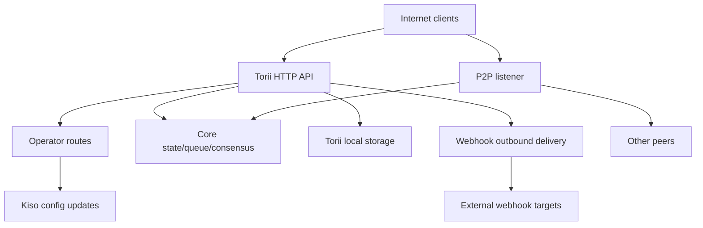

<!-- Auto-generated stub for Spanish (es) translation. Replace this content with the full translation. -->

---
lang: es
direction: ltr
source: iroha-threat-model.md
status: complete
generator: scripts/sync_docs_i18n.py
source_hash: 766928cf0dcbfe3513c728bcf0b9fa697a330e8000bc6944ab61e8fcd59751ad
source_last_modified: "2026-02-07T13:27:25.009145+00:00"
translation_last_reviewed: 2026-04-02
translator: machine-google-reviewed
---

# Iroha Modelo de amenaza (repositorio: `iroha`)

## Resumen ejecutivo
En una implementación de blockchain pública expuesta a Internet donde se puede acceder intencionalmente a las rutas del operador desde la Internet pública pero deben autenticarse mediante firmas de solicitud, y donde los webhooks/adjuntos están habilitados en el punto final público Torii, los principales riesgos son: compromiso del plano del operador (solicitudes firmadas no autenticadas o reproducibles a `/v1/configuration` y otras rutas del operador), SSRF y abuso saliente a través de la entrega de webhook, y DoS de alto apalancamiento a través de transacciones/consultas + puntos finales de transmisión donde los límites de velocidad se aplican condicionalmente; Además, cualquier postura “mTLS requerida” que dependa de la presencia de `x-forwarded-client-cert` es falsificada cuando Torii está directamente expuesto. Evidencia: `crates/iroha_torii/src/lib.rs` (enrutador + middleware + rutas de operador), `crates/iroha_torii/src/operator_auth.rs` (activación/desactivación de autenticación de operador + verificación `x-forwarded-client-cert`), `crates/iroha_torii/src/webhook.rs` (cliente HTTP saliente), `crates/iroha_torii/src/limits.rs` (limitación de velocidad condicional).

## Alcance y supuestosDentro del alcance (tiempo de ejecución/superficies de producción):
- Torii Servidor y middleware HTTP API, incluidas rutas de "operador", API de aplicaciones, webhooks, archivos adjuntos, contenido y puntos finales de transmisión: `crates/iroha_torii/`, `crates/iroha_torii_shared/`
- Arranque de nodo y cableado de componentes (Torii + P2P + actor de actualización de estado/cola/configuración): `crates/irohad/src/main.rs`
- Transporte P2P y superficies de handshake: `crates/iroha_p2p/`
- Formas de configuración y valores predeterminados (especialmente los valores predeterminados de autenticación Torii): `crates/iroha_config/src/parameters/{actual,defaults}.rs`
- Actualización de configuración orientada al cliente DTO (lo que `/v1/configuration` puede cambiar): `crates/iroha_config/src/client_api.rs`
- Conceptos básicos del empaquetado de implementación: `Dockerfile` y configuraciones de ejemplo en `defaults/` (no utilice claves de ejemplo integradas en producción).

Fuera de alcance (a menos que se solicite explícitamente):
- Flujos de trabajo de CI y automatización de lanzamientos: `.github/`, `ci/`, `scripts/`
- SDK y aplicaciones móviles/cliente: `IrohaSwift/`, `java/`, `examples/`
- Material sólo de documentación: `docs/`Supuestos explícitos (basados en sus aclaraciones):
- Torii está expuesto a Internet y es accesible para clientes no autenticados (algunos puntos finales aún pueden requerir firmas u otra autenticación).
- Las rutas del operador (`/v1/configuration`, `/v1/nexus/lifecycle` y ​​la telemetría/perfiles controlados por el operador cuando están habilitadas) están diseñadas para ser accesibles públicamente y deben autenticarse mediante la firma de una clave privada controlada por el operador. Evidencia (estado actual): `crates/iroha_torii/src/lib.rs` (`add_core_info_routes` aplica `operator_layer`), `crates/iroha_torii/src/operator_auth.rs` (`enforce_operator_auth` / `authorize_operator_endpoint`).
- La verificación de la firma del operador debe utilizar una lista de nodos permitidos locales de claves públicas del operador en la configuración (no se muestra como una puerta de operador implementada en el enrutador actual). Evidencia de la puerta del operador actual: `crates/iroha_torii/src/operator_auth.rs` (`authorize_operator_endpoint`) y del asistente de firma de solicitud canónica existente (construcción del mensaje): `crates/iroha_torii/src/app_auth.rs` (`canonical_request_message`).
- Torii no necesariamente se implementa detrás de una entrada confiable; por lo tanto, encabezados como `x-forwarded-client-cert` deben tratarse como controlados por un atacante cuando Torii está expuesto directamente. Evidencia: `crates/iroha_torii/src/lib.rs` (`HEADER_MTLS_FORWARD`, `norito_rpc_mtls_present`) y `crates/iroha_torii/src/operator_auth.rs` (`HEADER_MTLS_FORWARD`, `mtls_present`).
- Los webhooks y los archivos adjuntos están habilitados en el punto final público Torii. Evidencia: `crates/iroha_torii/src/lib.rs` (rutas para `/v1/webhooks` y `/v1/zk/attachments`), `crates/iroha_torii/src/webhook.rs`, `crates/iroha_torii/src/zk_attachments.rs`.- El operador puede configurar o mantener `torii.require_api_token = false` (el valor predeterminado es `false`). Evidencia: `crates/iroha_config/src/parameters/defaults.rs` (`torii::REQUIRE_API_TOKEN`).
- Se espera que `/transaction` e `/query` sean accesibles para una cadena pública. Nota: además, están controlados por la etapa de implementación “Norito-RPC” y la verificación de presencia de encabezado opcional “mTLS requerido”. Evidencia: `crates/iroha_torii/src/lib.rs` (`ConnScheme::from_request`, `evaluate_norito_rpc_gate`) y `crates/iroha_config/src/parameters/defaults.rs` (`torii::transport::norito_rpc::STAGE = "disabled"`).

Preguntas abiertas que cambiarían materialmente la clasificación de riesgo:
- ¿Dónde se configuran las claves públicas del operador (qué clave de configuración/formato) y cómo se identifican/rotan las claves (identificación de clave, múltiples claves activas, revocación)?
- ¿Cuál es el formato exacto del mensaje de firma del operador y la protección de reproducción (marca de tiempo/nonce/contador + caché de reproducción del lado del servidor) y qué política de sesgo de reloj es aceptable? Evidencia de que el asistente de solicitud canónico existente no tiene actualización: `crates/iroha_torii/src/app_auth.rs` (`canonical_request_message`).
- Para webhooks anónimos, ¿se espera que Torii permita destinos arbitrarios o debería aplicar una política de destino SSRF (bloquear RFC1918/localhost/link-local/metadata y, opcionalmente, requerir HTTPS)?
- ¿Qué funciones Torii están habilitadas en su compilación (`telemetry`, `profiling`, `p2p_ws`, `app_api_https`, `app_api_wss`) y se utiliza el contenido de `app_api`? Evidencia: `crates/iroha_torii/Cargo.toml` (`[features]`).

## Modelo del sistema### Componentes primarios
- **Clientes de Internet** (billeteras, indexadores, exploradores, bots): envía solicitudes HTTP/Norito y abre conexiones WS/SSE.
- **Torii (HTTP API)**: enrutador axum con middleware para puerta de autenticación previa, aplicación de token API opcional, negociación de versión API, inyección remota de direcciones y métricas. Evidencia: `crates/iroha_torii/src/lib.rs` (`create_api_router`, `enforce_preauth`, `enforce_api_token`, `enforce_api_version`, `inject_remote_addr_header`).
- **Plano de control de operador/autenticación (actual) y postura deseada**: las rutas del operador están actualmente protegidas por `operator_auth::enforce_operator_auth` (WebAuthn/tokens; se puede desactivar efectivamente mediante la configuración), pero su requisito de implementación es la autenticación del operador basada en firmas verificada con una lista permitida de claves públicas del operador en la configuración. Existe un asistente de mensaje de solicitud canónico que podría reutilizarse para la construcción de mensajes, pero la verificación debería adaptarse para usar claves de configuración (no cuentas de estado mundial). Evidencia: `crates/iroha_torii/src/lib.rs` (`add_core_info_routes` usa `operator_layer`), `crates/iroha_torii/src/operator_auth.rs` (`authorize_operator_endpoint`), `crates/iroha_torii/src/app_auth.rs` (`canonical_request_message`, `verify_canonical_request`).- **Componentes del nodo central (en proceso)**: cola de transacciones, estado/WSV, consenso (Sumeragi), almacenamiento en bloque (Kura), actor de actualización de configuración (Kiso), etc., pasados ​​a Torii. Evidencia: `crates/irohad/src/main.rs` (`Torii::new_with_handle(...)` recibe `queue`, `state`, `kura`, `kiso`, `sumeragi` y se inicia mediante `torii.start(...)`).
- **Redes P2P**: protocolo de enlace y transporte punto a punto cifrado y enmarcado; Existe TLS sobre TCP opcional, pero es intencionalmente permisivo en la verificación del certificado. Evidencia: `crates/iroha_p2p/src/lib.rs` (tipo alias `NetworkHandle<..., X25519Sha256, ChaCha20Poly1305>`), `crates/iroha_p2p/src/transport.rs` (módulo `p2p_tls` con `NoCertificateVerification`).
- **Persistencia local Torii**: directorio base predeterminado `./storage/torii` para archivos adjuntos/webhooks/colas. Evidencia: `crates/iroha_config/src/parameters/defaults.rs` (`torii::data_dir()`), `crates/iroha_torii/src/webhook.rs` (`webhooks.json` persistente), `crates/iroha_torii/src/zk_attachments.rs` (almacenado en `./storage/torii/zk_attachments/`).
- **Destinos de webhook saliente**: Torii puede entregar eventos a URL `http://` arbitrarias (e `https://`/`ws(s)://` solo con funciones). Evidencia: `crates/iroha_torii/src/webhook.rs` (`http_post_plain`, `http_post_https`, `ws_send`).### Flujos de datos y límites de confianza
- Cliente de Internet → API HTTP Torii
  - Datos: Norito binario (`SignedTransaction`, `SignedQuery`), JSON DTO (API de aplicación), suscripciones WS/SSE, encabezados (incluido `x-api-token`).
  - Canal: HTTP/1.1 + WebSocket + SSE (axum).
  - Garantías: token API opcional (`torii.require_api_token`), conexión previa a la autenticación/regulación de velocidad, negociación de versión API; muchos controladores aplican la limitación de velocidad por punto final de forma condicional (se puede omitir cuando `enforce=false`). Evidencia: `crates/iroha_torii/src/lib.rs` (`enforce_preauth`, `validate_api_token`, `handler_post_transaction`, `handler_signed_query`), `crates/iroha_torii/src/limits.rs` (`allow_conditionally`).
  - Validación: límites de cuerpo en algunos puntos finales (por ejemplo, transacciones), decodificación Norito, firma de solicitudes para algunos puntos finales de aplicaciones (encabezados de solicitud canónicos). Evidencia: `crates/iroha_torii/src/lib.rs` (`add_transaction_routes` usa `DefaultBodyLimit::max(...)`), `crates/iroha_torii/src/app_auth.rs` (`verify_canonical_request`).- Cliente de Internet → Rutas “Operador” (Torii)
  - Datos: actualizaciones de configuración (`ConfigUpdateDTO`), planes de ciclo de vida de carril, telemetría/depuración/estado/métricas (cuando está habilitado).
  - Canal: HTTP.
  - Garantías: el repositorio actual bloquea estas rutas con middleware `operator_auth::enforce_operator_auth`, que efectivamente no funciona cuando `torii.operator_auth.enabled=false`; su postura deseada es la autenticación basada en firmas utilizando claves públicas del operador de la configuración, que debe implementarse y aplicarse en este límite (y no debe depender de `x-forwarded-client-cert` si Torii está expuesto directamente). Evidencia: `crates/iroha_torii/src/lib.rs` (`add_core_info_routes` aplica `operator_layer`), `crates/iroha_torii/src/operator_auth.rs` (`authorize_operator_endpoint`, `mtls_present`).
  - Validación: principalmente análisis DTO; sin autorización criptográfica en el propio `handle_post_configuration` (delega en `kiso.update_with_dto`). Evidencia: `crates/iroha_torii/src/routing.rs` (`handle_post_configuration`).

- Torii → Cola principal/estado/consenso (en proceso)
  - Datos: envíos de transacciones, ejecución de consultas, lecturas/escrituras de estado, consultas de telemetría de consenso.
  - Canal: llamadas Rust en proceso (identificadores `Arc` compartidos).
  - Garantías: límite de confianza asumido; la seguridad depende de que Torii autentique/autorice correctamente las solicitudes antes de invocar operaciones privilegiadas. Evidencia: `crates/irohad/src/main.rs` (cableado `Torii::new_with_handle(...)`) y manejadores Torii que llaman a `routing::handle_*`.- Torii → Kiso (actor de actualización de configuración)
  - Datos: `ConfigUpdateDTO` puede modificar el registro, P2P ACL, configuración de red/transporte, protocolo de enlace SoraNet, etc.
  - Canal: mensaje/identificador en proceso.
  - Garantías: se espera autorización en el límite Torii; actualizar DTO en sí tiene capacidad. Evidencia: `crates/iroha_config/src/client_api.rs` (los campos `ConfigUpdateDTO` incluyen `network_acl`, `transport.norito_rpc`, `soranet_handshake`, etc.).

- Torii → Disco local (`./storage/torii`)
  - Datos: registro de webhooks y entregas en cola; archivos adjuntos y metadatos de desinfectantes; Comportamiento GC/TTL.
  - Canal: sistema de archivos.
  - Garantías: permisos del sistema operativo local (el contenedor se ejecuta como no root en Dockerfile); El aislamiento lógico por "inquilino" se basa en un token API o un encabezado IP remoto inyectado por el middleware. Evidencias: `Dockerfile` (`USER iroha`), `crates/iroha_torii/src/lib.rs` (`inject_remote_addr_header`, `zk_attachments_tenant`).

- Torii → Destinos de webhook (salientes)
  - Datos: cargas útiles de eventos + encabezado de firma.
  - Canal: cliente HTTP TCP sin formato para `http://`; `hyper+rustls` opcional para `https://` cuando está habilitado; WS/WSS opcional cuando está habilitado.
  - Garantías: tiempos de espera/reintentos; no hay lista de destinos permitidos visible en el código; La URL está influenciada por el atacante si el webhook CRUD está abierto. Evidencia: `crates/iroha_torii/src/webhook.rs` (`handle_create_webhook`, `http_post_plain/http_post`).- Pares P2P (red no confiable) → Transporte/apretón de enlace P2P
  - Datos: prefacio/metadatos del protocolo de enlace, mensajes cifrados enmarcados, mensajes de consenso.
  - Canal: transporte P2P (TCP/QUIC/etc, dependiendo de la función), cargas útiles cifradas; TLS-over-TCP opcional es explícitamente permisivo en la verificación de certificados.
  - Garantías: cifrado y protocolo de enlace firmado en la capa de aplicación; TLS de capa de transporte no se autentica mediante certificado. Evidencia: `crates/iroha_p2p/src/lib.rs` (tipos de cifrado), `crates/iroha_p2p/src/transport.rs` (comentario e implementación de `NoCertificateVerification`).

#### Diagrama

## Activos y objetivos de seguridad| Activo | Por qué es importante | Objetivo de seguridad (C/I/A) |
|---|---|---|
| Estado de cadena / WSV / bloques | Los fracasos en materia de integridad se convierten en fracasos en el consenso; fallos de disponibilidad paran la cadena | I/A |
| Vivencia del consenso (Sumeragi) | El valor público de la blockchain depende de la producción sostenida de bloques | Un |
| Claves privadas de nodo (identidad de pares, claves de firma) | El compromiso de claves permite la apropiación de identidades, el abuso de firmas o la partición de la red | C/I |
| Configuración de tiempo de ejecución (actualizado por Kiso) | Controla las ACL de red y la configuración de transporte; el mal uso puede desactivar protecciones o admitir pares maliciosos | Yo |
| Cola de transacciones/mempool | Las inundaciones pueden privar al consenso y agotar la CPU y la memoria | Un |
| Persistencia Torii (`./storage/torii`) | El agotamiento del disco puede bloquear el nodo; los datos almacenados pueden influir en el procesamiento posterior | A (y a veces C/I) |
| Canal de webhook saliente | Se puede abusar de él para SSRF, filtración de datos de redes internas o escaneo desde una IP de salida confiable | C/I/A |
| Telemetría/métricas/datos de depuración | Puede filtrar la topología de la red y el estado operativo, útil para ataques dirigidos | C |

## Modelo de atacante### Capacidades
- Un atacante de Internet remoto y no autenticado puede enviar solicitudes HTTP arbitrarias, mantener conexiones WS/SSE de larga duración y reproducir o distribuir cargas útiles (botnet).
- Cualquier parte puede generar claves y enviar transacciones/consultas firmadas (blockchain pública), incluido el spam de gran volumen.
- Un interlocutor malicioso o comprometido puede conectarse a P2P e intentar abusar del protocolo, realizar inundaciones o manipular el protocolo de enlace dentro de las restricciones permitidas.
- Si el webhook CRUD está expuesto, el atacante puede registrar las URL del webhook controlado por el atacante y recibir devoluciones de llamadas salientes (y potencialmente dirigirlas a destinos internos).

### No capacidades
- No hay acceso directo al sistema de archivos local sin un punto final expuesto o permisos de volumen mal configurados.
- No hay capacidad para falsificar firmas para claves de pares/operadores existentes sin comprometer la clave.
- No se asume la capacidad de romper la criptografía moderna (X25519, ChaCha20-Poly1305, Ed25519) en condiciones normales.

## Puntos de entrada y superficies de ataque| Superficie | ¿Cómo se llegó? Límite de confianza | Notas | Evidencia (ruta de repositorio/símbolo) |
|---|---|---|---|---|
| `POST /transaction` | HTTP de Internet | Internet → Torii | Norito transacción binaria firmada; la limitación de velocidad es condicional (`enforce` puede ser falsa) | `crates/iroha_torii/src/lib.rs` (`handler_post_transaction`, `ConnScheme::from_request`) |
| `POST /query` | HTTP de Internet | Internet → Torii | Norito consulta binaria firmada; la limitación de velocidad es condicional (`enforce` puede ser falsa) | `crates/iroha_torii/src/lib.rs` (`handler_signed_query`) |
| Puerta Norito-RPC | Encabezados HTTP de Internet | Internet → Torii | Etapa de implementación + “mTLS requerido” opcional mediante presencia del encabezado; usos canarios `x-api-token` | `crates/iroha_torii/src/lib.rs` (`evaluate_norito_rpc_gate`, `HEADER_MTLS_FORWARD`) |
| `POST/GET/DELETE /v1/webhooks...` | Internet HTTP (API de la aplicación) | Internet → Torii → saliente | Anónimo por diseño; el webhook CRUD permite la entrega saliente a URL arbitrarias; Riesgo de la SSRF | `crates/iroha_torii/src/lib.rs` (`handler_webhooks_*`), `crates/iroha_torii/src/webhook.rs` (`http_post`) |
| `POST/GET /v1/zk/attachments...` | Internet HTTP (API de la aplicación) | Internet → Torii → disco | Anónimo por diseño; desinfectante de apego + descompresión + persistencia; superficie de agotamiento de disco/CPU (el arrendamiento es un token de API si está habilitado; de lo contrario, IP remota a través del encabezado inyectado) | `crates/iroha_torii/src/lib.rs` (`handler_zk_attachments_*`, `zk_attachments_tenant`), `crates/iroha_torii/src/zk_attachments.rs` || `GET /v1/content/{bundle}/{path...}` | HTTP de Internet | Internet → Torii → estado/almacenamiento | Admite modos de autenticación + PoW + Rango; limitador de salida | `crates/iroha_torii/src/content.rs` (`handle_get_content`, `enforce_pow`, `enforce_auth`) |
| Transmisión: `/v1/events/sse`, `/events` (WS), `/block/stream` (WS) | Internet | Internet → Torii | Conexiones duraderas; Superficie DoS | `crates/iroha_torii/src/lib.rs` (`add_network_stream_routes`) |
| `GET/POST /v1/configuration` | HTTP de Internet | Internet → rutas del operador → Kiso | Intención de implementación: firmas de operadores verificadas con las claves de la lista de configuración permitida; El repositorio actual lo protege solo a través del middleware del operador (no se muestra ninguna puerta de firma en el grupo de rutas) y delega la aplicación de actualización a Kiso | `crates/iroha_torii/src/lib.rs` (`add_core_info_routes`, `handler_post_configuration`), `crates/iroha_torii/src/operator_auth.rs` (`enforce_operator_auth`), `crates/iroha_torii/src/routing.rs` (`handle_post_configuration`), `crates/iroha_torii/src/app_auth.rs` (existente ayudante de firma de solicitud canónica) |
| `POST /v1/nexus/lifecycle` | HTTP de Internet | Internet → rutas del operador → núcleo | Punto final del operador destinado a ser autenticado por firma; actualmente protegido por middleware del operador y puede volverse público si la autenticación del operador está deshabilitada | `crates/iroha_torii/src/lib.rs` (`add_core_info_routes`, `handler_post_nexus_lane_lifecycle`), `crates/iroha_torii/src/operator_auth.rs` (`authorize_operator_endpoint`) || Puntos finales de telemetría/elaboración de perfiles (con funciones controladas) | HTTP de Internet | Internet → rutas del operador | Grupos de rutas controlados por operadores; si la autenticación del operador está deshabilitada y no hay una puerta de firma presente, estos se vuelven públicos y pueden filtrar datos operativos o ser vectores DoS | `crates/iroha_torii/src/lib.rs` (`add_telemetry_routes`, `add_profiling_routes`), `crates/iroha_torii/src/operator_auth.rs` (`authorize_operator_endpoint`) |
| Transportes P2P TCP/TLS | Internet/red de pares | Internet/pares → P2P | Marcos P2P cifrados + protocolo de enlace; La verificación del certificado TLS es permisiva cuando está habilitada | `crates/iroha_p2p/src/lib.rs` (`NetworkHandle`), `crates/iroha_p2p/src/transport.rs` (`p2p_tls::NoCertificateVerification`) |

## Principales rutas de abuso

1. **Objetivo del atacante: controlar el comportamiento del nodo mediante actualizaciones de configuración en tiempo de ejecución**
   1) Encuentre Torii expuesto a Internet donde se puede acceder a las rutas del operador y la autenticación del operador está ausente o se puede omitir (por ejemplo, la autenticación del operador está deshabilitada y no hay puerta de firma).  
   2) `POST /v1/configuration` con un `ConfigUpdateDTO` que afloja las ACL de la red o cambia la configuración de transporte.  
   3) Unirse como par o inducir partición/configuración incorrecta; degradar el consenso y/o enrutar transacciones a través de infraestructura controlada por atacantes.  
   Impacto: compromiso de integridad y disponibilidad del nodo (y potencialmente de la red).2. **Objetivo del atacante: reproducir una solicitud capturada y firmada por el operador**
   1) Obtenga una solicitud de operador firmada válida (por ejemplo, a través de una máquina de operador comprometida, registros de proxy mal configurados o un entorno donde TLS finaliza de manera insegura).  
   2) Reproducir la misma solicitud en rutas de operadores públicos si el esquema de firma carece de actualización (marca de tiempo/nonce) y rechazo de reproducción del lado del servidor.  
   3) Provocar cambios de configuración repetidos, reversiones o alternancias forzadas que degraden la disponibilidad o debiliten las defensas.  
   Impacto: compromiso de integridad/disponibilidad a pesar de la "autenticación de firma".  

3. **Objetivo del atacante: deshabilitar/proteger protecciones cambiando la implementación de Norito-RPC**
   1) `POST /v1/configuration` para actualizar `transport.norito_rpc.stage` o `require_mtls`.  
   2) Forzar la apertura o el cierre de `/transaction` e `/query`, lo que afecta los controles de disponibilidad y admisión.  
   Impacto: interrupción selectiva o omisión del control de admisión.4. **Objetivo del atacante: SSRF en la red interna del operador**
   1) Cree una entrada de webhook que apunte a un destino interno (por ejemplo, host RFC1918, IP de metadatos, plano de control) a través de `POST /v1/webhooks`.  
   2) Espere eventos coincidentes; Torii entrega solicitudes HTTP salientes desde su posición en la red.  
   3) Usar respuestas/estados/cronogramas y reintentos repetidos para sondear los servicios internos (y potencialmente filtrar si el contenido de la respuesta alguna vez aparece en otro lugar).  
   Impacto: exposición de la red interna, andamiaje de movimiento lateral, daño a la reputación, posible exposición de credenciales a través de puntos finales de metadatos.  

5. **Objetivo del atacante: denegar el servicio de transacción/admisión de consulta**
   1) Inundación `POST /transaction` e `POST /query` con cuerpos Norito válidos/no válidos.  
   2) Mantener muchas suscripciones WS/SSE y clientes lentos.  
   3) Aproveche la limitación de velocidad condicional (`enforce=false`) en funcionamiento normal para evitar la limitación.  
   Impacto: agotamiento de CPU/memoria, saturación de colas, bloqueos de consenso.  

6. **Objetivo del atacante: Disco de escape mediante accesorios**
   1) Inundar `/v1/zk/attachments` con cargas útiles de tamaño máximo y/o archivos comprimidos cerca de los límites de expansión.  
   2) Utilice múltiples IP de origen (o cualquier debilidad en la clave de inquilino) para evitar límites por inquilino.  
   3) Persistir hasta que TTL/GC se retrase; llene `./storage/torii`.  
   Impacto: caída del nodo, incapacidad para procesar bloques/transacciones.7. **Objetivo del atacante: evitar las puertas “mTLS requeridas” cuando Torii esté expuesto directamente**
   1) El operador habilita `require_mtls` para Norito-RPC o autenticación de operador.  
   2) El atacante envía solicitudes con `x-forwarded-client-cert: <anything>`.  
   3) La verificación de presencia del encabezado se supera si ninguna entrada confiable elimina el encabezado.  
   Impacto: controles mal aplicados; El operador cree que mTLS se aplica cuando no es así.  

8. **Objetivo del atacante: degradar la conectividad entre pares/consumir recursos**
   1) El interlocutor malicioso intenta repetidamente apretones de manos o inunda fotogramas cerca del tamaño máximo.  
   2) Explotar el TLS permisivo de la capa de transporte (si está habilitado) para evitar el rechazo temprano basado en certificados.  
   Impacto: pérdida de conexiones, uso de CPU, disponibilidad reducida de pares.  

9. **Objetivo del atacante: reconocimiento mediante telemetría/puntos finales de depuración**
   1) Si la telemetría/perfilado está habilitado y la autenticación del operador falta/se puede omitir, elimine `/status`, `/metrics` y depure las rutas.  
   2) Utilice datos de topología/estado filtrados para cronometrar los ataques y apuntar a componentes específicos.  
   Impacto: mayor tasa de éxito de los atacantes; posible divulgación de información.  

## Tabla de modelos de amenazas| Identificación de amenazas | Fuente de amenaza | Requisitos previos | Acción amenazadora | Impacto | Activos impactados | Controles existentes (pruebas) | Brechas | Mitigaciones recomendadas | Ideas de detección | Probabilidad | Gravedad del impacto | Prioridad |
|---|---|---|---|---|---|---|---|---|---|---|---|---|| TM-001 | Atacante remoto de Internet | Torii expuesto a Internet; las rutas del operador son públicas; la autenticación del operador está ausente/se puede omitir o la autenticación del operador basada en firmas no está implementada o está mal implementada | Invocar rutas de operador (por ejemplo, `/v1/configuration`, `/v1/nexus/lifecycle`) para cambiar la configuración del tiempo de ejecución, las ACL de red o la configuración de transporte | Toma de control/partición del nodo; admitir compañeros maliciosos; desactivar protecciones | Configuración de tiempo de ejecución; vivacidad del consenso; integridad de la cadena; claves de pares | Las rutas del operador están detrás del middleware del operador, pero `authorize_operator_endpoint` devuelve `Ok(())` cuando está deshabilitado; La actualización de configuración delega a Kiso sin autenticación adicional. Evidencia: `crates/iroha_torii/src/lib.rs` (`add_core_info_routes`), `crates/iroha_torii/src/operator_auth.rs` (`authorize_operator_endpoint`), `crates/iroha_torii/src/routing.rs` (`handle_post_configuration`), `crates/iroha_config/src/client_api.rs` (`ConfigUpdateDTO`) | No se muestra ninguna autenticación de operador basada en firmas en los grupos de rutas de operadores; “mTLS” basado en encabezado es falsificable cuando Torii está expuesto directamente; protección de repetición undefinido | Implementar autenticación de operador obligatoria basada en firmas para rutas de operador verificadas con una lista de configuración permitida de claves públicas de operador (admite múltiples claves + identificadores de clave); incluir actualización (marca de tiempo + nonce) con un caché de reproducción limitado; aplicar TLS de extremo a extremo (no confíe en `x-forwarded-client-cert`); aplicar límites de tarifas estrictos + registro de auditoría en todas las acciones del operador | Alerta sobre cualquier ruta de operador afectada; diferencias de configuración del registro de auditoría; detectar firmas/nonces repetidas; monitorear actualización inusualIP de frecuencia y origen | Alto (hasta que se implemente y aplique la autenticación de firma + protección de reproducción) | Alto | **crítico** || TM-002 | Atacante remoto de Internet | Webhook CRUD es anónimo y accesible por Internet; sin política de destino de la SSRF | Cree webhooks dirigidos a URL internas/privilegiadas y active entregas | SSRF, escaneo interno, exposición de credenciales de metadatos y DoS saliente | Canal de webhook; red interna; disponibilidad | Los webhooks existen; las entregas utilizan tiempos de espera/retroceso/intentos máximos; La entrega `http://` utiliza TCP sin formato. Evidencia: `crates/iroha_torii/src/lib.rs` (`handler_webhooks_*`), `crates/iroha_torii/src/webhook.rs` (`handle_create_webhook`, `http_post_plain`, `WebhookPolicy`) | Sin lista de destinos permitidos/bloques de rango de IP; `http://` permitido; Los controles de reenlace/redireccionamiento de DNS no son visibles; La limitación de la tasa CRUD del webhook es condicional (puede estar efectivamente desactivada en estado estable) | Mantenga los webhooks habilitados pero agregue controles SSRF: bloquear rangos de IP y nombres de host privados/bucle invertido/enlace local/metadatos, resolver direcciones + pin, limitar redirecciones, limitar la concurrencia saliente; debido a que la creación es anónima, agregue cuotas por IP siempre activas + límites globales y considere un token PoW opcional para la creación/actualización de webhooks | URL de destino del webhook de registro y métricas + IP resueltas; alerta sobre destinos bloqueados; alerta sobre intentos de IP privada y altas tasas de fallas/reintentos; monitorear la tasa CRUD del webhook y la saturación de la cola | Alto | Alto | **crítico** || TM-003 | Atacante remoto de Internet/spammer | Público `/transaction` y `/query`; limitación de tasa condicional no aplicada en modos comunes | Envío de consultas/transmisiones masivas, además de transmisiones WS/SSE | agotamiento de la CPU/memoria; saturación de colas; puestos de consenso | Disponibilidad (Torii + consenso); cola/mempool | La puerta de autenticación previa limita las conexiones por IP y puede prohibirlas. Evidencia: `crates/iroha_torii/src/lib.rs` (`enforce_preauth`), `crates/iroha_torii/src/limits.rs` (`PreAuthGate`) | Muchos limitadores de velocidad clave son condicionales (`allow_conditionally` devuelve verdadero cuando `enforce=false`); los atacantes distribuidos superan los límites por IP | Agregue límites de velocidad siempre activos para transmisiones/consultas/transmisiones cuando esté expuesto a Internet; agregue límites de tarifas configurables por punto final independientemente de la política de tarifas; proteja terminales costosos con PoW o requiera cuotas basadas en firmas/cuentas | Monitorear: rechazos de autenticación previa, longitud de la cola, tasas de transmisión/consulta, conexiones activas WS/SSE; alerta sobre anomalías y límites de capacidad sostenidos | Alto | Alto | **alto** || TM-004 | Atacante remoto de Internet | Funciones de telemetría/perfil habilitadas; autenticación del operador deshabilitada o falta la puerta de firma | Raspe `/status`, `/metrics`, depure puntos finales; solicitar estado de depuración costoso | Divulgación de información; DoS operativo; habilitación de ataques dirigidos | Datos de telemetría/depuración; disponibilidad | Los grupos de rutas de telemetría/elaboración de perfiles están superpuestos con `operator_auth::enforce_operator_auth`. Evidencia: `crates/iroha_torii/src/lib.rs` (`add_telemetry_routes`, `add_profiling_routes`), `crates/iroha_torii/src/operator_auth.rs` (`authorize_operator_endpoint`) | El middleware del operador no funciona cuando está deshabilitado; la autenticación del operador basada en firmas no se muestra en estos grupos de rutas | Requerir la misma autenticación de operador obligatoria basada en firmas para estos grupos de rutas; agregar límites estrictos de velocidad y almacenamiento en caché de respuestas cuando sea posible; evitar exponer puntos finales de creación de perfiles/depuración en nodos públicos de forma predeterminada | Seguimiento de registros de acceso; alerta sobre patrones de scraping y solicitudes sostenidas de alto costo | Medio | Medio | **medio** || TM-005 | Atacante remoto de Internet (explotación de errores de configuración) | El operador habilita `require_mtls` pero Torii está expuesto directamente (o no se garantiza la desinfección del proxy/encabezado) | Falsifica `x-forwarded-client-cert` para satisfacer las comprobaciones de “mTLS requerido” | Falsa sensación de seguridad; omitir el bloqueo para Norito-RPC/políticas de autenticación del operador | Límite operador/autorización; control de admisión | `require_mtls` se verifica por presencia del encabezado. Evidencia: `crates/iroha_torii/src/lib.rs` (`HEADER_MTLS_FORWARD`, `norito_rpc_mtls_present`), `crates/iroha_torii/src/operator_auth.rs` (`mtls_present`) | No hay verificación criptográfica del certificado del cliente en Torii; se basa en un contrato de ingreso externo | No confíe en `x-forwarded-client-cert` por seguridad cuando Torii sea accesible públicamente; si se requiere mTLS, aplique la verificación del certificado del cliente en Torii o en una entrada confiable que elimine los encabezados del cliente; de lo contrario, elimine/ignore la puerta basada en encabezado para implementaciones orientadas a Internet | Alerta sobre cualquier solicitud que contenga `x-forwarded-client-cert` y llegue directamente a Torii; resultados de la puerta de registro para Norito-RPC y autenticación del operador; monitorear cambios repentinos en el tráfico permitido | Alto | Alto | **alto** || TM-006 | Atacante remoto de Internet | Los puntos finales de archivos adjuntos son anónimos y accesibles a través de Internet; atacante puede enviar cargas útiles de tamaño máximo o bombas de compresión | Abusar del desinfectante/descompresión/persistencia para consumir CPU/disco | Inestabilidad del nodo; agotamiento del disco; rendimiento degradado | Almacenamiento Torii; disponibilidad | Existen límites de archivos adjuntos + desinfectante y profundidad máxima de expansión/archivo. Evidencia: `crates/iroha_config/src/parameters/defaults.rs` (`ATTACHMENTS_MAX_BYTES`, `ATTACHMENTS_MAX_EXPANDED_BYTES`, `ATTACHMENTS_MAX_ARCHIVE_DEPTH`, `ATTACHMENTS_SANITIZER_MODE`), `crates/iroha_torii/src/zk_attachments.rs` (`inspect_bytes`, límites), `crates/iroha_torii/src/lib.rs` (`handler_zk_attachments_*`, `zk_attachments_tenant`) | La identidad del inquilino se basa en gran medida en IP cuando los tokens API están desactivados; las fuentes distribuidas evitan los límites; TTL todavía permite la acumulación de varios días | Debido a que los archivos adjuntos deben ser públicos y anónimos, aplicar cuotas de disco globales + contrapresión, ajustar los valores predeterminados (TTL/bytes máximos), mantener el desinfectante en modo de subproceso con zona de pruebas a nivel de sistema operativo y considerar la activación de PoW opcional para escrituras; asegúrese de que las cuotas por IP no puedan ser eludidas por encabezados falsificados (siga usando `inject_remote_addr_header`) | Supervisar el uso del disco de `./storage/torii`; alerta sobre la tasa de creación de archivos adjuntos, rechazos de desinfectantes y acumulación por inquilino; seguimiento del retraso de GC | Medio | Alto | **alto** || TM-007 | Par malicioso | El par puede llegar al oyente P2P; opcionalmente TLS habilitado | Apretones de manos/marcos de inundación; intento de agotamiento de recursos; explotar TLS permisivo para evitar el rechazo temprano | Degradación de la conectividad; quema de recursos; partición parcial | Disponibilidad; conectividad entre pares | Marcos cifrados + errores de protocolo de enlace para mensajes de gran tamaño. Evidencia: `crates/iroha_p2p/src/lib.rs` (`Error::FrameTooLarge`, errores de protocolo de enlace), `crates/iroha_p2p/src/transport.rs` (`p2p_tls` es permisivo pero se espera un protocolo de enlace firmado en la capa de aplicación) | La capa de transporte no se autentica; DoS posible antes de la autenticación de nivel superior; las limitaciones por igual/IP pueden ser insuficientes | Agregue límites de conexión estrictos por IP/ASN; intentos de protocolo de enlace con límite de velocidad; considere exigir claves de pares incluidas en la lista permitida en nodos públicos; asegúrese de que los tamaños máximos de marco sean conservadores; añade contrapresión y caída temprana para pares no autenticados | Monitorear la tasa de conexión P2P entrante; alerta sobre fallas repetidas en el protocolo de enlace y errores de marco demasiado grande | Medio | Medio | **medio** || TM-008 | Error del operador/cadena de suministro | El operador se implementa con claves/configuraciones de ejemplo; dependencias comprometidas | Utilice claves predeterminadas/de ejemplo o valores predeterminados inseguros; secuestro de dependencia | Compromiso clave; partición de cadena; pérdida de reputación | Llaves; integridad; disponibilidad | Docker se ejecuta como no root y copia los valores predeterminados en `/config`. Evidencia: `Dockerfile` (`USER iroha`, `COPY defaults ...`) | Las configuraciones de ejemplo pueden contener claves privadas de ejemplo integradas; valores predeterminados inseguros como `require_api_token=false` y `operator_auth.enabled=false` | Agregue advertencias de inicio/verificaciones de cierre fallido al detectar claves de ejemplo conocidas; enviar un perfil de configuración reforzado de "nodo público"; hacer cumplir las comprobaciones `cargo deny`/SBOM en el proceso de lanzamiento | Control de CI para secretos en `defaults/`; advertencia de registro de tiempo de ejecución sobre combinaciones de configuración inseguras | Medio | Alto | **alto** || TM-009 | Atacante remoto de Internet | La autenticación del operador basada en firmas se implementa sin actualización; atacante puede observar al menos una solicitud de operador firmada válida | Reproducir una solicitud de operador firmada previamente válida en rutas de operadores públicos | Cambios/reversiones de configuración repetidos; cortes específicos; debilitamiento de las defensas | Configuración de tiempo de ejecución; disponibilidad; integridad de la auditoría | El asistente de firma canónica construye el mensaje a partir del método/ruta/consulta/body-hash y no incluye marca de tiempo/nonce. Evidencia: `crates/iroha_torii/src/app_auth.rs` (`canonical_request_message`) | La protección de reproducción no es inherente a las firmas; las rutas del operador actualmente no muestran un seguimiento de caché de repetición/nonce | Incluir `timestamp` + `nonce` (o contador monótono) en el mensaje firmado, imponer una estrecha desviación del reloj y mantener un caché de reproducción limitado codificado por la identidad del operador; registrar y rechazar duplicados | Alerta sobre nonces duplicados/hashes de solicitud; correlacionar las acciones del operador por identidad y fuente; agregar métricas para rechazos de repetición | Medio | Alto | **alto** || TM-010 | Atacante remoto / interno | La clave privada de firma del operador se almacena donde se puede extraer (artefactos de disco/config/CI) | Robar la clave privada del operador y emitir solicitudes de operador firmadas válidas | Compromiso total entre el plano operador y la baja detectabilidad | Llaves de operador; configuración de tiempo de ejecución; vivacidad del consenso | Algunos componentes Torii ya cargan claves privadas desde la configuración (por ejemplo, clave de operador emisor fuera de línea). Evidencia: `crates/iroha_torii/src/lib.rs` (lee `torii.offline_issuer.operator_private_key` en `KeyPair`), `Dockerfile` (se ejecuta como no root) | El almacenamiento/rotación/uso de HSM de claves no se aplica mediante código; autenticación de firma heredaría este riesgo | Utilice claves respaldadas por hardware (HSM/enclave seguro) siempre que sea posible; evite incrustar claves de operador en repositorios o configuraciones legibles en todo el mundo; hacer cumplir estrictos permisos y rotación de archivos; considerar multi-sig/umbral para las acciones del operador | Alertar sobre acciones del operador desde nuevas IP/ASN; mantener un registro de auditoría inmutable de las acciones del operador; rotar llaves bajo sospecha | Medio | Alto | **alto** |

## Calibración de criticidad

Para este repositorio + contexto de implementación clarificado (cadena pública expuesta a Internet; las rutas del operador son públicas y están destinadas a ser autenticadas por firma; no se garantiza un ingreso confiable), los niveles de gravedad significan:- **crítico**: un atacante remoto y no autenticado puede cambiar el comportamiento del nodo/red o detener de manera confiable la producción de bloques en muchos nodos.
  - Ejemplos: autenticación de firma faltante o anulable para rutas de operador como `/v1/configuration` (TM-001); webhook SSRF a puntos finales de metadatos/plano de control de clúster desde salida privilegiada (TM-002); Robo de clave de firma del operador que permite acciones válidas del operador firmadas (TM-010).

- **alto**: un atacante remoto puede provocar una DoS sostenida de un nodo o eludir un control de seguridad en el que los operadores pueden confiar, con condiciones previas realistas.
  - Ejemplos: DoS de admisión de consultas/transmisiones de gran volumen cuando la limitación de velocidad condicional está inactiva (TM-003); agotamiento del disco/CPU controlado por archivos adjuntos (TM-006); repetición de una solicitud de operador firmada capturada si falta el rechazo de actualización/repetición (TM-009).

- **medio**: ataques que ayudan significativamente al reconocimiento o degradan el rendimiento, pero que están controlados por funciones, requieren una posición elevada del atacante o ya cuentan con una mitigación significativa.
  - Ejemplos: telemetría/exposición de perfiles cuando está habilitado (TM-004); Inundación de apretón de manos P2P con radio de explosión limitado (TM-007).- **bajo**: ataques que requieren condiciones previas poco probables, radio de explosión limitado o armas de fuego principalmente operativas con fácil mitigación.
  - Ejemplos: fugas de información menores de puntos finales públicos de solo lectura que se espera que sean públicos para una cadena de bloques (por ejemplo, `/v1/health`, `/v1/peers`) y que son principalmente útiles para reconocimiento en lugar de compromiso directo (no enumeradas aquí como amenazas principales). Evidencia: `crates/iroha_torii_shared/src/lib.rs` (`uri::HEALTH`, `uri::PEERS`).

## Rutas de enfoque para la revisión de seguridad| Camino | Por qué es importante | ID de amenazas relacionadas |
|---|---|---|
| `crates/iroha_torii/src/lib.rs` | Construcción de enrutadores, pedido de middleware, grupos de rutas de operadores, controladores de consultas/tx, decisiones de límite de velocidad/autenticación y cableado de API de aplicaciones (webhooks/adjuntos) | TM-001, TM-002, TM-003, TM-004, TM-005, TM-006 |
| `crates/iroha_torii/src/operator_auth.rs` | Comportamiento de activación/desactivación de autenticación del operador; verificación mTLS basada en encabezados; sesiones/tokens; fundamental para la protección del plano del operador y para comprender las condiciones de derivación | TM-001, TM-004, TM-005 |
| `crates/iroha_torii/src/routing.rs` | Los controladores `/v1/configuration` delegan en Kiso sin autenticación adicional; gran superficie de manipuladores | TM-001, TM-003 |
| `crates/iroha_config/src/client_api.rs` | Define las capacidades `ConfigUpdateDTO` (ACL de red, cambios de transporte, actualizaciones de protocolo de enlace) | TM-001, TM-009 |
| `crates/iroha_config/src/parameters/defaults.rs` | Postura predeterminada para tokens API/autenticación del operador/etapa Norito-RPC; valores predeterminados del archivo adjunto | TM-003, TM-006, TM-008 |
| `crates/iroha_torii/src/webhook.rs` | Compatibilidad con esquemas y clientes HTTP salientes; superficie de la SSRF; perseverancia y trabajador de entrega | TM-002 |
| `crates/iroha_torii/src/zk_attachments.rs` | Desinfectante de archivos adjuntos, límites de descompresión, persistencia, clave de inquilino | TM-006 |
| `crates/iroha_torii/src/limits.rs` | Puerta de autorización previa y asistentes de limitación de velocidad; comportamiento de ejecución condicional | TM-003 |
| `crates/iroha_torii/src/content.rs` | Autenticación de punto final de contenido/PoW/rango y limitación de salida; consideraciones sobre exfiltración de datos y DoS | TM-003 || `crates/iroha_torii/src/app_auth.rs` | Firma de solicitudes canónicas (construcción de mensajes y verificación de firmas); consideraciones de riesgo de reproducción si se reutiliza para la autenticación del operador | TM-001, TM-003, TM-009 |
| `crates/iroha_p2p/src/lib.rs` | Opciones criptográficas, límites de encuadre, manejo de errores de protocolo de enlace; Superficie de riesgo P2P | TM-007 |
| `crates/iroha_p2p/src/transport.rs` | TLS sobre TCP es permisivo; comportamientos de transporte afectan la superficie DoS | TM-007 |
| `crates/irohad/src/main.rs` | Bootstraps Torii + P2P + actor de actualización de configuración; determina qué superficies están habilitadas | TM-001, TM-008 |
| `defaults/nexus/config.toml` | La configuración de ejemplo puede incluir claves de ejemplo integradas y direcciones de enlace públicas; armas de despliegue | TM-008 |
| `Dockerfile` | Usuario/permisos de tiempo de ejecución del contenedor e inclusión de configuración predeterminada (el material clave y la exposición del plano del operador son sensibles a la implementación) | TM-008, TM-010 |### Control de calidad
- Puntos de entrada cubiertos: transmisión/consulta, streaming, webhooks, archivos adjuntos, contenido, operador/configuración, telemetría/perfiles (con funciones controladas), P2P.
- Límites de confianza cubiertos por amenazas: Internet→Torii, Torii→Kiso/core/disk, Torii→objetivos de webhook, pares→P2P.
- Separación de tiempo de ejecución vs CI/desarrollo: CI/docs/mobile explícitamente fuera de alcance.
- Aclaraciones del usuario reflejadas: expuestas a Internet, las rutas del operador son públicas pero deben estar autenticadas por firma, no se garantiza un ingreso confiable, webhooks/archivos adjuntos habilitados en el punto final público Torii.
- Supuestos/preguntas abiertas enumeradas explícitamente en “Alcance y supuestos”.

## Notas de uso
- Este documento se basa intencionalmente en un repositorio (las anclas de evidencia apuntan al código actual); Varias mitigaciones de alta prioridad (puerta de firma del operador, política de destino SSRF del webhook) requieren un nuevo código/configuración que aún no está presente.
- Trate cualquier señal "mTLS" basada en encabezado (por ejemplo, `x-forwarded-client-cert`) como controlada por un atacante a menos que una entrada confiable las elimine e inyecte.