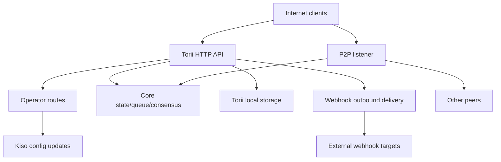

<!-- Auto-generated stub for French (fr) translation. Replace this content with the full translation. -->

---
lang: fr
direction: ltr
source: iroha-threat-model.md
status: complete
generator: scripts/sync_docs_i18n.py
source_hash: 766928cf0dcbfe3513c728bcf0b9fa697a330e8000bc6944ab61e8fcd59751ad
source_last_modified: "2026-02-07T13:27:25.009145+00:00"
translation_last_reviewed: 2026-04-02
translator: machine-google-reviewed
---

# Modèle de menace Iroha (dépôt : `iroha`)

## Résumé
Dans un déploiement de blockchain publique exposé sur Internet, où les routes de l'opérateur sont intentionnellement accessibles depuis l'Internet public mais doivent être authentifiées via des signatures de requête, et où les webhooks/pièces jointes sont activés sur le point de terminaison public Torii, les principaux risques sont : compromission du plan de l'opérateur (requêtes signées non authentifiées ou rejouables à `/v1/configuration` et à d'autres routes de l'opérateur), SSRF et abus sortants via la livraison de webhooks, et DoS à fort effet de levier via des points de terminaison de transaction/requête + streaming où les limites de débit sont appliquées sous condition ; de plus, toute posture « mTLS requis » qui repose sur la présence de `x-forwarded-client-cert` est usurpable lorsque Torii est directement exposé. Preuve : `crates/iroha_torii/src/lib.rs` (routeur + middleware + routes d'opérateur), `crates/iroha_torii/src/operator_auth.rs` (activation/désactivation de l'authentification de l'opérateur + vérification `x-forwarded-client-cert`), `crates/iroha_torii/src/webhook.rs` (client HTTP sortant), `crates/iroha_torii/src/limits.rs` (limitation de débit conditionnelle).

## Portée et hypothèsesDans le champ d'application (surfaces d'exécution/de production) :
- Serveur et middleware API HTTP Torii, y compris les routes « opérateur », l'API d'application, les webhooks, les pièces jointes, le contenu et les points de terminaison de streaming : `crates/iroha_torii/`, `crates/iroha_torii_shared/`
- Amorçage du nœud et câblage des composants (Torii + P2P + acteur de mise à jour état/file d'attente/config) : `crates/irohad/src/main.rs`
- Surfaces de transport et de poignée de main P2P : `crates/iroha_p2p/`
- Formes de configuration et valeurs par défaut (en particulier les valeurs par défaut d'authentification Torii) : `crates/iroha_config/src/parameters/{actual,defaults}.rs`
- Mise à jour de la configuration côté client DTO (ce que `/v1/configuration` peut changer) : `crates/iroha_config/src/client_api.rs`
- Bases du packaging de déploiement : `Dockerfile` et exemples de configuration dans `defaults/` (n'utilisez pas d'exemples de clés intégrés en production).

Hors de portée (sauf demande explicite) :
- Workflows CI et automatisation des versions : `.github/`, `ci/`, `scripts/`
- SDK et applications mobiles/clients : `IrohaSwift/`, `java/`, `examples/`
- Matériel de documentation uniquement : `docs/`Hypothèses explicites (basées sur vos clarifications) :
- Torii est exposé sur Internet et accessible par des clients non authentifiés (certains points de terminaison peuvent toujours nécessiter des signatures ou une autre authentification).
- Les itinéraires de l'opérateur (`/v1/configuration`, `/v1/nexus/lifecycle` et télémétrie/profilage contrôlés par l'opérateur lorsqu'ils sont activés) sont destinés à être accessibles publiquement et doivent s'authentifier via la signature d'une clé privée contrôlée par l'opérateur. Preuve (état actuel) : `crates/iroha_torii/src/lib.rs` (`add_core_info_routes` applique `operator_layer`), `crates/iroha_torii/src/operator_auth.rs` (`enforce_operator_auth` / `authorize_operator_endpoint`).
- La vérification de la signature de l'opérateur doit utiliser une liste d'autorisation locale de nœud de clés publiques d'opérateur dans la configuration (non affichée comme porte d'opérateur implémentée dans le routeur actuel). Preuve de la porte d'opérateur actuelle : `crates/iroha_torii/src/operator_auth.rs` (`authorize_operator_endpoint`) et de l'assistant de signature de requête canonique existant (construction de message) : `crates/iroha_torii/src/app_auth.rs` (`canonical_request_message`).
- Torii n'est pas nécessairement déployé derrière une entrée approuvée ; par conséquent, les en-têtes comme `x-forwarded-client-cert` doivent être traités comme contrôlés par l’attaquant lorsque Torii est directement exposé. Preuve : `crates/iroha_torii/src/lib.rs` (`HEADER_MTLS_FORWARD`, `norito_rpc_mtls_present`) et `crates/iroha_torii/src/operator_auth.rs` (`HEADER_MTLS_FORWARD`, `mtls_present`).
- Les webhooks et les pièces jointes sont activés sur le point de terminaison public Torii. Preuve : `crates/iroha_torii/src/lib.rs` (itinéraires pour `/v1/webhooks` et `/v1/zk/attachments`), `crates/iroha_torii/src/webhook.rs`, `crates/iroha_torii/src/zk_attachments.rs`.- L'opérateur peut définir ou conserver `torii.require_api_token = false` (la valeur par défaut est `false`). Preuve : `crates/iroha_config/src/parameters/defaults.rs` (`torii::REQUIRE_API_TOKEN`).
- `/transaction` et `/query` devraient être accessibles pour une chaîne publique. Remarque : ils sont en outre contrôlés par l'étape de déploiement « Norito-RPC » et par la vérification facultative de la présence de l'en-tête « mTLS requis ». Preuve : `crates/iroha_torii/src/lib.rs` (`ConnScheme::from_request`, `evaluate_norito_rpc_gate`) et `crates/iroha_config/src/parameters/defaults.rs` (`torii::transport::norito_rpc::STAGE = "disabled"`).

Questions ouvertes qui modifieraient sensiblement le classement des risques :
- Où les clés publiques de l'opérateur sont-elles configurées (quelle clé/format de configuration) et comment les clés sont-elles identifiées/rotées (identifiant de clé, plusieurs clés actives, révocation) ?
- Quel est le format exact du message de signature de l'opérateur et la protection contre la relecture (horodatage/nonce/compteur + cache de relecture côté serveur), et quelle politique de décalage d'horloge est acceptable ? Preuve que l'assistant de requête canonique existant n'a aucune fraîcheur : `crates/iroha_torii/src/app_auth.rs` (`canonical_request_message`).
- Pour les webhooks anonymes, Torii est-il censé autoriser des destinations arbitraires, ou doit-il appliquer une politique de destination SSRF (bloquer RFC1918/localhost/link-local/metadata et éventuellement exiger HTTPS) ?
- Quelles fonctionnalités Torii sont activées dans votre build (`telemetry`, `profiling`, `p2p_ws`, `app_api_https`, `app_api_wss`) et le contenu `app_api` est-il utilisé ? Preuve : `crates/iroha_torii/Cargo.toml` (`[features]`).

## Modèle du système### Composants principaux
- **Clients Internet** (portefeuilles, indexeurs, explorateurs, bots) : envoyez des requêtes HTTP/Norito et ouvrez des connexions WS/SSE.
- **Torii (API HTTP)** : routeur axum avec middleware pour le contrôle de pré-authentification, application facultative des jetons API, négociation de version API, injection d'adresses à distance et métriques. Preuve : `crates/iroha_torii/src/lib.rs` (`create_api_router`, `enforce_preauth`, `enforce_api_token`, `enforce_api_version`, `inject_remote_addr_header`).
- **Plan de contrôle opérateur/authentification (actuel) et posture souhaitée** : les routes de l'opérateur sont actuellement protégées par `operator_auth::enforce_operator_auth` (WebAuthn/tokens ; peuvent être effectivement désactivées par la configuration), mais votre exigence de déploiement est une authentification de l'opérateur basée sur la signature vérifiée par rapport à une liste autorisée de clés publiques de l'opérateur dans la configuration. Un assistant de message de requête canonique existe et pourrait être réutilisé pour la construction de messages, mais la vérification devrait être adaptée pour utiliser des clés de configuration (et non des comptes d'état mondial). Preuve : `crates/iroha_torii/src/lib.rs` (`add_core_info_routes` utilise `operator_layer`), `crates/iroha_torii/src/operator_auth.rs` (`authorize_operator_endpoint`), `crates/iroha_torii/src/app_auth.rs` (`canonical_request_message`, `verify_canonical_request`).- **Composants du nœud principal (en cours)** : file d'attente de transactions, état/WSV, consensus (Sumeragi), stockage en bloc (Kura), acteur de mise à jour de configuration (Kiso), etc., transmis dans Torii. Preuve : `crates/irohad/src/main.rs` (`Torii::new_with_handle(...)` reçoit `queue`, `state`, `kura`, `kiso`, `sumeragi` et est démarré via `torii.start(...)`).
- **Mise en réseau P2P** : transport et prise de contact cryptés et encadrés ; Le TLS-over-TCP facultatif existe mais est intentionnellement permissif lors de la vérification des certificats. Preuve : `crates/iroha_p2p/src/lib.rs` (alias de type `NetworkHandle<..., X25519Sha256, ChaCha20Poly1305>`), `crates/iroha_p2p/src/transport.rs` (module `p2p_tls` avec `NoCertificateVerification`).
- **Persistance locale Torii** : répertoire de base par défaut `./storage/torii` pour les pièces jointes/webhooks/files d'attente. Preuve : `crates/iroha_config/src/parameters/defaults.rs` (`torii::data_dir()`), `crates/iroha_torii/src/webhook.rs` (persisté `webhooks.json`), `crates/iroha_torii/src/zk_attachments.rs` (stocké sous `./storage/torii/zk_attachments/`).
- **Cibles de webhooks sortants** : Torii peut transmettre des événements à des URL `http://` arbitraires (et `https://`/`ws(s)://` uniquement avec des fonctionnalités). Preuve : `crates/iroha_torii/src/webhook.rs` (`http_post_plain`, `http_post_https`, `ws_send`).### Flux de données et limites de confiance
- Client Internet → API HTTP Torii
  - Données : binaire Norito (`SignedTransaction`, `SignedQuery`), DTO JSON (API app), abonnements WS/SSE, en-têtes (y compris `x-api-token`).
  - Canal : HTTP/1.1 + WebSocket + SSE (axum).
  - Garanties : jeton API en option (`torii.require_api_token`), pré-authentification connexion/débit, négociation de version API ; de nombreux gestionnaires appliquent une limitation de débit par point de terminaison de manière conditionnelle (peut être contourné lorsque `enforce=false`). Preuve : `crates/iroha_torii/src/lib.rs` (`enforce_preauth`, `validate_api_token`, `handler_post_transaction`, `handler_signed_query`), `crates/iroha_torii/src/limits.rs` (`allow_conditionally`).
  - Validation : limites de corps sur certains points de terminaison (par exemple, transactions), décodage Norito, signature de requête pour certains points de terminaison d'application (en-têtes de requête canoniques). Preuve : `crates/iroha_torii/src/lib.rs` (`add_transaction_routes` utilise `DefaultBodyLimit::max(...)`), `crates/iroha_torii/src/app_auth.rs` (`verify_canonical_request`).- Client Internet → Routes « Opérateur » (Torii)
  - Données : mises à jour de configuration (`ConfigUpdateDTO`), plans de cycle de vie des voies, télémétrie/débogage/statut/métriques (si activé).
  - Canal : HTTP.
  - Garanties : le dépôt actuel bloque ces routes avec le middleware `operator_auth::enforce_operator_auth`, ce qui est effectivement impossible lorsque `torii.operator_auth.enabled=false` ; votre posture souhaitée est l'authentification basée sur la signature à l'aide des clés publiques de l'opérateur de la configuration, qui doit être implémentée et appliquée à cette limite (et ne doit pas s'appuyer sur `x-forwarded-client-cert` si Torii est directement exposé). Preuve : `crates/iroha_torii/src/lib.rs` (`add_core_info_routes` s'applique à `operator_layer`), `crates/iroha_torii/src/operator_auth.rs` (`authorize_operator_endpoint`, `mtls_present`).
  - Validation : principalement analyse DTO ; pas d'autorisation cryptographique dans `handle_post_configuration` lui-même (il délègue à `kiso.update_with_dto`). Preuve : `crates/iroha_torii/src/routing.rs` (`handle_post_configuration`).

- Torii → File d'attente/état/consensus principaux (en cours)
  - Données : soumissions de transactions, exécution de requêtes, lectures/écritures d'état, requêtes de télémétrie par consensus.
  - Canal : appels Rust en cours (handles `Arc` partagées).
  - Garanties : limite de confiance supposée ; la sécurité dépend de l'authentification/autorisation correcte par Torii des requêtes avant d'invoquer des opérations privilégiées. Preuve : gestionnaires `crates/irohad/src/main.rs` (câblage `Torii::new_with_handle(...)`) et Torii appelant `routing::handle_*`.- Torii → Kiso (acteur de mise à jour de configuration)
  - Données : `ConfigUpdateDTO` peut modifier la journalisation, l'ACL P2P, les paramètres réseau/transport, la prise de contact SoraNet, etc.
  - Canal : message/handle en cours de traitement.
  - Garanties : autorisation attendue à la limite Torii ; la mise à jour DTO elle-même est porteuse de capacités. Preuve : `crates/iroha_config/src/client_api.rs` (les champs `ConfigUpdateDTO` incluent `network_acl`, `transport.norito_rpc`, `soranet_handshake`, etc.).

- Torii → Disque local (`./storage/torii`)
  - Données : registre de webhooks et livraisons en file d'attente ; les pièces jointes et les métadonnées du désinfectant ; Comportement GC/TTL.
  - Canal : système de fichiers.
  - Garanties : autorisations locales du système d'exploitation (le conteneur s'exécute en tant que non-root dans Dockerfile) ; l'isolation logique par « locataire » est basée sur un jeton API ou un en-tête IP distant injecté par un middleware. Preuve : `Dockerfile` (`USER iroha`), `crates/iroha_torii/src/lib.rs` (`inject_remote_addr_header`, `zk_attachments_tenant`).

- Torii → Cibles Webhook (sortant)
  - Données : charges utiles de l'événement + en-tête de signature.
  - Canal : client HTTP TCP brut pour `http://` ; `hyper+rustls` en option pour `https://` lorsqu'il est activé ; WS/WSS en option lorsqu'il est activé.
  - Garanties : timeouts/nouvelles tentatives ; aucune liste blanche de destination visible dans le code ; L'URL est influencée par l'attaquant si le webhook CRUD est ouvert. Preuve : `crates/iroha_torii/src/webhook.rs` (`handle_create_webhook`, `http_post_plain/http_post`).- Pairs P2P (réseau non fiable) → transport/prise de contact P2P
  - Données : préface/métadonnées de poignée de main, messages cryptés encadrés, messages de consensus.
  - Canal : transport P2P (TCP/QUIC/etc, en fonction des fonctionnalités), charges utiles cryptées ; Le TLS-over-TCP facultatif est explicitement permissif lors de la vérification du certificat.
  - Garanties : cryptage et négociation signée au niveau de la couche application ; TLS de la couche transport ne s'authentifie pas par certificat. Preuve : `crates/iroha_p2p/src/lib.rs` (types de chiffrement), `crates/iroha_p2p/src/transport.rs` (commentaire et implémentation `NoCertificateVerification`).

#### Diagramme

## Actifs et objectifs de sécurité| Actif | Pourquoi c'est important | Objectif de sécurité (C/I/A) |
|---|---|---|
| État de la chaîne / WSV / blocs | Les échecs en matière d’intégrité deviennent des échecs de consensus ; les pannes de disponibilité bloquent la chaîne | I/A |
| Vivacité du consensus (Sumeragi) | La valeur de la blockchain publique dépend d'une production soutenue de blocs | Un |
| Clés privées de nœud (identité des pairs, clés de signature) | La compromission de clé permet le rachat d'identité, l'abus de signature ou le partitionnement du réseau | C/I |
| Configuration du runtime (Kiso-mis à jour) | Contrôle les ACL réseau et les paramètres de transport ; une mauvaise utilisation peut désactiver les protections ou admettre des pairs malveillants | Je |
| File d'attente des transactions / pool de mémoire | Les inondations peuvent affamer le consensus et épuiser le processeur/la mémoire | Un |
| Persistance Torii (`./storage/torii`) | L'épuisement du disque peut faire planter le nœud ; les données stockées peuvent influencer le traitement en aval | A (et parfois C/I) |
| Canal de webhook sortant | Peut être utilisé de manière abusive pour SSRF, l'exfiltration de données des réseaux internes ou l'analyse à partir d'une adresse IP de sortie fiable | C/I/A |
| Télémétrie/métriques/données de débogage | Peut divulguer la topologie du réseau et l'état opérationnel utiles pour les attaques ciblées | C |

## Modèle d'attaquant### Capacités
- Un attaquant Internet distant et non authentifié peut envoyer des requêtes HTTP arbitraires, maintenir des connexions WS/SSE de longue durée et rejouer ou pulvériser des charges utiles (botnet).
- N'importe quelle partie peut générer des clés et soumettre des transactions/requêtes signées (blockchain publique), y compris du spam à volume élevé.
- Un homologue malveillant/compromis peut se connecter au P2P et tenter d'abuser du protocole, d'inonder ou de manipuler une poignée de main dans les limites autorisées.
- Si le webhook CRUD est exposé, l'attaquant peut enregistrer les URL de webhook contrôlées par l'attaquant et recevoir des rappels sortants (et potentiellement les diriger vers des destinations internes).

### Non-capacités
- Aucun accès direct au système de fichiers local en l'absence d'un point de terminaison exposé ou d'autorisations de volume mal configurées.
- Aucune possibilité de falsifier des signatures pour les clés homologues/opérateurs existantes sans compromission des clés.
- Aucune capacité supposée à casser la cryptographie moderne (X25519, ChaCha20-Poly1305, Ed25519) dans des conditions normales.

## Points d'entrée et surfaces d'attaque| Surfaces | Comment atteint | Limite de confiance | Remarques | Preuve (chemin/symbole du dépôt) |
|---|---|---|---|---|
| `POST /transaction` | Internet HTTP | Internet → Torii | Transaction signée binaire Norito ; la limitation du débit est conditionnelle (`enforce` peut être faux) | `crates/iroha_torii/src/lib.rs` (`handler_post_transaction`, `ConnScheme::from_request`) |
| `POST /query` | Internet HTTP | Internet → Torii | Requête signée binaire Norito ; la limitation du débit est conditionnelle (`enforce` peut être faux) | `crates/iroha_torii/src/lib.rs` (`handler_signed_query`) |
| Norito-Portail RPC | En-têtes HTTP Internet | Internet → Torii | Étape de déploiement + « mTLS requis » en option via la présence d'en-tête ; canari utilise `x-api-token` | `crates/iroha_torii/src/lib.rs` (`evaluate_norito_rpc_gate`, `HEADER_MTLS_FORWARD`) |
| `POST/GET/DELETE /v1/webhooks...` | Internet HTTP (API de l'application) | Internet → Torii → sortant | Anonyme par conception ; le webhook CRUD permet la livraison sortante vers des URL arbitraires ; Risque SSRF | `crates/iroha_torii/src/lib.rs` (`handler_webhooks_*`), `crates/iroha_torii/src/webhook.rs` (`http_post`) |
| `POST/GET /v1/zk/attachments...` | Internet HTTP (API de l'application) | Internet → Torii → disque | Anonyme par conception ; désinfectant d'attachement + décompression + persistance ; surface d'épuisement du disque/CPU (la location est un jeton API si elle est activée, sinon une adresse IP distante via un en-tête injecté) | `crates/iroha_torii/src/lib.rs` (`handler_zk_attachments_*`, `zk_attachments_tenant`), `crates/iroha_torii/src/zk_attachments.rs` || `GET /v1/content/{bundle}/{path...}` | Internet HTTP | Internet → Torii → état/stockage | Prend en charge les modes d'authentification + PoW + Range ; limiteur de sortie | `crates/iroha_torii/src/content.rs` (`handle_get_content`, `enforce_pow`, `enforce_auth`) |
| Diffusion : `/v1/events/sse`, `/events` (WS), `/block/stream` (WS) | Internet | Internet → Torii | Des connexions durables ; Surface DoS | `crates/iroha_torii/src/lib.rs` (`add_network_stream_routes`) |
| `GET/POST /v1/configuration` | Internet HTTP | Internet → itinéraires de l'opérateur → Kiso | Intention de déploiement : signatures des opérateurs vérifiées par rapport aux clés de liste d'autorisation de configuration ; le dépôt actuel le protège uniquement via le middleware de l'opérateur (aucune porte de signature affichée sur le groupe de routes) et délègue l'application de mise à jour à Kiso | `crates/iroha_torii/src/lib.rs` (`add_core_info_routes`, `handler_post_configuration`), `crates/iroha_torii/src/operator_auth.rs` (`enforce_operator_auth`), `crates/iroha_torii/src/routing.rs` (`handle_post_configuration`), `crates/iroha_torii/src/app_auth.rs` (canonique existant demande d'aide à la signature) |
| `POST /v1/nexus/lifecycle` | Internet HTTP | Internet → routes opérateur → noyau | Point de terminaison de l'opérateur destiné à être authentifié par signature ; actuellement gardé par le middleware de l'opérateur et peut devenir public si l'authentification de l'opérateur est désactivée | `crates/iroha_torii/src/lib.rs` (`add_core_info_routes`, `handler_post_nexus_lane_lifecycle`), `crates/iroha_torii/src/operator_auth.rs` (`authorize_operator_endpoint`) || Points de terminaison de télémétrie/profilage (dépendants des fonctionnalités) | Internet HTTP | Internet → itinéraires opérateur | Groupes d'itinéraires contrôlés par l'opérateur ; si l'authentification de l'opérateur est désactivée et qu'aucune porte de signature n'est présente, celles-ci deviennent publiques et peuvent divulguer des données opérationnelles ou être des vecteurs DoS | `crates/iroha_torii/src/lib.rs` (`add_telemetry_routes`, `add_profiling_routes`), `crates/iroha_torii/src/operator_auth.rs` (`authorize_operator_endpoint`) |
| Transports P2P TCP/TLS | Internet/réseau peer | Internet/pairs → P2P | Trames P2P cryptées + poignée de main ; La vérification du certificat TLS est permissive lorsqu'elle est activée | `crates/iroha_p2p/src/lib.rs` (`NetworkHandle`), `crates/iroha_p2p/src/transport.rs` (`p2p_tls::NoCertificateVerification`) |

## Principaux chemins d'abus

1. **Objectif de l'attaquant : reprendre le comportement des nœuds via les mises à jour de la configuration d'exécution**
   1) Recherchez Torii exposé sur Internet où les routes de l'opérateur sont accessibles et où l'authentification de l'opérateur est absente/contournable (par exemple, l'authentification de l'opérateur est désactivée et aucune porte de signature).  
   2) `POST /v1/configuration` avec un `ConfigUpdateDTO` qui desserre les ACL réseau ou modifie les paramètres de transport.  
   3) Rejoignez-nous en tant que pair ou induisez une partition/une mauvaise configuration ; dégrader le consensus et/ou acheminer les transactions via une infrastructure contrôlée par les attaquants.  
   Impact : compromission de l'intégrité et de la disponibilité du nœud (et potentiellement du réseau).2. **Objectif de l'attaquant : rejouer une requête capturée et signée par un opérateur**
   1) Obtenez une demande d'opérateur signée et valide (par exemple, via une machine d'opérateur compromise, des journaux de proxy mal configurés ou un environnement dans lequel TLS se termine de manière dangereuse).  
   2) Rejouez la même demande sur les routes de l'opérateur public si le schéma de signature manque de fraîcheur (horodatage/nonce) et rejet de réexécution côté serveur.  
   3) Provoquer des changements de configuration répétés, des restaurations ou des basculements forcés qui dégradent la disponibilité ou affaiblissent les défenses.  
   Impact : compromis intégrité/disponibilité malgré « signature auth ».  

3. **Objectif de l'attaquant : désactiver/porte les protections en modifiant le déploiement Norito-RPC**
   1) `POST /v1/configuration` pour mettre à jour `transport.norito_rpc.stage` ou `require_mtls`.  
   2) Forcer l'ouverture ou la fermeture `/transaction` et `/query`, impactant les contrôles de disponibilité et d'admission.  
   Impact : panne ciblée ou contournement du contrôle d’admission.4. **Objectif de l'attaquant : SSRF dans le réseau interne de l'opérateur**
   1) Créez une entrée de webhook pointant vers une destination interne (par exemple, hôte RFC1918, IP de métadonnées, plan de contrôle) via `POST /v1/webhooks`.  
   2) Attendez les événements correspondants ; Torii délivre les requêtes HTTP sortantes depuis sa position réseau.  
   3) Utilisez les réponses/statuts/synchronisations et tentatives répétées pour sonder les services internes (et potentiellement exfiltrer si le contenu de la réponse apparaît ailleurs).  
   Impact : exposition du réseau interne, échafaudage de mouvements latéraux, atteinte à la réputation, exposition potentielle des informations d'identification via les points de terminaison des métadonnées.  

5. **Objectif de l'attaquant : refuser le service d'admission aux transactions/requêtes**
   1) Inonder `POST /transaction` et `POST /query` avec des corps Norito valides/invalides.  
   2) Maintenez de nombreux abonnements WS/SSE et clients lents.  
   3) Exploitez la limitation de débit conditionnelle (`enforce=false`) en fonctionnement normal pour éviter la limitation.  
   Impact : épuisement du processeur/de la mémoire, saturation de la file d'attente, blocage du consensus.  

6. **Objectif de l'attaquant : disque d'échappement via les pièces jointes**
   1) Inonder `/v1/zk/attachments` avec des charges utiles de taille maximale et/ou des archives compressées proches des limites d'expansion.  
   2) Utilisez plusieurs adresses IP sources (ou toute faiblesse de clé de locataire) pour éviter les plafonds par locataire.  
   3) Persister jusqu'à ce que TTL/GC soit en retard ; remplir `./storage/torii`.  
   Impact : crash du nœud, incapacité à traiter les blocs/transactions.7. **Objectif de l'attaquant : contourner les portes « mTLS requis » lorsque Torii est directement exposé**
   1) L'opérateur active `require_mtls` pour Norito-RPC ou l'authentification de l'opérateur.  
   2) L'attaquant envoie des requêtes avec `x-forwarded-client-cert: <anything>`.  
   3) La vérification de la présence de l'en-tête réussit si aucune entrée approuvée ne supprime l'en-tête.  
   Impact : contrôles mal appliqués ; L’opérateur pense que mTLS est appliqué alors qu’il ne l’est pas.  

8. **Objectif de l'attaquant : dégrader la connectivité des pairs/consommer des ressources**
   1) Un homologue malveillant tente à plusieurs reprises d’établir une liaison ou d’inonder des trames proches de la taille maximale.  
   2) Exploitez le TLS permissif de la couche de transport (si activé) pour éviter un rejet anticipé basé sur les certificats.  
   Impact : perte de connexion, utilisation du processeur, disponibilité réduite des pairs.  

9. **Objectif de l'attaquant : reconnaissance via les points de terminaison de télémétrie/débogage**
   1) Si la télémétrie/le profilage est activé et que l'authentification de l'opérateur est manquante/contournable, supprimez `/status`, `/metrics`, déboguez les routes.  
   2) Utilisez les données de topologie/santé divulguées pour chronométrer les attaques et cibler des composants spécifiques.  
   Impact : augmentation du taux de réussite des attaquants ; une éventuelle divulgation d’informations.  

## Tableau des modèles de menace| Identification des menaces | Source de menace | Conditions préalables | Action contre la menace | Impact | Actifs concernés | Contrôles existants (preuves) | Lacunes | Atténuations recommandées | Idées de détection | Probabilité | Gravité de l'impact | Priorité |
|---|---|---|---|---|---|---|---|---|---|---|---|---|| TM-001 | Attaquant Internet à distance | Torii exposé sur Internet ; les itinéraires des opérateurs sont publics ; l'authentification de l'opérateur est absente/contournable ou l'authentification de l'opérateur basée sur la signature n'est pas implémentée/mal implémentée | Appeler des routes d'opérateur (par exemple, `/v1/configuration`, `/v1/nexus/lifecycle`) pour modifier la configuration d'exécution, les ACL réseau ou les paramètres de transport | Prise de contrôle/partition de nœud ; admettre des pairs malveillants ; désactiver les protections | Configuration d'exécution ; vivacité du consensus; intégrité de la chaîne ; clés de pairs | Les routes d'opérateur se trouvent derrière le middleware d'opérateur, mais `authorize_operator_endpoint` renvoie `Ok(())` lorsqu'elles sont désactivées ; la mise à jour de la configuration délègue à Kiso sans authentification supplémentaire. Preuve : `crates/iroha_torii/src/lib.rs` (`add_core_info_routes`), `crates/iroha_torii/src/operator_auth.rs` (`authorize_operator_endpoint`), `crates/iroha_torii/src/routing.rs` (`handle_post_configuration`), `crates/iroha_config/src/client_api.rs` (`ConfigUpdateDTO`) | Aucune authentification d'opérateur basée sur la signature affichée sur les groupes de routes d'opérateur ; « mTLS » basé sur l'en-tête est usurpable lorsque Torii est exposé directement ; protection contre la relecture non définie | Implémenter l'authentification obligatoire de l'opérateur basée sur la signature pour les itinéraires d'opérateur vérifiés par rapport à une liste autorisée de configuration de clés publiques d'opérateur (prise en charge de plusieurs clés + identifiants de clé) ; inclure la fraîcheur (horodatage + occasionnel) avec un cache de relecture limité ; appliquer TLS de bout en bout (ne faites pas confiance à `x-forwarded-client-cert`) ; appliquer des limites de débit strictes + journalisation d'audit sur toutes les actions de l'opérateur | Alerte sur tout itinéraire de l'opérateur atteint ; différences de configuration du journal d'audit ; détecter les signatures/nonces répétés ; surveiller les mises à jour inhabituellesfréquence et IP sources | Élevé (jusqu'à ce que l'authentification par signature + la protection contre la relecture soient mises en œuvre et appliquées) | Élevé | **critique** || TM-002 | Attaquant Internet à distance | Webhook CRUD est anonyme et accessible sur Internet ; pas de politique de destination SSRF | Créer des webhooks ciblant les URL internes/privilégiées et déclencher des diffusions | SSRF, analyse interne, exposition des informations d'identification des métadonnées et DoS sortant | Canal Webhook ; réseau interne; disponibilité | Des webhooks existent ; les livraisons utilisent des délais d'attente/des interruptions/des tentatives maximales ; La livraison `http://` utilise le TCP brut. Preuve : `crates/iroha_torii/src/lib.rs` (`handler_webhooks_*`), `crates/iroha_torii/src/webhook.rs` (`handle_create_webhook`, `http_post_plain`, `WebhookPolicy`) | Aucun blocage de liste blanche de destination/de plage IP ; `http://` autorisé ; Les contrôles de rereliure/redirection DNS ne sont pas visibles ; La limitation du débit du webhook CRUD est conditionnelle (peut être effectivement désactivée en état stable) | Gardez les webhooks activés mais ajoutez des contrôles SSRF : bloquez les plages d'adresses IP et les noms d'hôtes privés/bouclage/lien-local/métadonnées, résolvez les adresses + broches, limitez les redirections, plafonnez la concurrence sortante ; parce que la création est anonyme, ajoutez des quotas par IP permanents + des plafonds globaux et envisagez un jeton PoW facultatif pour la création/mise à jour de webhook | URL cible du webhook de journal et de métrique + adresses IP résolues ; alerte sur les destinations bloquées ; alerte sur les tentatives d'adresse IP privée et les taux d'échec/nouvelles tentatives élevés ; surveiller le taux CRUD du webhook et la saturation de la file d'attente | Élevé | Élevé | **critique** || TM-003 | Attaquant Internet à distance / spammeur | Publics `/transaction` et `/query` ; limitation de débit conditionnelle non appliquée dans les modes courants | Soumission de requêtes/tx Flood et flux WS/SSE | Épuisement du processeur/de la mémoire ; saturation des files d'attente ; consensus cale | Disponibilité (Torii + consensus) ; file d'attente/pool de mémoire | La porte de pré-autorisation limite les connexions par IP et peut les interdire. Preuve : `crates/iroha_torii/src/lib.rs` (`enforce_preauth`), `crates/iroha_torii/src/limits.rs` (`PreAuthGate`) | De nombreux limiteurs de débit clés sont conditionnels (`allow_conditionally` renvoie vrai lorsque `enforce=false`) ; les attaquants distribués contournent les limites par IP | Ajoutez des limites de débit permanentes pour les transmissions/requêtes/flux lorsqu'ils sont exposés à Internet ; ajouter des limites de débit configurables par point de terminaison indépendamment de la politique de frais ; protéger les points de terminaison coûteux avec PoW ou exiger des quotas basés sur les signatures/comptes | Surveiller : rejets de pré-authentification, longueur de file d'attente, taux d'émission/requête, connexions actives WS/SSE ; alerte sur les anomalies et les limites de capacité soutenues | Élevé | Élevé | **élevé** || TM-004 | Attaquant Internet à distance | Fonctionnalités de télémétrie/profilage activées ; authentification de l'opérateur désactivée ou porte de signature manquante | Scrape `/status`, `/metrics`, débogage des points de terminaison ; demander un statut de débogage coûteux | Divulgation d'informations ; DoS opérationnel ; activation d'attaques ciblées | Données de télémétrie/débogage ; disponibilité | Les groupes de routes de télémétrie/profilage sont superposés à `operator_auth::enforce_operator_auth`. Preuve : `crates/iroha_torii/src/lib.rs` (`add_telemetry_routes`, `add_profiling_routes`), `crates/iroha_torii/src/operator_auth.rs` (`authorize_operator_endpoint`) | Le middleware de l'opérateur ne fonctionne pas lorsqu'il est désactivé ; l'authentification de l'opérateur basée sur la signature n'est pas affichée sur ces groupes de routes | Exiger la même authentification obligatoire de l'opérateur basée sur la signature pour ces groupes de routes ; ajouter des limites de débit strictes et une mise en cache des réponses lorsque cela est possible ; éviter d'exposer les points de terminaison de profilage/débogage sur les nœuds publics par défaut | Suivre les journaux d'accès ; alerte sur les modèles de scraping et les demandes soutenues et coûteuses | Moyen | Moyen | **moyen** || TM-005 | Attaquant Internet à distance (exploitation mal configurée) | L'opérateur active `require_mtls` mais Torii est directement exposé (ou la désinfection du proxy/en-tête n'est pas garantie) | Usurer `x-forwarded-client-cert` pour satisfaire aux contrôles « mTLS requis » | Faux sentiment de sécurité ; contourner le contrôle pour les politiques d'authentification Norito-RPC/opérateur | Limite opérateur/authentification ; contrôle d'admission | `require_mtls` est vérifié par la présence d'en-tête. Preuve : `crates/iroha_torii/src/lib.rs` (`HEADER_MTLS_FORWARD`, `norito_rpc_mtls_present`), `crates/iroha_torii/src/operator_auth.rs` (`mtls_present`) | Aucune vérification cryptographique du certificat client sur Torii ; s'appuie sur un contrat d'entrée externe | Ne comptez pas sur `x-forwarded-client-cert` pour la sécurité lorsque Torii est accessible publiquement ; si mTLS est requis, appliquez la vérification du certificat client sur Torii ou sur une entrée approuvée qui supprime les en-têtes client ; sinon, supprimez/ignorez la porte basée sur l'en-tête pour les déploiements accessibles sur Internet | Alerte sur toute requête contenant `x-forwarded-client-cert` atteignant directement Torii ; enregistrer les résultats de la porte pour Norito-RPC et l'authentification de l'opérateur ; surveiller les changements soudains du trafic autorisé | Élevé | Élevé | **élevé** || TM-006 | Attaquant Internet à distance | Les points de terminaison des pièces jointes sont anonymes et accessibles sur Internet ; l'attaquant peut envoyer des charges utiles de taille maximale ou de bombe à compression | Abuser du désinfectant/décompression/persistance pour consommer le CPU/disque | Instabilité du nœud ; épuisement du disque ; débit dégradé | Stockage Torii ; disponibilité | Des limites de pièces jointes + un désinfectant et une profondeur maximale d'expansion/d'archive existent. Preuve : `crates/iroha_config/src/parameters/defaults.rs` (`ATTACHMENTS_MAX_BYTES`, `ATTACHMENTS_MAX_EXPANDED_BYTES`, `ATTACHMENTS_MAX_ARCHIVE_DEPTH`, `ATTACHMENTS_SANITIZER_MODE`), `crates/iroha_torii/src/zk_attachments.rs` (`inspect_bytes`, limites), `crates/iroha_torii/src/lib.rs` (`handler_zk_attachments_*`, `zk_attachments_tenant`) | L'identité du locataire est en grande partie basée sur l'adresse IP lorsque les jetons API sont désactivés ; les sources distribuées contournent les plafonds ; TTL permet toujours l'accumulation sur plusieurs jours | Étant donné que les pièces jointes doivent être publiques et anonymes, appliquez des quotas de disque globaux + une contre-pression, resserrez les valeurs par défaut (TTL/octets maximum), gardez le désinfectant en mode sous-processus avec un sandboxing au niveau du système d'exploitation et envisagez un contrôle PoW facultatif pour les écritures ; garantir que les quotas par IP ne peuvent pas être contournés par des en-têtes usurpés (continuez à utiliser `inject_remote_addr_header`) | Surveiller l'utilisation du disque de `./storage/torii` ; alerte sur le taux de création de pièces jointes, les rejets de désinfectant et l'accumulation par locataire ; suivre le décalage du GC | Moyen | Élevé | **élevé** || TM-007 | Pair malveillant | Le pair peut atteindre l'auditeur P2P ; éventuellement activé TLS | Poignées de main/cadres d'inondation ; tenter d'épuiser les ressources ; exploiter TLS permissif pour éviter un rejet précoce | Dégradation de la connectivité ; consommation de ressources ; cloisonnement partiel | Disponibilité; connectivité homologue | Trames cryptées + erreurs de prise de contact pour les messages surdimensionnés. Preuve : `crates/iroha_p2p/src/lib.rs` (`Error::FrameTooLarge`, erreurs de prise de contact), `crates/iroha_p2p/src/transport.rs` (`p2p_tls` est permissif mais une prise de contact signée au niveau de l'application est attendue) | La couche de transport ne s'authentifie pas ; DoS possible avant l'authentification de niveau supérieur ; les limitations par homologue/IP peuvent être insuffisantes | Ajoutez des limites de connexion strictes par IP/ASN ; tentatives de prise de contact avec limite de débit ; envisagez d'exiger des clés d'homologues sur liste blanche sur les nœuds publics ; assurez-vous que les tailles maximales des cadres sont prudentes ; ajouter une contre-pression et un abandon précoce pour les pairs non authentifiés | Surveiller le taux de connexion P2P entrante ; alerte sur les échecs répétés de prise de contact et les erreurs de trame trop volumineuse | Moyen | Moyen | **moyen** || TM-008 | Erreur de la chaîne d'approvisionnement/de l'opérateur | L'opérateur déploie avec des exemples de clés/configurations ; dépendances compromises | Utiliser des clés par défaut/exemples ou des valeurs par défaut non sécurisées ; détournement de dépendance | Compromis clé ; cloison de chaîne ; perte de réputation | Clés ; intégrité; disponibilité | Docker s'exécute en mode non root et copie les valeurs par défaut dans `/config`. Preuve : `Dockerfile` (`USER iroha`, `COPY defaults ...`) | Les exemples de configuration peuvent contenir des exemples de clés privées intégrées ; valeurs par défaut non sécurisées comme `require_api_token=false` et `operator_auth.enabled=false` | Ajoutez des avertissements de démarrage/des contrôles fermés en cas d'échec lors de la détection d'exemples de clés connus ; expédier un profil de configuration renforcé de « nœud public » ; appliquer les contrôles `cargo deny`/SBOM dans le pipeline de versions | Contrôle CI pour les secrets dans `defaults/` ; avertissement du journal d'exécution sur les combinaisons de configuration non sécurisées | Moyen | Élevé | **élevé** || TM-009 | Attaquant Internet à distance | L'authentification de l'opérateur basée sur les signatures est implémentée sans fraîcheur ; l'attaquant peut observer au moins une requête d'opérateur signée et valide | Rejouer une demande d'opérateur signée précédemment valide sur les itinéraires de l'opérateur public | Modifications/annulations de configuration répétées ; pannes ciblées ; affaiblissement des défenses | Configuration d'exécution ; disponibilité; intégrité de l'audit | L'assistant de signature canonique construit le message à partir de la méthode/du chemin/de la requête/du hachage du corps et n'inclut pas l'horodatage/le nonce. Preuve : `crates/iroha_torii/src/app_auth.rs` (`canonical_request_message`) | La protection contre la relecture n'est pas inhérente aux signatures ; les routes de l'opérateur n'affichent actuellement pas de cache de relecture/suivi de nonce | Incluez `timestamp` + `nonce` (ou un compteur monotone) dans le message signé, appliquez un décalage d'horloge strict et maintenez un cache de relecture limité géré par l'identité de l'opérateur ; enregistrer et rejeter les doublons | Alerte sur les hachages de requêtes/nonces en double ; corréler les actions des opérateurs par identité et source ; ajouter des métriques pour les rejets de relecture | Moyen | Élevé | **élevé** || TM-010 | Attaquant distant/initié | La clé privée de signature de l'opérateur est stockée là où elle peut être exfiltrée (artefacts disque/config/CI) | Voler la clé privée de l'opérateur et émettre des demandes d'opérateur valides et signées | Compromis complet opérateur-avion avec faible détectabilité | Clés d'opérateur ; configuration d'exécution ; vivacité du consensus | Certains composants Torii chargent déjà des clés privées à partir de la configuration (par exemple, une clé d'opérateur émetteur hors ligne). Preuve : `crates/iroha_torii/src/lib.rs` (lit `torii.offline_issuer.operator_private_key` dans un `KeyPair`), `Dockerfile` (s'exécute en tant que non-root) | Stockage/rotation/utilisation de HSM non imposés par le code ; l'authentification de signature hériterait de ce risque | Utilisez des clés matérielles (HSM/enclave sécurisée) lorsque cela est possible ; évitez d'intégrer des clés d'opérateur dans un dépôt ou une configuration lisible par tous ; appliquer des autorisations et une rotation strictes des fichiers ; envisager plusieurs signatures/seuils pour les actions de l'opérateur | Alerte sur les actions de l'opérateur à partir de nouveaux IP/ASN ; maintenir un journal d'audit immuable des actions de l'opérateur ; faire pivoter les clés en cas de suspicion | Moyen | Élevé | **élevé** |

## Calibrage de criticité

Pour ce référentiel + contexte de déploiement clarifié (chaîne publique exposée à Internet ; les routes des opérateurs sont publiques et destinées à être authentifiées par signature ; aucune entrée de confiance garantie), les niveaux de gravité signifient :- **critique** : un attaquant distant non authentifié peut modifier le comportement des nœuds/réseaux ou arrêter de manière fiable la production de blocs sur de nombreux nœuds.
  - Exemples : authentification de signature manquante/contournable pour les itinéraires d'opérateur comme `/v1/configuration` (TM-001) ; webhook SSRF aux points de terminaison de métadonnées/plan de contrôle du cluster à partir de la sortie privilégiée (TM-002) ; vol de clé de signature par l'opérateur permettant des actions d'opérateur signées valides (TM-010).

- **élevé** : un attaquant distant peut provoquer un DoS soutenu sur un nœud ou contourner un contrôle de sécurité sur lequel les opérateurs peuvent s'appuyer, avec des conditions préalables réalistes.
  - Exemples : DoS d'admission d'émissions/requêtes à volume élevé lorsque la limitation de débit conditionnelle est inactive (TM-003) ; épuisement des disques/processeurs liés aux pièces jointes (TM-006) ; relecture d'une demande d'opérateur signée capturée si le rejet de fraîcheur/relecture est manquant (TM-009).

- **moyen** : attaques qui facilitent de manière significative la reconnaissance ou dégradent les performances, mais qui sont soit liées à des fonctionnalités, nécessitent une position élevée de l'attaquant ou comportent déjà une atténuation importante.
  - Exemples : exposition de télémétrie/profilage lorsqu'elle est activée (TM-004) ; Inondation de poignée de main P2P avec un rayon d'explosion limité (TM-007).- **faible** : attaques nécessitant des conditions préalables improbables, un rayon d'explosion limité ou des armes à pied principalement opérationnelles avec une atténuation facile.
  - Exemples : fuites d'informations mineures provenant de points de terminaison publics en lecture seule qui sont censés être publics pour une blockchain (par exemple, `/v1/health`, `/v1/peers`) et sont principalement utiles pour la reconnaissance plutôt que pour la compromission directe (non répertoriées parmi les principales menaces ici). Preuve : `crates/iroha_torii_shared/src/lib.rs` (`uri::HEALTH`, `uri::PEERS`).

## Chemins de concentration pour l'examen de sécurité| Chemin | Pourquoi c'est important | ID de menace associés |
|---|---|---|
| `crates/iroha_torii/src/lib.rs` | Construction de routeurs, commande de middleware, groupes de routages d'opérateurs, gestionnaires d'émission/requêtes, décisions d'authentification/limite de débit et câblage d'API d'application (webhooks/pièces jointes) | TM-001, TM-002, TM-003, TM-004, TM-005, TM-006 |
| `crates/iroha_torii/src/operator_auth.rs` | Comportement d'activation/désactivation de l'authentification de l'opérateur ; vérification mTLS basée sur l'en-tête ; sessions/jetons ; critique pour la protection du plan de l'opérateur et pour la compréhension des conditions de contournement | TM-001, TM-004, TM-005 |
| `crates/iroha_torii/src/routing.rs` | Les gestionnaires `/v1/configuration` délèguent à Kiso sans autorisation supplémentaire ; grande surface de manutention | TM-001, TM-003 |
| `crates/iroha_config/src/client_api.rs` | Définit les fonctionnalités `ConfigUpdateDTO` (ACL réseau, modifications de transport, mises à jour de négociation) | TM-001, TM-009 |
| `crates/iroha_config/src/parameters/defaults.rs` | Posture par défaut pour les jetons API/authentification de l'opérateur/étape Norito-RPC ; valeurs par défaut des pièces jointes | TM-003, TM-006, TM-008 |
| `crates/iroha_torii/src/webhook.rs` | Prise en charge du client HTTP sortant et du schéma ; Surface SSRF ; travailleur de persistance et de livraison | TM-002 |
| `crates/iroha_torii/src/zk_attachments.rs` | Désinfectant de pièces jointes, limites de décompression, persistance, saisie de locataire | TM-006 |
| `crates/iroha_torii/src/limits.rs` | Assistants de porte de pré-autorisation et de limitation de débit ; comportement d'application conditionnelle | TM-003 |
| `crates/iroha_torii/src/content.rs` | Authentification/PoW/Range et limitation de sortie du point de terminaison de contenu ; considérations relatives à l'exfil de données et au DoS | TM-003 || `crates/iroha_torii/src/app_auth.rs` | Signature canonique de requêtes (construction du message et vérification de la signature) ; considérations sur le risque de relecture en cas de réutilisation pour l'authentification de l'opérateur | TM-001, TM-003, TM-009 |
| `crates/iroha_p2p/src/lib.rs` | Choix de cryptographie, limites de tramage, gestion des erreurs de prise de contact ; Surface de risque P2P | TM-007 |
| `crates/iroha_p2p/src/transport.rs` | TLS-over-TCP est permissif ; les comportements de transport affectent la surface DoS | TM-007 |
| `crates/irohad/src/main.rs` | Bootstraps Torii + P2P + acteur de mise à jour de configuration ; détermine quelles surfaces sont activées | TM-001, TM-008 |
| `defaults/nexus/config.toml` | Un exemple de configuration peut inclure des exemples de clés intégrés et des adresses de liaison publiques ; fusils de déploiement | TM-008 |
| `Dockerfile` | Utilisateur/autorisations d'exécution du conteneur et inclusion de la configuration par défaut (les éléments clés et l'exposition du plan opérateur sont sensibles au déploiement) | TM-008, TM-010 |### Contrôle qualité
- Points d'entrée couverts : tx/requête, streaming, webhooks, pièces jointes, contenu, opérateur/configuration, télémétrie/profilage (fonctionnalités), P2P.
- Limites de confiance couvertes par les menaces : Internet → Torii, Torii → Kiso/core/disk, Torii → cibles webhook, pairs → P2P.
- Séparation runtime vs CI/dev : CI/docs/mobile explicitement hors de portée.
- Clarifications de l'utilisateur prises en compte : exposées à Internet, les routes de l'opérateur sont publiques mais doivent être authentifiées par signature, aucune entrée fiable garantie, les webhooks/pièces jointes activés sur le point de terminaison public Torii.
- Hypothèses/questions ouvertes explicitement répertoriées dans « Portée et hypothèses ».

## Remarques sur l'utilisation
- Ce document est intentionnellement repo-groundé (les ancres de preuves pointent vers le code actuel) ; plusieurs atténuations hautement prioritaires (porte de signature de l'opérateur, politique de destination du webhook SSRF) nécessitent un nouveau code/configuration qui n'est pas encore présent.
- Traitez tous les signaux « mTLS » basés sur l'en-tête (par exemple, `x-forwarded-client-cert`) comme contrôlés par l'attaquant, à moins qu'une entrée de confiance ne les supprime et les injecte.