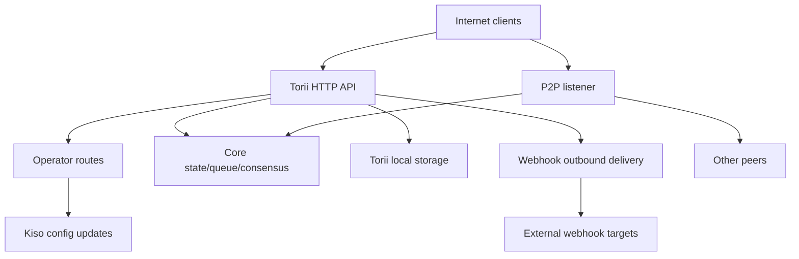

<!-- Auto-generated stub for Hebrew (he) translation. Replace this content with the full translation. -->

---
lang: he
direction: rtl
source: iroha-threat-model.md
status: complete
generator: scripts/sync_docs_i18n.py
source_hash: 766928cf0dcbfe3513c728bcf0b9fa697a330e8000bc6944ab61e8fcd59751ad
source_last_modified: "2026-02-07T13:27:25.009145+00:00"
translation_last_reviewed: 2026-04-02
translator: machine-google-reviewed
---

# Iroha דגם איום (ריפו: `iroha`)

## תקציר מנהלים
בפריסת בלוקצ'יין ציבורית חשופה לאינטרנט, שבה ניתן להגיע בכוונה לנתיבי מפעיל מהאינטרנט הציבורי אך חייבים להיות מאומתים באמצעות חתימות בקשות, וכאשר חיבורי אינטרנט/קבצים מצורפים מופעלים בנקודת הקצה הציבורית Torii, הסיכונים העיקריים הם: פגיעה במטוס המפעיל (בקשה שאינה מאומתת ב-I00X או הפעלה חוזרת של Sumeragi אחר NI מסלולי מפעיל), SSRF ושימוש לרעה ביציאה באמצעות מסירת חיבור לאינטרנט, ו-DoS במינוף גבוה באמצעות עסקאות/שאילתות + נקודות קצה של זרימה שבהן מגבלות תעריפים נאכפות על תנאי; בנוסף, כל תנוחת "נדרש mTLS" המסתמכת על נוכחות `x-forwarded-client-cert` ניתנת לזיוף כאשר Torii נחשף ישירות. הוכחות: `crates/iroha_torii/src/lib.rs` (נתב + תוכנת ביניים + מסלולי מפעיל), `crates/iroha_torii/src/operator_auth.rs` (הפעלה/השבתה של מפעיל + בדיקת `x-forwarded-client-cert`), `crates/iroha_torii/src/webhook.rs` (לקוח HTTP יוצא), Norito הגבלת קצב תנאי.

## היקף והנחותבהיקף (זמן ריצה / משטחי ייצור):
- Torii HTTP API שרת ותוכנות מתווך, כולל נתיבי "מפעיל", API של אפליקציה, חיבורים לאינטרנט, קבצים מצורפים, תוכן ונקודות קצה של סטרימינג: `crates/iroha_torii/`, `crates/iroha_torii_shared/`
- רצועת אתחול של צומת וחיווט רכיבים (Torii + P2P + שחקן עדכון מצב/תור/תצורה): `crates/irohad/src/main.rs`
- משטחי הובלה ולחיצת יד P2P: `crates/iroha_p2p/`
- צורות תצורה וברירות מחדל (במיוחד ברירות מחדל של Torii): `crates/iroha_config/src/parameters/{actual,defaults}.rs`
- עדכון תצורה מול לקוח DTO (מה `/v1/configuration` יכול לשנות): `crates/iroha_config/src/client_api.rs`
- יסודות אריזה של פריסה: `Dockerfile`, ותצורות לדוגמה ב-`defaults/` (אין להשתמש במפתחות לדוגמה משובצים בייצור).

מחוץ לתחום (אלא אם כן התבקש מפורשות):
- זרימות עבודה של CI ואוטומציה של שחרורים: `.github/`, `ci/`, `scripts/`
- ערכות SDK ואפליקציות לנייד/לקוח: `IrohaSwift/`, `java/`, `examples/`
- חומר לתיעוד בלבד: `docs/`הנחות מפורשות (בהתבסס על ההבהרות שלך):
- Torii חשוף לאינטרנט וניתן להגיע אליו על ידי לקוחות לא מאומתים (ייתכן שחלק מנקודות הקצה עדיין ידרשו חתימות או אישור אחר).
- מסלולי מפעיל (`/v1/configuration`, `/v1/nexus/lifecycle`, וטלמטריה/פרופילים עם גישה למפעיל כאשר הם מופעלים) נועדו להיות נגישים לציבור ועליהם לאמת באמצעות חתימה ממפתח פרטי הנשלט על ידי מפעיל. ראיות (מצב נוכחי): `crates/iroha_torii/src/lib.rs` (`add_core_info_routes` חל על `operator_layer`), `crates/iroha_torii/src/operator_auth.rs` (`enforce_operator_auth` / `authorize_operator_endpoint`).
- אימות חתימת המפעיל צריך להשתמש ברשימת היתרים מקומית של צומת של מפתחות ציבוריים של מפעיל בתצורה (לא מוצג כשער מפעיל מיושם בנתב הנוכחי). עדות לשער המפעיל הנוכחי: `crates/iroha_torii/src/operator_auth.rs` (`authorize_operator_endpoint`), ולעוזר חתימת בקשות קנוניות קיים (בניית הודעה): `crates/iroha_torii/src/app_auth.rs` (`canonical_request_message`).
- Torii לא בהכרח נפרס מאחורי כניסה מהימנה; לכן, יש להתייחס לכותרות כמו `x-forwarded-client-cert` כנשלטות על ידי תוקף כאשר Torii חשוף ישירות. ראיות: `crates/iroha_torii/src/lib.rs` (`HEADER_MTLS_FORWARD`, `norito_rpc_mtls_present`) ו-`crates/iroha_torii/src/operator_auth.rs` (`HEADER_MTLS_FORWARD`, `mtls_present`).
- Webhooks וקבצים מצורפים מופעלים בנקודת הקצה הציבורית Torii. עדות: `crates/iroha_torii/src/lib.rs` (מסלולים עבור `/v1/webhooks` ו-`/v1/zk/attachments`), `crates/iroha_torii/src/webhook.rs`, `crates/iroha_torii/src/zk_attachments.rs`.- המפעיל רשאי להגדיר או לשמור את `torii.require_api_token = false` (ברירת המחדל היא `false`). עדות: `crates/iroha_config/src/parameters/defaults.rs` (`torii::REQUIRE_API_TOKEN`).
- `/transaction` ו-`/query` צפויים להיות נגישים עבור רשת ציבורית. הערה: הם מסודרים בנוסף על ידי שלב ההשקה "Norito-RPC" ובדיקת נוכחות כותרת אופציונלית "נדרש mTLS". ראיות: `crates/iroha_torii/src/lib.rs` (`ConnScheme::from_request`, `evaluate_norito_rpc_gate`) ו-`crates/iroha_config/src/parameters/defaults.rs` (`torii::transport::norito_rpc::STAGE = "disabled"`).

שאלות פתוחות שישנו מהותית את דירוג הסיכון:
- היכן מוגדרים מפתחות ציבוריים למפעיל (איזה מפתח/פורמט תצורה), וכיצד מזוהים/מסובבים מפתחות (מזהה מפתח, מספר מפתחות פעילים, ביטול)?
- מהו הפורמט המדויק של הודעות החתימה על ידי המפעיל והגנת ההשמעה החוזרת (חותמת זמן/נון/מונה + מטמון הפעלה חוזרת בצד השרת), ואיזו מדיניות הטיית שעון מקובלת? עדות לכך שלעוזר הבקשה הקנוני הקיים אין טריות: `crates/iroha_torii/src/app_auth.rs` (`canonical_request_message`).
- עבור webhooks אנונימיים, האם Torii צפוי לאפשר יעדים שרירותיים, או שעליו לאכוף מדיניות יעד SSRF (לחסום RFC1918/localhost/link-local/metadata ולדרוש HTTPS באופן אופציונלי)?
- אילו תכונות Torii מופעלות ב-build שלך (`telemetry`, `profiling`, `p2p_ws`, `app_api_https`, `enforce=false`), והאם נעשה שימוש ב-I00X? עדות: `crates/iroha_torii/Cargo.toml` (`[features]`).

## דגם מערכת### רכיבים ראשיים
- **לקוחות אינטרנט** (ארנקים, מכשירי אינדקס, חוקרים, בוטים): שלח בקשות HTTP/Norito ופתח חיבורי WS/SSE.
- **Torii (HTTP API)**: נתב axum עם תוכנת ביניים ל-pre-author porting, אכיפת אסימון API אופציונלי, משא ומתן על גרסת API, הזרקת כתובת מרחוק ומדדים. עדות: `crates/iroha_torii/src/lib.rs` (`create_api_router`, `enforce_preauth`, `enforce_api_token`, `enforce_api_version`, `inject_remote_addr_header`).
- **מישור בקרת מפעיל/הסמכה (נוכחי) ותנוחה רצויה**: מסלולי המפעיל מוגנים כעת על ידי `operator_auth::enforce_operator_auth` (WebAuthn/אסימונים; ניתן להשבית ביעילות על ידי תצורה), אך דרישת הפריסה שלך היא אימות מפעיל מבוסס חתימה מאומת מול רשימת אישורים של מפתחות ציבוריים של מפעיל בהגדרות. מסייע להודעות בקשה קנונית קיים וניתן לעשות בו שימוש חוזר לבניית הודעות, אך יהיה צורך להתאים את האימות לשימוש במפתחות תצורה (לא בחשבונות של מדינה עולמית). הוכחות: `crates/iroha_torii/src/lib.rs` (`add_core_info_routes` משתמש ב-`operator_layer`), `crates/iroha_torii/src/operator_auth.rs` (`authorize_operator_endpoint`), `crates/iroha_torii/src/app_auth.rs` (Sumeragi00,1015000, Sumeragi, Sumeragi, Sumeragi).- **רכיבי צומת ליבה (בתהליך)**: תור עסקאות, מצב/WSV, קונצנזוס (Sumeragi), אחסון בלוק (Kura), שחקן עדכון תצורה (Kiso) וכו', הועברו ל-Torii. עדות: `crates/irohad/src/main.rs` (`Torii::new_with_handle(...)` מקבל `queue`, `state`, `kura`, `kiso`, `state`, `torii.start(...)`).
- **רשת P2P**: העברה מוצפנת, ממוסגרת עמית לעמית ולחיצת יד; TLS-over-TCP אופציונלי קיים אך מתיר בכוונה לאימות אישור. עדות: `crates/iroha_p2p/src/lib.rs` (סוג כינוי `NetworkHandle<..., X25519Sha256, ChaCha20Poly1305>`), `crates/iroha_p2p/src/transport.rs` (מודול `p2p_tls` עם `NoCertificateVerification`).
- **Torii התמדה מקומית**: `./storage/torii` ברירת המחדל של מדריך בסיס עבור קבצים מצורפים/רשתות/תורים. עדויות: `crates/iroha_config/src/parameters/defaults.rs` (`torii::data_dir()`), `crates/iroha_torii/src/webhook.rs` (מתמשך `webhooks.json`), `crates/iroha_torii/src/zk_attachments.rs` (מאוחסן תחת `./storage/torii/zk_attachments/`).
- **יעדי חיבור אינטרנט יוצאים**: Torii יכול להעביר אירועים לכתובות URL שרירותיות של `http://` (ו-`https://`/`ws(s)://` רק עם תכונות). עדות: `crates/iroha_torii/src/webhook.rs` (`http_post_plain`, `http_post_https`, `ws_send`).### זרימות נתונים וגבולות אמון
- לקוח אינטרנט → Torii HTTP API
  - נתונים: Norito בינארי (`SignedTransaction`, `SignedQuery`), JSON DTOs (API של אפליקציה), מנויי WS/SSE, כותרות (כולל `x-api-token`).
  - ערוץ: HTTP/1.1 + WebSocket + SSE (axum).
  - ערבויות: אסימון API אופציונלי (`torii.require_api_token`), חיבור מראש/קצב שער, משא ומתן על גרסת API; מטפלים רבים מיישמים הגבלת תעריף לכל נקודת קצה באופן מותנה (ניתן לעקוף כאשר `enforce=false`). עדות: `crates/iroha_torii/src/lib.rs` (`enforce_preauth`, `validate_api_token`, `handler_post_transaction`, `handler_signed_query`), `crates/iroha_torii/src/limits.rs` (Sumeragi).
  - אימות: מגבלות גוף על נקודות קצה מסוימות (למשל, עסקאות), פענוח Norito, חתימת בקשה עבור כמה נקודות קצה של אפליקציה (כותרות בקשות קנוניות). עדות: `crates/iroha_torii/src/lib.rs` (`add_transaction_routes` משתמש ב-`DefaultBodyLimit::max(...)`), `crates/iroha_torii/src/app_auth.rs` (`verify_canonical_request`).- לקוח אינטרנט → מסלולי "מפעיל" (Torii)
  - נתונים: עדכוני תצורה (`ConfigUpdateDTO`), תוכניות מחזור חיים של נתיב, טלמטריה/ניפוי באגים/סטטוס/מדדים (כאשר מופעל).
  - ערוץ: HTTP.
  - ערבויות: ריפו נוכחי משער את המסלולים האלה עם תוכנת הביניים `operator_auth::enforce_operator_auth`, שהיא למעשה ללא הפעלה כאשר `torii.operator_auth.enabled=false`; התנוחה הרצויה שלך היא אימות מבוסס חתימה באמצעות מפתחות ציבוריים של מפעיל מ-config, אשר יש ליישם ולאכוף בגבול זה (ואין להסתמך על `x-forwarded-client-cert` אם Torii חשוף ישירות). ראיות: `crates/iroha_torii/src/lib.rs` (`add_core_info_routes` חל על `operator_layer`), `crates/iroha_torii/src/operator_auth.rs` (`authorize_operator_endpoint`, `mtls_present`).
  - אימות: בעיקר ניתוח DTO; אין הרשאה קריפטוגרפית ב-`handle_post_configuration` עצמו (היא מאצילה ל-`kiso.update_with_dto`). עדות: `crates/iroha_torii/src/routing.rs` (`handle_post_configuration`).

- Torii ← תור ליבה/מצב/קונצנזוס (בתהליך)
  - נתונים: הגשת עסקאות, ביצוע שאילתה, קריאה/כתיבה של מצב, שאילתות טלמטריה בקונצנזוס.
  - ערוץ: שיחות Rust בתהליך (ידיות `Arc` משותפות).
  - ערבויות: גבול מהימן משוער; האבטחה תלויה בכך ש-Torii יבצע אימות/הרשאה נכונה של בקשות לפני הפעלת פעולות מורשות. עדות: `crates/irohad/src/main.rs` (חיווט `Torii::new_with_handle(...)`) ומטפלי Torii הקוראים ל-`routing::handle_*`.- Torii → Kiso (שחקן עדכון תצורה)
  - נתונים: `ConfigUpdateDTO` יכול לשנות רישום, P2P ACL, הגדרות רשת/תחבורה, לחיצת יד של SoraNet וכו'.
  - ערוץ: הודעה/טיפול בתהליך.
  - ערבויות: הרשאה צפויה בגבול Torii; עדכון DTO עצמו הוא בעל יכולת. עדות: `crates/iroha_config/src/client_api.rs` (שדות `ConfigUpdateDTO` כוללים `network_acl`, `transport.norito_rpc`, `soranet_handshake` וכו').

- Torii → דיסק מקומי (`./storage/torii`)
  - נתונים: רישום webhook ומשלוחים בתור; קבצים מצורפים ומטא נתונים של חיטוי; התנהגות GC/TTL.
  - ערוץ: מערכת קבצים.
  - ערבויות: הרשאות מערכת הפעלה מקומית (המכל פועל ללא שורש ב-Dockerfile); בידוד לוגי על ידי "דייר" מבוסס על אסימון API או כותרת IP מרחוק שהוזרקה על ידי תוכנת ביניים. ראיות: `Dockerfile` (`USER iroha`), `crates/iroha_torii/src/lib.rs` (`inject_remote_addr_header`, `zk_attachments_tenant`).

- Torii → יעדי Webhook (יוצא)
  - נתונים: עומסי אירועים + כותרת חתימה.
  - ערוץ: לקוח HTTP גולמי של TCP עבור `http://`; אופציונלי `hyper+rustls` עבור `https://` כאשר מופעל; WS/WSS אופציונלי כאשר מופעל.
  - ערבויות: פסקי זמן/נסיונות חוזרים; אין רשימת הרשאות יעד גלויה בקוד; כתובת האתר מושפעת מהתוקף אם webhook CRUD פתוח. עדות: `crates/iroha_torii/src/webhook.rs` (`handle_create_webhook`, `http_post_plain/http_post`).- P2P עמיתים (רשת לא מהימנה) → P2P העברה/לחיצת יד
  - נתונים: הקדמת לחיצת יד/מטא נתונים, הודעות מוצפנות ממוסגרות, הודעות קונצנזוס.
  - ערוץ: תחבורה P2P (TCP/QUIC/וכו', תלוי תכונה), מטענים מוצפנים; TLS-over-TCP אופציונלי מתיר במפורש לאימות אישור.
  - ערבויות: הצפנה ולחיצת יד חתומה בשכבת היישום; TLS שכבת תחבורה אינה מאמתת באמצעות אישור. עדות: `crates/iroha_p2p/src/lib.rs` (סוגי הצפנה), `crates/iroha_p2p/src/transport.rs` (`NoCertificateVerification` הערה ויישום).

#### תרשים

## נכסים ויעדי אבטחה| נכס | למה זה חשוב | יעד אבטחה (C/I/A) |
|---|---|---|
| מצב שרשרת / WSV / בלוקים | כשלי יושרה הופכים לכשלים בקונצנזוס; כשלים בזמינות עוצרים את השרשרת | I/A |
| חיים קונצנזוס (Sumeragi) | ערך הבלוקצ'יין הציבורי תלוי בייצור בלוקים מתמשך | א |
| מפתחות פרטיים של צומת (זהות עמיתים, מפתחות חתימה) | פשרה מפתחת מאפשרת השתלטות על זהות, ניצול לרעה של חתימה או חלוקת רשת | C/I |
| תצורת זמן ריצה (קיסו מעודכן) | שולט ב-ACLs ברשת ובהגדרות תחבורה; שימוש לרעה יכול להשבית את ההגנות או להכניס עמיתים זדוניים | אני |
| תור עסקאות / mempool | הצפה יכולה להרעיב את הקונצנזוס ולמצות את המעבד/זיכרון | א |
| Torii התמדה (`./storage/torii`) | מיצוי הדיסק יכול לקרוס את הצומת; נתונים מאוחסנים עשויים להשפיע על עיבוד במורד הזרם | A (ולפעמים C/I) |
| ערוץ webhook יוצא | ניתן לנצל לרעה עבור SSRF, חילוץ נתונים מרשתות פנימיות, או סריקה מ-IP יציאה מהימן | C/I/A |
| נתוני טלמטריה/מדדים/ניפוי באגים | יכול להדליף טופולוגיית רשת ומצב תפעולי שימושי עבור התקפות ממוקדות | ג |

## דגם תוקף### יכולות
- תוקף אינטרנט מרוחק ולא מאומת יכול לשלוח בקשות HTTP שרירותיות, להחזיק חיבורי WS/SSE ארוכים, ולהפעיל מחדש או לרסס מטענים (botnet).
- כל צד יכול ליצור מפתחות ולהגיש עסקאות/שאילתות חתומות (בלוקצ'יין ציבורי), כולל דואר זבל בנפח גבוה.
- עמית זדוני/נפרץ יכול להתחבר ל-P2P ולנסות שימוש לרעה בפרוטוקול, הצפה או מניפולציה של לחיצת יד בתוך אילוצים מותרים.
- אם webhook CRUD נחשף, התוקף יכול לרשום כתובות URL של webhook הנשלטות על ידי תוקף ולקבל התקשרויות חוזרות (ועלול לנתב אותן ליעדים פנימיים).

### אי-יכולות
- אין גישה ישירה למערכת קבצים מקומית ללא נקודת קצה חשופה או הרשאות אמצעי אחסון לא מוגדרות.
- אין יכולת לזייף חתימות עבור מפתחות עמיתים/מפעילים קיימים ללא פשרות מפתח.
- אין יכולת משוערת לשבור קריפטוגרפיה מודרנית (X25519, ChaCha20-Poly1305, Ed25519) בתנאים רגילים.

## נקודות כניסה ומשטחי התקפה| משטח | איך הגיעו | גבול אמון | הערות | עדות (נתיב ריפו / סמל) |
|---|---|---|---|---|
| `POST /transaction` | אינטרנט HTTP | אינטרנט → Torii | Norito עסקה חתומה בינארית; הגבלת התעריף מותנית (`enforce` יכול להיות שקר) | `crates/iroha_torii/src/lib.rs` (`handler_post_transaction`, `ConnScheme::from_request`) |
| `POST /query` | אינטרנט HTTP | אינטרנט → Torii | Norito שאילתה חתומה בינארית; הגבלת התעריף מותנית (`enforce` יכול להיות שקר) | `crates/iroha_torii/src/lib.rs` (`handler_signed_query`) |
| שער Norito-RPC | כותרות HTTP באינטרנט | אינטרנט → Torii | שלב השקה + "נדרש mTLS" אופציונלי באמצעות נוכחות כותרת; הקנרית משתמשת ב-`x-api-token` | `crates/iroha_torii/src/lib.rs` (`evaluate_norito_rpc_gate`, `HEADER_MTLS_FORWARD`) |
| `POST/GET/DELETE /v1/webhooks...` | אינטרנט HTTP (API של אפליקציה) | אינטרנט → Torii → יוצא | אנונימי בעיצובו; webhook CRUD מאפשר מסירה יוצאת לכתובות URL שרירותיות; סיכון SSRF | `crates/iroha_torii/src/lib.rs` (`handler_webhooks_*`), `crates/iroha_torii/src/webhook.rs` (`http_post`) |
| `POST/GET /v1/zk/attachments...` | אינטרנט HTTP (API של אפליקציה) | אינטרנט → Torii → דיסק | אנונימי בעיצובו; חיטוי חיבור + דקומפרסיה + התמדה; משטח מיצוי הדיסק/מעבד (השכרה היא אסימון API אם מופעל, אחרת IP מרוחק באמצעות כותרת מוזרקת) | `crates/iroha_torii/src/lib.rs` (`handler_zk_attachments_*`, `zk_attachments_tenant`), `crates/iroha_torii/src/zk_attachments.rs` || `GET /v1/content/{bundle}/{path...}` | אינטרנט HTTP | אינטרנט → Torii → מצב/אחסון | תומך במצבי אישור + PoW + Range; מגביל יציאה | `crates/iroha_torii/src/content.rs` (`handle_get_content`, `enforce_pow`, `enforce_auth`) |
| סטרימינג: `/v1/events/sse`, `/events` (WS), `/block/stream` (WS) | אינטרנט | אינטרנט → Torii | קשרים ארוכים; משטח DoS | `crates/iroha_torii/src/lib.rs` (`add_network_stream_routes`) |
| `GET/POST /v1/configuration` | אינטרנט HTTP | אינטרנט ← מסלולי מפעיל ← קיסו | כוונת פריסה: חתימות מפעיל מאומתות מול מפתחות רשימת ההיתרים של תצורה; ה-repo הנוכחי מגן עליו רק באמצעות תוכנת מפעיל (ללא שער חתימה מוצג בקבוצת המסלול) ומאציל את אפליקציית העדכון ל-Kiso | I18NIS עוזר חתימת בקשה קנונית) |
| `POST /v1/nexus/lifecycle` | אינטרנט HTTP | אינטרנט → מסלולי מפעיל → ליבה | נקודת קצה של מפעיל מיועדת לאימות חתימה; שמור כרגע על ידי תוכנת המפעיל ויכול להפוך לציבורי אם אישור המפעיל מושבת | `crates/iroha_torii/src/lib.rs` (`add_core_info_routes`, `handler_post_nexus_lane_lifecycle`), `crates/iroha_torii/src/operator_auth.rs` (`authorize_operator_endpoint`) || נקודות קצה של טלמטריה/פרופילים (מגודרים לתכונות) | אינטרנט HTTP | אינטרנט → מסלולי מפעיל | קבוצות מסלולים עם סגירת מפעיל; אם אישור המפעיל מושבת ואין שער חתימה, אלה הופכים לציבוריים ועשויים לדלוף נתונים תפעוליים או להיות וקטורים של DoS | `crates/iroha_torii/src/lib.rs` (`add_telemetry_routes`, `add_profiling_routes`), `crates/iroha_torii/src/operator_auth.rs` (`authorize_operator_endpoint`) |
| העברות P2P TCP/TLS | אינטרנט / רשת עמיתים | אינטרנט/עמיתים → P2P | מסגרות P2P מוצפנות + לחיצת יד; אימות אישור TLS מתיר כשהוא מופעל | `crates/iroha_p2p/src/lib.rs` (`NetworkHandle`), `crates/iroha_p2p/src/transport.rs` (`p2p_tls::NoCertificateVerification`) |

## נתיבי התעללות מובילים

1. **מטרת התוקף: השתלטות על התנהגות הצומת באמצעות עדכוני תצורת זמן ריצה**
   1) מצא Torii חשוף לאינטרנט שבו ניתן להגיע לנתיבי המפעיל ואימות המפעיל נעדר/ניתן לעקוף (למשל, אישור המפעיל מושבת וללא שער חתימה).  
   2) `POST /v1/configuration` עם `ConfigUpdateDTO` שמשחרר רשתות ACL או משנה הגדרות תחבורה.  
   3) הצטרף בתור עמית או לגרום למחיצה/תצורה שגויה; לפגוע בקונצנזוס ו/או לנתב עסקאות באמצעות תשתית הנשלטת על ידי תוקף.  
   השפעה: פגיעה בשלמות ובזמינות של הצומת (ואולי הרשת).2. **מטרת התוקף: השמעה חוזרת של בקשה שנתפסה בחתימת מפעיל**
   1) השג בקשת מפעיל חתומה חוקית אחת (למשל, באמצעות מכשיר מפעיל שנפגע, יומני proxy עם הגדרות שגויות או סביבה שבה TLS נסגר בצורה לא בטוחה).  
   2) הפעל מחדש את אותה בקשה מול מסלולי מפעיל ציבורי אם תוכנית החתימה חסרה רעננות (חותמת זמן/לא) ודחיית שידור חוזר בצד השרת.  
   3) לגרום לשינויי תצורה חוזרים ונשנים, לחזרה לאחור או להחלפות מאולצות שפוגעות בזמינות או מחלישות את ההגנות.  
   השפעה: התפשרות על שלמות/זמינות למרות "אישור חתימה".  

3. **מטרת התוקף: השבת/הגנת שער על ידי שינוי השקת Norito-RPC**
   1) `POST /v1/configuration` לעדכון `transport.norito_rpc.stage` או `require_mtls`.  
   2) פתיחה או סגירה בכוח של `/transaction` ו-`/query`, ומשפיעות על בקרות הזמינות והכניסה.  
   השפעה: הפסקה ממוקדת או עקיפת בקרת כניסה.4. **מטרת התוקף: SSRF לרשת הפנימית של המפעיל**
   1) צור ערך webhook המצביע על יעד פנימי (למשל, מארח RFC1918, מטא נתונים IP, מישור בקרה) באמצעות `POST /v1/webhooks`.  
   2) המתן לאירועים תואמים; Torii מספק בקשות HTTP יוצאות מעמדת הרשת שלו.  
   3) השתמש בתגובות/סטטוסים/תזמון ובניסיונות חוזרים ונשנים כדי לחקור שירותים פנימיים (ועלולה להסתנן אם תוכן תגובה יופיע אי פעם במקום אחר).  
   השפעה: חשיפת רשת פנימית, פיגומי תנועה לרוחב, פגיעה במוניטין, חשיפת אישורים פוטנציאלית באמצעות נקודות קצה של מטא נתונים.  

5. **מטרת התוקף: מניעת שירות של קבלה לעסקה/שאילתה**
   1) הציפו את `POST /transaction` ו-`POST /query` בגופי Norito תקפים/לא חוקיים.  
   2) שמור על מנויי WS/SSE רבים ולקוחות איטיים.  
   3) נצל הגבלת קצב מותנה (`enforce=false`) בפעולה רגילה כדי למנוע מצערת.  
   השפעה: מיצוי מעבד/זיכרון, רוויה בתור, עצירות קונצנזוס.  

6. **מטרת התוקף: פליטת דיסק באמצעות קבצים מצורפים**
   1) הציף את `/v1/zk/attachments` עם מטענים בגודל מקסימלי ו/או ארכיונים דחוסים ליד מגבלות הרחבה.  
   2) השתמש בכתובות IP מרובות (או כל חולשה במפתח דייר) כדי להימנע ממכסים לכל דייר.  
   3) התמיד עד לפיגור של TTL/GC; מילוי `./storage/torii`.  
   השפעה: קריסת צומת, חוסר יכולת לעבד בלוקים/עסקאות.7. **מטרת התוקף: עקוף שערי "נדרש mTLS" כאשר Torii חשוף ישירות**
   1) המפעיל מאפשר `require_mtls` עבור Norito-RPC או אישור מפעיל.  
   2) התוקף שולח בקשות עם `x-forwarded-client-cert: <anything>`.  
   3) בדיקת נוכחות של כותרת עוברת אם אין כניסה מהימנה מפשיטה את הכותרת.  
   השפעה: בקרות יושמו לא נכון; המפעיל מאמין ש-mTLS נאכף כשלא.  

8. **מטרת התוקף: פגיעה בקישוריות עמיתים / צריכת משאבים**
   1) עמית זדוני מנסה שוב ושוב לחיצות ידיים או מציף מסגרות ליד גדלים מקסימליים.  
   2) נצל את שכבת ההובלה המתירנית (אם מופעל) כדי למנוע דחייה מוקדמת על סמך אישורים.  
   השפעה: נטישת חיבור, שימוש במעבד, זמינות עמיתים מופחתת.  

9. **מטרת התוקף: חיפוש מחדש באמצעות טלמטריה/ניפוי באגים**
   1) אם טלמטריה/פרופילים מופעלים ואימות מפעיל חסר/ניתן לעקוף, גרד את `/status`, `/metrics`, בצע ניפוי באגים.  
   2) השתמש בנתוני טופולוגיה/בריאות שדלפו כדי לתזמן התקפות ולמקד רכיבים ספציפיים.  
   השפעה: עלייה בשיעור ההצלחה של התוקף; חשיפת מידע אפשרית.  

## טבלת מודל איומים| מזהה איום | מקור איום | דרישות קדם | פעולת איום | השפעה | נכסים מושפעים | בקרות קיימות (ראיות) | פערים | הקלות מומלצות | רעיונות איתור | סבירות | חומרת ההשפעה | עדיפות |
|---|---|---|---|---|---|---|---|---|---|---|---|---|| TM-001 | תוקף אינטרנט מרוחק | Torii חשוף לאינטרנט; מסלולי המפעיל הם ציבוריים; אישור מפעיל נעדר/ניתן לעקוף או אישור מפעיל מבוסס חתימה אינו מיושם/מיושם בצורה לא נכונה | הפעל מסלולי מפעיל (לדוגמה, `/v1/configuration`, `/v1/nexus/lifecycle`) כדי לשנות את תצורת זמן הריצה, רשימות ACL של רשת או הגדרות תחבורה | השתלטות/מחיצה על צומת; להודות בני גילם זדוניים; השבת הגנות | תצורת זמן ריצה; חיים קונצנזוס; שלמות השרשרת; מפתחות עמיתים | מסלולי המפעיל נמצאים מאחורי תוכנת התווך של המפעיל, אך `authorize_operator_endpoint` מחזירה `Ok(())` כאשר היא מושבתת; נציגי עדכון תצורה ל-Kiso ללא אישור נוסף. עדויות: `crates/iroha_torii/src/lib.rs` (`add_core_info_routes`), `crates/iroha_torii/src/operator_auth.rs` (`authorize_operator_endpoint`), `crates/iroha_torii/src/routing.rs` (`handle_post_configuration`), Sumeragi018NI0000I (23NI000000010018NI) | אין אישור מפעיל מבוסס חתימה המוצג בקבוצות נתיב מפעיל; "mTLS" מבוסס כותרות ניתן לזיוף כאשר Torii חשוף ישירות; הגנת השמעה חוזרת לא מוגדרת | הטמעת אישור מפעיל מבוסס-חתימה חובה עבור מסלולי מפעיל מאומתים מול רשימת הרשאות תצורה של מפתחות ציבוריים למפעיל (תמוך במספר מפתחות + מזהי מפתח); כלול רעננות (חותמת זמן + nonce) עם מטמון שידור חוזר מוגבל; לאכוף TLS מקצה לקצה (אל תסמוך על `x-forwarded-client-cert`); החל מגבלות תעריף קפדניות + רישום ביקורת על כל פעולות המפעיל | התראה על כל פגיעה בנתיב המפעיל; הבדלים בתצורת יומן ביקורת; לזהות חתימות/אינונסים חוזרים; עקוב אחר עדכון חריגתדירות וכתובות IP של מקור | גבוה (עד יישום הגנה על אישור חתימה + הפעלה חוזרת) | גבוה | **קריטי** || TM-002 | תוקף אינטרנט מרוחק | Webhook CRUD הוא אנונימי וניתן לגישה לאינטרנט; ללא מדיניות יעד SSRF | צור webhooks הממקדים לכתובות URL פנימיות/פריבילגיות ומפעילים משלוחים | SSRF, סריקה פנימית, חשיפת אישורי מטא נתונים ו-DoS יוצאים | ערוץ Webhook; רשת פנימית; זמינות | Webhooks קיימים; משלוחים משתמשים בתקופות זמן קצוב/גיבוי/נסיונות מקסימליים; משלוח `http://` משתמש ב-TCP גולמי. ראיות: `crates/iroha_torii/src/lib.rs` (`handler_webhooks_*`), `crates/iroha_torii/src/webhook.rs` (`handle_create_webhook`, `http_post_plain`, `WebhookPolicy`) | אין רשימת הרשאות יעד / חסימות טווח IP; `http://` מותר; בקרות חיבור מחדש/הפניה מחדש של DNS אינם גלויים; הגבלת קצב webhook CRUD מותנית (עשויה להיות כבויה ביעילות במצב יציב) | השאר את ה-webhooks פעילים אך הוסף בקרות SSRF: חסום טווחי IP ושמות מארח פרטיים/loopback/link-local/metadata, פתרון + כתובות סיכה, הגבלת הפניות מחדש, הגבלת במקביליות יוצאת; מכיוון שהיצירה היא אנונימית, הוסף מכסות תמידיות לכל IP + מכסים גלובליים ושקול אסימון PoW אופציונלי ליצירה/עדכונים של webhook | כתובת אתר יעד של יומן ו-Metric webhook + כתובות IP שנפתרו; התראה על יעדים חסומים; התראה על ניסיונות IP פרטיים ושיעורי כישלון/ניסיון חוזר גבוהים; צג webhook CRUD קצב ורוויה בתור | גבוה | גבוה | **קריטי** || TM-003 | תוקף אינטרנט / דואר זבל מרחוק | Public `/transaction` ו-`/query`; הגבלת שיעור מותנה לא נאכפת במצבים נפוצים | הגשת TX/שאילתה של Flood, בתוספת זרמי WS/SSE | מיצוי מעבד/זיכרון; רוויה בתור; דוכני קונצנזוס | זמינות (Torii + קונצנזוס); תור/מפול | שער אישור מראש מגביל חיבורים לכל IP ויכול לחסום. ראיות: `crates/iroha_torii/src/lib.rs` (`enforce_preauth`), `crates/iroha_torii/src/limits.rs` (`PreAuthGate`) | מגבילי שער מפתח רבים הם מותנים (`allow_conditionally` מחזירה אמת כאשר `enforce=false`); תוקפים מבוזרים עוקפים מגבלות לכל IP | הוסף מגבלות תעריף תמידיות עבור TX/שאילתה/זרמים כאשר הם חשופים לאינטרנט; הוסף מגבלות תעריפים הניתנות להגדרה לכל נקודת קצה ללא תלות במדיניות העמלות; להגן על נקודות קצה יקרות עם PoW או לדרוש מכסות מבוססות חתימה/חשבון | צג: דחיות של אישור מראש, אורך תור, קצבי TX/שאילתה, חיבורים פעילים של WS/SSE; התראה על חריגות ומגבלות קיבולת מתמשכות | גבוה | גבוה | **גבוה** || TM-004 | תוקף אינטרנט מרוחק | תכונות טלמטריה/פרופילים מופעלות; אישור מפעיל מושבת או שער חתימה חסר | גרד `/status`, `/metrics`, איתור באגים בנקודות קצה; בקש סטטוס ניפוי באגים יקר | חשיפת מידע; DoS תפעולי; הפעלת תקיפה ממוקדת | נתוני טלמטריה/ניפוי באגים; זמינות | קבוצות מסלולי טלמטריה/פרופילים מגוונות עם `operator_auth::enforce_operator_auth`. ראיות: `crates/iroha_torii/src/lib.rs` (`add_telemetry_routes`, `add_profiling_routes`), `crates/iroha_torii/src/operator_auth.rs` (`authorize_operator_endpoint`) | תוכנת התווך של המפעיל אינה פועלת כאשר היא מושבתת; אישור מפעיל מבוסס חתימה אינו מוצג בקבוצות הנתיבים הללו | דרוש את אותו אישור מפעיל מבוסס-חתימה חובה עבור קבוצות המסלולים הללו; הוסף מגבלות קצב קשיח ושמירה במטמון במידת האפשר; הימנע מחשיפת נקודות קצה/ניפוי באגים בצמתים ציבוריים כברירת מחדל | עקוב אחר יומני גישה; התראה על דפוסי גרידה ובקשות מתמשכות בעלות גבוהה | בינוני | בינוני | **בינוני** || TM-005 | תוקף אינטרנט מרוחק (ניצול שגוי של הגדרות) | המפעיל מאפשר `require_mtls` אך Torii חשוף ישירות (או חיטוי פרוקסי/כותרות אינו מובטח) | זיוף `x-forwarded-client-cert` כדי לעמוד בבדיקות "נדרש mTLS" | תחושת ביטחון כוזבת; עוקף שער עבור Norito-RPC / מדיניות אישור מפעיל | גבול מפעיל/סמכות; בקרת קבלה | `require_mtls` נבדק על ידי נוכחות כותרת. עדות: `crates/iroha_torii/src/lib.rs` (`HEADER_MTLS_FORWARD`, `norito_rpc_mtls_present`), `crates/iroha_torii/src/operator_auth.rs` (`mtls_present`) | אין אימות קריפטוגרפי של אישור לקוח ב-Torii; מסתמך על חוזה כניסה חיצוני | אל תסתמך על `x-forwarded-client-cert` לאבטחה כאשר Torii נגיש לציבור; אם נדרש mTLS, אכוף אימות אישור לקוח ב-Torii או בכניסה מהימנה שמסירת את כותרות הלקוח; אחרת הסר/התעלם מהשער מבוסס הכותרות לפריסות הפונות לאינטרנט | התראה על כל בקשה המכילה `x-forwarded-client-cert` שמגיעה ישירות ל-Torii; תוצאות שער יומן עבור Norito-RPC ואישור מפעיל; מעקב אחר שינויים פתאומיים בתנועה המותרת | גבוה | גבוה | **גבוה** || TM-006 | תוקף אינטרנט מרוחק | נקודות הקצה של קבצים מצורפים הן אנונימיות וניתנות לגישה לאינטרנט; התוקף יכול לשלוח מטענים בגודל מקסימלי או פצצת דחיסה | שימוש לרעה בחומר חיטוי/פירוק/התמדה כדי לצרוך מעבד/דיסק | חוסר יציבות של צומת; תשישות דיסק; תפוקה מושפלת | אחסון Torii; זמינות | קיימות מגבלות חיבור + חיטוי ועומק מקסימלי של הרחבה/ארכיון. ראיות: `crates/iroha_config/src/parameters/defaults.rs` (`ATTACHMENTS_MAX_BYTES`, `ATTACHMENTS_MAX_EXPANDED_BYTES`, `ATTACHMENTS_MAX_ARCHIVE_DEPTH`, `ATTACHMENTS_SANITIZER_MODE`), `crates/iroha_torii/src/zk_attachments.rs` (Sumeragi, מגבלות), `crates/iroha_torii/src/lib.rs` (`handler_zk_attachments_*`, `zk_attachments_tenant`) | זהות הדייר מבוססת בעיקרה על IP כאשר אסימוני API כבויים; מקורות מבוזרים עוקפים מכסים; TTL עדיין מאפשר צבירה של מספר ימים | מכיוון שקבצים מצורפים חייבים להיות גלויים לציבור ואנונימיים, אכוף מכסות דיסק גלובליות + לחץ אחורי, הדק את ברירות המחדל (TTL/max bytes), שמור על חיטוי במצב תת-תהליכים עם ארגז חול ברמת מערכת ההפעלה, ושקול PoW gating אופציונלי לכתיבה; ודא שלא ניתן לעקוף מכסות לכל IP על ידי כותרות מזויפות (המשך להשתמש ב-`inject_remote_addr_header`) | עקוב אחר השימוש בדיסק של `./storage/torii`; התראה על קצב יצירת קבצים מצורפים, דחיות של חומרי חיטוי והצטברות לכל דייר; עקוב אחר השהיית GC | בינוני | גבוה | **גבוה** || TM-007 | עמית זדוני | עמית יכול להגיע למאזין P2P; אופציונלי TLS מופעל | לחיצות ידיים/מסגרות הצפה; ניסיון מיצוי משאבים; נצל TLS מתירני כדי למנוע דחייה מוקדמת | פגיעה בקישוריות; שריפת משאבים; חלוקה חלקית | זְמִינוּת; קישוריות עמיתים | מסגרות מוצפנות + שגיאות לחיצת יד עבור הודעות גדולות מדי. עדות: `crates/iroha_p2p/src/lib.rs` (`Error::FrameTooLarge`, שגיאות לחיצת יד), `crates/iroha_p2p/src/transport.rs` (`p2p_tls` מתירנית אך צפויה לחיצת יד חתומה בשכבת אפליקציה) | שכבת התחבורה אינה מאמת; DoS אפשרי לפני אימות ברמה גבוהה יותר; ייתכן שהמחסות לפי עמית/IP אינן מספיקות | הוסף מגבלות חיבור קפדניות לכל IP/ASN; ניסיונות לחיצת יד מגבלת שיעור; שקול לדרוש מפתחות עמיתים ברשימה הרשמית בצמתים ציבוריים; ודא שגדלים מקסימליים של מסגרת הם שמרניים; הוסף לחץ אחורי ונפילה מוקדמת עבור עמיתים לא מאומתים | מעקב אחר קצב חיבור P2P נכנס; התראה על כשלים חוזרים ונשנים של לחיצת יד ושגיאות פריים גדולות מדי | בינוני | בינוני | **בינוני** || TM-008 | שגיאת שרשרת אספקה ​​/ מפעיל | המפעיל פורס עם מפתחות/הגדרות לדוגמה; תלות נפגעת | השתמש במקשי ברירת מחדל/דוגמה או ברירות מחדל לא מאובטחות; חטיפת תלות | פשרה מפתח; מחיצת שרשרת; אובדן מוניטין | מפתחות; שְׁלֵמוּת; זמינות | Docker פועל ללא בסיס ומעתיק ברירת מחדל ל-`/config`. עדות: `Dockerfile` (`USER iroha`, `COPY defaults ...`) | תצורות לדוגמה עשויות להכיל מפתחות פרטיים מוטבעים לדוגמה; ברירות מחדל לא מאובטחות כמו `require_api_token=false` ו-`operator_auth.enabled=false` | הוסף אזהרות אתחול/בדיקות סגורות כשלו בעת זיהוי מפתחות לדוגמה ידועים; שלח פרופיל תצורה מוקשה "צומת ציבורי"; לאכוף בדיקות `cargo deny`/SBOM בצינור השחרור | שער CI לסודות ב-`defaults/`; אזהרת יומן זמן ריצה על שילובי תצורה לא מאובטחים | בינוני | גבוה | **גבוה** || TM-009 | תוקף אינטרנט מרוחק | אישור מפעיל מבוסס חתימה מיושם ללא טריות; התוקף יכול לראות לפחות בקשת מפעיל חתומה חוקית אחת | הפעל מחדש בקשת מפעיל חתומה חוקית בעבר כנגד מסלולי מפעיל ציבורי | שינויים חוזרים בתצורה/חזרה לאחור; הפסקות ממוקדות; היחלשות הגנות | תצורת זמן ריצה; זְמִינוּת; תקינות הביקורת | עוזר החתימה הקנונית בונה הודעה מ-method/path/query/body-hash ואינו כולל חותמת זמן/nonce. עדות: `crates/iroha_torii/src/app_auth.rs` (`canonical_request_message`) | הגנת השמעה חוזרת אינה טבועה בחתימות; מסלולי מפעיל כרגע אינם מציגים מטמון חוזר/מעקב אחר לא | כלול `timestamp` + `nonce` (או מונה מונוטוני) בהודעה החתומה, אכוף הטיית שעון הדוקה, ושמור על מטמון של הפעלה חוזרת מוגבלת הממוקמת על ידי זהות המפעיל; התחבר ודחה כפילויות | התראה על כפילויות של אי-הודעות/-hash של בקשה; מתאם פעולות מפעיל לפי זהות ומקור; הוסף מדדים לדחיות שידור חוזר | בינוני | גבוה | **גבוה** || TM-010 | תוקף מרחוק / פנימי | מפתח פרטי חתימת מפעיל מאוחסן היכן שניתן לחלץ אותו (פריטים בדיסק/תצורה/CI) | לגנוב מפתח פרטי למפעיל ולהנפיק בקשות מפעיל חתומות חוקיות | פשרה מלאה של מטוס מפעיל עם יכולת זיהוי נמוכה | מפתחות מפעיל; תצורת זמן ריצה; חיים קונצנזוס | חלק מרכיבי Torii כבר טוענים מפתחות פרטיים מתצורה (למשל, מפתח מפעיל מנפיק לא מקוון). עדות: `crates/iroha_torii/src/lib.rs` (קורא את `torii.offline_issuer.operator_private_key` לתוך `KeyPair`), `Dockerfile` (פועל כלא שורש) | אחסון/סיבוב מפתחות/שימוש ב-HSM לא נאכף על ידי קוד; אישור חתימה יירש את הסיכון הזה | השתמש במפתחות מגובי חומרה (HSM/מובלעת מאובטחת) במידת האפשר; הימנע מהטמעת מפתחות מפעיל ב-repo או בתצורה הניתנת לקריאה בעולם; לאכוף הרשאות וסיבוב קבצים קפדניים; שקול ריבוי סיג/סף עבור פעולות מפעיל | התראה על פעולות מפעיל מכתובות IP/ASN חדשות; לשמור על יומן ביקורת בלתי משתנה של פעולות המפעיל; סובב מפתחות בחשד | בינוני | גבוה | **גבוה** |

## כיול ביקורתיות

עבור ריפו זה + הקשר פריסה מובהר (שרשרת ציבורית חשופה לאינטרנט; מסלולי מפעיל הם ציבוריים ומיועדים לאימות חתימה; אין כניסה מהימנה מובטחת), רמות חומרה אומרות:- **קריטי**: תוקף מרוחק ולא מאומת יכול לשנות את התנהגות הצומת/רשת או לעצור באופן מהימן את ייצור החסימות בצמתים רבים.
  - דוגמאות: אישור חתימה חסר/ניתן לעקוף עבור נתיבי מפעיל כמו `/v1/configuration` (TM-001); חיבור אינטרנט של SSRF לנקודות קצה של מטא נתונים/מישור שליטה באשכולות מיציאה מיוחסת (TM-002); גניבת מפתח חתימת מפעיל המאפשרת פעולות תקפות של מפעיל חתום (TM-010).

- **גבוה**: תוקף מרוחק יכול לגרום ל-DoS מתמשך של צומת או לעקוף בקרת אבטחה שמפעילים עשויים לסמוך עליה, עם תנאים מוקדמים מציאותיים.
  - דוגמאות: הודעות טקסט/שאילתות בנפח גבוה DoS כאשר הגבלת שיעור מותנה אינה פעילה (TM-003); מיצוי דיסק/CPU מונע על ידי קבצים (TM-006); שידור חוזר של בקשת מפעיל חתומה שנתפסה אם חסר דחיית רעננות/שידור חוזר (TM-009).

- **בינוני**: התקפות שמסייעות באופן משמעותי לאיתור או פוגעות בביצועים, אך הן מוגנות לתכונות, מצריכות עמדת תוקף מוגבהת, או שיש להן כבר הקלה משמעותית.
  - דוגמאות: חשיפה לטלמטריה/פרופילים כאשר מופעלת (TM-004); לחיצת יד P2P הצפה עם רדיוס פיצוץ מוגבל (TM-007).- **נמוך**: התקפות הדורשות תנאים מוקדמים לא סבירים, רדיוס פיצוץ מוגבל, או רובי רגל מבצעיים בעיקר עם הקלה קלה.
  - דוגמאות: דליפות מידע מינוריות מנקודות קצה ציבוריות לקריאה בלבד שצפויות להיות ציבוריות עבור בלוקצ'יין (למשל, `/v1/health`, `/v1/peers`) והן שימושיות בעיקר לריקול ולא לפשרה ישירה (לא ממוינים כאן כאיומים מובילים). עדות: `crates/iroha_torii_shared/src/lib.rs` (`uri::HEALTH`, `uri::PEERS`).

## נתיבי מיקוד לבדיקת אבטחה| נתיב | למה זה חשוב | מזהי איומים קשורים |
|---|---|---|
| `crates/iroha_torii/src/lib.rs` | בניית נתב, הזמנת תוכנת אמצעית, קבוצות נתיב מפעיל, מטפלי TX/שאילתות, החלטות אישור/הגבלה של קצב, וחיווט API של אפליקציות (webhooks/קבצים מצורפים) | TM-001, TM-002, TM-003, TM-004, TM-005, TM-006 |
| `crates/iroha_torii/src/operator_auth.rs` | הפעלה/השבתה של אישור מפעיל; בדיקת mTLS מבוססת כותרת; הפעלות/אסימונים; קריטי להגנה על מטוס מפעיל ולהבנת תנאי מעקף | TM-001, TM-004, TM-005 |
| `crates/iroha_torii/src/routing.rs` | מטפלי `/v1/configuration` מעבירים ל-Kiso ללא אישור נוסף; שטח פנים גדול של מטפלים | TM-001, TM-003 |
| `crates/iroha_config/src/client_api.rs` | מגדיר יכולות `ConfigUpdateDTO` (רשתות ACL, שינויי תחבורה, עדכוני לחיצת יד) | TM-001, TM-009 |
| `crates/iroha_config/src/parameters/defaults.rs` | תנוחת ברירת המחדל עבור אסימוני API/אישור מפעיל/שלב Norito-RPC; ברירת מחדל של קבצים מצורפים | TM-003, TM-006, TM-008 |
| `crates/iroha_torii/src/webhook.rs` | תמיכה בלקוח HTTP יוצא וסכימת; משטח SSRF; עובד התמדה ומשלוח | TM-002 |
| `crates/iroha_torii/src/zk_attachments.rs` | חיטוי חיבורים, מגבלות שחרור, התמדה, מפתוח דייר | TM-006 |
| `crates/iroha_torii/src/limits.rs` | עוזרים להגבלת שער ושיעור מראש; התנהגות אכיפה מותנית | TM-003 |
| `crates/iroha_torii/src/content.rs` | הגבלת אימות/PoW/טווח ויציאה של נקודות תוכן של תוכן; שיקולי data exfil ו-DoS | TM-003 || `crates/iroha_torii/src/app_auth.rs` | חתימת בקשה קנונית (בניית הודעה ואימות חתימה); שיקולי סיכון להפעלה חוזרת אם נעשה שימוש חוזר לצורך אישור מפעיל | TM-001, TM-003, TM-009 |
| `crates/iroha_p2p/src/lib.rs` | אפשרויות קריפטו, מגבלות מסגור, טיפול בשגיאות לחיצת יד; משטח סיכון P2P | TM-007 |
| `crates/iroha_p2p/src/transport.rs` | TLS-over-TCP מתירנית; התנהגויות תחבורה משפיעות על משטח DoS | TM-007 |
| `crates/irohad/src/main.rs` | Bootstraps Torii + P2P + שחקן עדכון תצורה; קובע אילו משטחים מופעלים | TM-001, TM-008 |
| `defaults/nexus/config.toml` | תצורה לדוגמה עשויה לכלול מפתחות דוגמה מוטבעים וכתובות איגד ציבוריות; פריסה רובי רגל | TM-008 |
| `Dockerfile` | משתמש/הרשאות זמן ריצה של מיכל והכללת תצורת ברירת מחדל (חומר מפתח וחשיפה במטוס המפעיל רגישים לפריסה) | TM-008, TM-010 |### בדיקת איכות
- נקודות כניסה מכוסות: tx/שאילתה, סטרימינג, webhooks, קבצים מצורפים, תוכן, מפעיל/תצורה, טלמטריה/פרופילים (מגודרים לתכונות), P2P.
- גבולות אמון מכוסים באיומים: אינטרנט → Torii, Torii → Kiso/core/disk, Torii → יעדי webhook, עמיתים → P2P.
- הפרדת זמן ריצה לעומת CI/dev: CI/docs/mobile מחוץ לתחום במפורש.
- הבהרות משתמשים באות לידי ביטוי: חשופים לאינטרנט, מסלולי המפעיל הם ציבוריים אך צריכים להיות מאומתים בחתימה, ללא כניסה מהימנה מובטחת, חיבורי אינטרנט/קבצים מצורפים מופעלים בנקודת קצה ציבורית Torii.
- הנחות/שאלות פתוחות המפורטות במפורש ב"היקף והנחות".

## הערות על השימוש
- מסמך זה מקורקע בכוונה מחדש (עוגני ראיות מצביעים על הקוד הנוכחי); מספר אמצעי הגנה בעדיפות גבוהה (שער חתימת מפעיל, מדיניות יעד של webhook SSRF) דורשות קוד/תצורה חדשים שאינם קיימים עדיין.
- התייחס לכל אותות "mTLS" המבוססים על כותרות (למשל, `x-forwarded-client-cert`) כנשלטים על ידי תוקף, אלא אם כן גורם כניסה מהימן מסיר ומחדיר אותם.