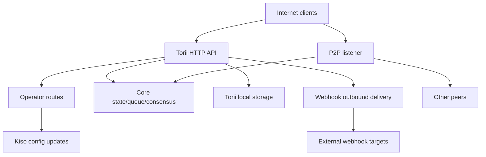

<!-- Auto-generated stub for Armenian (hy) translation. Replace this content with the full translation. -->

---
lang: hy
direction: ltr
source: iroha-threat-model.md
status: complete
generator: scripts/sync_docs_i18n.py
source_hash: 766928cf0dcbfe3513c728bcf0b9fa697a330e8000bc6944ab61e8fcd59751ad
source_last_modified: "2026-02-07T13:27:25.009145+00:00"
translation_last_reviewed: 2026-04-02
translator: machine-google-reviewed
---

# Iroha սպառնալիքի մոդել (ռեպո՝ `iroha`)

## Գործադիր ամփոփագիր
Ինտերնետում բացված հանրային բլոկչեյն տեղակայման դեպքում, որտեղ օպերատորի երթուղիները միտումնավոր հասանելի են հանրային ինտերնետից, բայց պետք է վավերացվեն հարցումների ստորագրությունների միջոցով, և որտեղ վեբ-կեռիկներն/կցորդները միացված են հանրային Torii վերջնակետում, հիմնական ռիսկերն են՝ օպերատորի ինքնաթիռի փոխզիջումը կամ վերահաստատված հարցումը (չնկարագրված չստորագրված): `/v1/configuration` և այլ օպերատորի երթուղիներ), SSRF և ելքային չարաշահում վեբ-կապիկի առաքման միջոցով և բարձր լծակներով DoS գործարքի/հարցման + հոսքային վերջնակետերի միջոցով, որտեղ դրույքաչափերի սահմանափակումները պայմանականորեն կիրառվում են. Բացի այդ, ցանկացած «mTLS պահանջվում է» կեցվածքը, որը հիմնված է `x-forwarded-client-cert`-ի առկայության վրա, խարդախելի է, երբ Torii-ն ուղղակիորեն բաց է: Ապացույց.

## Շրջանակ և ենթադրություններՆերքևում (գործողության/արտադրության մակերեսներ).
- Torii HTTP API սերվեր և միջին ծրագիր, ներառյալ «օպերատորի» երթուղիները, հավելվածի API-ն, վեբ-կեռիկներ, հավելվածներ, բովանդակություն և հոսքային վերջնակետեր՝ `crates/iroha_torii/`, `crates/iroha_torii_shared/`
- Հանգույցի բեռնախցիկի և բաղադրիչի լարերի միացում (Torii + P2P + վիճակ/հերթ/կարգաձևման թարմացման դերակատար): `crates/irohad/src/main.rs`
- P2P տրանսպորտային և ձեռքսեղմման մակերեսներ՝ `crates/iroha_p2p/`
- Կազմաձևման ձևեր և լռելյայն (հատկապես Torii վավերացման լռելյայն): `crates/iroha_config/src/parameters/{actual,defaults}.rs`
- Հաճախորդին ուղղված կազմաձևման թարմացում DTO (այն, ինչ կարող է փոխել `/v1/configuration`-ը): `crates/iroha_config/src/client_api.rs`
- Փաթեթավորման տեղակայման հիմունքներ. `Dockerfile`, և օրինակի կոնֆիգուրացիաներ `defaults/`-ում (արտադրության մեջ մի օգտագործեք ներկառուցված օրինակի բանալիներ):

Շրջանակից դուրս (եթե ուղղակիորեն պահանջված չէ).
- CI աշխատանքային հոսքեր և թողարկման ավտոմատացում՝ `.github/`, `ci/`, `scripts/`
- Բջջային/հաճախորդի SDK-ներ և հավելվածներ՝ `IrohaSwift/`, `java/`, `examples/`
- Միայն փաստաթղթային նյութ՝ `docs/`Հստակ ենթադրություններ (ձեր պարզաբանումների հիման վրա).
- Torii-ը հասանելի է ինտերնետին և հասանելի է չհաստատված հաճախորդների կողմից (որոշ վերջնական կետեր դեռ կարող են պահանջել ստորագրություններ կամ այլ վավերացում):
- Օպերատորի երթուղիները (`/v1/configuration`, `/v1/nexus/lifecycle` և օպերատորի կողմից փակ հեռաչափություն/պրոֆիլավորում, երբ միացված է) նախատեսված են հանրությանը հասանելի լինելու համար և պետք է նույնականացվեն օպերատորի կողմից վերահսկվող մասնավոր բանալիից ստորագրության միջոցով: Ապացույցներ (ներկայիս վիճակ).
- Օպերատորի ստորագրության ստուգումը պետք է օգտագործի կոնֆիգուրացիայի մեջ օպերատորի հանրային բանալիների հանգույց-տեղական թույլատրելի ցուցակ (ներկայիս երթուղղիչում որպես ներդրված օպերատորի դարպաս): Ընթացիկ օպերատորի դարպասի ապացույց՝ `crates/iroha_torii/src/operator_auth.rs` (`authorize_operator_endpoint`) և գոյություն ունեցող կանոնական հարցումների ստորագրման օգնականի (հաղորդագրությունների կառուցում)՝ `crates/iroha_torii/src/app_auth.rs` (`canonical_request_message`):
- Torii-ը պարտադիր չէ, որ տեղակայվի վստահելի մուտքի հետևում. հետևաբար, `x-forwarded-client-cert`-ի նման վերնագրերը պետք է դիտարկվեն որպես հարձակվողի կողմից վերահսկվող, երբ Torii-ը ուղղակիորեն բացահայտված է: Ապացույց՝ `crates/iroha_torii/src/lib.rs` (`HEADER_MTLS_FORWARD`, `norito_rpc_mtls_present`) և `crates/iroha_torii/src/operator_auth.rs` (`HEADER_MTLS_FORWARD`, `mtls_present`):
- Վեբ-կեռիկներն ու հավելվածները միացված են հանրային Torii վերջնական կետում: Ապացույց՝ `crates/iroha_torii/src/lib.rs` (երթուղիներ `/v1/webhooks` և `/v1/zk/attachments`), `crates/iroha_torii/src/webhook.rs`, `crates/iroha_torii/src/zk_attachments.rs`:- Օպերատորը կարող է սահմանել կամ պահել `torii.require_api_token = false` (կանխադրվածը `false` է): Ապացույց՝ `crates/iroha_config/src/parameters/defaults.rs` (`torii::REQUIRE_API_TOKEN`):
- Ակնկալվում է, որ `/transaction` և `/query` հասանելի կլինեն հանրային շղթայի համար: Նշում. դրանք լրացուցիչ փակված են «Norito-RPC» տեղադրման փուլով և ընտրովի «mTLS պահանջվում» վերնագրի առկայության ստուգմամբ: Ապացույցներ՝ `crates/iroha_torii/src/lib.rs` (`ConnScheme::from_request`, `evaluate_norito_rpc_gate`) և `crates/iroha_config/src/parameters/defaults.rs` (`torii::transport::norito_rpc::STAGE = "disabled"`):

Բաց հարցեր, որոնք էապես կփոխեն ռիսկերի դասակարգումը.
- Որտե՞ղ են կազմաձևվում օպերատորի հանրային բանալիները (որ կազմաձևման ստեղնը/ձևաչափը), և ինչպե՞ս են հայտնաբերվում/պտտվում ստեղները (բանալինների նույնականացում, բազմաթիվ ակտիվ ստեղներ, չեղարկում):
- Ո՞րն է օպերատորի ստորագրման հաղորդագրության ձևաչափը և կրկնակի պաշտպանությունը (ժամանակի դրոշմակնիք/ոչ/հաշվիչը + սերվերի կողմից կրկնվող քեշ), և ժամացույցի թեքության ո՞ր քաղաքականությունն է ընդունելի: Ապացույց, որ գոյություն ունեցող կանոնական հարցումների օգնականը թարմություն չունի՝ `crates/iroha_torii/src/app_auth.rs` (`canonical_request_message`):
- Անանուն վեբ-կեռիկների համար սպասվո՞ւմ է, որ Torii-ը թույլ կտա կամայական ուղղություններ, թե՞ պետք է կիրառի SSRF նպատակակետ քաղաքականությունը (արգելափակել RFC1918/localhost/link-local/metadata և կամայականորեն պահանջել HTTPS):
- Ո՞ր Torii գործառույթներն են միացված ձեր կառուցվածքում (`telemetry`, `profiling`, `p2p_ws`, `app_api_https`, `COPY defaults ...`), և օգտագործված է `COPY defaults ...` բովանդակությունը: Ապացույց՝ `crates/iroha_torii/Cargo.toml` (`[features]`):

## Համակարգի մոդել### Հիմնական բաղադրիչներ
- **Ինտերնետ հաճախորդներ** (դրամապանակներ, ինդեքսատորներ, հետազոտողներ, բոտեր). ուղարկեք HTTP/Norito հարցումներ և բացեք WS/SSE կապերը:
- **Torii (HTTP API)**. axum երթուղիչ՝ միջին ծրագրով նախնական հաստատման մուտքի համար, կամընտիր API նշանի կիրառում, API-ի տարբերակի բանակցություններ, հասցեի հեռակառավարման ներարկում և չափումներ: Ապացույց՝ `crates/iroha_torii/src/lib.rs` (`create_api_router`, `enforce_preauth`, `enforce_api_token`, `enforce_api_version`, `inject_remote_addr_header`):
- **Օպերատորի/հավաստագրման կառավարման հարթություն (ներկայիս) և ցանկալի կեցվածքը**. օպերատորի երթուղիները ներկայումս պաշտպանված են `operator_auth::enforce_operator_auth`-ով (WebAuthn/tokens; կարող է արդյունավետորեն անջատվել կոնֆիգուրացիայի միջոցով), սակայն ձեր տեղակայման պահանջը ստորագրության վրա հիմնված օպերատորի նույնականացումն է, որը հաստատված է օպերատորի կոնֆիգուրայի հանրային բանալիների թույլտվության ցանկի հիման վրա: Կանոնական հարցումների հաղորդագրության օգնական գոյություն ունի, որը կարող է կրկին օգտագործվել հաղորդագրությունների կառուցման համար, սակայն հաստատումը պետք է հարմարեցվի կազմաձևման ստեղների (ոչ թե համաշխարհային պետությունների հաշիվների) օգտագործման համար: Ապացույց.- **Հիմնական հանգույցի բաղադրիչներ (ընթացքում)**. գործարքների հերթ, վիճակ/WSV, կոնսենսուս (Sumeragi), բլոկ պահեստավորում (Kura), կազմաձևերի թարմացման դերակատար (Kiso) և այլն, որոնք փոխանցվել են Torii-ին: Ապացույց. `torii.start(...)`):
- **P2P ցանցային**. կոդավորված, շրջանակված փոխադրում և ձեռքսեղմում; կամընտիր TLS-over-TCP գոյություն ունի, բայց միտումնավոր թույլ է տալիս վկայականի ստուգումը: Ապացույցներ.
- **Torii տեղական հաստատակամություն**. `./storage/torii` լռելյայն բազա կցորդների/վեբկեռիկների/հերթերի համար: Ապացույցներ.
- **Արտագնա վեբ-կապիկի թիրախներ**. Torii-ը կարող է իրադարձություններ փոխանցել կամայական `http://` URL-ներին (և `https://`/`ws(s)://` միայն առանձնահատկություններով): Ապացույց՝ `crates/iroha_torii/src/webhook.rs` (`http_post_plain`, `http_post_https`, `ws_send`):### Տվյալների հոսքերը և վստահության սահմանները
- Ինտերնետ հաճախորդ → Torii HTTP API
  - Տվյալներ՝ Norito երկուական (`SignedTransaction`, `SignedQuery`), JSON DTO (հավելվածի API), WS/SSE բաժանորդագրություններ, վերնագրեր (ներառյալ `x-api-token`):
  - Ալիք՝ HTTP/1.1 + WebSocket + SSE (axum):
  - Երաշխիքներ՝ կամընտիր API նշան (`torii.require_api_token`), նախնական հաստատման կապ/գնահատման դարպաս, API տարբերակի բանակցություններ; Շատ մշակողներ կիրառում են մեկ վերջնական կետի տոկոսադրույքի սահմանափակումը պայմանականորեն (կարելի է շրջանցել, երբ `enforce=false`): Ապացույցներ.
  - Վավերացում. որոշ վերջնակետերի մարմնի սահմանափակումներ (օրինակ՝ գործարքներ), Norito վերծանում, որոշ հավելվածների վերջնակետերի հարցումների ստորագրում (կանոնական հարցումների վերնագրեր): Ապացույց՝ `crates/iroha_torii/src/lib.rs` (`add_transaction_routes` օգտագործում է `DefaultBodyLimit::max(...)`), `crates/iroha_torii/src/app_auth.rs` (`verify_canonical_request`):- Ինտերնետ հաճախորդ → «Օպերատոր» երթուղիներ (Torii)
  - Տվյալներ՝ կազմաձևման թարմացումներ (`ConfigUpdateDTO`), գծի կյանքի ցիկլի պլաններ, հեռաչափություն/վրիպազերծում/կարգավիճակ/մետրիկա (երբ միացված է):
  - Ալիք՝ HTTP:
  - Երաշխիքներ. ընթացիկ ռեպո դարպասները փակում են այս երթուղիները `operator_auth::enforce_operator_auth` միջնակարգ ծրագրով, որն արդյունավետորեն անգործունակ է, երբ `torii.operator_auth.enabled=false`; Ձեր ցանկալի կեցվածքը ստորագրության վրա հիմնված նույնականացումն է՝ օգտագործելով օպերատորի հանրային բանալիները կոնֆիգուրից, որոնք պետք է իրականացվեն և կիրառվեն այս սահմանում (և չպետք է ապավինեն `x-forwarded-client-cert`-ին, եթե Torii-ը ուղղակիորեն բացահայտված է): Ապացույց.
  - Վավերացում. հիմնականում DTO վերլուծություն; `handle_post_configuration`-ում ծածկագրային թույլտվություն չկա (այն պատվիրակում է `kiso.update_with_dto`-ին): Ապացույց՝ `crates/iroha_torii/src/routing.rs` (`handle_post_configuration`):

- Torii → Հիմնական հերթ/վիճակ/համաձայնություն (ընթացքում)
  - Տվյալներ. գործարքների ներկայացումներ, հարցումների կատարում, վիճակի ընթերցումներ/գրումներ, կոնսենսուսային հեռաչափության հարցումներ:
  - Ալիք. Rust զանգեր (ընդհանուր `Arc` բռնակներ):
  - Երաշխիքներ. ենթադրյալ վստահելի սահման; Անվտանգությունը կախված է նրանից, որ Torii ճիշտ է նույնականացնում/թույլատրում հարցումները՝ նախքան արտոնյալ գործողությունները կանչելը: Ապացույցներ.- Torii → Kiso (կոնֆիգուրացիայի թարմացման դերակատար)
  - Տվյալներ. `ConfigUpdateDTO`-ը կարող է փոփոխել գրանցումը, P2P ACL, ցանցի/տրանսպորտային կարգավորումները, SoraNet-ի ձեռքսեղմումը և այլն:
  - Ալիք՝ ընթացքի մեջ գտնվող հաղորդագրություն/բռնակ:
  - Երաշխիքներ. թույլտվությունը սպասվում է Torii սահմանին; DTO-ի թարմացումն ինքնին կարողություն կրող է: Ապացույց՝ `crates/iroha_config/src/client_api.rs` (`ConfigUpdateDTO` դաշտերը ներառում են `network_acl`, `transport.norito_rpc`, `soranet_handshake` և այլն):

- Torii → Տեղական սկավառակ (`./storage/torii`)
  - Տվյալներ. webhook ռեեստր և հերթագրված առաքումներ; հավելվածներ և ախտահանիչ մետատվյալներ; GC/TTL վարքագիծ:
  - Ալիք՝ ֆայլային համակարգ:
  - Երաշխիքներ. տեղական OS-ի թույլտվություններ (կոնտեյները աշխատում է որպես ոչ արմատական ​​Dockerfile-ում); «Վարձակալի» կողմից տրամաբանական մեկուսացումը հիմնված է API նշանի կամ հեռավոր IP վերնագրի վրա, որը ներարկվում է միջին ծրագրի կողմից: Ապացույց՝ `Dockerfile` (`USER iroha`), `crates/iroha_torii/src/lib.rs` (`inject_remote_addr_header`, `zk_attachments_tenant`):

- Torii → Webhook թիրախներ (արտագնա)
  - Տվյալներ. իրադարձությունների օգտակար բեռներ + ստորագրության վերնագիր:
  - Ալիք՝ չմշակված TCP HTTP հաճախորդ `http://`-ի համար; կամընտիր `hyper+rustls` `https://`-ի համար, երբ միացված է; կամընտիր WS/WSS, երբ միացված է:
  - Երաշխիքներ. ընդմիջումներ/կրկնակի փորձեր; կոդում տեսանելի նպատակակետի թույլտվությունների ցուցակ չկա. URL-ը ազդում է հարձակվողի վրա, եթե webhook CRUD-ը բաց է: Ապացույց՝ `crates/iroha_torii/src/webhook.rs` (`handle_create_webhook`, `http_post_plain/http_post`):- P2P հասակակիցներ (անվստահելի ցանց) → P2P փոխադրում/ձեռքսեղմում
  - Տվյալներ՝ ձեռքսեղմման նախաբան/մետատվյալներ, շրջանակված կոդավորված հաղորդագրություններ, կոնսենսուսային հաղորդագրություններ:
  - Ալիք՝ P2P տրանսպորտ (TCP/QUIC/ և այլն, կախված հատկություններից), կոդավորված բեռներ; կամընտիր TLS-over-TCP-ն բացահայտորեն թույլ է տալիս հավաստագրի ստուգումը:
  - Երաշխիքներ. գաղտնագրում և ստորագրված ձեռքսեղմում կիրառական շերտում; transport-layer TLS-ը չի վավերացնում հավաստագրով: Ապացույց՝ `crates/iroha_p2p/src/lib.rs` (գաղտնագրման տեսակներ), `crates/iroha_p2p/src/transport.rs` (`NoCertificateVerification` մեկնաբանություն և իրականացում):

#### Դիագրամ

## Ակտիվներ և անվտանգության նպատակներ| Ակտիվ | Ինչու է դա կարևոր | Անվտանգության նպատակը (C/I/A) |
|---|---|---|
| Շղթայի վիճակ / WSV / բլոկներ | Ամբողջականության ձախողումները դառնում են կոնսենսուսի ձախողումներ. առկայության ձախողումները կանգնեցնում են շղթան | I/A |
| Կոնսենսուսի ակտիվություն (Sumeragi) | Հանրային բլոկչեյնի արժեքը կախված է կայուն բլոկի արտադրությունից | Ա |
| Հանգույցի մասնավոր բանալիներ (հասակակիցների նույնականացում, ստորագրման բանալիներ) | Բանալին փոխզիջումը հնարավորություն է տալիս ինքնության յուրացում, ստորագրման չարաշահում կամ ցանցի բաժանում | C/I |
| Runtime կոնֆիգուրացիա (Kiso-թարմացված) | Կառավարում է ցանցի ACL-ները և տրանսպորտի կարգավորումները. չարաշահումը կարող է անջատել պաշտպանությունը կամ ընդունել վնասակար հասակակիցներին | Ես |
| Գործարքների հերթ / mempool | Ջրհեղեղը կարող է սովահարել կոնսենսուսը և սպառել պրոցեսորը/հիշողությունը | Ա |
| Torii համառություն (`./storage/torii`) | Սկավառակի սպառումը կարող է խափանել հանգույցը; պահպանված տվյալները կարող են ազդել ներքևում գտնվող մշակման վրա | A (և երբեմն C/I) |
| Արտագնա webhook ալիք | Կարող է չարաշահվել SSRF-ի, ներքին ցանցերից տվյալների արտահանման կամ վստահելի ելքի IP-ից սկանավորման համար | C/I/A |
| Հեռաչափություն/մետրիկա/վրիպազերծման տվյալներ | Կարող է արտահոսել ցանցի տոպոլոգիան և գործառնական վիճակը, որոնք օգտակար են նպատակային հարձակումների համար | Գ |

## Հարձակվողի մոդել### Հնարավորություններ
- Հեռավոր, չհաստատված ինտերնետ հարձակվողը կարող է ուղարկել կամայական HTTP հարցումներ, պահել երկարատև WS/SSE կապեր և վերարտադրել կամ ցողել օգտակար բեռներ (botnet):
- Ցանկացած կողմ կարող է ստեղծել բանալիներ և ներկայացնել ստորագրված գործարքներ/հարցումներ (հրապարակային բլոկչեյն), ներառյալ մեծածավալ սպամ:
- Վնասակար/վտանգված գործընկերը կարող է միանալ P2P-ին և փորձել արձանագրության չարաշահում, հեղեղում կամ ձեռքսեղմում մանիպուլյացիա՝ թույլատրելի սահմանափակումների սահմաններում:
- Եթե webhook CRUD-ը բացահայտված է, հարձակվողը կարող է գրանցել հարձակվողի կողմից վերահսկվող webhook URL-ները և ստանալ ելքային զանգեր (և հնարավոր է դրանք ուղղորդել դեպի ներքին ուղղություններ):

### Ոչ հնարավորություններ
- Տեղական ֆայլային համակարգի անմիջական հասանելիություն չկա, եթե բացակայում է բացահայտված վերջնակետը կամ սխալ կազմաձևված ծավալի թույլտվությունները:
- Առանց բանալիների փոխզիջման գոյություն ունեցող գործընկեր/օպերատորի ստեղների համար ստորագրություններ կեղծելու հնարավորություն չկա:
- Նորմալ պայմաններում ժամանակակից ծածկագրությունը (X25519, ChaCha20-Poly1305, Ed25519) կոտրելու ենթադրյալ ունակություն չկա:

## Մուտքի կետեր և հարձակման մակերեսներ| Մակերեւութային | Ինչպես է հասել | Վստահության սահման | Ծանոթագրություններ | Ապացույց (ռեպո ուղի / խորհրդանիշ) |
|---|---|---|---|---|
| `POST /transaction` | Ինտերնետ HTTP | Ինտերնետ → Torii | Norito երկուական ստորագրված գործարք; տոկոսադրույքի սահմանափակումը պայմանական է (`enforce` կարող է կեղծ լինել) | `crates/iroha_torii/src/lib.rs` (`handler_post_transaction`, `ConnScheme::from_request`) |
| `POST /query` | Ինտերնետ HTTP | Ինտերնետ → Torii | Norito երկուական ստորագրված հարցում; տոկոսադրույքի սահմանափակումը պայմանական է (`enforce` կարող է կեղծ լինել) | `crates/iroha_torii/src/lib.rs` (`handler_signed_query`) |
| Norito-RPC դարպաս | Ինտերնետ HTTP վերնագրեր | Ինտերնետ → Torii | Տեղադրման փուլ + կամընտիր «mTLS պահանջվում է» վերնագրի առկայության միջոցով; դեղձանիկ օգտագործում է `x-api-token` | `crates/iroha_torii/src/lib.rs` (`evaluate_norito_rpc_gate`, `HEADER_MTLS_FORWARD`) |
| `POST/GET/DELETE /v1/webhooks...` | Ինտերնետ HTTP (հավելվածի API) | Ինտերնետ → Torii → ելքային | Անանուն դիզայնով; webhook CRUD-ը հնարավորություն է տալիս ելքային առաքում կամայական URL-ներին; SSRF ռիսկ | `crates/iroha_torii/src/lib.rs` (`handler_webhooks_*`), `crates/iroha_torii/src/webhook.rs` (`http_post`) |
| `POST/GET /v1/zk/attachments...` | Ինտերնետ HTTP (հավելվածի API) | Ինտերնետ → Torii → սկավառակ | Անանուն դիզայնով; կցորդի ախտահանիչ + դեկոպրեսիա + համառություն; սկավառակի/պրոցեսորի սպառման մակերեսը (վարձակալությունը API-token-ն է, եթե միացված է, այլապես հեռակա IP-ն ներարկված վերնագրի միջոցով) | `crates/iroha_torii/src/lib.rs` (`handler_zk_attachments_*`, `zk_attachments_tenant`), `crates/iroha_torii/src/zk_attachments.rs` || `GET /v1/content/{bundle}/{path...}` | Ինտերնետ HTTP | Ինտերնետ → Torii → վիճակ/պահեստ | Աջակցում է վավերացման ռեժիմներին + PoW + Range; ելքի սահմանափակիչ | `crates/iroha_torii/src/content.rs` (`handle_get_content`, `enforce_pow`, `enforce_auth`) |
| Սթրիմինգ՝ `/v1/events/sse`, `/events` (WS), `/block/stream` (WS) | ինտերնետ | Ինտերնետ → Torii | Երկարատև կապեր; DoS մակերես | `crates/iroha_torii/src/lib.rs` (`add_network_stream_routes`) |
| `GET/POST /v1/configuration` | Ինտերնետ HTTP | Ինտերնետ → օպերատորի երթուղիներ → Կիսո | Տեղակայման մտադրություն. օպերատորի ստորագրությունները ստուգված են կոնֆիգուրացիայի թույլտվությունների ցանկի ստեղներով; ընթացիկ ռեպո-ն այն պաշտպանում է միայն օպերատորի միջին ծրագրաշարի միջոցով (երթուղային խմբում չկա ստորագրության դարպաս) և պատվիրակում է թարմացնել հավելվածը Kiso | `crates/iroha_torii/src/lib.rs` (`add_core_info_routes`, `handler_post_configuration`), `crates/iroha_torii/src/operator_auth.rs` (`enforce_operator_auth`), `crates/iroha_torii/src/routing.rs` (`crates/iroha_torii/src/routing.rs`), (`crates/iroha_torii/src/routing.rs`) կանոնական խնդրանքի ստորագրման օգնական) |
| `POST /v1/nexus/lifecycle` | Ինտերնետ HTTP | Ինտերնետ → օպերատորի երթուղիներ → հիմնական | Օպերատորի վերջնակետը, որը նախատեսված է ստորագրության վավերացման համար. ներկայումս պահպանվում է օպերատորի միջին ծրագրով և կարող է դառնալ հանրային, եթե օպերատորի վավերացումն անջատված է | `crates/iroha_torii/src/lib.rs` (`add_core_info_routes`, `handler_post_nexus_lane_lifecycle`), `crates/iroha_torii/src/operator_auth.rs` (`authorize_operator_endpoint`) || Հեռաչափություն/պրոֆիլավորման վերջնակետեր (հատկանիշներով փակված) | Ինտերնետ HTTP | Ինտերնետ → օպերատորի երթուղիներ | Օպերատորի կողմից փակված երթուղիների խմբեր; եթե օպերատորի վավերացումն անջատված է, և ստորագրության դարպաս չկա, դրանք դառնում են հրապարակային և կարող են արտահոսել գործառնական տվյալներ կամ լինել DoS վեկտորներ | `crates/iroha_torii/src/lib.rs` (`add_telemetry_routes`, `add_profiling_routes`), `crates/iroha_torii/src/operator_auth.rs` (`authorize_operator_endpoint`) |
| P2P TCP/TLS փոխադրումներ | Ինտերնետ / գործընկերային ցանց | Ինտերնետ/հասակակիցներ → P2P | Կոդավորված P2P շրջանակներ + ձեռքսեղմում; TLS վկայագրի ստուգումը թույլատրելի է, երբ միացված է | `crates/iroha_p2p/src/lib.rs` (`NetworkHandle`), `crates/iroha_p2p/src/transport.rs` (`p2p_tls::NoCertificateVerification`) |

## Չարաշահման լավագույն ուղիները

1. **Հարձակվողի նպատակը՝ ստանձնել հանգույցի վարքագիծը գործարկման ժամանակի կազմաձևման թարմացումների միջոցով**
   1) Գտեք ինտերնետով բացված Torii, որտեղ օպերատորի երթուղիները հասանելի են, և օպերատորի նույնականացումը բացակայում է/շրջանցելի է (օրինակ՝ օպերատորի վավերացումն անջատված է և ստորագրության դարպաս չկա):  
   2) `POST /v1/configuration` `ConfigUpdateDTO`-ով, որը թուլացնում է ցանցի ACL-ները կամ փոխում է տրանսպորտի կարգավորումները:  
   3) Միացեք որպես գործընկեր կամ դրդեք բաժանման/սխալ կազմաձևում; նսեմացնել կոնսենսուսը և/կամ երթուղային գործարքները հարձակվողների կողմից վերահսկվող ենթակառուցվածքի միջոցով:  
   Ազդեցություն. հանգույցի (և հնարավոր է ցանցի) ամբողջականությունն ու հասանելիությունը:2. **Հարձակվողի նպատակ. Կրկնել օպերատորի կողմից ստորագրված հարցումը**
   1) Ստացեք մեկ վավեր ստորագրված օպերատորի հարցում (օրինակ՝ վտանգված օպերատորի մեքենայի, սխալ կազմաձևված վստահված անձի գրանցամատյանների կամ միջավայրի միջոցով, որտեղ TLS-ն անապահով դադարեցված է):  
   2) Կրկնել նույն հարցումը հանրային օպերատորի երթուղիների նկատմամբ, եթե ստորագրության սխեմայում բացակայում է թարմությունը (ժամանակի դրոշմակնիքը/ոչ մի անգամ) և սերվերի կողմից կրկնվող վերարտադրման մերժումը:  
   3) Պատճառել կոնֆիգուրացիայի կրկնվող փոփոխություններ, հետադարձումներ կամ հարկադիր անջատումներ, որոնք նվազեցնում են հասանելիությունը կամ թուլացնում պաշտպանությունը:  
   Ազդեցություն. ամբողջականության/հասանելիության փոխզիջում՝ չնայած «ստորագրության վավերացմանը»:  

3. **Հարձակվողի նպատակը՝ անջատել/դարպասի պաշտպանությունը՝ փոխելով Norito-RPC-ի թողարկումը**
   1) `POST /v1/configuration`՝ `transport.norito_rpc.stage` կամ `require_mtls` թարմացնելու համար:  
   2) Հարկադիր բացել կամ փակել `/transaction` և `/query`՝ ազդելով առկայության և մուտքի վերահսկման վրա:  
   Ազդեցություն. նպատակային անջատում կամ ընդունման հսկողության շրջանցում:4. **Հարձակվողի նպատակը՝ SSRF-ը օպերատորի ներքին ցանցում**
   1) Ստեղծեք վեբ-կապիկի մուտքագրում՝ ուղղված ներքին նպատակակետին (օրինակ՝ RFC1918 հոսթ, մետատվյալների IP, կառավարման հարթություն) `POST /v1/webhooks`-ի միջոցով:  
   2) սպասել համապատասխան իրադարձությունների. Torii-ը տրամադրում է ելքային HTTP հարցումներ իր ցանցի դիրքից:  
   3) Օգտագործեք պատասխաններ/ստատուսներ/ժամկետներ և կրկնվող փորձեր՝ ներքին ծառայությունները հետաքննելու համար (և պոտենցիալ արտազատում, եթե պատասխանի բովանդակությունը երբևէ հայտնվել է այլուր):  
   Ազդեցություն՝ ներքին ցանցի բացահայտում, կողային շարժման փայտամած, հեղինակության վնաս, մետատվյալների վերջնակետերի միջոցով հավատարմագրերի հնարավոր բացահայտում:  

5. **Հարձակվողի նպատակը՝ մերժել գործարքի/հարցման ընդունումը**
   1) Ջրհեղեղ `POST /transaction` և `POST /query` վավեր/անվավեր Norito մարմիններով։  
   2) Պահպանեք բազմաթիվ WS/SSE բաժանորդագրություններ և դանդաղ հաճախորդներ:  
   3) Օգտագործեք պայմանական դրույքաչափի սահմանափակումը (`enforce=false`) նորմալ աշխատանքի մեջ՝ խափանումներից խուսափելու համար:  
   Ազդեցություն. պրոցեսորի/հիշողության սպառում, հերթի հագեցվածություն, կոնսենսուսի ախոռներ:  

6. **Հարձակվողի նպատակը՝ արտանետվող սկավառակը հավելվածների միջոցով**
   1) Ջրհեղեղ `/v1/zk/attachments` առավելագույն չափի օգտակար բեռներով և/կամ սեղմված արխիվներով՝ ընդարձակման սահմանների մոտ:  
   2) Օգտագործեք մի քանի աղբյուրի IP-ներ (կամ վարձակալի ստեղնավորման ցանկացած թուլություն)՝ յուրաքանչյուր վարձակալի գլխարկներից խուսափելու համար:  
   3) Պահպանեք մինչև TTL/GC-ի հետաձգումը. լրացնել `./storage/torii`:  
   Ազդեցություն՝ հանգույցի վթար, բլոկներ/գործարքներ մշակելու անկարողություն:7. **Հարձակվողի նպատակը՝ շրջանցեք «mTLS պահանջվող» դարպասները, երբ Torii-ը ուղղակիորեն բաց է**
   1) Օպերատորը հնարավորություն է տալիս `require_mtls` Norito-RPC-ի կամ օպերատորի վավերացման համար:  
   2) Հարձակվողը հարցումներ է ուղարկում `x-forwarded-client-cert: <anything>`-ով:  
   3) Վերնագրի առկայության ստուգումն անցնում է, եթե ոչ մի վստահելի մուտք չի ջնջում վերնագիրը:  
   Ազդեցություն. վերահսկումները սխալ են կիրառվել; օպերատորը կարծում է, որ mTLS-ն ուժի մեջ է մտնում, երբ դա այդպես չէ:  

8. **Հարձակվողի նպատակը՝ նսեմացնել հասակակիցների կապը / սպառել ռեսուրսները**
   1) Վնասակար հասակակիցը բազմիցս փորձում է ձեռքսեղմումներ անել կամ ողողել շրջանակները առավելագույն չափերի մոտ:  
   2) Օգտագործեք թույլատրելի տրանսպորտային շերտի TLS (եթե միացված է)՝ վկայագրերի հիման վրա վաղաժամ մերժումից խուսափելու համար:  
   Ազդեցությունը՝ կապի խափանում, պրոցեսորի օգտագործում, հասակակիցների հասանելիության նվազում:  

9. **Հարձակվողի նպատակը. Վերանայել հեռաչափության/վրիպազերծման վերջնակետերի միջոցով**
   1) Եթե հեռաչափությունը/պրոֆիլավորումը միացված է, և օպերատորի նույնականացումը բացակայում է/շրջանցելի է, քերեք `/status`, `/metrics`, վրիպազերծել երթուղիները:  
   2) Օգտագործեք արտահոսած տոպոլոգիա/առողջական տվյալներ հարձակումները ժամանակավորելու և կոնկրետ բաղադրիչները թիրախավորելու համար:  
   Ազդեցություն. հարձակվողների հաջողության մակարդակի բարձրացում; տեղեկատվության հնարավոր բացահայտում.  

## Սպառնալիքների մոդելի աղյուսակ| Սպառնալիքի ID | Սպառնալիքի աղբյուր | Նախադրյալներ | Սպառնալիքի գործողություն | Ազդեցություն | Ազդեցության տակ գտնվող ակտիվներ | Առկա հսկողություն (ապացույցներ) | Բացեր | Առաջարկվող մեղմացումներ | Հայտնաբերման գաղափարներ | Հավանականություն | Ազդեցության ծանրությունը | Առաջնահերթություն |
|---|---|---|---|---|---|---|---|---|---|---|---|---|| ՏՄ-001 | Հեռավոր ինտերնետ հարձակվող | Torii ինտերնետ-բացահայտված; օպերատորի երթուղիները հանրային են. օպերատորի վավերացումը բացակայում է/շրջանցելի է կամ ստորագրության վրա հիմնված օպերատորի վավերացումը չի իրականացվել/սխալ է իրականացվել | Զանգահարեք օպերատորի երթուղիները (օրինակ՝ `/v1/configuration`, `/v1/nexus/lifecycle`)՝ գործարկման ժամանակի կազմաձևումը, ցանցի ACL-ները կամ փոխադրման կարգավորումները փոխելու համար | Հանգույցի գրավում/բաժանում; ընդունել չարամիտ հասակակիցներին; անջատել պաշտպանությունները | Runtime config; կոնսենսուսի աշխուժություն; շղթայի ամբողջականություն; հասակակից բանալիներ | Օպերատորի երթուղիները գտնվում են օպերատորի միջին ծրագրի հետևում, բայց `authorize_operator_endpoint`-ը վերադարձնում է `Ok(())`, երբ անջատված է; config-ի թարմացումը պատվիրակում է Kiso-ին առանց լրացուցիչ վավերացման: Ապացույց՝ `crates/iroha_torii/src/lib.rs` (`add_core_info_routes`), `crates/iroha_torii/src/operator_auth.rs` (`authorize_operator_endpoint`), `crates/iroha_torii/src/routing.rs` (`handle_post_configuration`), `crates/iroha_torii/src/operator_auth.rs` (`authorize_operator_endpoint`), `crates/iroha_torii/src/routing.rs` (`handle_post_configuration`), Sumeragi Օպերատորի երթուղիների խմբերում ստորագրության վրա հիմնված օպերատորի վավերացում չի ցուցադրվում. վերնագրի վրա հիմնված «mTLS»-ը կեղծելի է, երբ Torii-ը ուղղակիորեն ցուցադրվում է. կրկնակի պաշտպանություն չսահմանված | Իրականացնել պարտադիր ստորագրության վրա հիմնված օպերատորի վավերացում օպերատորի երթուղիների համար, որոնք ստուգված են օպերատորի հանրային բանալիների կոնֆիգուրացիայի թույլտվությունների ցանկի հիման վրա (աջակցում են բազմաթիվ ստեղների + բանալիների նույնականացմանը); ներառել թարմություն (ժամանականիշ + nonce) սահմանափակված վերարտադրման քեշով; կիրառել TLS ծայրից ծայր (մի վստահեք `x-forwarded-client-cert`-ին); կիրառել խիստ դրույքաչափեր + աուդիտի գրանցում օպերատորի բոլոր գործողությունների վրա | Զգուշացում ցանկացած օպերատորի երթուղու հարվածի մասին. audit-log config diffs; հայտնաբերել կրկնվող ստորագրություններ/ոչներ; վերահսկել անսովոր թարմացումըհաճախականության և աղբյուրի IP-ներ | Բարձր (մինչև ստորագրության վավերացում + կրկնակի պաշտպանություն չի իրականացվել և ուժի մեջ մտնել) | Բարձր | **կրիտիկական** || ՏՄ-002 | Հեռավոր ինտերնետ հարձակվող | Webhook CRUD-ն անանուն է և հասանելի է ինտերնետին. ոչ SSRF նպատակակետ քաղաքականություն | Ստեղծեք վեբ-կեռիկներ՝ ուղղված ներքին/արտոնյալ URL-ներին և գործարկեք առաքումները | SSRF, ներքին սկանավորում, մետատվյալների հավատարմագրերի բացահայտում և ելքային DoS | Webhook ալիք; ներքին ցանց; առկայություն | Վեբկեռիկներ գոյություն ունեն; առաքումներն օգտագործում են ժամանակի ընդհատումներ/հետադարձ/առավելագույն փորձեր; `http://` առաքումն օգտագործում է չմշակված TCP: Ապացույց՝ `crates/iroha_torii/src/lib.rs` (`handler_webhooks_*`), `crates/iroha_torii/src/webhook.rs` (`handle_create_webhook`, `http_post_plain`, `WebhookPolicy`) | Առանց նպատակակետի թույլտվությունների ցանկի / IP միջակայքի բլոկների; `http://` թույլատրված; DNS-ի վերամիացման/վերահղման հսկիչները տեսանելի չեն. webhook CRUD տոկոսադրույքի սահմանափակումը պայմանական է (կարող է արդյունավետորեն անջատվել կայուն վիճակում) | Միացված պահեք վեբ-կեռիկները, բայց ավելացրեք SSRF հսկիչները. արգելափակեք մասնավոր/loopback/link-local/metadata IP տիրույթները և հոսթների անունները, լուծում + PIN հասցեները, սահմանափակեք վերահղումները, սահմանափակեք արտագնա համաժամանակությունը; քանի որ ստեղծումը անանուն է, ավելացրեք միշտ միացված IP-ի քվոտաներ + գլոբալ չափեր և դիտարկեք կամընտիր PoW նշան վեբ-կապ ստեղծելու/թարմացումների համար | Մատյան և մետրային webhook թիրախ URL + լուծված IP-ներ; զգուշացում արգելափակված ուղղությունների մասին; նախազգուշացում մասնավոր IP-ի փորձերի և ձախողման/կրկնակի բարձր տոկոսների մասին. վերահսկել webhook CRUD տոկոսադրույքը և հերթի հագեցվածությունը | Բարձր | Բարձր | **կրիտիկական** || ՏՄ-003 | Հեռավոր ինտերնետ հարձակվող / սպամեր | Հանրային `/transaction` և `/query`; պայմանական դրույքաչափի սահմանափակում, որը չի կիրառվում ընդհանուր ռեժիմներում | Flood tx/հարցման ներկայացում, գումարած WS/SSE հոսքեր | CPU/հիշողության սպառում; հերթի հագեցվածություն; կոնսենսուսի ախոռներ | Հասանելիություն (Torii + կոնսենսուս); հերթ/mempool | Նախնական հաստատման դարպասը սահմանափակում է կապերը մեկ IP-ի համար և կարող է արգելել: Ապացույց՝ `crates/iroha_torii/src/lib.rs` (`enforce_preauth`), `crates/iroha_torii/src/limits.rs` (`PreAuthGate`) | Հիմնական դրույքաչափերի սահմանափակողներից շատերը պայմանական են (`allow_conditionally`-ը վերադարձնում է true, երբ `enforce=false`); բաշխված հարձակվողները շրջանցում են մեկ IP-ի սահմանաչափերը | Ավելացրեք միշտ միացված տոկոսադրույքների սահմանաչափեր tx/հարցման/հոսքերի համար, երբ ինտերնետը բաց է: ավելացնել մեկ վերջնական կետի համար կարգավորվող տոկոսադրույքի սահմանաչափեր՝ անկախ վճարների քաղաքականությունից. պաշտպանել թանկարժեք վերջնակետերը PoW-ով կամ պահանջել ստորագրության/հաշվի վրա հիմնված քվոտաներ | Մոնիտոր. կանխորոշման մերժումներ, հերթի երկարություն, tx/հարցման տոկոսադրույքներ, WS/SSE ակտիվ կապեր; ահազանգ անոմալիաների և կայուն հզորությունների սահմանաչափերի վերաբերյալ | Բարձր | Բարձր | **բարձր** || ՏՄ-004 | Հեռավոր ինտերնետ հարձակվող | Հեռաչափության/պրոֆիլավորման գործառույթները միացված են; օպերատորի վավերացումն անջատված է կամ ստորագրության դարպասը բացակայում է | Scrape `/status`, `/metrics`, վրիպազերծման վերջնակետեր; պահանջել թանկարժեք վրիպազերծման կարգավիճակ | Տեղեկատվության բացահայտում; գործառնական DoS; նպատակային հարձակման ակտիվացում | Հեռաչափություն/վրիպազերծման տվյալներ; առկայություն | Հեռաչափության/պրոֆիլավորման երթուղիների խմբերը շերտավորված են `operator_auth::enforce_operator_auth`-ով: Ապացույց՝ `crates/iroha_torii/src/lib.rs` (`add_telemetry_routes`, `add_profiling_routes`), `crates/iroha_torii/src/operator_auth.rs` (`authorize_operator_endpoint`) | Օպերատորի միջին ծրագիրը անջատված է, երբ այն անջատված է. ստորագրության վրա հիմնված օպերատորի վավերացումն այս երթուղային խմբերում չի ցուցադրվում | Պահանջել նույն պարտադիր ստորագրության վրա հիմնված օպերատորի վավերացումը այս երթուղիների խմբերի համար. ավելացնել կոշտ արագության սահմանաչափեր և պատասխանների քեշավորում, որտեղ դա հնարավոր է. խուսափեք հանրային հանգույցներում պրոֆիլավորման/վրիպազերծման վերջնակետերի բացահայտումից լռելյայնորեն | Հետևել մուտքի տեղեկամատյաններին; զգոն քերծման ձևերի և կայուն բարձր ծախսերի հարցումների վերաբերյալ | Միջին | Միջին | **միջին** || ՏՄ-005 | Հեռավոր ինտերնետ հարձակվող (սխալ կազմաձևման շահագործում) | Օպերատորը միացնում է `require_mtls`, բայց Torii-ն ուղղակիորեն բաց է (կամ վստահված/վերնագրի ախտահանումը երաշխավորված չէ) | Խաբել `x-forwarded-client-cert`՝ «mTLS պահանջվող» ստուգումները բավարարելու համար | Անվտանգության կեղծ զգացում; շրջանցման դարպաս Norito-RPC-ի համար / օպերատորի վավերացման քաղաքականություն | Օպերատոր/հաստատության սահման; ընդունելության հսկողություն | `require_mtls`-ը ստուգվում է վերնագրի առկայությամբ: Ապացույց՝ `crates/iroha_torii/src/lib.rs` (`HEADER_MTLS_FORWARD`, `norito_rpc_mtls_present`), `crates/iroha_torii/src/operator_auth.rs` (`mtls_present`) | Torii-ում հաճախորդի վկայականի ծածկագրային հաստատում չկա; հենվում է արտաքին մուտքի պայմանագրի վրա | Անվտանգության համար մի վստահեք `x-forwarded-client-cert`-ին, երբ Torii-ը հասանելի է հանրությանը. եթե mTLS-ը պահանջվում է, կատարեք հաճախորդի վկայագրի հաստատումը Torii-ում կամ վստահելի մուտքի դեպքում, որը հեռացնում է հաճախորդի վերնագրերը. հակառակ դեպքում հեռացրեք/անտեսեք վերնագրի վրա հիմնված դարպասը ինտերնետին ուղղված տեղակայումների համար | Զգուշացում `x-forwarded-client-cert` պարունակող ցանկացած հարցման դեպքում, որն անմիջապես հասնում է Torii-ին. log gate-ի արդյունքները Norito-RPC-ի և օպերատորի վավերացման համար; վերահսկել թույլատրված երթևեկության հանկարծակի փոփոխությունները | Բարձր | Բարձր | **բարձր** || ՏՄ-006 | Հեռավոր ինտերնետ հարձակվող | Հավելվածների վերջնակետերը անանուն են և հասանելի են ինտերնետին. հարձակվողը կարող է ուղարկել առավելագույն չափի կամ կոմպրեսիոն ռումբերի ծանրաբեռնվածություն | Չարաշահել ախտահանիչը/դեկոպրեսիան/համառությունը՝ սպառելու պրոցեսոր/սկավառակ | Հանգույցի անկայունություն; սկավառակի սպառում; դեգրադացված թողունակությունը | Torii պահեստավորում; առկայություն | Առկա են հավելվածների սահմանաչափեր + ախտահանիչ և առավելագույն ընդլայնման/արխիվի խորություն: Ապացույցներ. `crates/iroha_torii/src/lib.rs` (`handler_zk_attachments_*`, `zk_attachments_tenant`) | Վարձակալի ինքնությունը հիմնականում հիմնված է IP-ի վրա, երբ API նշաններն անջատված են. բաշխված աղբյուրները շրջանցում են գլխարկները; TTL-ը դեռ թույլ է տալիս բազմօրյա կուտակում | Քանի որ կցորդները պետք է լինեն հրապարակային և անանուն, կիրառեք սկավառակի գլոբալ քվոտաներ + հետճնշում, խստացրեք կանխադրվածները (TTL/առավելագույն բայթ), պահեք ախտահանիչը ենթամշակման ռեժիմում՝ OS-ի մակարդակի sandboxing-ով և հաշվի առեք գրելու համար ընտրովի PoW gating-ը; ապահովել մեկ IP-ի քվոտաները, որոնք չեն կարող շրջանցվել կեղծ վերնագրերով (շարունակեք օգտագործել `inject_remote_addr_header`) | Մոնիտորինգի սկավառակի օգտագործումը `./storage/torii`; զգուշացում կցորդի ստեղծման արագության, ախտահանիչի մերժման և յուրաքանչյուր վարձակալի կուտակման մասին. հետեւել GC ուշացում | Միջին | Բարձր | **բարձր** || ՏՄ-007 | Վնասակար հասակակից | Peer-ը կարող է հասնել P2P լսողին; ընտրովի TLS միացված | Ջրհեղեղ ձեռքսեղմումներ/շրջանակներ; ռեսուրսների սպառման փորձ; օգտագործել թույլատրելի TLS՝ վաղաժամ մերժումից խուսափելու համար | Կապի դեգրադացիա; ռեսուրսների այրում; մասնակի բաժանում | Հասանելիություն; հասակակիցների միացում | Գաղտնագրված շրջանակներ + ձեռքսեղմման սխալներ չափազանց մեծ հաղորդագրությունների համար: Ապացույց՝ `crates/iroha_p2p/src/lib.rs` (`Error::FrameTooLarge`, ձեռքսեղմման սխալներ), `crates/iroha_p2p/src/transport.rs` (`p2p_tls`-ը թույլատրելի է, բայց ակնկալվում է կիրառական շերտով ստորագրված ձեռքսեղմում) | Տրանսպորտային շերտը չի վավերացնում; DoS հնարավոր է ավելի բարձր մակարդակի վավերացումից առաջ; մեկ հասակակից/IP շնչափողները կարող են անբավարար լինել | Ավելացրեք միացման խիստ սահմանափակումներ IP/ASN-ի համար; արագության սահմանաչափ ձեռքսեղմման փորձերը; հաշվի առեք հանրային հանգույցների վրա թույլատրված համարժեք ստեղների պահանջը. ապահովել շրջանակների առավելագույն չափերը պահպանողական; ավելացնել հակաճնշում և վաղ անկում չհաստատված հասակակիցների համար | Դիտեք ներգնա P2P կապի արագությունը; զգուշացում ձեռքսեղմման կրկնվող ձախողումների և շրջանակի չափազանց մեծ սխալների մասին | Միջին | Միջին | **միջին** || ՏՄ-008 | Մատակարարման շղթայի / օպերատորի սխալ | Օպերատորը տեղակայում է օրինակ ստեղներով/կոնֆիգուրացիաներով; կախվածությունները վտանգված | Օգտագործեք լռելյայն/օրինակ բանալիներ կամ անապահով լռելյայններ; կախվածության առևանգում | Հիմնական փոխզիջում; շղթայի միջնորմ; հեղինակության կորուստ | Բանալիներ; ամբողջականություն; առկայություն | Docker-ն աշխատում է ոչ արմատային և պատճենում է կանխադրվածները `/config`-ում: Ապացույց՝ `Dockerfile` (`USER iroha`, `COPY defaults ...`) | Օրինակի կազմաձևերը կարող են պարունակել ներկառուցված օրինակ մասնավոր բանալիներ. անապահով լռելյայններ, ինչպիսիք են `require_api_token=false` և `operator_auth.enabled=false` | Ավելացրեք գործարկման նախազգուշացումներ/անհաջող փակ ստուգումներ՝ հայտնի օրինակ բանալիներ հայտնաբերելիս. ուղարկել «հանրային հանգույց» կարծրացված կազմաձևման պրոֆիլը. կատարել `cargo deny`/SBOM ստուգումներ բացթողման խողովակաշարում | CI դարպաս գաղտնիքների համար `defaults/`-ում; գործարկման ժամանակի գրանցամատյանի նախազգուշացում անապահով կազմաձևման համակցությունների վերաբերյալ | Միջին | Բարձր | **բարձր** || ՏՄ-009 | Հեռավոր ինտերնետ հարձակվող | Ստորագրության վրա հիմնված օպերատորի վավերացումն իրականացվում է առանց թարմության. հարձակվողը կարող է դիտարկել առնվազն մեկ վավեր ստորագրված օպերատորի հարցում | Կրկնել նախկինում վավեր ստորագրված օպերատորի հարցումը հանրային օպերատորի երթուղիների նկատմամբ | Կազմաձևի կրկնվող փոփոխություններ/վերադարձումներ; նպատակային անջատումներ; պաշտպանական միջոցների թուլացում | Runtime կոնֆիգուրացիա; առկայություն; աուդիտի ամբողջականությունը | Կանոնական ստորագրման օգնականը հաղորդագրություն է կառուցում մեթոդից/ուղուց/հարցումից/մարմին-հեշից և չի ներառում ժամանակի դրոշմակնիք/ոչ: Ապացույց՝ `crates/iroha_torii/src/app_auth.rs` (`canonical_request_message`) | Replay պաշտպանությունը բնորոշ չէ ստորագրություններին. օպերատորի երթուղիները ներկայումս չեն ցուցադրում վերարտադրման քեշ/ոչ մեկ հետևում | Ստորագրված հաղորդագրության մեջ ներառեք `timestamp` + `nonce` (կամ միատոն հաշվիչը), կիրառեք ժամացույցի խիտ շեղում և պահպանեք սահմանափակված վերարտադրման քեշը, որը ստեղնված է օպերատորի ինքնությամբ. գրանցել և մերժել կրկնօրինակները | Զգուշացում կրկնվող ոչների/հարցերի հեշերի մասին; կապել օպերատորի գործողություններն ըստ ինքնության և աղբյուրի. ավելացնել չափումներ կրկնակի մերժումների համար | Միջին | Բարձր | **բարձր** || ՏՄ-010 | Հեռավոր հարձակվող / ինսայդեր | Օպերատորի ստորագրման մասնավոր բանալին պահվում է այնտեղ, որտեղ այն կարելի է արտահանել (սկավառակ/կոնֆիգ/CI արտեֆակտներ) | Գողանալ օպերատորի անձնական բանալին և թողարկել վավեր ստորագրված օպերատորի հարցումներ | Ամբողջական օպերատոր-ինքնաթիռ փոխզիջում ցածր հայտնաբերման հետ | Օպերատորի բանալիներ; գործարկման ժամանակի կոնֆիգուրացիա; կոնսենսուսի աշխուժություն | Որոշ Torii բաղադրիչներ արդեն բեռնում են անձնական բանալիներ կոնֆիգուրից (օրինակ՝ օպերատորի օպերատորի բանալիը անցանց): Ապացույց. Բանալինների պահեստավորում/պտտում/HSM օգտագործումը չի պարտադրվում կոդով. ստորագրությունը auth-ը կժառանգի այս ռիսկը | Հնարավորության դեպքում օգտագործեք ապարատային ապահովման բանալիներ (HSM/անվտանգ անկլավ); խուսափել օպերատորի ստեղները ռեպո կամ աշխարհընթեռնելի կոնֆիգուրայում ներդնելուց. կիրառել ֆայլերի խիստ թույլտվություններ և ռոտացիա; դիտարկել օպերատորի գործողությունների բազմանիշ/շեմը | Ծանուցում նոր IP-ներից/ASN-ներից օպերատորի գործողությունների մասին. պահպանել օպերատորի գործողությունների անփոփոխ աուդիտի մատյան. պտտել ստեղները կասկածանքով | Միջին | Բարձր | **բարձր** |

## Կրիտիկականության չափորոշում

Այս ռեպո + տեղակայման հստակեցված համատեքստի համար (ինտերնետում բացված հանրային շղթա, օպերատորի երթուղիները հրապարակային են և նախատեսված են ստորագրությամբ վավերացված, երաշխավորված վստահելի մուտք չկա), խստության մակարդակները նշանակում են.- **կրիտիկական**. հեռավոր, չհաստատված հարձակվողը կարող է փոխել հանգույցի/ցանցի վարքագիծը կամ հուսալիորեն դադարեցնել բլոկների արտադրությունը բազմաթիվ հանգույցներում:
  - Օրինակներ. բացակայում է/շրջանցելի ստորագրությունը օպերատորի երթուղիների համար, ինչպիսին է `/v1/configuration` (TM-001); webhook SSRF դեպի մետատվյալների վերջնակետեր/կլաստերի կառավարման հարթություն արտոնյալ ելքից (TM-002); օպերատորի ստորագրման բանալին գողություն, որը թույլ է տալիս վավեր ստորագրված օպերատորի գործողությունները (TM-010):

- **բարձր**. հեռավոր հարձակվողը կարող է առաջացնել հանգույցի կայուն DoS կամ շրջանցել անվտանգության հսկողությունը, որի վրա կարող են հենվել օպերատորները՝ իրատեսական նախապայմաններով:
  - Օրինակներ. բարձր ծավալի tx/հարցման ընդունման DoS, երբ պայմանական տոկոսադրույքի սահմանափակումն անգործուն է (TM-003); հավելվածի վրա հիմնված սկավառակի/պրոցեսորի սպառում (TM-006); ֆիքսված ստորագրված օպերատորի հարցման վերարտադրումը, եթե թարմությունը/կրկնակի մերժումը բացակայում է (TM-009):

- **միջին**. Հարձակումներ, որոնք նշանակալիորեն օգնում են վերանայել կամ վատթարացնել կատարողականը, բայց կամ գծապատկերային են, պահանջում են հարձակվողի դիրքի բարձրացում կամ արդեն առկա են զգալի մեղմացումներ:
  - Օրինակներ. հեռաչափություն/պրոֆիլավորման բացահայտում, երբ միացված է (TM-004); P2P ձեռքսեղմման հեղեղում պայթյունի սահմանափակ շառավղով (TM-007):- **ցածր**. հարձակումներ, որոնք պահանջում են անհավանական նախապայմաններ, պայթյունի սահմանափակ շառավիղ կամ հիմնականում գործող ոտնաթաթի հրացաններ՝ հեշտ մեղմացումով:
  - Օրինակներ. տեղեկատվության աննշան արտահոսք հանրային միայն կարդալու վերջնակետերից, որոնք ակնկալվում է, որ հրապարակային կլինեն բլոկչեյնի համար (օրինակ՝ `/v1/health`, `/v1/peers`) և հիմնականում օգտակար են վերահաշվարկի, այլ ոչ թե ուղղակի փոխզիջման համար (այստեղ որպես հիմնական սպառնալիքներ չեն թվարկվում): Ապացույց՝ `crates/iroha_torii_shared/src/lib.rs` (`uri::HEALTH`, `uri::PEERS`):

## Կենտրոնացեք անվտանգության վերանայման ուղիները| Ճանապարհ | Ինչու է դա կարևոր | Առնչվող սպառնալիքների ID-ներ |
|---|---|---|
| `crates/iroha_torii/src/lib.rs` | Երթուղիչի կառուցում, միջին ծրագրերի պատվիրում, օպերատորների երթուղիների խմբեր, tx/հարցման մշակիչներ, հաստատման/դրույքաչափի սահմանաչափի որոշումներ և հավելվածների API լարեր (վեբկեռիկներ/կցորդներ) | ՏՄ-001, ՏՄ-002, ՏՄ-003, ՏՄ-004, ՏՄ-005, ՏՄ-006 |
| `crates/iroha_torii/src/operator_auth.rs` | Օպերատորի վավերացումը միացնել/անջատել վարքագիծը; վերնագրի վրա հիմնված mTLS ստուգում; նիստեր / նշաններ; կարևոր է օպերատորի ինքնաթիռի պաշտպանության և շրջանցման պայմանները հասկանալու համար | ՏՄ-001, ՏՄ-004, ՏՄ-005 |
| `crates/iroha_torii/src/routing.rs` | `/v1/configuration` մշակողները պատվիրակում են Kiso-ին առանց լրացուցիչ վավերացման; կարգավորիչների մեծ մակերես | ՏՄ-001, ՏՄ-003 |
| `crates/iroha_config/src/client_api.rs` | Սահմանում է `ConfigUpdateDTO` հնարավորությունները (ցանցային ACL-ներ, տրանսպորտի փոփոխություններ, ձեռքսեղմման թարմացումներ) | ՏՄ-001, ՏՄ-009 |
| `crates/iroha_config/src/parameters/defaults.rs` | API նշանների/օպերատորի auth/Norito-RPC փուլի կանխադրված կեցվածքը; հավելվածի լռելյայն | ՏՄ-003, ՏՄ-006, ՏՄ-008 |
| `crates/iroha_torii/src/webhook.rs` | Արտագնա HTTP հաճախորդի և սխեմայի աջակցություն; SSRF մակերեսը; համառություն և առաքում աշխատող | ՏՄ-002 |
| `crates/iroha_torii/src/zk_attachments.rs` | Կցորդի ախտահանիչ, դեկոպրեսիայի սահմաններ, կայունություն, վարձակալի ստեղնավորում | ՏՄ-006 |
| `crates/iroha_torii/src/limits.rs` | Pre-auth gate and rate սահմանափակող օգնականներ; պայմանական կատարման վարքագիծ | ՏՄ-003 |
| `crates/iroha_torii/src/content.rs` | Բովանդակության վերջնակետի վավերացում/PoW/Range և ելքի սահմանափակում; տվյալների exfil և DoS նկատառումներ | ՏՄ-003 || `crates/iroha_torii/src/app_auth.rs` | Կանոնական հարցման ստորագրում (հաղորդագրությունների կառուցում և ստորագրության ստուգում); վերարտադրման ռիսկի նկատառումներ, եթե դրանք նորից օգտագործվեն օպերատորի վավերացման համար | ՏՄ-001, ՏՄ-003, ՏՄ-009 |
| `crates/iroha_p2p/src/lib.rs` | Ծպտյալ ընտրանքներ, շրջանակի սահմաններ, ձեռքսեղմման սխալների կառավարում; P2P ռիսկի մակերես | ՏՄ-007 |
| `crates/iroha_p2p/src/transport.rs` | TLS-over-TCP-ն թույլատրելի է. տրանսպորտային վարքագիծը ազդում է DoS մակերեսի | ՏՄ-007 |
| `crates/irohad/src/main.rs` | Bootstraps Torii + P2P + կոնֆիգուրացիայի թարմացման դերակատար; որոշում է, թե որ մակերեսներն են միացված | ՏՄ-001, ՏՄ-008 |
| `defaults/nexus/config.toml` | Օրինակի կազմաձևումը կարող է ներառել ներկառուցված օրինակի բանալիներ և հանրային կապի հասցեներ. տեղակայման հրացաններ | ՏՄ-008 |
| `Dockerfile` | Կոնտեյներների գործարկման ժամանակ օգտագործողի/թույլտվությունները և լռելյայն կազմաձևման ներառումը (հիմնական նյութը և օպերատորի ինքնաթիռի բացահայտումը զգայուն են տեղակայման նկատմամբ) | ՏՄ-008, ՏՄ-010 |### Որակի ստուգում
- Ընդգրկված մուտքի կետեր՝ tx/հարցում, հոսք, վեբ-կեռիկներ, հավելվածներ, բովանդակություն, օպերատոր/կոնֆիգուրացիա, հեռաչափություն/պրոֆիլավորում (առանձնահատկություններով փակված), P2P:
- Վստահության սահմանները ծածկված են սպառնալիքներով՝ ինտերնետ→Torii, Torii→Kiso/core/սկավառակ, Torii→վեբկեռկի թիրախներ, հասակակիցներ→P2P:
- Runtime vs CI/dev տարանջատում. CI/docs/mobile բացահայտորեն դուրս է շրջանակից:
- Օգտատիրոջ պարզաբանումները արտացոլված են. ինտերնետով բացված, օպերատորի երթուղիները հրապարակային են, բայց պետք է վավերացված լինեն ստորագրությամբ, երաշխավորված վստահելի մուտք չունենան, վեբկեռիկները/կցորդները միացված լինեն հանրային Torii վերջնական կետում:
- Ենթադրություններ/բաց հարցեր, որոնք հստակորեն նշված են «Ծավալը և ենթադրությունները»:

## Նշումներ օգտագործման վերաբերյալ
- Այս փաստաթուղթը դիտավորյալ ռեպո-հիմնավորված է (ապացույցների խարիսխները ցույց են տալիս ընթացիկ կոդը); Մի քանի բարձր առաջնահերթ մեղմացումներ (օպերատորի ստորագրության դարպաս, webhook SSRF նպատակակետ քաղաքականություն) պահանջում են նոր ծածկագիր/կոնֆիգուրացիա, որը դեռ առկա չէ:
- Վերնագրերի վրա հիմնված «mTLS» ազդանշանները (օրինակ՝ `x-forwarded-client-cert`) վերաբերվեք որպես հարձակվողի կողմից վերահսկվող, եթե վստահելի ներթափանցումը չկտրի և չներարկի դրանք: