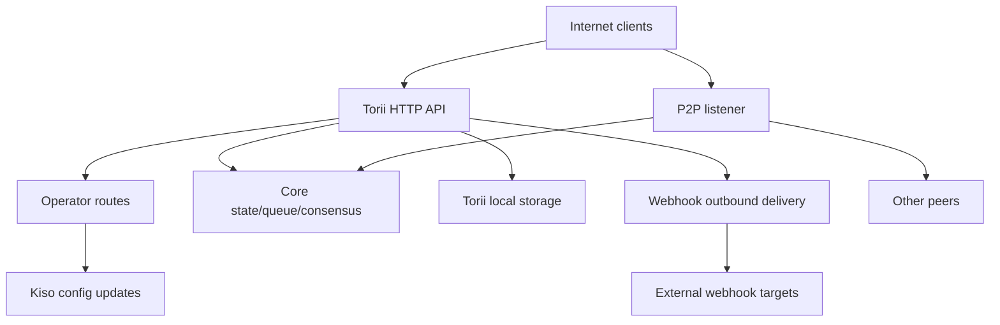

<!-- Auto-generated stub for Japanese (ja) translation. Replace this content with the full translation. -->

---
lang: ja
direction: ltr
source: iroha-threat-model.md
status: complete
generator: scripts/sync_docs_i18n.py
source_hash: 766928cf0dcbfe3513c728bcf0b9fa697a330e8000bc6944ab61e8fcd59751ad
source_last_modified: "2026-02-07T13:27:25.009145+00:00"
translation_last_reviewed: 2026-04-02
translator: machine-google-reviewed
---

# Iroha 脅威モデル (リポジトリ: `iroha`)

## 概要
オペレーター ルートがパブリック インターネットから意図的に到達可能であるが、リクエスト署名を介して認証される必要があり、パブリック Torii エンドポイントで Webhook/添付ファイルが有効になっている、インターネットに公開されたパブリック ブロックチェーン デプロイメントでは、最大のリスクは次のとおりです。オペレーター プレーンの侵害 (`/v1/configuration` および他のオペレーター ルートへの未認証または再生可能な署名付きリクエスト)、SSRF および Webhook 配信を介したアウトバウンド悪用。レート制限が条件付きで適用されるトランザクション/クエリ + ストリーミング エンドポイントを介した高レバレッジ DoS。さらに、`x-forwarded-client-cert` の存在に依存する「mTLS が必要」なポスチャは、Torii が直接公開されるとスプーフィング可能になります。証拠: `crates/iroha_torii/src/lib.rs` (ルーター + ミドルウェア + オペレーター ルート)、`crates/iroha_torii/src/operator_auth.rs` (オペレーター認証の有効化/無効化 + `x-forwarded-client-cert` チェック)、`crates/iroha_torii/src/webhook.rs` (アウトバウンド HTTP クライアント)、`crates/iroha_torii/src/limits.rs` (条件付きレート制限)。

## 範囲と前提条件対象範囲 (ランタイム/プロダクション サーフェス):
- Torii HTTP API サーバーおよびミドルウェア (「オペレーター」ルート、アプリ API、Webhook、添付ファイル、コンテンツ、ストリーミング エンドポイントを含む): `crates/iroha_torii/`、`crates/iroha_torii_shared/`
- ノードのブートストラップとコンポーネントのワイヤリング (Torii + P2P + 状態/キュー/構成更新アクター): `crates/irohad/src/main.rs`
- P2P トランスポートおよびハンドシェイク サーフェス: `crates/iroha_p2p/`
- 構成の形状とデフォルト (特に Torii 認証のデフォルト): `crates/iroha_config/src/parameters/{actual,defaults}.rs`
- クライアント側の構成更新 DTO (`/v1/configuration` で変更できる内容): `crates/iroha_config/src/client_api.rs`
- 展開パッケージの基本: `Dockerfile`、および `defaults/` のサンプル構成 (運用環境では埋め込みサンプル キーを使用しないでください)。

範囲外 (明示的に要求されない限り):
- CI ワークフローとリリースの自動化: `.github/`、`ci/`、`scripts/`
- モバイル/クライアント SDK およびアプリ: `IrohaSwift/`、`java/`、`examples/`
- 文書のみの資料: `docs/`明示的な仮定 (説明に基づく):
- Torii はインターネットに公開されており、認証されていないクライアントからアクセスできます (一部のエンドポイントでは署名やその他の認証が必要な場合があります)。
- オペレーター ルート (`/v1/configuration`、`/v1/nexus/lifecycle`、および有効な場合はオペレーター ゲート テレメトリ/プロファイリング) は公的にアクセス可能であることを目的としており、オペレーターが管理する秘密キーからの署名によって認証する必要があります。証拠 (現在の状態): `crates/iroha_torii/src/lib.rs` (`add_core_info_routes` は `operator_layer` に適用)、`crates/iroha_torii/src/operator_auth.rs` (`enforce_operator_auth` / `authorize_operator_endpoint`)。
- オペレーターの署名検証では、構成内のオペレーター公開鍵のノードローカル許可リストを使用する必要があります (現在のルーターに実装されたオペレーター・ゲートとしては示されていません)。現在のオペレーター ゲートの証拠: `crates/iroha_torii/src/operator_auth.rs` (`authorize_operator_endpoint`)、および既存の正規リクエスト署名ヘルパー (メッセージ構築) の証拠: `crates/iroha_torii/src/app_auth.rs` (`canonical_request_message`)。
- Torii は、必ずしも信頼されたイングレスの背後にデプロイされる必要はありません。したがって、Torii が直接公開される場合、`x-forwarded-client-cert` のようなヘッダーは攻撃者が制御するものとして扱う必要があります。証拠: `crates/iroha_torii/src/lib.rs` (`HEADER_MTLS_FORWARD`、`norito_rpc_mtls_present`) および `crates/iroha_torii/src/operator_auth.rs` (`HEADER_MTLS_FORWARD`、`mtls_present`)。
- Webhook と添付ファイルは、パブリック Torii エンドポイントで有効になります。証拠: `crates/iroha_torii/src/lib.rs` (`/v1/webhooks` および `/v1/zk/attachments` のルート)、`crates/iroha_torii/src/webhook.rs`、`crates/iroha_torii/src/zk_attachments.rs`。- オペレータは `torii.require_api_token = false` を設定または維持できます (デフォルトは `false`)。証拠: `crates/iroha_config/src/parameters/defaults.rs` (`torii::REQUIRE_API_TOKEN`)。
- `/transaction` および `/query` は、パブリック チェーンに到達可能であることが期待されます。注: これらは、「Norito-RPC」ロールアウト ステージとオプションの「mTLS が必要」ヘッダーの存在チェックによってさらにゲートされます。証拠: `crates/iroha_torii/src/lib.rs` (`ConnScheme::from_request`、`evaluate_norito_rpc_gate`) および `crates/iroha_config/src/parameters/defaults.rs` (`torii::transport::norito_rpc::STAGE = "disabled"`)。

リスクのランキングを大きく変える可能性がある未解決の質問:
- オペレータの公開キーはどこで設定されますか (どの設定キー/形式)、キーはどのように識別/ローテーションされますか (キー ID、複数のアクティブなキー、失効)?
- オペレーター署名メッセージの形式とリプレイ保護 (タイムスタンプ/ノンス/カウンタ + サーバー側リプレイ キャッシュ) の正確な内容、および許容されるクロック スキュー ポリシーは何ですか?既存の正規リクエスト ヘルパーに鮮度がないことの証拠: `crates/iroha_torii/src/app_auth.rs` (`canonical_request_message`)。
- 匿名 Webhook の場合、Torii は任意の宛先を許可することが期待されていますか、それとも SSRF 宛先ポリシー (RFC1918/localhost/link-local/metadata をブロックし、オプションで HTTPS を必要とする) を強制する必要がありますか?
- どの Torii 機能がビルドで有効になっていますか (`telemetry`、`profiling`、`p2p_ws`、`app_api_https`、`app_api_wss`)、および `app_api` コンテンツは使用されていますか?証拠: `crates/iroha_torii/Cargo.toml` (`[features]`)。

## システムモデル### 主なコンポーネント
- **インターネット クライアント** (ウォレット、インデクサー、エクスプローラー、ボット): HTTP/Norito リクエストを送信し、WS/SSE 接続を開きます。
- **Torii (HTTP API)**: 事前認証ゲート、オプションの API トークン強制、API バージョン ネゴシエーション、リモート アドレス インジェクション、およびメトリクス用のミドルウェアを備えた axum ルーター。証拠: `crates/iroha_torii/src/lib.rs` (`create_api_router`、`enforce_preauth`、`enforce_api_token`、`enforce_api_version`、`inject_remote_addr_header`)。
- **オペレーター/認証コントロール プレーン (現在) および望ましい状態**: オペレーター ルートは現在 `operator_auth::enforce_operator_auth` (WebAuthn/トークン。構成によって効果的に無効にできます) によって保護されていますが、展開要件は、構成内のオペレーター公開キーの許可リストに対して検証される署名ベースのオペレーター認証です。正規のリクエスト メッセージ ヘルパーが存在し、メッセージの構築に再利用できますが、構成キー (ワールド ステート アカウントではない) を使用するように検証を適合させる必要があります。証拠: `crates/iroha_torii/src/lib.rs` (`add_core_info_routes` は `operator_layer` を使用)、`crates/iroha_torii/src/operator_auth.rs` (`authorize_operator_endpoint`)、`crates/iroha_torii/src/app_auth.rs` (`canonical_request_message`、 `verify_canonical_request`)。- **コア ノード コンポーネント (インプロセス)**: トランザクション キュー、状態/WSV、コンセンサス (Sumeragi)、ブロック ストレージ (Kura)、構成更新アクター (Kiso) など、Torii に渡されます。証拠: `crates/irohad/src/main.rs` (`Torii::new_with_handle(...)` は `queue`、`state`、`kura`、`kiso`、`sumeragi` を受信し、経由で開始されます) `torii.start(...)`)。
- **P2P ネットワーキング**: 暗号化されたフレーム化されたピアツーピア転送とハンドシェイク。オプションの TLS-over-TCP が存在しますが、証明書の検証は意図的に許容されています。証拠: `crates/iroha_p2p/src/lib.rs` (タイプ エイリアス `NetworkHandle<..., X25519Sha256, ChaCha20Poly1305>`)、`crates/iroha_p2p/src/transport.rs` (`NoCertificateVerification` を備えた `p2p_tls` モジュール)。
- **Torii ローカル永続性**: `./storage/torii` 添付ファイル/Webhook/キューのデフォルトのベース ディレクトリ。証拠: `crates/iroha_config/src/parameters/defaults.rs` (`torii::data_dir()`)、`crates/iroha_torii/src/webhook.rs` (永続 `webhooks.json`)、`crates/iroha_torii/src/zk_attachments.rs` (`./storage/torii/zk_attachments/` の下に保存)。
- **アウトバウンド Webhook ターゲット**: Torii は、任意の `http://` URL (および機能を備えた `https://`/`ws(s)://` のみ) にイベントを配信できます。証拠: `crates/iroha_torii/src/webhook.rs` (`http_post_plain`、`http_post_https`、`ws_send`)。### データ フローと信頼境界
- インターネットクライアント → Torii HTTP API
  - データ: Norito バイナリ (`SignedTransaction`、`SignedQuery`)、JSON DTO (アプリ API)、WS/SSE サブスクリプション、ヘッダー (`x-api-token` を含む)。
  - チャネル: HTTP/1.1 + WebSocket + SSE (axum)。
  - 保証: オプションの API トークン (`torii.require_api_token`)、事前認証接続/レート ゲーティング、API バージョン ネゴシエーション。多くのハンドラーは、条件付きでエンドポイントごとのレート制限を適用します (`enforce=false` の場合はバイパスできます)。証拠: `crates/iroha_torii/src/lib.rs` (`enforce_preauth`、`validate_api_token`、`handler_post_transaction`、`handler_signed_query`)、`crates/iroha_torii/src/limits.rs` (`allow_conditionally`)。
  - 検証: 一部のエンドポイント (トランザクションなど) の本文制限、Norito デコード、一部のアプリ エンドポイントの要求署名 (正規の要求ヘッダー)。証拠: `crates/iroha_torii/src/lib.rs` (`add_transaction_routes` は `DefaultBodyLimit::max(...)` を使用)、`crates/iroha_torii/src/app_auth.rs` (`verify_canonical_request`)。- インターネットクライアント → 「オペレータ」ルート (Torii)
  - データ: 構成更新 (`ConfigUpdateDTO`)、レーン ライフサイクル プラン、テレメトリ/デバッグ/ステータス/メトリクス (有効な場合)。
  - チャネル: HTTP。
  - 保証: 現在のリポジトリは、`operator_auth::enforce_operator_auth` ミドルウェアを使用してこれらのルートをゲートします。これは、`torii.operator_auth.enabled=false` の場合は事実上何も行われません。望ましい状態は、設定のオペレータ公開キーを使用した署名ベースの認証であり、この境界で実装および強制する必要があります (また、Torii が直接公開されている場合は、`x-forwarded-client-cert` に依存してはなりません)。証拠: `crates/iroha_torii/src/lib.rs` (`add_core_info_routes` は `operator_layer` に適用)、`crates/iroha_torii/src/operator_auth.rs` (`authorize_operator_endpoint`、`mtls_present`)。
  - 検証: 主に DTO 解析。 `handle_post_configuration` 自体には暗号化認証はありません (`kiso.update_with_dto` に委任されます)。証拠: `crates/iroha_torii/src/routing.rs` (`handle_post_configuration`)。

- Torii → コアキュー/状態/コンセンサス (インプロセス)
  - データ: トランザクションの送信、クエリの実行、状態の読み取り/書き込み、コンセンサス テレメトリ クエリ。
  - チャネル: インプロセス Rust 呼び出し (共有 `Arc` ハンドル)。
  - 保証: 信頼できる境界を想定。セキュリティは、特権操作を呼び出す前に Torii がリクエストを正しく認証/認可するかどうかに依存します。証拠: `crates/irohad/src/main.rs` (`Torii::new_with_handle(...)` 配線) および `routing::handle_*` を呼び出す Torii ハンドラー。- Torii → Kiso (構成更新アクター)
  - データ: `ConfigUpdateDTO` は、ログ、P2P ACL、ネットワーク/トランスポート設定、SoraNet ハンドシェイクなどを変更できます。
  - チャネル: 処理中のメッセージ/ハンドル。
  - 保証: 認可は Torii 境界で期待されます。 update DTO 自体に機能があります。証拠: `crates/iroha_config/src/client_api.rs` (`ConfigUpdateDTO` フィールドには、`network_acl`、`transport.norito_rpc`、`soranet_handshake` などが含まれます)。

- Torii → ローカルディスク (`./storage/torii`)
  - データ: Webhook レジストリとキューに入れられた配信。添付ファイルとサニタイザーのメタデータ。 GC/TTL の動作。
  - チャネル: ファイルシステム。
  - 保証: ローカル OS 権限 (コンテナーは Dockerfile で非 root として実行されます)。 「テナント」による論理分離は、ミドルウェアによって挿入された API トークンまたはリモート IP ヘッダーに基づいています。証拠: `Dockerfile` (`USER iroha`)、`crates/iroha_torii/src/lib.rs` (`inject_remote_addr_header`、`zk_attachments_tenant`)。

- Torii → Webhook ターゲット (アウトバウンド)
  - データ: イベント ペイロード + 署名ヘッダー。
  - チャネル: `http://` の生の TCP HTTP クライアント。有効な場合は、`https://` の場合はオプションの `hyper+rustls`。有効な場合はオプションの WS/WSS。
  - 保証: タイムアウト/再試行。コード内に宛先ホワイトリストが表示されません。 Webhook CRUD が開いている場合、URL は攻撃者の影響を受けます。証拠: `crates/iroha_torii/src/webhook.rs` (`handle_create_webhook`、`http_post_plain/http_post`)。- P2P ピア (信頼できないネットワーク) → P2P トランスポート/ハンドシェイク
  - データ: ハンドシェイクの序文/メタデータ、フレーム化された暗号化メッセージ、コンセンサス メッセージ。
  - チャネル: P2P トランスポート (TCP/QUIC/etc、機能に依存)、暗号化されたペイロード。オプションの TLS-over-TCP は、証明書の検証を明示的に許可します。
  - 保証: アプリケーション層での暗号化と署名付きハンドシェイク。トランスポート層 TLS は証明書による認証を行いません。証拠: `crates/iroha_p2p/src/lib.rs` (暗号化タイプ)、`crates/iroha_p2p/src/transport.rs` (`NoCertificateVerification` コメントと実装)。

#### 図

## 資産とセキュリティ目標|資産 |なぜそれが重要なのか |セキュリティ対策方針 (C/I/A) |
|---|---|---|
|チェーン状態 / WSV / ブロック |整合性の失敗はコンセンサスの失敗になります。可用性の障害によりチェーンが停止します。 I/A |
|コンセンサス活性 (Sumeragi) |パブリックブロックチェーンの価値は持続的なブロック生成に依存します |あ |
|ノードの秘密鍵 (ピア ID、署名鍵) |キーの侵害により、ID の乗っ取り、署名の悪用、またはネットワークの分割が可能になります。 C/I |
|ランタイム設定 (Kiso 更新) |ネットワーク ACL とトランスポート設定を制御します。誤用すると、保護が無効になったり、悪意のあるピアが許可されたりする可能性があります。私 |
|トランザクションキュー/メモリプール |フラッディングはコンセンサスを枯渇させ、CPU/メモリを使い果たす可能性があります。あ |
| Torii 永続性 (`./storage/torii`) |ディスクが枯渇すると、ノードがクラッシュする可能性があります。保存されたデータは下流の処理に影響を与える可能性があります。 A (場合によっては C/I) |
|アウトバウンド Webhook チャネル | SSRF、内部ネットワークからのデータ漏洩、または信頼できる出口 IP からのスキャンに悪用される可能性があります。 C/I/A |
|テレメトリ/メトリクス/デバッグ データ |標的型攻撃に役立つネットワーク トポロジと動作状態が漏洩する可能性がある | C |

## 攻撃者モデル### 機能
- リモートの認証されていないインターネット攻撃者は、任意の HTTP リクエストを送信し、長時間存続する WS/SSE 接続を保持し、ペイロードをリプレイまたはスプレーする (ボットネット) 可能性があります。
- どの当事者もキーを生成し、大量のスパムを含む署名付きトランザクション/クエリ (パブリック ブロックチェーン) を送信できます。
- 悪意のある/侵害されたピアは P2P に接続し、許可された制約内でプロトコルの悪用、フラッディング、またはハンドシェイク操作を試みる可能性があります。
- Webhook CRUD が公開された場合、攻撃者は、攻撃者が制御する Webhook URL を登録し、アウトバウンド コールバックを受信することができます (また、コールバックを内部宛先に誘導する可能性があります)。

### 非能力
- エンドポイントが公開されていないか、ボリューム権限が正しく設定されていない場合、ローカル ファイルシステムに直接アクセスできません。
- 鍵を侵害することなく、既存のピア/オペレーター鍵の署名を偽造する機能はありません。
- 通常の状態では最新の暗号 (X25519、ChaCha20-Poly1305、Ed25519) を解読する能力は想定されていません。

## エントリーポイントと攻撃対象領域|表面 |到達方法 |信頼境界 |メモ |証拠 (リポジトリ パス/シンボル) |
|---|---|---|---|---|
| `POST /transaction` |インターネットHTTP |インターネット → Torii | Norito バイナリ署名付きトランザクション。レート制限は条件付きです (`enforce` は false になる可能性があります)。 `crates/iroha_torii/src/lib.rs` (`handler_post_transaction`、`ConnScheme::from_request`) |
| `POST /query` |インターネットHTTP |インターネット → Torii | Norito バイナリ署名付きクエリ。レート制限は条件付きです (`enforce` は false になる可能性があります)。 `crates/iroha_torii/src/lib.rs` (`handler_signed_query`) |
| Norito-RPC ゲート |インターネット HTTP ヘッダー |インターネット → Torii |ロールアウト段階 + ヘッダーの存在によるオプションの「mTLS が必要」。カナリアは `x-api-token` を使用します。 `crates/iroha_torii/src/lib.rs` (`evaluate_norito_rpc_gate`、`HEADER_MTLS_FORWARD`) |
| `POST/GET/DELETE /v1/webhooks...` |インターネット HTTP (アプリ API) |インターネット → Torii → アウトバウンド |意図的に匿名化されています。 Webhook CRUD により、任意の URL へのアウトバウンド配信が可能になります。 SSRF リスク | `crates/iroha_torii/src/lib.rs` (`handler_webhooks_*`)、`crates/iroha_torii/src/webhook.rs` (`http_post`) |
| `POST/GET /v1/zk/attachments...` |インターネット HTTP (アプリ API) |インターネット → Torii → ディスク |意図的に匿名化されています。添付ファイルのサニタイザー + 解凍 + 永続化。ディスク/CPU 枯渇面 (テナントは有効な場合は API トークン、それ以外の場合は挿入されたヘッダーを介したリモート IP) `crates/iroha_torii/src/lib.rs` (`handler_zk_attachments_*`、`zk_attachments_tenant`)、`crates/iroha_torii/src/zk_attachments.rs` || `GET /v1/content/{bundle}/{path...}` |インターネットHTTP |インターネット → Torii → 状態/ストレージ |認証モード + PoW + 範囲をサポート。下りリミッター | `crates/iroha_torii/src/content.rs` (`handle_get_content`、`enforce_pow`、`enforce_auth`)
|ストリーミング: `/v1/events/sse`、`/events` (WS)、`/block/stream` (WS) |インターネット |インターネット → Torii |接続が長続きします。 DoS サーフェス | `crates/iroha_torii/src/lib.rs` (`add_network_stream_routes`) |
| `GET/POST /v1/configuration` |インターネットHTTP |インターネット → オペレータールート → Kiso |導入の目的: オペレーターの署名が構成許可リストのキーに対して検証されます。現在のリポジトリは、オペレーター ミドルウェア (ルート グループに署名ゲートが表示されない) 経由でのみ保護し、更新アプリケーションを Kiso | に委任します。 `crates/iroha_torii/src/lib.rs` (`add_core_info_routes`、`handler_post_configuration`)、`crates/iroha_torii/src/operator_auth.rs` (`enforce_operator_auth`)、`crates/iroha_torii/src/routing.rs` (`handle_post_configuration`)、`crates/iroha_torii/src/app_auth.rs` (既存の正規リクエスト署名ヘルパー) |
| `POST /v1/nexus/lifecycle` |インターネットHTTP |インターネット → オペレータルート → コア |署名認証されることを目的としたオペレーター エンドポイント。現在はオペレーターミドルウェアによって保護されており、オペレーター認証が無効になっている場合は公開される可能性があります。 `crates/iroha_torii/src/lib.rs` (`add_core_info_routes`、`handler_post_nexus_lane_lifecycle`)、`crates/iroha_torii/src/operator_auth.rs` (`authorize_operator_endpoint`)|テレメトリ/プロファイリング エンドポイント (機能ゲート型) |インターネットHTTP |インターネット → オペレータールート |オペレーターゲート型ルートグループ。オペレーター認証が無効で署名ゲートが存在しない場合、これらは公開され、運用データが漏洩したり、DoS ベクトルとなる可能性があります。 `crates/iroha_torii/src/lib.rs` (`add_telemetry_routes`、`add_profiling_routes`)、`crates/iroha_torii/src/operator_auth.rs` (`authorize_operator_endpoint`)
| P2P TCP/TLS トランスポート |インターネット / ピアネットワーク |インターネット/ピア → P2P |暗号化された P2P フレーム + ハンドシェイク。 TLS 証明書検証は有効にすると寛容になります。 `crates/iroha_p2p/src/lib.rs` (`NetworkHandle`)、`crates/iroha_p2p/src/transport.rs` (`p2p_tls::NoCertificateVerification`) |

## 最も多い悪用パス

1. **攻撃者の目標: ランタイム設定の更新を通じてノードの動作を乗っ取る**
   1) オペレーターのルートが到達可能で、オペレーターの認証が存在しない/バイパス可能な (オペレーターの認証が無効で署名ゲートがないなど) インターネットに公開された Torii を見つけます。  
   2) `POST /v1/configuration` と `ConfigUpdateDTO` を組み合わせて、ネットワーク ACL を緩めるかトランスポート設定を変更します。  
   3) ピアとして参加するか、パーティション/構成ミスを誘発します。コンセンサスを低下させたり、攻撃者が制御するインフラストラクチャを介してトランザクションをルーティングしたりします。  
   影響: ノード (および潜在的にネットワーク) の整合性と可用性が損なわれます。2. **攻撃者の目標: キャプチャされたオペレーター署名リクエストを再生する**
   1) 有効な署名付きオペレータ リクエストを 1 つ取得します (例: 侵害されたオペレータ マシン、誤って設定されたプロキシ ログ、または TLS が安全に終了されない環境経由)。  
   2) 署名スキームに鮮度 (タイムスタンプ/ノンス) がなく、サーバー側でリプレイが拒否される場合は、パブリック オペレーター ルートに対して同じリクエストをリプレイします。  
   3) 可用性を低下させたり、防御を弱めたりする構成変更、ロールバック、または強制的な切り替えを繰り返し引き起こす。  
   影響: 「署名認証」にもかかわらず、整合性/可用性が侵害されます。  

3. **攻撃者の目標: Norito-RPC ロールアウトを変更して保護を無効/ゲートする**
   1) `POST /v1/configuration` から `transport.norito_rpc.stage` または `require_mtls` を更新します。  
   2) `/transaction` および `/query` を強制オープンまたは強制クローズし、可用性とアドミッション制御に影響を与えます。  
   影響: 対象を絞った機能停止またはアドミッション コントロールのバイパス。4. **攻撃者の目標: SSRF による通信事業者の内部ネットワークへの侵入**
   1) `POST /v1/webhooks` 経由で内部宛先 (RFC1918 ホスト、メタデータ IP、コントロール プレーンなど) を指す Webhook エントリを作成します。  
   2) 一致するイベントを待ちます。 Torii は、ネットワーク上の位置からアウトバウンド HTTP リクエストを配信します。  
   3) 応答/ステータス/タイミングと繰り返しの再試行を使用して内部サービスを調査します (応答コンテンツが他の場所で表面化した場合は、漏洩する可能性があります)。  
   影響: 内部ネットワークの露出、横方向の移動足場、風評被害、メタデータ エンドポイントを介した資格情報の露出の可能性。  

5. **攻撃者の目標: トランザクション/クエリ受付のサービスを拒否**
   1) `POST /transaction` および `POST /query` を有効/無効な Norito ボディでフラッドします。  
   2) 多数の WS/SSE サブスクリプションと低速クライアントを維持します。  
   3) 通常動作で条件付きレート制限 (`enforce=false`) を利用して、スロットルを回避します。  
   影響: CPU/メモリの枯渇、キューの飽和、コンセンサスストール。  

6. **攻撃者の目標: アタッチメントによるディスクの排出**
   1) 拡張限界に近い最大サイズのペイロードおよび/または圧縮アーカイブで `/v1/zk/attachments` をフラッドします。  
   2) 複数のソース IP (またはテナント キーイングの弱点) を使用して、テナントごとの上限を回避します。  
   3) TTL/GC が遅れるまで持続します。 `./storage/torii`を埋めてください。  
   影響: ノードのクラッシュ、ブロック/トランザクションの処理不能。7. **攻撃者の目標: Torii が直接公開されている場合、「mTLS が必要」ゲートをバイパスする**
   1) オペレーターは、Norito-RPC またはオペレーター認証に対して `require_mtls` を有効にします。  
   2) 攻撃者は `x-forwarded-client-cert: <anything>` でリクエストを送信します。  
   3) ヘッダーを除去する信頼できる入力がない場合、ヘッダー存在チェックは合格します。  
   影響: コントロールが誤って適用された。オペレーターは、mTLS が強制されていないにもかかわらず、mTLS が強制されていると信じています。  

8. **攻撃者の目標: ピア接続の低下 / リソースの消費**
   1) 悪意のあるピアがハンドシェイクを繰り返し試行するか、最大サイズに近いフレームをフラッディングします。  
   2) 許容的なトランスポート層 TLS (有効な場合) を利用して、証明書に基づく早期拒否を回避します。  
   影響: 接続のチャーン、CPU 使用率、ピアの可用性の低下。  

9. **攻撃者の目標: テレメトリ/デバッグ エンドポイントを介した偵察**
   1) テレメトリ/プロファイリングが有効で、オペレーター認証が欠落している/バイパス可能な場合は、`/status`、`/metrics`、デバッグ ルートをスクレイピングします。  
   2) 漏洩したトポロジ/健全性データを使用して、攻撃のタイミングを計り、特定のコンポーネントをターゲットにします。  
   影響: 攻撃者の成功率が増加。情報漏洩の可能性。  

## 脅威モデルのテーブル|脅威ID |脅威のソース |前提条件 |脅威アクション |影響 |影響を受ける資産 |既存の管理 (証拠) |ギャップ |推奨される緩和策 |検出のアイデア |可能性 |影響の重大度 |優先順位 |
|---|---|---|---|---|---|---|---|---|---|---|---|---|| TM-001 |リモートのインターネット攻撃者 | Torii インターネットに公開されています。オペレータールートはパブリックです。オペレーター認証が存在しないかバイパス可能であるか、署名ベースのオペレーター認証が実装されていないか実装が間違っています。オペレーター ルート (`/v1/configuration`、`/v1/nexus/lifecycle` など) を呼び出して、ランタイム設定、ネットワーク ACL、またはトランスポート設定を変更します。ノードの引き継ぎ/分割。悪意のあるピアを許可します。保護を無効にする |ランタイム構成。コンセンサスの活性化。チェーンの完全性。ピアキー |オペレーター ルートはオペレーター ミドルウェアの背後にありますが、無効な場合、`authorize_operator_endpoint` は `Ok(())` を返します。 config update は追加の認証なしで Kiso に委任します。証拠: `crates/iroha_torii/src/lib.rs` (`add_core_info_routes`)、`crates/iroha_torii/src/operator_auth.rs` (`authorize_operator_endpoint`)、`crates/iroha_torii/src/routing.rs` (`handle_post_configuration`)、`crates/iroha_config/src/client_api.rs` (`ConfigUpdateDTO`) |オペレータ ルート グループには署名ベースのオペレータ認証が表示されません。 Torii が直接公開されている場合、ヘッダーベースの「mTLS」はなりすまし可能です。リプレイ保護が未定義 |オペレーター公開鍵の構成許可リストに対して検証されるオペレーター・ルートに対して必須の署名ベースのオペレーター認証を実装します (複数の鍵 + 鍵 ID をサポート)。制限付きリプレイ キャッシュには鮮度 (タイムスタンプ + ノンス) が含まれます。 TLS をエンドツーエンドで強制します (`x-forwarded-client-cert` を信頼しないでください)。厳格なレート制限を適用し、すべてのオペレーターのアクションに監査ログを記録します。オペレータ ルートがヒットするとアラートを発します。監査ログ構成の差分。繰り返されるシグネチャ/ノンスを検出します。異常なアップデートを監視する周波数とソース IP |高 (署名認証 + リプレイ保護が実装および強制されるまで) |高 | **重大** || TM-002 |リモートのインターネット攻撃者 | Webhook CRUD は匿名でインターネットからアクセス可能です。 SSRF 宛先ポリシーがありません |内部/特権 URL をターゲットとする Webhook を作成し、配信をトリガーする | SSRF、内部スキャン、メタデータ資格情報の漏洩、アウトバウンド DoS | Webhook チャネル。内部ネットワーク。利用可能性 | Webhook は存在します。配信ではタイムアウト/バックオフ/最大試行を使用します。 `http://` 配信は生の TCP を使用します。証拠: `crates/iroha_torii/src/lib.rs` (`handler_webhooks_*`)、`crates/iroha_torii/src/webhook.rs` (`handle_create_webhook`、`http_post_plain`、`WebhookPolicy`) |宛先ホワイトリスト/IP 範囲ブロックはありません。 `http://` は許可されます。 DNS 再バインド/リダイレクト制御は表示されません。 Webhook CRUD レート制限は条件付きです (定常状態では実質的にオフになる可能性があります)。 Webhook を有効にしたままにして、SSRF コントロールを追加します。プライベート/ループバック/リンクローカル/メタデータの IP 範囲とホスト名をブロックし、アドレスを解決して固定し、リダイレクトを制限し、アウトバウンド同時実行を制限します。作成は匿名であるため、IP ごとの常時クォータとグローバル キャップを追加し、Webhook の作成/更新用のオプションの PoW トークンを検討してください。 Webhook ターゲット URL と解決された IP のログとメトリック。ブロックされた宛先について警告します。プライベート IP の試行と高い失敗/再試行率についてのアラート。 Webhook CRUD 率とキューの飽和度を監視する |高 |高 | **重大** || TM-003 |リモートのインターネット攻撃者/スパマー |パブリック `/transaction` および `/query`。条件付きレート制限はコモンモードでは強制されません。フラッド tx/クエリ送信、および WS/SSE ストリーム | CPU/メモリの枯渇。キューの飽和。コンセンサスが失速する |可用性 (Torii + コンセンサス)。キュー/メモリプール |事前認証ゲートは IP ごとに接続を制限し、禁止することができます。証拠: `crates/iroha_torii/src/lib.rs` (`enforce_preauth`)、`crates/iroha_torii/src/limits.rs` (`PreAuthGate`)主要なレート リミッターの多くは条件付きです (`enforce=false` の場合、`allow_conditionally` は true を返します)。分散攻撃者は IP ごとの制限を回避します。インターネットに公開される場合、tx/クエリ/ストリームに常時オンのレート制限を追加します。料金ポリシーに関係なく、エンドポイントごとに構成可能なレート制限を追加します。 PoW で高価なエンドポイントを保護するか、署名/アカウントベースのクォータを要求する |監視: 事前認証拒否、キューの長さ、TX/クエリ レート、WS/SSE アクティブ接続。異常と持続的な容量制限に関するアラート |高 |高 | **高い** || TM-004 |リモートのインターネット攻撃者 |テレメトリ/プロファイリング機能が有効になっています。オペレータ認証が無効になっているか、署名ゲートがありません | `/status`、`/metrics`、デバッグ エンドポイントをスクレイピングします。高価なデバッグ ステータスを要求する |情報開示。運用上の DoS。標的型攻撃の有効化 |テレメトリ/デバッグデータ。利用可能性 |テレメトリ/プロファイリング ルート グループは `operator_auth::enforce_operator_auth` で階層化されています。証拠: `crates/iroha_torii/src/lib.rs` (`add_telemetry_routes`、`add_profiling_routes`)、`crates/iroha_torii/src/operator_auth.rs` (`authorize_operator_endpoint`) Operator ミドルウェアは無効にすると何も操作されません。シグネチャベースのオペレータ認証は、これらのルート グループでは表示されません。これらのルート グループには、同じ必須の署名ベースのオペレータ認証が必要です。可能な場合は、ハード レート制限と応答キャッシュを追加します。デフォルトでパブリック ノード上でプロファイリング/デバッグ エンドポイントを公開しないようにします。アクセスログを追跡します。スクレイピング パターンと継続的な高コスト リクエストに関するアラート |中 |中 | **中** || TM-005 |リモート インターネット攻撃者 (設定ミスの悪用) |オペレーターは `require_mtls` を有効にしますが、Torii が直接公開されます (またはプロキシ/ヘッダーのサニタイズが保証されていません)。 「mTLS が必要」チェックを満たすために `x-forwarded-client-cert` を偽装 |誤った安心感。 Norito-RPC / オペレーター認証ポリシーのバイパス ゲーティング |オペレーター/認証境界。アドミッションコントロール | `require_mtls` はヘッダーの有無によってチェックされます。証拠: `crates/iroha_torii/src/lib.rs` (`HEADER_MTLS_FORWARD`、`norito_rpc_mtls_present`)、`crates/iroha_torii/src/operator_auth.rs` (`mtls_present`) Torii ではクライアント証明書の暗号検証がありません。外部イングレスコントラクトに依存します | Torii がパブリックにアクセス可能な場合は、セキュリティのために `x-forwarded-client-cert` に依存しないでください。 mTLS が必要な場合は、Torii またはクライアント ヘッダーを削除する信頼できるイングレスでクライアント証明書検証を強制します。それ以外の場合は、インターネットに接続された展開のヘッダーベースのゲートを削除または無視します。 `x-forwarded-client-cert` を含むリクエストが Torii に直接到達するとアラートを発します。 Norito-RPC およびオペレーター認証のゲート結果をログに記録します。許可されたトラフィックの突然の変化を監視する |高 |高 | **高い** || TM-006 |リモートのインターネット攻撃者 |添付ファイルのエンドポイントは匿名であり、インターネットからアクセス可能です。攻撃者は最大サイズまたは圧縮爆弾のペイロードを送信できます。サニタイザー/解凍/永続化を悪用して CPU/ディスクを消費する |ノードの不安定性。ディスクの枯渇;スループットの低下 | Torii ストレージ。利用可能性 |添付ファイルの制限 + サニタイザーおよび最大拡張/アーカイブ深度が存在します。証拠: `crates/iroha_config/src/parameters/defaults.rs` (`ATTACHMENTS_MAX_BYTES`、`ATTACHMENTS_MAX_EXPANDED_BYTES`、`ATTACHMENTS_MAX_ARCHIVE_DEPTH`、`ATTACHMENTS_SANITIZER_MODE`)、`crates/iroha_torii/src/zk_attachments.rs` (`inspect_bytes`、制限)、 `crates/iroha_torii/src/lib.rs` (`handler_zk_attachments_*`、`zk_attachments_tenant`) | API トークンがオフの場合、テナント ID は主に IP ベースになります。分散ソースはキャップをバイパスします。 TTL では引き続き複数日の蓄積が可能です。添付ファイルは公開され匿名である必要があるため、グローバル ディスク クォータとバックプレッシャーを強制し、デフォルト (TTL/最大バイト数) を厳しくし、サニタイザーを OS レベルのサンドボックスでサブプロセス モードに保ち、書き込み用のオプションの PoW ゲーティングを検討します。 IP ごとのクォータがスプーフィングされたヘッダーによってバイパスされないようにします (`inject_remote_addr_header` を使用し続けます)。 `./storage/torii` のディスク使用量を監視します。添付ファイルの作成率、サニタイザーの拒否、テナントごとの蓄積に関するアラート。 GC ラグを追跡する |中 |高 | **高い** || TM-007 |悪意のあるピア |ピアは P2P リスナーに到達できます。オプションで TLS を有効にする |フラッドハンドシェイク/フレーム。リソースの枯渇を試みます。早期の拒否を回避するために寛容な TLS を利用する |接続性の低下。資源の燃焼。部分的なパーティショニング |可用性;ピア接続 |暗号化されたフレーム + サイズ超過メッセージのハンドシェイク エラー。証拠: `crates/iroha_p2p/src/lib.rs` (`Error::FrameTooLarge`、ハンドシェイク エラー)、`crates/iroha_p2p/src/transport.rs` (`p2p_tls` は許容的ですが、アプリ層の署名付きハンドシェイクが期待されます) |トランスポート層は認証しません。上位レベルの認証の前に DoS が可能。ピアごと/IP スロットルが不十分である可能性があります。 IP/ASN ごとに厳格な接続制限を追加します。レート制限ハンドシェイク試行。パブリック ノード上でホワイトリストに登録されたピア キーを要求することを検討してください。最大フレーム サイズが控えめであることを確認します。バックプレッシャーを追加し、認証されていないピアの早期ドロップを追加します。インバウンド P2P 接続速度を監視します。繰り返されるハンドシェイクの失敗とフレームが大きすぎるエラーに関するアラート |中 |中 | **中** || TM-008 |サプライチェーン / オペレーターのエラー |オペレーターはサンプルのキー/構成を使用してデプロイします。依存関係が侵害されました |デフォルト/サンプルキーまたは安全でないデフォルトを使用します。依存関係のハイジャック |重要な妥協点。チェーンパーティション。評判の損失 |キー;誠実さ;利用可能性 | Docker は非 root で実行され、デフォルトを `/config` にコピーします。証拠: `Dockerfile` (`USER iroha`、`COPY defaults ...`) |サンプル構成には、サンプルの秘密キーが埋め込まれている場合があります。 `require_api_token=false` や `operator_auth.enabled=false` などの安全でないデフォルト |既知のサンプル キーを検出した場合の起動警告/フェールクローズ チェックを追加します。 「パブリック ノード」の強化された構成プロファイルを出荷します。リリース パイプラインで `cargo deny`/SBOM チェックを強制する | `defaults/` のシークレットの CI ゲーティング。安全でない構成の組み合わせに対するランタイム ログの警告 |中 |高 | **高い** || TM-009 |リモートのインターネット攻撃者 |署名ベースのオペレーター認証は、鮮度なしで実装されます。攻撃者は少なくとも 1 つの有効な署名付きオペレーター要求を監視できます。パブリック オペレーター ルートに対して、以前に有効な署名されたオペレーター リクエストを再生します。繰り返される構成変更/ロールバック。対象を絞った停止。防御力の低下 |ランタイム構成。可用性;監査の整合性 |正規署名ヘルパーは、メソッド/パス/クエリ/ボディハッシュからメッセージを構築しますが、タイムスタンプ/ノンスは含まれません。証拠: `crates/iroha_torii/src/app_auth.rs` (`canonical_request_message`) |リプレイ保護は署名に固有のものではありません。オペレータールートは現在、リプレイキャッシュ/ノンス追跡を表示しません。署名されたメッセージに `timestamp` + `nonce` (または単調カウンター) を含め、厳密なクロック スキューを強制し、オペレーター ID をキーとした制限付きリプレイ キャッシュを維持します。重複をログに記録して拒否する |重複した nonce/リクエスト ハッシュに関するアラート。 ID とソースごとにオペレーターのアクションを関連付けます。リプレイ拒否のメトリクスを追加する |中 |高 | **高い** || TM-010 |リモート攻撃者 / インサイダー |オペレーター署名秘密キーは、漏洩可能な場所 (ディスク/構成/CI アーティファクト) に保管されます。オペレーターの秘密キーを盗み、有効な署名付きオペレーター要求を発行します。検出可能性が低く、オペレーター プレーンの完全な侵害 |演算子キー。ランタイム構成。コンセンサスの活性度 |一部の Torii コンポーネントは、構成から秘密キーを既にロードしています (オフライン発行者のオペレーター キーなど)。証拠: `crates/iroha_torii/src/lib.rs` (`torii.offline_issuer.operator_private_key` を `KeyPair` に読み取る)、`Dockerfile` (非 root として実行) |キーの保管/ローテーション/HSM の使用はコードによって強制されません。署名認証はこのリスクを継承します。可能な場合は、ハードウェア ベースのキー (HSM/セキュア エンクレーブ) を使用します。リポジトリまたは誰でも読み取り可能な構成に演算子キーを埋め込むことは避けてください。厳密なファイル権限とローテーションを強制します。オペレーターのアクションにマルチシグ/しきい値を考慮する |新しい IP/ASN からのオペレーターのアクションに関するアラート。オペレーターのアクションの不変の監査ログを維持します。疑わしいキーをローテーションする |中 |高 | **高い** |

## 重要度の調整

このリポジトリ + 明確化されたデプロイメント コンテキスト (インターネットに公開されたパブリック チェーン、オペレーター ルートはパブリックであり、署名認証されることを目的としている、信頼できるイングレスが保証されていない) の場合、重大度レベルは次のことを意味します。- **重要**: リモートの認証されていない攻撃者は、ノード/ネットワークの動作を変更したり、多数のノードにわたるブロックの生成を確実に停止したりする可能性があります。
  - 例: `/v1/configuration` (TM-001) のようなオペレーター ルートの署名認証が欠落している/バイパス可能。 SSRF を特権出力からメタデータ エンドポイント/クラスター コントロール プレーンに Webhook します (TM-002)。オペレーターの署名キーの盗難により、有効な署名付きオペレーターのアクションが可能になります (TM-010)。

- **高**: リモート攻撃者は、現実的な前提条件の下で、ノードの継続的な DoS を引き起こしたり、オペレーターが依存する可能性のあるセキュリティ制御をバイパスしたりする可能性があります。
  - 例: 条件付きレート制限が非アクティブな場合の大量の TX/クエリ アドミッション DoS (TM-003)。アタッチメントによるディスク/CPU の枯渇 (TM-006)。鮮度/リプレイ拒否が欠落している場合、キャプチャされた署名付きオペレータ リクエストをリプレイします (TM-009)。

- **中**: 偵察を有意に支援したり、パフォーマンスを低下させたりする攻撃ですが、機能ゲート型であるか、攻撃者の位置を高くする必要があるか、またはすでに大幅な軽減策が存在するかのいずれかです。
  - 例: 有効時のテレメトリ/プロファイリングの露出 (TM-004)。爆発半径が制限された P2P ハンドシェイク フラッディング (TM-007)。- **低**: ありそうもない前提条件、制限された爆発半径、または簡単に軽減できる主に操作可能なフットガンを必要とする攻撃。
  - 例: ブロックチェーンに対して公開されることが期待されるパブリック読み取り専用エンドポイントからの軽微な情報漏洩 (例: `/v1/health`、`/v1/peers`) は、直接的な侵害ではなく主に偵察に役立ちます (ここでは上位の脅威として列挙されていません)。証拠: `crates/iroha_torii_shared/src/lib.rs` (`uri::HEALTH`、`uri::PEERS`)。

## セキュリティレビューの重点パス|パス |なぜそれが重要なのか |関連する脅威 ID |
|---|---|---|
| `crates/iroha_torii/src/lib.rs` |ルーターの構築、ミドルウェアの順序付け、オペレーター ルート グループ、tx/クエリ ハンドラー、認証/レート制限の決定、アプリ API ワイヤリング (webhooks/アタッチメント) | TM-001、TM-002、TM-003、TM-004、TM-005、TM-006 |
| `crates/iroha_torii/src/operator_auth.rs` |オペレーター認証の有効化/無効化動作。ヘッダーベースの mTLS チェック。セッション/トークン。オペレータープレーンの保護とバイパス条件の理解にとって重要です。 TM-001、TM-004、TM-005 |
| `crates/iroha_torii/src/routing.rs` | `/v1/configuration` ハンドラーは、追加の認証なしで Kiso に委任します。ハンドラーの広い表面積 | TM-001、TM-003 |
| `crates/iroha_config/src/client_api.rs` | `ConfigUpdateDTO` 機能 (ネットワーク ACL、トランスポート変更、ハンドシェイク更新) を定義します。 TM-001、TM-009 |
| `crates/iroha_config/src/parameters/defaults.rs` | API トークン/オペレーター認証/Norito-RPC ステージのデフォルトの状態。添付ファイルのデフォルト | TM-003、TM-006、TM-008 |
| `crates/iroha_torii/src/webhook.rs` |アウトバウンド HTTP クライアントとスキームのサポート。 SSRF 表面。粘り強さと配達員 | TM-002 |
| `crates/iroha_torii/src/zk_attachments.rs` |添付ファイルサニタイザー、解凍制限、永続化、テナントキーイング | TM-006 |
| `crates/iroha_torii/src/limits.rs` |事前認証ゲートおよびレート制限ヘルパー。条件付き強制動作 | TM-003 |
| `crates/iroha_torii/src/content.rs` |コンテンツエンドポイント認証/PoW/範囲および出力制限。データの Exfil と DoS に関する考慮事項 | TM-003 || `crates/iroha_torii/src/app_auth.rs` |正規のリクエスト署名 (メッセージの構築と署名の検証)。オペレーター認証に再利用する場合のリプレイリスクの考慮事項 | TM-001、TM-003、TM-009 |
| `crates/iroha_p2p/src/lib.rs` |暗号の選択、フレーミング制限、ハンドシェイク エラー処理。 P2P リスクサーフェス | TM-007 |
| `crates/iroha_p2p/src/transport.rs` | TLS-over-TCP は寛容です。トランスポート動作は DoS サーフェスに影響します。 TM-007 |
| `crates/irohad/src/main.rs` |ブートストラップ Torii + P2P + 構成更新アクター。どのサーフェスが有効であるかを決定します。 TM-001、TM-008 |
| `defaults/nexus/config.toml` |設定例には、埋め込まれたサンプル キーとパブリック バインド アドレスが含まれる場合があります。展開フットガン | TM-008 |
| `Dockerfile` |コンテナーのランタイム ユーザー/権限とデフォルト構成の組み込み (キー マテリアルとオペレーター プレーンの公開は展開に依存します) | TM-008、TM-010 |### 品質チェック
- 対象となるエントリ ポイント: tx/クエリ、ストリーミング、Webhook、添付ファイル、コンテンツ、オペレータ/構成、テレメトリ/プロファイリング (機能ゲート型)、P2P。
- 脅威の対象となる信頼境界: インターネット→Torii、Torii→Kiso/コア/ディスク、Torii→Webhook ターゲット、ピア→P2P。
- ランタイムと CI/dev の分離: CI/docs/mobile は明示的に範囲外です。
- ユーザーの説明が反映されました: インターネットに公開され、オペレーターのルートはパブリックですが、署名認証される必要があります。信頼できるイングレスは保証されていません。パブリック Torii エンドポイントで Webhook/添付ファイルが有効になっています。
- 仮定/未解決の質問は「範囲と仮定」に明示的にリストされています。

## 使用上の注意
- このドキュメントは意図的にリポジトリに基づいて作成されています (証拠アンカーは現在のコードを示しています)。優先度の高いいくつかの緩和策 (オペレーター署名ゲート、Webhook SSRF 宛先ポリシー) には、まだ存在しない新しいコード/構成が必要です。
- ヘッダーベースの「mTLS」信号 (`x-forwarded-client-cert` など) は、信頼できる入力側が信号を取り除いて挿入しない限り、攻撃者が制御するものとして扱います。