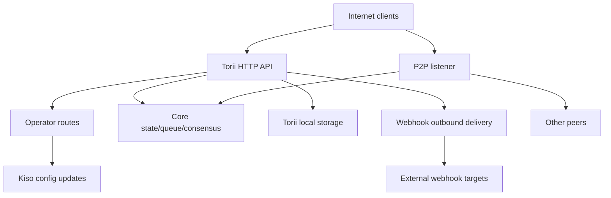

<!-- Auto-generated stub for Georgian (ka) translation. Replace this content with the full translation. -->

---
lang: ka
direction: ltr
source: iroha-threat-model.md
status: complete
generator: scripts/sync_docs_i18n.py
source_hash: 766928cf0dcbfe3513c728bcf0b9fa697a330e8000bc6944ab61e8fcd59751ad
source_last_modified: "2026-02-07T13:27:25.009145+00:00"
translation_last_reviewed: 2026-04-02
translator: machine-google-reviewed
---

# Iroha საფრთხის მოდელი (რეპო: `iroha`)

## რეზიუმე
ინტერნეტში დაუცველი საჯარო ბლოკჩეინის განლაგებისას, სადაც ოპერატორის მარშრუტები მიზანმიმართულად ხელმისაწვდომია საჯარო ინტერნეტიდან, მაგრამ უნდა იყოს დამოწმებული მოთხოვნის ხელმოწერების მეშვეობით, და სადაც ვებ-ჰუკები/დანართები ჩართულია საჯარო Torii საბოლოო წერტილზე, მთავარი რისკებია: ოპერატორი თვითმფრინავის კომპრომისი ან ხელახლა დაკვრა მოთხოვნა (არაავთენტური ხელმოწერით `/v1/configuration` და სხვა ოპერატორის მარშრუტები), SSRF და გამავალი ბოროტად გამოყენება webhook-ის მიწოდების საშუალებით და მაღალი ბერკეტების DoS ტრანსაქციის/მოთხოვნის + სტრიმინგის ბოლო წერტილების მეშვეობით, სადაც განაკვეთის ლიმიტები პირობითად არის აღსრულებული; გარდა ამისა, ნებისმიერი „mTLS საჭირო“ პოზა, რომელიც ეყრდნობა `x-forwarded-client-cert`-ს არსებობას, შეიძლება გაყალბდეს, როდესაც Torii პირდაპირ ზემოქმედებს. მტკიცებულება: `crates/iroha_torii/src/lib.rs` (როუტერი + შუალედური პროგრამა + ოპერატორის მარშრუტები), `crates/iroha_torii/src/operator_auth.rs` (ოპერატორის ავტორიზაციის ჩართვა/გამორთვა + `x-forwarded-client-cert` შემოწმება), `crates/iroha_torii/src/webhook.rs` (გამავალი HTTP კლიენტი), I18008NI00.

## ფარგლები და ვარაუდებიIn-Scope (გაშვების დრო / წარმოების ზედაპირები):
- Torii HTTP API სერვერი და შუალედური პროგრამა, მათ შორის „ოპერატორის“ მარშრუტები, აპების API, ვებ-კაუკები, დანართები, შინაარსი და სტრიმინგის ბოლო წერტილები: `crates/iroha_torii/`, `crates/iroha_torii_shared/`
- კვანძის ჩამტვირთავი და კომპონენტის გაყვანილობა (Torii + P2P + მდგომარეობის/რიგის/კონფიგურაციის განახლების აქტორი): `crates/irohad/src/main.rs`
- P2P სატრანსპორტო და ხელის ჩამორთმევის ზედაპირები: `crates/iroha_p2p/`
- კონფიგურაციის ფორმები და ნაგულისხმევი პარამეტრები (განსაკუთრებით Torii auth ნაგულისხმევი): `crates/iroha_config/src/parameters/{actual,defaults}.rs`
- კლიენტის მიმართ კონფიგურაციის განახლება DTO (რისი შეცვლა შეუძლია `/v1/configuration`-ს): `crates/iroha_config/src/client_api.rs`
- განლაგების შეფუთვის საფუძვლები: `Dockerfile` და მაგალითის კონფიგურაციები `defaults/`-ში (არ გამოიყენოთ ჩაშენებული მაგალითის გასაღებები წარმოებაში).

ფარგლებს გარეთ (თუ ცალსახად არ არის მოთხოვნილი):
- CI სამუშაო ნაკადები და გამოშვების ავტომატიზაცია: `.github/`, `ci/`, `scripts/`
- მობილური/კლიენტის SDK-ები და აპები: `IrohaSwift/`, `java/`, `examples/`
- მხოლოდ დოკუმენტაციის მასალა: `docs/`აშკარა ვარაუდები (თქვენი განმარტებების საფუძველზე):
- Torii ხელმისაწვდომია ინტერნეტით და ხელმისაწვდომია არაავთენტიფიცირებული კლიენტებისთვის (ზოგიერთ საბოლოო წერტილს შეიძლება კვლავ დასჭირდეს ხელმოწერა ან სხვა ავტორიზაცია).
- ოპერატორის მარშრუტები (`/v1/configuration`, `/v1/nexus/lifecycle` და ოპერატორის მიერ დახურული ტელემეტრია/პროფილირება, როდესაც ჩართულია) განკუთვნილია საჯაროდ ხელმისაწვდომი და უნდა მოხდეს ავთენტიფიკაცია ხელმოწერის მეშვეობით ოპერატორის მიერ კონტროლირებადი პირადი გასაღებიდან. მტკიცებულება (მიმდინარე მდგომარეობა): `crates/iroha_torii/src/lib.rs` (`add_core_info_routes` ვრცელდება `operator_layer`), `crates/iroha_torii/src/operator_auth.rs` (`enforce_operator_auth` / `authorize_operator_endpoint`).
- ოპერატორის ხელმოწერის გადამოწმებამ უნდა გამოიყენოს ოპერატორის საჯარო გასაღებების კვანძის ლოკალური დაშვების სია კონფიგურაციაში (არ არის ნაჩვენები როგორც დანერგილი ოპერატორის კარიბჭე მიმდინარე როუტერში). მიმდინარე ოპერატორის კარიბჭის მტკიცებულება: `crates/iroha_torii/src/operator_auth.rs` (`authorize_operator_endpoint`) და არსებული კანონიკური მოთხოვნის ხელმოწერის დამხმარე (შეტყობინებების კონსტრუქცია): `crates/iroha_torii/src/app_auth.rs` (`canonical_request_message`).
- Torii სულაც არ არის განლაგებული სანდო შეღწევის უკან; ამიტომ, სათაურები, როგორიცაა `x-forwarded-client-cert`, უნდა განიხილებოდეს, როგორც თავდამსხმელის მიერ კონტროლირებადი, როდესაც Torii პირდაპირ არის გამოვლენილი. მტკიცებულება: `crates/iroha_torii/src/lib.rs` (`HEADER_MTLS_FORWARD`, `norito_rpc_mtls_present`) და `crates/iroha_torii/src/operator_auth.rs` (`HEADER_MTLS_FORWARD`, `mtls_present`).
- Webhooks და დანართები ჩართულია საჯარო Torii საბოლოო წერტილზე. მტკიცებულება: `crates/iroha_torii/src/lib.rs` (მარშრუტები `/v1/webhooks` და `/v1/zk/attachments`), `crates/iroha_torii/src/webhook.rs`, `crates/iroha_torii/src/zk_attachments.rs`.- ოპერატორს შეუძლია დააყენოს ან შეინახოს `torii.require_api_token = false` (ნაგულისხმევი არის `false`). მტკიცებულება: `crates/iroha_config/src/parameters/defaults.rs` (`torii::REQUIRE_API_TOKEN`).
- მოსალოდნელია, რომ `/transaction` და `/query` ხელმისაწვდომი იქნება საჯარო ჯაჭვისთვის. შენიშვნა: ისინი დამატებით შემოიფარგლება "Norito-RPC" გაშვების ეტაპით და არჩევითი "mTLS საჭირო" სათაურის არსებობის შემოწმებით. მტკიცებულება: `crates/iroha_torii/src/lib.rs` (`ConnScheme::from_request`, `evaluate_norito_rpc_gate`) და `crates/iroha_config/src/parameters/defaults.rs` (`torii::transport::norito_rpc::STAGE = "disabled"`).

ღია კითხვები, რომლებიც არსებითად შეცვლის რისკის რეიტინგს:
- სად არის კონფიგურირებული ოპერატორის საჯარო გასაღებები (რომელი კონფიგურაციის კლავიატურა/ფორმატი) და როგორ ხდება გასაღებების იდენტიფიცირება/როტაცია (გასაღების ID, მრავალი აქტიური გასაღები, გაუქმება)?
- რა არის ზუსტი ოპერატორის ხელმოწერის შეტყობინების ფორმატი და განმეორებითი დაცვა (დროის ანაბეჭდი/არაერთი/მთვლელი + სერვერის მხრიდან განმეორებითი ქეში) და საათის დახრილობის რომელი პოლიტიკაა მისაღები? მტკიცებულება, რომ არსებული კანონიკური მოთხოვნის დამხმარე არ აქვს სიახლეს: `crates/iroha_torii/src/app_auth.rs` (`canonical_request_message`).
- ანონიმური ვებჰუკებისთვის, მოსალოდნელია თუ არა Torii დაუშვას თვითნებური მიმართულებები, თუ უნდა განახორციელოს SSRF დანიშნულების პოლიტიკა (დაბლოკოს RFC1918/localhost/link-local/მეტამონაცემები და სურვილისამებრ მოითხოვოს HTTPS)?
- რომელი Torii ფუნქციებია ჩართული თქვენს ნაგებობაში (`telemetry`, `profiling`, `p2p_ws`, `app_api_https`, `COPY defaults ...`, გამოყენებულია Sumeragi კონტენტი? მტკიცებულება: `crates/iroha_torii/Cargo.toml` (`[features]`).

## სისტემის მოდელი### ძირითადი კომპონენტები
- **ინტერნეტ კლიენტები** (საფულეები, ინდექსატორები, მკვლევარები, ბოტები): გაგზავნეთ HTTP/Norito მოთხოვნები და გახსენით WS/SSE კავშირები.
- **Torii (HTTP API)**: axum როუტერი შუალედური პროგრამით წინასწარი ავტორიზაციის კარიბჭისთვის, არჩევითი API ჟეტონის აღსრულება, API ვერსიის მოლაპარაკება, დისტანციური მისამართის ინექცია და მეტრიკა. მტკიცებულება: `crates/iroha_torii/src/lib.rs` (`create_api_router`, `enforce_preauth`, `enforce_api_token`, `enforce_api_version`, `inject_remote_addr_header`).
- **ოპერატორის/ავტორის მართვის სიბრტყე (მიმდინარე) და სასურველი პოზა **: ოპერატორის მარშრუტები ამჟამად დაცულია `operator_auth::enforce_operator_auth`-ით (WebAuthn/ტოკენები; შეიძლება ეფექტურად გამორთოთ კონფიგურაციის საშუალებით), მაგრამ თქვენი განლაგების მოთხოვნა არის ხელმოწერებზე დაფუძნებული ოპერატორის ავტორიზაცია დამოწმებული კონფიგურაციის ოპერატორის საჯარო გასაღებების ნებადართული სიის მიხედვით. არსებობს კანონიკური მოთხოვნის შეტყობინებების დამხმარე, რომელიც შეიძლება ხელახლა იქნას გამოყენებული შეტყობინებების შესაქმნელად, მაგრამ დადასტურება საჭირო იქნება კონფიგურაციის გასაღებების გამოსაყენებლად (არა მსოფლიო ქვეყნების ანგარიშები). მტკიცებულება: `crates/iroha_torii/src/lib.rs` (`add_core_info_routes` იყენებს `operator_layer`), `crates/iroha_torii/src/operator_auth.rs` (`authorize_operator_endpoint`), `crates/iroha_torii/src/app_auth.rs` (I1818NI00000151X).- **ძირითადი კვანძის კომპონენტები (დამუშავების პროცესში)**: ტრანზაქციის რიგი, მდგომარეობა/WSV, კონსენსუსი (Sumeragi), ბლოკის შენახვა (Kura), კონფიგურაციის განახლების აქტორი (Kiso) და ა.შ., გადავიდა Torii-ში. მტკიცებულება: `crates/irohad/src/main.rs` (`Torii::new_with_handle(...)` იღებს `queue`, `state`, `kura`, `kiso`, I1016NI000, და არის via `torii.start(...)`).
- **P2P ქსელი**: დაშიფრული, ჩარჩოში ჩასმული peer-to-peer ტრანსპორტი და ხელის ჩამორთმევა; არჩევითი TLS-over-TCP არსებობს, მაგრამ განზრახ ნებადართულია სერტიფიკატის გადამოწმებისას. მტკიცებულება: `crates/iroha_p2p/src/lib.rs` (ტიპი მეტსახელი `NetworkHandle<..., X25519Sha256, ChaCha20Poly1305>`), `crates/iroha_p2p/src/transport.rs` (`p2p_tls` მოდული `NoCertificateVerification`-ით).
- **Torii ლოკალური მდგრადობა**: `./storage/torii` ნაგულისხმევი ბაზის რეჟიმები დანართების/ვებჰუქების/რიგებისთვის. მტკიცებულება: `crates/iroha_config/src/parameters/defaults.rs` (`torii::data_dir()`), `crates/iroha_torii/src/webhook.rs` (გაგრძელებული `webhooks.json`), `crates/iroha_torii/src/zk_attachments.rs` (შენახულია `./storage/torii/zk_attachments/` ქვეშ).
- **გამავალი webhook მიზნები**: Torii-ს შეუძლია მოვლენების მიწოდება თვითნებურ `http://` URL-ებზე (და `https://`/`ws(s)://` მხოლოდ ფუნქციებით). მტკიცებულება: `crates/iroha_torii/src/webhook.rs` (`http_post_plain`, `http_post_https`, `ws_send`).### მონაცემთა ნაკადები და ნდობის საზღვრები
- ინტერნეტ კლიენტი → Torii HTTP API
  - მონაცემები: Norito ორობითი (`SignedTransaction`, `SignedQuery`), JSON DTO (აპლიკაციის API), WS/SSE გამოწერები, სათაურები (`x-api-token` ჩათვლით).
  - არხი: HTTP/1.1 + WebSocket + SSE (axum).
  - გარანტიები: არასავალდებულო API ჟეტონი (`torii.require_api_token`), წინასწარი ავტორიზაციის კავშირი/შეფასების კარიბჭე, API ვერსიის მოლაპარაკება; ბევრი დამმუშავებელი იყენებს თითო ბოლო წერტილის სიჩქარის შეზღუდვას პირობითად (შეიძლება გვერდის ავლით, როდესაც `enforce=false`). მტკიცებულება: `crates/iroha_torii/src/lib.rs` (`enforce_preauth`, `validate_api_token`, `handler_post_transaction`, `handler_signed_query`), `crates/iroha_torii/src/limits.rs` (I18190000).
  - ვალიდაცია: სხეულის ლიმიტები ზოგიერთ საბოლოო წერტილზე (მაგ., ტრანზაქციებზე), Norito დეკოდირება, მოთხოვნის ხელმოწერა ზოგიერთი აპის ბოლო წერტილებისთვის (კანონიკური მოთხოვნის სათაურები). მტკიცებულება: `crates/iroha_torii/src/lib.rs` (`add_transaction_routes` იყენებს `DefaultBodyLimit::max(...)`), `crates/iroha_torii/src/app_auth.rs` (`verify_canonical_request`).- ინტერნეტ კლიენტი → „ოპერატორი“ მარშრუტები (Torii)
  - მონაცემები: კონფიგურაციის განახლებები (`ConfigUpdateDTO`), ზოლის სასიცოცხლო ციკლის გეგმები, ტელემეტრია/გამართვა/სტატუსები/მეტრიკა (როდესაც ჩართულია).
  - არხი: HTTP.
  - გარანტიები: ამჟამინდელი რეპო კარიბჭეებს ამ მარშრუტებს `operator_auth::enforce_operator_auth` შუალედური პროგრამით, რაც ფაქტობრივად არ მუშაობს `torii.operator_auth.enabled=false`-ში; თქვენი სასურველი პოზა არის ხელმოწერებზე დაფუძნებული ავთენტიფიკაცია კონფიგურაციის ოპერატორის საჯარო გასაღებების გამოყენებით, რომელიც უნდა განხორციელდეს და განხორციელდეს ამ საზღვარზე (და არ უნდა დაეყრდნოს `x-forwarded-client-cert`-ს, თუ Torii პირდაპირ არის გამოვლენილი). მტკიცებულება: `crates/iroha_torii/src/lib.rs` (`add_core_info_routes` ვრცელდება `operator_layer`), `crates/iroha_torii/src/operator_auth.rs` (`authorize_operator_endpoint`, `mtls_present`).
  - Validation: ძირითადად DTO parsing; არ არის კრიპტოგრაფიული ავტორიზაცია თავად `handle_post_configuration`-ში (ის დელეგირებულია `kiso.update_with_dto`-ზე). მტკიცებულება: `crates/iroha_torii/src/routing.rs` (`handle_post_configuration`).

- Torii → ძირითადი რიგი/მდგომარეობა/კონსენსუსი (პროცესის პროცესში)
  - მონაცემები: ტრანზაქციის წარდგენა, მოთხოვნის შესრულება, წაკითხვის/ჩაწერის მდგომარეობა, კონსენსუსის ტელემეტრიის მოთხოვნები.
  - არხი: მიმდინარე Rust ზარები (გაზიარებული `Arc` სახელურები).
  - გარანტიები: სავარაუდო სანდო ზღვარი; უსაფრთხოება დამოკიდებულია Torii-ზე პრივილეგირებული ოპერაციების გამოძახებამდე მოთხოვნების სწორად ავტორიზაციაზე/ავტორიზაციაზე. მტკიცებულება: `crates/irohad/src/main.rs` (`Torii::new_with_handle(...)` გაყვანილობა) და Torii დამმუშავებლები იძახიან `routing::handle_*`.- Torii → Kiso (კონფიგურაციის განახლების აქტორი)
  - მონაცემები: `ConfigUpdateDTO`-ს შეუძლია შეცვალოს ჟურნალი, P2P ACL, ქსელის/ტრანსპორტის პარამეტრები, SoraNet ხელის ჩამორთმევა და ა.შ.
  - არხი: დამუშავების პროცესში მყოფი შეტყობინება/სახელური.
  - გარანტიები: ავტორიზაცია მოსალოდნელია Torii საზღვარზე; განახლება DTO თავისთავად არის შესაძლებლობების მატარებელი. მტკიცებულება: `crates/iroha_config/src/client_api.rs` (`ConfigUpdateDTO` ველებში შედის `network_acl`, `transport.norito_rpc`, `soranet_handshake` და ა.შ.).

- Torii → ლოკალური დისკი (`./storage/torii`)
  - მონაცემები: webhook-ის რეესტრი და რიგში მიწოდება; დანართები და სადეზინფექციო მეტამონაცემები; GC/TTL ქცევა.
  - არხი: ფაილური სისტემა.
  - გარანტიები: ლოკალური OS-ის ნებართვები (კონტეინერი მუშაობს Dockerfile-ში არა-ძირის სახით); ლოგიკური იზოლაცია „მოქირავნე“-ს მიერ ეფუძნება API ჟეტონს ან დისტანციურ IP სათაურს, რომელიც ინექციას შუალედური პროგრამის მიერ. მტკიცებულება: `Dockerfile` (`USER iroha`), `crates/iroha_torii/src/lib.rs` (`inject_remote_addr_header`, `zk_attachments_tenant`).

- Torii → Webhook სამიზნეები (გამავალი)
  - მონაცემები: მოვლენის დატვირთვები + ხელმოწერის სათაური.
  - არხი: დაუმუშავებელი TCP HTTP კლიენტი `http://`-ისთვის; სურვილისამებრ `hyper+rustls` `https://`-ისთვის, როდესაც ჩართულია; სურვილისამებრ WS/WSS, როდესაც ჩართულია.
  - გარანტიები: ტაიმაუტები/განმეორებითი ცდები; კოდში არ ჩანს დანიშნულების ნებადართული სია; URL არის თავდამსხმელის გავლენა, თუ webhook CRUD ღიაა. მტკიცებულება: `crates/iroha_torii/src/webhook.rs` (`handle_create_webhook`, `http_post_plain/http_post`).- P2P თანატოლები (არასანდო ქსელი) → P2P ტრანსპორტი/ხელის ჩამორთმევა
  - მონაცემები: ხელის ჩამორთმევის წინასიტყვაობა/მეტამონაცემები, ჩარჩოში დაშიფრული შეტყობინებები, კონსენსუსის შეტყობინებები.
  - არხი: P2P ტრანსპორტი (TCP/QUIC/ა.შ., ფუნქციაზე დამოკიდებული), დაშიფრული დატვირთვა; არასავალდებულო TLS-over-TCP ცალსახად ნებადართულია სერტიფიკატის დადასტურებისას.
  - გარანტიები: დაშიფვრა და ხელმოწერილი ხელის ჩამორთმევა განაცხადის ფენაზე; სატრანსპორტო ფენის TLS არ ახდენს ავთენტიფიკაციას სერტიფიკატით. მტკიცებულება: `crates/iroha_p2p/src/lib.rs` (დაშიფვრის ტიპები), `crates/iroha_p2p/src/transport.rs` (`NoCertificateVerification` კომენტარი და განხორციელება).

#### დიაგრამა

## აქტივები და უსაფრთხოების მიზნები| აქტივი | რატომ აქვს მნიშვნელობა | უსაფრთხოების მიზანი (C/I/A) |
|---|---|---|
| ჯაჭვის მდგომარეობა / WSV / ბლოკები | მთლიანობის წარუმატებლობა ხდება კონსენსუსის წარუმატებლობა; ხელმისაწვდომობის ჩავარდნები აჩერებს ჯაჭვს | I/A |
| კონსენსუსის სიცოცხლისუნარიანობა (Sumeragi) | საჯარო ბლოკჩეინის ღირებულება დამოკიდებულია ბლოკის მდგრად წარმოებაზე | A |
| კვანძის პირადი გასაღებები (თანატოლების ვინაობა, ხელმოწერის გასაღებები) | გასაღების კომპრომისი იძლევა იდენტიფიკაციის აღებას, ხელმოწერის ბოროტად გამოყენებას ან ქსელის დაყოფას | C/I |
| Runtime კონფიგურაცია (Kiso-განახლებულია) | აკონტროლებს ქსელის ACL-ებს და ტრანსპორტის პარამეტრებს; არასწორმა გამოყენებამ შეიძლება გამორთოს დაცვა ან დაუშვას მავნე თანატოლები | მე |
| ტრანზაქციის რიგი / mempool | წყალდიდობამ შეიძლება გამოიწვიოს კონსენსუსის შიმშილი და გამონაბოლქვი CPU/მეხსიერება | A |
| Torii მდგრადობა (`./storage/torii`) | დისკის ამოწურვამ შეიძლება დააზიანოს კვანძი; შენახულმა მონაცემებმა შეიძლება გავლენა მოახდინოს ქვედა დამუშავებაზე | A (და ზოგჯერ C/I) |
| გამავალი webhook არხი | შეიძლება ბოროტად იქნას გამოყენებული SSRF-ისთვის, მონაცემთა ექსფილტრაციისთვის შიდა ქსელებიდან ან სკანირებისთვის სანდო გასვლის IP-დან | C/I/A |
| ტელემეტრია/მეტრიკა/გამართვის მონაცემები | შეუძლია გაჟონოს ქსელის ტოპოლოგია და ოპერაციული მდგომარეობა, რომელიც სასარგებლოა მიზნობრივი შეტევებისთვის | C |

## თავდამსხმელის მოდელი### შესაძლებლობები
- დისტანციურ, არაავთენტიფიცირებულ ინტერნეტ თავდამსხმელს შეუძლია გააგზავნოს თვითნებური HTTP მოთხოვნები, შეინარჩუნოს ხანგრძლივი WS/SSE კავშირები და ხელახლა დაასხით დატვირთვები (ბოტნეტი).
- ნებისმიერ მხარეს შეუძლია გასაღებების გენერირება და ხელმოწერილი ტრანზაქციების/შეკითხვის წარდგენა (საჯარო ბლოკჩეინი), მათ შორის დიდი მოცულობის სპამი.
- მავნე/კომპრომეტირებულ თანატოლს შეუძლია დაუკავშირდეს P2P-ს და სცადოს პროტოკოლის ბოროტად გამოყენება, დატბორვა ან ხელის ჩამორთმევა ნებადართული შეზღუდვების ფარგლებში.
- თუ webhook CRUD არის გამოვლენილი, თავდამსხმელს შეუძლია დაარეგისტრიროს თავდამსხმელის მიერ კონტროლირებადი webhook-ის URL-ები და მიიღოს გამავალი გამოხმაურება (და პოტენციურად გადაიტანოს ისინი შიდა დანიშნულებამდე).

### შესაძლებლობები
- არ არის პირდაპირი ლოკალური წვდომა ფაილურ სისტემაზე, გამოვლენილი ბოლო წერტილის ან არასწორად კონფიგურირებული მოცულობის ნებართვების გარეშე.
- არ არსებობს ხელმოწერების გაყალბების შესაძლებლობა არსებული თანატოლების/ოპერატორის გასაღებებზე გასაღების კომპრომისის გარეშე.
- არ არსებობს თანამედროვე კრიპტოგრაფიის (X25519, ChaCha20-Poly1305, Ed25519) დარღვევის სავარაუდო უნარი ნორმალურ პირობებში.

## შესვლის წერტილები და თავდასხმის ზედაპირები| ზედაპირი | როგორ მიაღწია | ნდობის საზღვარი | შენიშვნები | მტკიცებულება (რეპო გზა / სიმბოლო) |
|---|---|---|---|---|
| `POST /transaction` | ინტერნეტ HTTP | ინტერნეტი → Torii | Norito ორობითი ხელმოწერილი ტრანზაქცია; განაკვეთის შეზღუდვა პირობითია (`enforce` შეიძლება იყოს ყალბი) | `crates/iroha_torii/src/lib.rs` (`handler_post_transaction`, `ConnScheme::from_request`) |
| `POST /query` | ინტერნეტ HTTP | ინტერნეტი → Torii | Norito ორობითი ხელმოწერილი მოთხოვნა; განაკვეთის შეზღუდვა პირობითია (`enforce` შეიძლება იყოს ყალბი) | `crates/iroha_torii/src/lib.rs` (`handler_signed_query`) |
| Norito-RPC კარიბჭე | ინტერნეტ HTTP სათაურები | ინტერნეტი → Torii | გავრცელების ეტაპი + სურვილისამებრ „mTLS საჭირო“ სათაურის არსებობის მეშვეობით; კანარი იყენებს `x-api-token` | `crates/iroha_torii/src/lib.rs` (`evaluate_norito_rpc_gate`, `HEADER_MTLS_FORWARD`) |
| `POST/GET/DELETE /v1/webhooks...` | ინტერნეტ HTTP (აპლიკაციის API) | ინტერნეტი → Torii → გამავალი | ანონიმური დიზაინით; webhook CRUD იძლევა გამავალი მიწოდების შესაძლებლობას თვითნებურ URL-ებზე; SSRF რისკი | `crates/iroha_torii/src/lib.rs` (`handler_webhooks_*`), `crates/iroha_torii/src/webhook.rs` (`http_post`) |
| `POST/GET /v1/zk/attachments...` | ინტერნეტ HTTP (აპლიკაციის API) | ინტერნეტი → Torii → დისკი | ანონიმური დიზაინით; დანამატის სადეზინფექციო საშუალება + დეკომპრესია + გამძლეობა; დისკის/პროცესორის ამოწურვის ზედაპირი (დაქირავება არის API-ჟეტონი, თუ ჩართულია, წინააღმდეგ შემთხვევაში დისტანციური IP ინექციის სათაურის მეშვეობით) | `crates/iroha_torii/src/lib.rs` (`handler_zk_attachments_*`, `zk_attachments_tenant`), `crates/iroha_torii/src/zk_attachments.rs` || `GET /v1/content/{bundle}/{path...}` | ინტერნეტ HTTP | ინტერნეტი → Torii → მდგომარეობა/შენახვა | მხარს უჭერს ავტორიზაციის რეჟიმებს + PoW + დიაპაზონს; გასვლის შემზღუდველი | `crates/iroha_torii/src/content.rs` (`handle_get_content`, `enforce_pow`, `enforce_auth`) |
| სტრიმინგი: `/v1/events/sse`, `/events` (WS), `/block/stream` (WS) | ინტერნეტი | ინტერნეტი → Torii | ხანგრძლივი კავშირები; DoS ზედაპირი | `crates/iroha_torii/src/lib.rs` (`add_network_stream_routes`) |
| `GET/POST /v1/configuration` | ინტერნეტ HTTP | ინტერნეტი → ოპერატორის მარშრუტები → ქისო | განლაგების განზრახვა: ოპერატორის ხელმოწერები დამოწმებული კონფიგურაციის დაშვების სიის კლავიშებთან მიმართებაში; მიმდინარე რეპო იცავს მას მხოლოდ ოპერატორის შუალედური პროგრამის საშუალებით (მარშრუტის ჯგუფზე ხელმოწერის კარიბჭე არ არის ნაჩვენები) და განაახლებს აპლიკაციას Kiso | `crates/iroha_torii/src/lib.rs` (`add_core_info_routes`, `handler_post_configuration`), `crates/iroha_torii/src/operator_auth.rs` (`enforce_operator_auth`), `crates/iroha_torii/src/routing.rs` (`crates/iroha_torii/src/routing.rs`), `crates/iroha_torii/src/routing.rs` კანონიკური მოთხოვნის ხელმოწერის დამხმარე) |
| `POST /v1/nexus/lifecycle` | ინტერნეტ HTTP | ინტერნეტი → ოპერატორის მარშრუტები → ძირითადი | ოპერატორის საბოლოო წერტილი, რომელიც განკუთვნილია ხელმოწერით ავთენტიფიკაციისთვის; ამჟამად დაცულია ოპერატორის შუალედური პროგრამით და შეიძლება გახდეს საჯარო, თუ ოპერატორის auth გამორთულია | `crates/iroha_torii/src/lib.rs` (`add_core_info_routes`, `handler_post_nexus_lane_lifecycle`), `crates/iroha_torii/src/operator_auth.rs` (`authorize_operator_endpoint`) || ტელემეტრია/პროფილის საბოლოო წერტილები (ფუნქციური კარიბჭე) | ინტერნეტ HTTP | ინტერნეტი → ოპერატორის მარშრუტები | ოპერატორის მიერ დახურული მარშრუტების ჯგუფები; თუ ოპერატორის ავტორიზაცია გამორთულია და ხელმოწერის კარიბჭე არ არის, ეს გახდება საჯარო და შეიძლება გაჟონოს ოპერატიული მონაცემები ან იყოს DoS ვექტორები | `crates/iroha_torii/src/lib.rs` (`add_telemetry_routes`, `add_profiling_routes`), `crates/iroha_torii/src/operator_auth.rs` (`authorize_operator_endpoint`) |
| P2P TCP/TLS ტრანსპორტი | ინტერნეტი / თანატოლების ქსელი | ინტერნეტი/თანატოლები → P2P | დაშიფრული P2P ჩარჩოები + ხელის ჩამორთმევა; TLS სერტიფიკატის დადასტურება დასაშვებია, როდესაც ჩართულია | `crates/iroha_p2p/src/lib.rs` (`NetworkHandle`), `crates/iroha_p2p/src/transport.rs` (`p2p_tls::NoCertificateVerification`) |

## ყველაზე ბოროტად გამოყენების გზები

1. ** თავდამსხმელის მიზანი: აიღეთ კვანძის ქცევა გაშვების კონფიგურაციის განახლებების მეშვეობით **
   1) იპოვეთ ინტერნეტით დაუცველი Torii, სადაც ოპერატორის მარშრუტები ხელმისაწვდომია და ოპერატორის ავთენტიფიკაცია არ არის/შეუვალი (მაგ., ოპერატორის ავტორიზაცია გამორთულია და ხელმოწერის კარიბჭე არ არის).  
   2) `POST /v1/configuration` `ConfigUpdateDTO`-ით, რომელიც ხსნის ქსელის ACL-ებს ან ცვლის ტრანსპორტის პარამეტრებს.  
   3) შეუერთდი როგორც თანატოლს ან გამოიწვიოს დანაყოფი/არასწორი კონფიგურაცია; კონსენსუსის და/ან მარშრუტის ტრანზაქციების დეგრადაცია თავდამსხმელთა მიერ კონტროლირებადი ინფრასტრუქტურის მეშვეობით.  
   გავლენა: კვანძის (და პოტენციურად ქსელის) მთლიანობისა და ხელმისაწვდომობის კომპრომისი.2. **თავდამსხმელის მიზანი: გაიმეორეთ დატყვევებული ოპერატორის მიერ ხელმოწერილი მოთხოვნა**
   1) მიიღეთ ერთი მოქმედი ხელმოწერილი ოპერატორის მოთხოვნა (მაგ., კომპრომეტირებული ოპერატორის აპარატის, არასწორად კონფიგურირებული პროქსის ჟურნალების ან გარემოს მეშვეობით, სადაც TLS შეწყვეტილია სახიფათო გზით).  
   2) გაიმეორეთ იგივე მოთხოვნა საჯარო ოპერატორის მარშრუტებთან მიმართებაში, თუ ხელმოწერის სქემას აკლია სიახლე (დროის ნიშა/არაერთხელ) და სერვერის მხრიდან განმეორებითი დაკვრის უარყოფა.  
   3) გამოიწვიოს კონფიგურაციის განმეორებითი ცვლილებები, უკან დაბრუნება ან იძულებითი გადართვები, რაც ამცირებს ხელმისაწვდომობას ან ასუსტებს დაცვას.  
   გავლენა: მთლიანობის/ხელმისაწვდომობის კომპრომისი, მიუხედავად „ხელმოწერის ავტორიზაციისა“.  

3. **თავდამსხმელის მიზანი: გამორთეთ/კარიბჭის დაცვა Norito-RPC გაშვების შეცვლით**
   1) `POST /v1/configuration` `transport.norito_rpc.stage` ან `require_mtls` განახლებისთვის.  
   2) ძალით გახსენით ან იძულებით დახურეთ `/transaction` და `/query`, რაც გავლენას ახდენს ხელმისაწვდომობაზე და დაშვების კონტროლზე.  
   ზემოქმედება: მიზანმიმართული გათიშვა ან დაშვების კონტროლის შემოვლითი გზა.4. **თავდამსხმელის მიზანი: SSRF ოპერატორის შიდა ქსელში**
   1) შექმენით ვებჰუკის ჩანაწერი, რომელიც მიუთითებს შიდა დანიშნულებაზე (მაგ., RFC1918 ჰოსტი, მეტამონაცემების IP, საკონტროლო თვითმფრინავი) `POST /v1/webhooks`-ის საშუალებით.  
   2) დაელოდეთ შესატყვის მოვლენებს; Torii აწვდის გამავალი HTTP მოთხოვნებს მისი ქსელის პოზიციიდან.  
   3) გამოიყენეთ პასუხები/სტატუსები/დროები და განმეორებითი ცდები შიდა სერვისების შესამოწმებლად (და პოტენციურად ექსფილტრატით, თუ პასუხის შინაარსი ოდესმე გამოჩნდება სხვაგან).  
   ზემოქმედება: შიდა ქსელის ზემოქმედება, გვერდითი მოძრაობის ხარაჩოები, რეპუტაციის ზიანი, პოტენციური რწმუნებათა გამოვლენა მეტამონაცემების საბოლოო წერტილების მეშვეობით.  

5. **თავდამსხმელის მიზანი: უარი თქვით ტრანზაქციის/შეკითხვის დაშვების სერვისზე**
   1) Flood `POST /transaction` და `POST /query` მოქმედი/არასწორი Norito ორგანოებით.  
   2) შეინახეთ მრავალი WS/SSE გამოწერა და ნელი კლიენტი.  
   3) გამოიყენე პირობითი სიჩქარის შეზღუდვა (`enforce=false`) ნორმალურ მუშაობაში, რათა თავიდან აიცილო ჩახშობა.  
   გავლენა: CPU/მეხსიერების ამოწურვა, რიგის გაჯერება, კონსენსუსის გაჩერება.  

6. **თავდამსხმელის მიზანი: გამონაბოლქვი დისკი დანართების მეშვეობით **
   1) Flood `/v1/zk/attachments` მაქსიმალური ზომის ტვირთამწეობით და/ან შეკუმშული არქივებით გაფართოების ლიმიტებთან ახლოს.  
   2) გამოიყენეთ მრავალი წყაროს IP-ები (ან დამქირავებელთა კლავიშების სისუსტე), რათა თავიდან აიცილოთ თითო მოიჯარეზე კაპიტალი.  
   3) გაგრძელდეს TTL/GC ჩამორჩენამდე; შეავსეთ `./storage/torii`.  
   გავლენა: კვანძის ავარია, ბლოკების/ტრანზაქციის დამუშავების შეუძლებლობა.7. **თავდამსხმელის მიზანი: გვერდის ავლით „mTLS საჭირო“ კარიბჭეები, როდესაც Torii პირდაპირ ხილულია **
   1) ოპერატორი რთავს `require_mtls`-ს Norito-RPC-სთვის ან ოპერატორის ავტორიზაციისთვის.  
   2) თავდამსხმელი აგზავნის მოთხოვნებს `x-forwarded-client-cert: <anything>`-ით.  
   3) სათაურის ყოფნის შემოწმება გადის, თუ სანდო შეღწევა არ აშორებს სათაურს.  
   გავლენა: კონტროლის არასწორად გამოყენება; ოპერატორი თვლის, რომ mTLS ამოქმედდება მაშინ, როცა ეს ასე არ არის.  

8. **თავდამსხმელის მიზანი: თანატოლებთან კავშირის დაქვეითება / რესურსების მოხმარება **
   1) მავნე თანატოლი არაერთხელ ცდილობს ხელის ჩამორთმევას ან დატბორავს ჩარჩოებს მაქსიმალურ ზომებთან.  
   2) გამოიყენეთ ნებადართული სატრანსპორტო ფენის TLS (თუ ჩართულია), რათა თავიდან აიცილოთ ადრეული უარი სერთიფიკატებზე დაყრდნობით.  
   გავლენა: კავშირის შეფერხება, პროცესორის გამოყენება, თანატოლების ხელმისაწვდომობის შემცირება.  

9. **თავდამსხმელის მიზანი: ხელახალი კონფიგურაცია ტელემეტრიის/გამართვის ბოლო წერტილების მეშვეობით**
   1) თუ ტელემეტრია/პროფილირება ჩართულია და ოპერატორის ავთენტიფიკაცია აკლია/გამორიცხულია/გამორიცხულია, გადაფურცლეთ `/status`, `/metrics`, გამართვის მარშრუტები.  
   2) გამოიყენეთ გაჟონილი ტოპოლოგია/ჯანმრთელობის მონაცემები შეტევების დროისთვის და კონკრეტული კომპონენტების დასამიზნებლად.  
   გავლენა: გაიზარდა თავდამსხმელის წარმატების მაჩვენებელი; შესაძლო ინფორმაციის გამჟღავნება.  

## საფრთხის მოდელის ცხრილი| საფრთხის ID | საფრთხის წყარო | წინაპირობები | საფრთხის მოქმედება | ზემოქმედება | ზემოქმედების ქვეშ მყოფი აქტივები | არსებული კონტროლი (მტკიცებულებები) | ხარვეზები | რეკომენდებული შემარბილებელი საშუალებები | გამოვლენის იდეები | ალბათობა | ზემოქმედების სიმძიმე | პრიორიტეტი |
|---|---|---|---|---|---|---|---|---|---|---|---|---|| TM-001 | დისტანციური ინტერნეტ თავდამსხმელი | Torii ინტერნეტ-გამოფენილი; ოპერატორის მარშრუტები საჯაროა; ოპერატორის ავტორიზაცია არ არის/შემოვლილი ან ხელმოწერებზე დაფუძნებული ოპერატორის ავტორიზაცია არ არის განხორციელებული/არასწორად განხორციელებული | გამოიძახეთ ოპერატორის მარშრუტები (მაგ., `/v1/configuration`, `/v1/nexus/lifecycle`) მუშაობის დროის კონფიგურაციის, ქსელის ACL-ების ან ტრანსპორტირების პარამეტრების შესაცვლელად | კვანძის აღება/დანაყოფი; მავნე თანატოლების აღიარება; გამორთეთ დაცვა | გაშვების კონფიგურაცია; კონსენსუსის სიცოცხლისუნარიანობა; ჯაჭვის მთლიანობა; თანატოლების გასაღებები | ოპერატორის მარშრუტები ოპერატორის შუალედური პროგრამის უკან დგას, მაგრამ `authorize_operator_endpoint` აბრუნებს `Ok(())`-ს, როდესაც გამორთულია; კონფიგურაციის განახლების დელეგატები Kiso-ზე დამატებითი ავტორიზაციის გარეშე. მტკიცებულება: `crates/iroha_torii/src/lib.rs` (`add_core_info_routes`), `crates/iroha_torii/src/operator_auth.rs` (`authorize_operator_endpoint`), `crates/iroha_torii/src/routing.rs` (`handle_post_configuration`), `crates/iroha_torii/src/operator_auth.rs` (`authorize_operator_endpoint`), `crates/iroha_torii/src/routing.rs` (`handle_post_configuration`), Norito ხელმოწერებზე დაფუძნებული ოპერატორის ავტორიზაცია არ არის ნაჩვენები ოპერატორის მარშრუტების ჯგუფებზე; სათაურზე დაფუძნებული „mTLS“ არის სპუფირებადი, როდესაც Torii არის პირდაპირი ექსპოზიციის დროს; გამეორების დაცვა განუსაზღვრელია | სავალდებულო ხელმოწერებზე დაფუძნებული ოპერატორის ავტორიზაციის დანერგვა ოპერატორის მარშრუტებისთვის, დამოწმებული ოპერატორის საჯარო გასაღებების კონფიგურაციის დასაშვებ სიის მიხედვით (მრავალჯერადი კლავიშების + გასაღების ID-ების მხარდაჭერა); ჩართეთ სიახლე (დროის ანაბეჭდი + nonce) შეზღუდული განმეორებითი ქეშით; აღასრულოს TLS ბოლოდან ბოლომდე (არ ენდოთ `x-forwarded-client-cert`); მკაცრი განაკვეთების ლიმიტების გამოყენება + აუდიტის აღრიცხვა ყველა ოპერატორის მოქმედებაზე | გაფრთხილება ნებისმიერი ოპერატორის მარშრუტის დარტყმაზე; audit-log config diffs; განმეორებითი ხელმოწერების/არაფრის გამოვლენა; უჩვეულო განახლების მონიტორინგისიხშირე და წყარო IP-ები | მაღალი (სანამ ხელმოწერის ავტორიზაცია + განმეორებითი დაცვა განხორციელდება და აღსრულდება) | მაღალი | **კრიტიკული** || TM-002 | დისტანციური ინტერნეტ თავდამსხმელი | Webhook CRUD არის ანონიმური და ხელმისაწვდომი ინტერნეტით; არ არის SSRF დანიშნულების პოლიტიკა | შექმენით ვებჰუქები, რომლებიც მიზნად ისახავს შიდა/პრივილეგირებულ URL-ებს და გააქტიურეთ მიწოდება | SSRF, შიდა სკანირება, მეტამონაცემების რწმუნებათა სიგელები და გამავალი DoS | ვებჰუკის არხი; შიდა ქსელი; ხელმისაწვდომობა | Webhooks არსებობს; მიწოდების დროს გამოიყენება დროის ამოწურვა/შებრუნება/მაქსიმალური მცდელობები; `http://` მიწოდება იყენებს ნედლეულ TCP-ს. მტკიცებულება: `crates/iroha_torii/src/lib.rs` (`handler_webhooks_*`), `crates/iroha_torii/src/webhook.rs` (`handle_create_webhook`, `http_post_plain`, `WebhookPolicy`) | არ არის დანიშნულების ნებადართული სია / IP დიაპაზონის ბლოკები; დაშვებულია `http://`; DNS-ის ხელახალი დაკავშირება/გადამისამართების კონტროლი არ ჩანს; webhook CRUD სიჩქარის შეზღუდვა პირობითია (შეიძლება ეფექტურად გამორთული იყოს სტაბილურ მდგომარეობაში) | შეინახეთ ვებჰუქები ჩართული, მაგრამ დაამატეთ SSRF კონტროლი: დაბლოკეთ პირადი/დაბრუნება/ბმული-ლოკალური/მეტამონაცემების IP დიაპაზონები და ჰოსტების სახელები, გადაჭრის + პინის მისამართები, გადამისამართებების შეზღუდვა, გამავალი კონკურენტულობის შეზღუდვა; რადგან შექმნა ანონიმურია, დაამატეთ ყოველთვის ჩართული თითო IP კვოტა + გლობალური ქუდები და განიხილეთ არასავალდებულო PoW ჟეტონი webhook-ის შექმნის/განახლებისთვის | ჟურნალის და მეტრიკული ვებჰუკის სამიზნე URL + გადაჭრილი IP-ები; გაფრთხილება დაბლოკილ მიმართულებებზე; გაფრთხილება კერძო IP-ის მცდელობებზე და წარუმატებლობის/განმეორებითი ცდის მაღალი მაჩვენებლების შესახებ; მონიტორინგი webhook CRUD სიჩქარისა და რიგის გაჯერების | მაღალი | მაღალი | **კრიტიკული** || TM-003 | დისტანციური ინტერნეტ თავდამსხმელი / სპამერი | საჯარო `/transaction` და `/query`; პირობითი განაკვეთის შეზღუდვა არ სრულდება საერთო რეჟიმებში | Flood tx/მოთხოვნის გაგზავნა, პლუს WS/SSE ნაკადები | CPU/მეხსიერების ამოწურვა; რიგის გაჯერება; კონსენსუსის სადგომები | ხელმისაწვდომობა (Torii + კონსენსუსი); რიგი/მემპული | წინასწარი ავტორიზაციის კარიბჭე ზღუდავს კავშირებს IP-ზე და შეუძლია აკრძალოს. მტკიცებულება: `crates/iroha_torii/src/lib.rs` (`enforce_preauth`), `crates/iroha_torii/src/limits.rs` (`PreAuthGate`) | ბევრი ძირითადი განაკვეთის შემზღუდველი პირობითია (`allow_conditionally` აბრუნებს true, როდესაც `enforce=false`); განაწილებული თავდამსხმელები გვერდის ავლით თითო IP ლიმიტს | დაამატეთ მუდამ ჩართული ტარიფის ლიმიტები tx/query/streams-ისთვის, როდესაც ინტერნეტშია ჩართული; დაამატე თითო ბოლო წერტილის კონფიგურირებადი განაკვეთის ლიმიტები საფასურის პოლიტიკისგან დამოუკიდებლად; დაიცავით ძვირადღირებული საბოლოო წერტილები PoW-ით ან მოითხოვეთ ხელმოწერის/ანგარიშზე დაფუძნებული კვოტები | მონიტორი: წინასწარი ავტორიზაციის უარყოფა, რიგის სიგრძე, tx/კითხვის სიხშირე, WS/SSE აქტიური კავშირები; გაფრთხილება ანომალიების და მდგრადი სიმძლავრის ლიმიტების შესახებ | მაღალი | მაღალი | **მაღალი** || TM-004 | დისტანციური ინტერნეტ თავდამსხმელი | ჩართულია ტელემეტრიის/პროფილირების ფუნქციები; ოპერატორის ავტორიზაცია გამორთულია ან ხელმოწერის კარი აკლია | Scrape `/status`, `/metrics`, გამართვის საბოლოო წერტილები; მოითხოვეთ ძვირადღირებული გამართვის სტატუსი | ინფორმაციის გამჟღავნება; ოპერატიული DoS; მიზნობრივი თავდასხმის ჩართვა | ტელემეტრია/გამართვის მონაცემები; ხელმისაწვდომობა | ტელემეტრიული/პროფილური მარშრუტების ჯგუფები დაფენილია `operator_auth::enforce_operator_auth`-ით. მტკიცებულება: `crates/iroha_torii/src/lib.rs` (`add_telemetry_routes`, `add_profiling_routes`), `crates/iroha_torii/src/operator_auth.rs` (`authorize_operator_endpoint`) | ოპერატორის Middleware არის no-op, როდესაც გამორთულია; ხელმოწერებზე დაფუძნებული ოპერატორის ავტორიზაცია არ არის ნაჩვენები ამ მარშრუტების ჯგუფებში | მოითხოვოს იგივე სავალდებულო ხელმოწერებზე დაფუძნებული ოპერატორის ავტორიზაცია ამ მარშრუტების ჯგუფებისთვის; დაამატეთ მყარი სიჩქარის ლიმიტები და პასუხების ქეშირება, სადაც ეს შესაძლებელია; თავიდან აიცილოთ პროფილირების/გამართვის საბოლოო წერტილების გამოვლენა საჯარო კვანძებზე ნაგულისხმევად | თვალყური ადევნეთ წვდომის ჟურნალებს; გაფრთხილება გახეხვის ნიმუშების და მდგრადი მაღალი ღირებულების მოთხოვნების შესახებ | საშუალო | საშუალო | ** საშუალო ** || TM-005 | დისტანციური ინტერნეტ თავდამსხმელი (არასწორი კონფიგურაციის ექსპლუატაცია) | ოპერატორი რთავს `require_mtls`-ს, მაგრამ Torii პირდაპირ არის გამოვლენილი (ან პროქსი/თაურების გაწმენდა გარანტირებული არ არის) | Spoof `x-forwarded-client-cert`, რათა დააკმაყოფილოს „mTLS საჭირო“ შემოწმებები | ცრუ უსაფრთხოების განცდა; შემოვლითი კარიბჭე Norito-RPC / ოპერატორის ავტორიზაციის პოლიტიკა | ოპერატორი/ავტორის საზღვარი; დაშვების კონტროლი | `require_mtls` მოწმდება სათაურის არსებობით. მტკიცებულება: `crates/iroha_torii/src/lib.rs` (`HEADER_MTLS_FORWARD`, `norito_rpc_mtls_present`), `crates/iroha_torii/src/operator_auth.rs` (`mtls_present`) | არ არის კლიენტის სერტიფიკატის კრიპტოგრაფიული შემოწმება Torii-ზე; ეყრდნობა გარე შემოსვლის ხელშეკრულებას | არ დაეყრდნოთ `x-forwarded-client-cert`-ს უსაფრთხოებისთვის, როდესაც Torii საჯაროდ ხელმისაწვდომია; თუ mTLS არის საჭირო, განახორციელეთ კლიენტის სერტიფიკატის დადასტურება Torii-ზე ან სანდო შემოსვლისას, რომელიც აშორებს კლიენტის სათაურებს; სხვაგვარად ამოიღეთ/იგნორირება გაუკეთეთ სათაურზე დაფუძნებული კარიბჭის ინტერნეტის განლაგების | გაფრთხილება `x-forwarded-client-cert`-ის შემცველი ნებისმიერი მოთხოვნის შესახებ, რომელიც პირდაპირ მიაღწევს Torii-ს; ჟურნალის კარიბჭის შედეგები Norito-RPC-სთვის და ოპერატორის ავტორიზაციისთვის; მონიტორინგი ნებადართული ტრაფიკის უეცარ ცვლილებებზე | მაღალი | მაღალი | **მაღალი** || TM-006 | დისტანციური ინტერნეტ თავდამსხმელი | დანართების საბოლოო წერტილები ანონიმურია და ხელმისაწვდომია ინტერნეტით; თავდამსხმელს შეუძლია გააგზავნოს მაქსიმალური ზომის ან შეკუმშვის ბომბის დატვირთვა | ბოროტად გამოიყენეთ სადეზინფექციო საშუალება/დეკომპრესია/მდგრადობა CPU/დისკის მოხმარებისთვის | კვანძის არასტაბილურობა; დისკის ამოწურვა; დეგრადირებული გამტარუნარიანობა | Torii საცავი; ხელმისაწვდომობა | არსებობს დანართის ლიმიტები + სადეზინფექციო საშუალება და გაფართოების/არქივის მაქსიმალური სიღრმე. მტკიცებულება: `crates/iroha_config/src/parameters/defaults.rs` (`ATTACHMENTS_MAX_BYTES`, `ATTACHMENTS_MAX_EXPANDED_BYTES`, `ATTACHMENTS_MAX_ARCHIVE_DEPTH`, `ATTACHMENTS_SANITIZER_MODE`), `crates/iroha_torii/src/zk_attachments.rs` (`ATTACHMENTS_MAX_EXPANDED_BYTES`, `ATTACHMENTS_MAX_ARCHIVE_DEPTH`, `ATTACHMENTS_SANITIZER_MODE`), `crates/iroha_torii/src/zk_attachments.rs` (Sumeragi), ლიმიტები `crates/iroha_torii/src/lib.rs` (`handler_zk_attachments_*`, `zk_attachments_tenant`) | მოიჯარეების ვინაობა ძირითადად IP-ზეა დაფუძნებული, როდესაც API ტოკენები გამორთულია; განაწილებული წყაროების შემოვლითი ქუდები; TTL კვლავ იძლევა მრავალდღიანი დაგროვების საშუალებას | იმის გამო, რომ დანართები უნდა იყოს საჯარო და ანონიმური, განახორციელეთ გლობალური დისკის კვოტები + უკანა წნევა, გაამკაცრეთ ნაგულისხმევი პარამეტრები (TTL/მაქს ბაიტი), შეინახეთ სადეზინფექციო საშუალება ქვეპროცესის რეჟიმში OS-ის დონის sandboxing-ით და განიხილეთ არჩევითი PoW კარიბჭე ჩაწერისთვის; უზრუნველყოს თითო IP კვოტების გვერდის ავლით გაყალბებული სათაურები (განაგრძეთ `inject_remote_addr_header`) | დისკის გამოყენების მონიტორინგი `./storage/torii`; გაფრთხილება დანართის შექმნის სიხშირეზე, სადეზინფექციო საშუალებების უარყოფაზე და თითო მოიჯარეზე დაგროვებაზე; ტრეკზე GC ჩამორჩენა | საშუალო | მაღალი | **მაღალი** || TM-007 | მავნე თანატოლი | თანატოლს შეუძლია მიაღწიოს P2P მსმენელს; სურვილისამებრ TLS ჩართულია | წყალდიდობის ხელის ჩამორთმევა/ჩარჩოები; რესურსების ამოწურვის მცდელობა; გამოიყენეთ ნებადართული TLS, რათა თავიდან აიცილოთ ადრეული უარყოფა | კავშირის დეგრადაცია; რესურსის დაწვა; ნაწილობრივი დაყოფა | ხელმისაწვდომობა; თანატოლებთან კავშირი | დაშიფრული ჩარჩოები + ხელის ჩამორთმევის შეცდომები დიდი ზომის შეტყობინებებისთვის. მტკიცებულება: `crates/iroha_p2p/src/lib.rs` (`Error::FrameTooLarge`, ხელის ჩამორთმევის შეცდომები), `crates/iroha_p2p/src/transport.rs` (`p2p_tls` დასაშვებია, მაგრამ მოსალოდნელია აპლიკაციის ფენით ხელმოწერილი ხელის ჩამორთმევა) | სატრანსპორტო ფენა არ ახდენს ავთენტიფიკაციას; DoS შესაძლებელია უმაღლესი დონის ავტორიზაციამდე; თითო თანატოლ/IP დროსები შეიძლება იყოს არასაკმარისი | დაამატეთ კავშირის მკაცრი ლიმიტები IP/ASN-ზე; განაკვეთი-ლიმიტი ხელის ჩამორთმევის მცდელობები; განიხილეთ საჯარო კვანძებზე დაშვებულ სიაში შემავალი კლავიშების მოთხოვნა; დარწმუნდით, რომ ჩარჩოს მაქსიმალური ზომები კონსერვატიულია; დაამატეთ უკუწნევა და ადრეული ვარდნა არაავთენტიფიცირებული თანატოლებისთვის | შემომავალი P2P კავშირის სიჩქარის მონიტორინგი; გაფრთხილება განმეორებითი ხელის ჩამორთმევის წარუმატებლობისა და ჩარჩოს ძალიან დიდი შეცდომების შესახებ | საშუალო | საშუალო | ** საშუალო ** || TM-008 | მიწოდების ჯაჭვი / ოპერატორის შეცდომა | ოპერატორი განათავსებს ღილაკების/კონფიგურაციის მაგალითებს; დამოკიდებულებები კომპრომეტირებული | გამოიყენეთ ნაგულისხმევი/სამაგალითო კლავიშები ან არასაიმედო ნაგულისხმევი პარამეტრები; დამოკიდებულების გატაცება | ძირითადი კომპრომისი; ჯაჭვის დანაყოფი; რეპუტაციის დაკარგვა | გასაღებები; მთლიანობა; ხელმისაწვდომობა | Docker მუშაობს არა-root-ში და აკოპირებს ნაგულისხმევს `/config`-ში. მტკიცებულება: `Dockerfile` (`USER iroha`, `COPY defaults ...`) | მაგალითის კონფიგურაციები შეიძლება შეიცავდეს ჩაშენებულ პირად გასაღებებს; დაუცველი ნაგულისხმევები, როგორიცაა `require_api_token=false` და `operator_auth.enabled=false` | დაამატეთ გაშვების გაფრთხილებები/დახურვის შემოწმებები ცნობილი მაგალითების გასაღებების აღმოჩენისას; გაგზავნეთ "საჯარო კვანძის" გამაგრებული კონფიგურაციის პროფილი; აღასრულოს `cargo deny`/SBOM შემოწმებები გაშვების მილსადენში | CI კარი საიდუმლოებისთვის `defaults/`-ში; გაშვების ჟურნალის გაფრთხილება არასაიმედო კონფიგურაციის კომბინაციებზე | საშუალო | მაღალი | **მაღალი** || TM-009 | დისტანციური ინტერნეტ თავდამსხმელი | ხელმოწერებზე დაფუძნებული ოპერატორის ავტორიზაცია ხორციელდება სიახლის გარეშე; თავდამსხმელს შეუძლია დააკვირდეს მინიმუმ ერთი ხელმოწერილი ოპერატორის მოთხოვნას | გაიმეორეთ ადრე მოქმედი ხელმოწერილი ოპერატორის მოთხოვნა საჯარო ოპერატორის მარშრუტებთან | განმეორებითი კონფიგურაციის ცვლილებები/გაბრუნება; მიზნობრივი გათიშვები; დაცვის შესუსტება | გაშვების კონფიგურაცია; ხელმისაწვდომობა; აუდიტის მთლიანობა | კანონიკური ხელმოწერის დამხმარე აყალიბებს შეტყობინებას მეთოდიდან/გზადან/შეკითხვიდან/სხეულის ჰეშიდან და არ შეიცავს დროის ნიშანს/არაერთს. მტკიცებულება: `crates/iroha_torii/src/app_auth.rs` (`canonical_request_message`) | ხელმოწერისთვის დამახასიათებელი არ არის ხელმოწერის დაცვა; ოპერატორის მარშრუტები ამჟამად არ აჩვენებს განმეორებით ქეშს/არაერთხელ თრექინგის | ჩართეთ `timestamp` + `nonce` (ან მონოტონური მრიცხველი) ხელმოწერილ შეტყობინებაში, განახორციელეთ საათის მჭიდრო დახრილობა და შეინახეთ შემოსაზღვრული განმეორებითი ქეში, რომელიც კლავია ოპერატორის იდენტობით; შეხვიდეთ და უარყოთ დუბლიკატები | გაფრთხილება დუბლიკატ ნონსებზე/მოთხოვნის ჰეშებზე; ოპერატორის მოქმედებების იდენტიფიკაციისა და წყაროს მიხედვით კორელაცია; დაამატე მეტრიკა განმეორებით უარყოფისთვის | საშუალო | მაღალი | **მაღალი** || TM-010 | დისტანციური თავდამსხმელი / ინსაიდერი | ოპერატორის ხელმოწერის პირადი გასაღები ინახება იქ, სადაც შესაძლებელია მისი ექსფილტრაცია (დისკი/კონფიგურაცია/CI არტეფაქტები) | მოიპარეთ ოპერატორის პირადი გასაღები და გასცეს მოქმედი ხელმოწერილი ოპერატორის მოთხოვნები | სრული ოპერატორი-თვითმფრინავი კომპრომისი დაბალი აღმოჩენით | ოპერატორის გასაღებები; გაშვების კონფიგურაცია; კონსენსუსის სიცოცხლისუნარიანობა | ზოგიერთი Torii კომპონენტი უკვე იტვირთება პირადი გასაღებები კონფიგურაციიდან (მაგ., ოფლაინ გამცემის ოპერატორის გასაღები). მტკიცებულება: `crates/iroha_torii/src/lib.rs` (კითხულობს `torii.offline_issuer.operator_private_key` `KeyPair`-ში), `Dockerfile` (გამოდის როგორც არა-ძირითადი) | გასაღების შენახვა/როტაცია/HSM გამოყენება არ არის გათვალისწინებული კოდით; ხელმოწერა auth მემკვიდრეობით მიიღებს ამ რისკს | გამოიყენეთ ტექნიკის მხარდაჭერილი გასაღებები (HSM/უსაფრთხო ანკლავი), სადაც ეს შესაძლებელია; თავიდან აიცილოთ ოპერატორის გასაღებების ჩასმა რეპოში ან მსოფლიოში წასაკითხად კონფიგურაციაში; ფაილის მკაცრი ნებართვების აღსრულება და როტაცია; გავითვალისწინოთ ოპერატორის ქმედებების მულტი-სიგ/ბარიერი | გაფრთხილება ოპერატორის ქმედებებზე ახალი IP-ებიდან/ASN-ებიდან; ოპერატორის მოქმედებების უცვლელი აუდიტის ჟურნალის შენარჩუნება; ატრიალეთ გასაღებები ეჭვის შემთხვევაში | საშუალო | მაღალი | **მაღალი** |

## კრიტიკულობის კალიბრაცია

ამ რეპოს + განლაგების დაზუსტებული კონტექსტისთვის (ინტერნეტზე დაუცველი საჯარო ჯაჭვი; ოპერატორის მარშრუტები საჯაროა და გამიზნულია ხელმოწერით ავთენტიფიკაციისთვის; არ არის გარანტირებული სანდო შეღწევა), სიმძიმის დონეები ნიშნავს:- **კრიტიკული**: დისტანციურ, არაავთენტიფიცირებულ თავდამსხმელს შეუძლია შეცვალოს კვანძის/ქსელის ქცევა ან საიმედოდ შეაჩეროს ბლოკის წარმოება მრავალ კვანძში.
  - მაგალითები: დაკარგული/შემოვლილი ხელმოწერის ავტორიზაცია ოპერატორის მარშრუტებისთვის, როგორიცაა `/v1/configuration` (TM-001); webhook SSRF მეტამონაცემების საბოლოო წერტილებზე/კლასტერების კონტროლის სიბრტყეზე პრივილეგირებული გამოსვლადან (TM-002); ოპერატორის ხელმოწერის გასაღების მოპარვა, რომელიც საშუალებას აძლევს ოპერატორის მოქმედი ხელმოწერილი ქმედებები (TM-010).

- **მაღალი**: დისტანციურმა თავდამსხმელმა შეიძლება გამოიწვიოს კვანძის მდგრადი DoS ან გვერდის ავლით უსაფრთხოების კონტროლი, რომელსაც ოპერატორები შეიძლება დაეყრდნონ, რეალისტური წინაპირობებით.
  - მაგალითები: მაღალი მოცულობის tx/კითხვის დაშვების DoS როდესაც პირობითი განაკვეთის შეზღუდვა არააქტიურია (TM-003); დანართზე მომუშავე დისკის/პროცესორის ამოწურვა (TM-006); გადაღებული ხელმოწერილი ოპერატორის მოთხოვნის გამეორება, თუ სიახლე/გამეორების უარყოფა აკლია (TM-009).

- **საშუალო**: შეტევები, რომლებიც არსებითად ხელს უწყობენ მუშაობის გადამოწმებას ან დეგრადაციას, მაგრამ ან ფუნქციონალურია, საჭიროებს თავდამსხმელის ამაღლებულ პოზიციას, ან უკვე არსებობს მნიშვნელოვანი შერბილება.
  - მაგალითები: ტელემეტრია/პროფილური ექსპოზიცია ჩართვისას (TM-004); P2P ხელის ჩამორთმევა აფეთქების შეზღუდული რადიუსით (TM-007).- **დაბალი**: თავდასხმები, რომლებიც საჭიროებენ წარმოუდგენელ წინაპირობებს, აფეთქების შეზღუდულ რადიუსს, ან ძირითადად ოპერატიულ ქვეითს, მარტივი შერბილებით.
  - მაგალითები: ინფორმაციის მცირე გაჟონვა საჯარო მხოლოდ წასაკითხად საბოლოო წერტილებიდან, რომლებიც, სავარაუდოდ, საჯარო იქნება ბლოკჩეინისთვის (მაგ., `/v1/health`, `/v1/peers`) და ძირითადად გამოსადეგია და არა პირდაპირი კომპრომისისთვის (აქ არ არის ჩამოთვლილი, როგორც მთავარი საფრთხეები). მტკიცებულება: `crates/iroha_torii_shared/src/lib.rs` (`uri::HEALTH`, `uri::PEERS`).

## ფოკუსირება ბილიკები უსაფრთხოების მიმოხილვისთვის| ბილიკი | რატომ აქვს მნიშვნელობა | დაკავშირებული საფრთხეების ID |
|---|---|---|
| `crates/iroha_torii/src/lib.rs` | როუტერის მშენებლობა, შუა პროგრამების შეკვეთა, ოპერატორის მარშრუტების ჯგუფები, tx/კითხვის დამმუშავებლები, ავტორიზაციის/განზომილების ლიმიტის გადაწყვეტილებები და აპლიკაციის API გაყვანილობა (ვებჰუქები/დანართები) | TM-001, TM-002, TM-003, TM-004, TM-005, TM-006 |
| `crates/iroha_torii/src/operator_auth.rs` | ოპერატორის ავტორიზაციის ჩართვა/გამორთვა ქცევა; სათაურზე დაფუძნებული mTLS შემოწმება; სესიები/ჟეტონები; კრიტიკულია ოპერატორ-თვითმფრინავის დაცვისთვის და შემოვლითი პირობების გასაგებად | TM-001, TM-004, TM-005 |
| `crates/iroha_torii/src/routing.rs` | `/v1/configuration` დამმუშავებლები დელეგირებენ Kiso-ს დამატებითი ავტორიზაციის გარეშე; დამმუშავებლების დიდი ზედაპირი | TM-001, TM-003 |
| `crates/iroha_config/src/client_api.rs` | განსაზღვრავს `ConfigUpdateDTO` შესაძლებლობებს (ქსელის ACL-ები, ტრანსპორტის ცვლილებები, ხელის ჩამორთმევის განახლებები) | TM-001, TM-009 |
| `crates/iroha_config/src/parameters/defaults.rs` | ნაგულისხმევი პოზა API ტოკენებისთვის/ოპერატორის auth/Norito-RPC ეტაპისთვის; დანართის ნაგულისხმევი | TM-003, TM-006, TM-008 |
| `crates/iroha_torii/src/webhook.rs` | გამავალი HTTP კლიენტისა და სქემის მხარდაჭერა; SSRF ზედაპირი; გამძლეობა და მიწოდების მუშა | TM-002 |
| `crates/iroha_torii/src/zk_attachments.rs` | დანართის სადეზინფექციო საშუალება, დეკომპრესიის ლიმიტები, მდგრადობა, დამქირავებლის ჩასმა | TM-006 |
| `crates/iroha_torii/src/limits.rs` | წინასწარი ავტორიზაციის კარიბჭე და რეიტინგის შემზღუდველი დამხმარეები; პირობითი აღსრულების ქცევა | TM-003 |
| `crates/iroha_torii/src/content.rs` | კონტენტის საბოლოო წერტილის ავტორიზაცია/PoW/დიაპაზონი და გასვლის შეზღუდვა; მონაცემთა exfil და DoS მოსაზრებები | TM-003 || `crates/iroha_torii/src/app_auth.rs` | კანონიკური მოთხოვნის ხელმოწერა (შეტყობინებების კონსტრუქცია და ხელმოწერის გადამოწმება); განმეორებითი რისკის მოსაზრებები, თუ ხელახლა გამოიყენება ოპერატორის auth | TM-001, TM-003, TM-009 |
| `crates/iroha_p2p/src/lib.rs` | კრიპტო არჩევანი, კადრების შეზღუდვები, ხელის ჩამორთმევის შეცდომების მართვა; P2P რისკის ზედაპირი | TM-007 |
| `crates/iroha_p2p/src/transport.rs` | TLS-over-TCP დასაშვებია; სატრანსპორტო ქცევა გავლენას ახდენს DoS ზედაპირზე | TM-007 |
| `crates/irohad/src/main.rs` | Bootstraps Torii + P2P + კონფიგურაციის განახლების აქტორი; განსაზღვრავს რომელი ზედაპირებია ჩართული | TM-001, TM-008 |
| `defaults/nexus/config.toml` | მაგალითის კონფიგურაცია შეიძლება შეიცავდეს ჩაშენებულ მაგალითებს და საჯარო დაკავშირების მისამართებს; განლაგების ქვეითი იარაღი | TM-008 |
| `Dockerfile` | კონტეინერის მუშაობის დრო მომხმარებლის/ნებართვები და კონფიგურაციის ნაგულისხმევი ჩართვა (საკვანძო მასალა და ოპერატორის თვითმფრინავის ექსპოზიცია მგრძნობიარეა განლაგების მიმართ) | TM-008, TM-010 |### ხარისხის შემოწმება
- შესვლის პუნქტები დაფარულია: tx/query, სტრიმინგი, ვებ-ჰუქები, დანართები, შინაარსი, ოპერატორი/კონფიგურაცია, ტელემეტრია/პროფილირება (ფუნქციური კარიბჭე), P2P.
- ნდობის საზღვრები დაფარულია საფრთხეებით: ინტერნეტი→Torii, Torii→Kiso/core/დისკი, Torii→webhook სამიზნეები, თანატოლები→P2P.
- Runtime vs CI/dev განცალკევება: CI/docs/mobile აშკარად სცილდება ფარგლებს.
- მომხმარებლის განმარტებები ასახულია: ინტერნეტით დაუცველი, ოპერატორის მარშრუტები საჯაროა, მაგრამ უნდა იყოს ხელმოწერით დამოწმებული, არ იყოს გარანტირებული სანდო შეღწევა, ვებ-კაუქები/დანართები ჩართულია საჯარო Torii საბოლოო წერტილზე.
- დაშვებები/ღია კითხვები პირდაპირ ჩამოთვლილია „ფარგლები და ვარაუდები“.

## შენიშვნები გამოყენების შესახებ
- ეს დოკუმენტი განზრახ რეპო-დამყარებულია (მტკიცებულებები მიუთითებს მიმდინარე კოდზე); რამდენიმე მაღალი პრიორიტეტის შერბილება (ოპერატორის ხელმოწერის კარიბჭე, webhook SSRF დანიშნულების პოლიტიკა) მოითხოვს ახალ კოდს/კონფიგურაციას, რომელიც ჯერ არ არის.
- განიხილეთ ნებისმიერი სათაური დაფუძნებული „mTLS“ სიგნალი (მაგ., `x-forwarded-client-cert`), როგორც თავდამსხმელის მიერ კონტროლირებადი, გარდა იმ შემთხვევისა, როდესაც სანდო შემოსასვლელი არ ამოიღებს მათ და გაუკეთებს მათ.