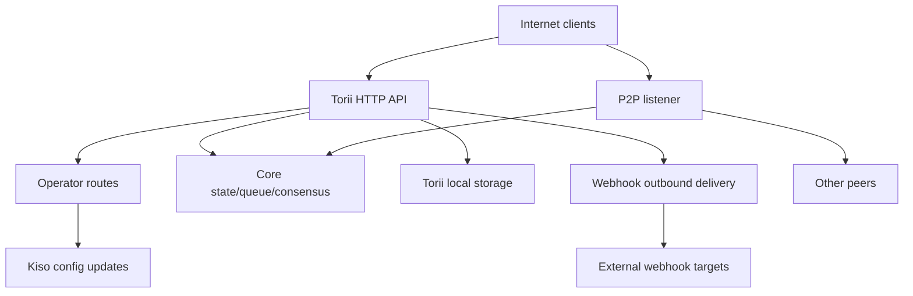

<!-- Auto-generated stub for Kazakh (kk) translation. Replace this content with the full translation. -->

---
lang: kk
direction: ltr
source: iroha-threat-model.md
status: complete
generator: scripts/sync_docs_i18n.py
source_hash: 766928cf0dcbfe3513c728bcf0b9fa697a330e8000bc6944ab61e8fcd59751ad
source_last_modified: "2026-02-07T13:27:25.009145+00:00"
translation_last_reviewed: 2026-04-02
translator: machine-google-reviewed
---

№ Iroha қауіп үлгісі (репо: `iroha`)

## Атқарушы қорытынды
Оператор бағыттарына жалпыға қолжетімді интернеттен әдейі қол жеткізуге болатын, бірақ сұрау қолтаңбалары арқылы аутентификациялануы керек және веб-ілгектер/тіркемелер жалпыға қолжетімді Torii соңғы нүктесінде қосылған интернеттегі жалпыға қолжетімді блокчейнді орналастыруда ең үлкен қауіптер мыналар болып табылады: оператор-ұшағын компромиссі (аутентификацияланбаған қол қою сұрауы) `/v1/configuration` және басқа оператор маршруттары), SSRF және веб-құкты жеткізу арқылы шығыс теріс пайдалану және жылдамдық шектеулері шартты түрде орындалатын транзакция/сұрау + ағындық соңғы нүктелер арқылы жоғары левереджді DoS; қосымша, `x-forwarded-client-cert` болуына негізделген кез келген «mTLS қажет» поза Torii тікелей әсер еткенде жалған болады. Дәлелдер: `crates/iroha_torii/src/lib.rs` (маршрутизатор + аралық бағдарламалық құрал + оператор маршруттары), `crates/iroha_torii/src/operator_auth.rs` (оператордың аутентификациясын қосу/өшіру + `x-forwarded-client-cert` тексеру), `crates/iroha_torii/src/webhook.rs` (шығыс HTTP клиенті), `crates/iroha_torii/src/webhook.rs` (шығыс HTTP клиенті), Sumeragi (шығыс жылдамдығы) Sumeragi.

## Ауқымы мен болжамдарыҚолданыстағы (орындалу уақыты/өндірістік беттер):
- Torii HTTP API сервері және аралық бағдарламалық құрал, соның ішінде «оператор» маршруттары, қолданба API интерфейсі, веб-хуктар, тіркемелер, мазмұн және ағындық соңғы нүктелер: `crates/iroha_torii/`, `crates/iroha_torii_shared/`
- Түйіннің жүктелуі және құрамдас сымдары (Torii + P2P + күй/кезек/конфигурацияны жаңарту актері): `crates/irohad/src/main.rs`
- P2P тасымалдау және қол алысу беттері: `crates/iroha_p2p/`
- Конфигурация пішіндері және әдепкі мәндері (әсіресе Torii аутентификация әдепкілері): `crates/iroha_config/src/parameters/{actual,defaults}.rs`
- Клиентке арналған конфигурация жаңартуы DTO (`/v1/configuration` өзгерте алады): `crates/iroha_config/src/client_api.rs`
- Орналастыру орамасының негіздері: `Dockerfile` және `defaults/` үлгі конфигурациялары (өндірісте ендірілген мысал кілттерін пайдаланбаңыз).

Қолдану аясынан тыс (анық сұралмаған жағдайда):
- CI жұмыс үрдістері және шығарылымды автоматтандыру: `.github/`, `ci/`, `scripts/`
- Мобильді/клиенттік SDK және қолданбалар: `IrohaSwift/`, `java/`, `examples/`
- Тек құжаттамалық материал: `docs/`Ашық болжамдар (сіздің түсініктемелеріңізге негізделген):
- Torii интернетке әсер етеді және аутентификацияланбаған клиенттер қол жеткізе алады (кейбір соңғы нүктелер әлі де қолтаңбаларды немесе басқа аутентификацияны қажет етуі мүмкін).
- Оператор бағыттары (`/v1/configuration`, `/v1/nexus/lifecycle` және қосылған кезде оператор қақпасы бар телеметрия/профильдеу) жалпыға қолжетімді болуға арналған және оператор басқаратын жеке кілттен қолтаңба арқылы аутентификациялануы керек. Дәлелдер (ағымдағы күй): `crates/iroha_torii/src/lib.rs` (`add_core_info_routes` қолданылады `operator_layer`), `crates/iroha_torii/src/operator_auth.rs` (`enforce_operator_auth` / `authorize_operator_endpoint`).
- Оператор қолтаңбасын тексеру конфигурациядағы оператордың ашық кілттерінің жергілікті рұқсат етілген тізімін пайдалануы керек (ағымдағы маршрутизаторда енгізілген оператор қақпасы ретінде көрсетілмеген). Ағымдағы оператор қақпасының дәлелі: `crates/iroha_torii/src/operator_auth.rs` (`authorize_operator_endpoint`) және бар канондық сұрауға қол қою көмекшісінің (хабарлама құрылысы): `crates/iroha_torii/src/app_auth.rs` (`canonical_request_message`).
- Torii сенімді кірудің артында міндетті түрде орналастырылмайды; сондықтан `x-forwarded-client-cert` сияқты тақырыптар Torii тікелей әсер еткенде, шабуылдаушы басқаратын ретінде қарастырылуы керек. Дәлелдер: `crates/iroha_torii/src/lib.rs` (`HEADER_MTLS_FORWARD`, `norito_rpc_mtls_present`) және `crates/iroha_torii/src/operator_auth.rs` (`HEADER_MTLS_FORWARD`, `mtls_present`).
- Вебхуктар мен тіркемелер жалпы Torii соңғы нүктесінде қосылған. Дәлелдер: `crates/iroha_torii/src/lib.rs` (`/v1/webhooks` және `/v1/zk/attachments` үшін маршруттар), `crates/iroha_torii/src/webhook.rs`, `crates/iroha_torii/src/zk_attachments.rs`.- Оператор `torii.require_api_token = false` (әдепкі `false`) орнатуы немесе сақтауы мүмкін. Дәлел: `crates/iroha_config/src/parameters/defaults.rs` (`torii::REQUIRE_API_TOKEN`).
- `/transaction` және `/query` қоғамдық тізбек үшін қолжетімді болады деп күтілуде. Ескертпе: олар қосымша «Norito-RPC» шығару кезеңімен және қосымша «mTLS қажет» тақырыптың болуын тексеру арқылы бекітіледі. Дәлелдер: `crates/iroha_torii/src/lib.rs` (`ConnScheme::from_request`, `evaluate_norito_rpc_gate`) және `crates/iroha_config/src/parameters/defaults.rs` (`torii::transport::norito_rpc::STAGE = "disabled"`).

Тәуекел рейтингін айтарлықтай өзгертетін ашық сұрақтар:
- Оператордың ашық кілттері қай жерде конфигурацияланады (қай конфигурациялау кілті/пішімі) және пернелер қалай анықталады/бұрылады (кілт идентификаторы, бірнеше белсенді кілттер, кері қайтарып алу)?
- Хабарлама пішімі мен қайта ойнатуды қорғаудың нақты операторы қандай (уақыт белгісі/бір ретсіз/есептеуіш + серверлік қайта ойнату кэші) және сағаттың қисаюының қандай саясаты қолайлы? Қолданыстағы канондық сұрау көмекшісінің жаңалығы жоқ екендігінің дәлелі: `crates/iroha_torii/src/app_auth.rs` (`canonical_request_message`).
- Анонимді веб-хуктар үшін Torii ерікті тағайындауларға рұқсат береді деп күтілуде ме, әлде ол SSRF тағайындау саясатын қолдануы керек пе (RFC1918/localhost/link-local/metadata блоктау және міндетті түрде HTTPS қажет)?
- Құрылымыңызда қандай Torii мүмкіндіктері қосылған (`telemetry`, `profiling`, `p2p_ws`, `app_api_https`, `app_api_wss`) және I0109 мазмұны пайдаланылады ма? Дәлел: `crates/iroha_torii/Cargo.toml` (`[features]`).

## Жүйе үлгісі### Негізгі компоненттер
- **Интернет клиенттері** (әмияндар, индекстер, зерттеушілер, боттар): HTTP/Norito сұрауларын жіберіңіз және WS/SSE қосылымдарын ашыңыз.
- **Torii (HTTP API)**: алдын ала аутентификацияға арналған аралық бағдарламалық құралы бар axum маршрутизаторы, қосымша API таңбалауышын орындау, API нұсқасын келісу, қашықтағы мекенжайды енгізу және көрсеткіштер. Дәлелдер: `crates/iroha_torii/src/lib.rs` (`create_api_router`, `enforce_preauth`, `enforce_api_token`, `enforce_api_version`, `inject_remote_addr_header`).
- **Операторды/аутентификацияны басқару жазықтығы (ағымдағы) және қалаған қалпы**: оператор бағыттары қазіргі уақытта `operator_auth::enforce_operator_auth` арқылы қорғалған (WebAuthn/токендер; конфигурациялау арқылы тиімді түрде өшірілуі мүмкін), бірақ сіздің орналастыру талабыңыз оператордың ашық кілттерінің рұқсат тізімінде расталған қолтаңба негізіндегі оператордың аутентификациясы болып табылады. Канондық сұрау хабарының көмекшісі бар және оны хабарды құру үшін қайта пайдалануға болады, бірақ тексеру конфигурациялау кілттерін (әлемдік мемлекеттік тіркелгілерді емес) пайдалануға бейімделуі керек. Дәлелдер: `crates/iroha_torii/src/lib.rs` (`add_core_info_routes` `operator_layer` пайдаланады), `crates/iroha_torii/src/operator_auth.rs` (`authorize_operator_endpoint`), `crates/iroha_torii/src/app_auth.rs` (`crates/iroha_torii/src/app_auth.rs` (Sumeragi, Sumeragi, Sumeragi).- **Негізгі түйін құрамдастары (процестегі)**: транзакция кезегі, күй/WSV, консенсус (Sumeragi), блокты сақтау (Kura), конфигурацияны жаңарту актері (Kiso), т.б. Torii ішіне өтті. Дәлел: `crates/irohad/src/main.rs` (`Torii::new_with_handle(...)` `queue`, `state`, `kura`, `kiso`, Norito0 арқылы іске қосылды және `torii.start(...)`).
- **P2P желісі**: шифрланған, жақтауланған тең дәрежелі тасымалдау және қол алысу; қосымша TLS-over-TCP бар, бірақ сертификатты тексеруге әдейі рұқсат береді. Дәлелдер: `crates/iroha_p2p/src/lib.rs` (бүркеншік аты `NetworkHandle<..., X25519Sha256, ChaCha20Poly1305>` түрі), `crates/iroha_p2p/src/transport.rs` (`NoCertificateVerification` бар `p2p_tls` модулі).
- **Torii жергілікті тұрақтылық**: тіркемелер/веблоктар/кезектер үшін `./storage/torii` әдепкі негізгі каталог. Дәлелдер: `crates/iroha_config/src/parameters/defaults.rs` (`torii::data_dir()`), `crates/iroha_torii/src/webhook.rs` (тұрақты `webhooks.json`), `crates/iroha_torii/src/zk_attachments.rs` (`./storage/torii/zk_attachments/` астында сақталады).
- **Шығыс веб-хук мақсаттары**: Torii оқиғаларды ерікті `http://` URL мекенжайларына (және `https://`/`ws(s)://` мүмкіндіктерімен ғана) жеткізе алады. Дәлел: `crates/iroha_torii/src/webhook.rs` (`http_post_plain`, `http_post_https`, `ws_send`).### Деректер ағындары және сенім шекаралары
- Интернет-клиент → Torii HTTP API
  - Деректер: Norito екілік (`SignedTransaction`, `SignedQuery`), JSON DTOs (app API), WS/SSE жазылымдары, тақырыптар (соның ішінде `x-api-token`).
  - Арна: HTTP/1.1 + WebSocket + SSE (axum).
  - Кепілдіктер: қосымша API таңбалауышы (`torii.require_api_token`), алдын ала аутентификациялық қосылым/бағдарламалық шлюз, API нұсқасын келісу; көптеген өңдеушілер әр соңғы нүкте жылдамдығын шектеуді шартты түрде қолданады (`enforce=false` кезінде айналып өтуге болады). Дәлелдер: `crates/iroha_torii/src/lib.rs` (`enforce_preauth`, `validate_api_token`, `handler_post_transaction`, `handler_signed_query`), `crates/iroha_torii/src/limits.rs` (Sumeragi).
  - Тексеру: кейбір соңғы нүктелердегі негізгі шектеулер (мысалы, транзакциялар), Norito декодтау, кейбір қолданбаның соңғы нүктелері үшін сұрауға қол қою (канондық сұрау тақырыптары). Дәлелдер: `crates/iroha_torii/src/lib.rs` (`add_transaction_routes` `DefaultBodyLimit::max(...)` пайдаланады), `crates/iroha_torii/src/app_auth.rs` (`verify_canonical_request`).- Интернет-клиент → «Оператор» маршруттары (Torii)
  - Деректер: конфигурация жаңартулары (`ConfigUpdateDTO`), жолақты өмірлік цикл жоспарлары, телеметрия/отлад/күй/метрикалар (қосылған кезде).
  - Арна: HTTP.
  - Кепілдіктер: ағымдағы репо осы маршруттарды `operator_auth::enforce_operator_auth` аралық бағдарламалық құралымен қамтамасыз етеді, бұл `torii.operator_auth.enabled=false` кезінде тиімді жұмыс істемейді; қалаған қалпыңыз конфигурациядан оператордың ашық кілттері арқылы қолтаңбаға негізделген аутентификация болып табылады, ол осы шекарада жүзеге асырылуы және орындалуы керек (және Torii тікелей әсер етсе, `x-forwarded-client-cert`-ке сенбеуі керек). Дәлелдер: `crates/iroha_torii/src/lib.rs` (`add_core_info_routes` қолданылады `operator_layer`), `crates/iroha_torii/src/operator_auth.rs` (`authorize_operator_endpoint`, `mtls_present`).
  - Валидация: негізінен DTO талдауы; `handle_post_configuration` өзінде криптографиялық авторизация жоқ (ол `kiso.update_with_dto`-ке өкілдік береді). Дәлел: `crates/iroha_torii/src/routing.rs` (`handle_post_configuration`).

- Torii → Негізгі кезек/күй/консенсус (процессте)
  - Деректер: транзакцияны жіберу, сұрауды орындау, күйді оқу/жазу, консенсус телеметрия сұраулары.
  - Арна: процесстегі Rust қоңыраулары (ортақ `Arc` тұтқалары).
  - Кепілдіктер: болжамды сенімді шекара; қауіпсіздік Torii артықшылықты әрекеттерді шақырмас бұрын сұрауларды дұрыс аутентификациялауға/авторизациялауға байланысты. Дәлелдер: `crates/irohad/src/main.rs` (`Torii::new_with_handle(...)` сымы) және `routing::handle_*` шақыратын Torii өңдеушілері.- Torii → Kiso (конфигурацияны жаңарту актері)
  - Деректер: `ConfigUpdateDTO` журнал жүргізуді, P2P ACL, желі/тасымалдау параметрлерін, SoraNet қол алысуын және т.б. өзгерте алады.
  - Арна: процесстегі хабар/тұтқа.
  - Кепілдіктер: авторизация Torii шекарасында күтіледі; DTO жаңартуының өзі мүмкіндік береді. Дәлел: `crates/iroha_config/src/client_api.rs` (`ConfigUpdateDTO` өрістеріне `network_acl`, `transport.norito_rpc`, `soranet_handshake`, т.б. кіреді).

- Torii → Жергілікті диск (`./storage/torii`)
  - Деректер: webhook тізілімі және кезектегі жеткізілімдер; тіркемелер мен дезинфекциялау құралының метадеректері; GC/TTL әрекеті.
  - Арна: файлдық жүйе.
  - Кепілдіктер: жергілікті ОЖ рұқсаттары (контейнер Dockerfile жүйесінде түбірлік емес ретінде жұмыс істейді); «жалға алушы» арқылы логикалық оқшаулау API таңбалауышы немесе аралық бағдарлама арқылы енгізілген қашықтағы IP тақырыбына негізделген. Дәлелдер: `Dockerfile` (`USER iroha`), `crates/iroha_torii/src/lib.rs` (`inject_remote_addr_header`, `zk_attachments_tenant`).

- Torii → Webhook мақсаттары (шығыс)
  - Деректер: оқиғаның пайдалы жүктемелері + қолтаңба тақырыбы.
  - Арна: `http://` үшін өңделмеген TCP HTTP клиенті; қосылған кезде `https://` үшін қосымша `hyper+rustls`; қосылған кезде қосымша WS/WSS.
  - Кепілдіктер: күту уақыты/қайталануы; кодта көрінетін мақсатты рұқсат тізімі жоқ; Webhook CRUD ашық болса, URL шабуылдаушы әсер етеді. Дәлел: `crates/iroha_torii/src/webhook.rs` (`handle_create_webhook`, `http_post_plain/http_post`).- P2P әріптестері (сенімсіз желі) → P2P тасымалдау/қол алысу
  - Деректер: қол алысу кіріспе сөзі/метадеректер, жақтаулы шифрланған хабарламалар, консенсус хабарламалары.
  - Арна: P2P тасымалдау (TCP/QUIC/т.б. мүмкіндіктерге байланысты), шифрланған пайдалы жүктемелер; қосымша TLS-over-TCP сертификатты тексеруге нақты рұқсат береді.
  - Кепілдіктер: қолданба деңгейінде шифрлау және қол қойылған қол алысу; транспорттық деңгей TLS сертификат бойынша аутентификацияланбайды. Дәлелдер: `crates/iroha_p2p/src/lib.rs` (шифрлау түрлері), `crates/iroha_p2p/src/transport.rs` (`NoCertificateVerification` түсініктеме және енгізу).

#### Диаграмма

## Активтер мен қауіпсіздік мақсаттары| Актив | Неліктен маңызды | Қауіпсіздік мақсаты (C/I/A) |
|---|---|---|
| Тізбек күйі / WSV / блоктар | Тұтастық сәтсіздіктері консенсус сәтсіздіктеріне айналады; қол жетімділік ақаулары тізбекті тоқтатады | I/A |
| Консенсус жандылығы (Sumeragi) | Қоғамдық блокчейннің құны тұрақты блок өндірісіне байланысты | А |
| Түйіннің жеке кілттері (тең идентификатор, қол қою кілттері) | Негізгі компромисс идентификацияны қабылдауға, қол қоюды бұзуға немесе желіні бөлуге | C/I |
| Орындау уақытының конфигурациясы (Kiso-жаңартылған) | Желінің ACL және тасымалдау параметрлерін басқарады; дұрыс пайдаланбау қорғауды өшіруі немесе зиянды құрбыларды қабылдауы мүмкін | I |
| Транзакция кезегі / мемпул | Су тасқыны консенсусты аштыққа ұшыратып, процессорды/жадты | А |
| Torii тұрақтылық (`./storage/torii`) | Дискінің таусылуы түйінді бұзуы мүмкін; сақталған деректер төменгі өңдеуге әсер етуі мүмкін | A (және кейде C/I) |
| Шығыс вебхук арнасы | SSRF үшін теріс пайдаланылуы мүмкін, ішкі желілерден деректерді эксфильтрациялау немесе сенімді шығу IP мекенжайынан сканерлеу | C/I/A |
| Телеметрия/метрика/отладтау деректері | Мақсатты шабуылдар үшін пайдалы желі топологиясы мен операциялық күйін ағып кетуі мүмкін | C |

## Шабуылдаушы үлгісі### Мүмкіндіктер
- Қашықтағы, аутентификацияланбаған интернет шабуылшысы еркін HTTP сұрауларын жібере алады, ұзақ өмір сүретін WS/SSE қосылымдарын ұстай алады және пайдалы жүктемелерді (ботнет) ойнатады немесе шашыратады.
- Кез келген тарап кілттерді жасап, қол қойылған транзакцияларды/сұрауларды (қоғамдық блокчейн), соның ішінде үлкен көлемді спамды жібере алады.
- Зиянды/бұзылған құрдас P2P желісіне қосылып, рұқсат етілген шектеулер аясында протоколды теріс пайдалану, су тасу немесе қол алысу әрекеттерін орындауы мүмкін.
- Егер webhook CRUD ашылған болса, шабуылдаушы шабуылдаушы басқаратын webhook URL мекенжайларын тіркей алады және шығыс кері қоңырауларды қабылдай алады (және оларды ішкі тағайындауларға бағыттай алады).

### Мүмкіндіктер емес
- Ашық соңғы нүкте немесе дұрыс конфигурацияланбаған көлем рұқсаттары болмаса, тікелей жергілікті файлдық жүйеге кіру мүмкіндігі жоқ.
- Кілтті ымырасыз қолданыстағы тең/оператор кілттері үшін жалған қолтаңбаларды жасау мүмкіндігі жоқ.
- Қалыпты жағдайда заманауи криптографияны (X25519, ChaCha20-Poly1305, Ed25519) бұзу мүмкіндігі жоқ.

## Кіру нүктелері және шабуыл беттері| Беткі | Қалай жетті | Сенім шекарасы | Ескертпелер | Дәлелдемелер (репо жолы/символы) |
|---|---|---|---|---|
| `POST /transaction` | Интернет HTTP | Интернет → Torii | Norito екілік қол қойылған транзакция; жылдамдықты шектеу шартты (`enforce` жалған болуы мүмкін) | `crates/iroha_torii/src/lib.rs` (`handler_post_transaction`, `ConnScheme::from_request`) |
| `POST /query` | Интернет HTTP | Интернет → Torii | Norito екілік қол қойылған сұрау; жылдамдықты шектеу шартты (`enforce` жалған болуы мүмкін) | `crates/iroha_torii/src/lib.rs` (`handler_signed_query`) |
| Norito-RPC қақпасы | Интернет HTTP тақырыптары | Интернет → Torii | Шығарылым кезеңі + тақырыптың болуы арқылы қосымша "mTLS қажет"; канарей `x-api-token` | пайдаланады `crates/iroha_torii/src/lib.rs` (`evaluate_norito_rpc_gate`, `HEADER_MTLS_FORWARD`) |
| `POST/GET/DELETE /v1/webhooks...` | Internet HTTP (app API) | Интернет → Torii → шығыс | Дизайн бойынша анонимді; webhook CRUD ерікті URL мекенжайларына шығыс жеткізуге мүмкіндік береді; SSRF тәуекелі | `crates/iroha_torii/src/lib.rs` (`handler_webhooks_*`), `crates/iroha_torii/src/webhook.rs` (`http_post`) |
| `POST/GET /v1/zk/attachments...` | Internet HTTP (app API) | Интернет → Torii → диск | Дизайн бойынша анонимді; тіркеме дезинфекциялау + декомпрессия + табандылық; диск/CPU сарқылу беті (қосылған жағдайда жалға алу API-токен болып табылады, әйтпесе енгізілген тақырып арқылы қашықтағы IP) | `crates/iroha_torii/src/lib.rs` (`handler_zk_attachments_*`, `zk_attachments_tenant`), `crates/iroha_torii/src/zk_attachments.rs` || `GET /v1/content/{bundle}/{path...}` | Интернет HTTP | Интернет → Torii → күй/сақтау | Аутентификация режимдерін қолдайды + PoW + Ауқым; шығуды шектегіш | `crates/iroha_torii/src/content.rs` (`handle_get_content`, `enforce_pow`, `enforce_auth`) |
| Ағын: `/v1/events/sse`, `/events` (WS), `/block/stream` (WS) | Интернет | Интернет → Torii | Ұзақ мерзімді байланыстар; DoS беті | `crates/iroha_torii/src/lib.rs` (`add_network_stream_routes`) |
| `GET/POST /v1/configuration` | Интернет HTTP | Интернет → оператор маршруттары → Kiso | Орналастыру мақсаты: конфигурациялау рұқсат етілген тізім кілттерімен тексерілген оператор қолтаңбалары; ағымдағы репо оны тек оператордың аралық бағдарламалық құралы арқылы қорғайды (маршрут тобында қолтаңба қақпасы көрсетілмейді) және өкілдер қолданбаны Kiso | `crates/iroha_torii/src/lib.rs` (`add_core_info_routes`, `handler_post_configuration`), `crates/iroha_torii/src/operator_auth.rs` (`enforce_operator_auth`), `crates/iroha_torii/src/routing.rs` (`handle_post_configuration` (`handle_post_configuration`) канондық сұрауға қол қою көмекшісі) |
| `POST /v1/nexus/lifecycle` | Интернет HTTP | Интернет → оператор маршруттары → негізгі | Қолтаңбаның түпнұсқалығын растауға арналған оператордың соңғы нүктесі; қазіргі уақытта оператордың аралық бағдарламалық құралымен қорғалады және оператор аутентификациясы өшірілген болса, жалпыға қол жетімді болуы мүмкін | `crates/iroha_torii/src/lib.rs` (`add_core_info_routes`, `handler_post_nexus_lane_lifecycle`), `crates/iroha_torii/src/operator_auth.rs` (`authorize_operator_endpoint`) || Телеметрия/профильдеу соңғы нүктелері (мүмкіндіктері бар) | Интернет HTTP | Интернет → оператор маршруттары | Оператор қақпасы бар маршрут топтары; егер оператор аутентификациясы өшірілген болса және қолтаңба қақпасы болмаса, олар жалпыға ортақ болады және операциялық деректердің ағып кетуі немесе DoS векторлары болуы мүмкін | `crates/iroha_torii/src/lib.rs` (`add_telemetry_routes`, `add_profiling_routes`), `crates/iroha_torii/src/operator_auth.rs` (`authorize_operator_endpoint`) |
| P2P TCP/TLS тасымалдаулары | Интернет / тең желі | Интернет/теңдер → P2P | Шифрланған P2P жақтаулары + қол алысу; | қосылған кезде TLS сертификатын тексеру рұқсат етілген `crates/iroha_p2p/src/lib.rs` (`NetworkHandle`), `crates/iroha_p2p/src/transport.rs` (`p2p_tls::NoCertificateVerification`) |

## Ең жақсы теріс пайдалану жолдары

1. **Шабуылшының мақсаты: орындау уақыты конфигурациясының жаңартулары арқылы түйін әрекетін қабылдау**
   1) Оператор бағыттарына қол жеткізуге болатын және оператордың аутентификациясы жоқ/айнап өтуге болатын (мысалы, оператордың аутентификациясы өшірілген және қол қою қақпасы жоқ) Интернетке ашық Torii табыңыз.  
   2) `POST /v1/configuration` `ConfigUpdateDTO` бар, ол желілік ACL-ді босатады немесе тасымалдау параметрлерін өзгертеді.  
   3) тең дәрежеде қосылу немесе бөлімді/қате конфигурацияны тудыру; шабуылдаушы басқаратын инфрақұрылым арқылы консенсусты және/немесе транзакцияларды бағыттау.  
   Әсері: түйіннің (және ықтимал желі) тұтастығы мен қол жетімділігінің бұзылуы.2. **Шабуылшының мақсаты: түсірілген оператор қол қойған сұрауды қайталау**
   1) Бір жарамды қол қойылған оператор сұрауын алыңыз (мысалы, бұзылған оператор құрылғысы, дұрыс конфигурацияланбаған прокси журналдары немесе TLS қауіпсіз түрде тоқтатылатын орта арқылы).  
   2) Қол қою схемасында жаңалық (уақыт белгісі/бір рет емес) және сервер тарапынан қайта ойнатудан бас тарту болмаса, бірдей сұрауды жалпыға ортақ оператор бағыттарына қарсы қайта ойнатыңыз.  
   3) Қол жетімділікті төмендететін немесе қорғанысты әлсірететін конфигурацияның қайталанатын өзгерістерін, кері қайтаруларды немесе мәжбүрлі ауыстырып-қосқыштарды тудырады.  
   Әсері: «қолтаңбаның аутентификациясына» қарамастан тұтастық/қолжетімділік бұзылады.  

3. **Шабуылдаушының мақсаты: Norito-RPC шығарылымын өзгерту арқылы қақпаны қорғауды өшіріңіз**
   1) `POST /v1/configuration` `transport.norito_rpc.stage` немесе `require_mtls` жаңарту үшін.  
   2) `/transaction` және `/query` құрылғыларын күштеп ашу немесе жабу, қолжетімділік пен рұқсатты басқару элементтеріне әсер етеді.  
   Әсері: мақсатты үзіліс немесе қабылдауды бақылауды айналып өту.4. **Шабуылшының мақсаты: SSRF оператордың ішкі желісіне**
   1) `POST /v1/webhooks` арқылы ішкі тағайындауды (мысалы, RFC1918 хосты, IP метадеректері, басқару жазықтығы) көрсететін веб-хук жазбасын жасаңыз.  
   2) Сәйкес оқиғаларды күтіңіз; Torii шығыс HTTP сұрауларын желі позициясынан жеткізеді.  
   3) Ішкі қызметтерді тексеру үшін жауаптарды/күйлерді/уақыттарды және қайталанатын әрекетті пайдаланыңыз (және егер жауап мазмұны басқа жерде пайда болса, ықтимал эксфильтрация).  
   Әсері: ішкі желі экспозициясы, бүйірлік қозғалыс тіректері, беделге нұқсан келтіру, метадеректердің соңғы нүктелері арқылы ықтимал тіркелгі деректеріне әсер ету.  

5. **Шабуылшының мақсаты: транзакция/сұрауды қабылдау қызметінен бас тарту**
   1) Жарамды/жарамсыз Norito денелері бар `POST /transaction` және `POST /query` тасқыны.  
   2) Көптеген WS/SSE жазылымдарын және баяу клиенттерді сақтаңыз.  
   3) Тығыздауды болдырмау үшін қалыпты жұмыс кезінде шартты жылдамдықты шектеуді (`enforce=false`) пайдаланыңыз.  
   Әсері: процессордың/жадтың таусылуы, кезек қанығуы, консенсус кідірістері.  

6. **Шабуылшының мақсаты: қосымшалар арқылы дискіні шығару**
   1) `/v1/zk/attachments` тасқыны, максималды өлшемді пайдалы жүктемелер және/немесе кеңейту шегіне жақын қысылған мұрағаттар.  
   2) Жалға алушының қақпақтарын болдырмау үшін бірнеше бастапқы IP мекенжайларын (немесе кез келген жалға алушы кілтінің әлсіздігін) пайдаланыңыз.  
   3) TTL/GC артта қалғанша сақтау; `./storage/torii` толтырыңыз.  
   Әсері: түйіннің бұзылуы, блоктарды/транзакцияларды өңдеу мүмкін емес.7. **Шабуылшының мақсаты: Torii тікелей әсер еткенде, «mTLS қажет» қақпаларын айналып өтіңіз**
   1) Оператор `require_mtls` параметрін Norito-RPC немесе оператор аутентификациясы үшін қосады.  
   2) Шабуылдаушы сұрауларды `x-forwarded-client-cert: <anything>` арқылы жібереді.  
   3) Тақырыптың болуын тексеру, егер сенімді кіріс тақырыпты ажыратпаса, өтеді.  
   Әсері: басқару элементтері дұрыс қолданбаған; оператор mTLS орындалмаған кезде күшіне енеді деп есептейді.  

8. **Шабуылдаушының мақсаты: әріптестердің байланысын нашарлату / ресурстарды тұтыну**
   1) Зиянды серіктес қайта-қайта қол алысуға әрекеттенеді немесе максималды өлшемдерге жақын жақтауларды тастайды.  
   2) Сертификаттар негізінде ерте бас тартуды болдырмау үшін рұқсат етілген тасымалдау қабаты TLS (қосылған болса) пайдаланыңыз.  
   Әсері: қосылымның үзілуі, процессорды пайдалану, тең дәрежедегі қолжетімділіктің төмендеуі.  

9. **Шабуылшының мақсаты: телеметрия/отладтың соңғы нүктелері арқылы қайталау**
   1) Телеметрия/профильдеу қосулы болса және оператордың аутентификациясы жоқ/айналып өтуге болатын болса, `/status`, `/metrics`, жөндеу маршруттарын сызыңыз.  
   2) Ағып кеткен топологияны/денсаулық деректерін шабуылдарды уақытында қолдану және нақты құрамдастарды нысанаға алу.  
   Әсері: шабуылдаушы табысының жоғарылауы; ықтимал ақпаратты ашу.  

## Қауіп үлгісінің кестесі| Қауіп идентификаторы | Қауіп көзі | Пререквизиттер | Қауіп әрекеті | Әсері | Әсер еткен активтер | Қолданыстағы бақылау құралдары (дәлелдер) | Бос орындар | Ұсынылған әсер ету шаралары | Анықтау идеялары | Ықтималдық | Әсердің ауырлығы | Басымдық |
|---|---|---|---|---|---|---|---|---|---|---|---|---|| TM-001 | Қашықтағы интернет шабуылшысы | Torii интернетке ашық; оператор бағыттары жалпыға ортақ; оператор аутентификациясы жоқ/айнап өту мүмкін немесе қолтаңбаға негізделген оператор аутентификациясы орындалмаған/қате орындалмаған | Орындау уақыты конфигурациясын, желі ACL немесе тасымалдау параметрлерін өзгерту үшін оператор маршруттарын шақырыңыз (мысалы, `/v1/configuration`, `/v1/nexus/lifecycle`) | Түйінді қабылдау/бөлу; зиянды құрбыларды мойындау; қорғауды өшіру | Орындалу уақытының конфигурациясы; консенсус жандылығы; тізбектің тұтастығы; тең кілттер | Оператор маршруттары оператордың аралық бағдарламалық құралының артында, бірақ `authorize_operator_endpoint` өшірілген кезде `Ok(())` қайтарады; Қосымша аутентификациясыз Kiso жаңарту делегаттарын конфигурациялаңыз. Дәлелдер: `crates/iroha_torii/src/lib.rs` (`add_core_info_routes`), `crates/iroha_torii/src/operator_auth.rs` (`authorize_operator_endpoint`), `crates/iroha_torii/src/routing.rs` (`handle_post_configuration`), Sumeragi (Sumeragi) (Sumeragi) | Оператордың маршрут топтарында қолтаңбаға негізделген оператор аутентификациясы көрсетілмейді; тақырыпқа негізделген "mTLS" Torii тікелей әсер еткенде жалған болады; қайта ойнатудан қорғау анықталмаған | Оператордың ашық кілттерінің конфигурация рұқсат тізіміне сәйкес тексерілген оператор маршруттары үшін міндетті қолтаңба негізіндегі оператор аутентификациясын енгізу (бірнеше кілттерді + кілт идентификаторларын қолдау); шектелген қайталау кэші бар балғындықты (уақыт белгісі + емес) қосу; TLS end-to-end қолдану (`x-forwarded-client-cert` сенбеу); қатаң тарифтік шектеулерді қолдану + оператордың барлық әрекеттеріне аудит журналын жүргізу | Кез келген оператордың бағыты туралы ескерту; аудит журналының конфигурациялық айырмашылықтары; қайталанатын қолтаңбаларды/жоқтарды анықтау; әдеттен тыс жаңартуды бақылаңызжиілік және бастапқы IP | Жоғары (қолтаңба аутентификациясы + қайта ойнатуды қорғау жүзеге асырылып, күшіне енгенше) | Жоғары | **сыни** || TM-002 | Қашықтағы интернет шабуылшысы | Webhook CRUD анонимді және интернетке қол жетімді; SSRF тағайындау саясаты жоқ | Ішкі/артықшылықты URL мекенжайларына бағытталған вебхуктарды жасаңыз және жеткізілімдерді іске қосыңыз | SSRF, ішкі сканерлеу, метадеректер тіркелгі деректерінің экспозициясы және шығыс DoS | Webhook арнасы; ішкі желі; қолжетімділігі | Webhooks бар; жеткізілімдер тайм-ауттарды/қайтару/максимум әрекеттерді пайдаланады; `http://` жеткізу өңделмеген TCP пайдаланады. Дәлелдер: `crates/iroha_torii/src/lib.rs` (`handler_webhooks_*`), `crates/iroha_torii/src/webhook.rs` (`handle_create_webhook`, `http_post_plain`, `WebhookPolicy`) | Рұқсат етілген тағайындау тізімі/IP диапазоны блоктары жоқ; `http://` рұқсат етілген; DNS қайта байланыстыру/қайта бағыттау басқару элементтері көрінбейді; webhook CRUD жылдамдығын шектеу шартты (тұрақты күйде тиімді өшірулі болуы мүмкін) | Веб-хуктарды қосулы күйде қалдырыңыз, бірақ SSRF басқару элементтерін қосыңыз: жеке/байланыс/жергілікті/метадеректер IP ауқымдары мен хост атауларын блоктау, + PIN мекенжайларын шешу, қайта бағыттауларды шектеу, шығыс параллельділігін шектеу; жасау анонимді болғандықтан, IP үшін әрқашан қосулы квоталарды + жаһандық шектеулерді қосыңыз және веб-хук жасау/жаңартулар үшін қосымша PoW таңбалауышын қарастырыңыз | Журнал және метрикалық веб-хук мақсатты URL + шешілген IP мекенжайлары; бұғатталған бағыттар туралы ескерту; жеке IP әрекеттері және жоғары сәтсіздік/қайталау жылдамдығы туралы ескерту; webhook CRUD жылдамдығы мен кезек қанықтылығын бақылау | Жоғары | Жоғары | **сыни** || TM-003 | Қашықтағы интернет шабуылдаушы/спаммер | Қоғамдық `/transaction` және `/query`; шартты мөлшерлеме шектеуі жалпы режимдерде қолданылмайды | Flood tx/сұрау жіберу, сонымен қатар WS/SSE ағындары | CPU/жадтың таусылуы; кезек қанықтығы; консенсус дүңгіршектер | Қол жетімділік (Torii + консенсус); кезек/мемпуль | Алдын ала аутентификация қақпасы бір IP үшін қосылымдарды шектейді және тыйым сала алады. Дәлелдер: `crates/iroha_torii/src/lib.rs` (`enforce_preauth`), `crates/iroha_torii/src/limits.rs` (`PreAuthGate`) | Көптеген негізгі жылдамдықты шектегіштер шартты болып табылады (`allow_conditionally` `enforce=false` кезінде шын мәнін қайтарады); таратылған шабуылдаушылар IP шектеулерін айналып өтеді | Интернетте tx/сұрау/ағындар үшін әрқашан қосулы жылдамдық шектеулерін қосыңыз; алым саясатына тәуелсіз конфигурацияланатын мөлшерлеме шектерін қосу; қымбат соңғы нүктелерді PoW көмегімен қорғаңыз немесе қолтаңба/тіркелгі негізіндегі квоталарды талап етеді | Монитор: алдын ала рұқсатты қабылдамау, кезек ұзындығы, tx/сұрау жылдамдығы, WS/SSE белсенді қосылымдары; аномалиялар және тұрақты қуат шектеулері туралы ескерту | Жоғары | Жоғары | **жоғары** || TM-004 | Қашықтағы интернет шабуылшысы | Телеметрия/профильдеу мүмкіндіктері қосылған; оператор аутентификациясы өшірілген немесе қол қою қақпасы жоқ | `/status`, `/metrics`, соңғы нүктелерді жөндеу; қымбат жөндеу күйін сұрау | Ақпаратты ашу; операциялық DoS; мақсатты шабуылды қосу | Телеметрия/отладтау деректері; қолжетімділігі | Телеметрия/профильдеу маршруттары топтары `operator_auth::enforce_operator_auth` қабаттастырылған. Дәлелдер: `crates/iroha_torii/src/lib.rs` (`add_telemetry_routes`, `add_profiling_routes`), `crates/iroha_torii/src/operator_auth.rs` (`authorize_operator_endpoint`) | Оператордың аралық бағдарламалық құралы өшірілген кезде жұмыс істемейді; қолтаңбаға негізделген оператор аутентификациясы осы маршрут топтарында көрсетілмеген | Осы маршрут топтары үшін бірдей міндетті қолтаңбаға негізделген оператор аутентификациясын талап ету; мүмкін болса, қатты жылдамдық шектеулерін және жауап кэштеуін қосыңыз; әдепкі бойынша жалпыға ортақ түйіндердегі профильдеу/отладтау соңғы нүктелерін көрсетуден аулақ болыңыз Қол жеткізу журналдарын қадағалау; сызу үлгілері және тұрақты жоғары баға сұраныстары туралы ескерту | Орташа | Орташа | **орташа** || TM-005 | Қашықтағы интернет шабуылшысы (қате конфигурациялау) | Оператор `require_mtls` мүмкіндігін қосады, бірақ Torii тікелей әсер етеді (немесе прокси/тақырыптың санитаризациясына кепілдік берілмейді) | "mTLS талап етілетін" тексерулерді қанағаттандыру үшін `x-forwarded-client-cert` жалған | Қауіпсіздіктің жалған сезімі; Norito-RPC/оператордың аутентификация саясаттары үшін айналып өту қақпасы | Оператор/автор шекарасы; қабылдау бақылау | `require_mtls` тақырыбының болуы арқылы тексеріледі. Дәлелдер: `crates/iroha_torii/src/lib.rs` (`HEADER_MTLS_FORWARD`, `norito_rpc_mtls_present`), `crates/iroha_torii/src/operator_auth.rs` (`mtls_present`) | Torii бойынша клиент куәлігін криптографиялық тексеру жоқ; сыртқы кіру келісім-шартына сүйенеді | Torii жалпыға қолжетімді болған кезде қауіпсіздік үшін `x-forwarded-client-cert` сенім артпаңыз; mTLS қажет болса, Torii мекенжайында немесе клиент тақырыптарын ажырататын сенімді кіруде клиент куәлігін тексеруді жүзеге асырыңыз; әйтпесе интернетке бағытталған орналастырулар үшін тақырыпқа негізделген қақпаны алып тастаңыз/елемеңіз `x-forwarded-client-cert` бар кез келген сұрау бойынша ескерту Torii тікелей жетеді; Norito-RPC және оператор аутентификациясы үшін журнал қақпасының нәтижелері; рұқсат етілген трафиктің кенет өзгеруін бақылау | Жоғары | Жоғары | **жоғары** || TM-006 | Қашықтағы интернет шабуылшысы | Тіркемелердің соңғы нүктелері анонимді және интернетке қол жетімді; шабуылдаушы максималды өлшемді немесе қысу бомбасының пайдалы жүктемелерін жібере алады | Процессорды/дискіні тұтыну үшін дезинфекциялау құралын/декомпрессияны/тұрақтылықты теріс пайдалану | Түйіндердің тұрақсыздығы; дискінің таусылуы; нашарлаған өткізу қабілеттілігі | Torii сақтау; қолжетімділігі | Тіркеме шектеулері + тазартқыш және максималды кеңейту/мұрағат тереңдігі бар. Дәлелдер: `crates/iroha_config/src/parameters/defaults.rs` (`ATTACHMENTS_MAX_BYTES`, `ATTACHMENTS_MAX_EXPANDED_BYTES`, `ATTACHMENTS_MAX_ARCHIVE_DEPTH`, `ATTACHMENTS_SANITIZER_MODE`), `crates/iroha_torii/src/zk_attachments.rs` (Sumeragi, шектеулер), `crates/iroha_torii/src/lib.rs` (`handler_zk_attachments_*`, `zk_attachments_tenant`) | API таңбалауыштары өшірулі болғанда, жалға алушының идентификациясы негізінен IP-негізделген; таратылған көздерді айналып өту қақпақтары; TTL әлі де көп күндік жинақтауға мүмкіндік береді | Тіркемелер жалпыға қолжетімді және анонимді болуы керек болғандықтан, жаһандық диск квоталарын + кері қысымды күшейтіңіз, әдепкі мәндерді қатайтыңыз (TTL/макс. байт), зарарсыздандырғышты операциялық жүйе деңгейіндегі құмсалғышпен қосалқы процесс режимінде ұстаңыз және жазу үшін қосымша PoW шлюзін қарастырыңыз; әр IP квоталарын жалған тақырыптар арқылы айналып өтуге болмайтындығына көз жеткізіңіз (`inject_remote_addr_header` пайдалануды жалғастырыңыз) | `./storage/torii` дискінің пайдаланылуын бақылау; тіркемені жасау жылдамдығы, дезинфекциялау құралының қабылданбауы және жалға алушының жинақталуы туралы ескерту; трек GC лаг | Орташа | Жоғары | **жоғары** || TM-007 | Зиянды құрдас | Peer P2P тыңдаушысына қол жеткізе алады; қосымша TLS қосылған | Су тасқыны қол алысу/жақтау; ресурстарды сарқуға тырысу; ерте бас тартуды болдырмау үшін рұқсат етілген TLS пайдалану | Байланыстың нашарлауы; ресурстарды жағу; ішінара бөлу | Қол жетімділік; өзара байланыс | Шифрланған кадрлар + үлкен өлшемді хабарламалар үшін қол алысу қателері. Дәлелдер: `crates/iroha_p2p/src/lib.rs` (`Error::FrameTooLarge`, қол алысу қателері), `crates/iroha_p2p/src/transport.rs` (`p2p_tls` рұқсат етілген, бірақ қолданба деңгейінде қол қойылған қол алысу күтіледі) | Тасымалдау қабаты аутентификацияланбайды; DoS жоғары деңгейдегі аутентификациядан бұрын мүмкін; per-peer/IP дроссельдері жеткіліксіз болуы мүмкін | IP/ASN үшін қатаң қосылым шектеулерін қосыңыз; қол алысу әрекеттерін шектеу; жалпы түйіндерде рұқсат етілген тізімдегі тең кілттерді талап етуді қарастырыңыз; жақтаудың максималды өлшемдерінің консервативті болуын қамтамасыз ету; аутентификацияланбаған құрдастар үшін кері қысымды және ерте түсіруді қосыңыз | Кіріс P2P қосылу жылдамдығын бақылау; қайталанатын қол алысу сәтсіздіктері және кадрдың тым үлкен қателері туралы ескерту | Орташа | Орташа | **орташа** || TM-008 | Жеткізу тізбегі / оператор қатесі | Оператор мысал кілттері/конфигурациялары арқылы қолданады; тәуелділіктер бұзылған | Әдепкі/мысал кілттерді немесе қауіпті әдепкі мәндерді пайдаланыңыз; тәуелділікті ұрлау | Негізгі ымыраға келу; тізбекті бөлу; беделін жоғалту | Кілттер; тұтастық; қолжетімділігі | Docker root емес іске қосады және әдепкі мәндерді `/config` ішіне көшіреді. Дәлел: `Dockerfile` (`USER iroha`, `COPY defaults ...`) | Мысал конфигурациялар ендірілген мысал жеке кілттерді қамтуы мүмкін; `require_api_token=false` және `operator_auth.enabled=false` сияқты қауіпті әдепкі мәндер | Белгілі мысал кілттерін анықтау кезінде іске қосу ескертулерін/сәтсіз жабылған тексерулерді қосыңыз; «қоғамдық түйін» шыңдалған конфигурация профилін жіберу; шығару құбырында `cargo deny`/SBOM тексерулерін орындау | `defaults/` ішіндегі құпияларға арналған CI қақпасы; Қауіпсіз конфигурация комбинациялары туралы жұмыс уақыты журналының ескертуі | Орташа | Жоғары | **жоғары** || TM-009 | Қашықтағы интернет шабуылшысы | Қолтаңба негізіндегі оператордың аутентификациясы жаңалықсыз жүзеге асырылады; шабуылдаушы кем дегенде бір жарамды қол қойылған оператор сұрауын | Қоғамдық оператор бағыттарына қарсы бұрын жарамды қол қойылған оператор сұрауын қайталаңыз | Конфигурацияның қайталанатын өзгерістері/қайта оралуы; мақсатты үзілістер; қорғаныс күштерінің әлсіреуі | Орындалу уақытының конфигурациясы; қолжетімділігі; аудиттің тұтастығы | Канондық қол қою көмекшісі хабарды әдіс/жол/сұрау/дене-хэштен құрастырады және уақыт белгісін/бір ретті қамтымайды. Дәлел: `crates/iroha_torii/src/app_auth.rs` (`canonical_request_message`) | Қайта ойнатудан қорғау қолтаңбаларға тән емес; оператор бағыттары қазіргі уақытта қайта ойнату кэшін көрсетпейді/бір рет бақылаусыз | Қол қойылған хабарға `timestamp` + `nonce` (немесе монотонды санауыш) қосыңыз, сағаттың қатаң қисаюын қамтамасыз етіңіз және оператор идентификациясы арқылы кілттелген шектелген қайталау кэшін сақтаңыз; тіркеуге және көшірмелерді қабылдамауға | Қайталанатын бейтараптар/сұраныс хэштері туралы ескерту; оператор әрекеттерін сәйкестендіру және көз бойынша корреляциялау; қайта ойнатудан бас тарту үшін көрсеткіштерді қосу | Орташа | Жоғары | **жоғары** || TM-010 | Қашықтан шабуылдаушы / инсайдер | Оператор қол қоятын жеке кілт оны шығаруға болатын жерде сақталады (диск/конфигурация/CI артефактілері) | Оператордың жеке кілтін ұрлау және жарамды қол қойылған оператор сұрауларын шығару | Төмен анықтау мүмкіндігімен толық оператор-жазықтық компромисс | Оператор кілттері; орындау уақытының конфигурациясы; консенсус өмір сүру | Кейбір Torii құрамдастары конфигурациядан жеке кілттерді жүктеп қойған (мысалы, желіден тыс эмитент операторының кілті). Дәлел: `crates/iroha_torii/src/lib.rs` (`torii.offline_issuer.operator_private_key` `KeyPair` ішіне оқиды), `Dockerfile` (түбір емес ретінде жұмыс істейді) | Кілтті сақтау/айналу/HSM пайдалану кодпен орындалмаған; қолтаңба аутентификациясы бұл тәуекелді мұраға алады | Мүмкіндігінше аппараттық қамтамасыз етілген кілттерді (HSM/қауіпсіз анклав) пайдаланыңыз; оператор кілттерін репоға немесе әлемде оқылатын конфигурацияға енгізуден аулақ болыңыз; қатаң файл рұқсаттары мен айналдыруды қамтамасыз ету; оператор әрекеттері үшін көп белгі/шекті | Жаңа IP/ASN операторларының әрекеттері туралы ескерту; оператор әрекеттерінің өзгермейтін аудит журналын жүргізу; күдік бойынша пернелерді айналдыру | Орташа | Жоғары | **жоғары** |

## Критикалық калибрлеу

Осы репо + нақтыланған орналастыру контексті үшін (интернетке ашық қоғамдық тізбек; оператор бағыттары жалпыға ортақ және қолтаңбаның түпнұсқалығын растауға арналған; кепілдік берілген сенімді кіру жоқ), ауырлық деңгейлері мынаны білдіреді:- **критикалық**: қашықтағы, аутентификацияланбаған шабуылдаушы түйін/желі әрекетін өзгерте алады немесе көптеген түйіндерде блок өндірісін сенімді түрде тоқтата алады.
  - Мысалдар: `/v1/configuration` (TM-001); артықшылықты шығудан метадеректердің соңғы нүктелеріне/кластерді басқару жазықтығына SSRF webhook (TM-002); оператордың қол қою кілтін ұрлау жарамды қол қойылған оператор әрекеттерін қосады (TM-010).

- **жоғары**: қашықтағы шабуылдаушы түйіннің тұрақты DoS-ін тудыруы мүмкін немесе нақты алғышарттармен операторлар сенетін қауіпсіздікті басқаруды айналып өтуі мүмкін.
  - Мысалдар: шартты жылдамдықты шектеу белсенді емес болғанда, жоғары көлемді tx/сұрауды қабылдау DoS (TM-003); тіркемемен басқарылатын диск/CPU таусылуы (TM-006); жаңалық/қайта ойнатудан бас тарту жоқ болса, түсірілген қол қойылған оператор сұрауын қайта ойнату (TM-009).

- **орташа**: анықтауға көмектесетін немесе өнімділікті төмендететін, бірақ мүмкіндігі бар, шабуылдаушының жоғары позициясын қажет ететін немесе әлдеқашан елеулі жұмсартатын шабуылдар.
  - Мысалдар: қосылған кезде телеметрия/профильдеу экспозициясы (TM-004); Жарылыс радиусы шектелген P2P қол алысу (TM-007).- **төмен**: екіталай алғышарттарды, шектеулі жарылыс радиусын немесе ең алдымен жеңіл жеңілдетілген операциялық жаяу мылтықтарды қажет ететін шабуылдар.
  - Мысалдар: блокчейн (мысалы, `/v1/health`, `/v1/peers`) үшін жалпыға қолжетімді болуы күтілетін жалпыға қолжетімді тек оқуға арналған соңғы нүктелерден шағын ақпараттың ағып кетуі және бірінші кезекте тікелей ымыраға келуге емес, барлау үшін пайдалы (мұнда басты қауіптер ретінде аталмаған). Дәлел: `crates/iroha_torii_shared/src/lib.rs` (`uri::HEALTH`, `uri::PEERS`).

## Қауіпсіздікті тексеру үшін жолдарға назар аударыңыз| Жол | Неліктен маңызды | Қатысты қауіп идентификаторлары |
|---|---|---|
| `crates/iroha_torii/src/lib.rs` | Маршрутизатордың құрылысы, аралық бағдарламалық құралға тапсырыс беру, оператордың маршрут топтары, tx/сұрау өңдеушілері, аутентификация/бағдарламалық шектеу шешімдері және қолданба API сымдары (webhooks/тіркемелер) | TM-001, TM-002, TM-003, TM-004, TM-005, TM-006 |
| `crates/iroha_torii/src/operator_auth.rs` | Оператордың аутентификациясы әрекетті қосу/өшіру; тақырыпқа негізделген mTLS тексеру; сеанстар/токендер; Оператор-ұшағын қорғау және айналып өту шарттарын түсіну үшін өте маңызды | ТМ-001, ТМ-004, ТМ-005 |
| `crates/iroha_torii/src/routing.rs` | `/v1/configuration` өңдеушілері Kiso-ға қосымша аутентификациясыз өкілдік береді; өңдеушілердің үлкен бетінің ауданы | TM-001, TM-003 |
| `crates/iroha_config/src/client_api.rs` | `ConfigUpdateDTO` мүмкіндіктерін анықтайды (желі ACL, көлік өзгерістері, қол алысу жаңартулары) | TM-001, TM-009 |
| `crates/iroha_config/src/parameters/defaults.rs` | API токендері/оператор аутентификациясы/Norito-RPC кезеңі үшін әдепкі қалып; тіркеменің әдепкі мәндері | ТМ-003, ТМ-006, ТМ-008 |
| `crates/iroha_torii/src/webhook.rs` | Шығыс HTTP клиенті мен схемасын қолдау; SSRF беті; табандылық пен жеткізуші қызметкер | TM-002 |
| `crates/iroha_torii/src/zk_attachments.rs` | Тіркеме дезинфекциялау құралы, декомпрессия шектері, тұрақтылық, жалға алушы кілті | TM-006 |
| `crates/iroha_torii/src/limits.rs` | Алдын ала авторизация қақпасы мен жылдамдықты шектейтін көмекшілер; шартты орындаушылық мінез-құлық | TM-003 |
| `crates/iroha_torii/src/content.rs` | Мазмұнның соңғы нүктесі аутентификациясы/PoW/Ауқым және шығуды шектеу; деректер exfil және DoS ойлары | TM-003 || `crates/iroha_torii/src/app_auth.rs` | Канондық сұранысқа қол қою (хабарлама құру және қолтаңбаны тексеру); Оператор аутентификациясы үшін қайта пайдаланылса, қайта ойнату қаупі туралы ойлар | ТМ-001, ТМ-003, ТМ-009 |
| `crates/iroha_p2p/src/lib.rs` | Криптографиялық таңдаулар, жақтау шектеулері, қол алысу қателерін өңдеу; P2P тәуекел беті | TM-007 |
| `crates/iroha_p2p/src/transport.rs` | TLS-over-TCP рұқсат етілген; тасымалдау әрекеттері DoS бетіне | TM-007 |
| `crates/irohad/src/main.rs` | Bootstraps Torii + P2P + конфигурацияны жаңарту актері; қай беттердің қосылғанын анықтайды | TM-001, TM-008 |
| `defaults/nexus/config.toml` | Мысал конфигурация ендірілген мысал кілттерін және жалпы байланыстыру мекенжайларын қамтуы мүмкін; жаяу мылтық | TM-008 |
| `Dockerfile` | Контейнердің орындалу уақытының пайдаланушысы/рұқсаттары және әдепкі конфигурацияны қосу (негізгі материал және оператор-жазықтық экспозициясы орналастыруға сезімтал) | ТМ-008, ТМ-010 |### Сапаны тексеру
- Қамтылған кіру нүктелері: tx/сұрау, ағындық, веб-хуктар, тіркемелер, мазмұн, оператор/конфигурация, телеметрия/профильдеу (мүмкіндіктері бар), P2P.
- Қауіптермен қамтылған сенім шекаралары: Internet→Torii, Torii→Kiso/core/disk, Torii→webhook мақсаттары, құрдастары→P2P.
- Орындалу уақыты мен CI/dev бөлінуі: CI/docs/мобильді құрылғының ауқымы анық емес.
- Пайдаланушы түсініктемелері көрсетілді: интернетке ашық, оператор маршруттары жалпыға ортақ, бірақ қолтаңбамен расталған болуы керек, сенімді кіруге кепілдік берілмейді, жалпы Torii соңғы нүктесінде қосылған вебхуктар/тіркемелер.
- «Қолдану аясы мен жорамалдар» бөлімінде нақты көрсетілген жорамалдар/ашық сұрақтар.

## Қолдану туралы ескертпелер
- Бұл құжат әдейі репо-негізделген (дәлелдемелер ағымдағы кодты көрсетеді); бірнеше жоғары басымдылықты азайту шаралары (оператор қолтаңбасы қақпасы, SSRF веб-хук тағайындау саясаты) әлі жоқ жаңа кодты/конфигурацияны қажет етеді.
- Тақырыпқа негізделген кез келген «mTLS» сигналдарын (мысалы, `x-forwarded-client-cert`) сенімді кіру жолақтарын кесіп, енгізбесе, шабуылдаушы басқаратын ретінде қарастырыңыз.