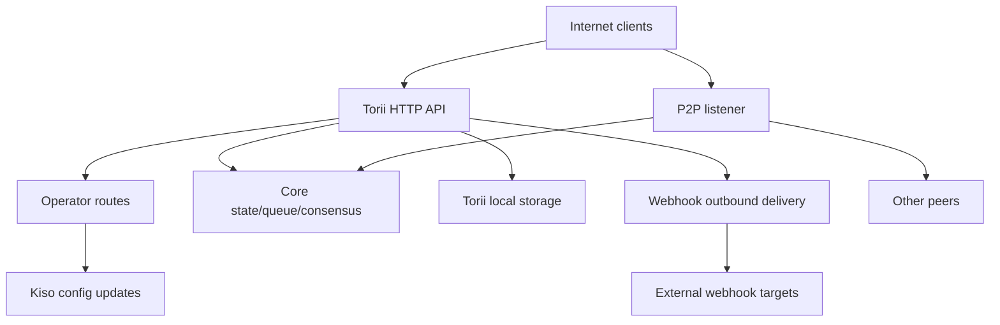

# Iroha Threat Model (repo: `iroha`)

## Executive summary
In an internet-exposed public-blockchain deployment where operator routes are intentionally reachable from the public internet but must be authenticated via request signatures, and where webhooks/attachments are enabled on the public Torii endpoint, the top risks are: operator-plane compromise (unauthenticated or replayable signed requests to `/v1/configuration` and other operator routes), SSRF and outbound abuse via webhook delivery, and high-leverage DoS via transaction/query + streaming endpoints where rate limits are conditionally enforced; additionally, any “mTLS required” posture that relies on the presence of `x-forwarded-client-cert` is spoofable when Torii is directly exposed. Evidence: `crates/iroha_torii/src/lib.rs` (router + middleware + operator routes), `crates/iroha_torii/src/operator_auth.rs` (operator auth enable/disable + `x-forwarded-client-cert` check), `crates/iroha_torii/src/webhook.rs` (outbound HTTP client), `crates/iroha_torii/src/limits.rs` (conditional rate limiting).

## Scope and assumptions

In-scope (runtime / production surfaces):
- Torii HTTP API server and middleware, including “operator” routes, app API, webhooks, attachments, content, and streaming endpoints: `crates/iroha_torii/`, `crates/iroha_torii_shared/`
- Node bootstrap and component wiring (Torii + P2P + state/queue/config update actor): `crates/irohad/src/main.rs`
- P2P transport and handshake surfaces: `crates/iroha_p2p/`
- Configuration shapes and defaults (especially Torii auth defaults): `crates/iroha_config/src/parameters/{actual,defaults}.rs`
- Client-facing config update DTO (what `/v1/configuration` can change): `crates/iroha_config/src/client_api.rs`
- Deployment packaging basics: `Dockerfile`, and example configs in `defaults/` (do not use embedded example keys in production).

Out-of-scope (unless explicitly requested):
- CI workflows and release automation: `.github/`, `ci/`, `scripts/`
- Mobile/client SDKs and apps: `IrohaSwift/`, `java/`, `examples/`
- Documentation-only material: `docs/`

Explicit assumptions (based on your clarifications):
- Torii is internet-exposed and reachable by unauthenticated clients (some endpoints may still require signatures or other auth).
- Operator routes (`/v1/configuration`, `/v1/nexus/lifecycle`, and operator-gated telemetry/profiling when enabled) are intended to be publicly reachable and should authenticate via signature from an operator-controlled private key. Evidence (current state): `crates/iroha_torii/src/lib.rs` (`add_core_info_routes` applies `operator_layer`), `crates/iroha_torii/src/operator_auth.rs` (`enforce_operator_auth` / `authorize_operator_endpoint`).
- Operator signature verification should use a node-local allowlist of operator public keys in configuration (not shown as an implemented operator gate in the current router). Evidence of current operator gate: `crates/iroha_torii/src/operator_auth.rs` (`authorize_operator_endpoint`), and of existing canonical request signing helper (message construction): `crates/iroha_torii/src/app_auth.rs` (`canonical_request_message`).
- Torii is not necessarily deployed behind a trusted ingress; therefore, headers like `x-forwarded-client-cert` must be treated as attacker-controlled when Torii is directly exposed. Evidence: `crates/iroha_torii/src/lib.rs` (`HEADER_MTLS_FORWARD`, `norito_rpc_mtls_present`) and `crates/iroha_torii/src/operator_auth.rs` (`HEADER_MTLS_FORWARD`, `mtls_present`).
- Webhooks and attachments are enabled on the public Torii endpoint. Evidence: `crates/iroha_torii/src/lib.rs` (routes for `/v1/webhooks` and `/v1/zk/attachments`), `crates/iroha_torii/src/webhook.rs`, `crates/iroha_torii/src/zk_attachments.rs`.
- Operator may set or keep `torii.require_api_token = false` (default is `false`). Evidence: `crates/iroha_config/src/parameters/defaults.rs` (`torii::REQUIRE_API_TOKEN`).
- `/transaction` and `/query` are expected to be reachable for a public chain. Note: they are additionally gated by the “Norito-RPC” rollout stage and optional “mTLS required” header presence check. Evidence: `crates/iroha_torii/src/lib.rs` (`ConnScheme::from_request`, `evaluate_norito_rpc_gate`) and `crates/iroha_config/src/parameters/defaults.rs` (`torii::transport::norito_rpc::STAGE = "disabled"`).

Open questions that would materially change risk ranking:
- Where are operator public keys configured (which config key/format), and how are keys identified/rotated (key id, multiple active keys, revocation)?
- What is the exact operator signing message format and replay protection (timestamp/nonce/counter + server-side replay cache), and what clock-skew policy is acceptable? Evidence that the existing canonical request helper has no freshness: `crates/iroha_torii/src/app_auth.rs` (`canonical_request_message`).
- For anonymous webhooks, is Torii expected to allow arbitrary destinations, or should it enforce an SSRF destination policy (block RFC1918/localhost/link-local/metadata and optionally require HTTPS)?
- Which Torii features are enabled in your build (`telemetry`, `profiling`, `p2p_ws`, `app_api_https`, `app_api_wss`), and is `app_api` content used? Evidence: `crates/iroha_torii/Cargo.toml` (`[features]`).

## System model

### Primary components
- **Internet clients** (wallets, indexers, explorers, bots): send HTTP/Norito requests and open WS/SSE connections.
- **Torii (HTTP API)**: axum router with middleware for pre-auth gating, optional API token enforcement, API version negotiation, remote address injection, and metrics. Evidence: `crates/iroha_torii/src/lib.rs` (`create_api_router`, `enforce_preauth`, `enforce_api_token`, `enforce_api_version`, `inject_remote_addr_header`).
- **Operator/auth control plane (current) and desired posture**: operator routes are currently protected by `operator_auth::enforce_operator_auth` (WebAuthn/tokens; can be effectively disabled by config), but your deployment requirement is signature-based operator authentication verified against an allowlist of operator public keys in config. A canonical request message helper exists and could be reused for message construction, but verification would need to be adapted to use config keys (not world-state accounts). Evidence: `crates/iroha_torii/src/lib.rs` (`add_core_info_routes` uses `operator_layer`), `crates/iroha_torii/src/operator_auth.rs` (`authorize_operator_endpoint`), `crates/iroha_torii/src/app_auth.rs` (`canonical_request_message`, `verify_canonical_request`).
- **Core node components (in-process)**: transaction queue, state/WSV, consensus (Sumeragi), block storage (Kura), config update actor (Kiso), etc, passed into Torii. Evidence: `crates/irohad/src/main.rs` (`Torii::new_with_handle(...)` receives `queue`, `state`, `kura`, `kiso`, `sumeragi`, and is started via `torii.start(...)`).
- **P2P networking**: encrypted, framed peer-to-peer transport and handshake; optional TLS-over-TCP exists but is intentionally permissive on certificate verification. Evidence: `crates/iroha_p2p/src/lib.rs` (type alias `NetworkHandle<..., X25519Sha256, ChaCha20Poly1305>`), `crates/iroha_p2p/src/transport.rs` (`p2p_tls` module with `NoCertificateVerification`).
- **Torii local persistence**: `./storage/torii` default base dir for attachments/webhooks/queues. Evidence: `crates/iroha_config/src/parameters/defaults.rs` (`torii::data_dir()`), `crates/iroha_torii/src/webhook.rs` (persisted `webhooks.json`), `crates/iroha_torii/src/zk_attachments.rs` (stored under `./storage/torii/zk_attachments/`).
- **Outbound webhook targets**: Torii can deliver events to arbitrary `http://` URLs (and `https://`/`ws(s)://` only with features). Evidence: `crates/iroha_torii/src/webhook.rs` (`http_post_plain`, `http_post_https`, `ws_send`).

### Data flows and trust boundaries
- Internet client → Torii HTTP API
  - Data: Norito binary (`SignedTransaction`, `SignedQuery`), JSON DTOs (app API), WS/SSE subscriptions, headers (including `x-api-token`).
  - Channel: HTTP/1.1 + WebSocket + SSE (axum).
  - Guarantees: optional API token (`torii.require_api_token`), pre-auth connection/rate gating, API version negotiation; many handlers apply per-endpoint rate limiting conditionally (can be bypassed when `enforce=false`). Evidence: `crates/iroha_torii/src/lib.rs` (`enforce_preauth`, `validate_api_token`, `handler_post_transaction`, `handler_signed_query`), `crates/iroha_torii/src/limits.rs` (`allow_conditionally`).
  - Validation: body limits on some endpoints (e.g., transactions), Norito decoding, request signing for some app endpoints (canonical request headers). Evidence: `crates/iroha_torii/src/lib.rs` (`add_transaction_routes` uses `DefaultBodyLimit::max(...)`), `crates/iroha_torii/src/app_auth.rs` (`verify_canonical_request`).

- Internet client → “Operator” routes (Torii)
  - Data: config updates (`ConfigUpdateDTO`), lane lifecycle plans, telemetry/debug/status/metrics (when enabled).
  - Channel: HTTP.
  - Guarantees: current repo gates these routes with `operator_auth::enforce_operator_auth` middleware, which is effectively a no-op when `torii.operator_auth.enabled=false`; your desired posture is signature-based authentication using operator public keys from config, which must be implemented and enforced at this boundary (and must not rely on `x-forwarded-client-cert` if Torii is directly exposed). Evidence: `crates/iroha_torii/src/lib.rs` (`add_core_info_routes` applies `operator_layer`), `crates/iroha_torii/src/operator_auth.rs` (`authorize_operator_endpoint`, `mtls_present`).
  - Validation: mostly DTO parsing; no cryptographic authorization in `handle_post_configuration` itself (it delegates to `kiso.update_with_dto`). Evidence: `crates/iroha_torii/src/routing.rs` (`handle_post_configuration`).

- Torii → Core queue/state/consensus (in-process)
  - Data: transaction submissions, query execution, state reads/writes, consensus telemetry queries.
  - Channel: in-process Rust calls (shared `Arc` handles).
  - Guarantees: assumed trusted boundary; security depends on Torii correctly authenticating/authorizing requests before invoking privileged operations. Evidence: `crates/irohad/src/main.rs` (`Torii::new_with_handle(...)` wiring) and Torii handlers calling `routing::handle_*`.

- Torii → Kiso (config update actor)
  - Data: `ConfigUpdateDTO` can modify logging, P2P ACL, network/transport settings, SoraNet handshake, etc.
  - Channel: in-process message/handle.
  - Guarantees: authorization is expected at Torii boundary; update DTO itself is capability-bearing. Evidence: `crates/iroha_config/src/client_api.rs` (`ConfigUpdateDTO` fields include `network_acl`, `transport.norito_rpc`, `soranet_handshake`, etc).

- Torii → Local disk (`./storage/torii`)
  - Data: webhook registry and queued deliveries; attachments and sanitizer metadata; GC/TTL behavior.
  - Channel: filesystem.
  - Guarantees: local OS permissions (container runs as non-root in Dockerfile); logical isolation by “tenant” is based on API token or remote IP header injected by middleware. Evidence: `Dockerfile` (`USER iroha`), `crates/iroha_torii/src/lib.rs` (`inject_remote_addr_header`, `zk_attachments_tenant`).

- Torii → Webhook targets (outbound)
  - Data: event payloads + signature header.
  - Channel: raw TCP HTTP client for `http://`; optional `hyper+rustls` for `https://` when enabled; optional WS/WSS when enabled.
  - Guarantees: timeouts/retries; no destination allowlist visible in code; URL is attacker-influenced if webhook CRUD is open. Evidence: `crates/iroha_torii/src/webhook.rs` (`handle_create_webhook`, `http_post_plain/http_post`).

- P2P peers (untrusted network) → P2P transport/handshake
  - Data: handshake preface/metadata, framed encrypted messages, consensus messages.
  - Channel: P2P transport (TCP/QUIC/etc, feature-dependent), encrypted payloads; optional TLS-over-TCP is explicitly permissive on cert verification.
  - Guarantees: encryption and signed handshake at application layer; transport-layer TLS does not authenticate by cert. Evidence: `crates/iroha_p2p/src/lib.rs` (encryption types), `crates/iroha_p2p/src/transport.rs` (`NoCertificateVerification` comment and implementation).

#### Diagram

## Assets and security objectives

| Asset | Why it matters | Security objective (C/I/A) |
|---|---|---|
| Chain state / WSV / blocks | Integrity failures become consensus failures; availability failures stall the chain | I/A |
| Consensus liveness (Sumeragi) | Public blockchain value depends on sustained block production | A |
| Node private keys (peer identity, signing keys) | Key compromise enables identity takeover, signing abuse, or network partitioning | C/I |
| Runtime configuration (Kiso-updated) | Controls network ACLs and transport settings; misuse can disable protections or admit malicious peers | I |
| Transaction queue / mempool | Flooding can starve consensus and exhaust CPU/memory | A |
| Torii persistence (`./storage/torii`) | Disk exhaustion can crash the node; stored data may influence downstream processing | A (and sometimes C/I) |
| Outbound webhook channel | Can be abused for SSRF, data exfiltration from internal networks, or scanning from a trusted egress IP | C/I/A |
| Telemetry/metrics/debug data | Can leak network topology and operational state useful for targeted attacks | C |

## Attacker model

### Capabilities
- Remote, unauthenticated internet attacker can send arbitrary HTTP requests, hold long-lived WS/SSE connections, and replay or spray payloads (botnet).
- Any party can generate keys and submit signed transactions/queries (public blockchain), including high-volume spam.
- Malicious/compromised peer can connect to P2P and attempt protocol abuse, flooding, or handshake manipulation within allowed constraints.
- If webhook CRUD is exposed, attacker can register attacker-controlled webhook URLs and receive outbound callbacks (and potentially steer them to internal destinations).

### Non-capabilities
- No direct local filesystem access absent an exposed endpoint or misconfigured volume permissions.
- No ability to forge signatures for existing peer/operator keys without key compromise.
- No assumed ability to break modern cryptography (X25519, ChaCha20-Poly1305, Ed25519) under normal conditions.

## Entry points and attack surfaces

| Surface | How reached | Trust boundary | Notes | Evidence (repo path / symbol) |
|---|---|---|---|---|
| `POST /transaction` | Internet HTTP | Internet → Torii | Norito binary signed transaction; rate limiting is conditional (`enforce` can be false) | `crates/iroha_torii/src/lib.rs` (`handler_post_transaction`, `ConnScheme::from_request`) |
| `POST /query` | Internet HTTP | Internet → Torii | Norito binary signed query; rate limiting is conditional (`enforce` can be false) | `crates/iroha_torii/src/lib.rs` (`handler_signed_query`) |
| Norito-RPC gate | Internet HTTP headers | Internet → Torii | Rollout stage + optional “mTLS required” via header presence; canary uses `x-api-token` | `crates/iroha_torii/src/lib.rs` (`evaluate_norito_rpc_gate`, `HEADER_MTLS_FORWARD`) |
| `POST/GET/DELETE /v1/webhooks...` | Internet HTTP (app API) | Internet → Torii → outbound | Anonymous by design; webhook CRUD enables outbound delivery to arbitrary URLs; SSRF risk | `crates/iroha_torii/src/lib.rs` (`handler_webhooks_*`), `crates/iroha_torii/src/webhook.rs` (`http_post`) |
| `POST/GET /v1/zk/attachments...` | Internet HTTP (app API) | Internet → Torii → disk | Anonymous by design; attachment sanitizer + decompression + persistence; disk/CPU exhaustion surface (tenanting is API-token if enabled, else remote IP via injected header) | `crates/iroha_torii/src/lib.rs` (`handler_zk_attachments_*`, `zk_attachments_tenant`), `crates/iroha_torii/src/zk_attachments.rs` |
| `GET /v1/content/{bundle}/{path...}` | Internet HTTP | Internet → Torii → state/storage | Supports auth modes + PoW + Range; egress limiter | `crates/iroha_torii/src/content.rs` (`handle_get_content`, `enforce_pow`, `enforce_auth`) |
| Streaming: `/v1/events/sse`, `/events` (WS), `/block/stream` (WS) | Internet | Internet → Torii | Long-lived connections; DoS surface | `crates/iroha_torii/src/lib.rs` (`add_network_stream_routes`) |
| `GET/POST /v1/configuration` | Internet HTTP | Internet → operator routes → Kiso | Deployment intent: operator signatures verified against config allowlist keys; current repo protects it only via operator middleware (no signature gate shown on the route group) and delegates update application to Kiso | `crates/iroha_torii/src/lib.rs` (`add_core_info_routes`, `handler_post_configuration`), `crates/iroha_torii/src/operator_auth.rs` (`enforce_operator_auth`), `crates/iroha_torii/src/routing.rs` (`handle_post_configuration`), `crates/iroha_torii/src/app_auth.rs` (existing canonical request signing helper) |
| `POST /v1/nexus/lifecycle` | Internet HTTP | Internet → operator routes → core | Operator endpoint intended to be signature-authenticated; currently guarded by operator middleware and can become public if operator auth is disabled | `crates/iroha_torii/src/lib.rs` (`add_core_info_routes`, `handler_post_nexus_lane_lifecycle`), `crates/iroha_torii/src/operator_auth.rs` (`authorize_operator_endpoint`) |
| Telemetry/profiling endpoints (feature-gated) | Internet HTTP | Internet → operator routes | Operator-gated route groups; if operator auth is disabled and no signature gate is present, these become public and may leak operational data or be DoS vectors | `crates/iroha_torii/src/lib.rs` (`add_telemetry_routes`, `add_profiling_routes`), `crates/iroha_torii/src/operator_auth.rs` (`authorize_operator_endpoint`) |
| P2P TCP/TLS transports | Internet / peer network | Internet/peers → P2P | Encrypted P2P frames + handshake; TLS cert verification is permissive when enabled | `crates/iroha_p2p/src/lib.rs` (`NetworkHandle`), `crates/iroha_p2p/src/transport.rs` (`p2p_tls::NoCertificateVerification`) |

## Top abuse paths

1. **Attacker goal: Take over node behavior via runtime config updates**
   1) Find internet-exposed Torii where operator routes are reachable and operator authentication is absent/bypassable (e.g., operator auth disabled and no signature gate).  
   2) `POST /v1/configuration` with a `ConfigUpdateDTO` that loosens network ACLs or changes transport settings.  
   3) Join as a peer or induce partition/misconfiguration; degrade consensus and/or route transactions through attacker-controlled infrastructure.  
   Impact: integrity and availability compromise of the node (and potentially the network).  

2. **Attacker goal: Replay a captured operator-signed request**
   1) Obtain one valid signed operator request (e.g., via compromised operator machine, misconfigured proxy logs, or an environment where TLS is terminated unsafely).  
   2) Replay the same request against public operator routes if the signature scheme lacks freshness (timestamp/nonce) and server-side replay rejection.  
   3) Cause repeated configuration changes, rollbacks, or forced toggles that degrade availability or weaken defenses.  
   Impact: integrity/availability compromise despite “signature auth”.  

3. **Attacker goal: Disable/gate protections by changing Norito-RPC rollout**
   1) `POST /v1/configuration` to update `transport.norito_rpc.stage` or `require_mtls`.  
   2) Force-open or force-close `/transaction` and `/query`, impacting availability and admission controls.  
   Impact: targeted outage or admission-control bypass.  

4. **Attacker goal: SSRF into operator’s internal network**
   1) Create a webhook entry pointing at an internal destination (e.g., RFC1918 host, metadata IP, control plane) via `POST /v1/webhooks`.  
   2) Wait for matching events; Torii delivers outbound HTTP requests from its network position.  
   3) Use responses/statuses/timing and repeated retries to probe internal services (and potentially exfiltrate if response content is ever surfaced elsewhere).  
   Impact: internal network exposure, lateral movement scaffolding, reputational harm, potential credential exposure via metadata endpoints.  

5. **Attacker goal: Deny service of transaction/query admission**
   1) Flood `POST /transaction` and `POST /query` with valid/invalid Norito bodies.  
   2) Maintain many WS/SSE subscriptions and slow clients.  
   3) Exploit conditional rate limiting (`enforce=false`) in normal operation to avoid throttling.  
   Impact: CPU/memory exhaustion, queue saturation, consensus stalls.  

6. **Attacker goal: Exhaust disk via attachments**
   1) Flood `/v1/zk/attachments` with max-sized payloads and/or compressed archives near expansion limits.  
   2) Use multiple source IPs (or any tenant keying weakness) to avoid per-tenant caps.  
   3) Persist until TTL/GC lags; fill `./storage/torii`.  
   Impact: node crash, inability to process blocks/transactions.  

7. **Attacker goal: Bypass “mTLS required” gates when Torii is directly exposed**
   1) Operator enables `require_mtls` for Norito-RPC or operator auth.  
   2) Attacker sends requests with `x-forwarded-client-cert: <anything>`.  
   3) Header-presence check passes if no trusted ingress strips the header.  
   Impact: controls misapplied; operator believes mTLS is enforced when it isn’t.  

8. **Attacker goal: Degrade peer connectivity / consume resources**
   1) Malicious peer repeatedly attempts handshakes or floods frames near max sizes.  
   2) Exploit permissive transport-layer TLS (if enabled) to avoid early rejection based on certificates.  
   Impact: connection churn, CPU usage, reduced peer availability.  

9. **Attacker goal: Recon via telemetry/debug endpoints**
   1) If telemetry/profiling is enabled and operator authentication is missing/bypassable, scrape `/status`, `/metrics`, debug routes.  
   2) Use leaked topology/health data to time attacks and target specific components.  
   Impact: increased attacker success rate; possible information disclosure.  

## Threat model table

| Threat ID | Threat source | Prerequisites | Threat action | Impact | Impacted assets | Existing controls (evidence) | Gaps | Recommended mitigations | Detection ideas | Likelihood | Impact severity | Priority |
|---|---|---|---|---|---|---|---|---|---|---|---|---|
| TM-001 | Remote internet attacker | Torii internet-exposed; operator routes are public; operator auth is absent/bypassable or signature-based operator auth is not implemented/mis-implemented | Invoke operator routes (e.g., `/v1/configuration`, `/v1/nexus/lifecycle`) to change runtime config, network ACLs, or transport settings | Node takeover/partition; admit malicious peers; disable protections | Runtime config; consensus liveness; chain integrity; peer keys | Operator routes are behind operator middleware, but `authorize_operator_endpoint` returns `Ok(())` when disabled; config update delegates to Kiso without extra auth. Evidence: `crates/iroha_torii/src/lib.rs` (`add_core_info_routes`), `crates/iroha_torii/src/operator_auth.rs` (`authorize_operator_endpoint`), `crates/iroha_torii/src/routing.rs` (`handle_post_configuration`), `crates/iroha_config/src/client_api.rs` (`ConfigUpdateDTO`) | No signature-based operator auth shown on operator route groups; header-based “mTLS” is spoofable when Torii is direct-exposed; replay protection undefined | Implement mandatory signature-based operator auth for operator routes verified against a config allowlist of operator public keys (support multiple keys + key ids); include freshness (timestamp + nonce) with a bounded replay cache; enforce TLS end-to-end (do not trust `x-forwarded-client-cert`); apply strict rate limits + audit logging on all operator actions | Alert on any operator route hit; audit-log config diffs; detect repeated signatures/nonces; monitor unusual update frequency and source IPs | High (until signature auth + replay protection are implemented and enforced) | High | **critical** |
| TM-002 | Remote internet attacker | Webhook CRUD is anonymous and internet-reachable; no SSRF destination policy | Create webhooks targeting internal/privileged URLs and trigger deliveries | SSRF, internal scanning, metadata credential exposure, and outbound DoS | Webhook channel; internal network; availability | Webhooks exist; deliveries use timeouts/backoff/max attempts; `http://` delivery uses raw TCP. Evidence: `crates/iroha_torii/src/lib.rs` (`handler_webhooks_*`), `crates/iroha_torii/src/webhook.rs` (`handle_create_webhook`, `http_post_plain`, `WebhookPolicy`) | No destination allowlist / IP-range blocks; `http://` allowed; DNS rebinding/redirect controls not visible; webhook CRUD rate limiting is conditional (may be effectively off in steady state) | Keep webhooks enabled but add SSRF controls: block private/loopback/link-local/metadata IP ranges and hostnames, resolve + pin addresses, limit redirects, cap outbound concurrency; because creation is anonymous, add always-on per-IP quotas + global caps and consider an optional PoW token for webhook creation/updates | Log and metric webhook target URL + resolved IPs; alert on blocked destinations; alert on private-IP attempts and high failure/retry rates; monitor webhook CRUD rate and queue saturation | High | High | **critical** |
| TM-003 | Remote internet attacker / spammer | Public `/transaction` and `/query`; conditional rate limiting not enforced in common modes | Flood tx/query submission, plus WS/SSE streams | CPU/memory exhaustion; queue saturation; consensus stalls | Availability (Torii + consensus); queue/mempool | Pre-auth gate limits connections per IP and can ban. Evidence: `crates/iroha_torii/src/lib.rs` (`enforce_preauth`), `crates/iroha_torii/src/limits.rs` (`PreAuthGate`) | Many key rate limiters are conditional (`allow_conditionally` returns true when `enforce=false`); distributed attackers bypass per-IP limits | Add always-on rate limits for tx/query/streams when internet-exposed; add per-endpoint configurable rate limits independent of fee policy; protect expensive endpoints with PoW or require signature/account-based quotas | Monitor: preauth rejects, queue length, tx/query rates, WS/SSE active connections; alert on anomalies and sustained capacity limits | High | High | **high** |
| TM-004 | Remote internet attacker | Telemetry/profiling features enabled; operator auth disabled or signature gate missing | Scrape `/status`, `/metrics`, debug endpoints; request expensive debug status | Info disclosure; operational DoS; targeted attack enablement | Telemetry/debug data; availability | Telemetry/profiling route groups are layered with `operator_auth::enforce_operator_auth`. Evidence: `crates/iroha_torii/src/lib.rs` (`add_telemetry_routes`, `add_profiling_routes`), `crates/iroha_torii/src/operator_auth.rs` (`authorize_operator_endpoint`) | Operator middleware is a no-op when disabled; signature-based operator auth is not shown on these route groups | Require the same mandatory signature-based operator auth for these route groups; add hard rate limits and response caching where feasible; avoid exposing profiling/debug endpoints on public nodes by default | Track access logs; alert on scraping patterns and sustained high-cost requests | Medium | Medium | **medium** |
| TM-005 | Remote internet attacker (misconfig exploitation) | Operator enables `require_mtls` but Torii is directly exposed (or proxy/header sanitization is not guaranteed) | Spoof `x-forwarded-client-cert` to satisfy “mTLS required” checks | False sense of security; bypass gating for Norito-RPC / operator auth policies | Operator/auth boundary; admission control | `require_mtls` is checked by header presence. Evidence: `crates/iroha_torii/src/lib.rs` (`HEADER_MTLS_FORWARD`, `norito_rpc_mtls_present`), `crates/iroha_torii/src/operator_auth.rs` (`mtls_present`) | No cryptographic verification of client cert at Torii; relies on an external ingress contract | Do not rely on `x-forwarded-client-cert` for security when Torii is publicly reachable; if mTLS is required, enforce client cert verification at Torii or at a trusted ingress that strips client headers; otherwise remove/ignore the header-based gate for internet-facing deployments | Alert on any request containing `x-forwarded-client-cert` reaching Torii directly; log gate outcomes for Norito-RPC and operator auth; monitor for sudden changes in allowed traffic | High | High | **high** |
| TM-006 | Remote internet attacker | Attachments endpoints are anonymous and internet-reachable; attacker can send max-sized or compression-bomb payloads | Abuse sanitizer/decompression/persistence to consume CPU/disk | Node instability; disk exhaustion; degraded throughput | Torii storage; availability | Attachment limits + sanitizer and max expansion/archive depth exist. Evidence: `crates/iroha_config/src/parameters/defaults.rs` (`ATTACHMENTS_MAX_BYTES`, `ATTACHMENTS_MAX_EXPANDED_BYTES`, `ATTACHMENTS_MAX_ARCHIVE_DEPTH`, `ATTACHMENTS_SANITIZER_MODE`), `crates/iroha_torii/src/zk_attachments.rs` (`inspect_bytes`, limits), `crates/iroha_torii/src/lib.rs` (`handler_zk_attachments_*`, `zk_attachments_tenant`) | Tenant identity is largely IP-based when API tokens are off; distributed sources bypass caps; TTL still allows multi-day accumulation | Because attachments must be public-facing and anonymous, enforce global disk quotas + backpressure, tighten defaults (TTL/max bytes), keep sanitizer in subprocess mode with OS-level sandboxing, and consider optional PoW gating for writes; ensure per-IP quotas cannot be bypassed by spoofed headers (keep using `inject_remote_addr_header`) | Monitor disk usage of `./storage/torii`; alert on attachment creation rate, sanitizer rejects, and per-tenant accumulation; track GC lag | Medium | High | **high** |
| TM-007 | Malicious peer | Peer can reach P2P listener; optionally TLS enabled | Flood handshakes/frames; attempt resource exhaustion; exploit permissive TLS to avoid early rejection | Connectivity degradation; resource burn; partial partitioning | Availability; peer connectivity | Encrypted frames + handshake errors for oversized messages. Evidence: `crates/iroha_p2p/src/lib.rs` (`Error::FrameTooLarge`, handshake errors), `crates/iroha_p2p/src/transport.rs` (`p2p_tls` is permissive but app-layer signed handshake is expected) | Transport-layer does not authenticate; DoS possible before higher-level auth; per-peer/IP throttles may be insufficient | Add strict connection limits per IP/ASN; rate-limit handshake attempts; consider requiring allowlisted peer keys on public nodes; ensure max frame sizes are conservative; add backpressure and early drop for unauthenticated peers | Monitor inbound P2P connection rate; alert on repeated handshake failures and frame-too-large errors | Medium | Medium | **medium** |
| TM-008 | Supply chain / operator error | Operator deploys with example keys/configs; dependencies compromised | Use default/example keys or insecure defaults; dependency hijack | Key compromise; chain partition; reputation loss | Keys; integrity; availability | Docker runs non-root and copies defaults into `/config`. Evidence: `Dockerfile` (`USER iroha`, `COPY defaults ...`) | Example configs may contain embedded example private keys; insecure defaults like `require_api_token=false` and `operator_auth.enabled=false` | Add startup warnings/fail-closed checks when detecting known example keys; ship a “public node” hardened config profile; enforce `cargo deny`/SBOM checks in release pipeline | CI gating for secrets in `defaults/`; runtime log warning on insecure config combinations | Medium | High | **high** |
| TM-009 | Remote internet attacker | Signature-based operator auth is implemented without freshness; attacker can observe at least one valid signed operator request | Replay a previously valid signed operator request against public operator routes | Repeated config changes/rollbacks; targeted outages; weakening of defenses | Runtime config; availability; audit integrity | Canonical signing helper constructs message from method/path/query/body-hash and does not include timestamp/nonce. Evidence: `crates/iroha_torii/src/app_auth.rs` (`canonical_request_message`) | Replay protection is not inherent to signatures; operator routes currently do not show a replay cache/nonce tracking | Include `timestamp` + `nonce` (or monotonic counter) in the signed message, enforce tight clock skew, and maintain a bounded replay cache keyed by operator identity; log and reject duplicates | Alert on duplicate nonces/request hashes; correlate operator actions by identity and source; add metrics for replay rejects | Medium | High | **high** |
| TM-010 | Remote attacker / insider | Operator signing private key is stored where it can be exfiltrated (disk/config/CI artifacts) | Steal operator private key and issue valid signed operator requests | Full operator-plane compromise with low detectability | Operator keys; runtime config; consensus liveness | Some Torii components already load private keys from config (e.g., offline issuer operator key). Evidence: `crates/iroha_torii/src/lib.rs` (reads `torii.offline_issuer.operator_private_key` into a `KeyPair`), `Dockerfile` (runs as non-root) | Key storage/rotation/HSM use not enforced by code; signature auth would inherit this risk | Use hardware-backed keys (HSM/secure enclave) where possible; avoid embedding operator keys in repo or world-readable config; enforce strict file permissions and rotation; consider multi-sig/threshold for operator actions | Alert on operator actions from new IPs/ASNs; maintain an immutable audit log of operator actions; rotate keys on suspicion | Medium | High | **high** |

## Criticality calibration

For this repo + clarified deployment context (internet-exposed public chain; operator routes are public and intended to be signature-authenticated; no guaranteed trusted ingress), severity levels mean:

- **critical**: A remote, unauthenticated attacker can change node/network behavior or reliably halt block production across many nodes.
  - Examples: missing/bypassable signature auth for operator routes like `/v1/configuration` (TM-001); webhook SSRF to metadata endpoints/cluster control plane from privileged egress (TM-002); operator signing key theft enabling valid signed operator actions (TM-010).

- **high**: A remote attacker can cause sustained DoS of a node or bypass a security control that operators may rely on, with realistic preconditions.
  - Examples: high-volume tx/query admission DoS when conditional rate limiting is inactive (TM-003); attachment-driven disk/CPU exhaustion (TM-006); replay of a captured signed operator request if freshness/replay rejection is missing (TM-009).

- **medium**: Attacks that meaningfully aid recon or degrade performance but are either feature-gated, require elevated attacker position, or have significant mitigation already present.
  - Examples: telemetry/profiling exposure when enabled (TM-004); P2P handshake flooding with limited blast radius (TM-007).

- **low**: Attacks requiring unlikely preconditions, limited blast radius, or primarily operational footguns with easy mitigation.
  - Examples: minor information leaks from public read-only endpoints that are expected to be public for a blockchain (e.g., `/v1/health`, `/v1/peers`) and are primarily useful for recon rather than direct compromise (not enumerated as top threats here). Evidence: `crates/iroha_torii_shared/src/lib.rs` (`uri::HEALTH`, `uri::PEERS`).

## Focus paths for security review

| Path | Why it matters | Related Threat IDs |
|---|---|---|
| `crates/iroha_torii/src/lib.rs` | Router construction, middleware ordering, operator route groups, tx/query handlers, auth/rate-limit decisions, and app API wiring (webhooks/attachments) | TM-001, TM-002, TM-003, TM-004, TM-005, TM-006 |
| `crates/iroha_torii/src/operator_auth.rs` | Operator auth enable/disable behavior; header-based mTLS check; sessions/tokens; critical for operator-plane protection and for understanding bypass conditions | TM-001, TM-004, TM-005 |
| `crates/iroha_torii/src/routing.rs` | `/v1/configuration` handlers delegate to Kiso without additional auth; large surface area of handlers | TM-001, TM-003 |
| `crates/iroha_config/src/client_api.rs` | Defines `ConfigUpdateDTO` capabilities (network ACLs, transport changes, handshake updates) | TM-001, TM-009 |
| `crates/iroha_config/src/parameters/defaults.rs` | Default posture for API tokens/operator auth/Norito-RPC stage; attachment defaults | TM-003, TM-006, TM-008 |
| `crates/iroha_torii/src/webhook.rs` | Outbound HTTP client and scheme support; SSRF surface; persistence and delivery worker | TM-002 |
| `crates/iroha_torii/src/zk_attachments.rs` | Attachment sanitizer, decompression limits, persistence, tenant keying | TM-006 |
| `crates/iroha_torii/src/limits.rs` | Pre-auth gate and rate limiting helpers; conditional enforcement behavior | TM-003 |
| `crates/iroha_torii/src/content.rs` | Content endpoint auth/PoW/Range and egress limiting; data exfil and DoS considerations | TM-003 |
| `crates/iroha_torii/src/app_auth.rs` | Canonical request signing (message construction and signature verification); replay-risk considerations if reused for operator auth | TM-001, TM-003, TM-009 |
| `crates/iroha_p2p/src/lib.rs` | Crypto choices, framing limits, handshake error handling; P2P risk surface | TM-007 |
| `crates/iroha_p2p/src/transport.rs` | TLS-over-TCP is permissive; transport behaviors affect DoS surface | TM-007 |
| `crates/irohad/src/main.rs` | Bootstraps Torii + P2P + config update actor; determines which surfaces are enabled | TM-001, TM-008 |
| `defaults/nexus/config.toml` | Example config may include embedded example keys and public bind addresses; deployment footguns | TM-008 |
| `Dockerfile` | Container runtime user/permissions and default config inclusion (key material and operator-plane exposure are deployment-sensitive) | TM-008, TM-010 |

### Quality check
- Entry points covered: tx/query, streaming, webhooks, attachments, content, operator/config, telemetry/profiling (feature-gated), P2P.
- Trust boundaries covered in threats: Internet→Torii, Torii→Kiso/core/disk, Torii→webhook targets, peers→P2P.
- Runtime vs CI/dev separation: CI/docs/mobile explicitly out of scope.
- User clarifications reflected: internet-exposed, operator routes are public but should be signature-authenticated, no guaranteed trusted ingress, webhooks/attachments enabled on public Torii endpoint.
- Assumptions/open questions explicitly listed in “Scope and assumptions”.

## Notes on use
- This document is intentionally repo-grounded (evidence anchors point to current code); several high-priority mitigations (operator signature gate, webhook SSRF destination policy) require new code/config that is not present yet.
- Treat any header-based “mTLS” signals (e.g., `x-forwarded-client-cert`) as attacker-controlled unless a trusted ingress strips and injects them.
