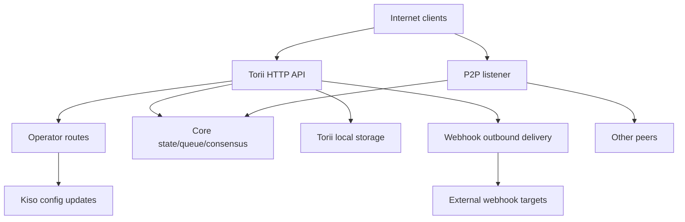

# Iroha Threat Model (repo: `iroha`)

## Executive summary
In an internet-exposed public-blockchain deployment where operator routes are intentionally reachable from the public internet but authenticated by allowlisted request signatures, and where webhooks/attachments are enabled on the public Torii endpoint, the top risks are: operator-key compromise or defects in signature/freshness/replay enforcement, SSRF and outbound abuse via webhook delivery, and high-leverage DoS via transaction/query + streaming endpoints where rate limits are conditionally enforced; additionally, any “mTLS required” posture that relies on the presence of `x-forwarded-client-cert` is spoofable when Torii is directly exposed. Evidence: `crates/iroha_torii/src/lib.rs` (router + authenticated operator routes), `crates/iroha_torii/src/operator_signatures.rs` (operator request verification), `crates/iroha_torii/src/webhook.rs` (outbound HTTP client), `crates/iroha_torii/src/limits.rs` (conditional rate limiting).

## Scope and assumptions

In-scope (runtime / production surfaces):
- Torii HTTP API server and middleware, including “operator” routes, app API, webhooks, attachments, content, and streaming endpoints: `crates/iroha_torii/`, `crates/iroha_torii_shared/`
- Node bootstrap and component wiring (Torii + P2P + state/queue/config update actor): `crates/irohad/src/main.rs`
- P2P transport and handshake surfaces: `crates/iroha_p2p/`
- Configuration shapes and defaults (especially Torii auth defaults): `crates/iroha_config/src/parameters/{actual,defaults}.rs`
- Client-facing config update DTO (what `/v1/configuration` can change): `crates/iroha_config/src/client_api.rs`
- Deployment packaging basics: `Dockerfile`, and example configs in `defaults/` (do not use embedded example keys in production).

Out-of-scope (unless explicitly requested):
- CI workflows and release automation: `.github/`, `ci/`, `scripts/`
- Mobile/client SDKs and apps: `IrohaSwift/`, `java/`, `examples/`
- Documentation-only material: `docs/`

Explicit assumptions (based on your clarifications):
- Torii is internet-exposed and reachable by unauthenticated clients (some endpoints may still require signatures or other auth).
- Operator routes (`/v1/configuration` and operator-gated telemetry/profiling when enabled) are intended to be publicly reachable and should authenticate via signature from an operator-controlled private key. `GET /v1/nexus/lifecycle` is read-only and exposes the exact catalog commitment under the normal Torii access policy; no HTTP lifecycle mutation route is mounted. Topology changes use signed `SetParameter(nexus_lane_lifecycle_v1)` transactions and require the on-chain `CanSetParameters` permission. Evidence: `crates/iroha_torii/src/lib.rs`, `crates/iroha_torii/src/routing.rs`, and `crates/iroha_core/src/smartcontracts/isi/world.rs`.
- Operator signature verification uses a node-local allowlist of operator public keys, exact-network canonical request bytes, timestamp and nonce freshness, and a bounded replay cache. Evidence: `crates/iroha_torii/src/operator_signatures.rs` and `crates/iroha_torii/src/app_auth.rs`.
- Torii is not necessarily deployed behind a trusted ingress; therefore, headers like `x-forwarded-client-cert` must be treated as attacker-controlled when Torii is directly exposed. Evidence: `crates/iroha_torii/src/lib.rs` (`HEADER_MTLS_FORWARD`, `norito_rpc_mtls_present`) and `crates/iroha_torii/src/operator_auth.rs` (`HEADER_MTLS_FORWARD`, `mtls_present`).
- Webhooks and attachments are enabled on the public Torii endpoint. Evidence: `crates/iroha_torii/src/lib.rs` (routes for `/v1/webhooks` and `/v1/zk/attachments`), `crates/iroha_torii/src/webhook.rs`, `crates/iroha_torii/src/zk_attachments.rs`.
- Operator may set or keep `torii.require_api_token = false` (default is `false`). Evidence: `crates/iroha_config/src/parameters/defaults.rs` (`torii::REQUIRE_API_TOKEN`).
- `/v1/pipeline/transactions` and `/v1/query` are expected to be reachable for a public chain. Note: they are additionally gated by the “Norito-RPC” rollout stage and optional “mTLS required” header presence check; the shipping stage is `ga`, while deployments can select `canary` or `disabled`. Evidence: `crates/iroha_torii/src/lib.rs` (`ConnScheme::from_request`, `evaluate_norito_rpc_gate`) and `crates/iroha_config/src/parameters/defaults.rs` (`torii::transport::norito_rpc::STAGE = "ga"`).

Open questions that would materially change risk ranking:
- Where are operator public keys configured (which config key/format), and how are keys identified/rotated (key id, multiple active keys, revocation)?
- What operator-key rotation and revocation procedure should deployments use while preserving the configured timestamp-skew and nonce-retention invariant?
- Which private webhook destination CIDRs, if any, must deployment policy allow beyond the default public-address-only SSRF posture, and how are those targets isolated?
- Does the deployment add specialized Torii features such as `profiling`, and which default app/API surfaces does policy keep active? Evidence: `crates/iroha_torii/Cargo.toml` (`[features]`) and the deployed configuration.

## System model

### Primary components
- **Internet clients** (wallets, indexers, explorers, bots): send HTTP/Norito requests and open WS/SSE connections.
- **Torii (HTTP API)**: axum router with middleware for pre-auth gating, optional API token enforcement, response-media negotiation, remote address injection, and metrics. The first-release `/v1` surface has no request-header API-version negotiation. Evidence: `crates/iroha_torii/src/lib.rs` (`create_api_router`, `enforce_preauth`, `enforce_api_token`, `capture_response_format`, `inject_remote_addr_header`).
- **Operator/auth control plane**: operator routes use signature authentication against configured operator public keys. The signed transcript binds the genesis-derived network id, method, bounded path/query, body hash, canonical timestamp, and nonce; a bounded replay cache rejects nonce reuse. Evidence: `crates/iroha_torii/src/lib.rs`, `crates/iroha_torii/src/operator_signatures.rs`, and `crates/iroha_torii/src/app_auth.rs`.
- **Core node components (in-process)**: transaction queue, state/WSV, consensus (Sumeragi), block storage (Kura), config update actor (Kiso), etc, passed into Torii. Evidence: `crates/irohad/src/main.rs` (`Torii::new_with_handle(...)` receives `queue`, `state`, `kura`, `kiso`, `sumeragi`, and is started via `torii.start(...)`).
- **P2P networking**: mandatory TLS 1.3 over TCP, with optional QUIC and no plaintext listener or Torii WebSocket peer route. Rustls proves possession of the self-signed certificate key; the V5 application handshake then binds its exact fingerprint, network, peer identity, and SoraNet transcript. Evidence: `crates/iroha_p2p/src/network.rs`, `crates/iroha_p2p/src/peer.rs`, and `crates/iroha_p2p/src/transport.rs`.
- **Torii local persistence**: `./storage/torii` default base dir for attachments/webhooks/queues. Evidence: `crates/iroha_config/src/parameters/defaults.rs` (`torii::data_dir()`), `crates/iroha_torii/src/webhook.rs` (persisted `webhooks.json`), `crates/iroha_torii/src/zk_attachments.rs` (stored under `./storage/torii/zk_attachments/`).
- **Outbound webhook targets**: Torii can deliver events to policy-approved `http://`, `https://`, `ws://`, and `wss://` URLs. The shipping feature aggregate includes the secure transports; destination checks allow public addresses by default and only explicitly allowlisted private CIDRs. Evidence: `crates/iroha_torii/src/webhook.rs` (`validate_webhook_url_for_create`, `resolve_destination_addrs`, `http_post_plain`, `http_post_https`, `ws_send`).

### Data flows and trust boundaries
- Internet client → Torii HTTP API
  - Data: Norito binary (`SignedTransaction`, `SignedQuery`), JSON DTOs (app API), WS/SSE subscriptions, headers (including `x-api-token`).
  - Channel: HTTP/1.1 + WebSocket + SSE (axum).
  - Guarantees: optional API token (`torii.require_api_token`), pre-auth connection/rate gating, and explicit JSON/Norito response-media negotiation; many handlers apply per-endpoint rate limiting conditionally (can be bypassed when `enforce=false`). Evidence: `crates/iroha_torii/src/lib.rs` (`enforce_preauth`, `validate_api_token`, `capture_response_format`, `handler_post_transaction`, `handler_signed_query`), `crates/iroha_torii/src/limits.rs` (`allow_conditionally`).
  - Validation: body limits on some endpoints (e.g., transactions), Norito decoding, request signing for some app endpoints (canonical request headers). Evidence: `crates/iroha_torii/src/lib.rs` (`add_transaction_routes` uses `DefaultBodyLimit::max(...)`), `crates/iroha_torii/src/app_auth.rs` (`verify_canonical_request`).

- Internet client → “Operator” routes (Torii)
  - Data: config updates (`ConfigUpdateDTO`) and privileged operator/debug/profile reads (when enabled).
  - Channel: HTTP.
  - Guarantees: privileged operator routes use `.authenticated_operator(...)` with configured allowlisted signing keys. The canonical transcript binds the network, method, target, body hash, timestamp, and nonce; a bounded replay cache admits freshness exactly once. Evidence: `crates/iroha_torii/src/lib.rs`, `crates/iroha_torii/src/operator_signatures.rs`, and `crates/iroha_torii/src/app_auth.rs`.
  - Validation: DTO parsing is protected by the signed operator middleware; handlers such as `handle_post_configuration` can therefore delegate the already-authorized update to Kiso. Evidence: `crates/iroha_torii/src/routing.rs` (`handle_post_configuration`).

- Torii → Core queue/state/consensus (in-process)
  - Data: transaction submissions, query execution, state reads/writes, consensus telemetry queries.
  - Channel: in-process Rust calls (shared `Arc` handles).
  - Guarantees: assumed trusted boundary; security depends on Torii correctly authenticating/authorizing requests before invoking privileged operations. Evidence: `crates/irohad/src/main.rs` (`Torii::new_with_handle(...)` wiring) and Torii handlers calling `routing::handle_*`.

- Torii → Kiso (config update actor)
  - Data: `ConfigUpdateDTO` can modify logging, P2P ACL, network/transport settings, SoraNet handshake, etc.
  - Channel: in-process message/handle.
  - Guarantees: authorization is expected at Torii boundary; update DTO itself is capability-bearing. Evidence: `crates/iroha_config/src/client_api.rs` (`ConfigUpdateDTO` fields include `network_acl`, `transport.norito_rpc`, `soranet_handshake`, etc).

- Torii → Local disk (`./storage/torii`)
  - Data: webhook registry and queued deliveries; attachments and sanitizer metadata; GC/TTL behavior.
  - Channel: filesystem.
  - Guarantees: local OS permissions (container runs as non-root in Dockerfile); attachment tenant isolation is keyed by the verified canonical account, with per-account and node-global quotas. Evidence: `Dockerfile` (`USER iroha`), `crates/iroha_torii/src/lib.rs` (`zk_attachments_tenant`), `crates/iroha_torii/src/zk_attachments.rs`.

- Torii → Webhook targets (outbound)
  - Data: event payloads + signature header.
  - Channel: raw TCP HTTP client for `http://`; optional `hyper+rustls` for `https://` when enabled; optional WS/WSS when enabled.
  - Guarantees: webhook CRUD requires an allowlisted operator signature. Destination checks run both at creation and after DNS resolution, reject non-public addresses by default, and permit private addresses only through an explicit CIDR allowlist; bounded timeouts/retries limit delivery work. Evidence: `crates/iroha_torii/src/lib.rs` (`operator_post`), `crates/iroha_torii/src/webhook.rs` (`validate_webhook_url_for_create`, `resolve_destination_addrs`, `handle_create_webhook`).

- P2P peers (untrusted network) → P2P transport/handshake
  - Data: TLS/QUIC handshake, V5 peer preface/metadata, SoraNet NK2/NK3 frames, encrypted application frames, and consensus messages.
  - Channel: mandatory TLS 1.3 over TCP or optional QUIC with exact `iroha-p2p/1` ALPN; a failed QUIC attempt can fall back only to authenticated TLS.
  - Guarantees: rustls verifies certificate-key possession, then SoraNet dual Ed25519/ML-DSA-65 authentication and the BLS-normal V5 peer handshake bind the certificate fingerprint, transcript, `NetworkId`, challenge, and peer identity before admission. Self-signed certificates do not provide CA naming trust by themselves, and unauthenticated clients can still consume bounded pre-handshake work. Evidence: `crates/iroha_p2p/src/network.rs`, `crates/iroha_p2p/src/peer.rs`, and `crates/iroha_p2p/src/transport.rs`.

#### Diagram

```mermaid
flowchart TD
  A["Internet clients"] --> B["Torii HTTP API"]
  A --> C["P2P listener"]
  B --> D["Operator routes"]
  D --> E["Kiso config updates"]
  B --> F["Core state/queue/consensus"]
  B --> G["Torii local storage"]
  B --> H["Webhook outbound delivery"]
  C --> F
  H --> I["External webhook targets"]
  C --> J["Other peers"]
```

## Assets and security objectives

| Asset | Why it matters | Security objective (C/I/A) |
|---|---|---|
| Chain state / WSV / blocks | Integrity failures become consensus failures; availability failures stall the chain | I/A |
| Consensus liveness (Sumeragi) | Public blockchain value depends on sustained block production | A |
| Node private keys (peer identity, signing keys) | Key compromise enables identity takeover, signing abuse, or network partitioning | C/I |
| Runtime configuration (Kiso-updated) | Controls network ACLs and transport settings; misuse can disable protections or admit malicious peers | I |
| Transaction queue / mempool | Flooding can starve consensus and exhaust CPU/memory | A |
| Torii persistence (`./storage/torii`) | Disk exhaustion can crash the node; stored data may influence downstream processing | A (and sometimes C/I) |
| Outbound webhook channel | Can be abused for SSRF, data exfiltration from internal networks, or scanning from a trusted egress IP | C/I/A |
| Telemetry/metrics/debug data | Can leak network topology and operational state useful for targeted attacks | C |

## Attacker model

### Capabilities
- Remote, unauthenticated internet attacker can send arbitrary HTTP requests, hold long-lived WS/SSE connections, and replay or spray payloads (botnet).
- Any party can generate keys and submit signed transactions/queries (public blockchain), including high-volume spam.
- Malicious/compromised peer can connect to P2P and attempt protocol abuse, flooding, or handshake manipulation within allowed constraints.
- A compromised allowlisted operator key, defective operator-auth enforcement, or an over-broad destination policy can register attacker-controlled webhook URLs and receive outbound callbacks.

### Non-capabilities
- No direct local filesystem access absent an exposed endpoint or misconfigured volume permissions.
- No ability to forge signatures for existing peer/operator keys without key compromise.
- No assumed ability to break modern cryptography (X25519, ChaCha20-Poly1305, Ed25519) under normal conditions.

## Entry points and attack surfaces

| Surface | How reached | Trust boundary | Notes | Evidence (repo path / symbol) |
|---|---|---|---|---|
| `POST /v1/pipeline/transactions` | Internet HTTP | Internet → Torii | Norito binary signed transaction; rate limiting is conditional (`enforce` can be false) | `crates/iroha_torii/src/lib.rs` (`handler_post_transaction`, `ConnScheme::from_request`) |
| `POST /v1/query` | Internet HTTP | Internet → Torii | Norito binary signed query; rate limiting is conditional (`enforce` can be false) | `crates/iroha_torii/src/lib.rs` (`handler_signed_query`) |
| Norito-RPC gate | Internet HTTP headers | Internet → Torii | Rollout stage + optional “mTLS required” via header presence; canary uses `x-api-token` | `crates/iroha_torii/src/lib.rs` (`evaluate_norito_rpc_gate`, `HEADER_MTLS_FORWARD`) |
| `POST/GET/DELETE /v1/webhooks...` | Operator-signed Internet HTTP (app API) | Internet → operator authentication → Torii → outbound | CRUD requires an allowlisted operator signature. Destination validation and every delivery resolution reject non-public addresses unless explicitly CIDR-allowed; misconfiguration or operator compromise still creates outbound risk. | `crates/iroha_torii/src/lib.rs` (`operator_get`, `operator_post`, `operator_delete`), `crates/iroha_torii/src/webhook.rs` (`validate_webhook_url_for_create`, `resolve_destination_addrs`) |
| `POST/GET/DELETE /v1/zk/attachments...` | Canonical-account-signed Internet HTTP (app API) | Internet → account authentication → Torii → disk | Attachment sanitizer + decompression + persistence remain disk/CPU surfaces; quotas are tenant-scoped by the verified canonical account, with node-global caps. | `crates/iroha_torii/src/lib.rs` (`handler_zk_attachments_*`, `zk_attachments_tenant`), `crates/iroha_torii/src/zk_attachments.rs` |
| `GET /v1/content/{bundle}/{path...}` | Internet HTTP | Internet → Torii → state/storage | Supports auth modes + PoW + Range; egress limiter | `crates/iroha_torii/src/content.rs` (`handle_get_content`, `enforce_pow`, `enforce_auth`) |
| Streaming: `/v1/events/sse`, `/v1/events/ws` (WS), `/v1/blocks/stream` (WS) | Internet | Internet → Torii | Long-lived connections; DoS surface | `crates/iroha_torii/src/lib.rs` (`add_network_stream_routes`) |
| `GET/POST /v1/configuration` | Internet HTTP | Internet → operator routes → Kiso | `.authenticated_operator(...)` verifies an exact-network, timestamped, nonce-bearing canonical transcript against configured allowlist keys before the handler delegates the update to Kiso | `crates/iroha_torii/src/lib.rs` (`add_core_info_routes`, `handler_post_configuration`), `crates/iroha_torii/src/operator_signatures.rs`, `crates/iroha_torii/src/routing.rs` (`handle_post_configuration`) |
| `GET /v1/nexus/lifecycle` | Internet HTTP | Internet → normal Torii access policy → committed state | Read-only versioned catalog/hash and active-incarnation/root snapshot captured from one state generation; JSON/Norito negotiation; clients validate both commitments before signing | `crates/iroha_torii/src/lib.rs` (`handler_get_nexus_lane_lifecycle`), `crates/iroha_data_model/src/nexus/mod.rs` (`LaneLifecycleStatusV1::validate`) |
| Signed `SetParameter(nexus_lane_lifecycle_v1)` transaction | Internet HTTP | transaction ingress → permission validation → consensus → committed state | Transaction signature/chain replay protection, `CanSetParameters`, optimistic catalog hash, one transition per block, commit-time revalidation and storage preflight | `crates/iroha_core/src/smartcontracts/isi/world.rs`, `crates/iroha_core/src/state.rs` |
| Telemetry/profiling endpoints (feature-gated) | Internet HTTP | Internet → Torii diagnostics/operator routes | `/status`, exact `/status/blocks` and `/status/peers` probes, and `/metrics` are intentionally public diagnostics; privileged phase/debug and profiling routes use `.authenticated_operator(...)`. Both classes remain disclosure or DoS surfaces appropriate to their exposure. | `crates/iroha_torii/src/lib.rs` (`add_telemetry_routes`, `add_profiling_routes`, `authenticated_operator`), `crates/iroha_torii/src/operator_signatures.rs` |
| P2P TLS/QUIC transports | Internet / peer network | Internet/peers → P2P | Mandatory TLS 1.3 or optional QUIC, certificate-key possession, exact fingerprint channel binding, dual SoraNet authentication, and signed V5 peer identity; pre-handshake resource use remains attacker-accessible | `crates/iroha_p2p/src/network.rs`, `crates/iroha_p2p/src/peer.rs`, `crates/iroha_p2p/src/transport.rs` |

## Top abuse paths

1. **Attacker goal: Take over node behavior via runtime config updates**
   1) Compromise an allowlisted operator key or exploit a defect in canonical signature, freshness, replay, or route-wiring enforcement on an internet-exposed Torii.
   2) `POST /v1/configuration` with a `ConfigUpdateDTO` that loosens network ACLs or changes transport settings.  
   3) Join as a peer or induce partition/misconfiguration; degrade consensus and/or route transactions through attacker-controlled infrastructure.  
   Impact: integrity and availability compromise of the node (and potentially the network).  

2. **Attacker goal: Replay a captured operator-signed request**
   1) Obtain one valid signed operator request (e.g., via compromised operator machine, misconfigured proxy logs, or an environment where TLS is terminated unsafely).  
   2) Replay the same request against public operator routes if the signature scheme lacks freshness (timestamp/nonce) and server-side replay rejection.  
   3) Cause repeated configuration changes, rollbacks, or forced toggles that degrade availability or weaken defenses.  
   Impact: integrity/availability compromise despite “signature auth”.  

3. **Attacker goal: Disable/gate protections by changing Norito-RPC rollout**
   1) `POST /v1/configuration` to update `transport.norito_rpc.stage` or `require_mtls`.  
   2) Force-open or force-close `/v1/pipeline/transactions` and `/v1/query`, impacting availability and admission controls.
   Impact: targeted outage or admission-control bypass.  

4. **Attacker goal: SSRF into operator’s internal network**
   1) Compromise an allowlisted operator key or induce deployment policy to disable the destination guard or allow a sensitive private CIDR.
   2) Create a webhook entry pointing at an internal destination via `POST /v1/webhooks`; creation-time and post-DNS checks otherwise reject it.
   3) Wait for matching events and use delivery behavior to probe the newly permitted destination.
   Impact: internal network exposure, lateral movement scaffolding, reputational harm, potential credential exposure via metadata endpoints.  

5. **Attacker goal: Deny service of transaction/query admission**
   1) Flood `POST /v1/pipeline/transactions` and `POST /v1/query` with valid/invalid Norito bodies.
   2) Maintain many WS/SSE subscriptions and slow clients.  
   3) Exploit conditional rate limiting (`enforce=false`) in normal operation to avoid throttling.  
   Impact: CPU/memory exhaustion, queue saturation, consensus stalls.  

6. **Attacker goal: Exhaust disk via attachments**
   1) Flood `/v1/zk/attachments` with max-sized payloads and/or compressed archives near expansion limits.  
   2) Use a farm of valid canonical accounts to divide work across per-account tenant caps.
   3) Persist until TTL/GC lags; fill `./storage/torii`.  
   Impact: node crash, inability to process blocks/transactions.  

7. **Attacker goal: Bypass “mTLS required” gates when Torii is directly exposed**
   1) Operator enables `require_mtls` for Norito-RPC or operator auth.  
   2) Attacker sends requests with `x-forwarded-client-cert: <anything>`.  
   3) Header-presence check passes if no trusted ingress strips the header.  
   Impact: controls misapplied; operator believes mTLS is enforced when it isn’t.  

8. **Attacker goal: Degrade peer connectivity / consume resources**
   1) Malicious peer repeatedly attempts handshakes or floods frames near max sizes.  
   2) Consume bounded TLS/QUIC and application-handshake work before authenticated peer admission rejects the connection.
   Impact: connection churn, CPU usage, reduced peer availability.  

9. **Attacker goal: Recon via telemetry/debug endpoints**
   1) Scrape intentionally public `/status` and `/metrics`, or compromise/bypass an operator signature to reach privileged debug or profiling routes.
   2) Use leaked topology/health data to time attacks and target specific components.  
   Impact: increased attacker success rate; possible information disclosure.  

## Threat model table

| Threat ID | Threat source | Prerequisites | Threat action | Impact | Impacted assets | Existing controls (evidence) | Gaps | Recommended mitigations | Detection ideas | Likelihood | Impact severity | Priority |
|---|---|---|---|---|---|---|---|---|---|---|---|---|
| TM-001 | Remote internet attacker | Torii internet-exposed; an allowlisted operator key is compromised or canonical signature/freshness/replay/route enforcement is defective | Invoke mutable operator routes such as `/v1/configuration` to change runtime config, network ACLs, or transport settings. The lifecycle POST method/path pair is unregistered and is not a mutation primitive. | Node takeover/partition; admit malicious peers; disable protections | Runtime config; consensus liveness; chain integrity; peer keys | Mutable operator routes use configured allowlisted signatures, exact-network transcripts, timestamp/nonce freshness, and bounded replay admission; lane topology instead requires a signed, permission-checked, consensus-replayed transaction with an optimistic catalog hash. Evidence: `crates/iroha_torii/src/lib.rs`, `crates/iroha_torii/src/operator_signatures.rs`, `crates/iroha_core/src/smartcontracts/isi/world.rs` | Operator-key compromise still affects mutable node-local configuration; compromise of an account holding `CanSetParameters` can authorize consensus topology changes | Keep operator signature authentication and replay protection mandatory; tightly scope and monitor `CanSetParameters`; use distinct keys; enforce TLS end-to-end; rate-limit and audit both operator actions and lifecycle transactions | Alert on mutable operator route hits, failed/replayed signatures, lifecycle transaction rejection reasons, and all successful `nexus_lane_lifecycle_v1` changes | Medium | High | **critical** |
| TM-002 | Compromised operator or deployment misconfiguration | An allowlisted operator key is compromised, destination guard rails are disabled, or private CIDRs are over-broadly allowed | Register webhook targets that reach sensitive destinations or consume outbound capacity | SSRF, internal scanning, credential exposure, or outbound DoS | Webhook channel; internal network; availability | CRUD requires operator signatures. Destination checks default to public IPs only, reject localhost/private/link-local/metadata-class ranges at creation and after DNS resolution, and deliveries use bounded timeouts/backoff. Evidence: `crates/iroha_torii/src/lib.rs` (`operator_post`), `crates/iroha_torii/src/webhook.rs` (`validate_webhook_url_for_create`, `resolve_destination_addrs`, `WebhookPolicy`) | Operator compromise inherits the configured CIDR authority; disabling the guard or allowing sensitive private ranges intentionally removes the default boundary | Keep destination controls enabled, minimize explicit CIDRs, enforce network egress policy independently, cap outbound concurrency, and rotate/revoke operator keys promptly | Log webhook target and resolved IP; alert on blocked/private destinations, policy changes, high failure rates, and queue saturation | Low | High | **high** |
| TM-003 | Remote internet attacker / spammer | Public `/v1/pipeline/transactions` and `/v1/query`; conditional rate limiting not enforced in common modes | Flood tx/query submission, plus WS/SSE streams | CPU/memory exhaustion; queue saturation; consensus stalls | Availability (Torii + consensus); queue/mempool | Pre-auth gate limits connections per IP and can ban. Evidence: `crates/iroha_torii/src/lib.rs` (`enforce_preauth`), `crates/iroha_torii/src/limits.rs` (`PreAuthGate`) | Many key rate limiters are conditional (`allow_conditionally` returns true when `enforce=false`); distributed attackers bypass per-IP limits | Add always-on rate limits for tx/query/streams when internet-exposed; add per-endpoint configurable rate limits independent of fee policy; protect expensive endpoints with PoW or require signature/account-based quotas | Monitor: preauth rejects, queue length, tx/query rates, WS/SSE active connections; alert on anomalies and sustained capacity limits | High | High | **high** |
| TM-004 | Remote internet attacker | Public diagnostics are enabled, or an operator key/verifier is compromised for privileged diagnostics | Scrape `/status`, `/status/blocks`, `/status/peers`, and `/metrics`; after privileged-auth compromise, request expensive debug or profiling status | Info disclosure; operational DoS; targeted attack enablement | Telemetry/debug data; availability | Phase/debug and profiling routes use `.authenticated_operator(...)`; the three exact status routes and `/metrics` are intentionally public. Evidence: `crates/iroha_torii/src/lib.rs` (`add_telemetry_routes`, `add_profiling_routes`), `crates/iroha_torii/src/operator_signatures.rs` | Public diagnostics still disclose operational state and can be scraped; privileged diagnostics inherit operator-key and verifier risk | Add hard rate limits and response caching to public diagnostics; avoid enabling privileged profiling/debug routes on public nodes unless needed; protect and rotate operator keys | Track access logs; alert on scraping patterns, failed operator signatures, and sustained high-cost requests | Medium | Medium | **medium** |
| TM-005 | Remote internet attacker (misconfig exploitation) | Operator enables `require_mtls` but Torii is directly exposed (or proxy/header sanitization is not guaranteed) | Spoof `x-forwarded-client-cert` to satisfy “mTLS required” checks | False sense of security; bypass gating for Norito-RPC / operator auth policies | Operator/auth boundary; admission control | `require_mtls` is checked by header presence. Evidence: `crates/iroha_torii/src/lib.rs` (`HEADER_MTLS_FORWARD`, `norito_rpc_mtls_present`), `crates/iroha_torii/src/operator_auth.rs` (`mtls_present`) | No cryptographic verification of client cert at Torii; relies on an external ingress contract | Do not rely on `x-forwarded-client-cert` for security when Torii is publicly reachable; if mTLS is required, enforce client cert verification at Torii or at a trusted ingress that strips client headers; otherwise remove/ignore the header-based gate for internet-facing deployments | Alert on any request containing `x-forwarded-client-cert` reaching Torii directly; log gate outcomes for Norito-RPC and operator auth; monitor for sudden changes in allowed traffic | High | High | **high** |
| TM-006 | Authenticated malicious account or account farm | Attacker can produce canonical account signatures and submit maximum-sized or compression-heavy attachments | Abuse sanitizer/decompression/persistence to consume CPU/disk | Node instability; disk exhaustion; degraded throughput | Torii storage; availability | Canonical-account authentication, per-account and node-global count/byte quotas, body/expansion/archive-depth limits, TTL/GC, and subprocess sanitization bound each path. Evidence: `crates/iroha_config/src/parameters/defaults.rs` (`ATTACHMENTS_MAX_BYTES`, `ATTACHMENTS_MAX_EXPANDED_BYTES`, `ATTACHMENTS_MAX_ARCHIVE_DEPTH`, `ATTACHMENTS_SANITIZER_MODE`), `crates/iroha_torii/src/zk_attachments.rs`, `crates/iroha_torii/src/lib.rs` (`zk_attachments_tenant`) | A distributed account farm can divide work across tenant quotas, while the shared sanitizer and disk remain node-global resources | Retain global quotas/backpressure and subprocess isolation; rate-limit signed attachment writes per account and source; tune TTL and byte caps to deployment capacity | Monitor storage, creation rate, sanitizer rejects/timeouts, per-account accumulation, global quota pressure, and GC lag | Medium | High | **high** |
| TM-007 | Malicious peer | Peer can reach the mandatory TLS or optional QUIC listener | Flood transport/application handshakes or encrypted frames near their caps | Connectivity degradation; resource burn; partial partitioning | Availability; peer connectivity | No plaintext downgrade exists; rustls proves certificate-key possession and V5 binds its fingerprint to dual SoraNet authentication plus the signed BLS-normal peer identity. Frame, connection, throttle, and queue limits fail closed. Evidence: `crates/iroha_p2p/src/network.rs`, `crates/iroha_p2p/src/peer.rs`, `crates/iroha_p2p/src/transport.rs` | Certificate and peer identity authentication completes only after some bounded transport/application work; distributed sources can dilute per-IP throttles | Keep strict connection limits per IP/prefix; rate-limit handshake attempts; consider allowlisted peer keys on public nodes; keep frame and preface caps conservative; retain backpressure and early drop before expensive authentication stages | Monitor inbound P2P connection rate; alert on repeated TLS/ALPN, SoraNet, identity-binding, and frame-cap failures | Medium | Medium | **medium** |
| TM-008 | Supply chain / operator error | Operator deploys with example or weak keys/configs; dependencies compromised | Use default/example keys, omit or weaken the operator-signature allowlist, or hijack a dependency | Key compromise; chain partition; reputation loss | Keys; integrity; availability | Docker runs non-root and copies defaults into `/config`; privileged routes require an operator signature. Evidence: `Dockerfile` (`USER iroha`, `COPY defaults ...`), `crates/iroha_torii/src/operator_signatures.rs` | Example configs may contain embedded example private keys; `require_api_token=false` leaves intentionally public APIs exposed; a weak/missing allowlist can make operator deployment unusable or insecure | Add startup warnings/fail-closed checks when detecting known example keys; ship a “public node” hardened config profile; enforce `cargo deny`/SBOM checks in release pipeline | CI gating for secrets in `defaults/`; runtime log warning on insecure config combinations | Medium | High | **high** |
| TM-009 | Remote internet attacker | Attacker can observe a valid signed operator request and exploit a freshness or replay-cache implementation/configuration defect | Replay a previously valid signed operator request against public operator routes | Repeated config changes/rollbacks; targeted outages; weakening of defenses | Runtime config; availability; audit integrity | Operator transcripts include canonical timestamp and nonce; verification enforces clock skew and uses an identity-bound bounded replay cache whose retention must cover the accepted timestamp window. Evidence: `crates/iroha_torii/src/operator_signatures.rs`, `crates/iroha_torii/src/bounded_replay_cache.rs` | Unsafe skew/TTL reconfiguration or loss of replay-cache state across restart can reopen a previously accepted time window | Keep nonce TTL greater than twice maximum clock skew, fail closed during retention widening, persist/audit privileged request identifiers where deployment policy requires restart-spanning replay resistance, and reject duplicate nonces | Alert on duplicate nonces/request hashes; correlate operator actions by identity and source; add metrics for replay rejects and replay-cache capacity/quarantine | Low | High | **medium** |
| TM-010 | Remote attacker / insider | Operator or Kagemusha V1 command-submission private key is stored where it can be exfiltrated (disk/config/CI artifacts) | Steal a private key and issue valid signed operator requests or Kagemusha V1 transactions | Full operator-plane compromise or unauthorized Kagemusha V1 command submission with low detectability | Operator keys; Kagemusha V1 submission authority; runtime config; consensus liveness | Torii loads the Kagemusha V1 submission private key from `torii.kagemusha_v1_commands.private_key` or `TORII_KAGEMUSHA_V1_COMMANDS_PRIVATE_KEY` and derives the submission authority from its public key. Evidence: `crates/iroha_config/src/parameters/user.rs` (`ToriiKagemushaV1Commands::parse`), `crates/iroha_torii/src/lib.rs`; `Dockerfile` runs as non-root | Key storage and rotation are deployment responsibilities; signature auth and Kagemusha V1 command submission inherit this risk | Keep private keys in deployment-owned non-extractable custody; avoid embedding them in repositories or world-readable configuration; enforce strict file permissions and rotation; consider multi-signature or threshold authorization for privileged actions | Alert on operator actions and Kagemusha V1 submissions from new IPs/ASNs; maintain immutable audit logs; rotate keys on suspicion | Medium | High | **high** |

## Criticality calibration

For this repo + clarified deployment context (internet-exposed public chain; operator routes are public and intended to be signature-authenticated; no guaranteed trusted ingress), severity levels mean:

- **critical**: A remote, unauthenticated attacker can change node/network behavior or reliably halt block production across many nodes.
  - Examples: compromise of an allowlisted operator key or a critical verifier/route-wiring defect affecting `/v1/configuration` (TM-001); webhook SSRF to metadata endpoints/cluster control plane from privileged egress (TM-002); operator signing key theft enabling valid signed operator actions (TM-010).

- **high**: A remote attacker can cause sustained DoS of a node or bypass a security control that operators may rely on, with realistic preconditions.
  - Examples: high-volume tx/query admission DoS when conditional rate limiting is inactive (TM-003); attachment-driven disk/CPU exhaustion (TM-006); replay of a captured signed operator request after an unsafe replay-window reconfiguration or restart-state loss (TM-009).

- **medium**: Attacks that meaningfully aid recon or degrade performance but are either feature-gated, require elevated attacker position, or have significant mitigation already present.
  - Examples: telemetry/profiling exposure when enabled (TM-004); P2P handshake flooding with limited blast radius (TM-007).

- **low**: Attacks requiring unlikely preconditions, limited blast radius, or primarily operational footguns with easy mitigation.
  - Examples: minor information leaks from genuinely public read-only endpoints such as `/v1/health`, which are primarily useful for recon rather than direct compromise (not enumerated as top threats here). Node-local reads are excluded from this class: `/v1/peers`, `/v1/time/status`, `/v1/pipeline/preflight`, `/v1/pipeline/recovery/{height}`, `/v1/policy`, and `/v1/proofs/retention` require exact-network, replay-resistant operator signatures. Evidence: `crates/iroha_torii_shared/src/route_catalog.rs` and `crates/iroha_torii/src/lib.rs`.

## Focus paths for security review

| Path | Why it matters | Related Threat IDs |
|---|---|---|
| `crates/iroha_torii/src/lib.rs` | Router construction, middleware ordering, operator route groups, tx/query handlers, auth/rate-limit decisions, and app API wiring (webhooks/attachments) | TM-001, TM-002, TM-003, TM-004, TM-005, TM-006 |
| `crates/iroha_torii/src/operator_signatures.rs` | Allowlisted operator signatures, exact canonical transcript, freshness checks, and replay admission | TM-001, TM-004, TM-009 |
| `crates/iroha_torii/src/operator_auth.rs` | First-credential bootstrap, WebAuthn session policy, and header-based mTLS checks; important for understanding ingress trust assumptions | TM-005 |
| `crates/iroha_torii/src/routing.rs` | `/v1/configuration` handlers delegate to Kiso without additional auth; large surface area of handlers | TM-001, TM-003 |
| `crates/iroha_config/src/client_api.rs` | Defines `ConfigUpdateDTO` capabilities (network ACLs, transport changes, handshake updates) | TM-001, TM-009 |
| `crates/iroha_config/src/parameters/defaults.rs` | Default posture for API tokens/operator auth/Norito-RPC stage; attachment defaults | TM-003, TM-006, TM-008 |
| `crates/iroha_torii/src/webhook.rs` | Outbound HTTP client and scheme support; SSRF surface; persistence and delivery worker | TM-002 |
| `crates/iroha_torii/src/zk_attachments.rs` | Attachment sanitizer, decompression limits, persistence, tenant keying | TM-006 |
| `crates/iroha_torii/src/limits.rs` | Pre-auth gate and rate limiting helpers; conditional enforcement behavior | TM-003 |
| `crates/iroha_torii/src/content.rs` | Content endpoint auth/PoW/Range and egress limiting; data exfil and DoS considerations | TM-003 |
| `crates/iroha_torii/src/app_auth.rs` | Canonical request signing (message construction and signature verification); replay-risk considerations if reused for operator auth | TM-001, TM-003, TM-009 |
| `crates/iroha_p2p/src/lib.rs` | Crypto choices, framing limits, handshake error handling; P2P risk surface | TM-007 |
| `crates/iroha_p2p/src/transport.rs` | Mandatory TLS/optional QUIC certificate-key proof, ALPN enforcement, and transport behavior affecting pre-authentication DoS | TM-007 |
| `crates/irohad/src/main.rs` | Bootstraps Torii + P2P + config update actor; determines which surfaces are enabled | TM-001, TM-008 |
| `defaults/nexus/config.toml` | Example config may include embedded example keys and public bind addresses; deployment footguns | TM-008 |
| `Dockerfile` | Container runtime user/permissions and default config inclusion (key material and operator-plane exposure are deployment-sensitive) | TM-008, TM-010 |

### Quality check
- Entry points covered: tx/query, streaming, webhooks, attachments, content, operator/config, telemetry/profiling (feature-gated), P2P.
- Trust boundaries covered in threats: Internet→Torii, Torii→Kiso/core/disk, Torii→webhook targets, peers→P2P.
- Runtime vs CI/dev separation: CI/docs/mobile explicitly out of scope.
- User clarifications reflected: internet-exposed, privileged operator routes are public and signature-authenticated, no guaranteed trusted ingress, webhooks/attachments enabled on public Torii endpoint.
- Assumptions/open questions explicitly listed in “Scope and assumptions”.

## Notes on use
- This document is intentionally repo-grounded (evidence anchors point to current code). Operator signature and replay enforcement and webhook SSRF destination controls are implemented; operator-key compromise and policy weakening remain the primary webhook risks.
- Treat any header-based “mTLS” signals (e.g., `x-forwarded-client-cert`) as attacker-controlled unless a trusted ingress strips and injects them.
