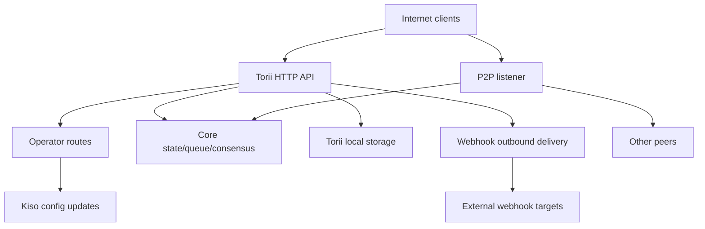

<!-- Auto-generated stub for Mongolian (mn) translation. Replace this content with the full translation. -->

---
lang: mn
direction: ltr
source: iroha-threat-model.md
status: complete
generator: scripts/sync_docs_i18n.py
source_hash: 766928cf0dcbfe3513c728bcf0b9fa697a330e8000bc6944ab61e8fcd59751ad
source_last_modified: "2026-02-07T13:27:25.009145+00:00"
translation_last_reviewed: 2026-04-02
translator: machine-google-reviewed
---

# Iroha аюулын загвар (репо: `iroha`)

## Гүйцэтгэх товчлол
Операторын чиглүүлэлтүүд нь нийтийн интернетээс зориудаар холбогдож болох боловч хүсэлтийн гарын үсгээр баталгаажсан байх ёстой, мөн Torii нийтийн төгсгөлийн цэг дээр вэб дэгээ/хавсралтуудыг идэвхжүүлсэн интернетэд нээлттэй олон нийтийн блокчейн ашиглалтын үед хамгийн том эрсдэлүүд нь: операторын онгоцны буулт эсвэл дахин тоглуулах боломжгүй хүсэлт. `/v1/configuration` болон бусад операторын чиглүүлэлтүүд), вэб дэгээгээр дамжуулан SSRF болон гадагшаа урвуулан ашиглах, гүйлгээ/асуулга + урсгалын төгсгөлийн цэгүүдээр дамжуулан өндөр хөшүүрэгтэй DoS, ханшийн хязгаарлалтыг нөхцөлтэйгээр хэрэгжүүлдэг; Нэмж хэлэхэд, `x-forwarded-client-cert` байгаа эсэхээс шалтгаалсан аливаа "mTLS шаардлагатай" байрлал нь Torii шууд ил гарсан үед хуурамч болно. Нотлох баримт: `crates/iroha_torii/src/lib.rs` (чиглүүлэгч + завсрын програм + операторын маршрутууд), `crates/iroha_torii/src/operator_auth.rs` (операторын баталгаажуулалтыг идэвхжүүлэх/идэвхгүй болгох + `x-forwarded-client-cert` шалгах), `crates/iroha_torii/src/webhook.rs` (гадагш HTTP клиент), Sumeragi (гадагш HTTP клиент), Sumeragi (хязгаарлалт) Sumeragi.

## Хамрах хүрээ ба таамаглалХамрах хүрээ (ажиллах хугацаа / үйлдвэрлэлийн гадаргуу):
- Torii HTTP API сервер ба дунд программ хангамж, үүнд "оператор" чиглүүлэлтүүд, програмын API, вэб дэгээ, хавсралтууд, контентууд болон урсгалын төгсгөлийн цэгүүд: `crates/iroha_torii/`, `crates/iroha_torii_shared/`
- Зангилааны ачаалах оосор ба бүрэлдэхүүн хэсгийн утас (Torii + P2P + төлөв/дараалал/тохиргооны шинэчлэлтийн оролцогч): `crates/irohad/src/main.rs`
- P2P тээврийн болон гар барих гадаргуу: `crates/iroha_p2p/`
- Тохиргооны хэлбэр ба өгөгдмөл (ялангуяа Torii auth өгөгдмөл): `crates/iroha_config/src/parameters/{actual,defaults}.rs`
- Үйлчлүүлэгч рүү чиглэсэн тохиргооны шинэчлэлт DTO (`/v1/configuration` юуг өөрчилж болно): `crates/iroha_config/src/client_api.rs`
- Байршуулах савлагааны үндсэн ойлголт: `Dockerfile`, `defaults/` дээрх жишээ тохиргоо (үйлдвэрлэлд суулгагдсан жишээ түлхүүрүүдийг бүү ашигла).

Хамрах хүрээнээс гадуур (тодорхой хүсэлт гаргаагүй бол):
- CI ажлын урсгал ба хувилбарын автоматжуулалт: `.github/`, `ci/`, `scripts/`
- Мобайл/үйлчлүүлэгчийн SDK болон програмууд: `IrohaSwift/`, `java/`, `examples/`
- Зөвхөн баримт бичгийн материал: `docs/`Тодорхой таамаглал (таны тодруулгад үндэслэн):
- Torii нь интернетэд нэвтэрч, баталгаажуулаагүй үйлчлүүлэгчид хандах боломжтой (зарим төгсгөлийн цэгүүдэд гарын үсэг эсвэл өөр баталгаажуулалт шаардлагатай хэвээр байж магадгүй).
- Операторын чиглүүлэлтүүд (`/v1/configuration`, `/v1/nexus/lifecycle`, идэвхжүүлсэн үед операторын хаалгатай телеметр/профайл) нь нийтэд нээлттэй байх зорилготой бөгөөд операторын удирддаг хувийн түлхүүрээр гарын үсгээр баталгаажуулах ёстой. Нотлох баримт (одоогийн төлөв): `crates/iroha_torii/src/lib.rs` (`add_core_info_routes` нь `operator_layer` хамаарна), `crates/iroha_torii/src/operator_auth.rs` (`enforce_operator_auth` / `authorize_operator_endpoint`).
- Операторын гарын үсгийн баталгаажуулалт нь тохиргоонд байгаа операторын нийтийн түлхүүрүүдийн зангилааны локал зөвшөөрөгдсөн жагсаалтыг ашиглах ёстой (одоогийн чиглүүлэгч дээр хэрэгжүүлсэн операторын хаалга байдлаар харуулаагүй). Одоогийн операторын хаалганы нотолгоо: `crates/iroha_torii/src/operator_auth.rs` (`authorize_operator_endpoint`) болон одоо байгаа каноник хүсэлтийн гарын үсэг зурах туслах (мессежийн бүтэц): `crates/iroha_torii/src/app_auth.rs` (`canonical_request_message`).
- Torii нь итгэмжлэгдсэн нэвтрэлтийн ард заавал байх албагүй; тиймээс `x-forwarded-client-cert` гэх мэт толгойнуудыг Torii шууд ил гарсан үед халдагчийн удирдлагатай гэж үзэх ёстой. Нотлох баримт: `crates/iroha_torii/src/lib.rs` (`HEADER_MTLS_FORWARD`, `norito_rpc_mtls_present`) болон `crates/iroha_torii/src/operator_auth.rs` (`HEADER_MTLS_FORWARD`, `mtls_present`).
- Олон нийтийн Torii төгсгөлийн цэг дээр вэб дэгээ болон хавсралтуудыг идэвхжүүлсэн. Нотлох баримт: `crates/iroha_torii/src/lib.rs` (`/v1/webhooks` болон `/v1/zk/attachments`-ийн маршрутууд), `crates/iroha_torii/src/webhook.rs`, `crates/iroha_torii/src/zk_attachments.rs`.- Оператор `torii.require_api_token = false` (өгөгдмөл нь `false`) тохируулж эсвэл хадгалж болно. Нотлох баримт: `crates/iroha_config/src/parameters/defaults.rs` (`torii::REQUIRE_API_TOKEN`).
- `/transaction` болон `/query` олон нийтийн сүлжээнд холбогдох боломжтой байх төлөвтэй байна. Тайлбар: тэдгээр нь нэмэлт "Norito-RPC" нэвтрүүлэх үе шат болон нэмэлт "mTLS шаардлагатай" толгой байгаа эсэхийг шалгах замаар хаагдсан байна. Нотлох баримт: `crates/iroha_torii/src/lib.rs` (`ConnScheme::from_request`, `evaluate_norito_rpc_gate`) болон `crates/iroha_config/src/parameters/defaults.rs` (`torii::transport::norito_rpc::STAGE = "disabled"`).

Эрсдлийн зэрэглэлийг ихээхэн өөрчлөх нээлттэй асуултууд:
- Операторын нийтийн түлхүүрүүдийг хаана тохируулсан (тохируулгын түлхүүр/формат), түлхүүрүүдийг хэрхэн таних/эргэх (түлхүүрийн ID, олон идэвхтэй түлхүүр, хүчингүй болгох) вэ?
- Операторын гарын үсэг зурах мессежийн формат, давтан тоглуулах хамгаалалт (цаг хугацааны тэмдэг/нэг удаа/тоологч + сервер талын дахин тоглуулах кэш) яг юу вэ, цагийг хазайх ямар бодлогыг хүлээн зөвшөөрөх вэ? Одоо байгаа каноник хүсэлтийн туслах нь шинэлэг зүйлгүй болохыг нотлох баримт: `crates/iroha_torii/src/app_auth.rs` (`canonical_request_message`).
- Нэргүй вэб дэгээний хувьд Torii нь дур зоргоороо очихыг зөвшөөрөх ёстой юу, эсвэл SSRF-ийн зорчих бодлогыг хэрэгжүүлэх үү (RFC1918/localhost/link-local/метадта-г блоклож, HTTPS-г заавал шаардах уу)?
- Таны бүтээхэд ямар Torii функцууд идэвхжсэн (`telemetry`, `profiling`, `p2p_ws`, `app_api_https`, `app_api_wss`) ба I0109-г ашигласан уу? Нотлох баримт: `crates/iroha_torii/Cargo.toml` (`[features]`).

## Системийн загвар### Үндсэн бүрэлдэхүүн хэсгүүд
- **Интернет үйлчлүүлэгчид** (түрийвч, индексжүүлэгч, судлаач, робот): HTTP/Norito хүсэлт илгээж, WS/SSE холболтыг нээнэ үү.
- **Torii (HTTP API)**: axuum чиглүүлэгч нь урьдчилсан баталгаажуулалт, нэмэлт API токен хэрэгжилт, API хувилбарын хэлэлцээр, алсын зайнаас хаяг оруулах, хэмжигдэхүүнд зориулагдсан дунд программтай. Нотлох баримт: `crates/iroha_torii/src/lib.rs` (`create_api_router`, `enforce_preauth`, `enforce_api_token`, `enforce_api_version`, `inject_remote_addr_header`).
- **Оператор/атгах хяналтын хавтгай (одоогийн) ба хүссэн байрлал**: операторын чиглүүлэлтүүд одоогоор `operator_auth::enforce_operator_auth` (WebAuthn/токенууд; тохиргоог хийснээр идэвхгүй болгох боломжтой)-ээр хамгаалагдсан боловч таны байршуулах шаардлага бол операторын нийтийн түлхүүрүүдийн зөвшөөрөгдсөн жагсаалтын дагуу баталгаажуулсан гарын үсэгт суурилсан операторын нэвтрэлт танилт юм. Каноник хүсэлтийн мессежийн туслагч байгаа бөгөөд мессеж бүтээхэд дахин ашиглах боломжтой боловч баталгаажуулалтыг тохиргооны түлхүүрүүдийг (дэлхийн улсын бүртгэл биш) ашиглахад тохируулах шаардлагатай. Нотлох баримт: `crates/iroha_torii/src/lib.rs` (`add_core_info_routes` нь `operator_layer` ашигладаг), `crates/iroha_torii/src/operator_auth.rs` (`authorize_operator_endpoint`), `crates/iroha_torii/src/app_auth.rs` (`crates/iroha_torii/src/app_auth.rs` (Norito00, Sumeragi, Sumeragi).- **Үндсэн зангилааны бүрэлдэхүүн хэсгүүд (ажиллаж байгаа)**: гүйлгээний дараалал, төлөв/WSV, зөвшилцөл (Sumeragi), блок хадгалах (Kura), тохиргооны шинэчлэгч (Kiso) гэх мэт, Torii руу шилжсэн. Нотолгоо: `crates/irohad/src/main.rs` (`Torii::new_with_handle(...)` нь `queue`, `state`, `kura`, `kiso`, `Torii::new_with_handle(...)` хүлээн авдаг, `torii.start(...)`).
- **P2P сүлжээ**: шифрлэгдсэн, хүрээтэй үе тэнгийн хооронд тээвэрлэлт, гар барих; нэмэлт TLS-over-TCP байдаг боловч гэрчилгээ баталгаажуулалтыг зориудаар зөвшөөрдөг. Нотлох баримт: `crates/iroha_p2p/src/lib.rs` (төрлийн хоч `NetworkHandle<..., X25519Sha256, ChaCha20Poly1305>`), `crates/iroha_p2p/src/transport.rs` (`p2p_tls` модуль `NoCertificateVerification`).
- **Torii орон нутгийн тогтвортой байдал**: `./storage/torii` хавсралт/вэб дэгээ/дарааллын үндсэн чиглүүлэгч. Нотлох баримт: `crates/iroha_config/src/parameters/defaults.rs` (`torii::data_dir()`), `crates/iroha_torii/src/webhook.rs` (тогтвортой `webhooks.json`), `crates/iroha_torii/src/zk_attachments.rs` (`./storage/torii/zk_attachments/` дор хадгалагдсан).
- **Гадагшаа вэб дэгээний зорилтууд**: Torii нь дурын `http://` URL-д үйл явдлуудыг хүргэх боломжтой (мөн `https://`/`ws(s)://` зөвхөн онцлогтой). Нотлох баримт: `crates/iroha_torii/src/webhook.rs` (`http_post_plain`, `http_post_https`, `ws_send`).### Өгөгдлийн урсгал ба итгэлцлийн хил хязгаар
- Интернэт клиент → Torii HTTP API
  - Өгөгдөл: Norito хоёртын (`SignedTransaction`, `SignedQuery`), JSON DTOs (апп API), WS/SSE захиалга, гарчиг (`x-api-token` орно).
  - Суваг: HTTP/1.1 + WebSocket + SSE (axum).
  - Баталгаат: нэмэлт API токен (`torii.require_api_token`), баталгаажуулалтын өмнөх холболт/хувийн тохируулга, API хувилбарын хэлэлцээр; олон зохицуулагчид төгсгөлийн цэгийн хурдны хязгаарлалтыг нөхцөлт байдлаар ашигладаг (`enforce=false` үед тойрч болно). Нотлох баримт: `crates/iroha_torii/src/lib.rs` (`enforce_preauth`, `validate_api_token`, `handler_post_transaction`, `handler_signed_query`), `crates/iroha_torii/src/limits.rs` (Sumeragi).
  - Баталгаажуулалт: зарим төгсгөлийн цэгүүдийн үндсэн хязгаарлалт (жишээ нь, гүйлгээ), Norito код тайлах, зарим програмын төгсгөлийн цэгүүдэд гарын үсэг зурах хүсэлт (каноник хүсэлтийн толгой). Нотлох баримт: `crates/iroha_torii/src/lib.rs` (`add_transaction_routes` `DefaultBodyLimit::max(...)` ашигладаг), `crates/iroha_torii/src/app_auth.rs` (`verify_canonical_request`).- Интернет клиент → "Оператор" маршрутууд (Torii)
  - Өгөгдөл: тохиргооны шинэчлэлтүүд (`ConfigUpdateDTO`), эгнээний амьдралын мөчлөгийн төлөвлөгөө, телеметр/дибаг/статус/метрик (идэвхжүүлсэн үед).
  - Суваг: HTTP.
  - Баталгаат: одоогийн репо эдгээр маршрутыг `operator_auth::enforce_operator_auth` дундын програм хангамжаар гүйцэтгэдэг бөгөөд энэ нь `torii.operator_auth.enabled=false` үед үр дүнтэй ажиллахгүй; Таны хүссэн байрлал бол тохиргооны операторын нийтийн түлхүүрүүдийг ашиглан гарын үсэгт суурилсан баталгаажуулалт бөгөөд үүнийг энэ зааг дээр хэрэгжүүлж, хэрэгжүүлэх ёстой (мөн Torii шууд ил гарсан тохиолдолд `x-forwarded-client-cert`-д найдах ёсгүй). Нотлох баримт: `crates/iroha_torii/src/lib.rs` (`add_core_info_routes` хамаарна `operator_layer`), `crates/iroha_torii/src/operator_auth.rs` (`authorize_operator_endpoint`, `mtls_present`).
  - Баталгаажуулалт: ихэвчлэн DTO задлан шинжилдэг; `handle_post_configuration`-д криптографийн зөвшөөрөл байхгүй (энэ нь `kiso.update_with_dto`-д шилжүүлдэг). Нотлох баримт: `crates/iroha_torii/src/routing.rs` (`handle_post_configuration`).

- Torii → Үндсэн дараалал/төлөв/зөвшилцөл (ажиллаж байгаа)
  - Өгөгдөл: гүйлгээний илгээлт, асуулгын гүйцэтгэл, төлөв унших/бичих, зөвшилцөх телеметрийн асуулга.
  - Суваг: үйл явц дахь Rust дуудлага (хуваалцсан `Arc` бариул).
  - Баталгаа: итгэмжлэгдсэн хил хязгаар; аюулгүй байдал нь Torii давуу эрхтэй үйлдлүүдийг дуудахын өмнө хүсэлтийг зөв баталгаажуулах/зөвшөөрөхөөс хамаарна. Нотлох баримт: `crates/irohad/src/main.rs` (`Torii::new_with_handle(...)` утас) болон `routing::handle_*` дууддаг Torii зохицуулагчид.- Torii → Kiso (тохиргоог шинэчлэх жүжигчин)
  - Өгөгдөл: `ConfigUpdateDTO` бүртгэл, P2P ACL, сүлжээ/тээврийн тохиргоо, SoraNet гар барих гэх мэтийг өөрчлөх боломжтой.
  - Суваг: боловсруулалтын зурвас/бариул.
  - Баталгаа: зөвшөөрөл Torii хил дээр хүлээгдэж байна; DTO-г шинэчлэх нь өөрөө чадвар юм. Нотлох баримт: `crates/iroha_config/src/client_api.rs` (`ConfigUpdateDTO` талбарт `network_acl`, `transport.norito_rpc`, `soranet_handshake` гэх мэт) орно.

- Torii → Локал диск (`./storage/torii`)
  - Өгөгдөл: вэб дэгээний бүртгэл ба дараалалтай хүргэлт; хавсралт болон ариутгагч бодисын мета өгөгдөл; GC/TTL зан төлөв.
  - Суваг: файлын систем.
  - Баталгаат: локал үйлдлийн системийн зөвшөөрөл (контейнер Dockerfile-д root бус байдлаар ажилладаг); "Түрээслэгч"-ийн логик тусгаарлалт нь API токен эсвэл дунд програмын суулгасан алсын IP толгой дээр суурилдаг. Нотлох баримт: `Dockerfile` (`USER iroha`), `crates/iroha_torii/src/lib.rs` (`inject_remote_addr_header`, `zk_attachments_tenant`).

- Torii → Webhook зорилтууд (гадагш)
  - Өгөгдөл: үйл явдлын ачаалал + гарын үсгийн толгой.
  - Суваг: `http://`-д зориулсан түүхий TCP HTTP клиент; идэвхжүүлсэн үед `https://`-д зориулсан нэмэлт `hyper+rustls`; идэвхжүүлсэн үед нэмэлт WS/WSS.
  - Баталгаа: хугацаа хэтэрсэн/дахин оролдлого; Очих газрын зөвшөөрөгдсөн жагсаалт кодонд харагдахгүй байна; Webhook CRUD нээлттэй байвал URL нь халдагчийн нөлөөнд автдаг. Нотлох баримт: `crates/iroha_torii/src/webhook.rs` (`handle_create_webhook`, `http_post_plain/http_post`).- P2P үе тэнгийнхэн (найдваргүй сүлжээ) → P2P тээвэрлэлт/гар барих
  - Өгөгдөл: гар барихын өмнөх үг/мета өгөгдөл, хүрээтэй шифрлэгдсэн мессеж, зөвшилцлийн мессеж.
  - Суваг: P2P тээвэрлэлт (TCP/QUIC/ гэх мэт, онцлогоос хамааралтай), шифрлэгдсэн ачаалал; нэмэлт TLS-over-TCP нь сертификатын баталгаажуулалтыг шууд зөвшөөрдөг.
  - Баталгаат: програмын давхарга дээр шифрлэлт, гарын үсэг зурсан гар барих; тээврийн давхаргын TLS нь гэрчилгээгээр баталгаажуулдаггүй. Нотлох баримт: `crates/iroha_p2p/src/lib.rs` (шифрлэлтийн төрлүүд), `crates/iroha_p2p/src/transport.rs` (`NoCertificateVerification` тайлбар ба хэрэгжилт).

#### Диаграм

## Хөрөнгө болон аюулгүй байдлын зорилтууд| Хөрөнгө | Яагаад чухал вэ | Хамгаалалтын зорилго (C/I/A) |
|---|---|---|
| Гинжин төлөв / WSV / блокууд | Шударга байдлын алдаа нь зөвшилцлийн алдаа болдог; бэлэн байдлын алдаа нь гинжийг саатуулдаг | I/A |
| Зөвшилцлийн амьдрал (Sumeragi) | Нийтийн блокчейн үнэ цэнэ нь тогтвортой блок үйлдвэрлэлээс хамаарна | А |
| Зангилааны хувийн түлхүүрүүд (үе тэнгийн таних тэмдэг, гарын үсэг зурах түлхүүрүүд) | Түлхүүр буулт нь хувийн мэдээллийг авах, гарын үсэг зурах эсвэл сүлжээг хуваах боломжийг олгодог C/I |
| Ажиллах цагийн тохиргоо (Kiso-шинэчлэгдсэн) | Сүлжээний ACL болон тээврийн тохиргоог хянадаг; буруугаар ашиглах нь хамгаалалтыг идэвхгүй болгох эсвэл хорлонтой үе тэнгийнхнээ хүлээн зөвшөөрч болно | би |
| Гүйлгээний дараалал / мемпул | Үер нь зөвшилцлийг өлсгөж, CPU/санах ойг шавхаж болзошгүй А |
| Torii тогтвортой байдал (`./storage/torii`) | Дискний ядралт нь зангилаа эвдэрч болзошгүй; Хадгалагдсан өгөгдөл нь доод боловсруулалтад нөлөөлж болзошгүй | A (заримдаа C/I) |
| Outbound webhook суваг | SSRF, дотоод сүлжээнээс өгөгдөл гадагшлуулах, итгэмжлэгдсэн IP хаягаас сканнердах зэрэгт ашиглаж болно | C/I/A |
| Телеметри/метрик/дибаг хийх өгөгдөл | Зорилтот халдлагад хэрэгтэй сүлжээний топологи болон үйлдлийн төлөвийг алдаж болно | C |

## Халдагчийн загвар### Чадамж
- Алсын, танигдаагүй интернет халдагчид дурын HTTP хүсэлт илгээж, урт хугацааны WS/SSE холболтыг барьж, ачааллыг (ботнет) дахин тоглуулах эсвэл цацах боломжтой.
- Аль ч тал түлхүүр үүсгэж, гарын үсэг зурсан гүйлгээ/асуулга (нийтийн блокчэйн), үүнд их хэмжээний спам илгээх боломжтой.
- Хортой/эмдэрсэн үе тэнгийнхэн нь P2P-д холбогдож, зөвшөөрөгдсөн хязгаарлалтын хүрээнд протоколыг урвуулан ашиглах, үерлэх, гар барих оролдлого хийх боломжтой.
- Хэрэв webhook CRUD ил гарсан бол халдагчид халдагчийн удирддаг webhook URL-уудыг бүртгэж, гадагшаа буцах дуудлагыг хүлээн авах боломжтой (мөн тэдгээрийг дотоод чиглэл рүү чиглүүлэх боломжтой).

### Чадваргүй
- Нээлттэй төгсгөлийн цэг эсвэл буруу тохируулсан дууны зөвшөөрлүүд байхгүй бол шууд дотоод файлын системд хандах боломжгүй.
- Түлхүүр буултгүйгээр одоо байгаа үе тэнгийн/операторын түлхүүрүүдэд гарын үсэг зурах чадваргүй.
- Хэвийн нөхцөлд орчин үеийн криптографийг (X25519, ChaCha20-Poly1305, Ed25519) эвдэх боломж байхгүй.

## Нэвтрэх цэгүүд ба дайралтын гадаргуу| Гадаргуу | Хэрхэн хүрсэн | Итгэлцлийн хил | Тэмдэглэл | Нотлох баримт (репо зам / тэмдэг) |
|---|---|---|---|---|
| `POST /transaction` | Интернет HTTP | Интернет → Torii | Norito хоёртын гарын үсэг бүхий гүйлгээ; хурдны хязгаарлалт нь нөхцөлт (`enforce` худал байж болно) | `crates/iroha_torii/src/lib.rs` (`handler_post_transaction`, `ConnScheme::from_request`) |
| `POST /query` | Интернет HTTP | Интернет → Torii | Norito хоёртын гарын үсэгтэй асуулга; хурдны хязгаарлалт нь нөхцөлт (`enforce` худал байж болно) | `crates/iroha_torii/src/lib.rs` (`handler_signed_query`) |
| Norito-RPC хаалга | Интернет HTTP толгой | Интернет → Torii | Нэвтрүүлэх үе шат + толгой хэсгийг ашиглан нэмэлт "mTLS шаардлагатай"; канар `x-api-token` | `crates/iroha_torii/src/lib.rs` (`evaluate_norito_rpc_gate`, `HEADER_MTLS_FORWARD`) |
| `POST/GET/DELETE /v1/webhooks...` | Интернэт HTTP (апп API) | Интернет → Torii → гадагшаа | Загварын хувьд нэргүй; webhook CRUD нь дурын URL руу гадагшаа хүргэх боломжийг олгодог; SSRF эрсдэл | `crates/iroha_torii/src/lib.rs` (`handler_webhooks_*`), `crates/iroha_torii/src/webhook.rs` (`http_post`) |
| `POST/GET /v1/zk/attachments...` | Интернэт HTTP (апп API) | Интернет → Torii → диск | Загварын хувьд нэргүй; хавсралт ариутгагч + задлах + тууштай байдал; диск/CPU-ийн шавхалтын гадаргуу (түрээслэлтийг идэвхжүүлсэн бол API токен, өөрөөр бол тарьсан толгойгоор дамжуулан алсаас IP) | `crates/iroha_torii/src/lib.rs` (`handler_zk_attachments_*`, `zk_attachments_tenant`), `crates/iroha_torii/src/zk_attachments.rs` || `GET /v1/content/{bundle}/{path...}` | Интернет HTTP | Интернет → Torii → төлөв/хадгалах | Баталгаажуулах горимуудыг дэмждэг + PoW + Range; гарах хязгаарлагч | `crates/iroha_torii/src/content.rs` (`handle_get_content`, `enforce_pow`, `enforce_auth`) |
| Дамжуулах: `/v1/events/sse`, `/events` (WS), `/block/stream` (WS) | Интернет | Интернет → Torii | Урт хугацааны холболт; DoS гадаргуу | `crates/iroha_torii/src/lib.rs` (`add_network_stream_routes`) |
| `GET/POST /v1/configuration` | Интернет HTTP | Интернет → операторын маршрутууд → Kiso | Байршуулах зорилго: тохиргооны зөвшөөрлийн жагсаалтын түлхүүрүүдийн эсрэг баталгаажуулсан операторын гарын үсэг; Одоогийн репо нь үүнийг зөвхөн операторын дунд програмаар дамжуулан хамгаалдаг (маршрутын бүлэгт гарын үсэг зурах хаалга байхгүй) Kiso | `crates/iroha_torii/src/lib.rs` (`add_core_info_routes`, `handler_post_configuration`), `crates/iroha_torii/src/operator_auth.rs` (`enforce_operator_auth`), `crates/iroha_torii/src/routing.rs` (`crates/iroha_torii/src/routing.rs` (`handle_post_configuration`) каноник хүсэлтийн гарын үсэг зурах туслагч) |
| `POST /v1/nexus/lifecycle` | Интернет HTTP | Интернет → операторын маршрутууд → үндсэн | Операторын төгсгөлийн цэг нь гарын үсгээр баталгаажсан байх; Одоогоор операторын дунд програмаар хамгаалагдсан ба операторын баталгаажуулалтыг идэвхгүй болгосон тохиолдолд нийтэд нээлттэй болох боломжтой | `crates/iroha_torii/src/lib.rs` (`add_core_info_routes`, `handler_post_nexus_lane_lifecycle`), `crates/iroha_torii/src/operator_auth.rs` (`authorize_operator_endpoint`) || Телеметрийн/профайлын төгсгөлийн цэгүүд (онцлогтой) | Интернет HTTP | Интернет → операторын маршрутууд | Операторын хаалгатай маршрутын бүлгүүд; хэрэв операторын баталгаажуулалтыг идэвхгүй болгосон бөгөөд гарын үсэг зурах хаалга байхгүй бол тэдгээр нь нийтэд нээлттэй болж, үйл ажиллагааны өгөгдөл алдагдах эсвэл DoS вектор байж болзошгүй | `crates/iroha_torii/src/lib.rs` (`add_telemetry_routes`, `add_profiling_routes`), `crates/iroha_torii/src/operator_auth.rs` (`authorize_operator_endpoint`) |
| P2P TCP/TLS тээвэрлэлт | Интернет / үе тэнгийн сүлжээ | Интернет/үе тэнгийнхэн → P2P | Шифрлэгдсэн P2P хүрээ + гар барих; TLS сертификатын баталгаажуулалтыг идэвхжүүлсэн үед зөвшөөрнө | `crates/iroha_p2p/src/lib.rs` (`NetworkHandle`), `crates/iroha_p2p/src/transport.rs` (`p2p_tls::NoCertificateVerification`) |

## Хүчирхийллийн шилдэг замууд

1. ** Халдагчийн зорилго: Ажиллах үеийн тохиргооны шинэчлэлтүүдээр дамжуулан зангилааны үйл ажиллагааг удирдах**
   1) Операторын маршрутад хүрэх боломжтой, операторын нэвтрэлт танилт байхгүй/ тойрч гарах боломжгүй (жишээ нь, операторын баталгаажуулалтыг идэвхгүй болгосон, гарын үсэг зурах хаалгагүй) Torii интернетэд нээлттэй байгааг олоорой.  
   2) `POST /v1/configuration` нь `ConfigUpdateDTO`-тай бөгөөд сүлжээний ACL-ийг сулруулж эсвэл тээврийн тохиргоог өөрчилдөг.  
   3) Үе тэнгийн хувиар нэгдэх эсвэл хуваалт/буруу тохиргоо хийх; Халдагчийн хяналттай дэд бүтцээр дамжуулан зөвшилцөл болон/эсвэл гүйлгээг чиглүүлэх.  
   Нөлөөлөл: зангилааны (болон сүлжээний) бүрэн бүтэн байдал, хүртээмжийг алдагдуулах.2. **Хурдагчийн зорилго: Баригдсан операторын гарын үсэг бүхий хүсэлтийг дахин тоглуулах**
   1) Нэг хүчинтэй гарын үсэг зурсан операторын хүсэлтийг авах (жишээ нь, эвдэрсэн операторын машин, буруу тохируулагдсан прокси бүртгэлүүд эсвэл TLS-ийг аюулгүйгээр дуусгавар болгосон орчин гэх мэт).  
   2) Хэрэв гарын үсгийн схем нь шинэлэг чанаргүй (цаг хугацааны тэмдэг/нэг удаа) болон сервер талын дахин тоглуулахаас татгалзсан тохиолдолд нийтийн операторын чиглүүлэлтийн эсрэг ижил хүсэлтийг дахин тоглуулна.  
   3) Дахин давтан тохиргоог өөрчлөх, буцаах, эсвэл албадан сэлгэх нь хүртээмжийг бууруулж, хамгаалалтыг сулруулна.  
   Нөлөөлөл: "гарын үсэг баталгаажуулах" хэдий ч бүрэн бүтэн байдал/хүртээмжтэй байдал алдагдах.  

3. ** Халдагчийн зорилго: Norito-RPC хувилбарыг өөрчилснөөр хаалганы хамгаалалтыг идэвхгүй болго**
   1) `POST /v1/configuration` `transport.norito_rpc.stage` эсвэл `require_mtls`-г шинэчлэх.  
   2) `/transaction` болон `/query`-г хүчээр онгойлгож эсвэл хүчээр хааж, хүртээмж, элсэлтийн хяналтад нөлөөлнө.  
   Нөлөөлөл: зорилтот тасалдал эсвэл элсэлтийн хяналтын тойруу.4. ** Халдагчийн зорилго: SSRF-ийг операторын дотоод сүлжээнд оруулах**
   1) `POST /v1/webhooks`-ээр дамжуулан дотоод очих газар (жишээ нь, RFC1918 хост, мета өгөгдлийн IP, хяналтын хавтгай) руу чиглэсэн вэб дэгээ үүсгэнэ үү.  
   2) Тохирох үйл явдлуудыг хүлээх; Torii нь өөрийн сүлжээний байрлалаас гадагш чиглэсэн HTTP хүсэлтийг хүргэдэг.  
   3) Дотоод үйлчилгээг шалгахын тулд хариулт/төлөв/хугацаа, давтан оролдлогыг ашиглана уу (мөн хариултын агуулга өөр газар илэрсэн бол гадагшлуулах боломжтой).  
   Нөлөөлөл: дотоод сүлжээний өртөлт, хажуугийн хөдөлгөөний шат, нэр хүндэд хохирол учруулах, мета өгөгдлийн төгсгөлийн цэгүүдээр дамжуулан болзошгүй итгэмжлэлд өртөх.  

5. ** Халдагчийн зорилго: Гүйлгээний үйлчилгээ/асуулга хүлээн авахаас татгалзах**
   1) Үер `POST /transaction` болон `POST /query` хүчинтэй/хүчингүй Norito биетэй.  
   2) Олон WS/SSE захиалга болон удаан үйлчлүүлэгчдийг хадгалах.  
   3) Нөхцөлтэй хурдны хязгаарлалтыг (`enforce=false`) хэвийн горимд тохируулан дарахаас сэргийлнэ.  
   Нөлөөлөл: CPU/санах ойн ядралт, дарааллын ханалт, зөвшилцлийн лангуу.  

6. **Давдагч зорилго: Хавсралтаар дамжуулан дискийг гадагшлуулах**
   1) `/v1/zk/attachments` үер, хамгийн их ачаалалтай ба/эсвэл өргөтгөлийн хязгаарт ойрхон шахсан архив.  
   2) Түрээслэгч бүрийн дээд хязгаараас зайлсхийхийн тулд олон эх сурвалжийн IP (эсвэл түрээслэгчийн түлхүүрийн сул тал) ашиглана уу.  
   3) TTL/GC хоцрох хүртэл үргэлжлүүлэх; `./storage/torii` бөглөнө үү.  
   Нөлөөлөл: зангилааны эвдрэл, блок/гүйлгээг боловсруулах боломжгүй.7. **Давдагч зорилго: Torii шууд ил гарсан үед “mTLS шаардлагатай” хаалгыг тойрч гарах**
   1) Оператор `require_mtls`-г Norito-RPC эсвэл операторын баталгаажуулалтыг идэвхжүүлдэг.  
   2) Халдагчид `x-forwarded-client-cert: <anything>`-ээр хүсэлт илгээдэг.  
   3) Ямар ч итгэмжлэгдсэн оролт нь толгой хэсгийг таслахгүй бол толгойн байгаа эсэхийг шалгана.  
   Нөлөөлөл: хяналтыг буруу ашигласан; Оператор нь mTLS хэрэгжээгүй үед хэрэгждэг гэж үздэг.  

8. ** Халдагчийн зорилго: Үе тэнгийнхний холболтыг доройтуулах / нөөцийг ашиглах**
   1) Хортой үе тэнгийнхэн дахин дахин гар барих оролдлого эсвэл дээд хэмжээтэй ойролцоо хүрээг үерлэдэг.  
   2) Сертификат дээр үндэслэн эрт татгалзахаас зайлсхийхийн тулд зөвшөөрөгдсөн тээвэрлэлтийн давхаргын TLS-ийг (хэрэв идэвхжүүлсэн бол) ашигла.  
   Нөлөөлөл: холболтын тасалдал, CPU-ийн хэрэглээ, үе тэнгийнхний хүртээмж буурсан.  

9. ** Халдагчийн зорилго: Телеметрийн/дибаг хийх төгсгөлийн цэгүүдээр дамжуулан дахин шалгах**
   1) Хэрэв телеметр/профайл идэвхжсэн бөгөөд операторын баталгаажуулалт дутуу/ тойрч гарах боломжтой бол `/status`, `/metrics`, дибаг хийх маршрутуудыг хусна уу.  
   2) Халдлагыг цаг хугацаанд нь гаргаж, тодорхой бүрэлдэхүүн хэсгүүдэд чиглүүлэхийн тулд задруулсан топологи/эрүүл мэндийн өгөгдлийг ашиглана уу.  
   Нөлөөлөл: халдагчийн амжилтын түвшин нэмэгдсэн; боломжит мэдээллийг задруулах.  

## Аюул заналхийллийн загварын хүснэгт| Аюулын ID | Аюулын эх сурвалж | Урьдчилсан нөхцөл | заналхийллийн үйлдэл | Нөлөөллийн | Нөлөөлөлд өртсөн хөрөнгө | Одоо байгаа хяналтууд (нотлох баримт) | Цоорхой | Санал болгож буй бууруулах арга хэмжээ | Илрүүлэх санаа | Магадлал | Нөлөөллийн хүч | Тэргүүлэх чиглэл |
|---|---|---|---|---|---|---|---|---|---|---|---|---|| TM-001 | Алсын интернэт халдагч | Torii интернетэд өртсөн; операторын маршрутууд олон нийтэд нээлттэй; операторын баталгаажуулалт байхгүй/тойрч гарах боломжтой эсвэл гарын үсэгт суурилсан операторын баталгаажуулалт хэрэгжээгүй/буруу хэрэгжсэн | Ажиллах цагийн тохиргоо, сүлжээний ACL эсвэл тээвэрлэлтийн тохиргоог өөрчлөхийн тулд операторын маршрутуудыг дуудах (жишээ нь, `/v1/configuration`, `/v1/nexus/lifecycle`) | Зангилаа авах/хуваалт; хорлонтой үе тэнгийнхнээ хүлээн зөвшөөрөх; хамгаалалтыг идэвхгүй болгох | Ажиллах цагийн тохиргоо; зөвшилцлийн амьдрал; гинжин хэлхээний бүрэн бүтэн байдал; үе тэнгийн түлхүүрүүд | Операторын чиглүүлэлтүүд нь операторын дунд програмын ард байгаа боловч идэвхгүй болсон үед `authorize_operator_endpoint` `Ok(())`-г буцаана; нэмэлт баталгаажуулалтгүйгээр Kiso-д шинэчлэлтийн төлөөлөгчдийг тохируулах. Нотлох баримт: `crates/iroha_torii/src/lib.rs` (`add_core_info_routes`), `crates/iroha_torii/src/operator_auth.rs` (`authorize_operator_endpoint`), `crates/iroha_torii/src/routing.rs` (`handle_post_configuration`), Norito (Sumeragi) Операторын чиглүүлэлтийн бүлгүүдэд гарын үсэгт суурилсан операторын баталгаажуулалтыг харуулаагүй; Torii шууд өртөх үед толгой хэсэгт суурилсан "mTLS" нь хууран мэхлэх боломжтой; Дахин тоглуулах хамгаалалт тодорхойгүй | Операторын нийтийн түлхүүрүүдийн тохиргооны зөвшөөрөгдсөн жагсаалтын дагуу баталгаажуулсан операторын маршрутын гарын үсэг дээр суурилсан операторын баталгаажуулалтыг заавал хэрэгжүүлэх (олон түлхүүр + түлхүүрийн ID-г дэмжих); Хязгаарлагдмал дахин тоглуулах кэш бүхий шинэлэг байдлыг (цаг хугацааны тэмдэг + nonce) оруулах; TLS-ийг төгсгөлөөс нь хэрэгжүүлэх (`x-forwarded-client-cert`-д итгэхгүй байх); ханшийн хатуу хязгаарлалт хэрэглэх + операторын бүх үйлдэлд аудитын бүртгэл хөтлөх | Операторын аль ч маршрутын талаар анхааруулах; аудит-логийн тохиргооны ялгаа; давтагдсан гарын үсэг/нэгдлийг илрүүлэх; ер бусын шинэчлэлтийг хянахдавтамж ба эх сурвалжийн IP | Өндөр (гарын үсэг баталгаажуулах + дахин тоглуулах хамгаалалтыг хэрэгжүүлж, хэрэгжүүлэх хүртэл) | Өндөр | **чухал** || TM-002 | Алсын интернэт халдагч | Webhook CRUD нь нэргүй бөгөөд интернетэд холбогдох боломжтой; SSRF-ийн очих газрын бодлого байхгүй | Дотоод/давуу эрхтэй URL-ууд руу чиглэсэн вэб дэгээ үүсгэж, хүргэлтийг өдөөх | SSRF, дотоод сканнер, мета өгөгдлийн итгэмжлэлийн өртөлт, гадагш чиглэсэн DoS | Webhook суваг; дотоод сүлжээ; бэлэн байдал | Webhooks байдаг; хүргэлт нь завсарлага/буцах/хамгийн их оролдлогыг ашигладаг; `http://` хүргэлт нь түүхий TCP ашигладаг. Нотлох баримт: `crates/iroha_torii/src/lib.rs` (`handler_webhooks_*`), `crates/iroha_torii/src/webhook.rs` (`handle_create_webhook`, `http_post_plain`, `WebhookPolicy`) | Очих газрын зөвшөөрөгдсөн жагсаалт / IP хүрээний блок байхгүй; `http://` зөвшөөрөгдсөн; DNS дахин холбох/дахин чиглүүлэх удирдлага харагдахгүй байна; webhook CRUD хурдыг хязгаарлах нь нөхцөлт (тогтвортой байдалд үр дүнтэй унтарсан байж болно) | Вэб дэгээг идэвхжүүлсэн хэвээр байгаа хэдий ч SSRF хяналтыг нэмнэ үү: private/loopback/link-local/metadata IP муж болон хостын нэрийг хаах, шийдвэрлэх + пин хаяг, дахин чиглүүлэлт хязгаарлах, гадагш урсгалыг хязгаарлах; үүсгэлт нь нэргүй учир IP тутамд үргэлж идэвхждэг квот + дэлхийн дээд хязгаарыг нэмж, вэб дэгээ үүсгэх/шинэчлэлтэд зориулсан нэмэлт PoW жетоныг авч үзье | Лог болон метрийн вэб дэгээний зорилтот URL + шийдэгдсэн IP; хаагдсан газруудын талаар сэрэмжлүүлэг; Хувийн IP оролдлого, бүтэлгүйтэл/дахин оролдлого өндөртэй байдлын талаар сэрэмжлүүлэг; webhook CRUD хурд болон дарааллын ханалтыг хянах | Өндөр | Өндөр | **чухал** || TM-003 | Алсын интернэт халдагч / спам илгээгч | Нийтийн `/transaction` болон `/query`; нөхцөлт хурдны хязгаарлалтыг нийтлэг горимд хэрэгжүүлдэггүй | Flood tx/асуулга илгээх, дээр нь WS/SSE урсгал | CPU/санах ойн хомсдол; дарааллын ханасан байдал; зөвшилцлийн лангуу | Бэлэн байдал (Torii + зөвшилцөл); дараалал/мемпуль | Pre-auth gate нь IP бүрт холболтыг хязгаарлаж, хориглох боломжтой. Нотлох баримт: `crates/iroha_torii/src/lib.rs` (`enforce_preauth`), `crates/iroha_torii/src/limits.rs` (`PreAuthGate`) | Олон тооны гол ханш хязгаарлагч нь нөхцөлт байдаг (`allow_conditionally` `enforce=false` үед үнэнийг буцаана); тархсан халдагчид нэг IP-ийн хязгаарыг алгасах | Интернетэд өртөх үед tx/query/stream-д үргэлж ажиллах хурдны хязгаарыг нэмэх; хураамжийн бодлогоос үл хамааран эцсийн цэг бүрт тохируулж болох тарифын хязгаарыг нэмэх; үнэтэй төгсгөлийн цэгүүдийг PoW-ээр хамгаалах эсвэл гарын үсэг/дансанд суурилсан квот шаардах | Хяналт: урьдчилан баталгаажуулалтаас татгалзах, дарааллын урт, tx/асуулгын хурд, WS/SSE идэвхтэй холболтууд; хэвийн бус байдал болон тогтвортой хүчин чадлын хязгаарын тухай сэрэмжлүүлэг | Өндөр | Өндөр | **өндөр** || TM-004 | Алсын интернэт халдагч | Телеметрийн/профайл үүсгэх функцийг идэвхжүүлсэн; операторын баталгаажуулалтыг идэвхгүй болгосон эсвэл гарын үсэг байхгүй байна | `/status`, `/metrics`, дибаг хийх төгсгөлийн цэгүүдийг хусах; үнэтэй дибагийн статусыг хүсэх | Мэдээллийн ил тод байдал; үйл ажиллагааны DoS; зорилтот халдлага идэвхжүүлэх | Телеметрийн / дибаг хийх өгөгдөл; бэлэн байдал | Телеметрийн/профайлын маршрутын бүлгүүдийг `operator_auth::enforce_operator_auth` давхаргаар давхарласан. Нотлох баримт: `crates/iroha_torii/src/lib.rs` (`add_telemetry_routes`, `add_profiling_routes`), `crates/iroha_torii/src/operator_auth.rs` (`authorize_operator_endpoint`) | Операторын дунд програм нь идэвхгүй болсон үед ажиллахгүй; гарын үсэгт суурилсан операторын баталгаажуулалтыг эдгээр маршрутын бүлэгт харуулаагүй | Эдгээр маршрутын бүлгүүдэд заавал гарын үсэгт суурилсан операторын баталгаажуулалтыг шаардах; Боломжтой бол хатуу хурдны хязгаар, хариултын кэшийг нэмэх; Анхдагч байдлаар олон нийтийн зангилаанууд дээр профайл үүсгэх/дибаг хийх төгсгөлийн цэгүүдийг ил гаргахаас зайлсхий Хандалтын бүртгэлийг хянах; хусах хэв маяг болон тогтвортой өндөр өртөгтэй хүсэлтийн талаар сэрэмжлүүлэг | Дунд | Дунд | **дунд** || TM-005 | Алсын интернэт халдагч (буруу тохируулгын мөлжлөг) | Оператор `require_mtls`-г идэвхжүүлсэн боловч Torii шууд ил гарсан (эсвэл прокси/толгойг ариутгах баталгаагүй) | "mTLS шаардлагатай" шалгалтыг хангахын тулд `x-forwarded-client-cert` хуурамчаар үйлдэх | Хуурамч аюулгүй байдлын мэдрэмж; Norito-RPC / операторын баталгаажуулалтын бодлогыг тойрч гарах гарц | Оператор/auth хил хязгаар; элсэлтийн хяналт | `require_mtls` толгой байгаа эсэхийг шалгана. Нотлох баримт: `crates/iroha_torii/src/lib.rs` (`HEADER_MTLS_FORWARD`, `norito_rpc_mtls_present`), `crates/iroha_torii/src/operator_auth.rs` (`mtls_present`) | Torii дээр үйлчлүүлэгчийн гэрчилгээний криптограф баталгаажуулалт байхгүй; гаднаас орох гэрээнд тулгуурладаг | Torii олон нийтэд хандах боломжтой үед аюулгүй байдлын үүднээс `x-forwarded-client-cert`-д найдаж болохгүй; хэрэв mTLS шаардлагатай бол Torii эсвэл үйлчлүүлэгчийн толгой хэсгийг таслах итгэмжлэгдсэн нэвтрэлт дээр үйлчлүүлэгчийн гэрчилгээний баталгаажуулалтыг хэрэгжүүлэх; Үгүй бол интернетэд суурилсан байршуулалтад зориулсан толгой хэсэгт суурилсан хаалгыг арилгах/үл тоомсорлох | Torii-д шууд хүрэх `x-forwarded-client-cert` агуулсан аливаа хүсэлтийн тухай сэрэмжлүүлэг; Norito-RPC болон операторын баталгаажуулалтын бүртгэлийн хаалганы үр дүн; зөвшөөрөгдсөн хөдөлгөөний гэнэтийн өөрчлөлтийг хянах | Өндөр | Өндөр | **өндөр** || TM-006 | Алсын интернэт халдагч | Хавсралтын төгсгөлийн цэгүүд нь нэргүй бөгөөд интернетэд холбогдох боломжтой; Халдагч нь хамгийн их хэмжээтэй эсвэл шахалтын бөмбөг илгээх боломжтой | CPU/дискийг хэрэглэхийн тулд ариутгагч/декомпресс/сэтгэлийг буруугаар ашиглах | Зангилааны тогтворгүй байдал; дискний ядралт; муудсан дамжуулах чадвар | Torii хадгалах; бэлэн байдал | Хавсралтын хязгаар + ариутгагч бодис болон хамгийн их өргөтгөл/архивын гүн байдаг. Нотлох баримт: `crates/iroha_config/src/parameters/defaults.rs` (`ATTACHMENTS_MAX_BYTES`, `ATTACHMENTS_MAX_EXPANDED_BYTES`, `ATTACHMENTS_MAX_ARCHIVE_DEPTH`, `ATTACHMENTS_SANITIZER_MODE`), `crates/iroha_torii/src/zk_attachments.rs` (Sumeragi, хязгаарууд), `crates/iroha_torii/src/lib.rs` (`handler_zk_attachments_*`, `zk_attachments_tenant`) | API жетон унтраалттай үед түрээслэгчийн таниулбар нь ихэвчлэн IP дээр суурилдаг; тархсан эх сурвалжийг тойрч гарах хязгаар; TTL нь олон өдрийн хуримтлалыг зөвшөөрдөг хэвээр байна | Хавсралтууд нь олон нийтэд нээлттэй, нэрээ нууцалсан байх ёстой тул дэлхийн дискний квот + буцах даралтыг мөрдүүлж, өгөгдмөл (TTL/макс байт)-ыг чангатгаж, ариутгагчийг үйлдлийн системийн түвшний хамгаалагдсан хязгаарлагдмал орчинд байлгах, бичихэд нэмэлт PoW гарцыг авч үзэх; Хуурамч толгойгоор IP тус бүрийн квотыг тойрч болохгүйг баталгаажуулах (`inject_remote_addr_header` ашиглана уу) | `./storage/torii` дискний ашиглалтыг хянах; хавсралт үүсгэх хурд, ариутгагч бодисоос татгалзаж, нэг түрээслэгчийн хуримтлалын талаар сэрэмжлүүлэг; track GC lag | Дунд | Өндөр | **өндөр** || TM-007 | Хортой үе тэнгийнхэн | Үе тэнгийнхэн P2P сонсогчдод хүрч чадна; сонголтоор TLS идэвхжүүлсэн | Үерийн гар барих / жааз; нөөцийг шавхах оролдлого; Эрт татгалзахаас зайлсхийхийн тулд зөвшөөрөгдсөн TLS-ийг ашиглах | Холболтын доройтол; нөөцийг шатаах; хэсэгчилсэн хуваалт | Бэлэн байдал; үе тэнгийн холболт | Шифрлэгдсэн фреймүүд + том хэмжээтэй мессежүүдэд гар барих алдаа. Нотлох баримт: `crates/iroha_p2p/src/lib.rs` (`Error::FrameTooLarge`, гар барих алдаа), `crates/iroha_p2p/src/transport.rs` (`p2p_tls` зөвшөөрөгдсөн боловч програмын түвшинд гарын үсэг зурсан гар барих төлөвтэй байна) | Тээврийн давхарга нь баталгаажуулдаггүй; Дээд түвшний баталгаажуулахаас өмнө DoS боломжтой; per-peer/IP тохируулагч хангалтгүй байж магадгүй | IP/ASN-д хатуу холболтын хязгаарлалт нэмэх; гар барих оролдлогын хэмжээг хязгаарлах; олон нийтийн зангилаанууд дээр зөвшөөрөгдсөн жагсаалтад орсон үе тэнгийн түлхүүрүүдийг шаардах талаар бодож үзэх; хамгийн дээд хүрээний хэмжээ нь консерватив байх; Баталгаажаагүй үе тэнгийнхний хувьд backpressure болон эрт уналт нэмнэ | Дотогшоо P2P холболтын хурдыг хянах; Давтан гар барих алдаа болон фрейм-хэт том алдааны сэрэмжлүүлэг | Дунд | Дунд | **дунд** || TM-008 | Нийлүүлэлтийн сүлжээ / операторын алдаа | Оператор жишээ түлхүүр/тохиргоог ашиглан байрлуулдаг; хамаарал алдагдсан | Өгөгдмөл/жишээ нь түлхүүрүүд эсвэл найдвартай бус өгөгдмөлүүдийг ашиглах; хараат байдлын хулгай | Гол буулт; гинжин хуваалт; нэр хүнд алдагдах | Түлхүүрүүд; бүрэн бүтэн байдал; бэлэн байдал | Docker нь root бус ажиллаж, `/config` руу анхдагч тохиргоог хуулдаг. Нотлох баримт: `Dockerfile` (`USER iroha`, `COPY defaults ...`) | Жишээ тохиргоонууд нь суулгагдсан жишээ хувийн түлхүүрүүдийг агуулж болно; `require_api_token=false` болон `operator_auth.enabled=false` зэрэг найдваргүй өгөгдмөлүүд | Мэдэгдэж буй жишээ түлхүүрүүдийг илрүүлэх үед эхлүүлэх анхааруулга/бүтэлгүйтсэн шалгалтыг нэмэх; "нийтийн зангилаа" хатууруулсан тохиргооны профайлыг илгээх; хувилбарын дамжуулах хоолойд `cargo deny`/SBOM шалгалтыг хэрэгжүүлэх | `defaults/` дахь нууцад зориулсан CI хаалга; Аюулгүй тохиргооны хослолуудын ажиллах үеийн бүртгэлийн анхааруулга | Дунд | Өндөр | **өндөр** || TM-009 | Алсын интернэт халдагч | Гарын үсэгт суурилсан операторын баталгаажуулалтыг шинэлэг зүйлгүйгээр хэрэгжүүлсэн; халдагч дор хаяж нэг хүчинтэй гарын үсэг зурсан операторын хүсэлтийг ажиглаж чадна | Өмнө нь хүчинтэй гарын үсэг зурсан операторын хүсэлтийг нийтийн операторын маршрутын эсрэг дахин тоглуулах | Дахин давтагдах тохиргооны өөрчлөлт/буцалт; зорилтот тасалдал; хамгаалалт сулрах | Ажиллах цагийн тохиргоо; бэлэн байдал; аудитын шударга байдал | Каноник гарын үсэг зурах туслагч нь method/path/query/body-hash-аас мессежийг бүтээдэг бөгөөд цагийн тэмдэг/nonce-г оруулаагүй болно. Нотлох баримт: `crates/iroha_torii/src/app_auth.rs` (`canonical_request_message`) | Дахин тоглуулах хамгаалалт нь гарын үсэгтэй холбоотой биш юм; Операторын чиглүүлэлтүүд одоогоор дахин тоглуулах кэшийг харуулахгүй/нэг удаа хянахгүй | Гарын үсэг зурсан зурваст `timestamp` + `nonce` (эсвэл монотон тоолуур) оруулах, цагийн хазайлтыг хэрэгжүүлэх, операторын таних тэмдэгээр тодорхойлогдсон хязгаарлагдмал дахин тоглуулах кэшийг хадгалах; давхардлыг бүртгэж, татгалзах | Давхардсан nonces/request hashe-н тухай сэрэмжлүүлэг; операторын үйлдлийг таних тэмдэг, эх сурвалжаар нь уялдуулах; Дахин тоглуулахаас татгалзах хэмжүүр нэмэх | Дунд | Өндөр | **өндөр** || TM-010 | Алсын халдлага үйлдэгч / дотоод хүн | Оператор гарын үсэг зурах хувийн түлхүүрийг гадагшлуулах боломжтой газар хадгалдаг (диск/тохиргоо/CI олдворууд) | Операторын хувийн түлхүүрийг хулгайлж, хүчинтэй гарын үсэг зурсан операторын хүсэлтийг гаргах | Илрүүлэх чадвар багатай оператор-онгоцны бүрэн буулт | Операторын түлхүүрүүд; ажиллах цагийн тохиргоо; зөвшилцлийн амьдрал | Зарим Torii бүрэлдэхүүн хэсэг нь тохиргооноос хувийн түлхүүрүүдийг аль хэдийн ачаалдаг (жишээ нь, офлайн гаргагчийн операторын түлхүүр). Нотлох баримт: `crates/iroha_torii/src/lib.rs` (`torii.offline_issuer.operator_private_key`-г `KeyPair` руу уншдаг), `Dockerfile` (үндэс бус байдлаар ажилладаг) | Түлхүүр хадгалах/эргэлт/HSM-ийн хэрэглээ кодоор хэрэгждэггүй; гарын үсэг баталгаажуулах нь энэ эрсдэлийг өвлөн авах болно | Боломжтой бол техник хангамжаар дэмжигдсэн түлхүүрүүдийг (HSM/аюулгүй бүс) ашиглах; репо эсвэл дэлхийд унших боломжтой тохиргоонд операторын түлхүүрүүдийг оруулахаас зайлсхийх; файлын хатуу зөвшөөрөл, эргэлтийг хэрэгжүүлэх; Операторын үйл ажиллагааны олон тэмдэг/босгыг авч үзэх | Шинэ IP/ASN-аас операторын үйлдлийн талаархи сэрэмжлүүлэг; операторын үйл ажиллагааны өөрчлөлтгүй аудитын бүртгэл хөтлөх; сэжигтэй үед товчлууруудыг эргүүлэх | Дунд | Өндөр | **өндөр** |

## Чухал байдлын шалгалт тохируулга

Энэхүү репо + байршуулалтын тодорхой нөхцөл байдлын хувьд (интернэтэд нээлттэй нийтийн сүлжээ; операторын маршрутууд нь олон нийтэд нээлттэй бөгөөд гарын үсгээр баталгаажсан байх; баталгаатай итгэмжлэгдсэн нэвтрэлт байхгүй) хүндийн зэрэг нь:- **чухал**: Алслагдсан, нотлогдоогүй халдагчид зангилаа/сүлжээний үйл ажиллагааг өөрчлөх эсвэл олон зангилаанд блокийн үйлдвэрлэлийг найдвартай зогсоох боломжтой.
  - Жишээ нь: `/v1/configuration` (TM-001) зэрэг операторын чиглүүлэлтийн гарын үсгийн баталгаажуулалт дутуу/тайрч болно; webhook SSRF-ийг мета өгөгдлийн төгсгөлийн цэгүүд/кластерын хяналтын хавтгай руу давуу эрхээр нэвтрэх (TM-002); оператор гарын үсэг зурсан түлхүүрийн хулгай нь хүчинтэй гарын үсэг зурсан операторын үйлдлийг идэвхжүүлдэг (TM-010).

- **өндөр**: Алсын халдлага үйлдэгч нь зангилааны тогтвортой DoS-ийг үүсгэж эсвэл операторуудын найдаж болох аюулгүй байдлын хяналтыг бодит урьдчилсан нөхцөлтэйгээр давж гарах боломжтой.
  - Жишээ нь: нөхцөлт хурдны хязгаарлалт идэвхгүй байх үед их хэмжээний tx/query элсэлтийн DoS (TM-003); хавсралтаар удирддаг диск/CPU-ийн ядралт (TM-006); шинэлэг байдал/дахин тоглуулахаас татгалзсан тохиолдолд баригдсан гарын үсэг бүхий операторын хүсэлтийг дахин тоглуулах (TM-009).

- **дунд**: Тайлбарлах, гүйцэтгэлийг бууруулахад чухал ач холбогдолтой халдлага, гэхдээ онцлог шинж чанартай, халдагчийн байр суурийг дээшлүүлсэн эсвэл аль хэдийн мэдэгдэхүйц бууруулсан байна.
  - Жишээ нь: идэвхжүүлсэн үед телеметр/профайл үүсгэх өртөлт (TM-004); Хязгаарлагдмал тэсэлгээний радиустай P2P гар барих үер (TM-007).- **бага**: Боломжгүй урьдчилсан нөхцөл, хязгаарлагдмал тэсэлгээний радиус, эсвэл голчлон үйл ажиллагааны хөлийн буу шаарддаг довтолгоонууд.
  - Жишээ нь: блокчейн (жишээ нь, `/v1/health`, `/v1/peers`) олон нийтэд нээлттэй байхаар хүлээгдэж буй зөвхөн унших боломжтой төгсгөлийн цэгүүдээс бага зэргийн мэдээлэл алдагдсан ба шууд буулт хийхээс илүүтэйгээр хайгуул хийхэд хэрэгтэй (энд гол аюул гэж нэрлээгүй). Нотлох баримт: `crates/iroha_torii_shared/src/lib.rs` (`uri::HEALTH`, `uri::PEERS`).

## Аюулгүй байдлыг шалгах замд анхаарлаа хандуулаарай| Зам | Яагаад чухал вэ | Холбогдох аюулын ID |
|---|---|---|
| `crates/iroha_torii/src/lib.rs` | Чиглүүлэгчийн бүтээц, дундын програм хангамжийн захиалга, операторын чиглүүлэлтийн бүлгүүд, tx/асуулга зохицуулагчид, auth/rate-limit шийдвэрүүд, програмын API утас (вэб дэгээ/хавсралт) | TM-001, TM-002, TM-003, TM-004, TM-005, TM-006 |
| `crates/iroha_torii/src/operator_auth.rs` | Операторын баталгаажуулалтыг идэвхжүүлэх/идэвхгүй болгох; толгой дээр суурилсан mTLS шалгалт; сесс/жетон; Операторын онгоцыг хамгаалах, тойрч гарах нөхцөлийг ойлгоход чухал ач холбогдолтой | ТМ-001, ТМ-004, ТМ-005 |
| `crates/iroha_torii/src/routing.rs` | `/v1/configuration` зохицуулагчид нэмэлт баталгаажуулалтгүйгээр Kiso-д төлөөлдөг; боловсруулагчдын гадаргуугийн том талбай | TM-001, TM-003 |
| `crates/iroha_config/src/client_api.rs` | `ConfigUpdateDTO` чадварыг тодорхойлдог (сүлжээний ACL, тээврийн өөрчлөлт, гар барих шинэчлэлтүүд) | TM-001, TM-009 |
| `crates/iroha_config/src/parameters/defaults.rs` | API токен/операторын auth/Norito-RPC үе шатанд зориулсан өгөгдмөл байрлал; хавсралтын өгөгдмөл | ТМ-003, ТМ-006, ТМ-008 |
| `crates/iroha_torii/src/webhook.rs` | Outbound HTTP клиент болон схемийн дэмжлэг; SSRF гадаргуу; тууштай, хүргэлтийн ажилтан | TM-002 |
| `crates/iroha_torii/src/zk_attachments.rs` | Хавсралт ариутгагч, задлах хязгаар, тогтвортой байдал, түрээслэгчийн түлхүүр | TM-006 |
| `crates/iroha_torii/src/limits.rs` | Урьдчилан баталгаажуулах хаалга, хурдыг хязгаарлах туслахууд; нөхцөлт хэрэгжүүлэх зан үйл | TM-003 |
| `crates/iroha_torii/src/content.rs` | Агуулгын төгсгөлийн цэгийг баталгаажуулах/PoW/Хүрээ болон гарах хязгаарыг хязгаарлах; data exfil болон DoS-ийн анхаарах зүйлс | TM-003 || `crates/iroha_torii/src/app_auth.rs` | Каноник хүсэлтийн гарын үсэг (мессеж бүтээх, гарын үсгийн баталгаажуулалт); Операторын баталгаажуулалтад дахин ашигласан тохиолдолд дахин тоглуулах эрсдэлийн талаар анхаарах зүйлс | TM-001, TM-003, TM-009 |
| `crates/iroha_p2p/src/lib.rs` | Крипто сонголт, фреймийн хязгаарлалт, гар барих алдааны зохицуулалт; P2P эрсдэлийн гадаргуу | TM-007 |
| `crates/iroha_p2p/src/transport.rs` | TLS-over-TCP зөвшөөрөгдөх боломжтой; тээвэрлэлтийн зан үйл нь DoS гадаргууд нөлөөлдөг | TM-007 |
| `crates/irohad/src/main.rs` | Bootstraps Torii + P2P + тохиргоог шинэчлэх жүжигчин; аль гадаргуу идэвхжсэнийг тодорхойлдог | TM-001, TM-008 |
| `defaults/nexus/config.toml` | Жишээ тохиргоонд суулгагдсан жишээ түлхүүрүүд болон нийтийн холболтын хаягууд багтаж болно; байрлуулах хөл буу | TM-008 |
| `Dockerfile` | Контейнерын ажиллах үеийн хэрэглэгчийн/зөвшөөрөл ба өгөгдмөл тохиргооны оруулга (гол материал болон операторын онгоцны өртөлт нь байршуулалтаас хамаарна) | ТМ-008, ТМ-010 |### Чанарын шалгалт
- Нэвтрэх цэгүүд: tx/query, streaming, webhooks, хавсралтууд, контент, оператор/тохиргоо, телеметр/профайл (онцлогын хамгаалалттай), P2P.
- Аюул заналхийлэлд хамрагдсан итгэлцлийн хил хязгаар: Интернэт→Torii, Torii→Kiso/core/disk, Torii→веб дэгээний зорилтууд, үе тэнгийнхэн→P2P.
- Ажиллах цаг ба CI/dev тусгаарлалт: CI/docs/mobile нь хамрах хүрээнээс гадуур байна.
- Хэрэглэгчийн тодруулгыг тусгасан: интернетэд нээлттэй, операторын чиглүүлэлтүүд олон нийтэд нээлттэй боловч гарын үсгээр баталгаажсан байх ёстой, баталгаатай итгэмжлэгдсэн нэвтрэлт байхгүй, олон нийтийн Torii төгсгөлийн цэг дээр вэб дэгээ/хавсралтуудыг идэвхжүүлсэн байх ёстой.
- “Хамрах хүрээ ба таамаглал” хэсэгт тодорхой жагсаасан таамаглал/нээлттэй асуултууд.

## Ашиглалтын талаарх тэмдэглэл
- Энэ баримт бичиг нь зориудаар үндэслэлтэй байна (нотлох баримтууд нь одоогийн кодыг заадаг); Хэд хэдэн өндөр ач холбогдолтой бууруулах арга хэмжээ (операторын гарын үсгийн хаалга, вэб дэгээ SSRF зорилтот бодлого) нь хараахан байхгүй байгаа шинэ код/тохиргоог шаарддаг.
- Итгэмжлэгдсэн нэвтрэлт нь тэдгээрийг таслан оруулаагүй тохиолдолд толгой хэсэгт суурилсан "mTLS" дохиог (жишээ нь, `x-forwarded-client-cert`) халдагчийн удирдлагатай гэж үзнэ.