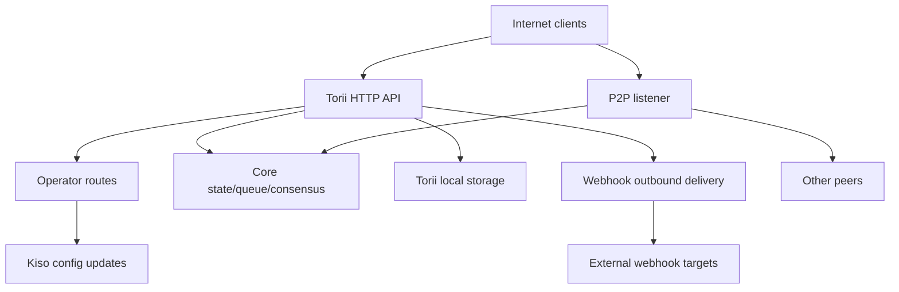

<!-- Auto-generated stub for Burmese (my) translation. Replace this content with the full translation. -->

---
lang: my
direction: ltr
source: iroha-threat-model.md
status: complete
generator: scripts/sync_docs_i18n.py
source_hash: 766928cf0dcbfe3513c728bcf0b9fa697a330e8000bc6944ab61e8fcd59751ad
source_last_modified: "2026-02-07T13:27:25.009145+00:00"
translation_last_reviewed: 2026-04-02
translator: machine-google-reviewed
---

#Iroha Threat Model (repo: `iroha`)

## အမှုဆောင်အနှစ်ချုပ်
အော်ပရေတာလမ်းကြောင်းများကို အများသူငှာအင်တာနက်မှ ရည်ရွယ်ချက်ရှိရှိရောက်ရှိနိုင်သော်လည်း တောင်းဆိုချက်လက်မှတ်များမှတစ်ဆင့် စစ်မှန်ကြောင်းအထောက်အထားပြရမည်ဖြစ်ပြီး၊ အများသူငှာ Torii အဆုံးအမှတ်တွင် webhooks/attachments ကိုဖွင့်ထားရာ ထိပ်တန်းအန္တရာယ်များမှာ- အော်ပရေတာ-လေယာဉ်အပေးအယူပြုလုပ်ခြင်း (အထောက်အထားမခိုင်လုံသောတောင်းဆိုချက် 7040X နှင့် ပြန်ဖွင့်၍မရသော အထောက်အထားများ70NI00X အခြားအော်ပရေတာလမ်းကြောင်းများ)၊ SSRF နှင့် webhook ပေးပို့ခြင်းမှတစ်ဆင့် ပြင်ပအလွဲသုံးစားလုပ်မှုများ၊ နှင့် နှုန်းထားကန့်သတ်ချက်များကို အခြေအနေအရ ပြဋ္ဌာန်းထားသည့် အရောင်းအ၀ယ်/မေးမြန်းမှု + ထုတ်လွှင့်မှုအဆုံးမှတ်များမှတစ်ဆင့် မြင့်မားသောအသုံးအနှုန်း DoS၊ ထို့အပြင် Torii သည် Torii ၏ပါဝင်မှုကို မှီခိုအားထားရသည့် မည်သည့် "mTLS လိုအပ်သည်" ကိုယ်ဟန်အနေအထားသည် အတုအယောင်ဖြစ်နိုင်သည်။ အထောက်အထား- `crates/iroha_torii/src/lib.rs` (router +middleware + operator routes), `crates/iroha_torii/src/operator_auth.rs` (operator auth enable/disable + `x-forwarded-client-cert` check), `crates/iroha_torii/src/webhook.rs` (outbound HTTP client), Sumeragi (conditional rate)။

## နယ်ပယ်နှင့် ယူဆချက်နယ်ပယ်အတွင်း (runtime/ထုတ်လုပ်မှုမျက်နှာပြင်များ):
- Torii HTTP API ဆာဗာနှင့် အလယ်တန်းဆော့ဖ်ဝဲများဖြစ်သည့် "အော်ပရေတာ" လမ်းကြောင်းများ၊ အက်ပ် API၊ ဝဘ်ချိတ်များ၊ ပူးတွဲပါဖိုင်များ၊ အကြောင်းအရာနှင့် တိုက်ရိုက်ထုတ်လွှင့်ခြင်းဆိုင်ရာ အဆုံးမှတ်များ- `crates/iroha_torii/`၊ `crates/iroha_torii_shared/`
- Node bootstrap နှင့် အစိတ်အပိုင်းဝိုင်ယာကြိုးများ (Torii + P2P + state/queue/config update actor): `crates/irohad/src/main.rs`
- P2P သယ်ယူပို့ဆောင်ရေးနှင့် လက်ဆွဲ မျက်နှာပြင်များ- `crates/iroha_p2p/`
- ဖွဲ့စည်းမှုပုံသဏ္ဍာန်များနှင့် ပုံသေများ (အထူးသဖြင့် Torii စစ်မှန်သည့်ပုံသေများ)- `crates/iroha_config/src/parameters/{actual,defaults}.rs`
- Client-facing config update DTO (`/v1/configuration` သည် ပြောင်းလဲနိုင်သည်)- `crates/iroha_config/src/client_api.rs`
- အသုံးချထုပ်ပိုးမှုအခြေခံများ- `Dockerfile` နှင့် `defaults/` တွင် နမူနာပုံစံပြင်ဆင်မှုများ (ထုတ်လုပ်မှုတွင် ထည့်သွင်းထားသော ဥပမာသော့များကို အသုံးမပြုပါနှင့်)။

နယ်ပယ်ပြင်ပ (အတိအလင်း တောင်းဆိုထားခြင်းမရှိပါက-
- CI အလုပ်အသွားအလာများနှင့် အလိုအလျောက်ထုတ်လွှတ်မှု- `.github/`၊ `ci/`၊ `scripts/`
- မိုဘိုင်း/အသုံးပြုသူ SDK များနှင့် အက်ပ်များ- `IrohaSwift/`၊ `java/`၊ `examples/`
- စာရွက်စာတမ်းသီးသန့်ပစ္စည်း- `docs/`ရှင်းလင်းပြတ်သားသော ယူဆချက်များ (သင်၏ ရှင်းလင်းချက်အပေါ် အခြေခံသည်-
- Torii သည် အထောက်အထားမရှိသောဖောက်သည်များမှ အင်တာနက်ဖြင့် ထိတွေ့နိုင်သည် (အချို့သော အဆုံးအဖြတ်များသည် လက်မှတ်များ သို့မဟုတ် အခြားအထောက်အထားများ လိုအပ်နေသေးသည်)။
- အော်ပရေတာလမ်းကြောင်းများ (`/v1/configuration`၊ `/v1/nexus/lifecycle`၊ နှင့် အော်ပရေတာတံခါးပိတ်ထားသော တယ်လီမီတာ/ပရိုဖိုင်ကို ဖွင့်ထားသည့်အခါ) သည် အများသူငှာရောက်ရှိနိုင်စေရန် ရည်ရွယ်ပြီး အော်ပရေတာထိန်းချုပ်ထားသော သီးသန့်သော့မှ လက်မှတ်ဖြင့် စစ်မှန်ကြောင်းသက်သေပြသင့်သည်။ အထောက်အထား (လက်ရှိအခြေအနေ): `crates/iroha_torii/src/lib.rs` (`add_core_info_routes` အကျုံးဝင်သော `operator_layer`), `crates/iroha_torii/src/operator_auth.rs` (`enforce_operator_auth` / `authorize_operator_endpoint`)။
- အော်ပရေတာ၏ လက်မှတ်အတည်ပြုခြင်းအား ဖွဲ့စည်းမှုတွင် အော်ပရေတာ အများသူငှာသော့များ၏ node-local ခွင့်ပြုစာရင်းကို အသုံးပြုသင့်သည် (လက်ရှိ router တွင် အကောင်အထည်ဖော်နေသော အော်ပရေတာဂိတ်တစ်ခုအဖြစ် မပြပါ)။ လက်ရှိ အော်ပရေတာဂိတ်၏ အထောက်အထား- `crates/iroha_torii/src/operator_auth.rs` (`authorize_operator_endpoint`) နှင့် ရှိပြီးသား canonical တောင်းဆိုချက်လက်မှတ်ထိုးရေးအထောက်အကူ (မက်ဆေ့ချ်တည်ဆောက်မှု)- `crates/iroha_torii/src/app_auth.rs` (`canonical_request_message`)။
- Torii ကို ယုံကြည်စိတ်ချရသော ingress ၏နောက်ကွယ်တွင် သေချာပေါက်အသုံးပြုထားမည်မဟုတ်ပါ။ ထို့ကြောင့်၊ `x-forwarded-client-cert` ကဲ့သို့သော ခေါင်းစီးများကို Torii တိုက်ရိုက်ထိတွေ့သောအခါ တိုက်ခိုက်သူထိန်းချုပ်မှုအဖြစ် သဘောထားရပါမည်။ အထောက်အထား- `crates/iroha_torii/src/lib.rs` (`HEADER_MTLS_FORWARD`, `norito_rpc_mtls_present`) နှင့် `crates/iroha_torii/src/operator_auth.rs` (`HEADER_MTLS_FORWARD`, `mtls_present`)။
- Webhooks များနှင့် ပူးတွဲပါဖိုင်များကို အများသူငှာ Torii အဆုံးမှတ်တွင် ဖွင့်ထားသည်။ အထောက်အထား- `crates/iroha_torii/src/lib.rs` (`/v1/webhooks` နှင့် `/v1/zk/attachments`), `crates/iroha_torii/src/webhook.rs`, `crates/iroha_torii/src/zk_attachments.rs`။- အော်ပရေတာသည် `torii.require_api_token = false` ကို သတ်မှတ် သို့မဟုတ် သိမ်းထားနိုင်သည် (မူလသည် `false`)။ အထောက်အထား- `crates/iroha_config/src/parameters/defaults.rs` (`torii::REQUIRE_API_TOKEN`)။
- `/transaction` နှင့် `/query` တို့သည် အများသူငှာ ကွင်းဆက်တစ်ခုအတွက် လက်လှမ်းမီနိုင်မည်ဟု မျှော်လင့်ပါသည်။ မှတ်ချက်- ၎င်းတို့ကို “Norito-RPC” ဖြန့်ချိသည့်အဆင့်နှင့် ရွေးချယ်နိုင်သော “mTLS လိုအပ်သည်” ခေါင်းစီးပါဝင်မှုစစ်ဆေးခြင်းတို့ဖြင့် ထပ်လောင်းကြပ်ကြပ်ထားသည်။ အထောက်အထား- `crates/iroha_torii/src/lib.rs` (`ConnScheme::from_request`၊ `evaluate_norito_rpc_gate`) နှင့် `crates/iroha_config/src/parameters/defaults.rs` (`torii::transport::norito_rpc::STAGE = "disabled"`)။

စွန့်စားရမှုအဆင့်ကို ပြောင်းလဲစေမည့် အကြောင်းအရာများကို ဖွင့်ပါ-
- အော်ပရေတာ အများသူငှာသော့များကို မည်သည့်နေရာတွင် စီစဥ်ထားသနည်း (မည်သည့်သော့ပုံစံ/ပုံစံ) ကို မည်ကဲ့သို့သတ်မှတ်ထားသနည်း၊ သော့များကို မည်သို့ခွဲခြားသတ်မှတ်ထားသနည်း (သော့အိုင်ဒီ၊ အသက်ဝင်သောသော့အများအပြား၊ ရုတ်သိမ်းခြင်း)။
- အော်ပရေတာလက်မှတ်ထိုးသည့် မက်ဆေ့ချ်ဖော်မတ်နှင့် ပြန်ဖွင့်ခြင်းဆိုင်ရာ အတိအကျသည် အဘယ်နည်း (အချိန်တံဆိပ်တုံး/မဟုတ်သော/ကောင်တာ + ဆာဗာဘက်ပြန်ဖွင့်သည့် ကက်ရှ်) ဟူသည် အဘယ်နည်း၊ မည်သည့်နာရီမှလွဲချော်မှု မူဝါဒကို လက်ခံနိုင်သနည်း။ ရှိပြီးသား Canonical Request Helper သည် လတ်ဆတ်မှုမရှိကြောင်း အထောက်အထား- `crates/iroha_torii/src/app_auth.rs` (`canonical_request_message`)။
- အမည်မသိ webhooks များအတွက်၊ Torii သည် မတရားသောနေရာများကို ခွင့်ပြုရန် မျှော်လင့်ပါသလား သို့မဟုတ် ၎င်းသည် SSRF ဦးတည်ရာမူဝါဒကို ကျင့်သုံးသင့်သည် (RFC1918/localhost/link-local/metadata ကိုပိတ်ဆို့ပြီး HTTPS လိုအပ်သည်)။
- သင့်တည်ဆောက်မှုတွင် မည်သည့် Torii အင်္ဂါရပ်များကို ဖွင့်ထားသည် (`telemetry`၊ `profiling`၊ `p2p_ws`၊ `app_api_https`၊ Norito) ကို အသုံးပြုထားပြီး အကြောင်းအရာ 018X အထောက်အထား- `crates/iroha_torii/Cargo.toml` (`[features]`)။

## စနစ်ပုံစံ### အဓိက အစိတ်အပိုင်းများ
- **အင်တာနက်ဖောက်သည်များ** (ပိုက်ဆံအိတ်များ၊ အညွှန်းများ၊ စူးစမ်းလေ့လာသူများ၊ ဘော့တ်များ)- HTTP/Norito တောင်းဆိုမှုများကို ပေးပို့ပြီး WS/SSE ချိတ်ဆက်မှုများကို ဖွင့်ပါ။
- **Torii (HTTP API)**- ကြိုတင်စစ်ဆေးခြင်းအတွက် ကြိုတင်စစ်ဆေးခြင်းအတွက် အလယ်တန်းဆော့ဖ်ဝဲပါရှိသော axum router၊ ရွေးချယ်နိုင်သော API တိုကင်အာဏာတည်မှု၊ API ဗားရှင်းညှိနှိုင်းမှု၊ အဝေးထိန်းလိပ်စာထိုးခြင်းနှင့် မက်ထရစ်များ။ အထောက်အထား- `crates/iroha_torii/src/lib.rs` (`create_api_router`, `enforce_preauth`, `enforce_api_token`, `enforce_api_version`, `inject_remote_addr_header`)။
- **အော်ပရေတာ/စစ်ရေးထိန်းချုပ်ရေးလေယာဉ် (လက်ရှိ) နှင့် အလိုရှိသော ကိုယ်ဟန်အနေအထား**- အော်ပရေတာလမ်းကြောင်းများကို `operator_auth::enforce_operator_auth` (WebAuthn/tokens ဖြင့် လောလောဆယ်ကာကွယ်ထားပြီး၊ config ဖြင့် ထိထိရောက်ရောက်ပိတ်ထားနိုင်သည်)၊ သို့သော် သင်၏အသုံးချမှုလိုအပ်ချက်မှာ လက်မှတ်အခြေခံအော်ပရေတာစစ်မှန်ကြောင်းအထောက်အထားပြခြင်းကို ခွင့်ပြုထားသောအော်ပရေတာများ၏ အများသူငှာသော့များစာရင်းမှ အတည်ပြုထားသည်။ Canonical Request message helper တည်ရှိပြီး မက်ဆေ့ချ်တည်ဆောက်မှုအတွက် ပြန်လည်အသုံးပြုနိုင်သော်လည်း config keys (ကမ္ဘာ့နိုင်ငံပိုင်အကောင့်များမဟုတ်ပါ) အသုံးပြုရန်အတွက် အတည်ပြုခြင်းကို လိုက်လျောညီထွေဖြစ်စေရန် လိုအပ်ပါသည်။ အထောက်အထား- `crates/iroha_torii/src/lib.rs` (`add_core_info_routes` သည် `operator_layer`), `crates/iroha_torii/src/operator_auth.rs` (`authorize_operator_endpoint`), `crates/iroha_torii/src/app_auth.rs` (Sumeragi)။- **Core node အစိတ်အပိုင်းများ (လုပ်ငန်းစဉ်အတွင်း)**- ငွေပေးငွေယူတန်းစီ၊ ပြည်နယ်/WSV၊ အများဆန္ဒ (Sumeragi)၊ ပိတ်ဆို့သိုလှောင်မှု (Kura)၊ config update actor (Kiso) စသည်တို့သည် Torii သို့ ရောက်သွားပါသည်။ အထောက်အထား- `crates/irohad/src/main.rs` (`Torii::new_with_handle(...)` လက်ခံရရှိသည် `queue`၊ `state`၊ `kura`၊ `kiso`၊ `state`၊ စတင်သည် `torii.start(...)`)။
- **P2P ကွန်ရက်**- ကုဒ်ဝှက်ထားသော၊ ဘောင်ခတ်ထားသော သက်တူရွယ်တူအချင်းချင်း သယ်ယူပို့ဆောင်ရေးနှင့် လက်ဆွဲနှုတ်ဆက်ခြင်း။ ရွေးချယ်နိုင်သော TLS-over-TCP ရှိသည်၊ သို့သော် လက်မှတ်စစ်ခြင်းအတွက် ရည်ရွယ်ချက်ရှိရှိ ခွင့်ပြုထားသည်။ အထောက်အထား- `crates/iroha_p2p/src/lib.rs` (အမျိုးအစား alias `NetworkHandle<..., X25519Sha256, ChaCha20Poly1305>`), `crates/iroha_p2p/src/transport.rs` (`p2p_tls` မော်ဂျူး `NoCertificateVerification`)။
- **Torii ဒေသခံမြဲမြံမှု**: `./storage/torii` ပူးတွဲပါဖိုင်များ/webhooks/တန်းစီများအတွက် မူရင်းအခြေခံ dir။ အထောက်အထား- `crates/iroha_config/src/parameters/defaults.rs` (`torii::data_dir()`), `crates/iroha_torii/src/webhook.rs` (ဆက်လက်တည်ရှိနေသော `webhooks.json`), `crates/iroha_torii/src/zk_attachments.rs` (`./storage/torii/zk_attachments/`) အောက်တွင် သိမ်းဆည်းထားသည်။
- **အပြင်ထွက် webhook ပစ်မှတ်များ**- Torii သည် ဖြစ်ရပ်များကို မထင်သလို `http://` URLs (နှင့် `https://`/`ws(s)://` တွင်သာ အင်္ဂါရပ်များ) ပေးပို့နိုင်ပါသည်။ အထောက်အထား- `crates/iroha_torii/src/webhook.rs` (`http_post_plain`, `http_post_https`, `ws_send`)။### ဒေတာစီးဆင်းမှုနှင့် ယုံကြည်မှု နယ်နိမိတ်များ
- အင်တာနက်လိုင်း → Torii HTTP API
  - ဒေတာ- Norito binary (`SignedTransaction`, `SignedQuery`), JSON DTOs (app API), WS/SSE စာရင်းသွင်းမှုများ၊ ခေါင်းစီးများ (`x-api-token` အပါအဝင်)။
  - ချန်နယ်- HTTP/1.1 + WebSocket + SSE (axum)။
  - အာမခံချက်များ- ရွေးချယ်နိုင်သော API တိုကင် (`torii.require_api_token`)၊ ကြိုတင်စစ်ဆေးခြင်းချိတ်ဆက်မှု/နှုန်းထားသတ်မှတ်မှု၊ API ဗားရှင်းညှိနှိုင်းမှု။ ကိုင်တွယ်သူအများအပြားသည် per-endpoint နှုန်းကန့်သတ်ချက်ကို အခြေအနေအရ အသုံးပြုသည် (`enforce=false` တွင် ကျော်ဖြတ်နိုင်သည်)။ အထောက်အထား- `crates/iroha_torii/src/lib.rs` (`enforce_preauth`, `validate_api_token`, `handler_post_transaction`, `handler_signed_query`), `crates/iroha_torii/src/limits.rs` (Sumeragi)။
  - မှန်ကန်ကြောင်း အတည်ပြုခြင်း- အချို့သော အဆုံးမှတ်များ (ဥပမာ၊ ငွေပေးငွေယူများ)၊ Norito ကုဒ်ဆွဲခြင်း၊ အချို့သောအက်ပ်အဆုံးမှတ်များအတွက် လက်မှတ်ထိုးတောင်းဆိုခြင်း (canonical တောင်းဆိုချက်ခေါင်းစီးများ)။ အထောက်အထား- `crates/iroha_torii/src/lib.rs` (`add_transaction_routes` သည် `DefaultBodyLimit::max(...)`), `crates/iroha_torii/src/app_auth.rs` (`verify_canonical_request`) ကို အသုံးပြုသည်။- အင်တာနက်လိုင်း → “အော်ပရေတာ” လမ်းကြောင်းများ (Torii)
  - ဒေတာ- config အပ်ဒိတ်များ (`ConfigUpdateDTO`)၊ လမ်းသွားဘဝသံသရာအစီအစဉ်များ၊ တယ်လီမီတာ/ဒီဘာဂ်/အခြေအနေ/မက်ထရစ်များ (ဖွင့်ထားသောအခါ)။
  - ချန်နယ်- HTTP။
  - အာမခံချက်များ- လက်ရှိ repo သည် `torii.operator_auth.enabled=false` တွင် ထိထိရောက်ရောက် no-op ဖြစ်သည့် `torii.operator_auth.enabled=false` ဖြင့် ဤလမ်းကြောင်းများကို ဂိတ်ပေါက်ပေးပါသည်။ သင်အလိုရှိသောကိုယ်ဟန်အနေအထားသည် config မှအော်ပရေတာအများပြည်သူသော့များကိုအသုံးပြု၍ လက်မှတ်အခြေခံစစ်မှန်ကြောင်းအထောက်အထားပြခြင်းဖြစ်သည် အထောက်အထား- `crates/iroha_torii/src/lib.rs` (`add_core_info_routes` အကျုံးဝင်သော `operator_layer`), `crates/iroha_torii/src/operator_auth.rs` (`authorize_operator_endpoint`, `mtls_present`)။
  - မှန်ကန်မှု- အများအားဖြင့် DTO ခွဲခြမ်းစိတ်ဖြာခြင်း၊ `handle_post_configuration` တွင် လျှို့ဝှက်စာဝှက်ခွင့်ပြုချက်မရှိပါ (၎င်းသည် `kiso.update_with_dto` သို့လွှဲအပ်သည်)။ အထောက်အထား- `crates/iroha_torii/src/routing.rs` (`handle_post_configuration`)။

- Torii → Core တန်းစီခြင်း/ပြည်နယ်/သဘောတူညီချက် (လုပ်ငန်းစဉ်အတွင်း)
  - ဒေတာ- ငွေပေးငွေယူတင်ပြမှုများ၊ မေးမြန်းမှုလုပ်ဆောင်မှု၊ ပြည်နယ်ဖတ်ရှုခြင်း/ရေးသားမှုများ၊ အများသဘောတူ တယ်လီမီတာမေးမြန်းမှုများ။
  - ချန်နယ်- လုပ်ငန်းစဉ်အတွင်း Rust ခေါ်ဆိုမှုများ (မျှဝေထားသော `Arc` လက်ကိုင်များ)။
  - အာမခံချက်များ- ယုံကြည်စိတ်ချရသော နယ်နိမိတ်၊ လုံခြုံရေးသည် အခွင့်ထူးခံ လုပ်ဆောင်ချက်များကို မတောင်းဆိုမီ Torii တွင် မှန်ကန်စွာ စစ်မှန်ကြောင်း အထောက်အထားပြခြင်း/ခွင့်ပြုခြင်းအပေါ် မူတည်ပါသည်။ အထောက်အထား- `crates/irohad/src/main.rs` (`Torii::new_with_handle(...)` ဝိုင်ယာကြိုး) နှင့် Torii ကိုင်ဆောင်သူများသည် `routing::handle_*` ကိုခေါ်ဆိုသည်။- Torii → Kiso (ပြင်ဆင်မှု အပ်ဒိတ်သရုပ်ဆောင်)
  - ဒေတာ- `ConfigUpdateDTO` သည် မှတ်တမ်းသွင်းခြင်း၊ P2P ACL၊ ကွန်ရက်/သယ်ယူပို့ဆောင်ရေး ဆက်တင်များ၊ SoraNet လက်ဆွဲနှုတ်ဆက်ခြင်း စသည်ဖြင့် ပြင်ဆင်နိုင်သည်။
  - ချန်နယ်- လုပ်ငန်းစဉ်အတွင်း မက်ဆေ့ဂျ်/ကိုင်တွယ်။
  - အာမခံချက်များ- Torii နယ်နိမိတ်တွင် ခွင့်ပြုချက်ရရှိရန် မျှော်လင့်ပါသည်။ update DTO ကိုယ်တိုင်က စွမ်းဆောင်ရည်-ဘက်တွင်ရှိသည်။ အထောက်အထား- `crates/iroha_config/src/client_api.rs` (`ConfigUpdateDTO` အကွက်များ `network_acl`၊ `transport.norito_rpc`၊ `soranet_handshake` စသည်ဖြင့်)။

- Torii → Local disk (`./storage/torii`)
  - ဒေတာ- webhook မှတ်ပုံတင်ခြင်းနှင့် တန်းစီထားသော ပေးပို့မှုများ၊ ပူးတွဲပါဖိုင်များနှင့် သန့်စင်ဆေး မက်တာဒေတာ၊ GC/TTL အပြုအမူ။
  - ချန်နယ်- ဖိုင်စနစ်။
  - အာမခံချက်များ- ဒေသန္တရ OS ခွင့်ပြုချက်များ (Dockerfile တွင် root မဟုတ်သောကွန်တိန်နာအဖြစ်လုပ်ဆောင်သည်); “အိမ်ငှား” မှ ယုတ္တိနည်းဖြင့် သီးခြားခွဲထုတ်ခြင်းသည် အလယ်တန်းဝဲမှ ထိုးသွင်းထားသော API တိုကင် သို့မဟုတ် အဝေးထိန်း IP ခေါင်းစီးအပေါ် အခြေခံသည်။ အထောက်အထား- `Dockerfile` (`USER iroha`), `crates/iroha_torii/src/lib.rs` (`inject_remote_addr_header`, `zk_attachments_tenant`)။

- Torii → Webhook ပစ်မှတ်များ (အထွက်)
  - ဒေတာ- ပွဲခပေးချေမှုများ + လက်မှတ် ခေါင်းစီး။
  - ချန်နယ်- `http://` အတွက် TCP HTTP ဖောက်သည် ကုန်ကြမ်း။ ဖွင့်ထားသောအခါတွင် `https://` အတွက် ရွေးချယ်နိုင်သော `hyper+rustls` ဖွင့်ထားသည့်အခါ ရွေးချယ်နိုင်သော WS/WSS။
  - အာမခံချက်များ- အချိန်ကုန်ခြင်း/ ထပ်စမ်းခြင်းများ။ ကုဒ်တွင် ဦးတည်ရာခွင့်ပြုစာရင်းကို မမြင်နိုင်ပါ။ webhook CRUD ကိုဖွင့်ထားလျှင် URL သည် တိုက်ခိုက်သူအပေါ် လွှမ်းမိုးထားသည်။ အထောက်အထား- `crates/iroha_torii/src/webhook.rs` (`handle_create_webhook`၊ `http_post_plain/http_post`)။- P2P ရွယ်တူများ (မယုံကြည်ရသော ကွန်ရက်) → P2P သယ်ယူပို့ဆောင်ရေး/လက်ဆွဲနှုတ်ဆက်ခြင်း။
  - ဒေတာ- လက်ဆွဲနှုတ်ဆက်ခြင်း ရှေ့မျက်နှာစာ/ မက်တာဒေတာ၊ ဘောင်ခတ်ထားသော ကုဒ်ဝှက်ထားသော စာတိုများ၊ အများဆန္ဒ မက်ဆေ့ချ်များ။
  - ချန်နယ်- P2P သယ်ယူပို့ဆောင်ရေး (TCP/QUIC/etc၊ အင်္ဂါရပ်အပေါ် မူတည်သော)၊ ကုဒ်ဝှက်ထားသော ပေးဆောင်မှုများ၊ ရွေးချယ်နိုင်သော TLS-over-TCP သည် အသိအမှတ်ပြုလက်မှတ်စစ်ဆေးခြင်းတွင် အတိအလင်းခွင့်ပြုထားသည်။
  - အာမခံချက်များ- အပလီကေးရှင်းအလွှာတွင် ကုဒ်ဝှက်ခြင်းနှင့် လက်မှတ်ရေးထိုးထားသော လက်ဆွဲနှုတ်ဆက်ခြင်း။ သယ်ယူပို့ဆောင်ရေးအလွှာ TLS သည် လက်မှတ်ဖြင့် စစ်မှန်ကြောင်း မဖော်ပြပါ။ အထောက်အထား- `crates/iroha_p2p/src/lib.rs` (ကုဒ်ဝှက်ခြင်းအမျိုးအစားများ)၊ `crates/iroha_p2p/src/transport.rs` (`NoCertificateVerification` မှတ်ချက်နှင့် အကောင်အထည်ဖော်မှု)။

#### ပုံကြမ်း

## ပိုင်ဆိုင်မှုများနှင့် လုံခြုံရေး ရည်မှန်းချက်များ| ပိုင်ဆိုင်မှု | အဘယ်ကြောင့်အရေးကြီးသနည်း။ လုံခြုံရေးရည်မှန်းချက် (C/I/A) |
|---|---|---|
| ကွင်းဆက် / WSV / လုပ်ကွက် | သမာဓိပျက်ကွက်မှုများသည် အများသဘောတူ ကျရှုံးမှုများဖြစ်လာသည်။ ရရှိနိုင်မှု ပျက်ကွက်မှုများ ကွင်းဆက် | I/A |
| အများသဘောတူ အသက်ရှင်ခြင်း (Sumeragi) | အများသူငှာ blockchain တန်ဖိုးသည် စဉ်ဆက်မပြတ် လုပ်ကွက်ထုတ်လုပ်မှု | A|
| Node သီးသန့်သော့များ (ရွယ်တူအထောက်အထား၊ လက်မှတ်ထိုးသော့များ) | သော့အပေးအယူလုပ်ခြင်းသည် မည်သူမည်ဝါဖြစ်ကြောင်း လွှဲပြောင်းခြင်း၊ အလွဲသုံးစားပြုခြင်း လက်မှတ်ထိုးခြင်း သို့မဟုတ် ကွန်ရက်အပိုင်းခွဲခြင်း | C/I |
| Runtime ဖွဲ့စည်းမှု (Kiso-updated) | ကွန်ရက် ACL များနှင့် သယ်ယူပို့ဆောင်ရေး ဆက်တင်များကို ထိန်းချုပ်သည်။ အလွဲသုံးစားလုပ်ခြင်းသည် အကာအကွယ်များကို ပိတ်နိုင်သည် သို့မဟုတ် အန္တရာယ်ရှိသောရွယ်တူများ | ငါ |
| ငွေသွင်းငွေထုတ်တန်းစီ / mempool | ရေကြီးခြင်းသည် အများဆန္ဒကို ငတ်မွတ်စေပြီး CPU/memory | A|
| Torii စွဲမြဲစွာ (`./storage/torii`) | Disk ကုန်ဆုံးခြင်းသည် node ကို ပျက်စီးစေနိုင်သည်။ သိမ်းဆည်းထားသော ဒေတာသည် ရေစုန်အောက်ပိုင်း လုပ်ဆောင်ခြင်းကို လွှမ်းမိုးနိုင်သည် | A (နှင့် တစ်ခါတစ်ရံ C/I) |
| Outbound webhook ချန်နယ် | SSRF အတွက် အလွဲသုံးစားလုပ်ခြင်း၊ အတွင်းကွန်ရက်များမှ ဒေတာထုတ်ယူခြင်း သို့မဟုတ် ယုံကြည်စိတ်ချရသော egress IP မှ စကင်န်ဖတ်ခြင်း | C/I/A |
| Telemetry/metrics/debug data | ပစ်မှတ်ထားတိုက်ခိုက်ခြင်း | ဂ|

## တိုက်ခိုက်သူ မော်ဒယ်### စွမ်းဆောင်ရည်
- အဝေးထိန်း၊ အထောက်အထားမရှိသော အင်တာနက် တိုက်ခိုက်သူသည် မတရား HTTP တောင်းဆိုချက်များကို ပေးပို့နိုင်သည်၊ ကြာရှည်သော WS/SSE ချိတ်ဆက်မှုများကို ထိန်းထားနိုင်ပြီး ပြန်ဖွင့်ခြင်း သို့မဟုတ် ဖြန်းပေးသော payloads (botnet) တို့ကို ပေးပို့နိုင်သည်။
- မည်သည့်ပါတီမဆို သော့များထုတ်လုပ်နိုင်ပြီး ပမာဏများသောစပမ်းများအပါအဝင် လက်မှတ်ရေးထိုးထားသော ငွေပေးငွေယူ/မေးမြန်းချက် (အများပြည်သူဆိုင်ရာ blockchain) ကို တင်သွင်းနိုင်သည်။
- အန္တရာယ်ရှိသော/အပေးအယူလုပ်သောရွယ်တူများသည် P2P သို့ ချိတ်ဆက်နိုင်ပြီး ခွင့်ပြုထားသောကန့်သတ်ချက်များအတွင်း အလွဲသုံးစားလုပ်မှု၊ ရေလွှမ်းမိုးမှု သို့မဟုတ် လက်ဆွဲနှုတ်ဆက်ရန် ကြိုးပမ်းနိုင်သည်။
- webhook CRUD ကို ထင်ရှားပါက၊ တိုက်ခိုက်သူသည် တိုက်ခိုက်သူ-ထိန်းချုပ်ထားသော webhook URL များကို စာရင်းသွင်းနိုင်ပြီး အပြင်ထွက်ခေါ်ဆိုမှုများကို လက်ခံနိုင်သည် (၎င်းတို့ကို အတွင်းပိုင်းနေရာများသို့ ပို့ဆောင်နိုင်သည်)။

### မစွမ်းဆောင်နိုင်ပါ။
- တိုက်ရိုက်ဒေသခံ ဖိုင်စနစ်သို့ ဝင်ရောက်ခွင့်မရှိခြင်းသည် ဖော်ထုတ်ထားသော အဆုံးမှတ် သို့မဟုတ် မှားယွင်းသတ်မှတ်ထားသော အသံအတိုးအကျယ် ခွင့်ပြုချက်များ မရှိပါ။
- သော့အပေးအယူမရှိဘဲ ရှိပြီးသားရွယ်တူချင်း/အော်ပရေတာကီးများအတွက် လက်မှတ်များကို အတုလုပ်နိုင်စွမ်းမရှိပါ။
- ပုံမှန်အခြေအနေများအောက်တွင် ခေတ်မီ cryptography (X25519၊ ChaCha20-Poly1305၊ Ed25519) ကို ချိုးဖျက်နိုင်သည်ဟု ယူဆနိုင်မှု မရှိပါ။

## ဝင်ခွင့်အမှတ်များနှင့် တိုက်ခိုက်ရပါသေးတယ်။| မျက်နှာပြင် | ဘယ်လိုရောက်နေပြီ | နယ်နိမိတ်|ယုံကြည်မှု မှတ်စုများ | အထောက်အထား (repo လမ်းကြောင်း / သင်္ကေတ) |
|---|---|---|---|---|
| `POST /transaction` | အင်တာနက် HTTP | အင်တာနက် → Torii | Norito binary လက်မှတ်ရေးထိုးထားသော ငွေပေးငွေယူ၊ နှုန်းထားကန့်သတ်ချက်သည် အခြေအနေအရဖြစ်သည် (`enforce` မှားနိုင်သည်) | `crates/iroha_torii/src/lib.rs` (`handler_post_transaction`, `ConnScheme::from_request`) |
| `POST /query` | အင်တာနက် HTTP | အင်တာနက် → Torii | Norito binary လက်မှတ်ထိုးမေးမြန်းချက် နှုန်းကန့်သတ်ချက်သည် အခြေအနေအရဖြစ်သည် (`enforce` သည် မှားယွင်းနိုင်သည်) | `crates/iroha_torii/src/lib.rs` (`handler_signed_query`) |
| Norito-RPC ဂိတ် | အင်တာနက် HTTP ခေါင်းစီးများ | အင်တာနက် → Torii | စတင်ထုတ်သည့်အဆင့် + ချန်လှပ်ထားသော “mTLS လိုအပ်သည်” ဟူသော ခေါင်းစီးပါဝင်မှုမှတစ်ဆင့်၊ Canary `x-api-token` | ကိုအသုံးပြုသည်။ `crates/iroha_torii/src/lib.rs` (`evaluate_norito_rpc_gate`, `HEADER_MTLS_FORWARD`) |
| `POST/GET/DELETE /v1/webhooks...` | အင်တာနက် HTTP (app API) | အင်တာနက် → Torii → အပြင်ထွက် | ဒီဇိုင်းအားဖြင့် အမည်မသိ၊ webhook CRUD သည် အများသူငှာ URL များဆီသို့ ပြင်ပသို့ ပို့ဆောင်မှုကို လုပ်ဆောင်ပေးသည်။ SSRF အန္တရာယ် | `crates/iroha_torii/src/lib.rs` (`handler_webhooks_*`), `crates/iroha_torii/src/webhook.rs` (`http_post`) |
| `POST/GET /v1/zk/attachments...` | အင်တာနက် HTTP (app API) | အင်တာနက် → Torii → ဒစ်ခ် | ဒီဇိုင်းအားဖြင့် အမည်မသိ၊ attachment sanitizer + decompression + persistence; ဒစ်ခ်/CPU ကုန်ခန်းသည့် မျက်နှာပြင် (ငှားရမ်းခြင်းမှာ API-တိုကင်ကို ဖွင့်ထားလျှင်၊ အခြားအဝေးထိန်း IP ကို ​​ထိုးသွင်းထားသော ခေါင်းစီးမှတစ်ဆင့်) | `crates/iroha_torii/src/lib.rs` (`handler_zk_attachments_*`, `zk_attachments_tenant`), `crates/iroha_torii/src/zk_attachments.rs` || `GET /v1/content/{bundle}/{path...}` | အင်တာနက် HTTP | အင်တာနက် → Torii → အခြေအနေ/သိုလှောင်မှု | auth modes + PoW + Range ကို ပံ့ပိုးသည် ။ egress limiter | `crates/iroha_torii/src/content.rs` (`handle_get_content`, `enforce_pow`, `enforce_auth`) |
| ထုတ်လွှင့်မှု- `/v1/events/sse`, `/events` (WS), `/block/stream` (WS) | အင်တာနက် | အင်တာနက် → Torii | ရှည်လျားသောချိတ်ဆက်မှုများ; DoS မျက်နှာပြင် | `crates/iroha_torii/src/lib.rs` (`add_network_stream_routes`) |
| `GET/POST /v1/configuration` | အင်တာနက် HTTP | အင်တာနက် → အော်ပရေတာ လမ်းကြောင်းများ → Kiso | အသုံးချရန် ရည်ရွယ်ချက်- အော်ပရေတာများ၏ လက်မှတ်များကို config allowlist keys များနှင့် ဆန့်ကျင်ပြီး၊ လက်ရှိ repo သည် ၎င်းအား operator middleware (လမ်းကြောင်းအုပ်စုတွင် ပြသထားသော လက်မှတ်ဂိတ်မရှိ) ဖြင့်သာ ကာကွယ်ပေးပြီး ကိုယ်စားလှယ်များသည် အပလီကေးရှင်းကို Kiso | `crates/iroha_torii/src/lib.rs` (`add_core_info_routes`, `handler_post_configuration`), `crates/iroha_torii/src/operator_auth.rs` (`enforce_operator_auth`), `crates/iroha_torii/src/routing.rs` (`handle_post_configuration`), canonical request signing helper)|
| `POST /v1/nexus/lifecycle` | အင်တာနက် HTTP | အင်တာနက် → အော်ပရေတာ လမ်းကြောင်းများ → အူတိုင် | အော်ပရေတာအဆုံးမှတ်ကို လက်မှတ်-စစ်မှန်ကြောင်းအထောက်အထားပြရန် ရည်ရွယ်သည်၊ အော်ပရေတာ မစ်ဒဲလ်ဝဲလ်က လက်ရှိတွင် စောင့်ကြပ်ထားပြီး အော်ပရေတာ auth ကို ပိတ်ထားပါက | `crates/iroha_torii/src/lib.rs` (`add_core_info_routes`, `handler_post_nexus_lane_lifecycle`), `crates/iroha_torii/src/operator_auth.rs` (`authorize_operator_endpoint`) || Telemetry/profiling endpoints (feature-gated) | အင်တာနက် HTTP | အင်တာနက် → အော်ပရေတာ လမ်းကြောင်းများ | အော်ပရေတာ-တံခါးပိတ်လမ်းကြောင်းအုပ်စုများ; အော်ပရေတာ auth ကိုပိတ်ထားပြီး လက်မှတ်ဂိတ်မရှိပါက၊ ၎င်းတို့သည် အများသူငှာဖြစ်လာပြီး လုပ်ငန်းလည်ပတ်မှုဒေတာပေါက်ကြားနိုင်သည် သို့မဟုတ် DoS vector များဖြစ်နိုင်သည် | `crates/iroha_torii/src/lib.rs` (`add_telemetry_routes`, `add_profiling_routes`), `crates/iroha_torii/src/operator_auth.rs` (`authorize_operator_endpoint`) |
| P2P TCP/TLS သယ်ယူပို့ဆောင်မှု | အင်တာနက် / သက်တူရွယ်တူကွန်ရက် | အင်တာနက်/ရွယ်တူများ → P2P | ကုဒ်ဝှက်ထားသော P2P ဘောင်များ + လက်ဆွဲနှုတ်ဆက်ခြင်း၊ TLS လက်မှတ်အတည်ပြုခြင်းကို ဖွင့်ထားသောအခါ ခွင့်ပြုပါသည်။ `crates/iroha_p2p/src/lib.rs` (`NetworkHandle`), `crates/iroha_p2p/src/transport.rs` (`p2p_tls::NoCertificateVerification`) |

## ထိပ်တန်းအလွဲသုံးစားလုပ်သည့်လမ်းကြောင်းများ

1. ** Attacker ပန်းတိုင်- runtime config updates များမှတစ်ဆင့် node အပြုအမူကို ရယူပါ**
   1) အော်ပရေတာလမ်းကြောင်းများထံရောက်ရှိနိုင်ပြီး အော်ပရေတာအထောက်အထားစိစစ်ခြင်း ပျက်ကွက်/ ကျော်လွှားနိုင်သောအင်တာနက်-ထိတွေ့နိုင်သော Torii ကိုရှာပါ (ဥပမာ၊ အော်ပရေတာစစ်မှန်ကြောင်းပိတ်ထားပြီး လက်မှတ်ဂိတ်မရှိ) ကိုရှာပါ။  
   2) `POST /v1/configuration` သည် ကွန်ရက် ACL များကို ဖြေလျှော့ပေးသည့် သို့မဟုတ် သယ်ယူပို့ဆောင်ရေး ဆက်တင်များကို ပြောင်းလဲပေးသည့် `ConfigUpdateDTO` ပါရှိသည်။  
   3) သက်တူရွယ်တူတစ်ဦးအဖြစ် ပူးပေါင်းပါ သို့မဟုတ် အပိုင်းခွဲမှု/ဖွဲ့စည်းပုံ မှားယွင်းစေခြင်း၊ တိုက်ခိုက်သူထိန်းချုပ်ထားသော အခြေခံအဆောက်အဦများမှတဆင့် အများသဘောတူချက်နှင့်/သို့မဟုတ် လမ်းကြောင်းလွှဲပြောင်းမှုများကို လျှော့ချပါ။  
   ထိခိုက်မှု- node ၏ သမာဓိနှင့် ရရှိနိုင်မှု အပေးအယူ (ကွန်ရက် ဖြစ်နိုင်ချေ)။2. **တိုက်ခိုက်သူပန်းတိုင်- ဖမ်းထားသောအော်ပရေတာမှ လက်မှတ်ရေးထိုးထားသော တောင်းဆိုချက်ကို ပြန်ဖွင့်ပါ**
   1) တရားဝင်လက်မှတ်ရေးထိုးထားသော အော်ပရေတာတောင်းဆိုချက်တစ်ခုရယူပါ (ဥပမာ၊ အပေးအယူခံရသော အော်ပရေတာစက်၊ ပုံစံမမှန်သော ပရောက်စီမှတ်တမ်းများ၊ သို့မဟုတ် TLS ကို ဘေးကင်းစွာ ရပ်စဲထားသည့် ပတ်ဝန်းကျင်တစ်ခု) ရယူပါ။  
   2) လက်မှတ်အစီအစဉ်တွင် လတ်ဆတ်မှု (အချိန်တံဆိပ်တုံး/မဟုတ်) နှင့် ဆာဗာဖက်မှ ပြန်လည်ပြသခြင်းကို ငြင်းပယ်ပါက တူညီသောတောင်းဆိုချက်ကို ပြန်ဖွင့်ပါ။  
   3) ရရှိနိုင်မှုအား ကျဆင်းစေသော သို့မဟုတ် ကာကွယ်ရေးများ အားနည်းသွားစေသည့် ထပ်ခါတလဲလဲ ဖွဲ့စည်းမှုပုံစံပြောင်းလဲမှုများ၊ နောက်ပြန်လှည့်မှုများ သို့မဟုတ် အတင်းအကျပ်ခလုတ်များကို ဖြစ်စေသည်။  
   သက်ရောက်မှု- "လက်မှတ်စစ်ခြင်း" လင့်ကစား ခိုင်မာမှု/ရရှိနိုင်မှု အလျှော့အတင်း။  

3. **တိုက်ခိုက်သူပန်းတိုင်- Norito-RPC စတင်ထွက်ခြင်း** ကိုပြောင်းလဲခြင်းဖြင့် တံခါးပိတ်/တံခါးကာကွယ်မှုများကို ပိတ်ပါ။
   1) `POST /v1/configuration` ကို အပ်ဒိတ်လုပ်ရန် `transport.norito_rpc.stage` သို့မဟုတ် `require_mtls`။  
   2) ရရှိနိုင်မှုနှင့် ဝင်ခွင့်ထိန်းချုပ်မှုများကို သက်ရောက်မှုရှိသော `/transaction` နှင့် `/query` အား အတင်းဖွင့်ခြင်း သို့မဟုတ် အတင်းပိတ်ခြင်း။  
   သက်ရောက်မှု- ပစ်မှတ်ထားသော ပြတ်တောက်မှု သို့မဟုတ် ဝင်ခွင့်ထိန်းချုပ်မှု ရှောင်ကွင်း။4. **တိုက်ခိုက်သူပန်းတိုင်- SSRF အော်ပရေတာ၏အတွင်းပိုင်းကွန်ရက်သို့**
   1) `POST /v1/webhooks` မှတဆင့် အတွင်းပိုင်းဦးတည်ချက် (ဥပမာ၊ RFC1918 လက်ခံသူ၊ မက်တာဒေတာ IP၊ ထိန်းချုပ်မှုလေယာဉ်) ကို ညွှန်ပြသော webhook entry တစ်ခုကို ဖန်တီးပါ။  
   2) ကိုက်ညီသောဖြစ်ရပ်များကိုစောင့်ပါ။ Torii သည် ၎င်း၏ ကွန်ရက် အနေအထားမှ ပြင်ပ HTTP တောင်းဆိုမှုများကို ပေးပို့သည်။  
   3) တုံ့ပြန်မှုများ/အခြေအနေများ/အချိန်ဇယားကို အသုံးပြုပြီး အတွင်းပိုင်းဝန်ဆောင်မှုများကို စုံစမ်းစစ်ဆေးရန် ထပ်ခါတလဲလဲ ကြိုးစားပါ (နှင့် တုံ့ပြန်မှုအကြောင်းအရာသည် အခြားနေရာများတွင် အမြဲပေါ်နေပါက ဖယ်ရှားပစ်နိုင်သည်)။  
   ထိခိုက်မှု- ကွန်ရက်အတွင်း ထိတွေ့မှု၊ ဘေးတိုက်ရွေ့လျားမှု ငြမ်းဆင်မှု၊ ဂုဏ်သိက္ခာပိုင်း ထိခိုက်မှု၊ မက်တာဒေတာ အဆုံးမှတ်များမှတစ်ဆင့် ဖြစ်နိုင်ခြေရှိသော ယုံကြည်စိတ်ချရသော ထိတွေ့မှု။  

5. **တိုက်ခိုက်သူ၏ပန်းတိုင်- ငွေပေးငွေယူဝန်ဆောင်မှု/စုံစမ်းမေးမြန်းခွင့်ကို ငြင်းပယ်ခြင်း**
   1) `POST /transaction` နှင့် `POST /query` အကျုံးဝင်/မမှန်ကန်သော Norito ကောင်များ။  
   2) WS/SSE စာရင်းသွင်းမှုများနှင့် နှေးကွေးသော client အများအပြားကို ထိန်းသိမ်းပါ။  
   3) အဟန့်အတားမဖြစ်စေရန် ပုံမှန်လည်ပတ်မှုတွင် အခြေအနေဆိုင်ရာနှုန်းကန့်သတ်ချက် (`enforce=false`) ကို အသုံးချပါ။  
   သက်ရောက်မှု- CPU/memory ကုန်ဆုံးခြင်း၊ တန်းစီခြင်း ပြည့်ဝခြင်း၊ အများသဘောတူဆိုင်များ။  

6. **တိုက်ခိုက်သူပန်းတိုင်- ပူးတွဲပါဖိုင်များမှတစ်ဆင့် Exhaust disk**
   1) ချဲ့ထွင်မှုကန့်သတ်ချက်များအနီးတွင် အမြင့်ဆုံးအရွယ်အစား ပေးဆောင်မှုများနှင့်/သို့မဟုတ် ချုံ့ထားသော မော်ကွန်းတိုက်များပါရှိသော ရေလွှမ်းမိုးမှု `/v1/zk/attachments`။  
   2) အိမ်ငှားတစ်ဦးချင်း ထုပ်ခြင်းကို ရှောင်ရှားရန် အရင်းအမြစ် IP အများအပြား (သို့မဟုတ် အိမ်ငှားသော့ခတ်ခြင်း အားနည်းခြင်း) ကို အသုံးပြုပါ။  
   3) TTL/GC နောက်ကျသည်အထိ ဆက်လက်လုပ်ဆောင်ပါ။ `./storage/torii` ကိုဖြည့်ပါ။  
   ထိခိုက်မှု- node ပျက်ခြင်း၊ ပိတ်ဆို့ခြင်း/ငွေလွှဲခြင်းများကို လုပ်ဆောင်နိုင်ခြင်း မရှိခြင်း။7. **တိုက်ခိုက်သူပန်းတိုင်- Torii ကို တိုက်ရိုက်ထိတွေ့သောအခါ “mTLS လိုအပ်သည်” ဂိတ်များကို ကျော်ဖြတ်ပါ**
   1) အော်ပရေတာသည် Norito-RPC သို့မဟုတ် အော်ပရေတာ auth အတွက် `require_mtls` ကို ဖွင့်ပေးသည်။  
   2) Attacker သည် `x-forwarded-client-cert: <anything>` ဖြင့် တောင်းဆိုချက်များ ပေးပို့သည်။  
   3) header-presence check သည် ယုံကြည်စိတ်ချရသော ingress မှ header ကို ဖယ်ရှားခြင်းမရှိပါက ဖြတ်သွားပါသည်။  
   ထိခိုက်မှု- ထိန်းချုပ်မှုများကို လွဲမှားစွာအသုံးချခြင်း၊ အော်ပရေတာသည် ၎င်းမဟုတ်သည့်အခါ mTLS ကို ကျင့်သုံးမည်ဟု ယုံကြည်သည်။  

8. ** တိုက်ခိုက်သူ ပန်းတိုင်- ရွယ်တူချင်း ချိတ်ဆက်မှုကို နှိမ့်ချ/ အရင်းအမြစ်များကို စားသုံးပါ**
   1) ကြံဖန်ရွယ်တူရွယ်တူများသည် အမြင့်ဆုံးအရွယ်အစားများအနီးတွင် လက်ဆွဲနှုတ်ဆက်ခြင်း သို့မဟုတ် ဘောင်များကို လွှမ်းမိုးသွားစေသည်။  
   2) လက်မှတ်များကို အခြေခံ၍ စောစီးစွာ ငြင်းပယ်ခြင်းကို ရှောင်ရှားရန် ခွင့်ပြုထားသော သယ်ယူပို့ဆောင်ရေးအလွှာ TLS (ဖွင့်ထားလျှင်) ကို အသုံးချပါ။  
   သက်ရောက်မှု- ချိတ်ဆက်မှု ရှုပ်ထွေးမှု၊ CPU အသုံးပြုမှု၊ ရွယ်တူချင်း ရရှိနိုင်မှု လျှော့ချခြင်း။  

9. **တိုက်ခိုက်သူပန်းတိုင်- telemetry/debug endpoints မှတဆင့် Recon**
   1) တယ်လီမီတာ/ပရိုဖိုင်ကို ဖွင့်ထားပြီး အော်ပရေတာ စစ်မှန်ကြောင်း အထောက်အထား ပျောက်ဆုံးနေပါက/ ကျော်လွှား၍မရပါက၊ `/status`၊ `/metrics`၊ အမှားရှာပြင်သည့်လမ်းကြောင်းများကို ခြစ်ပါ။  
   2) ပေါက်ကြားနေသော topology/health data ကို အချိန်နှင့်အမျှ တိုက်ခိုက်မှုများနှင့် သီးခြားအစိတ်အပိုင်းများကို ပစ်မှတ်ထားရန် အသုံးပြုပါ။  
   သက်ရောက်မှု- တိုက်ခိုက်သူ အောင်မြင်မှုနှုန်း တိုးလာခြင်း၊ ဖြစ်နိုင်ခြေရှိသော အချက်အလက်များကို ထုတ်ဖော်ခြင်း။  

## ခြိမ်းခြောက်မှုပုံစံဇယား| ခြိမ်းခြောက်မှု ID | ခြိမ်းခြောက်မှုအရင်းအမြစ် | လိုအပ်ချက်များ | ခြိမ်းခြောက်အရေးယူမှု | ထိခိုက်မှု | ပိုင်ဆိုင်မှု | ရှိပြီးသား ထိန်းချုပ်မှုများ (အထောက်အထား) | ကွာဟချက် | လျော့ပါးသက်သာစေရန် အကြံပြုထားသည်။ ထောက်လှမ်းစိတ်ကူးများ | ဖြစ်နိုင်ခြေ | ထိခိုက်မှုပြင်းထန်မှု | ဦးစားပေး |
|---|---|---|---|---|---|---|---|---|---|--------|---|| TM-001 | အဝေးမှ အင်တာနက် တိုက်ခိုက်သူ | Torii အင်တာနက် ထိတွေ့မှု။ အော်ပရေတာလမ်းကြောင်းများသည် အများသူငှာ၊ အော်ပရေတာ auth သည် ပျက်ကွက်/ ကျော်လွှားနိုင်သည် သို့မဟုတ် လက်မှတ်အခြေခံ အခြေခံ အော်ပရေတာ auth ကို အကောင်အထည် မဖော်ပါ/ လွဲမှားစွာ အကောင်အထည်ဖော်ခြင်း | runtime config၊ network ACLs များ သို့မဟုတ် သယ်ယူပို့ဆောင်ရေးဆက်တင်များကို ပြောင်းလဲရန် အော်ပရေတာလမ်းကြောင်းများ (ဥပမာ၊ `/v1/configuration`၊ `/v1/nexus/lifecycle`) Node များကို သိမ်းယူခြင်း / ပိုင်းဖြတ်မှု; မကောင်းသောလုပ်ဖော်ကိုင်ဖက်များကို ဝန်ခံပါ။ အကာအကွယ်များ ပိတ်ခြင်း | Runtime config; အများသဘောတူ အသက်ရှင်ခြင်း၊ ကွင်းဆက်ခိုင်မာမှု၊ သက်တူရွယ်တူသော့များ | အော်ပရေတာလမ်းကြောင်းများသည် အော်ပရေတာ အလယ်တန်းဆော့ဖ်ဝဲနောက်ကွယ်တွင် ရှိနေသော်လည်း `authorize_operator_endpoint` သည် ပိတ်လိုက်သောအခါ `Ok(())` ပြန်တက်လာသည်။ အပိုအထောက်အထားမရှိဘဲ Kiso သို့ config အပ်ဒိတ်ကိုယ်စားလှယ်များ။ အထောက်အထား- `crates/iroha_torii/src/lib.rs` (`add_core_info_routes`), `crates/iroha_torii/src/operator_auth.rs` (`authorize_operator_endpoint`), `crates/iroha_torii/src/routing.rs` (`handle_post_configuration`), Norito အော်ပရေတာလမ်းကြောင်းအုပ်စုများတွင် လက်မှတ်အခြေခံသည့် အော်ပရေတာစစ်မှန်ကြောင်းပြသခြင်းမရှိပါ။ Torii ကို တိုက်ရိုက်ဖော်ပြသည့်အခါ ခေါင်းစီးအခြေခံ “mTLS” သည် အတုအယောင်ဖြစ်နိုင်သည်။ ပြန်ဖွင့်ခြင်း ကာကွယ်မှု မသတ်မှတ်ထား | အော်ပရေတာ အများသူငှာသော့များ၏ ခွင့်ပြုစာရင်းကို အတည်ပြုထားသော အော်ပရေတာလမ်းကြောင်းများအတွက် မဖြစ်မနေ လက်မှတ်အခြေခံ အော်ပရေတာ အထောက်အထားကို အကောင်အထည်ဖော်ပါ (သော့အများအပြား + သော့အိုင်ဒီများကို ပံ့ပိုးပါ); ကန့်သတ်ထားသော ပြန်ဖွင့်သည့် ကက်ရှ်တစ်ခုနှင့်အတူ လတ်ဆတ်မှု (အချိန်တံဆိပ် + nonce) ပါ၀င်သည် ။ TLS ကို အဆုံးမှ အဆုံးထိ ပြဋ္ဌာန်းပါ (`x-forwarded-client-cert` ကို မယုံကြည်ပါနှင့်); တင်းကျပ်သောနှုန်းကန့်သတ်ချက် + အော်ပရေတာလုပ်ဆောင်ချက်အားလုံးတွင် စာရင်းစစ်ခြင်း | မည်သည့်အော်ပရေတာလမ်းကြောင်းပေါ်မှသတိပေးချက် hit; စာရင်းစစ်မှတ်တမ်း config ကွဲပြားမှုများ၊ ထပ်ခါတလဲလဲ လက်မှတ်များ/အမှတ်အသားများကို ရှာဖွေဖော်ထုတ်ပါ။ ပုံမှန်မဟုတ်သော update ကိုစောင့်ကြည့်ပါ။ကြိမ်နှုန်းနှင့် အရင်းအမြစ် IPs | မြင့်မားသည် (လက်မှတ်အထောက်အထား အထောက်အထား + ပြန်လည်ပြသခြင်း အကာအကွယ်ကို အကောင်အထည်ဖော်ပြီး ပြဌာန်းသည်အထိ) | မြင့် | **အတိမ်းအစောင်း** || TM-002 | အဝေးမှ အင်တာနက် တိုက်ခိုက်သူ | Webhook CRUD သည် အမည်မသိနှင့် အင်တာနက် ဆက်သွယ်နိုင်သော၊ SSRF ဦးတည်ရာမူဝါဒ | မရှိပါ။ အတွင်း/အခွင့်ထူးခံ URL များကို ပစ်မှတ်ထားပြီး ပေးပို့မှုများကို အစပျိုးခြင်း | SSRF၊ အတွင်းပိုင်းစကင်ဖတ်စစ်ဆေးခြင်း၊ မက်တာဒေတာအထောက်အထားဆိုင်ရာ ထိတွေ့မှုနှင့် ပြင်ပ DoS | Webhook ချန်နယ်; အတွင်းပိုင်းကွန်ရက်; ရရှိနိုင်မှု | Webhooks များ ရှိပါသည် ပို့ဆောင်မှုများသည် အချိန်ကုန်ခြင်း/နောက်ပြန်ဆုတ်ခြင်း/ အမြင့်ဆုံးကြိုးစားမှုများကို အသုံးပြုသည်။ `http://` ပေးပို့မှုသည် ကုန်ကြမ်း TCP ကို ​​အသုံးပြုသည်။ အထောက်အထား- `crates/iroha_torii/src/lib.rs` (`handler_webhooks_*`), `crates/iroha_torii/src/webhook.rs` (`handle_create_webhook`, `http_post_plain`, `WebhookPolicy`) | ဦးတည်ရာမဲ့ ခွင့်ပြုစာရင်း/ IP-အပိုင်းအခြားပိတ်ဆို့ခြင်း မရှိပါ။ `http://` ခွင့်ပြုသည်၊ DNS rebinding/redirect controls များကို မမြင်နိုင်ပါ။ webhook CRUD နှုန်းကန့်သတ်ချက်သည် အခြေအနေအရ (တည်ငြိမ်သောအခြေအနေတွင် ထိထိရောက်ရောက် ပိတ်ထားနိုင်သည်) | ဝဘ်ချိတ်များကို ဖွင့်ထားသော်လည်း SSRF ထိန်းချုပ်မှုများကို ပေါင်းထည့်ပါ- သီးသန့်/လှည့်ပတ်/လင့်ခ်-ဒေသခံ/မက်တာဒေတာ IP အပိုင်းအခြားများနှင့် လက်ခံဆောင်ရွက်ပေးသူအမည်များကို ပိတ်ဆို့ပါ၊ + ပင်လိပ်စာများကို ဖြေရှင်းရန်၊ ပြန်လည်လမ်းညွှန်မှုများကို ကန့်သတ်ရန်၊ အပြင်သို့ ထုပ်ပိုးထားသော ငွေကြေးကို ကန့်သတ်ပါ။ ဖန်တီးမှုသည် အမည်မသိဖြစ်သောကြောင့်၊ အမြဲတမ်း-on-IP ခွဲတမ်း + ကမ္ဘာလုံးဆိုင်ရာ ထုပ်များကို ပေါင်းထည့်ကာ webhook ဖန်တီးခြင်း/အပ်ဒိတ်များအတွက် ရွေးချယ်နိုင်သော PoW တိုကင်ကို ထည့်သွင်းစဉ်းစား | မှတ်တမ်းနှင့် မက်ထရစ် webhook ပစ်မှတ် URL + ဖြေရှင်းထားသော IP များ၊ ပိတ်ဆို့ထားသည့်နေရာများတွင် သတိပေးချက်၊ သီးသန့်-IP ကြိုးပမ်းမှုများနှင့် မြင့်မားသော ကျရှုံးမှု/ကြိုးစားမှုနှုန်းများအပေါ် သတိပေးချက်၊ webhook CRUD နှုန်းနှင့် တန်းစီ saturation | မြင့် | မြင့် | **အတိမ်းအစောင်း** || TM-003 | အဝေးမှ အင်တာနက် တိုက်ခိုက်သူ / spammer | အများသူငှာ `/transaction` နှင့် `/query`; ဘုံမုဒ်များ | Flood tx/query တင်သွင်းမှု၊ အပေါင်း WS/SSE စီးကြောင်းများ | CPU/memory ကုန်ဆုံးခြင်း၊ တန်းစီရွှဲ; အများသဘောတူဆိုင်များ | ရရှိနိုင်မှု (Torii + အများဆန္ဒ); လူတန်း/ mempool | ကြိုတင်စစ်ရေးဂိတ်သည် IP တစ်ခုချင်းချိတ်ဆက်မှုများကို ကန့်သတ်ပြီး တားမြစ်နိုင်သည်။ အထောက်အထား- `crates/iroha_torii/src/lib.rs` (`enforce_preauth`), `crates/iroha_torii/src/limits.rs` (`PreAuthGate`) | များစွာသောသော့နှုန်းကန့်သတ်ချက်များသည်အခြေအနေအရဖြစ်သည် (`allow_conditionally` သည် `enforce=false` တွင်အမှန်ဖြစ်သည်); ဖြန့်ဝေတိုက်ခိုက်သူများသည် တစ်ဦးချင်း IP ကန့်သတ်ချက်များကို ကျော်ဖြတ် | အင်တာနက် ပေါ်နေချိန်တွင် tx/query/streams အတွက် အမြဲတမ်း-ပေါ်နှုန်း ကန့်သတ်ချက်များ ထည့်ပါ။ အခကြေးငွေ မူဝါဒနှင့် ကင်းသော နှုန်းထား ကန့်သတ်ချက်တစ်ခုစီကို ထည့်သွင်းပါ။ စျေးကြီးသောအဆုံးမှတ်များကို PoW ဖြင့်ကာကွယ်ပါ သို့မဟုတ် လက်မှတ်/အကောင့်အခြေခံခွဲတမ်းများ | လိုအပ်သည်။ စောင့်ကြည့်ခြင်း- preauth ငြင်းပယ်မှုများ၊ တန်းစီအရှည်၊ tx/query နှုန်းများ၊ WS/SSE တက်ကြွသောချိတ်ဆက်မှုများ၊ ကွဲလွဲချက်များနှင့် ရေရှည်တည်တံ့သော စွမ်းရည်ကန့်သတ်ချက်များအပေါ် သတိပေးချက် | မြင့် | မြင့် | **မြင့်** || TM-004 | အဝေးမှ အင်တာနက် တိုက်ခိုက်သူ | Telemetry/profiling အင်္ဂါရပ်များကို ဖွင့်ထားသည်; အော်ပရေတာ auth ကိုပိတ်ထားသည် သို့မဟုတ် လက်မှတ်ဂိတ်ပျောက်နေသည် | `/status`၊ `/metrics`၊ အမှားရှာပြင်သည့် အဆုံးမှတ်များကို ခြစ်ပါ။ စျေးကြီးသော အမှားရှာပြင်အခြေအနေ | တောင်းဆိုရန် အချက်အလက်ထုတ်ဖော်ခြင်း၊ လုပ်ငန်းလည်ပတ်မှု DoS; ပစ်မှတ်ထားတိုက်ခိုက်ခြင်း enablement | Telemetry/debug ဒေတာ၊ ရရှိနိုင်မှု | Telemetry/profiling လမ်းကြောင်းအုပ်စုများကို `operator_auth::enforce_operator_auth` ဖြင့် အလွှာပေးထားသည်။ အထောက်အထား- `crates/iroha_torii/src/lib.rs` (`add_telemetry_routes`, `add_profiling_routes`), `crates/iroha_torii/src/operator_auth.rs` (`authorize_operator_endpoint`) | အော်ပရေတာ အလယ်တန်းဆော့ဖ်ဝဲသည် ပိတ်ထားသည့်အခါတွင် လုံးဝမဖွင့်ဘဲ၊ လက်မှတ်အခြေခံ အော်ပရေတာ အထောက်အထားကို ဤလမ်းကြောင်းအုပ်စုများ | တွင် မပြပါ။ ဤလမ်းကြောင်းအုပ်စုများအတွက် တူညီသော မဖြစ်မနေ လက်မှတ်အခြေခံ အော်ပရေတာ စစ်မှန်ကြောင်း လိုအပ်ပါသည်။ ဖြစ်နိုင်သည့်နေရာတွင် hard rate limits နှင့် response caching ကိုထည့်ပါ။ ပုံသေ | ဝင်ရောက်ခွင့်မှတ်တမ်းများကို ခြေရာခံပါ။ ခြစ်ထုတ်သည့်ပုံစံများနှင့် ကုန်ကျစရိတ်မြင့်မားသော တောင်းဆိုမှုများအပေါ် သတိပေးချက် | လတ် | လတ် | **လတ်** || TM-005 | အဝေးမှ အင်တာနက် တိုက်ခိုက်သူ (misconfig exploitation) | အော်ပရေတာသည် `require_mtls` ကိုဖွင့်ထားသော်လည်း Torii သည် တိုက်ရိုက်ထိတွေ့နေသည် (သို့မဟုတ် ပရောက်စီ/ခေါင်းစီးကို သန့်စင်ရန် အာမမခံနိုင်ပါ) | “mTLS လိုအပ်သည်” စစ်ဆေးမှုများကို ကျေနပ်စေရန် `x-forwarded-client-cert` အယောင်ဆောင် | မှားယွင်းသောလုံခြုံရေးအာရုံ; Norito-RPC / အော်ပရေတာ auth မူဝါဒများ | အော်ပရေတာ/အထောက်အထား နယ်နိမိတ်၊ ဝင်ခွင့်ထိန်းချုပ်မှု | `require_mtls` အား ခေါင်းစီးတွင် စစ်ဆေးထားသည်။ အထောက်အထား- `crates/iroha_torii/src/lib.rs` (`HEADER_MTLS_FORWARD`, `norito_rpc_mtls_present`), `crates/iroha_torii/src/operator_auth.rs` (`mtls_present`) | Torii တွင် client cert ၏ cryptographic verification မရှိပါ။ ပြင်ပ ingress စာချုပ် | အားကိုးသည်။ Torii ကို လူသိရှင်ကြား လက်လှမ်းမီနိုင်သောအခါ လုံခြုံရေးအတွက် `x-forwarded-client-cert` အား အားမကိုးပါနှင့်။ mTLS လိုအပ်ပါက၊ Torii တွင် ကလိုင်းယင့်၏ လက်မှတ်အတည်ပြုခြင်းကို တွန်းအားပေးပါ သို့မဟုတ် ကလိုင်းယင့်ခေါင်းစီးများကို ဖယ်ရှားသည့် ယုံကြည်စိတ်ချရသော ingress တွင်၊ အင်တာနက်-မျက်နှာစာ ဖြန့်ကျက်ခြင်း | `x-forwarded-client-cert` ပါရှိသော တောင်းဆိုချက်တိုင်းတွင် Torii တိုက်ရိုက်ရောက်ရှိရန် သတိပေးချက်။ Norito-RPC နှင့် အော်ပရေတာ auth အတွက် log gate ရလဒ်များ ခွင့်ပြုထားသော ယာဉ်ကြောအသွားအလာတွင် ရုတ်တရက် ပြောင်းလဲမှုများကို စောင့်ကြည့်ပါ။ မြင့် | မြင့် | **မြင့်** || TM-006 | အဝေးမှ အင်တာနက် တိုက်ခိုက်သူ | ပူးတွဲပါဖိုင်များ အဆုံးမှတ်များသည် အမည်မသိနှင့် အင်တာနက် ဆက်သွယ်၍ရနိုင်သော၊ တိုက်ခိုက်သူသည် max-sized သို့မဟုတ် compression-bomb payloads | ပေးပို့နိုင်သည်။ CPU/disk | ကိုစားသုံးရန် အလွဲသုံးစားလုပ်ခြင်း/ချုံ့ခြင်း/စွဲမြဲနေခြင်း node မတည်ငြိမ်မှု; disk အားကုန်ခန်း; ဆုတ်ယုတ်သောဖြတ်သန်းမှု | Torii သိုလှောင်မှု; ရရှိနိုင်မှု | ပူးတွဲပါကန့်သတ်ချက်များ + သန့်စင်ဆေးနှင့် အမြင့်ဆုံး တိုးချဲ့မှု/မှတ်တမ်း၏ အနက် ရှိပါသည်။ အထောက်အထား- `crates/iroha_config/src/parameters/defaults.rs` (`ATTACHMENTS_MAX_BYTES`, `ATTACHMENTS_MAX_EXPANDED_BYTES`, `ATTACHMENTS_MAX_ARCHIVE_DEPTH`, `ATTACHMENTS_SANITIZER_MODE`), `crates/iroha_torii/src/zk_attachments.rs` (`ATTACHMENTS_MAX_ARCHIVE_DEPTH`)၊ `crates/iroha_torii/src/lib.rs` (`handler_zk_attachments_*`, `zk_attachments_tenant`) | API တိုကင်များကို ပိတ်ထားသောအခါတွင် အိမ်ငှားသူ၏အထောက်အထားသည် IP-အခြေခံသည်။ ဖြန့်ဝေထားသောရင်းမြစ်များကို ရှောင်ကွင်း၊ TTL သည် ရက်ပေါင်းများစွာ စုဆောင်းမှုကို ခွင့်ပြုဆဲ | ပူးတွဲပါဖိုင်များသည် အများသူငှာ မျက်နှာထားနှင့် အမည်မသိဖြစ်ရမည်ဖြစ်သောကြောင့် ကမ္ဘာလုံးဆိုင်ရာ ဒစ်ခ်ခွဲတမ်း + ဖိအားကို တွန်းအားပေးပါ၊ ပုံသေများ (TTL/max bytes) ကို တင်းကျပ်ပါ)၊ သန့်စင်ဆေးရည်ကို OS-အဆင့် sandboxing ဖြင့် လုပ်ငန်းစဉ်ခွဲမုဒ်တွင် ထားရှိကာ ရေးရန်အတွက် ရွေးချယ်နိုင်သော PoW gating ကို ထည့်သွင်းစဉ်းစားပါ။ တစ်ဦးချင်းစီ IP ခွဲတမ်းများကို အယောင်ဆောင်ထားသော ခေါင်းစီးများဖြင့် ကျော်ဖြတ်၍မရကြောင်း သေချာစေရန် (`inject_remote_addr_header` ကို ဆက်လက်အသုံးပြုပါ) | `./storage/torii` ၏ ဒစ်အသုံးပြုမှုကို စောင့်ကြည့်ပါ။ ပူးတွဲပါရှိသည့် ဖန်တီးမှုနှုန်း၊ သန့်စင်ဆေးရည် ငြင်းပယ်မှုနှင့် ငှားရမ်းသူ တစ်ဦးချင်း စုဆောင်းမှုအပေါ် သတိပေးချက်၊ ခြေရာခံ GC lag | လတ် | မြင့် | **မြင့်** || TM-007 | ကြံဖန်ရွယ်တူ | ရွယ်တူသည် P2P နားထောင်သူထံ ရောက်ရှိနိုင်သည်; TLS ကို ရွေးချယ်နိုင်သည် | ရေလွှမ်းမိုးခြင်း လက်ဆွဲနှုတ်ဆက်ခြင်း/ဘောင်များ အရင်းအမြစ်များ ကုန်ခန်းအောင် ကြိုးစားပါ။ စောစီးစွာ ငြင်းပယ်ခြင်း | ချိတ်ဆက်မှု အားနည်းခြင်း၊ အရင်းအမြစ်လောင်ကျွမ်းမှု; partitioning | ရရှိနိုင်မှု; သက်တူရွယ်တူချိတ်ဆက်မှု | အရွယ်အစားကြီးသော မက်ဆေ့ချ်များအတွက် ကုဒ်ဝှက်ထားသောဘောင်များ + လက်ဆွဲနှုတ်ဆက်ခြင်း အမှားများ။ အထောက်အထား- `crates/iroha_p2p/src/lib.rs` (`Error::FrameTooLarge`၊ လက်ဆွဲခြင်း အမှားအယွင်းများ)၊ `crates/iroha_p2p/src/transport.rs` (`p2p_tls` သည် ခွင့်ပြုထားသော်လည်း app-layer လက်မှတ်ထိုးထားသော လက်ဆွဲနှုတ်ဆက်မှုကို မျှော်လင့်ထားသည်) | သယ်ယူပို့ဆောင်ရေးအလွှာသည် အထောက်အထားမခိုင်လုံပါ။ အဆင့်မြင့် auth မတိုင်မီ DoS ဖြစ်နိုင်သည်၊ per-peer/IP အရှိန်အဟုန်သည် မလုံလောက်ပါ | IP/ASN တစ်ခုလျှင် တင်းကျပ်သော ချိတ်ဆက်မှုကန့်သတ်ချက်များကို ထည့်ပါ။ လက်ဆွဲနှုတ်ဆက်မှုနှုန်း ကန့်သတ်ချက်၊ အများသူငှာ node များတွင် ခွင့်ပြုစာရင်းသွင်းထားသော သက်တူရွယ်တူသော့များ လိုအပ်နေကြောင်း သုံးသပ်ပါ။ အများဆုံးဘောင်အရွယ်အစားများသည် ရှေးရိုးဆန်ကြောင်း သေချာပါစေ။ အထောက်အထားမရှိသောရွယ်တူများအတွက် backpressure နှင့်အစောပိုင်း drop ကိုထည့်ပါ။ Inbound P2P ချိတ်ဆက်မှုနှုန်းကို စောင့်ကြည့်ပါ။ ထပ်ခါတလဲလဲ လက်ဆွဲနှုတ်ဆက်ခြင်း ပျက်ကွက်မှုများနှင့် ဘောင်-လွန်ကဲသော အမှားအယွင်းများ | လတ် | လတ် | **လတ်** || TM-008 | ထောက်ပံ့ရေးကွင်းဆက်/အော်ပရေတာ error | အော်ပရေတာသည် နမူနာသော့များ/ပြင်ဆင်မှုများဖြင့် ဖြန့်ကျက်လုပ်ဆောင်သည်။ မှီခိုမှု အန္တရာယ်များ | ပုံသေ/နမူနာသော့များ သို့မဟုတ် မလုံခြုံသော ပုံသေများကို အသုံးပြုပါ။ မှီခိုအပိုင်စီး | သော့အပေးအယူ၊ ကွင်းဆက် partition ကို; နာမည်ပျက်ခြင်း | သော့များ; သမာဓိ; ရရှိနိုင်မှု | Docker သည် root မဟုတ်သော လုပ်ဆောင်ပြီး ပုံသေများကို `/config` သို့ ကော်ပီကူးပါသည်။ အထောက်အထား- `Dockerfile` (`USER iroha`, `COPY defaults ...`) | ဥပမာ configs တွင် ထည့်သွင်းထားသော ဥပမာ သီးသန့်သော့များ ပါဝင်နိုင်သည်။ `require_api_token=false` နှင့် `operator_auth.enabled=false` ကဲ့သို့ မလုံခြုံသော ပုံသေများ | လူသိများသော ဥပမာသော့များကို ရှာဖွေတွေ့ရှိသည့်အခါ စတင်ခြင်းသတိပေးချက်များ/မအောင်မြင်သော စစ်ဆေးမှုများကို ပေါင်းထည့်ပါ။ မာကျောသော config ပရိုဖိုင်ကို “အများပြည်သူ ဆုံမှတ်” ကို ပို့ဆောင်ပါ။ `cargo deny`/SBOM စစ်ဆေးမှုများကို ပိုက်လိုင်းထုတ်လွှတ်ခြင်း | `defaults/` တွင် လျှို့ဝှက်ချက်များအတွက် CI ဂိတ်ပေါက်ခြင်း၊ မလုံခြုံသော config ပေါင်းစပ်မှုများ | လတ် | မြင့် | **မြင့်** || TM-009 | အဝေးမှ အင်တာနက် တိုက်ခိုက်သူ | လက်မှတ်အခြေခံ အော်ပရေတာ auth ကို လတ်ဆတ်မှုမရှိဘဲ အကောင်အထည်ဖော်သည်။ တိုက်ခိုက်သူသည် အနည်းဆုံး တရားဝင် လက်မှတ်ထိုးထားသော အော်ပရေတာ တောင်းဆိုချက် | အများသူငှာ အော်ပရေတာလမ်းကြောင်းများ | ထပ်ခါတလဲလဲ config အပြောင်းအလဲများ/ပြန်လှည့်မှုများ၊ ပစ်မှတ်ထားတိုက် ခိုက်မှုများ၊ ကာကွယ်ရေး အားနည်းခြင်း။ Runtime config; ရရှိနိုင်မှု; စာရင်းစစ် သမာဓိ | Canonical signing helper သည် method/path/query/body-hash မှ မက်ဆေ့ဂျ်ကို ဖန်တီးပြီး timestamp/nonce မပါဝင်ပါ။ အထောက်အထား- `crates/iroha_torii/src/app_auth.rs` (`canonical_request_message`) | ပြန်လည်ပြသခြင်း အကာအကွယ်သည် လက်မှတ်များတွင် မွေးရာပါ မရှိပါ။ အော်ပရေတာလမ်းကြောင်းများသည် လက်ရှိတွင် replay cache/nonce ခြေရာခံခြင်း | မပြပါ။ လက်မှတ်ထိုးထားသောမက်ဆေ့ဂျ်တွင် `timestamp` + `nonce` (သို့မဟုတ် မိုနိုတိုနစ်တန်ပြန်) ကို ထည့်သွင်းပါ၊ နာရီကို တင်းတင်းကျပ်ကျပ် လှည့်ပတ်ပြီး အော်ပရေတာအထောက်အထားဖြင့် သော့ခတ်ထားသော ကန့်သတ်ထားသော ပြန်ဖွင့်သည့်ကက်ရှ်ကို ထိန်းသိမ်းပါ။ မှတ်တမ်းနှင့် ထပ်တူများကို ငြင်းပယ် | ထပ်နေသော nonces/request hash များအတွက် သတိပေးချက်၊ အထောက်အထားနှင့် အရင်းအမြစ်ဖြင့် အော်ပရေတာလုပ်ဆောင်ချက်များကို ဆက်စပ်ပေးသည်။ replay rejects | အတွက် မက်ထရစ်များထည့်ပါ။ လတ် | မြင့် | **မြင့်** || TM-010 | အဝေးမှ တိုက်ခိုက်သူ / အတွင်းလူ | အော်ပရေတာသည် သီးသန့်သော့ကို ထုတ်ယူနိုင်သည့်နေရာတွင် သိမ်းဆည်းထားသည် (disk/config/CI artifacts) | အော်ပရေတာ သီးသန့်သော့ကို ခိုးယူပြီး တရားဝင် လက်မှတ်ထိုးထားသော အော်ပရေတာ တောင်းဆိုမှုများ | ထောက်လှမ်းနိုင်စွမ်းနည်းပါးသော | အော်ပရေတာသော့များ; runtime config; အများသဘောတူ အသက်ရှင်မှု | Torii အချို့သော အစိတ်အပိုင်းများသည် config မှ သီးသန့်သော့များကို တင်ထားပြီးဖြစ်သည် (ဥပမာ၊ အော့ဖ်လိုင်းထုတ်ပေးသူ အော်ပရေတာကီး)။ အထောက်အထား- `crates/iroha_torii/src/lib.rs` (`torii.offline_issuer.operator_private_key` ကို `KeyPair` သို့ ဖတ်ပြသည်)၊ `Dockerfile` (အမြစ်မရှိသည့်အတိုင်း လုပ်ဆောင်သည်) | သော့သိမ်းဆည်းခြင်း/လည်ပတ်ခြင်း/HSM အသုံးပြုမှုကို ကုဒ်ဖြင့် ပြဌာန်းထားခြင်းမရှိပါ။ လက်မှတ် auth သည် ဤအန္တရာယ် | ဖြစ်နိုင်လျှင် ဟာ့ဒ်ဝဲကျောထောက်နောက်ခံသော့များ (HSM/secure enclave) ကိုသုံးပါ။ repo သို့မဟုတ် world-readable config တွင် အော်ပရေတာသော့များ ထည့်သွင်းခြင်းကို ရှောင်ကြဉ်ပါ။ တင်းကျပ်သော ဖိုင်ခွင့်ပြုချက်များနှင့် လည်ပတ်မှုကို တွန်းအားပေးပါ။ အော်ပရေတာလုပ်ဆောင်ချက်များအတွက် | IPs/ASN အသစ်များမှ အော်ပရေတာလုပ်ဆောင်ချက်များအတွက် သတိပေးချက် အော်ပရေတာလုပ်ဆောင်ချက်များ၏ မပြောင်းလဲနိုင်သော စာရင်းစစ်မှတ်တမ်းကို ထိန်းသိမ်းပါ။ သံသယ | သော့လှည့် လတ် | မြင့် | **မြင့်** |

## ဝေဖန်ပိုင်းခြားမှု စံကိုက်ညှိခြင်း။

ဤ repo + ရှင်းလင်းထားသော ဖြန့်ကျက်ခြင်းဆိုင်ရာ အကြောင်းအရာ (အင်တာနက်ပေါ်လွင်သော အများသူငှာကွင်းဆက်၊ အော်ပရေတာလမ်းကြောင်းများသည် အများသူငှာ လက်မှတ်-စစ်မှန်ကြောင်းအထောက်အထားပြရန် ရည်ရွယ်ပါသည်၊ အာမခံထားသည့် ယုံကြည်စိတ်ချရသော ingress မရှိ)၊ ပြင်းထန်မှုအဆင့်များကို ဆိုလိုသည်-- **အရေးပါသော**- အဝေးထိန်း၊ အထောက်အထားမခိုင်လုံသော တိုက်ခိုက်သူသည် node/network အပြုအမူကို ပြောင်းလဲနိုင်သည် သို့မဟုတ် node အများအပြားတွင် ပိတ်ဆို့ထုတ်လုပ်မှုကို ယုံကြည်စိတ်ချစွာ ရပ်တန့်နိုင်သည်။
  - ဥပမာများ- `/v1/configuration` (TM-001) ကဲ့သို့သော အော်ပရေတာလမ်းကြောင်းများအတွက် ပျောက်ဆုံး/ကျော်လွှားနိုင်သော လက်မှတ်စစ်ခြင်း webhook SSRF သည် အခွင့်ထူးခံ egress မှ metadata endpoints/cluster control plane (TM-002); အော်ပရေတာလက်မှတ်ထိုးသော့ခိုးယူမှု တရားဝင်လက်မှတ်ရေးထိုးထားသော အော်ပရေတာလုပ်ဆောင်ချက်များ (TM-010) ကိုဖွင့်ထားသည်။

- **မြင့်မားသော**- အဝေးထိန်းတိုက်ခိုက်သူသည် node တစ်ခု၏ ဆက်တိုက် DoS ကို ဖြစ်စေနိုင်သည် သို့မဟုတ် လက်တွေ့ကျသော ကြိုတင်သတ်မှတ်ချက်များဖြင့် အော်ပရေတာများ အားကိုးနိုင်သည့် လုံခြုံရေးထိန်းချုပ်မှုကို ကျော်လွှားနိုင်သည်။
  - ဥပမာများ- ပမာဏမြင့်မားသော tx/query ဝင်ခွင့် DoS (TM-003)၊ ပူးတွဲပါရှိသော ဒစ်ခ်/CPU ကုန်ခန်းခြင်း (TM-006); လတ်ဆတ်မှု/ပြန်ဖွင့်ခြင်းကို ငြင်းပယ်ခြင်း (TM-009) ပျောက်ဆုံးနေပါက ဖမ်းယူထားသော လက်မှတ်ရေးထိုးထားသော အော်ပရေတာတောင်းဆိုချက်ကို ပြန်လည်ဖွင့်ပါ။

- **အလတ်စား**- အဓိပ္ပါယ်ရှိရှိ အထောက်အကူဖြစ်စေသော သို့မဟုတ် စွမ်းဆောင်ရည်ကို ကျဆင်းစေသော တိုက်ခိုက်မှုများသည် အသွင်အပြင်ဖြင့် ပိတ်ထားသည်၊ မြင့်မားသော တိုက်ခိုက်သူ အနေအထား လိုအပ်သည် သို့မဟုတ် သိသာထင်ရှားသော လျော့ပါးသက်သာမှု ရှိနှင့်ပြီးဖြစ်သည်။
  - ဥပမာများ- ဖွင့်ထားသောအခါ တယ်လီမီတာ/ပရိုဖိုင်း ထိတွေ့မှု (TM-004); အကန့်အသတ်ရှိသောပေါက်ကွဲမှုအချင်းဝက် (TM-007) ဖြင့် P2P လက်ဆွဲနှုတ်ဆက်ခြင်း။- **နိမ့်**- မဖြစ်နိုင်သောအခြေအနေများ၊ အကန့်အသတ်ရှိသော ပေါက်ကွဲမှုအချင်းဝက် လိုအပ်သော တိုက်ခိုက်မှုများ၊ သို့မဟုတ် လွယ်ကူစွာ လျော့ပါးသက်သာစေသည့် အဓိကအားဖြင့် လည်ပတ်နေသော ခြေထောက်များ။
  - ဥပမာများ- blockchain တစ်ခုအတွက် အများသူငှာ ဖြစ်လာနိုင်ဖွယ်ရှိသော အများသူငှာ ဖတ်ရှုရန်-သီးသန့် အဆုံးမှတ်များမှ အနည်းငယ်သော အချက်အလက်ပေါက်ကြားမှု (ဥပမာ၊ `/v1/health`၊ `/v1/peers`) နှင့် တိုက်ရိုက်အပေးအယူလုပ်မည့်အစား recon အတွက် အဓိကအားဖြင့် အသုံးဝင်သည် (ဤနေရာတွင် ထိပ်တန်းခြိမ်းခြောက်မှုများအဖြစ် စာရင်းမ၀င်ပါ)။ အထောက်အထား- `crates/iroha_torii_shared/src/lib.rs` (`uri::HEALTH`၊ `uri::PEERS`)။

## လုံခြုံရေးသုံးသပ်ချက်အတွက် လမ်းကြောင်းများကို အာရုံစိုက်ပါ။| မဂ် | အဘယ်ကြောင့်အရေးကြီးသနည်း။ ဆက်စပ်ခြိမ်းခြောက်မှု IDs |
|---|---|---|
| `crates/iroha_torii/src/lib.rs` | Router တည်ဆောက်မှု၊ အလယ်တန်းဆော့ဖ်ဝဲမှာယူမှု၊ အော်ပရေတာလမ်းကြောင်းအုပ်စုများ၊ tx/query handlers၊ auth/rate-limit decisions နှင့် app API ကြိုးသွယ်ခြင်း (webhooks/attachments) | TM-001, TM-002, TM-003, TM-004, TM-005, TM-006 |
| `crates/iroha_torii/src/operator_auth.rs` | အော်ပရေတာ စစ်မှန်ကြောင်း ဖွင့်/ပိတ် အပြုအမူ၊ header-based mTLS စစ်ဆေးခြင်း၊ အစည်းအဝေးများ / တိုကင်များ; အော်ပရေတာ-လေယာဉ် ကာကွယ်ရေးအတွက် အရေးပါပြီး ရှောင်ကွင်းအခြေအနေများကို နားလည်ရန် | TM-001, TM-004, TM-005 |
| `crates/iroha_torii/src/routing.rs` | `/v1/configuration` ကိုင်တွယ်သူများသည် အပိုအထောက်အထားမရှိဘဲ Kiso သို့ လွှဲအပ်ထားသည်။ လက်ကိုင်ကိရိယာများ | TM-001, TM-003 |
| `crates/iroha_config/src/client_api.rs` | `ConfigUpdateDTO` စွမ်းရည်များကို သတ်မှတ်သည် (ကွန်ရက် ACLs၊ သယ်ယူပို့ဆောင်ရေး အပြောင်းအလဲများ၊ လက်ဆွဲနှုတ်ဆက်ခြင်း အပ်ဒိတ်များ) | TM-001, TM-009 |
| `crates/iroha_config/src/parameters/defaults.rs` | API တိုကင်များ/အော်ပရေတာ auth/Norito-RPC အဆင့်အတွက် မူရင်းအနေအထား၊ ပူးတွဲပါ ပုံသေများ | TM-003, TM-006, TM-008 |
| `crates/iroha_torii/src/webhook.rs` | Outbound HTTP client နှင့် scheme ပံ့ပိုးမှု၊ SSRF မျက်နှာပြင်; စွဲမြဲစွာ နှင့် ပို့ဆောင်ရေးဝန်ထမ်း | TM-002 |
| `crates/iroha_torii/src/zk_attachments.rs` | ပူးတွဲပါလက်ဆေးရည်၊ ဖိသိပ်မှုကန့်သတ်ချက်များ၊ မြဲမြံမှု၊ အိမ်ငှားသော့ခတ်ခြင်း | TM-006 |
| `crates/iroha_torii/src/limits.rs` | ကြိုတင်စစ်ဆေးခြင်းဂိတ်နှင့် နှုန်းထားကန့်သတ်ပေးသူများ၊ အခြေအနေအရ ပြဋ္ဌာန်းထားသော အပြုအမူ | TM-003 |
| `crates/iroha_torii/src/content.rs` | အကြောင်းအရာအဆုံးမှတ်ကို မှန်ကန်မှု/PoW/အပိုင်းအခြားနှင့် ထွက်ခွာကန့်သတ်ချက်၊ ဒေတာ exfil နှင့် DoS ထည့်သွင်းစဉ်းစားချက်များ | TM-003 || `crates/iroha_torii/src/app_auth.rs` | Canonical တောင်းဆိုချက်လက်မှတ်ထိုးခြင်း (မက်ဆေ့ခ်ျတည်ဆောက်မှုနှင့်လက်မှတ်အတည်ပြုခြင်း); အော်ပရေတာ auth | အတွက် ပြန်သုံးပါက ပြန်ဖွင့်-အန္တရာယ် ထည့်သွင်းစဉ်းစားပါ။ TM-001, TM-003, TM-009 |
| `crates/iroha_p2p/src/lib.rs` | Crypto ရွေးချယ်မှုများ၊ ဘောင်ကန့်သတ်ချက်များ၊ လက်ဆွဲနှုတ်ဆက်ခြင်း အမှားအယွင်းများ P2P အန္တရာယ် မျက်နှာပြင် | TM-007 |
| `crates/iroha_p2p/src/transport.rs` | TLS-over-TCP သည် ခွင့်ပြုသည်။ သယ်ယူပို့ဆောင်ရေးအပြုအမူများသည် DoS မျက်နှာပြင် | TM-007 |
| `crates/irohad/src/main.rs` | Bootstraps Torii + P2P + config update သရုပ်ဆောင်၊ မည်သည့်မျက်နှာပြင်များကို ဖွင့်ထားသည်ကို ဆုံးဖြတ်သည် | TM-001, TM-008 |
| `defaults/nexus/config.toml` | နမူနာ config တွင် ထည့်သွင်းထားသော ဥပမာသော့များနှင့် အများသူငှာ bind လိပ်စာများ ပါဝင်နိုင်သည်။ ဖြန့်ကျက်ခြေပစ်သေနတ်များ | TM-008 |
| `Dockerfile` | ကွန်တိန်နာ runtime အသုံးပြုသူ/ခွင့်ပြုချက်များ နှင့် ပုံသေ config ပါဝင်မှု (သော့ပစ္စည်းနှင့် အော်ပရေတာ-လေယာဉ် ထိတွေ့မှုတို့သည် ဖြန့်ကျက်မှု-ထိခိုက်လွယ်သည်) | TM-008, TM-010 |### အရည်အသွေးစစ်ဆေးခြင်း။
အကျုံးဝင်သည့်အချက်များ- tx/query၊ တိုက်ရိုက်ထုတ်လွှင့်မှု၊ webhooks၊ ပူးတွဲပါဖိုင်များ၊ အကြောင်းအရာ၊ အော်ပရေတာ/config၊ telemetry/profiling (အင်္ဂါရပ်ဖြင့် ကန့်သတ်ထားသော)၊ P2P။
- ခြိမ်းခြောက်မှုများတွင် လွှမ်းခြုံထားသော ယုံကြည်စိတ်ချရသော နယ်နိမိတ်များ- အင်တာနက် → Torii၊ Torii → Kiso/core/disk၊ Torii → webhook ပစ်မှတ်များ၊ ရွယ်တူများ → P2P။
- Runtime နှင့် CI/dev ခွဲခြားခြင်း- CI/docs/mobile သည် နယ်ပယ်ပြင်ပတွင် ပြတ်သားစွာ ရှိနေသည်။
- အသုံးပြုသူ၏ ရှင်းလင်းချက်များအား ထင်ဟပ်ဖော်ပြသည်- အင်တာနက် ပေါ်လွင်သော၊ အော်ပရေတာ လမ်းကြောင်းများသည် အများသူငှာ ဖြစ်သင့်သော်လည်း လက်မှတ်-စစ်မှန်ကြောင်း သက်သေပြထားသင့်သည်၊ အာမခံထားသည့် ယုံကြည်စိတ်ချရသော ဝင်ခွင့်မရှိ၊ အများသူငှာ Torii အဆုံးမှတ်တွင် ဝဘ်ချိတ်/ဖိုင်တွဲများကို ဖွင့်ထားသည်။
- "အတိုင်းအတာနှင့် ယူဆချက်များ" တွင် အတိအလင်းဖော်ပြထားသော ယူဆချက်များ/ဖွင့်ဆိုမေးခွန်းများ။

##အသုံးပြုမှုမှတ်စုများ
- ဤစာရွက်စာတမ်းသည် ရည်ရွယ်ချက်ရှိရှိ ပြန်လည်တင်ပြထားခြင်းဖြစ်သည် (အထောက်အထားကျောက်ဆူးများသည် လက်ရှိကုဒ်ကိုညွှန်ပြသည်)။ ဦးစားပေး လျော့ပါးရေး အများအပြား (အော်ပရေတာ လက်မှတ် ဂိတ်၊ webhook SSRF ဦးတည်ရာ ပေါ်လစီ) တွင် မပါဝင်သေးသော ကုဒ်/config အသစ် လိုအပ်ပါသည်။
- ယုံကြည်စိတ်ချရသော ingress strips များနှင့် ထိုးသွင်းခြင်းမှလွဲ၍ မည်သည့် header-based "mTLS" signals (ဥပမာ၊ `x-forwarded-client-cert`) ကို attacker-controlled အဖြစ် ဆက်ဆံပါ။