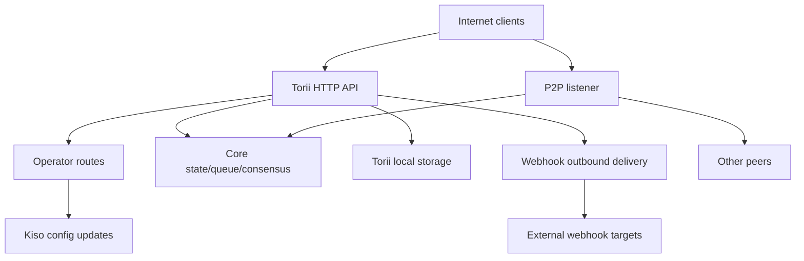

<!-- Auto-generated stub for Portuguese (pt) translation. Replace this content with the full translation. -->

---
lang: pt
direction: ltr
source: iroha-threat-model.md
status: complete
generator: scripts/sync_docs_i18n.py
source_hash: 766928cf0dcbfe3513c728bcf0b9fa697a330e8000bc6944ab61e8fcd59751ad
source_last_modified: "2026-02-07T13:27:25.009145+00:00"
translation_last_reviewed: 2026-04-02
translator: machine-google-reviewed
---

# Modelo de ameaça Iroha (repositório: `iroha`)

## Resumo executivo
Em uma implantação de blockchain pública exposta à Internet, onde as rotas do operador são intencionalmente acessíveis a partir da Internet pública, mas devem ser autenticadas por meio de assinaturas de solicitação, e onde webhooks/anexos são habilitados no endpoint público Torii, os principais riscos são: comprometimento do plano do operador (solicitações assinadas não autenticadas ou reproduzíveis para `/v1/configuration` e outras rotas do operador), SSRF e abuso de saída via entrega de webhook, e DoS de alta alavancagem por meio de endpoints de transação/consulta + streaming onde os limites de taxa são aplicados condicionalmente; além disso, qualquer postura “mTLS necessária” que dependa da presença de `x-forwarded-client-cert` é falsificável quando Torii é exposto diretamente. Evidência: `crates/iroha_torii/src/lib.rs` (roteador + middleware + rotas do operador), `crates/iroha_torii/src/operator_auth.rs` (ativação/desativação de autenticação do operador + verificação `x-forwarded-client-cert`), `crates/iroha_torii/src/webhook.rs` (cliente HTTP de saída), `crates/iroha_torii/src/limits.rs` (limitação de taxa condicional).

## Escopo e premissasNo escopo (tempo de execução/superfícies de produção):
- Servidor e middleware de API HTTP Torii, incluindo rotas de “operador”, API de aplicativo, webhooks, anexos, conteúdo e endpoints de streaming: `crates/iroha_torii/`, `crates/iroha_torii_shared/`
- Bootstrap de nó e fiação de componentes (Torii + P2P + ator de atualização de estado/fila/configuração): `crates/irohad/src/main.rs`
- Superfícies de transporte e handshake P2P: `crates/iroha_p2p/`
- Formas e padrões de configuração (especialmente padrões de autenticação Torii): `crates/iroha_config/src/parameters/{actual,defaults}.rs`
- Atualização de configuração voltada para o cliente DTO (o que `/v1/configuration` pode alterar): `crates/iroha_config/src/client_api.rs`
- Noções básicas de empacotamento de implantação: `Dockerfile` e configurações de exemplo em `defaults/` (não use chaves de exemplo incorporadas na produção).

Fora do escopo (a menos que solicitado explicitamente):
- Fluxos de trabalho de CI e automação de liberação: `.github/`, `ci/`, `scripts/`
- SDKs e aplicativos móveis/clientes: `IrohaSwift/`, `java/`, `examples/`
Material apenas de documentação: `docs/`Suposições explícitas (com base em seus esclarecimentos):
- Torii é exposto à Internet e acessível por clientes não autenticados (alguns pontos de extremidade ainda podem exigir assinaturas ou outra autenticação).
- As rotas do operador (`/v1/configuration`, `/v1/nexus/lifecycle` e telemetria/perfil controlado pelo operador quando habilitado) devem ser acessíveis publicamente e devem ser autenticadas por meio de assinatura de uma chave privada controlada pelo operador. Evidência (estado atual): `crates/iroha_torii/src/lib.rs` (`add_core_info_routes` aplica `operator_layer`), `crates/iroha_torii/src/operator_auth.rs` (`enforce_operator_auth` / `authorize_operator_endpoint`).
- A verificação da assinatura do operador deve usar uma lista de permissões local do nó de chaves públicas do operador na configuração (não mostrada como uma porta do operador implementada no roteador atual). Evidência da porta do operador atual: `crates/iroha_torii/src/operator_auth.rs` (`authorize_operator_endpoint`) e do auxiliar de assinatura de solicitação canônica existente (construção de mensagem): `crates/iroha_torii/src/app_auth.rs` (`canonical_request_message`).
- Torii não é necessariamente implantado atrás de uma entrada confiável; portanto, cabeçalhos como `x-forwarded-client-cert` devem ser tratados como controlados pelo invasor quando Torii for exposto diretamente. Evidência: `crates/iroha_torii/src/lib.rs` (`HEADER_MTLS_FORWARD`, `norito_rpc_mtls_present`) e `crates/iroha_torii/src/operator_auth.rs` (`HEADER_MTLS_FORWARD`, `mtls_present`).
- Webhooks e anexos estão habilitados no endpoint público Torii. Evidência: `crates/iroha_torii/src/lib.rs` (rotas para `/v1/webhooks` e `/v1/zk/attachments`), `crates/iroha_torii/src/webhook.rs`, `crates/iroha_torii/src/zk_attachments.rs`.- O operador pode definir ou manter `torii.require_api_token = false` (o padrão é `false`). Evidência: `crates/iroha_config/src/parameters/defaults.rs` (`torii::REQUIRE_API_TOKEN`).
- Espera-se que `/transaction` e `/query` sejam acessíveis para uma cadeia pública. Observação: eles são adicionalmente controlados pelo estágio de implementação “Norito-RPC” e verificação opcional de presença de cabeçalho “mTLS necessário”. Evidência: `crates/iroha_torii/src/lib.rs` (`ConnScheme::from_request`, `evaluate_norito_rpc_gate`) e `crates/iroha_config/src/parameters/defaults.rs` (`torii::transport::norito_rpc::STAGE = "disabled"`).

Perguntas abertas que alterariam materialmente a classificação de risco:
- Onde as chaves públicas do operador são configuradas (qual chave/formato de configuração) e como as chaves são identificadas/giradas (ID da chave, múltiplas chaves ativas, revogação)?
- Qual é o formato exato da mensagem de assinatura do operador e a proteção de repetição (carimbo de data/hora/nonce/contador + cache de repetição do lado do servidor) e qual política de distorção de relógio é aceitável? Evidência de que o auxiliar de solicitação canônica existente não tem atualização: `crates/iroha_torii/src/app_auth.rs` (`canonical_request_message`).
- Para webhooks anônimos, espera-se que Torii permita destinos arbitrários ou deve impor uma política de destino SSRF (bloquear RFC1918/localhost/link-local/metadata e, opcionalmente, exigir HTTPS)?
- Quais recursos Torii estão habilitados em sua compilação (`telemetry`, `profiling`, `p2p_ws`, `app_api_https`, `app_api_wss`) e o conteúdo `app_api` é usado? Evidência: `crates/iroha_torii/Cargo.toml` (`[features]`).

## Modelo do sistema### Componentes primários
- **Clientes de Internet** (carteiras, indexadores, exploradores, bots): enviam solicitações HTTP/Norito e abrem conexões WS/SSE.
- **Torii (API HTTP)**: roteador axum com middleware para pré-autenticação, aplicação opcional de token de API, negociação de versão de API, injeção remota de endereço e métricas. Evidência: `crates/iroha_torii/src/lib.rs` (`create_api_router`, `enforce_preauth`, `enforce_api_token`, `enforce_api_version`, `inject_remote_addr_header`).
- **Plano de controle do operador/autenticação (atual) e postura desejada**: as rotas do operador estão atualmente protegidas por `operator_auth::enforce_operator_auth` (WebAuthn/tokens; podem ser efetivamente desabilitadas pela configuração), mas seu requisito de implantação é a autenticação do operador baseada em assinatura verificada em uma lista de permissões de chaves públicas do operador na configuração. Existe um auxiliar de mensagem de solicitação canônica e pode ser reutilizado para construção de mensagens, mas a verificação precisaria ser adaptada para usar chaves de configuração (não contas de estado mundial). Evidência: `crates/iroha_torii/src/lib.rs` (`add_core_info_routes` usa `operator_layer`), `crates/iroha_torii/src/operator_auth.rs` (`authorize_operator_endpoint`), `crates/iroha_torii/src/app_auth.rs` (`canonical_request_message`, `verify_canonical_request`).- **Componentes principais do nó (em processo)**: fila de transação, estado/WSV, consenso (Sumeragi), armazenamento em bloco (Kura), ator de atualização de configuração (Kiso), etc, passado para Torii. Evidência: `crates/irohad/src/main.rs` (`Torii::new_with_handle(...)` recebe `queue`, `state`, `kura`, `kiso`, `sumeragi`, e é iniciado via `torii.start(...)`).
- **Redes P2P**: transporte e handshake peer-to-peer criptografados e emoldurados; existe TLS sobre TCP opcional, mas é intencionalmente permissivo na verificação de certificado. Evidência: `crates/iroha_p2p/src/lib.rs` (tipo alias `NetworkHandle<..., X25519Sha256, ChaCha20Poly1305>`), `crates/iroha_p2p/src/transport.rs` (módulo `p2p_tls` com `NoCertificateVerification`).
- **Torii persistência local**: diretório base padrão `./storage/torii` para anexos/webhooks/filas. Evidência: `crates/iroha_config/src/parameters/defaults.rs` (`torii::data_dir()`), `crates/iroha_torii/src/webhook.rs` (`webhooks.json` persistente), `crates/iroha_torii/src/zk_attachments.rs` (armazenado em `./storage/torii/zk_attachments/`).
- **Destinos de webhook de saída**: Torii pode entregar eventos para URLs `http://` arbitrários (e `https://`/`ws(s)://` apenas com recursos). Evidência: `crates/iroha_torii/src/webhook.rs` (`http_post_plain`, `http_post_https`, `ws_send`).### Fluxos de dados e limites de confiança
- Cliente de Internet → API HTTP Torii
  - Dados: Norito binário (`SignedTransaction`, `SignedQuery`), JSON DTOs (app API), assinaturas WS/SSE, cabeçalhos (incluindo `x-api-token`).
  - Canal: HTTP/1.1 + WebSocket + SSE (axum).
  - Garantias: token API opcional (`torii.require_api_token`), conexão pré-autenticação/gate de taxa, negociação de versão API; muitos manipuladores aplicam condicionalmente a limitação de taxa por endpoint (pode ser ignorada quando `enforce=false`). Evidência: `crates/iroha_torii/src/lib.rs` (`enforce_preauth`, `validate_api_token`, `handler_post_transaction`, `handler_signed_query`), `crates/iroha_torii/src/limits.rs` (`allow_conditionally`).
  - Validação: limites de corpo em alguns endpoints (por exemplo, transações), decodificação Norito, assinatura de solicitação para alguns endpoints de aplicativos (cabeçalhos de solicitação canônicos). Evidência: `crates/iroha_torii/src/lib.rs` (`add_transaction_routes` usa `DefaultBodyLimit::max(...)`), `crates/iroha_torii/src/app_auth.rs` (`verify_canonical_request`).- Cliente Internet → Rotas “Operadora” (Torii)
  - Dados: atualizações de configuração (`ConfigUpdateDTO`), planos de ciclo de vida de pista, telemetria/depuração/status/métricas (quando habilitado).
  - Canal: HTTP.
  - Garantias: o repositório atual bloqueia essas rotas com o middleware `operator_auth::enforce_operator_auth`, que é efetivamente autônomo quando `torii.operator_auth.enabled=false`; sua postura desejada é a autenticação baseada em assinatura usando chaves públicas do operador da configuração, que deve ser implementada e aplicada neste limite (e não deve depender de `x-forwarded-client-cert` se Torii estiver exposto diretamente). Evidência: `crates/iroha_torii/src/lib.rs` (`add_core_info_routes` aplica-se `operator_layer`), `crates/iroha_torii/src/operator_auth.rs` (`authorize_operator_endpoint`, `mtls_present`).
  - Validação: principalmente análise DTO; nenhuma autorização criptográfica no próprio `handle_post_configuration` (ele delega para `kiso.update_with_dto`). Evidência: `crates/iroha_torii/src/routing.rs` (`handle_post_configuration`).

- Torii → Fila/estado/consenso principal (em processo)
  - Dados: envios de transações, execução de consultas, leituras/gravações de estado, consultas de telemetria de consenso.
  - Canal: chamadas Rust em processo (identificadores `Arc` compartilhados).
  - Garantias: limite confiável assumido; a segurança depende de Torii autenticar/autorizar corretamente as solicitações antes de invocar operações privilegiadas. Evidência: `crates/irohad/src/main.rs` (fiação `Torii::new_with_handle(...)`) e manipuladores Torii chamando `routing::handle_*`.- Torii → Kiso (ator de atualização de configuração)
  - Dados: `ConfigUpdateDTO` pode modificar registro, P2P ACL, configurações de rede/transporte, handshake SoraNet, etc.
  - Canal: mensagem/identificador em processo.
  - Garantias: espera-se autorização no limite Torii; atualizar o próprio DTO é capaz. Evidência: `crates/iroha_config/src/client_api.rs` (os campos `ConfigUpdateDTO` incluem `network_acl`, `transport.norito_rpc`, `soranet_handshake`, etc).

- Torii → Disco local (`./storage/torii`)
  - Dados: registro de webhook e entregas em fila; anexos e metadados de desinfetantes; Comportamento do GC/TTL.
  - Canal: sistema de arquivos.
  - Garantias: permissões locais do SO (container roda como não-root no Dockerfile); o isolamento lógico por “locatário” é baseado em token de API ou cabeçalho IP remoto injetado por middleware. Evidência: `Dockerfile` (`USER iroha`), `crates/iroha_torii/src/lib.rs` (`inject_remote_addr_header`, `zk_attachments_tenant`).

- Torii → Destinos de webhook (saída)
  - Dados: cargas úteis de eventos + cabeçalho de assinatura.
  - Canal: cliente TCP HTTP bruto para `http://`; opcional `hyper+rustls` para `https://` quando habilitado; WS/WSS opcional quando ativado.
  - Garantias: timeouts/retentativas; nenhuma lista de permissões de destino visível no código; O URL será influenciado pelo invasor se o webhook CRUD estiver aberto. Evidência: `crates/iroha_torii/src/webhook.rs` (`handle_create_webhook`, `http_post_plain/http_post`).- Pares P2P (rede não confiável) → Transporte/handshake P2P
  - Dados: prefácio/metadados de handshake, mensagens criptografadas emolduradas, mensagens de consenso.
  - Canal: transporte P2P (TCP/QUIC/etc, dependente de recursos), cargas criptografadas; opcional TLS-over-TCP é explicitamente permissivo na verificação de certificado.
  - Garantias: criptografia e handshake assinado na camada de aplicação; O TLS da camada de transporte não autentica por certificado. Evidência: `crates/iroha_p2p/src/lib.rs` (tipos de criptografia), `crates/iroha_p2p/src/transport.rs` (comentário e implementação `NoCertificateVerification`).

#### Diagrama

## Ativos e objetivos de segurança| Ativo | Por que é importante | Objectivo de segurança (C/I/A) |
|---|---|---|
| Estado da cadeia/WSV/blocos | As falhas de integridade tornam-se falhas de consenso; falhas de disponibilidade paralisam a cadeia | E/A |
| Vivência de consenso (Sumeragi) | O valor do blockchain público depende da produção sustentada de blocos | Um |
| Chaves privadas do nó (identidade de pares, chaves de assinatura) | O comprometimento de chave permite o controle de identidade, abuso de assinatura ou particionamento de rede | C/I |
| Configuração de tempo de execução (atualizado pelo Kiso) | Controla ACLs de rede e configurações de transporte; uso indevido pode desabilitar proteções ou admitir peers maliciosos | eu |
| Fila de transações/mempool | Inundações podem privar o consenso e esgotar a CPU/memória | Um |
| Persistência Torii (`./storage/torii`) | O esgotamento do disco pode travar o nó; dados armazenados podem influenciar o processamento downstream | A (e às vezes C/I) |
| Canal de webhook de saída | Pode ser usado de forma abusiva para SSRF, exfiltração de dados de redes internas ou varredura de um IP de saída confiável | C/I/A |
| Dados de telemetria/métricas/depuração | Pode vazar topologia de rede e estado operacional útil para ataques direcionados | C |

## Modelo de atacante### Capacidades
- O invasor remoto e não autenticado da Internet pode enviar solicitações HTTP arbitrárias, manter conexões WS/SSE de longa duração e reproduzir ou pulverizar cargas úteis (botnet).
- Qualquer parte pode gerar chaves e enviar transações/consultas assinadas (blockchain público), incluindo spam de alto volume.
- Pares maliciosos/comprometidos podem se conectar ao P2P e tentar abuso de protocolo, inundação ou manipulação de handshake dentro das restrições permitidas.
- Se o webhook CRUD for exposto, o invasor poderá registrar URLs de webhook controlados pelo invasor e receber retornos de chamada de saída (e potencialmente direcioná-los para destinos internos).

### Não capacidades
- Nenhum acesso direto ao sistema de arquivos local, sem um endpoint exposto ou permissões de volume configuradas incorretamente.
- Não há capacidade de falsificar assinaturas para chaves de pares/operadores existentes sem comprometer a chave.
- Nenhuma capacidade presumida de quebrar a criptografia moderna (X25519, ChaCha20-Poly1305, Ed25519) em condições normais.

## Pontos de entrada e superfícies de ataque| Superfície | Como alcançado | Limite de confiança | Notas | Evidência (caminho/símbolo do repositório) |
|---|---|---|---|---|
| `POST /transaction` | InternetHTTP | Internet → Torii | Transação assinada binária Norito; a limitação de taxa é condicional (`enforce` pode ser falso) | `crates/iroha_torii/src/lib.rs` (`handler_post_transaction`, `ConnScheme::from_request`) |
| `POST /query` | InternetHTTP | Internet → Torii | Consulta binária assinada Norito; a limitação de taxa é condicional (`enforce` pode ser falso) | `crates/iroha_torii/src/lib.rs` (`handler_signed_query`) |
| Porta Norito-RPC | Cabeçalhos HTTP da Internet | Internet → Torii | Estágio de rollout + opcional “mTLS necessário” via presença de cabeçalho; canário usa `x-api-token` | `crates/iroha_torii/src/lib.rs` (`evaluate_norito_rpc_gate`, `HEADER_MTLS_FORWARD`) |
| `POST/GET/DELETE /v1/webhooks...` | Internet HTTP (API do aplicativo) | Internet → Torii → saída | Anônimo por design; o webhook CRUD permite entrega de saída para URLs arbitrários; Risco SSRF | `crates/iroha_torii/src/lib.rs` (`handler_webhooks_*`), `crates/iroha_torii/src/webhook.rs` (`http_post`) |
| `POST/GET /v1/zk/attachments...` | Internet HTTP (API do aplicativo) | Internet → Torii → disco | Anônimo por design; desinfetante de fixação + descompressão + persistência; superfície de esgotamento de disco/CPU (o locatário é um token de API se ativado, caso contrário, IP remoto por meio de cabeçalho injetado) | `crates/iroha_torii/src/lib.rs` (`handler_zk_attachments_*`, `zk_attachments_tenant`), `crates/iroha_torii/src/zk_attachments.rs` || `GET /v1/content/{bundle}/{path...}` | InternetHTTP | Internet → Torii → estado/armazenamento | Suporta modos de autenticação + PoW + Range; limitador de saída | `crates/iroha_torii/src/content.rs` (`handle_get_content`, `enforce_pow`, `enforce_auth`) |
| Transmissão: `/v1/events/sse`, `/events` (WS), `/block/stream` (WS) | Internet | Internet → Torii | Conexões duradouras; Superfície DoS | `crates/iroha_torii/src/lib.rs` (`add_network_stream_routes`) |
| `GET/POST /v1/configuration` | InternetHTTP | Internet → rotas da operadora → Kiso | Intenção de implantação: assinaturas do operador verificadas em relação às chaves da lista de permissões de configuração; o repositório atual o protege apenas através do middleware do operador (sem portão de assinatura mostrado no grupo de rotas) e delega o aplicativo de atualização para Kiso | `crates/iroha_torii/src/lib.rs` (`add_core_info_routes`, `handler_post_configuration`), `crates/iroha_torii/src/operator_auth.rs` (`enforce_operator_auth`), `crates/iroha_torii/src/routing.rs` (`handle_post_configuration`), `crates/iroha_torii/src/app_auth.rs` (solicitação canônica existente ajudante de assinatura) |
| `POST /v1/nexus/lifecycle` | InternetHTTP | Internet → rotas da operadora → núcleo | Endpoint do operador destinado a ser autenticado por assinatura; atualmente protegido pelo middleware do operador e pode se tornar público se a autenticação do operador estiver desabilitada | `crates/iroha_torii/src/lib.rs` (`add_core_info_routes`, `handler_post_nexus_lane_lifecycle`), `crates/iroha_torii/src/operator_auth.rs` (`authorize_operator_endpoint`) || Endpoints de telemetria/criação de perfil (recursos limitados) | InternetHTTP | Internet → rotas das operadoras | Grupos de rotas controladas pela operadora; se a autenticação do operador estiver desabilitada e nenhum portão de assinatura estiver presente, eles se tornarão públicos e poderão vazar dados operacionais ou serem vetores DoS | `crates/iroha_torii/src/lib.rs` (`add_telemetry_routes`, `add_profiling_routes`), `crates/iroha_torii/src/operator_auth.rs` (`authorize_operator_endpoint`) |
| Transportes P2P TCP/TLS | Internet/rede peer | Internet/pares → P2P | Quadros P2P criptografados + handshake; A verificação do certificado TLS é permissiva quando ativada | `crates/iroha_p2p/src/lib.rs` (`NetworkHandle`), `crates/iroha_p2p/src/transport.rs` (`p2p_tls::NoCertificateVerification`) |

## Principais caminhos de abuso

1. **Objetivo do invasor: assumir o controle do comportamento do nó por meio de atualizações de configuração de tempo de execução**
   1) Encontre Torii exposto à Internet onde as rotas do operador são acessíveis e a autenticação do operador está ausente/ignorável (por exemplo, autenticação do operador desativada e sem porta de assinatura).  
   2) `POST /v1/configuration` com um `ConfigUpdateDTO` que afrouxa ACLs de rede ou altera configurações de transporte.  
   3) Junte-se como par ou induza partição/configuração incorreta; degradar o consenso e/ou encaminhar transações através de infraestrutura controlada pelo invasor.  
   Impacto: comprometimento da integridade e disponibilidade do nó (e potencialmente da rede).2. **Objetivo do invasor: reproduzir uma solicitação capturada e assinada pelo operador**
   1) Obtenha uma solicitação de operador assinada válida (por exemplo, por meio de máquina de operador comprometida, logs de proxy configurados incorretamente ou um ambiente onde o TLS é encerrado de forma insegura).  
   2) Repetir a mesma solicitação nas rotas do operador público se o esquema de assinatura não tiver atualização (carimbo de data/hora/nonce) e rejeição de reprodução no lado do servidor.  
   3) Causar alterações repetidas na configuração, reversões ou alternâncias forçadas que degradam a disponibilidade ou enfraquecem as defesas.  
   Impacto: comprometimento da integridade/disponibilidade apesar da “autenticação de assinatura”.  

3. **Objetivo do invasor: desativar/bloquear proteções alterando a implementação de Norito-RPC**
   1) `POST /v1/configuration` para atualizar `transport.norito_rpc.stage` ou `require_mtls`.  
   2) Forçar abertura ou fechamento forçado de `/transaction` e `/query`, impactando a disponibilidade e os controles de admissão.  
   Impacto: interrupção direcionada ou desvio de controle de admissão.4. **Objetivo do invasor: SSRF na rede interna da operadora**
   1) Crie uma entrada de webhook apontando para um destino interno (por exemplo, host RFC1918, IP de metadados, plano de controle) via `POST /v1/webhooks`.  
   2) Aguarde eventos correspondentes; Torii entrega solicitações HTTP de saída de sua posição de rede.  
   3) Use respostas/status/tempo e tentativas repetidas para investigar serviços internos (e potencialmente exfiltrar se o conteúdo da resposta aparecer em outro lugar).  
   Impacto: exposição da rede interna, andaimes de movimento lateral, danos à reputação, exposição potencial de credenciais por meio de endpoints de metadados.  

5. **Objetivo do invasor: Negar serviço de admissão de transação/consulta**
   1) Inundar `POST /transaction` e `POST /query` com corpos Norito válidos/inválidos.  
   2) Manter muitas assinaturas WS/SSE e clientes lentos.  
   3) Explorar a limitação de taxa condicional (`enforce=false`) em operação normal para evitar estrangulamento.  
   Impacto: esgotamento da CPU/memória, saturação da fila, paradas de consenso.  

6. **Objetivo do atacante: Esgotar o disco por meio de anexos**
   1) Inundar `/v1/zk/attachments` com cargas úteis de tamanho máximo e/ou arquivos compactados próximos aos limites de expansão.  
   2) Use vários IPs de origem (ou qualquer ponto fraco de chaveamento de locatário) para evitar limites por locatário.  
   3) Persistir até que o TTL/GC fique atrasado; preencha `./storage/torii`.  
   Impacto: falha do nó, incapacidade de processar blocos/transações.7. **Objetivo do invasor: Ignorar portões “mTLS obrigatórios” quando Torii é exposto diretamente**
   1) O operador habilita `require_mtls` para Norito-RPC ou autenticação do operador.  
   2) O invasor envia solicitações com `x-forwarded-client-cert: <anything>`.  
   3) A verificação de presença do cabeçalho será aprovada se nenhuma entrada confiável remover o cabeçalho.  
   Impacto: controles mal aplicados; O operador acredita que o mTLS é aplicado quando não é.  

8. **Objetivo do invasor: degradar a conectividade entre pares/consumir recursos**
   1) Pares maliciosos tentam repetidamente handshakes ou inundam quadros próximos aos tamanhos máximos.  
   2) Explorar o TLS permissivo da camada de transporte (se habilitado) para evitar a rejeição antecipada com base em certificados.  
   Impacto: perda de conexão, uso de CPU, disponibilidade reduzida de pares.  

9. **Objetivo do invasor: reconhecimento por meio de endpoints de telemetria/depuração**
   1) Se a telemetria/criação de perfil estiver habilitada e a autenticação do operador estiver ausente/ignorável, raspe `/status`, `/metrics`, depure rotas.  
   2) Use dados de topologia/integridade vazados para cronometrar ataques e direcionar componentes específicos.  
   Impacto: aumento da taxa de sucesso do invasor; possível divulgação de informações.  

## Tabela de modelo de ameaça| ID da ameaça | Fonte de ameaça | Pré-requisitos | Ação de ameaça | Impacto | Ativos impactados | Controlos existentes (provas) | Lacunas | Mitigações recomendadas | Ideias de detecção | Probabilidade | Gravidade do impacto | Prioridade |
|---|---|---|---|---|---|---|---|---|---|---|---|---|| TM-001 | Atacante remoto da Internet | Torii exposto à Internet; as rotas dos operadores são públicas; a autenticação do operador está ausente/ignorável ou a autenticação do operador baseada em assinatura não está implementada/implementada incorretamente | Invoque rotas de operador (por exemplo, `/v1/configuration`, `/v1/nexus/lifecycle`) para alterar a configuração de tempo de execução, ACLs de rede ou configurações de transporte | Aquisição/partição de nó; admitir pares maliciosos; desabilitar proteções | Configuração de tempo de execução; vivacidade de consenso; integridade da cadeia; chaves de pares | As rotas do operador estão atrás do middleware do operador, mas `authorize_operator_endpoint` retorna `Ok(())` quando desativado; config update delega para Kiso sem autenticação extra. Evidência: `crates/iroha_torii/src/lib.rs` (`add_core_info_routes`), `crates/iroha_torii/src/operator_auth.rs` (`authorize_operator_endpoint`), `crates/iroha_torii/src/routing.rs` (`handle_post_configuration`), `crates/iroha_config/src/client_api.rs` (`ConfigUpdateDTO`) | Nenhuma autenticação de operador baseada em assinatura mostrada em grupos de rotas de operadores; “mTLS” baseado em cabeçalho é falsificável quando Torii é exposto diretamente; proteção de reprodução indefinida | Implementar autenticação de operador obrigatória baseada em assinatura para rotas de operador verificadas em relação a uma lista de permissões de configuração de chaves públicas de operador (suporta múltiplas chaves + IDs de chave); inclui atualização (timestamp + nonce) com um cache de repetição limitado; impor TLS de ponta a ponta (não confie em `x-forwarded-client-cert`); aplicar limites de taxas rigorosos + registro de auditoria em todas as ações do operador | Alerta sobre qualquer rota atingida pelo operador; diferenças de configuração do log de auditoria; detectar assinaturas/nonces repetidos; monitorar atualização incomumfrequência e IPs de origem | Alto (até que a autenticação de assinatura + proteção de reprodução sejam implementadas e aplicadas) | Alto | **crítico** || TM-002 | Atacante remoto da Internet | O Webhook CRUD é anônimo e acessível pela Internet; nenhuma política de destino SSRF | Crie webhooks direcionados a URLs internos/privilegiados e acione entregas | SSRF, varredura interna, exposição de credenciais de metadados e DoS de saída | Canal de webhook; rede interna; disponibilidade | Existem webhooks; as entregas usam tempos limites/retirada/tentativas máximas; A entrega `http://` usa TCP bruto. Evidência: `crates/iroha_torii/src/lib.rs` (`handler_webhooks_*`), `crates/iroha_torii/src/webhook.rs` (`handle_create_webhook`, `http_post_plain`, `WebhookPolicy`) | Nenhum bloco de lista de permissões de destino/intervalo de IP; `http://` permitido; Controles de religação/redirecionamento de DNS não visíveis; a limitação da taxa CRUD do webhook é condicional (pode estar efetivamente desativada em estado estacionário) | Mantenha os webhooks ativados, mas adicione controles SSRF: bloqueie intervalos de IP e nomes de host privados/loopback/link-local/metadados, resolva + endereços PIN, limite redirecionamentos, limite a simultaneidade de saída; como a criação é anônima, adicione cotas sempre ativas por IP + limites globais e considere um token PoW opcional para criação/atualizações de webhook | URL de destino do webhook de log e métrica + IPs resolvidos; alerta sobre destinos bloqueados; alerta sobre tentativas de IP privado e altas taxas de falha/nova tentativa; monitorar a taxa CRUD do webhook e a saturação da fila | Alto | Alto | **crítico** || TM-003 | Atacante / spammer remoto da Internet | Público `/transaction` e `/query`; limitação de taxa condicional não aplicada em modos comuns | Envio de tx/consulta de inundação, além de fluxos WS/SSE | Esgotamento de CPU/memória; saturação de filas; barracas de consenso | Disponibilidade (Torii + consenso); fila/mempool | O portão de pré-autenticação limita as conexões por IP e pode banir. Evidência: `crates/iroha_torii/src/lib.rs` (`enforce_preauth`), `crates/iroha_torii/src/limits.rs` (`PreAuthGate`) | Muitos limitadores de taxa chave são condicionais (`allow_conditionally` retorna verdadeiro quando `enforce=false`); invasores distribuídos contornam os limites por IP | Adicione limites de taxa sempre ativos para tx/query/streams quando exposto à Internet; adicionar limites de taxas configuráveis ​​por endpoint, independentemente da política de taxas; proteja endpoints caros com PoW ou exija cotas baseadas em assinatura/conta | Monitorar: rejeições de pré-autenticação, comprimento da fila, taxas de tx/consulta, conexões ativas WS/SSE; alerta sobre anomalias e limites de capacidade sustentados | Alto | Alto | **alto** || TM-004 | Atacante remoto da Internet | Recursos de telemetria/perfil ativados; autenticação do operador desativada ou portão de assinatura ausente | Raspe `/status`, `/metrics`, depure endpoints; solicitar status de depuração caro | Divulgação de informações; DoS operacional; habilitação de ataque direcionado | Dados de telemetria/depuração; disponibilidade | Os grupos de rotas de telemetria/criação de perfil são colocados em camadas com `operator_auth::enforce_operator_auth`. Evidência: `crates/iroha_torii/src/lib.rs` (`add_telemetry_routes`, `add_profiling_routes`), `crates/iroha_torii/src/operator_auth.rs` (`authorize_operator_endpoint`) | O middleware do operador não funciona quando desativado; a autenticação do operador baseada em assinatura não é mostrada nesses grupos de rotas | Exigir a mesma autenticação obrigatória do operador baseada em assinatura para esses grupos de rotas; adicionar limites rígidos de taxa e cache de resposta sempre que possível; evite expor endpoints de criação de perfil/depuração em nós públicos por padrão | Rastrear logs de acesso; alerta sobre padrões de scraping e solicitações sustentadas de alto custo | Médio | Médio | **médio** || TM-005 | Atacante remoto da Internet (exploração de configuração incorreta) | O operador habilita `require_mtls`, mas Torii é exposto diretamente (ou a higienização de proxy/cabeçalho não é garantida) | Spoof `x-forwarded-client-cert` para satisfazer as verificações “mTLS obrigatórias” | Falsa sensação de segurança; bypass gating para Norito-RPC / políticas de autenticação do operador | Limite operador/autenticação; controlo de admissão | `require_mtls` é verificado pela presença do cabeçalho. Evidência: `crates/iroha_torii/src/lib.rs` (`HEADER_MTLS_FORWARD`, `norito_rpc_mtls_present`), `crates/iroha_torii/src/operator_auth.rs` (`mtls_present`) | Nenhuma verificação criptográfica do certificado do cliente em Torii; depende de um contrato de entrada externo | Não confie em `x-forwarded-client-cert` para segurança quando Torii estiver acessível publicamente; se o mTLS for necessário, aplique a verificação do certificado do cliente em Torii ou em uma entrada confiável que remova os cabeçalhos do cliente; caso contrário, remova/ignore o portão baseado em cabeçalho para implantações voltadas para a Internet | Alerta sobre qualquer solicitação contendo `x-forwarded-client-cert` chegando diretamente a Torii; resultados de log gate para Norito-RPC e autenticação do operador; monitorar mudanças repentinas no tráfego permitido | Alto | Alto | **alto** || TM-006 | Atacante remoto da Internet | Os pontos finais dos anexos são anônimos e acessíveis pela Internet; invasor pode enviar cargas úteis de tamanho máximo ou de bomba de compressão | Abusar do sanitizador/descompactação/persistência para consumir CPU/disco | Instabilidade do nó; exaustão do disco; rendimento degradado | Armazenamento Torii; disponibilidade | Existem limites de anexo + desinfetante e profundidade máxima de expansão/arquivamento. Evidência: `crates/iroha_config/src/parameters/defaults.rs` (`ATTACHMENTS_MAX_BYTES`, `ATTACHMENTS_MAX_EXPANDED_BYTES`, `ATTACHMENTS_MAX_ARCHIVE_DEPTH`, `ATTACHMENTS_SANITIZER_MODE`), `crates/iroha_torii/src/zk_attachments.rs` (`inspect_bytes`, limites), `crates/iroha_torii/src/lib.rs` (`handler_zk_attachments_*`, `zk_attachments_tenant`) | A identidade do locatário é amplamente baseada em IP quando os tokens de API estão desativados; limites de desvio de fontes distribuídas; TTL ainda permite acumulação de vários dias | Como os anexos devem ser públicos e anônimos, impor cotas de disco globais + contrapressão, restringir os padrões (TTL/máximo de bytes), manter o sanitizador no modo de subprocesso com sandbox no nível do sistema operacional e considerar a restrição PoW opcional para gravações; garantir que as cotas por IP não possam ser ignoradas por cabeçalhos falsificados (continue usando `inject_remote_addr_header`) | Monitore o uso do disco de `./storage/torii`; alerta sobre taxa de criação de anexos, rejeições de desinfetantes e acúmulo por inquilino; rastrear atraso do GC | Médio | Alto | **alto** || TM-007 | Par malicioso | O peer pode alcançar o ouvinte P2P; opcionalmente TLS habilitado | Apertos de mão/frames de inundação; tentativa de esgotamento de recursos; explorar TLS permissivo para evitar rejeição antecipada | Degradação da conectividade; queima de recursos; particionamento parcial | Disponibilidade; conectividade entre pares | Quadros criptografados + erros de handshake para mensagens grandes. Evidência: `crates/iroha_p2p/src/lib.rs` (`Error::FrameTooLarge`, erros de handshake), `crates/iroha_p2p/src/transport.rs` (`p2p_tls` é permissivo, mas é esperado um handshake assinado na camada de aplicativo) | A camada de transporte não autentica; DoS possível antes da autenticação de nível superior; aceleradores por peer/IP podem ser insuficientes | Adicione limites rígidos de conexão por IP/ASN; tentativas de handshake de limite de taxa; considere exigir chaves de pares permitidas em nós públicos; garanta que os tamanhos máximos de quadro sejam conservadores; adicionar contrapressão e queda antecipada para peers não autenticados | Monitore a taxa de conexão P2P de entrada; alerta sobre falhas repetidas de handshake e erros de quadros muito grandes | Médio | Médio | **médio** || TM-008 | Erro na cadeia de abastecimento/operador | O operador implanta com exemplos de chaves/configurações; dependências comprometidas | Use chaves padrão/exemplo ou padrões inseguros; sequestro de dependência | Compromisso chave; partição de cadeia; perda de reputação | Chaves; integridade; disponibilidade | Docker executa não-root e copia padrões em `/config`. Evidência: `Dockerfile` (`USER iroha`, `COPY defaults ...`) | Configurações de exemplo podem conter exemplos de chaves privadas incorporadas; padrões inseguros como `require_api_token=false` e `operator_auth.enabled=false` | Adicione avisos de inicialização/verificações de falha ao detectar chaves de exemplo conhecidas; enviar um perfil de configuração reforçado de “nó público”; impor verificações `cargo deny`/SBOM no pipeline de lançamento | Controle de CI para segredos em `defaults/`; aviso de log de tempo de execução em combinações de configuração inseguras | Médio | Alto | **alto** || TM-009 | Atacante remoto da Internet | A autenticação do operador baseada em assinatura é implementada sem atualização; invasor pode observar pelo menos uma solicitação de operador assinada válida | Repetir uma solicitação de operador assinada anteriormente válida em rotas de operador público | Alterações/reversões de configuração repetidas; interrupções direcionadas; enfraquecimento das defesas | Configuração de tempo de execução; disponibilidade; integridade de auditoria | O auxiliar de assinatura canônica constrói mensagem a partir de método/caminho/consulta/body-hash e não inclui carimbo de data/hora/nonce. Evidência: `crates/iroha_torii/src/app_auth.rs` (`canonical_request_message`) | A proteção de repetição não é inerente às assinaturas; rotas do operador atualmente não mostram um cache de repetição/rastreamento de nonce | Incluir `timestamp` + `nonce` (ou contador monotônico) na mensagem assinada, impor uma distorção de relógio rígida e manter um cache de repetição limitado codificado pela identidade do operador; registrar e rejeitar duplicatas | Alerta sobre nonces/hashes de solicitação duplicados; correlacionar as ações do operador por identidade e fonte; adicionar métricas para rejeições de reprodução | Médio | Alto | **alto** || TM-010 | Atacante/insider remoto | A chave privada de assinatura do operador é armazenada onde pode ser exfiltrada (disco/configuração/artefatos de CI) | Roubar a chave privada do operador e emitir solicitações válidas e assinadas do operador | Compromisso total do plano do operador com baixa detectabilidade | Chaves do operador; configuração de tempo de execução; vivacidade do consenso | Alguns componentes Torii já carregam chaves privadas da configuração (por exemplo, chave do operador do emissor offline). Evidência: `crates/iroha_torii/src/lib.rs` (lê `torii.offline_issuer.operator_private_key` em um `KeyPair`), `Dockerfile` (executado como não-root) | Armazenamento/rotação de chaves/uso de HSM não imposto por código; autenticação de assinatura herdaria esse risco | Use chaves apoiadas por hardware (HSM/enclave seguro) sempre que possível; evite incorporar chaves de operador em repositórios ou configurações legíveis por todos; impor permissões e rotação de arquivos estritas; considere multi-sig/threshold para ações do operador | Alerta sobre ações do operador de novos IPs/ASNs; manter um registro de auditoria imutável das ações do operador; girar chaves sob suspeita | Médio | Alto | **alto** |

## Calibração de criticidade

Para este contexto de implantação repo + esclarecido (cadeia pública exposta à Internet; as rotas do operador são públicas e devem ser autenticadas por assinatura; sem entrada confiável garantida), os níveis de gravidade significam:- **crítico**: um invasor remoto e não autenticado pode alterar o comportamento do nó/rede ou interromper de forma confiável a produção de blocos em muitos nós.
  - Exemplos: autenticação de assinatura ausente/ignorável para rotas de operador como `/v1/configuration` (TM-001); webhook SSRF para endpoints de metadados/plano de controle de cluster de saída privilegiada (TM-002); roubo de chave de assinatura do operador, permitindo ações válidas do operador assinado (TM-010).

- **alto**: um invasor remoto pode causar DoS sustentado em um nó ou ignorar um controle de segurança no qual os operadores podem confiar, com pré-condições realistas.
  - Exemplos: DoS de admissão de tx/consulta de alto volume quando a limitação de taxa condicional está inativa (TM-003); esgotamento de disco/CPU acionado por anexo (TM-006); repetição de uma solicitação de operador assinada capturada se faltar rejeição de atualização/reprodução (TM-009).

- **médio**: Ataques que auxiliam significativamente no reconhecimento ou degradam o desempenho, mas são limitados por recursos, exigem posição elevada do atacante ou já possuem uma mitigação significativa presente.
  - Exemplos: exposição de telemetria/perfil quando habilitado (TM-004); Inundação de handshake P2P com raio de explosão limitado (TM-007).- **baixo**: Ataques que exigem pré-condições improváveis, raio de explosão limitado ou armas de pé principalmente operacionais com fácil mitigação.
  - Exemplos: pequenos vazamentos de informações de endpoints públicos somente leitura que devem ser públicos para um blockchain (por exemplo, `/v1/health`, `/v1/peers`) e são principalmente úteis para reconhecimento em vez de comprometimento direto (não enumerados como principais ameaças aqui). Evidência: `crates/iroha_torii_shared/src/lib.rs` (`uri::HEALTH`, `uri::PEERS`).

## Caminhos de foco para revisão de segurança| Caminho | Por que é importante | IDs de ameaças relacionadas |
|---|---|---|
| `crates/iroha_torii/src/lib.rs` | Construção de roteador, ordenação de middleware, grupos de rotas de operadores, manipuladores de tx/consulta, decisões de limite de autenticação/taxa e fiação de API de aplicativo (webhooks/anexos) | TM-001, TM-002, TM-003, TM-004, TM-005, TM-006 |
| `crates/iroha_torii/src/operator_auth.rs` | Comportamento de ativação/desativação de autenticação do operador; verificação mTLS baseada em cabeçalho; sessões/tokens; crítico para a proteção do plano do operador e para a compreensão das condições de bypass | TM-001, TM-004, TM-005 |
| `crates/iroha_torii/src/routing.rs` | Os manipuladores `/v1/configuration` delegam para Kiso sem autenticação adicional; grande superfície de manipuladores | TM-001, TM-003 |
| `crates/iroha_config/src/client_api.rs` | Define recursos `ConfigUpdateDTO` (ACLs de rede, alterações de transporte, atualizações de handshake) | TM-001, TM-009 |
| `crates/iroha_config/src/parameters/defaults.rs` | Postura padrão para tokens de API/autenticação do operador/estágio Norito-RPC; padrões de anexo | TM-003, TM-006, TM-008 |
| `crates/iroha_torii/src/webhook.rs` | Suporte a esquema e cliente HTTP de saída; Superfície SSRF; trabalhador de persistência e entrega | TM-002 |
| `crates/iroha_torii/src/zk_attachments.rs` | Desinfetante de anexos, limites de descompressão, persistência, chaveamento de locatário | TM-006 |
| `crates/iroha_torii/src/limits.rs` | Porta de pré-autenticação e auxiliares de limitação de taxa; comportamento de execução condicional | TM-003 |
| `crates/iroha_torii/src/content.rs` | Autenticação/PoW/Range de endpoint de conteúdo e limitação de saída; considerações sobre exfiltração de dados e DoS | TM-003 || `crates/iroha_torii/src/app_auth.rs` | Assinatura canônica de solicitações (construção de mensagens e verificação de assinatura); considerações sobre risco de reprodução se reutilizadas para autenticação do operador | TM-001, TM-003, TM-009 |
| `crates/iroha_p2p/src/lib.rs` | Escolhas de criptografia, limites de enquadramento, tratamento de erros de handshake; Superfície de risco P2P | TM-007 |
| `crates/iroha_p2p/src/transport.rs` | TLS sobre TCP é permissivo; comportamentos de transporte afetam superfície DoS | TM-007 |
| `crates/irohad/src/main.rs` | Bootstraps Torii + P2P + ator de atualização de configuração; determina quais superfícies estão habilitadas | TM-001, TM-008 |
| `defaults/nexus/config.toml` | A configuração de exemplo pode incluir chaves de exemplo incorporadas e endereços de ligação públicos; implantação de armas de fogo | TM-008 |
| `Dockerfile` | Usuário/permissões do tempo de execução do contêiner e inclusão de configuração padrão (o material chave e a exposição do plano do operador são sensíveis à implantação) | TM-008, TM-010 |### Verificação de qualidade
- Pontos de entrada cobertos: tx/consulta, streaming, webhooks, anexos, conteúdo, operador/configuração, telemetria/criação de perfil (recurso fechado), P2P.
- Limites de confiança cobertos por ameaças: Internet→Torii, Torii→Kiso/core/disk, Torii→alvos de webhook, peers→P2P.
- Separação entre tempo de execução e CI/dev: CI/docs/mobile explicitamente fora do escopo.
- Esclarecimentos do usuário refletidos: rotas do operador expostas à Internet são públicas, mas devem ser autenticadas por assinatura, sem entrada confiável garantida, webhooks/anexos habilitados no endpoint público Torii.
- Pressupostos/perguntas abertas explicitamente listados em “Escopo e pressupostos”.

## Notas sobre uso
- Este documento é intencionalmente fundamentado em repositórios (as âncoras das evidências apontam para o código atual); várias mitigações de alta prioridade (porta de assinatura do operador, política de destino SSRF do webhook) exigem novo código/configuração que ainda não está presente.
- Trate quaisquer sinais “mTLS” baseados em cabeçalho (por exemplo, `x-forwarded-client-cert`) como controlados pelo invasor, a menos que um ingresso confiável os remova e os injete.