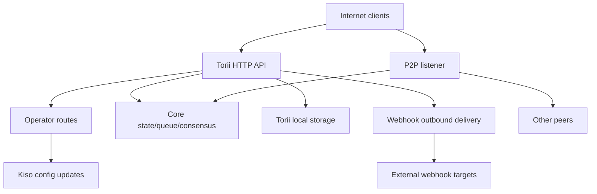

<!-- Auto-generated stub for Russian (ru) translation. Replace this content with the full translation. -->

---
lang: ru
direction: ltr
source: iroha-threat-model.md
status: complete
generator: scripts/sync_docs_i18n.py
source_hash: 766928cf0dcbfe3513c728bcf0b9fa697a330e8000bc6944ab61e8fcd59751ad
source_last_modified: "2026-02-07T13:27:25.009145+00:00"
translation_last_reviewed: 2026-04-02
translator: machine-google-reviewed
---

# Iroha Модель угрозы (репозиторий: `iroha`)

## Резюме
В общедоступном развертывании блокчейна, доступном в Интернете, где маршруты оператора намеренно доступны из общедоступного Интернета, но должны быть аутентифицированы с помощью подписей запросов, и где веб-перехватчики/вложения включены на общедоступной конечной точке Torii, основными рисками являются: компрометация плоскости оператора (неаутентифицированные или воспроизводимые подписанные запросы к `/v1/configuration` и другим маршрутам оператора), SSRF и исходящее злоупотребление через доставку веб-перехватчика, и DoS с высоким уровнем кредитного плеча через конечные точки транзакций/запросов + потоковой передачи, где ограничения скорости применяются условно; кроме того, любая позиция «требуется mTLS», основанная на присутствии `x-forwarded-client-cert`, поддается подделке, когда Torii подвергается непосредственному воздействию. Доказательства: `crates/iroha_torii/src/lib.rs` (маршрутизатор + промежуточное ПО + маршруты оператора), `crates/iroha_torii/src/operator_auth.rs` (включение/отключение аутентификации оператора + проверка `x-forwarded-client-cert`), `crates/iroha_torii/src/webhook.rs` (исходящий HTTP-клиент), `crates/iroha_torii/src/limits.rs` (условное ограничение скорости).

## Область применения и предположенияВ объеме (время выполнения/производственные поверхности):
- Torii HTTP API-сервер и промежуточное программное обеспечение, включая «операторские» маршруты, API приложений, веб-перехватчики, вложения, контент и конечные точки потоковой передачи: `crates/iroha_torii/`, `crates/iroha_torii_shared/`
- Начальная загрузка узла и подключение компонентов (Torii + P2P + актер обновления состояния/очереди/конфигурации): `crates/irohad/src/main.rs`
- P2P-транспорт и поверхности установления связи: `crates/iroha_p2p/`
- Формы конфигурации и значения по умолчанию (особенно значения по умолчанию для аутентификации Torii): `crates/iroha_config/src/parameters/{actual,defaults}.rs`.
- Обновление конфигурации клиента (DTO) (что может изменить `/v1/configuration`): `crates/iroha_config/src/client_api.rs`.
- Основы упаковки развертывания: `Dockerfile` и примеры конфигураций в `defaults/` (не используйте встроенные примеры ключей в рабочей среде).

За пределами области применения (если явно не запрошено):
- Рабочие процессы CI и автоматизация выпуска: `.github/`, `ci/`, `scripts/`.
- Мобильные/клиентские SDK и приложения: `IrohaSwift/`, `java/`, `examples/`.
- Материал только для документации: `docs/`.Явные предположения (на основе ваших разъяснений):
- Torii доступен в Интернете и доступен для клиентов, не прошедших проверку подлинности (некоторые конечные точки все еще могут требовать подписи или другую аутентификацию).
- Маршруты оператора (`/v1/configuration`, `/v1/nexus/lifecycle` и телеметрия/профилирование, контролируемые оператором, если они включены) предназначены для публичного доступа и должны аутентифицироваться посредством подписи с помощью закрытого ключа, контролируемого оператором. Доказательства (текущее состояние): `crates/iroha_torii/src/lib.rs` (`add_core_info_routes` применяет `operator_layer`), `crates/iroha_torii/src/operator_auth.rs` (`enforce_operator_auth` / `authorize_operator_endpoint`).
- Проверка подписи оператора должна использовать локальный для узла список открытых ключей оператора в конфигурации (не показан как реализованный шлюз оператора в текущем маршрутизаторе). Свидетельство текущего шлюза оператора: `crates/iroha_torii/src/operator_auth.rs` (`authorize_operator_endpoint`) и существующего помощника по подписанию канонических запросов (построение сообщения): `crates/iroha_torii/src/app_auth.rs` (`canonical_request_message`).
— Torii не обязательно развертывается за доверенным входом; поэтому заголовки типа `x-forwarded-client-cert` должны рассматриваться как контролируемые злоумышленником, когда Torii подвергается непосредственному воздействию. Доказательства: `crates/iroha_torii/src/lib.rs` (`HEADER_MTLS_FORWARD`, `norito_rpc_mtls_present`) и `crates/iroha_torii/src/operator_auth.rs` (`HEADER_MTLS_FORWARD`, `mtls_present`).
— Веб-перехватчики и вложения включены на общедоступной конечной точке Torii. Доказательства: `crates/iroha_torii/src/lib.rs` (маршруты для `/v1/webhooks` и `/v1/zk/attachments`), `crates/iroha_torii/src/webhook.rs`, `crates/iroha_torii/src/zk_attachments.rs`.- Оператор может установить или сохранить `torii.require_api_token = false` (по умолчанию `false`). Доказательства: `crates/iroha_config/src/parameters/defaults.rs` (`torii::REQUIRE_API_TOKEN`).
- Ожидается, что `/transaction` и `/query` будут доступны для публичной сети. Примечание. Они дополнительно контролируются этапом развертывания «Norito-RPC» и дополнительной проверкой наличия заголовка «mTLS требуется». Доказательства: `crates/iroha_torii/src/lib.rs` (`ConnScheme::from_request`, `evaluate_norito_rpc_gate`) и `crates/iroha_config/src/parameters/defaults.rs` (`torii::transport::norito_rpc::STAGE = "disabled"`).

Открытые вопросы, которые могут существенно изменить рейтинг рисков:
- Где настраиваются открытые ключи оператора (какой конфигурационный ключ/формат) и как ключи идентифицируются/чередуются (идентификатор ключа, несколько активных ключей, отзыв)?
- Каков точный формат сообщения подписи оператора и защита от воспроизведения (метка времени/nonce/счетчик + кэш воспроизведения на стороне сервера) и какая политика отклонения тактовой частоты приемлема? Доказательство того, что существующий канонический помощник запроса не актуален: `crates/iroha_torii/src/app_auth.rs` (`canonical_request_message`).
- Ожидается ли, что для анонимных веб-перехватчиков Torii будет разрешать произвольные места назначения или он должен применять политику назначения SSRF (блокировать RFC1918/localhost/link-local/metadata и, при необходимости, требовать HTTPS)?
- Какие функции Torii включены в вашей сборке (`telemetry`, `profiling`, `p2p_ws`, `app_api_https`, `app_api_wss`) и используется ли контент `app_api`? Доказательства: `crates/iroha_torii/Cargo.toml` (`[features]`).

## Модель системы### Основные компоненты
- **Интернет-клиенты** (кошельки, индексаторы, проводники, боты): отправляйте запросы HTTP/Norito и открывайте соединения WS/SSE.
- **Torii (HTTP API)**: маршрутизатор axum с промежуточным программным обеспечением для шлюзования предварительной аутентификации, дополнительного применения токенов API, согласования версии API, удаленного внедрения адресов и метрик. Доказательства: `crates/iroha_torii/src/lib.rs` (`create_api_router`, `enforce_preauth`, `enforce_api_token`, `enforce_api_version`, `inject_remote_addr_header`).
- **Плоскость управления оператором/аутентификацией (текущая) и желаемая позиция**: маршруты оператора в настоящее время защищены `operator_auth::enforce_operator_auth` (WebAuthn/токены; могут быть эффективно отключены с помощью конфигурации), но вашим требованием к развертыванию является проверка подлинности оператора на основе подписи по списку разрешенных открытых ключей оператора в конфигурации. Помощник сообщения канонического запроса существует и может быть повторно использован для построения сообщения, но проверку необходимо будет адаптировать для использования ключей конфигурации (а не учетных записей мирового состояния). Доказательства: `crates/iroha_torii/src/lib.rs` (`add_core_info_routes` использует `operator_layer`), `crates/iroha_torii/src/operator_auth.rs` (`authorize_operator_endpoint`), `crates/iroha_torii/src/app_auth.rs` (`canonical_request_message`, `verify_canonical_request`).- **Базовые компоненты узла (в процессе)**: очередь транзакций, состояние/WSV, консенсус (Sumeragi), блочное хранилище (Kura), субъект обновления конфигурации (Kiso) и т. д., переданные в Torii. Свидетельство: `crates/irohad/src/main.rs` (`Torii::new_with_handle(...)` получает `queue`, `state`, `kura`, `kiso`, `sumeragi` и запускается через `torii.start(...)`).
- **Сеть P2P**: одноранговая передача с шифрованием и кадрированием и подтверждение связи; существует необязательный TLS-over-TCP, но он намеренно разрешает проверку сертификата. Доказательства: `crates/iroha_p2p/src/lib.rs` (псевдоним типа `NetworkHandle<..., X25519Sha256, ChaCha20Poly1305>`), `crates/iroha_p2p/src/transport.rs` (модуль `p2p_tls` с `NoCertificateVerification`).
- **Torii локальное постоянство**: `./storage/torii` базовый каталог по умолчанию для вложений/веб-перехватчиков/очередей. Доказательства: `crates/iroha_config/src/parameters/defaults.rs` (`torii::data_dir()`), `crates/iroha_torii/src/webhook.rs` (сохранился `webhooks.json`), `crates/iroha_torii/src/zk_attachments.rs` (хранится под `./storage/torii/zk_attachments/`).
- **Цели исходящего веб-перехватчика**: Torii может доставлять события на произвольные URL-адреса `http://` (а `https://`/`ws(s)://` только с функциями). Доказательства: `crates/iroha_torii/src/webhook.rs` (`http_post_plain`, `http_post_https`, `ws_send`).### Потоки данных и границы доверия
- Интернет-клиент → Torii HTTP API
  - Данные: двоичный файл Norito (`SignedTransaction`, `SignedQuery`), JSON DTO (API приложения), подписки WS/SSE, заголовки (включая `x-api-token`).
  - Канал: HTTP/1.1 + WebSocket + SSE (axum).
  - Гарантии: дополнительный токен API (`torii.require_api_token`), предварительная аутентификация соединения/регулирование скорости, согласование версии API; многие обработчики применяют условное ограничение скорости для каждой конечной точки (можно обойти, если `enforce=false`). Доказательства: `crates/iroha_torii/src/lib.rs` (`enforce_preauth`, `validate_api_token`, `handler_post_transaction`, `handler_signed_query`), `crates/iroha_torii/src/limits.rs` (`allow_conditionally`).
  – Проверка: ограничения тела на некоторых конечных точках (например, транзакции), декодирование Norito, подпись запроса для некоторых конечных точек приложения (канонические заголовки запроса). Доказательства: `crates/iroha_torii/src/lib.rs` (`add_transaction_routes` использует `DefaultBodyLimit::max(...)`), `crates/iroha_torii/src/app_auth.rs` (`verify_canonical_request`).- Интернет-клиент → Маршруты «Оператор» (Torii)
  — Данные: обновления конфигурации (`ConfigUpdateDTO`), планы жизненного цикла полос, телеметрия/отладка/статус/метрики (если включено).
  - Канал: HTTP.
  - Гарантии: текущий репозиторий ограничивает эти маршруты с помощью промежуточного программного обеспечения `operator_auth::enforce_operator_auth`, которое фактически не работает при `torii.operator_auth.enabled=false`; желаемой позицией является аутентификация на основе подписи с использованием открытых ключей оператора из конфигурации, которая должна быть реализована и применена на этой границе (и не должна полагаться на `x-forwarded-client-cert`, если Torii открыт напрямую). Доказательства: `crates/iroha_torii/src/lib.rs` (`add_core_info_routes` применяет `operator_layer`), `crates/iroha_torii/src/operator_auth.rs` (`authorize_operator_endpoint`, `mtls_present`).
  - Валидация: в основном парсинг DTO; нет криптографической авторизации в самом `handle_post_configuration` (она делегирует `kiso.update_with_dto`). Доказательства: `crates/iroha_torii/src/routing.rs` (`handle_post_configuration`).

- Torii → Основная очередь/состояние/консенсус (в процессе)
  - Данные: отправление транзакций, выполнение запросов, чтение/запись состояния, согласованные запросы телеметрии.
  - Канал: внутрипроцессные вызовы Rust (общие дескрипторы `Arc`).
  - Гарантии: предполагаемая доверенная граница; безопасность зависит от правильной аутентификации/авторизации запросов Torii перед вызовом привилегированных операций. Доказательства: обработчики `crates/irohad/src/main.rs` (проводка `Torii::new_with_handle(...)`) и Torii, вызывающие `routing::handle_*`.- Torii → Кисо (актер обновления конфигурации)
  - Данные: `ConfigUpdateDTO` может изменять ведение журнала, P2P ACL, настройки сети/транспорта, рукопожатие SoraNet и т. д.
  - Канал: внутрипроцессное сообщение/дескриптор.
  - Гарантии: ожидается авторизация на границе Torii; обновление DTO само по себе несет в себе возможности. Доказательство: `crates/iroha_config/src/client_api.rs` (поля `ConfigUpdateDTO` включают `network_acl`, `transport.norito_rpc`, `soranet_handshake` и т. д.).

- Torii → Локальный диск (`./storage/torii`)
  - Данные: реестр веб-перехватчиков и поставки в очереди; вложения и метаданные дезинфицирующего средства; Поведение GC/TTL.
  - Канал: файловая система.
  - Гарантии: разрешения локальной ОС (контейнер запускается без полномочий root в Dockerfile); логическая изоляция «арендатором» основана на токене API или удаленном заголовке IP, внедренном промежуточным программным обеспечением. Доказательства: `Dockerfile` (`USER iroha`), `crates/iroha_torii/src/lib.rs` (`inject_remote_addr_header`, `zk_attachments_tenant`).

- Torii → Цели веб-перехватчика (исходящие)
  - Данные: полезные данные события + заголовок подписи.
  - Канал: необработанный TCP-клиент HTTP для `http://`; дополнительный `hyper+rustls` для `https://`, когда он включен; дополнительный WS/WSS, если он включен.
  - Гарантии: таймауты/повторные попытки; в коде не отображается белый список пунктов назначения; URL-адрес находится под влиянием злоумышленника, если веб-перехватчик CRUD открыт. Доказательства: `crates/iroha_torii/src/webhook.rs` (`handle_create_webhook`, `http_post_plain/http_post`).- Одноранговые узлы P2P (ненадежная сеть) → P2P-транспорт/квитирование
  - Данные: предисловие/метаданные рукопожатия, зашифрованные сообщения в рамке, сообщения консенсуса.
  - Канал: транспорт P2P (TCP/QUIC/и т. д., в зависимости от функции), зашифрованные полезные данные; дополнительный TLS-over-TCP явно разрешает проверку сертификата.
  - Гарантии: шифрование и подписанное рукопожатие на уровне приложения; TLS транспортного уровня не проверяет подлинность по сертификату. Доказательства: `crates/iroha_p2p/src/lib.rs` (типы шифрования), `crates/iroha_p2p/src/transport.rs` (комментарий и реализация `NoCertificateVerification`).

#### Диаграмма

## Активы и цели безопасности| Актив | Почему это важно | Цель безопасности (C/I/A) |
|---|---|---|
| Состояние цепи / WSV / блоки | Нарушения целостности становятся провалами консенсуса; сбои доступности останавливают цепочку | Я/А |
| Согласованная жизнеспособность (Sumeragi) | Ценность публичного блокчейна зависит от устойчивого производства блоков | А |
| Закрытые ключи узла (идентификация узла, ключи подписи) | Компрометация ключей позволяет перехватить личность, злоупотребить подписью или разделить сеть | С/Я |
| Конфигурация времени выполнения (обновлено Kiso) | Управляет сетевыми списками управления доступом и настройками транспорта; неправильное использование может отключить защиту или допустить злонамеренные узлы | я |
| Очередь транзакций/мемпул | Флуд может привести к голоданию консенсуса и истощению процессора/памяти | А |
| Torii постоянство (`./storage/torii`) | Исчерпание диска может привести к сбою узла; хранимые данные могут повлиять на последующую обработку | A (а иногда и C/I) |
| Исходящий канал вебхука | Может быть использован для SSRF, кражи данных из внутренних сетей или сканирования с доверенного исходящего IP-адреса | К/И/А |
| Телеметрия/метрики/данные отладки | Может ли утечка топологии сети и рабочего состояния полезна для целевых атак | С |

## Модель атакующего### Возможности
- Удаленный, не прошедший проверку подлинности интернет-злоумышленник может отправлять произвольные HTTP-запросы, удерживать долгоживущие соединения WS/SSE, а также воспроизводить или распылять полезную нагрузку (ботнет).
- Любая сторона может генерировать ключи и отправлять подписанные транзакции/запросы (публичный блокчейн), включая спам в больших объемах.
- Вредоносный/скомпрометированный одноранговый узел может подключиться к P2P и попытаться злоупотребить протоколом, выполнить лавинную рассылку или манипулировать рукопожатием в рамках разрешенных ограничений.
- Если веб-перехватчик CRUD открыт, злоумышленник может зарегистрировать контролируемые злоумышленником URL-адреса веб-перехватчиков и получать исходящие обратные вызовы (и потенциально направлять их во внутренние пункты назначения).

### Невозможности
- Нет прямого доступа к локальной файловой системе при отсутствии открытой конечной точки или неправильно настроенных разрешений тома.
- Нет возможности подделывать подписи для существующих ключей однорангового узла/оператора без компрометации ключа.
- Нет предполагаемой способности взламывать современную криптографию (X25519, ChaCha20-Poly1305, Ed25519) в нормальных условиях.

## Точки входа и поверхности атаки| Поверхность | Как достигнуто | Граница доверия | Заметки | Доказательства (путь/символ репо) |
|---|---|---|---|---|
| `POST /transaction` | Интернет HTTP | Интернет → Torii | Norito двоичная транзакция со знаком; ограничение скорости условно (`enforce` может быть ложным) | И18НИ00000243X (`handler_post_transaction`, `ConnScheme::from_request`) |
| `POST /query` | Интернет HTTP | Интернет → Torii | Norito двоичный запрос со знаком; ограничение скорости условно (`enforce` может быть ложным) | И18НИ00000248Х (И18НИ00000249Х) |
| Norito-RPC ворота | HTTP-заголовки Интернета | Интернет → Torii | Этап развертывания + опционально «требуется mTLS» через наличие заголовка; канарейка использует `x-api-token` | И18НИ00000251X (`evaluate_norito_rpc_gate`, `HEADER_MTLS_FORWARD`) |
| `POST/GET/DELETE /v1/webhooks...` | Интернет HTTP (API приложения) | Интернет → Torii → исходящий | Анонимный по замыслу; вебхук CRUD обеспечивает исходящую доставку на произвольные URL-адреса; Риск SSRF | И18НИ00000255Х (И18НИ00000256Х), И18НИ00000257Х (И18НИ00000258Х) |
| `POST/GET /v1/zk/attachments...` | Интернет HTTP (API приложения) | Интернет → Torii → диск | Анонимный по замыслу; дезинфицирующее средство для прикрепления + декомпрессия + персистентность; поверхность исчерпания диска/ЦП (если включено, арендование осуществляется через API-токен, в противном случае удаленный IP-адрес через введенный заголовок) | `crates/iroha_torii/src/lib.rs` (`handler_zk_attachments_*`, `zk_attachments_tenant`), `crates/iroha_torii/src/zk_attachments.rs` || `GET /v1/content/{bundle}/{path...}` | Интернет HTTP | Интернет → Torii → состояние/хранилище | Поддерживает режимы аутентификации + PoW + Range; ограничитель выхода | `crates/iroha_torii/src/content.rs` (`handle_get_content`, `enforce_pow`, `enforce_auth`) |
| Потоковая передача: `/v1/events/sse`, `/events` (WS), `/block/stream` (WS) | Интернет | Интернет → Torii | Долгосрочные связи; Поверхность DoS | И18НИ00000272X (`add_network_stream_routes`) |
| `GET/POST /v1/configuration` | Интернет HTTP | Интернет → маршруты оператора → Кисо | Цель развертывания: подписи операторов сверяются с ключами белого списка конфигурации; текущий репозиторий защищает его только через промежуточное программное обеспечение оператора (в группе маршрутов шлюз подписи не отображается) и делегирует приложение обновления Kiso | `crates/iroha_torii/src/lib.rs` (`add_core_info_routes`, `handler_post_configuration`), `crates/iroha_torii/src/operator_auth.rs` (`enforce_operator_auth`), `crates/iroha_torii/src/routing.rs` (`handle_post_configuration`), `crates/iroha_torii/src/app_auth.rs` (существующие помощник по подписанию канонических запросов) |
| `POST /v1/nexus/lifecycle` | Интернет HTTP | Интернет → маршруты оператора → ядро ​​| Конечная точка оператора, предназначенная для аутентификации по подписи; в настоящее время охраняется промежуточным программным обеспечением оператора и может стать общедоступным, если аутентификация оператора отключена | `crates/iroha_torii/src/lib.rs` (`add_core_info_routes`, `handler_post_nexus_lane_lifecycle`), `crates/iroha_torii/src/operator_auth.rs` (`authorize_operator_endpoint`) || Конечные точки телеметрии/профилирования (с функциями) | Интернет HTTP | Интернет → маршруты оператора | Группы маршрутов, контролируемые оператором; если аутентификация оператора отключена и шлюз подписи отсутствует, они становятся общедоступными и могут привести к утечке операционных данных или быть векторами DoS | `crates/iroha_torii/src/lib.rs` (`add_telemetry_routes`, `add_profiling_routes`), `crates/iroha_torii/src/operator_auth.rs` (`authorize_operator_endpoint`) |
| P2P-транспорт TCP/TLS | Интернет/одноранговая сеть | Интернет/пиры → P2P | Зашифрованные кадры P2P + рукопожатие; Проверка сертификата TLS разрешена, если она включена | И18НИ00000294Х (И18НИ00000295Х), И18НИ00000296Х (И18НИ00000297Х) |

## Основные пути злоупотреблений

1. **Цель злоумышленника: контролировать поведение узла посредством обновлений конфигурации во время выполнения**
   1) Найдите доступный в Интернете Torii, где маршруты оператора доступны, а аутентификация оператора отсутствует/обходима (например, аутентификация оператора отключена и нет шлюза подписи).  
   2) `POST /v1/configuration` с `ConfigUpdateDTO`, который ослабляет сетевые ACL или изменяет настройки транспорта.  
   3) Присоединиться как одноранговый узел или вызвать раздел/неправильную конфигурацию; ухудшать консенсус и/или направлять транзакции через инфраструктуру, контролируемую злоумышленником.  
   Воздействие: нарушение целостности и доступности узла (и, возможно, сети).2. **Цель злоумышленника: воспроизвести перехваченный запрос, подписанный оператором**
   1) Получите один действительный подписанный запрос оператора (например, через скомпрометированную машину оператора, неправильно настроенные журналы прокси-сервера или среду, в которой TLS завершается небезопасно).  
   2) Воспроизвести тот же запрос по маршрутам общедоступного оператора, если схеме подписи не хватает актуальности (временная метка/одноразовый номер) и отклонение повтора на стороне сервера.  
   3) Вызывают повторяющиеся изменения конфигурации, откаты или принудительные переключения, которые ухудшают доступность или ослабляют защиту.  
   Воздействие: нарушение целостности/доступности, несмотря на «авторизацию по подписи».  

3. **Цель злоумышленника: отключить/заблокировать защиту, изменив развертывание Norito-RPC**
   1) `POST /v1/configuration` для обновления `transport.norito_rpc.stage` или `require_mtls`.  
   2) Принудительное открытие или принудительное закрытие `/transaction` и `/query`, что влияет на доступность и контроль доступа.  
   Воздействие: целенаправленное отключение или обход контроля доступа.4. **Цель злоумышленника: SSRF во внутреннюю сеть оператора**
   1) Создайте запись веб-перехватчика, указывающую на внутренний пункт назначения (например, хост RFC1918, IP-адрес метаданных, плоскость управления) через `POST /v1/webhooks`.  
   2) Дождитесь соответствующих событий; Torii доставляет исходящие HTTP-запросы со своей сетевой позиции.  
   3) Используйте ответы/статусы/тайминг и повторные попытки для проверки внутренних служб (и, возможно, для утечки информации, если содержимое ответа когда-либо появится где-либо еще).  
   Воздействие: раскрытие внутренней сети, горизонтальное перемещение, репутационный ущерб, потенциальное раскрытие учетных данных через конечные точки метаданных.  

5. **Цель злоумышленника: запретить обслуживание транзакции/запроса**
   1) Залейте `POST /transaction` и `POST /query` действительными/недействительными телами Norito.  
   2) Поддерживать множество подписок WS/SSE и медленных клиентов.  
   3) Используйте условное ограничение скорости (`enforce=false`) при нормальной работе, чтобы избежать регулирования.  
   Последствия: истощение процессора/памяти, перенасыщение очередей, остановка консенсуса.  

6. **Цель злоумышленника: вытащить диск с помощью вложений**
   1) Заполнение `/v1/zk/attachments` полезными нагрузками максимального размера и/или сжатыми архивами, близкими к пределам расширения.  
   2) Используйте несколько исходных IP-адресов (или любую слабость ключей арендатора), чтобы избежать ограничений для каждого арендатора.  
   3) Продолжать до тех пор, пока TTL/GC не начнет отставать; заполните `./storage/torii`.  
   Воздействие: сбой узла, невозможность обработки блоков/транзакций.7. **Цель злоумышленника: обойти шлюзы «требуется mTLS», когда Torii открыт напрямую**
   1) Оператор включает `require_mtls` для Norito-RPC или аутентификации оператора.  
   2) Злоумышленник отправляет запросы с `x-forwarded-client-cert: <anything>`.  
   3) Проверка наличия заголовка проходит, если ни один доверенный вход не удаляет заголовок.  
   Воздействие: меры контроля применяются неправильно; Оператор считает, что mTLS применяется, хотя это не так.  

8. **Цель злоумышленника: ухудшить одноранговую связь/использовать ресурсы**
   1) Злоумышленник неоднократно пытается установить соединение или заполонить кадры, размеры которых близки к максимальным.  
   2) Используйте разрешительный TLS транспортного уровня (если он включен), чтобы избежать раннего отклонения на основании сертификатов.  
   Влияние: отток подключений, загрузка ЦП, снижение доступности одноранговых узлов.  

9. **Цель злоумышленника: разведка с помощью телеметрии/конечных точек отладки**
   1) Если телеметрия/профилирование включено и аутентификация оператора отсутствует/обходима, очистите `/status`, `/metrics`, отладьте маршруты.  
   2) Используйте утекшие данные о топологии и работоспособности для определения времени атак и нацеливания на конкретные компоненты.  
   Воздействие: повышенная вероятность успеха злоумышленников; возможное раскрытие информации.  

## Таблица моделей угроз| Идентификатор угрозы | Источник угрозы | Предпосылки | Действия по угрозе | Воздействие | Затронутые активы | Существующие средства контроля (доказательства) | Пробелы | Рекомендуемые меры по смягчению последствий | Идеи обнаружения | Вероятность | Тяжесть воздействия | Приоритет |
|---|---|---|---|---|---|---|---|---|---|---|---|---|| ТМ-001 | Удаленный интернет-злоумышленник | Torii доступен в Интернете; маршруты оператора являются общедоступными; аутентификация оператора отсутствует/обходима или аутентификация оператора на основе подписи не реализована/неправильно реализована | Вызовите маршруты оператора (например, `/v1/configuration`, `/v1/nexus/lifecycle`), чтобы изменить конфигурацию среды выполнения, сетевые списки управления доступом или настройки транспорта | Перехват/раздел узла; признать злонамеренных сверстников; отключить защиту | Конфигурация времени выполнения; жизнеспособность консенсуса; целостность цепи; одноранговые ключи | Маршруты оператора находятся за промежуточным программным обеспечением оператора, но `authorize_operator_endpoint` возвращает `Ok(())`, если он отключен; обновление конфигурации делегирует Kiso без дополнительной аутентификации. Доказательства: `crates/iroha_torii/src/lib.rs` (`add_core_info_routes`), `crates/iroha_torii/src/operator_auth.rs` (`authorize_operator_endpoint`), `crates/iroha_torii/src/routing.rs` (`handle_post_configuration`), `crates/iroha_config/src/client_api.rs` (`ConfigUpdateDTO`) | В группах маршрутов оператора не отображается проверка подлинности оператора на основе подписи; «mTLS» на основе заголовка можно подделать, если Torii открыт напрямую; защита от повтора не определена | Внедрить обязательную аутентификацию оператора на основе подписи для маршрутов оператора, проверенных по списку разрешенных конфигураций открытых ключей оператора (поддержка нескольких ключей + идентификаторов ключей); включать актуальность (метка времени + nonce) с ограниченным кешем повторов; обеспечить сквозной TLS (не доверяйте `x-forwarded-client-cert`); применять строгие ограничения скорости + журналирование всех действий оператора | Оповещение о попадании на любой маршрут оператора; различия в конфигурации журнала аудита; обнаруживать повторяющиеся подписи/одноразовые номера; следить за необычным обновлениемчастота и IP-адреса источника | Высокий (до тех пор, пока не будет реализована и обеспечена проверка подлинности подписи + защита от повтора) | Высокий | **критическое** || ТМ-002 | Удаленный интернет-злоумышленник | Webhook CRUD is anonymous and internet-reachable; нет политики назначения SSRF | Создавайте веб-перехватчики, нацеленные на внутренние/привилегированные URL-адреса, и инициируйте доставку | SSRF, внутреннее сканирование, раскрытие учетных данных метаданных и исходящий DoS | Канал вебхука; внутренняя сеть; доступность | Вебхуки существуют; при доставке используются таймауты/отсрочка/максимальное количество попыток; Доставка `http://` использует необработанный TCP. Доказательства: `crates/iroha_torii/src/lib.rs` (`handler_webhooks_*`), `crates/iroha_torii/src/webhook.rs` (`handle_create_webhook`, `http_post_plain`, `WebhookPolicy`) | Нет блокировок белого списка адресатов/диапазона IP-адресов; `http://` разрешено; Элементы управления перепривязкой/перенаправлением DNS не видны; Ограничение скорости CRUD веб-перехватчика является условным (может быть фактически отключено в устойчивом состоянии) | Оставьте веб-перехватчики включенными, но добавьте элементы управления SSRF: блокируйте диапазоны IP-адресов и имена хостов частных/петлевых/локальных ссылок/метаданных, разрешайте + пин-адреса, ограничивайте перенаправления, ограничивайте исходящий параллелизм; поскольку создание является анонимным, добавьте постоянные квоты для каждого IP + глобальные ограничения и рассмотрите возможность использования дополнительного токена PoW для создания/обновления веб-перехватчика | Целевой URL-адрес веб-перехватчика журналов и показателей + разрешенные IP-адреса; оповещение о заблокированных направлениях; оповещение о попытках использования частного IP-адреса и высокой частоте неудачных/повторных попыток; отслеживать скорость CRUD веб-перехватчика и насыщенность очереди | Высокий | Высокий | **критическое** || ТМ-003 | Удаленный интернет-злоумышленник/спамер | Публичные `/transaction` и `/query`; условное ограничение скорости не применяется в обычных режимах | Flood-передача/отправка запросов, а также потоки WS/SSE | нехватка процессора/памяти; насыщенность очереди; киоски консенсуса | Доступность (Torii + консенсус); очередь/мемпул | Шлюз предварительной аутентификации ограничивает количество подключений по IP и может блокировать. Доказательства: `crates/iroha_torii/src/lib.rs` (`enforce_preauth`), `crates/iroha_torii/src/limits.rs` (`PreAuthGate`) | Многие ограничители ключевой скорости являются условными (`allow_conditionally` возвращает true, когда `enforce=false`); распределенные злоумышленники обходят ограничения на IP-адреса | Добавьте постоянные ограничения скорости для передачи/запроса/потоков при доступе к Интернету; добавлять настраиваемые ограничения скорости для каждой конечной точки независимо от политики комиссий; защитить дорогостоящие конечные точки с помощью PoW или потребовать квоты на основе подписей/учетных записей | Мониторинг: отклонения предварительной аутентификации, длина очереди, скорость передачи/запроса, активные соединения WS/SSE; оповещение об аномалиях и устойчивых ограничениях пропускной способности | Высокий | Высокий | **высокий** || ТМ-004 | Удаленный интернет-злоумышленник | Включены функции телеметрии/профилирования; авторизация оператора отключена или отсутствует шлюз подписи | Очистка `/status`, `/metrics`, отладка конечных точек; запросить дорогой статус отладки | Раскрытие информации; оперативный DoS; возможность целенаправленной атаки | Телеметрические/отладочные данные; доступность | Группы маршрутов телеметрии/профилирования накладываются на `operator_auth::enforce_operator_auth`. Доказательства: `crates/iroha_torii/src/lib.rs` (`add_telemetry_routes`, `add_profiling_routes`), `crates/iroha_torii/src/operator_auth.rs` (`authorize_operator_endpoint`) | Промежуточное программное обеспечение оператора неактивно, если оно отключено; аутентификация оператора на основе подписи не отображается в этих группах маршрутов | Требовать одну и ту же обязательную аутентификацию оператора на основе подписи для этих групп маршрутов; добавьте жесткие ограничения скорости и кэширование ответов, где это возможно; по умолчанию избегайте раскрытия конечных точек профилирования/отладки на общедоступных узлах | Отслеживать журналы доступа; предупреждение о шаблонах парсинга и постоянных дорогостоящих запросах | Средний | Средний | **средний** || ТМ-005 | Удаленный интернет-злоумышленник (эксплуатация неправильной конфигурации) | Оператор включает `require_mtls`, но Torii доступен напрямую (или очистка прокси/заголовка не гарантируется) | Подделать `x-forwarded-client-cert` для выполнения проверок «требуется mTLS» | Ложное чувство безопасности; обход шлюза для политик аутентификации Norito-RPC/оператора | Граница оператора/авторизации; входной контроль | `require_mtls` проверяется по наличию заголовка. Доказательства: `crates/iroha_torii/src/lib.rs` (`HEADER_MTLS_FORWARD`, `norito_rpc_mtls_present`), `crates/iroha_torii/src/operator_auth.rs` (`mtls_present`) | Нет криптографической проверки сертификата клиента по адресу Torii; полагается на внешний входной контракт | Не полагайтесь на `x-forwarded-client-cert` для обеспечения безопасности, когда Torii общедоступен; если требуется mTLS, принудительно выполните проверку сертификата клиента по адресу Torii или на доверенном входе, который удаляет заголовки клиента; в противном случае удалите/игнорируйте шлюз на основе заголовка для развертываний с выходом в Интернет | Оповещение о любом запросе, содержащем `x-forwarded-client-cert`, напрямую достигающем Torii; результаты протоколирования шлюза для Norito-RPC и аутентификации оператора; отслеживать внезапные изменения разрешенного трафика | Высокий | Высокий | **высокий** || ТМ-006 | Удаленный интернет-злоумышленник | Конечные точки вложений анонимны и доступны через Интернет; злоумышленник может отправить полезную нагрузку максимального размера или бомбы сжатия | Злоупотребление дезинфицирующим средством/декомпрессией/постоянством для использования процессора/диска | нестабильность узла; истощение диска; снижение пропускной способности | Torii хранилище; доступность | Существуют ограничения на вложения + дезинфицирующее средство и максимальная глубина расширения/архива. Доказательства: `crates/iroha_config/src/parameters/defaults.rs` (`ATTACHMENTS_MAX_BYTES`, `ATTACHMENTS_MAX_EXPANDED_BYTES`, `ATTACHMENTS_MAX_ARCHIVE_DEPTH`, `ATTACHMENTS_SANITIZER_MODE`), `crates/iroha_torii/src/zk_attachments.rs` (`inspect_bytes`, пределы), `crates/iroha_torii/src/lib.rs` (`handler_zk_attachments_*`, `zk_attachments_tenant`) | Идентификация арендатора в основном основана на IP-адресе, когда токены API отключены; распределенные источники обходят ограничения; TTL по-прежнему допускает многодневное накопление | Поскольку вложения должны быть общедоступными и анонимными, необходимо применять глобальные дисковые квоты + противодавление, ужесточить значения по умолчанию (TTL/максимальное количество байт), держать дезинфицирующее средство в режиме подпроцесса с изолированной программной средой на уровне ОС и рассмотреть возможность дополнительного ограничения PoW для записи; обеспечить невозможность обхода квот для каждого IP с помощью поддельных заголовков (продолжайте использовать `inject_remote_addr_header`) | Мониторинг использования диска `./storage/torii`; оповещения о частоте создания вложений, отклонении дезинфицирующих средств и накоплении на каждого арендатора; отслеживать отставание GC | Средний | Высокий | **высокий** || ТМ-007 | Вредоносный пир | Одноранговый узел может связаться с прослушивателем P2P; опционально включен TLS | Наводнение рукопожатиями/фреймами; попытаться исчерпать ресурсы; использовать разрешительный TLS, чтобы избежать раннего отклонения | Ухудшение качества связи; сжигание ресурсов; частичное разделение | Доступность; одноранговая связь | Зашифрованные кадры + ошибки подтверждения для сообщений слишком большого размера. Доказательства: `crates/iroha_p2p/src/lib.rs` (`Error::FrameTooLarge`, ошибки подтверждения), `crates/iroha_p2p/src/transport.rs` (`p2p_tls` является разрешительным, но ожидается подписанное подтверждение на уровне приложения) | Транспортный уровень не проверяет подлинность; DoS возможен до аутентификации более высокого уровня; регулирования для каждого узла/IP может быть недостаточно | Добавьте строгие ограничения на количество подключений для каждого IP/ASN; ограничение скорости попыток установления связи; рассмотреть возможность включения ключей одноранговых узлов в разрешенный список на общедоступных узлах; убедитесь, что максимальные размеры кадров консервативны; добавить противодавление и раннее отключение для неаутентифицированных пиров | Мониторинг скорости входящего P2P-соединения; оповещение о повторяющихся сбоях установления связи и ошибках слишком большого размера кадра | Средний | Средний | **средний** || ТМ-008 | Цепочка поставок / ошибка оператора | Оператор развертывает с использованием примеров ключей/конфигураций; зависимости скомпрометированы | Используйте ключи по умолчанию/примеры или небезопасные значения по умолчанию; захват зависимостей | Ключевой компромисс; цепная перегородка; потеря репутации | Ключи; честность; доступность | Docker запускается без полномочий root и копирует настройки по умолчанию в `/config`. Доказательства: `Dockerfile` (`USER iroha`, `COPY defaults ...`) | Примеры конфигураций могут содержать встроенные примеры закрытых ключей; небезопасные значения по умолчанию, такие как `require_api_token=false` и `operator_auth.enabled=false` | Добавьте предупреждения при запуске/проверки на закрытие при обнаружении известных ключей-примеров; отправить профиль жесткой конфигурации «публичного узла»; принудительно выполнять проверки `cargo deny`/SBOM в конвейере выпуска | CI-шлюз для секретов в `defaults/`; предупреждение журнала времени выполнения о небезопасных комбинациях конфигураций | Средний | Высокий | **высокий** || ТМ-009 | Удаленный интернет-злоумышленник | Аутентификация оператора на основе подписи реализована без актуальности; злоумышленник может обнаружить хотя бы один действительный подписанный запрос оператора | Воспроизведение ранее действительного подписанного запроса оператора на маршрутах общедоступного оператора | Повторные изменения/откаты конфигурации; целевые отключения; ослабление защиты | Конфигурация времени выполнения; доступность; аудит целостности | Помощник по канонической подписи создает сообщение из метода/пути/запроса/хэша тела и не включает метку времени/nonce. Доказательства: `crates/iroha_torii/src/app_auth.rs` (`canonical_request_message`) | Защита от повторного воспроизведения не является неотъемлемой частью подписей; маршруты операторов в настоящее время не отображают отслеживание кэша повторов/nonce | Включите `timestamp` + `nonce` (или монотонный счетчик) в подписанное сообщение, обеспечьте строгий сдвиг тактовых импульсов и поддерживайте ограниченный кэш повторов, ключ которого зависит от идентификатора оператора; регистрировать и отклонять дубликаты | Оповещение о повторяющихся одноразовых значениях/хэшах запросов; соотносить действия оператора по личности и источнику; добавить показатели отклонения повторов | Средний | Высокий | **высокий** || ТМ-010 | Удаленный злоумышленник/инсайдер | Закрытый ключ подписи оператора хранится там, где его можно отфильтровать (артефакты диска/конфигурации/CI) | Украсть закрытый ключ оператора и выдать действительные подписанные запросы оператора | Полный компромисс между самолетом-оператором и низкой заметностью | Ключи оператора; конфигурация времени выполнения; консенсус жизнеспособность | Некоторые компоненты Torii уже загружают закрытые ключи из конфигурации (например, ключ оператора автономного эмитента). Доказательства: `crates/iroha_torii/src/lib.rs` (читает `torii.offline_issuer.operator_private_key` в `KeyPair`), `Dockerfile` (запускается без полномочий root) | Хранение/ротация ключей/использование HSM не предусмотрено кодом; аутентификация подписи унаследует этот риск | По возможности используйте ключи с аппаратной поддержкой (HSM/безопасный анклав); избегайте встраивания ключей оператора в репозиторий или общедоступную конфигурацию; обеспечить строгие права доступа к файлам и ротацию; рассмотреть возможность использования нескольких подписей/пороговых значений для действий оператора | Оповещение о действиях оператора с новых IP/ASN; вести неизменяемый журнал аудита действий оператора; повернуть клавиши при подозрении | Средний | Высокий | **высокий** |

## Калибровка критичности

Для этого репозитория + уточненный контекст развертывания (публичная сеть, открытая для доступа в Интернет; маршруты оператора являются общедоступными и предназначены для аутентификации по подписи; нет гарантированного доверенного входа), уровни серьезности означают:- **критический**: удаленный злоумышленник, не прошедший проверку подлинности, может изменить поведение узла/сети или надежно остановить создание блоков на многих узлах.
  - Примеры: отсутствующая/обходимая аутентификация подписи для маршрутов оператора, таких как `/v1/configuration` (TM-001); веб-перехватчик SSRF к конечным точкам метаданных/плоскости управления кластером из привилегированного выхода (TM-002); Кража ключа подписи оператора, обеспечивающая действительные подписанные действия оператора (TM-010).

- **высокий**: удаленный злоумышленник может вызвать устойчивый DoS-отказ узла или обойти меры безопасности, на которые могут положиться операторы, при наличии реалистичных предварительных условий.
  - Примеры: DoS при большом объеме передачи/запроса, когда условное ограничение скорости неактивно (TM-003); истощение диска/процессора из-за прикрепления (TM-006); воспроизведение перехваченного подписанного запроса оператора, если отсутствует отказ от актуальности/воспроизведения (TM-009).

- **средний**: атаки, которые существенно помогают разведке или снижают производительность, но либо являются ограниченными функциями, требуют более высокого положения злоумышленника, либо уже имеют значительные средства защиты.
  - Примеры: воздействие телеметрии/профилирования при включении (TM-004); P2P-затопление с помощью рукопожатия с ограниченным радиусом взрыва (TM-007).- **низкий**: атаки, требующие маловероятных предварительных условий, ограниченного радиуса поражения или, в первую очередь, оперативного огнестрельного оружия с легким смягчением.
  - Примеры: незначительные утечки информации из общедоступных конечных точек, доступных только для чтения, которые, как ожидается, будут общедоступными для блокчейна (например, `/v1/health`, `/v1/peers`) и в первую очередь полезны для разведки, а не для прямого компрометации (не перечислены здесь как основные угрозы). Доказательства: `crates/iroha_torii_shared/src/lib.rs` (`uri::HEALTH`, `uri::PEERS`).

## Пути фокусировки для проверки безопасности| Путь | Почему это важно | Идентификаторы связанных угроз |
|---|---|---|
| `crates/iroha_torii/src/lib.rs` | Создание маршрутизатора, упорядочивание промежуточного программного обеспечения, группы операторских маршрутов, обработчики передачи/запросов, решения об аутентификации/ограничении скорости и подключение API приложений (веб-перехватчики/вложения) | ТМ-001, ТМ-002, ТМ-003, ТМ-004, ТМ-005, ТМ-006 |
| `crates/iroha_torii/src/operator_auth.rs` | Поведение включения/выключения аутентификации оператора; проверка mTLS на основе заголовка; сессии/токены; критически важен для защиты плоскости оператора и понимания условий обхода | ТМ-001, ТМ-004, ТМ-005 |
| `crates/iroha_torii/src/routing.rs` | Обработчики `/v1/configuration` делегируют Kiso без дополнительной аутентификации; большая площадь погрузчиков | ТМ-001, ТМ-003 |
| `crates/iroha_config/src/client_api.rs` | Определяет возможности `ConfigUpdateDTO` (сетевые списки управления доступом, изменения транспорта, обновления рукопожатия) | ТМ-001, ТМ-009 |
| `crates/iroha_config/src/parameters/defaults.rs` | Положение по умолчанию для токенов API/авторизации оператора/этапа Norito-RPC; настройки вложений по умолчанию | ТМ-003, ТМ-006, ТМ-008 |
| `crates/iroha_torii/src/webhook.rs` | Поддержка исходящего HTTP-клиента и схемы; поверхность SSRF; настойчивость и доставщик | ТМ-002 |
| `crates/iroha_torii/src/zk_attachments.rs` | Дезинфицирующее средство вложений, пределы декомпрессии, постоянство, ввод ключей клиента | ТМ-006 |
| `crates/iroha_torii/src/limits.rs` | Помощники по предварительной аутентификации и ограничению скорости; условное правоприменительное поведение | ТМ-003 |
| `crates/iroha_torii/src/content.rs` | Аутентификация конечной точки контента/PoW/диапазон и ограничение исходящего трафика; утечка данных и соображения DoS | ТМ-003 || `crates/iroha_torii/src/app_auth.rs` | Подписание канонического запроса (построение сообщения и проверка подписи); соображения риска повторного воспроизведения при повторном использовании для аутентификации оператора | ТМ-001, ТМ-003, ТМ-009 |
| `crates/iroha_p2p/src/lib.rs` | Выбор шифрования, ограничения кадров, обработка ошибок рукопожатия; Поверхность риска P2P | ТМ-007 |
| `crates/iroha_p2p/src/transport.rs` | TLS-over-TCP является разрешительным; поведение транспорта влияет на поверхность DoS | ТМ-007 |
| `crates/irohad/src/main.rs` | Bootstraps Torii + P2P + актер обновления конфигурации; определяет, какие поверхности включены | ТМ-001, ТМ-008 |
| `defaults/nexus/config.toml` | Пример конфигурации может включать встроенные примеры ключей и общедоступные адреса привязки; развертывание пехотинцев | ТМ-008 |
| `Dockerfile` | Пользователь/разрешения для среды выполнения контейнера и включение конфигурации по умолчанию (материал ключа и доступность плоскости оператора зависят от развертывания) | ТМ-008, ТМ-010 |### Проверка качества
- Охвачены точки входа: передача/запрос, потоковая передача, веб-перехватчики, вложения, контент, оператор/конфигурация, телеметрия/профилирование (с поддержкой функций), P2P.
- Границы доверия, охваченные угрозами: Интернет→Torii, Torii→Kiso/core/disk, Torii→цели webhook, одноранговые узлы→P2P.
- Разделение среды выполнения и CI/разработки: CI/docs/mobile явно выходит за рамки.
- Отражены пояснения пользователей: доступны в Интернете, маршруты оператора являются общедоступными, но должны быть проверены с помощью подписи, нет гарантированного доверенного входа, веб-перехватчики/вложения включены на общедоступной конечной точке Torii.
- Предположения/открытые вопросы, явно перечисленные в разделе «Объем и предположения».

## Примечания по использованию
- Этот документ намеренно репозитарен (привязки доказательств указывают на текущий код); несколько высокоприоритетных мер по снижению риска (шлюз подписи оператора, политика назначения веб-перехватчика SSRF) требуют нового кода/конфигурации, которой еще нет.
- Рассматривайте любые сигналы «mTLS» на основе заголовка (например, `x-forwarded-client-cert`) как контролируемые злоумышленником, если только доверенный вход не удалит и не внедрит их.