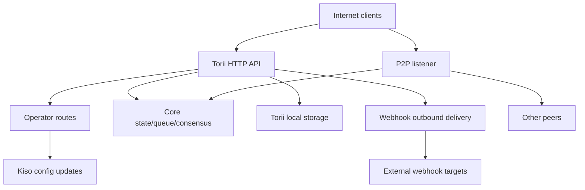

<!-- Auto-generated stub for Urdu (ur) translation. Replace this content with the full translation. -->

---
lang: ur
direction: rtl
source: iroha-threat-model.md
status: complete
generator: scripts/sync_docs_i18n.py
source_hash: 766928cf0dcbfe3513c728bcf0b9fa697a330e8000bc6944ab61e8fcd59751ad
source_last_modified: "2026-02-07T13:27:25.009145+00:00"
translation_last_reviewed: 2026-04-02
translator: machine-google-reviewed
---

# Iroha تھریٹ ماڈل (ریپو: `iroha`)

## ایگزیکٹو خلاصہ
انٹرنیٹ سے بے نقاب پبلک بلاکچین تعیناتی میں جہاں آپریٹر کے راستے عوامی انٹرنیٹ سے جان بوجھ کر قابل رسائی ہوتے ہیں لیکن درخواست کے دستخطوں کے ذریعے ان کی توثیق کی جانی چاہیے، اور جہاں عوامی Torii اختتامی نقطہ پر ویب ہکس/اٹیچمنٹ کو فعال کیا جاتا ہے، سب سے زیادہ خطرات یہ ہیں: آپریٹر کے ذریعے ہوائی جہاز پر دستخط کیے جانے کے قابل یا پھر سے سمجھوتہ کرنے کی درخواست `/v1/configuration` اور دیگر آپریٹر روٹس)، SSRF اور ویب ہُک ڈیلیوری کے ذریعے آؤٹ باؤنڈ بدسلوکی، اور ٹرانزیکشن/کوئیری + اسٹریمنگ اینڈ پوائنٹس کے ذریعے ہائی لیوریج DoS جہاں شرح کی حدیں مشروط طور پر نافذ ہیں؛ مزید برآں، کوئی بھی "mTLS درکار" کرنسی جو `x-forwarded-client-cert` کی موجودگی پر انحصار کرتی ہے، جب Torii براہ راست بے نقاب ہو جائے تو اس سے قابل اعتراض ہے۔ ثبوت: `crates/iroha_torii/src/lib.rs` (راؤٹر + مڈل ویئر + آپریٹر روٹس)، `crates/iroha_torii/src/operator_auth.rs` (آپریٹر auth enable/disable + `x-forwarded-client-cert` چیک)، `crates/iroha_torii/src/webhook.rs` (آؤٹ باؤنڈ HTTP کلائنٹ)، I1000008 کی حد بندی کی شرح

## دائرہ کار اور مفروضاتدائرہ کار میں (رن ٹائم / پیداواری سطحیں):
- Torii HTTP API سرور اور مڈل ویئر، بشمول "آپریٹر" روٹس، ایپ API، ویب ہکس، منسلکات، مواد، اور اسٹریمنگ اینڈ پوائنٹس: `crates/iroha_torii/`، `crates/iroha_torii_shared/`
- نوڈ بوٹسٹریپ اور اجزاء کی وائرنگ (Torii + P2P + state/queue/config اپ ڈیٹ ایکٹر): `crates/irohad/src/main.rs`
- P2P ٹرانسپورٹ اور مصافحہ کی سطحیں: `crates/iroha_p2p/`
- کنفیگریشن کی شکلیں اور ڈیفالٹس (خاص طور پر Torii auth defaults): `crates/iroha_config/src/parameters/{actual,defaults}.rs`
- کلائنٹ کا سامنا کرنے والی تشکیل اپ ڈیٹ DTO (`/v1/configuration` کیا تبدیل کر سکتا ہے): `crates/iroha_config/src/client_api.rs`
- تعیناتی پیکیجنگ کی بنیادی باتیں: `Dockerfile`، اور `defaults/` میں مثال کی تشکیلات (پروڈکشن میں ایمبیڈڈ مثال کی کلیدیں استعمال نہ کریں)۔

دائرہ سے باہر (جب تک کہ واضح طور پر درخواست نہ کی جائے):
- CI ورک فلوز اور ریلیز آٹومیشن: `.github/`, `ci/`, `scripts/`
- موبائل/کلائنٹ SDKs اور ایپس: `IrohaSwift/`, `java/`, `examples/`
- صرف دستاویزی مواد: `docs/`واضح مفروضے (آپ کی وضاحتوں کی بنیاد پر):
- Torii انٹرنیٹ سے بے نقاب ہے اور غیر تصدیق شدہ کلائنٹس کے ذریعہ قابل رسائی ہے (کچھ اختتامی نکات کو اب بھی دستخطوں یا دیگر تصدیق کی ضرورت ہو سکتی ہے)۔
- آپریٹر روٹس (`/v1/configuration`، `/v1/nexus/lifecycle`، اور فعال ہونے پر آپریٹر گیٹڈ ٹیلی میٹری/پروفائلنگ) کا مقصد عوامی طور پر قابل رسائی ہونا ہے اور آپریٹر کے زیر کنٹرول نجی کلید سے دستخط کے ذریعے تصدیق ہونی چاہیے۔ ثبوت (موجودہ حالت): `crates/iroha_torii/src/lib.rs` (`add_core_info_routes` لاگو ہوتا ہے `operator_layer`)، `crates/iroha_torii/src/operator_auth.rs` (`enforce_operator_auth` / `authorize_operator_endpoint`)
- آپریٹر کے دستخط کی تصدیق کے لیے آپریٹر پبلک کیز کی کنفیگریشن میں نوڈ-لوکل اجازت کی فہرست کا استعمال کرنا چاہیے (موجودہ راؤٹر میں نافذ آپریٹر گیٹ کے طور پر نہیں دکھایا گیا)۔ موجودہ آپریٹر گیٹ کا ثبوت: `crates/iroha_torii/src/operator_auth.rs` (`authorize_operator_endpoint`)، اور موجودہ کینونیکل درخواست پر دستخط کرنے والے مددگار (پیغام کی تعمیر): `crates/iroha_torii/src/app_auth.rs` (`canonical_request_message`)۔
- ضروری نہیں کہ Torii قابل اعتماد داخلے کے پیچھے تعینات کیا گیا ہو۔ لہذا، `x-forwarded-client-cert` جیسے ہیڈرز کو حملہ آور کے زیر کنٹرول سمجھا جانا چاہیے جب Torii براہ راست بے نقاب ہو۔ ثبوت: `crates/iroha_torii/src/lib.rs` (`HEADER_MTLS_FORWARD`, `norito_rpc_mtls_present`) اور `crates/iroha_torii/src/operator_auth.rs` (`HEADER_MTLS_FORWARD`, `mtls_present`)۔
- ویب ہکس اور منسلکات عوامی Torii اینڈ پوائنٹ پر فعال ہیں۔ ثبوت: `crates/iroha_torii/src/lib.rs` (`/v1/webhooks` اور `/v1/zk/attachments` کے راستے)، `crates/iroha_torii/src/webhook.rs`، `crates/iroha_torii/src/zk_attachments.rs`۔- آپریٹر `torii.require_api_token = false` سیٹ یا رکھ سکتا ہے (پہلے سے طے شدہ `false` ہے)۔ ثبوت: `crates/iroha_config/src/parameters/defaults.rs` (`torii::REQUIRE_API_TOKEN`)۔
- `/transaction` اور `/query` عوامی سلسلہ کے لیے قابل رسائی ہونے کی توقع ہے۔ نوٹ: وہ اضافی طور پر "Norito-RPC" رول آؤٹ مرحلے اور اختیاری "mTLS درکار" ہیڈر کی موجودگی کی جانچ کے ذریعے گیٹ کیے گئے ہیں۔ ثبوت: `crates/iroha_torii/src/lib.rs` (`ConnScheme::from_request`, `evaluate_norito_rpc_gate`) اور `crates/iroha_config/src/parameters/defaults.rs` (`torii::transport::norito_rpc::STAGE = "disabled"`)۔

ایسے سوالات کھولیں جو خطرے کی درجہ بندی کو مادی طور پر تبدیل کر دیں گے:
- آپریٹر پبلک کیز کو کہاں کنفیگر کیا جاتا ہے (کون سی کنفیگریشن کلید/فارمیٹ)، اور کیز کی شناخت/روٹیٹ کیسے کی جاتی ہے (کی آئی ڈی، ایک سے زیادہ فعال کیز، منسوخی)؟
- درست آپریٹر دستخط کرنے والے پیغام کی شکل اور ری پلے پروٹیکشن کیا ہے (ٹائم اسٹیمپ/نونس/کاؤنٹر + سرور سائیڈ ری پلے کیش)، اور کون سی کلاک سکیو پالیسی قابل قبول ہے؟ اس بات کا ثبوت کہ موجودہ کینونیکل درخواست مددگار میں کوئی تازگی نہیں ہے: `crates/iroha_torii/src/app_auth.rs` (`canonical_request_message`)۔
- گمنام ویب ہکس کے لیے، کیا Torii سے من مانی منزلوں کی اجازت کی توقع ہے، یا اسے SSRF منزل کی پالیسی نافذ کرنی چاہیے (RFC1918/localhost/link-local/metadata کو بلاک کریں اور اختیاری طور پر HTTPS کی ضرورت ہو)؟
- آپ کی تعمیر میں کون سی Torii خصوصیات فعال ہیں (`telemetry`, `profiling`, `p2p_ws`, `app_api_https`, `app_api_wss`)، اور I001 مواد استعمال کیا گیا ہے؟ ثبوت: `crates/iroha_torii/Cargo.toml` (`[features]`)۔

## سسٹم ماڈل### بنیادی اجزاء
- **انٹرنیٹ کلائنٹس** (والٹس، انڈیکسرز، ایکسپلورر، بوٹس): HTTP/Norito درخواستیں بھیجیں اور WS/SSE کنکشن کھولیں۔
- **Torii (HTTP API)**: پری تصنیف گیٹنگ کے لیے مڈل ویئر کے ساتھ ایکسم راؤٹر، اختیاری API ٹوکن انفورسمنٹ، API ورژن گفت و شنید، ریموٹ ایڈریس انجیکشن، اور میٹرکس۔ ثبوت: `crates/iroha_torii/src/lib.rs` (`create_api_router`, `enforce_preauth`, `enforce_api_token`, `enforce_api_version`, `inject_remote_addr_header`)۔
- **آپریٹر/تصدیق کنٹرول طیارہ (موجودہ) اور مطلوبہ کرنسی**: آپریٹر کے راستے فی الحال `operator_auth::enforce_operator_auth` (WebAuthn/tokens؛ کنفیگریشن کے ذریعے مؤثر طریقے سے غیر فعال کیے جاسکتے ہیں) کے ذریعے محفوظ ہیں، لیکن آپ کی تعیناتی کی ضرورت دستخط کی بنیاد پر آپریٹر کی تصدیق ہے جس کی تصدیق کنفیگریشن کی عوامی فہرست میں آپریٹر کی تصدیق شدہ ہے۔ ایک کیننیکل ریکوئسٹ میسج ہیلپر موجود ہے اور اسے میسج کی تعمیر کے لیے دوبارہ استعمال کیا جا سکتا ہے، لیکن تصدیق کو کنفگ کیز (عالمی ریاست کے اکاؤنٹس نہیں) استعمال کرنے کے لیے ڈھالنے کی ضرورت ہوگی۔ ثبوت: `crates/iroha_torii/src/lib.rs` (`add_core_info_routes` `operator_layer` استعمال کرتا ہے)، `crates/iroha_torii/src/operator_auth.rs` (`authorize_operator_endpoint`)، `crates/iroha_torii/src/app_auth.rs` (`crates/iroha_torii/src/app_auth.rs` (Sumeragi)۔- **بنیادی نوڈ اجزاء (ان-پراسیس)**: لین دین کی قطار، ریاست/WSV، اتفاق رائے (Sumeragi)، بلاک اسٹوریج (Kura)، کنفگ اپ ڈیٹ ایکٹر (Kiso)، وغیرہ، Torii میں منتقل ہوئے۔ ثبوت: `crates/irohad/src/main.rs` (`Torii::new_with_handle(...)` `queue`، `state`، `kura`، `kiso`، `kiso`، `queue` وصول کرتا ہے، اور شروع ہوا ہے `torii.start(...)`)۔
- **P2P نیٹ ورکنگ**: انکرپٹڈ، فریم شدہ پیئر ٹو پیئر ٹرانسپورٹ اور ہینڈ شیک؛ اختیاری TLS-over-TCP موجود ہے لیکن سرٹیفکیٹ کی تصدیق پر جان بوجھ کر اجازت دی جاتی ہے۔ ثبوت: `crates/iroha_p2p/src/lib.rs` (قسم عرف `NetworkHandle<..., X25519Sha256, ChaCha20Poly1305>`)، `crates/iroha_p2p/src/transport.rs` (`p2p_tls` ماڈیول `NoCertificateVerification` کے ساتھ)۔
- **Torii مقامی استقامت**: منسلکات/ویب ہکس/قطار کے لیے `./storage/torii` ڈیفالٹ بیس ڈائر۔ ثبوت: `crates/iroha_config/src/parameters/defaults.rs` (`torii::data_dir()`)، `crates/iroha_torii/src/webhook.rs` (مسلسل `webhooks.json`)، `crates/iroha_torii/src/zk_attachments.rs` (`./storage/torii/zk_attachments/` کے تحت ذخیرہ شدہ)۔
- **آؤٹ باؤنڈ ویب ہُک اہداف**: Torii صوابدیدی `http://` URLs (اور `https://`/`ws(s)://` صرف خصوصیات کے ساتھ) ایونٹس ڈیلیور کر سکتا ہے۔ ثبوت: `crates/iroha_torii/src/webhook.rs` (`http_post_plain`, `http_post_https`, `ws_send`)۔### ڈیٹا کا بہاؤ اور اعتماد کی حدود
- انٹرنیٹ کلائنٹ → Torii HTTP API
  - ڈیٹا: Norito بائنری (`SignedTransaction`، `SignedQuery`)، JSON DTOs (app API)، WS/SSE سبسکرپشنز، ہیڈر (بشمول `x-api-token`)۔
  - چینل: HTTP/1.1 + WebSocket + SSE (axum)۔
  - ضمانتیں: اختیاری API ٹوکن (`torii.require_api_token`)، پری تصنیف کنکشن/ریٹ گیٹنگ، API ورژن گفت و شنید؛ بہت سے ہینڈلرز فی اینڈ پوائنٹ کی شرح کو مشروط طور پر محدود کرتے ہوئے لاگو کرتے ہیں (جب `enforce=false` کو نظرانداز کیا جا سکتا ہے)۔ ثبوت: `crates/iroha_torii/src/lib.rs` (`enforce_preauth`, `validate_api_token`, `handler_post_transaction`, `handler_signed_query`), `crates/iroha_torii/src/limits.rs` (`crates/iroha_torii/src/limits.rs` (Sumeragi)۔
  - توثیق: کچھ اختتامی پوائنٹس پر باڈی کی حدیں (جیسے، لین دین)، Norito ڈیکوڈنگ، کچھ ایپ اینڈ پوائنٹس کے لیے دستخط کرنے کی درخواست (کیننیکل درخواست ہیڈر)۔ ثبوت: `crates/iroha_torii/src/lib.rs` (`add_transaction_routes` استعمال کرتا ہے `DefaultBodyLimit::max(...)`)، `crates/iroha_torii/src/app_auth.rs` (`verify_canonical_request`)۔- انٹرنیٹ کلائنٹ → "آپریٹر" روٹس (Torii)
  - ڈیٹا: تشکیل اپ ڈیٹس (`ConfigUpdateDTO`)، لین لائف سائیکل پلانز، ٹیلی میٹری/ڈیبگ/سٹیٹس/میٹرکس (جب فعال ہو)۔
  - چینل: HTTP۔
  - گارنٹیز: موجودہ ریپو ان راستوں کو `operator_auth::enforce_operator_auth` مڈل ویئر کے ساتھ گیٹ کرتا ہے، جو `torii.operator_auth.enabled=false` پر مؤثر طریقے سے کوئی کام نہیں ہے۔ آپ کی مطلوبہ کرنسی کنفگ سے آپریٹر پبلک کیز کا استعمال کرتے ہوئے دستخط پر مبنی توثیق ہے، جسے اس باؤنڈری پر لاگو اور نافذ کیا جانا چاہیے (اور اگر Torii براہ راست بے نقاب ہو تو `x-forwarded-client-cert` پر انحصار نہیں کرنا چاہیے)۔ ثبوت: `crates/iroha_torii/src/lib.rs` (`add_core_info_routes` لاگو ہوتا ہے `operator_layer`)، `crates/iroha_torii/src/operator_auth.rs` (`authorize_operator_endpoint`، `mtls_present`)۔
  - توثیق: زیادہ تر ڈی ٹی او پارسنگ؛ خود `handle_post_configuration` میں کوئی خفیہ نگاری کی اجازت نہیں ہے (یہ `kiso.update_with_dto` کو تفویض کرتا ہے)۔ ثبوت: `crates/iroha_torii/src/routing.rs` (`handle_post_configuration`)۔

- Torii → بنیادی قطار/ریاست/اتفاق (عمل میں)
  - ڈیٹا: لین دین کی گذارشات، استفسارات پر عمل درآمد، ریاست پڑھنا/لکھنا، متفقہ ٹیلی میٹری سوالات۔
  - چینل: ان پروسیس رسٹ کالز (مشترکہ `Arc` ہینڈلز)۔
  - ضمانتیں: فرض کردہ قابل اعتماد حد؛ سیکورٹی کا انحصار Torii پر ہے کہ مراعات یافتہ کارروائیوں کو شروع کرنے سے پہلے درخواستوں کی درست طریقے سے تصدیق/مجاز ہے۔ ثبوت: `crates/irohad/src/main.rs` (`Torii::new_with_handle(...)` وائرنگ) اور Torii ہینڈلرز `routing::handle_*` کو کال کر رہے ہیں۔- Torii → Kiso (کنفگ اپ ڈیٹ ایکٹر)
  - ڈیٹا: `ConfigUpdateDTO` لاگنگ، P2P ACL، نیٹ ورک/ٹرانسپورٹ کی ترتیبات، SoraNet ہینڈ شیک، وغیرہ میں ترمیم کر سکتا ہے۔
  - چینل: ان پروسیس میسج/ہینڈل۔
  - ضمانتیں: Torii باؤنڈری پر اجازت متوقع ہے۔ اپ ڈیٹ ڈی ٹی او خود قابلیت کا حامل ہے۔ ثبوت: `crates/iroha_config/src/client_api.rs` (`ConfigUpdateDTO` فیلڈز میں `network_acl`، `transport.norito_rpc`، `soranet_handshake`، وغیرہ شامل ہیں)۔

- Torii → لوکل ڈسک (`./storage/torii`)
  - ڈیٹا: ویب ہک رجسٹری اور قطار میں بند ترسیل؛ منسلکات اور سینیٹائزر میٹا ڈیٹا؛ GC/TTL سلوک۔
  - چینل: فائل سسٹم۔
  - گارنٹیز: مقامی OS کی اجازتیں (ڈاکرفائل میں کنٹینر نان روٹ کے طور پر چلتا ہے)؛ "کرایہ دار" کے ذریعہ منطقی تنہائی API ٹوکن یا مڈل ویئر کے ذریعہ لگائے گئے ریموٹ IP ہیڈر پر مبنی ہے۔ ثبوت: `Dockerfile` (`USER iroha`), `crates/iroha_torii/src/lib.rs` (`inject_remote_addr_header`, `zk_attachments_tenant`)۔

- Torii → ویب ہک اہداف (آؤٹ باؤنڈ)
  - ڈیٹا: ایونٹ پے لوڈز + دستخطی ہیڈر۔
  - چینل: خام TCP HTTP کلائنٹ `http://` کے لیے؛ فعال ہونے پر `https://` کے لیے اختیاری `hyper+rustls`؛ اختیاری WS/WSS فعال ہونے پر۔
  - ضمانتیں: ٹائم آؤٹ/دوبارہ کوششیں؛ کوڈ میں منزل کی اجازت کی کوئی فہرست نظر نہیں آتی ہے۔ اگر ویب ہک CRUD کھلا ہے تو URL حملہ آور سے متاثر ہے۔ ثبوت: `crates/iroha_torii/src/webhook.rs` (`handle_create_webhook`, `http_post_plain/http_post`)۔- P2P پیئرز (ناقابل اعتماد نیٹ ورک) → P2P ٹرانسپورٹ/ہینڈ شیک
  - ڈیٹا: ہینڈ شیک پریفیس/میٹا ڈیٹا، فریم شدہ خفیہ کردہ پیغامات، اتفاق رائے کے پیغامات۔
  - چینل: P2P ٹرانسپورٹ (TCP/QUIC/etc، خصوصیت پر منحصر)، خفیہ کردہ پے لوڈز؛ اختیاری TLS-over-TCP سرٹیفیکیشن پر واضح طور پر قابل اجازت ہے۔
  - ضمانتیں: درخواست کی پرت پر خفیہ کاری اور دستخط شدہ مصافحہ؛ ٹرانسپورٹ لیئر TLS سرٹیفکیٹ کے ذریعہ تصدیق نہیں کرتا ہے۔ ثبوت: `crates/iroha_p2p/src/lib.rs` (انکرپشن کی اقسام)، `crates/iroha_p2p/src/transport.rs` (`NoCertificateVerification` تبصرہ اور نفاذ)۔

#### خاکہ

## اثاثے اور حفاظتی مقاصد| اثاثہ | یہ کیوں اہم ہے | حفاظتی مقصد (C/I/A) |
|---|---|---|
| سلسلہ ریاست / WSV / بلاکس | سالمیت کی ناکامیاں اتفاق رائے کی ناکامیاں بن جاتی ہیں۔ دستیابی کی ناکامیوں کا سلسلہ رک جاتا ہے | I/A |
| متفقہ لائیونس (Sumeragi) | عوامی بلاکچین ویلیو کا انحصار بلاک کی مستقل پیداوار پر ہے | ایک |
| نوڈ نجی چابیاں (ہم مرتبہ کی شناخت، دستخط کی چابیاں) | کلیدی سمجھوتہ شناخت پر قبضہ کرنے، غلط استعمال پر دستخط کرنے، یا نیٹ ورک کی تقسیم کے قابل بناتا ہے۔ C/I |
| رن ٹائم کنفیگریشن (کیسو اپ ڈیٹ شدہ) | نیٹ ورک ACLs اور ٹرانسپورٹ کی ترتیبات کو کنٹرول کرتا ہے۔ غلط استعمال تحفظات کو غیر فعال کر سکتا ہے یا بدنیتی پر مبنی ساتھیوں کو تسلیم کر سکتا ہے | میں |
| لین دین کی قطار / mempool | سیلاب اتفاق رائے کو ختم کر سکتا ہے اور CPU/میموری کو ختم کر سکتا ہے۔ ایک |
| Torii استقامت (`./storage/torii`) | ڈسک کی تھکن نوڈ کو کریش کر سکتی ہے۔ ذخیرہ شدہ ڈیٹا ڈاؤن اسٹریم پروسیسنگ پر اثر انداز ہوسکتا ہے | A (اور کبھی کبھی C/I) |
| آؤٹ باؤنڈ ویب ہک چینل | SSRF کے لیے غلط استعمال کیا جا سکتا ہے، اندرونی نیٹ ورکس سے ڈیٹا اکٹھا کرنا، یا قابل بھروسہ ایگریس آئی پی سے اسکین کرنا۔ C/I/A |
| ٹیلی میٹری/میٹرکس/ڈیبگ ڈیٹا | ٹارگٹڈ حملوں کے لیے مفید نیٹ ورک ٹوپولوجی اور آپریشنل اسٹیٹ کو لیک کر سکتا ہے | سی |

## حملہ آور ماڈل### صلاحیتیں۔
- ریموٹ، غیر تصدیق شدہ انٹرنیٹ حملہ آور صوابدیدی HTTP درخواستیں بھیج سکتا ہے، طویل المدت WS/SSE کنکشن رکھ سکتا ہے، اور پے لوڈز (بوٹ نیٹ) کو دوبارہ چلا سکتا ہے یا سپرے کر سکتا ہے۔
- کوئی بھی پارٹی چابیاں تیار کر سکتی ہے اور دستخط شدہ لین دین/سوالات (عوامی بلاکچین) جمع کر سکتی ہے، بشمول ہائی والیوم سپیم۔
- بدنیتی پر مبنی/ سمجھوتہ کرنے والا ہم مرتبہ P2P سے منسلک ہو سکتا ہے اور پروٹوکول کے غلط استعمال، سیلاب، یا مصافحہ کرنے کی اجازت کے اندر ہیرا پھیری کی کوشش کر سکتا ہے۔
- اگر ویب ہک CRUD بے نقاب ہو جاتا ہے تو حملہ آور حملہ آور کے زیر کنٹرول ویب ہُک یو آر ایل کو رجسٹر کر سکتا ہے اور آؤٹ باؤنڈ کال بیکس وصول کر سکتا ہے (اور ممکنہ طور پر انہیں اندرونی منزلوں تک لے جا سکتا ہے)۔

### غیر صلاحیتیں۔
- کسی بے نقاب اختتامی نقطہ یا غلط کنفیگر شدہ حجم کی اجازتوں کے بغیر کوئی براہ راست مقامی فائل سسٹم تک رسائی نہیں ہے۔
- کلیدی سمجھوتے کے بغیر موجودہ ہم مرتبہ/آپریٹر کیز کے لیے جعلی دستخط کرنے کی صلاحیت نہیں۔
- عام حالات میں جدید خفیہ نگاری (X25519, ChaCha20-Poly1305, Ed25519) کو توڑنے کی کوئی فرضی صلاحیت نہیں۔

## داخلے کے مقامات اور حملے کی سطحیں۔| سطح | کیسے پہنچا | اعتماد کی حد | نوٹس | ثبوت (ریپو پاتھ / علامت) |
|---|---|---|---|---|
| `POST /transaction` | انٹرنیٹ HTTP | انٹرنیٹ → Torii | Norito بائنری دستخط شدہ لین دین؛ شرح کو محدود کرنا مشروط ہے (`enforce` غلط ہو سکتا ہے) | `crates/iroha_torii/src/lib.rs` (`handler_post_transaction`, `ConnScheme::from_request`) |
| `POST /query` | انٹرنیٹ HTTP | انٹرنیٹ → Torii | Norito بائنری پر دستخط شدہ استفسار؛ شرح کو محدود کرنا مشروط ہے (`enforce` غلط ہو سکتا ہے) | `crates/iroha_torii/src/lib.rs` (`handler_signed_query`) |
| Norito-RPC گیٹ | انٹرنیٹ HTTP ہیڈر | انٹرنیٹ → Torii | رول آؤٹ اسٹیج + اختیاری "mTLS درکار" ہیڈر کی موجودگی کے ذریعے؛ کینری `x-api-token` استعمال کرتا ہے۔ `crates/iroha_torii/src/lib.rs` (`evaluate_norito_rpc_gate`, `HEADER_MTLS_FORWARD`) |
| `POST/GET/DELETE /v1/webhooks...` | انٹرنیٹ HTTP (ایپ API) | انٹرنیٹ → Torii → آؤٹ باؤنڈ | ڈیزائن کے لحاظ سے گمنام؛ webhook CRUD صوابدیدی URLs کو آؤٹ باؤنڈ ڈیلیوری کے قابل بناتا ہے۔ SSRF خطرہ | `crates/iroha_torii/src/lib.rs` (`handler_webhooks_*`), `crates/iroha_torii/src/webhook.rs` (`http_post`) |
| `POST/GET /v1/zk/attachments...` | انٹرنیٹ HTTP (ایپ API) | انٹرنیٹ → Torii → ڈسک | ڈیزائن کے لحاظ سے گمنام؛ اٹیچمنٹ سینیٹائزر + ڈیکمپریشن + استقامت؛ ڈسک/سی پی یو کی تھکن کی سطح (کرایہ داری API ٹوکن ہے اگر فعال ہو، ورنہ ریموٹ آئی پی بذریعہ انجیکشن ہیڈر) | `crates/iroha_torii/src/lib.rs` (`handler_zk_attachments_*`, `zk_attachments_tenant`), `crates/iroha_torii/src/zk_attachments.rs` || `GET /v1/content/{bundle}/{path...}` | انٹرنیٹ HTTP | انٹرنیٹ → Torii → state/storage | تصنیف کے طریقوں کو سپورٹ کرتا ہے + PoW + رینج؛ اخراج محدود | `crates/iroha_torii/src/content.rs` (`handle_get_content`, `enforce_pow`, `enforce_auth`) |
| سلسلہ بندی: `/v1/events/sse`, `/events` (WS), `/block/stream` (WS) | انٹرنیٹ | انٹرنیٹ → Torii | دیرپا کنکشن؛ DoS سطح | `crates/iroha_torii/src/lib.rs` (`add_network_stream_routes`) |
| `GET/POST /v1/configuration` | انٹرنیٹ HTTP | انٹرنیٹ → آپریٹر روٹس → Kiso | تعیناتی کا ارادہ: آپریٹر کے دستخط کنفگ ایو لسٹ کیز کے خلاف تصدیق شدہ۔ موجودہ ریپو صرف آپریٹر مڈل ویئر کے ذریعے اس کی حفاظت کرتا ہے (روٹ گروپ پر کوئی دستخطی گیٹ نہیں دکھایا گیا) اور ڈیلیگیٹس اپ ڈیٹ ایپلی کیشن Kiso | `crates/iroha_torii/src/lib.rs` (`add_core_info_routes`, `handler_post_configuration`), `crates/iroha_torii/src/operator_auth.rs` (`enforce_operator_auth`), `crates/iroha_torii/src/routing.rs` (`crates/iroha_torii/src/routing.rs`)، `crates/iroha_torii/src/routing.rs` کیننیکل درخواست پر دستخط کرنے والا مددگار) |
| `POST /v1/nexus/lifecycle` | انٹرنیٹ HTTP | انٹرنیٹ → آپریٹر روٹس → کور | آپریٹر کا اختتامی نقطہ دستخط سے تصدیق شدہ ہونا ہے۔ فی الحال آپریٹر مڈل ویئر کے ذریعہ محفوظ ہے اور اگر آپریٹر کی تصدیق غیر فعال ہے تو عوامی بن سکتا ہے۔ `crates/iroha_torii/src/lib.rs` (`add_core_info_routes`, `handler_post_nexus_lane_lifecycle`), `crates/iroha_torii/src/operator_auth.rs` (`authorize_operator_endpoint`) || ٹیلی میٹری/پروفائلنگ اینڈ پوائنٹس (فیچر گیٹڈ) | انٹرنیٹ HTTP | انٹرنیٹ → آپریٹر روٹس | آپریٹر گیٹڈ روٹ گروپس؛ اگر آپریٹر کی تصدیق غیر فعال ہے اور کوئی دستخطی گیٹ موجود نہیں ہے، تو یہ عوامی ہو جاتے ہیں اور آپریشنل ڈیٹا کو لیک کر سکتے ہیں یا DoS ویکٹر ہو سکتے ہیں | `crates/iroha_torii/src/lib.rs` (`add_telemetry_routes`, `add_profiling_routes`), `crates/iroha_torii/src/operator_auth.rs` (`authorize_operator_endpoint`) |
| P2P TCP/TLS ٹرانسپورٹ | انٹرنیٹ / ہم مرتبہ نیٹ ورک | انٹرنیٹ/ساتھی → P2P | خفیہ کردہ P2P فریم + ہینڈ شیک؛ فعال ہونے پر TLS سرٹیفیکیشن کی اجازت ہے | `crates/iroha_p2p/src/lib.rs` (`NetworkHandle`), `crates/iroha_p2p/src/transport.rs` (`p2p_tls::NoCertificateVerification`) |

## بدسلوکی کے سرفہرست راستے

1. **حملہ آور کا مقصد: رن ٹائم کنفیگریشن اپ ڈیٹس کے ذریعے نوڈ رویے پر قبضہ کریں**
   1) انٹرنیٹ سے بے نقاب Torii تلاش کریں جہاں آپریٹر کے راستے قابل رسائی ہیں اور آپریٹر کی توثیق غیر حاضر/بائی پاس کے قابل ہے (مثال کے طور پر، آپریٹر کی توثیق غیر فعال ہے اور کوئی دستخطی گیٹ نہیں ہے)۔  
   2) `POST /v1/configuration` ایک `ConfigUpdateDTO` کے ساتھ جو نیٹ ورک ACLs کو ڈھیلا کرتا ہے یا ٹرانسپورٹ کی ترتیبات کو تبدیل کرتا ہے۔  
   3) ہم مرتبہ کے طور پر شامل ہوں یا پارٹیشن/غلط کنفیگریشن کی حوصلہ افزائی کریں؛ حملہ آور کے زیر کنٹرول انفراسٹرکچر کے ذریعے اتفاق رائے اور/یا روٹ لین دین کو کم کرنا۔  
   اثر: نوڈ (اور ممکنہ طور پر نیٹ ورک) کی سالمیت اور دستیابی کا سمجھوتہ۔2. **حملہ آور کا مقصد: آپریٹر کی دستخط شدہ درخواست کو دوبارہ چلائیں**
   1) ایک درست دستخط شدہ آپریٹر کی درخواست حاصل کریں (مثلاً سمجھوتہ شدہ آپریٹر مشین، غلط کنفیگرڈ پراکسی لاگز، یا ایسا ماحول جہاں TLS کو غیر محفوظ طریقے سے ختم کر دیا گیا ہو)۔  
   2) اسی درخواست کو عوامی آپریٹر روٹس کے خلاف دوبارہ چلائیں اگر دستخطی اسکیم میں تازگی (ٹائم اسٹیمپ/نونس) اور سرور کی طرف سے ری پلے مسترد نہ ہو۔  
   3) کنفیگریشن میں بار بار تبدیلیاں، رول بیکس، یا زبردستی ٹوگلز کی وجہ سے جو دستیابی کو کم کرتے ہیں یا دفاع کو کمزور کرتے ہیں۔  
   اثر: "دستخط کی توثیق" کے باوجود سالمیت/ دستیابی سے سمجھوتہ۔  

3. **حملہ آور کا مقصد: Norito-RPC رول آؤٹ کو تبدیل کرکے غیر فعال/گیٹ تحفظات**
   1) `POST /v1/configuration` `transport.norito_rpc.stage` یا `require_mtls` کو اپ ڈیٹ کرنے کے لیے۔  
   2) زبردستی کھولیں یا زبردستی بند کریں `/transaction` اور `/query`، دستیابی اور داخلے کے کنٹرول کو متاثر کرتے ہیں۔  
   اثر: ٹارگٹڈ بندش یا داخلہ کنٹرول بائی پاس۔4. **حملہ آور کا مقصد: آپریٹر کے اندرونی نیٹ ورک میں SSRF**
   1) `POST /v1/webhooks` کے ذریعے داخلی منزل (جیسے RFC1918 ہوسٹ، میٹا ڈیٹا IP، کنٹرول پلین) کی طرف اشارہ کرنے والا ایک ویب ہک اندراج بنائیں۔  
   2) مماثل واقعات کا انتظار کریں؛ Torii اپنی نیٹ ورک پوزیشن سے آؤٹ باؤنڈ HTTP درخواستیں فراہم کرتا ہے۔  
   3) اندرونی خدمات کی چھان بین کے لیے جوابات/سٹیٹس/ٹائمنگ اور بار بار کوششوں کا استعمال کریں (اور ممکنہ طور پر اگر جوابی مواد کہیں اور منظر عام پر آیا ہو)۔  
   اثر: اندرونی نیٹ ورک کی نمائش، پس منظر کی نقل و حرکت کے سہاروں، ساکھ کو نقصان، میٹا ڈیٹا کے اختتامی پوائنٹس کے ذریعے ممکنہ اسناد کی نمائش۔  

5. **حملہ آور کا مقصد: لین دین/استفسار کے داخلے کی سروس سے انکار کریں**
   1) فلڈ `POST /transaction` اور `POST /query` درست/غلط Norito باڈیز کے ساتھ۔  
   2) بہت سے WS/SSE سبسکرپشنز اور سست کلائنٹس کو برقرار رکھیں۔  
   3) تھروٹلنگ سے بچنے کے لیے نارمل آپریشن میں مشروط شرح محدود کرنے (`enforce=false`) کا فائدہ اٹھائیں۔  
   اثر: CPU/میموری کی تھکن، قطار کی سنترپتی، متفقہ اسٹال۔  

6. **حملہ آور کا مقصد: منسلکات کے ذریعے ایگزاسٹ ڈسک**
   1) فلڈ `/v1/zk/attachments` زیادہ سے زیادہ سائز کے پے لوڈز اور/یا کمپریسڈ آرکائیوز توسیعی حدود کے قریب۔  
   2) فی کرایہ دار کیپس سے بچنے کے لیے ایک سے زیادہ سورس آئی پیز (یا کرایہ دار کی کلیدی کمزوری) کا استعمال کریں۔  
   3) TTL/GC پیچھے رہنے تک برقرار رہیں۔ `./storage/torii` بھریں۔  
   اثر: نوڈ کریش، بلاکس/لین دین پر کارروائی کرنے میں ناکامی۔7. **حملہ آور کا مقصد: جب Torii براہ راست بے نقاب ہو تو "mTLS درکار" گیٹس کو بائی پاس کریں**
   1) آپریٹر Norito-RPC یا آپریٹر کی تصدیق کے لیے `require_mtls` کو فعال کرتا ہے۔  
   2) حملہ آور `x-forwarded-client-cert: <anything>` کے ساتھ درخواستیں بھیجتا ہے۔  
   3) ہیڈر کی موجودگی کا چیک پاس ہو جاتا ہے اگر کوئی قابل اعتماد اندراج ہیڈر کو نہیں ہٹاتا ہے۔  
   اثر: کنٹرول کا غلط استعمال؛ آپریٹر کا خیال ہے کہ mTLS نافذ کیا جاتا ہے جب یہ نہیں ہوتا ہے۔  

8. **حملہ آور کا مقصد: ہم مرتبہ کنیکٹیویٹی کو کم کرنا / وسائل استعمال کرنا**
   1) بدنیتی پر مبنی ساتھی بار بار مصافحہ کرنے کی کوشش کرتا ہے یا زیادہ سے زیادہ سائز کے قریب فریموں کو فلڈ کرتا ہے۔  
   2) سرٹیفکیٹس کی بنیاد پر جلد مسترد ہونے سے بچنے کے لیے اجازت دینے والی ٹرانسپورٹ لیئر TLS (اگر فعال ہو) کا فائدہ اٹھائیں۔  
   اثر: کنکشن چرن، سی پی یو کا استعمال، ہم مرتبہ کی دستیابی میں کمی۔  

9. **حملہ آور کا مقصد: ٹیلی میٹری/ڈیبگ اینڈ پوائنٹس کے ذریعے دوبارہ تلاش کریں**
   1) اگر ٹیلی میٹری/پروفائلنگ فعال ہے اور آپریٹر کی توثیق غائب/بائی پاس ایبل ہے، `/status`، `/metrics`، ڈیبگ روٹس کو سکریپ کریں۔  
   2) وقتی حملوں اور مخصوص اجزاء کو نشانہ بنانے کے لیے لیک شدہ ٹوپولوجی/صحت کا ڈیٹا استعمال کریں۔  
   اثر: حملہ آور کی کامیابی کی شرح میں اضافہ؛ ممکنہ معلومات کا انکشاف۔  

## خطرہ ماڈل ٹیبل| دھمکی کی شناخت | خطرے کا ذریعہ | شرائط | دھمکی آمیز کارروائی | اثر | متاثرہ اثاثے | موجودہ کنٹرول (ثبوت) | خلا | تجویز کردہ تخفیف | پتہ لگانے کے خیالات | امکان | اثر کی شدت | ترجیح |
|---|---|---|---|---|---|---|---|---|---|---|---|---|---|| TM-001 | ریموٹ انٹرنیٹ حملہ آور | Torii انٹرنیٹ سے بے نقاب؛ آپریٹر کے راستے عوامی ہیں؛ آپریٹر کی توثیق غیر حاضر ہے/بائی پاس کرنے کے قابل ہے یا دستخط پر مبنی آپریٹر کی توثیق نافذ نہیں ہے/غلط طور پر لاگو نہیں کی گئی ہے۔ رن ٹائم ترتیب، نیٹ ورک ACLs، یا ٹرانسپورٹ کی ترتیبات کو تبدیل کرنے کے لیے آپریٹر روٹس (جیسے `/v1/configuration`، `/v1/nexus/lifecycle`) کو طلب کریں | نوڈ ٹیک اوور/ پارٹیشن؛ بدنیتی پر مبنی ساتھیوں کو تسلیم کرنا؛ غیر فعال تحفظات | رن ٹائم تشکیل؛ متفقہ زندہ دلی؛ سلسلہ کی سالمیت؛ ہم مرتبہ کیز | آپریٹر روٹس آپریٹر مڈل ویئر کے پیچھے ہیں، لیکن `authorize_operator_endpoint` غیر فعال ہونے پر `Ok(())` لوٹاتا ہے۔ config اپ ڈیٹ ڈیلیگیٹس کو بغیر کسی اضافی تصدیق کے Kiso میں بھیجیں۔ ثبوت: `crates/iroha_torii/src/lib.rs` (`add_core_info_routes`)، `crates/iroha_torii/src/operator_auth.rs` (`authorize_operator_endpoint`)، `crates/iroha_torii/src/routing.rs` (`handle_post_configuration`)، `handle_post_configuration` (Sumeragi) | آپریٹر روٹ گروپس پر دستخط پر مبنی آپریٹر کی سند نہیں دکھائی گئی ہے۔ جب Torii براہ راست بے نقاب ہوتا ہے تو ہیڈر پر مبنی "mTLS" قابل فہم ہے۔ ری پلے تحفظ غیر متعینہ | آپریٹر روٹس کے لیے لازمی دستخط پر مبنی آپریٹر کی توثیق کو لاگو کریں جن کی تصدیق آپریٹر پبلک کیز کی کنفیگریشن کی اجازت یافتہ فہرست کے خلاف ہو (متعدد کلیدوں + کلیدی ids کو سپورٹ کریں)؛ باؤنڈڈ ری پلے کیشے کے ساتھ تازگی (ٹائم اسٹیمپ + نونس) شامل کریں۔ TLS اینڈ ٹو اینڈ نافذ کریں (`x-forwarded-client-cert` پر بھروسہ نہ کریں)؛ آپریٹر کی تمام کارروائیوں پر سخت شرح کی حدود + آڈٹ لاگنگ کا اطلاق کریں | کسی بھی آپریٹر روٹ ہٹ پر الرٹ؛ audit-log config diffs؛ بار بار دستخطوں کا پتہ لگائیں غیر معمولی اپ ڈیٹ کی نگرانی کریںفریکوئنسی اور سورس آئی پیز | اعلیٰ (جب تک دستخط کی توثیق + ری پلے تحفظ نافذ اور نافذ نہ ہو جائے) | ہائی | **تنقیدی** || TM-002 | ریموٹ انٹرنیٹ حملہ آور | Webhook CRUD گمنام اور انٹرنیٹ قابل رسائی ہے۔ کوئی SSRF منزل کی پالیسی نہیں | داخلی/ مراعات یافتہ یو آر ایل کو نشانہ بنانے والے ویب ہکس بنائیں اور ڈیلیوری کو متحرک کریں۔ SSRF، اندرونی سکیننگ، میٹا ڈیٹا کی اسناد کی نمائش، اور آؤٹ باؤنڈ DoS | ویب ہُک چینل؛ اندرونی نیٹ ورک؛ دستیابی | ویب ہکس موجود ہیں؛ ڈیلیوری ٹائم آؤٹ/بیک آف/زیادہ سے زیادہ کوششوں کا استعمال کرتی ہے۔ `http://` ڈیلیوری خام TCP استعمال کرتی ہے۔ ثبوت: `crates/iroha_torii/src/lib.rs` (`handler_webhooks_*`), `crates/iroha_torii/src/webhook.rs` (`handle_create_webhook`, `http_post_plain`, `WebhookPolicy`) | کوئی منزل کی اجازت کی فہرست / آئی پی رینج بلاکس نہیں؛ `http://` کی اجازت ہے۔ DNS ری بائنڈنگ/ری ڈائریکٹ کنٹرولز نظر نہیں آتے۔ webhook CRUD کی شرح کو محدود کرنا مشروط ہے (مستقل حالت میں مؤثر طریقے سے بند ہو سکتا ہے) | ویب ہکس کو فعال رکھیں لیکن SSRF کنٹرولز شامل کریں: پرائیویٹ/لوپ بیک/لنک-لوکل/میٹا ڈیٹا آئی پی رینجز اور میزبان ناموں کو مسدود کریں، حل + پن ایڈریسز، حد ری ڈائریکٹ، کیپ آؤٹ باؤنڈ کنکرنسی؛ کیونکہ تخلیق گمنام ہے، ہمیشہ فی IP کوٹہ + عالمی کیپس شامل کریں اور ویب ہک تخلیق/اپ ڈیٹس کے لیے اختیاری PoW ٹوکن پر غور کریں | لاگ اور میٹرک ویب ہک ہدف URL + حل شدہ IPs؛ مسدود مقامات پر الرٹ؛ نجی-IP کوششوں اور اعلی ناکامی/دوبارہ کوشش کی شرح پر الرٹ؛ مانیٹر ویب ہک CRUD کی شرح اور قطار سنترپتی | ہائی | ہائی | **تنقیدی** || TM-003 | ریموٹ انٹرنیٹ حملہ آور / اسپامر | عوامی `/transaction` اور `/query`; مشروط شرح کو محدود کرنا عام طریقوں میں نافذ نہیں ہے | فلڈ tx/استفسار جمع کرانا، علاوہ WS/SSE اسٹریمز | CPU/میموری کی تھکن؛ قطار سنترپتی؛ اتفاق رائے کے اسٹالز | دستیابی (Torii + اتفاق رائے)؛ قطار/میمپول | پری تصنیف گیٹ فی IP کنکشن کو محدود کرتا ہے اور پابندی لگا سکتا ہے۔ ثبوت: `crates/iroha_torii/src/lib.rs` (`enforce_preauth`), `crates/iroha_torii/src/limits.rs` (`PreAuthGate`) | بہت سے کلیدی شرح محدود کرنے والے مشروط ہوتے ہیں (`enforce=false` جب `allow_conditionally` درست لوٹتا ہے)؛ تقسیم شدہ حملہ آور فی IP حدود کو نظرانداز کرتے ہوئے | انٹرنیٹ کے سامنے آنے پر tx/query/streams کے لیے ہمیشہ آن شرح کی حدیں شامل کریں۔ فیس پالیسی سے آزاد فی اینڈ پوائنٹ کنفیگر ایبل شرح کی حدیں شامل کریں۔ PoW کے ساتھ مہنگے اینڈ پوائنٹس کی حفاظت کریں یا دستخط/اکاؤنٹ پر مبنی کوٹہ کی ضرورت ہے | مانیٹر: preauth مسترد، قطار کی لمبائی، tx/استفسار کی شرح، WS/SSE فعال کنکشن؛ بے ضابطگیوں اور مستقل صلاحیت کی حدوں پر الرٹ | ہائی | ہائی | **اعلی** || TM-004 | ریموٹ انٹرنیٹ حملہ آور | ٹیلی میٹری/پروفائلنگ کی خصوصیات فعال آپریٹر کی توثیق غیر فعال یا دستخطی گیٹ غائب | سکریپ `/status`, `/metrics`، ڈیبگ اینڈ پوائنٹس؛ مہنگی ڈیبگ اسٹیٹس کی درخواست کریں | معلومات کا انکشاف؛ آپریشنل DoS؛ ٹارگٹ اٹیک ایبلمنٹ | ٹیلی میٹری/ڈیبگ ڈیٹا؛ دستیابی | ٹیلی میٹری/پروفائلنگ روٹ گروپس `operator_auth::enforce_operator_auth` کے ساتھ تہہ دار ہیں۔ ثبوت: `crates/iroha_torii/src/lib.rs` (`add_telemetry_routes`, `add_profiling_routes`), `crates/iroha_torii/src/operator_auth.rs` (`authorize_operator_endpoint`) | غیر فعال ہونے پر آپریٹر مڈل ویئر کوئی نہیں ہے۔ دستخط پر مبنی آپریٹر کی توثیق ان روٹ گروپس پر نہیں دکھائی گئی ہے۔ ان روٹ گروپس کے لیے ایک ہی لازمی دستخط پر مبنی آپریٹر تصدیق کی ضرورت ہے۔ جہاں ممکن ہو سخت شرح کی حدود اور رسپانس کیشنگ شامل کریں۔ پہلے سے طے شدہ طور پر عوامی نوڈس پر پروفائلنگ/ڈیبگ اینڈ پوائنٹس کو ظاہر کرنے سے گریز کریں۔ ٹریک رسائی لاگز؛ سکریپنگ پیٹرن اور مسلسل زیادہ لاگت کی درخواستوں پر الرٹ | میڈیم | میڈیم | **درمیانی** || TM-005 | ریموٹ انٹرنیٹ حملہ آور (غلط کنفیگریشن استحصال) | آپریٹر `require_mtls` کو قابل بناتا ہے لیکن Torii براہ راست بے نقاب ہے (یا پراکسی/ہیڈر سینیٹائزیشن کی ضمانت نہیں ہے) "mTLS درکار" چیک کو پورا کرنے کے لیے `x-forwarded-client-cert` Spoof | تحفظ کا غلط احساس؛ Norito-RPC / آپریٹر کی تصدیق پالیسیوں کے لیے بائی پاس گیٹنگ | آپریٹر/تصدیق کی حد؛ داخلہ کنٹرول | `require_mtls` ہیڈر کی موجودگی سے چیک کیا جاتا ہے۔ ثبوت: `crates/iroha_torii/src/lib.rs` (`HEADER_MTLS_FORWARD`, `norito_rpc_mtls_present`), `crates/iroha_torii/src/operator_auth.rs` (`mtls_present`) | Torii پر کلائنٹ سرٹیفکیٹ کی کوئی کرپٹوگرافک تصدیق نہیں ہے۔ بیرونی داخلے کے معاہدے پر انحصار کرتا ہے | جب Torii عوامی طور پر قابل رسائی ہو تو سیکیورٹی کے لیے `x-forwarded-client-cert` پر انحصار نہ کریں۔ اگر mTLS کی ضرورت ہو تو، Torii پر کلائنٹ سرٹیفیکیشن کو نافذ کریں یا کسی قابل اعتماد داخلے پر جو کلائنٹ کے ہیڈر کو ہٹاتا ہے؛ بصورت دیگر انٹرنیٹ کا سامنا کرنے والی تعیناتیوں کے لیے ہیڈر پر مبنی گیٹ کو ہٹا دیں/ نظر انداز کریں | براہ راست Torii تک پہنچنے والی `x-forwarded-client-cert` پر مشتمل کسی بھی درخواست پر الرٹ؛ لاگ گیٹ کے نتائج Norito-RPC اور آپریٹر کی تصدیق؛ اجازت شدہ ٹریفک میں اچانک تبدیلیوں کی نگرانی | ہائی | ہائی | **اعلی** || TM-006 | ریموٹ انٹرنیٹ حملہ آور | منسلکات کے اختتامی مقامات گمنام اور انٹرنیٹ تک رسائی کے قابل ہیں۔ حملہ آور زیادہ سے زیادہ سائز یا کمپریشن بم پے لوڈ بھیج سکتا ہے۔ سی پی یو/ڈسک استعمال کرنے کے لیے سینیٹائزر/ڈیکمپریشن/استقامت کا غلط استعمال کریں۔ نوڈ عدم استحکام؛ ڈسک کی تھکن؛ انحطاط شدہ تھرو پٹ | Torii اسٹوریج؛ دستیابی | اٹیچمنٹ کی حدیں + سینیٹائزر اور زیادہ سے زیادہ توسیع/آرکائیو کی گہرائی موجود ہے۔ ثبوت: `crates/iroha_config/src/parameters/defaults.rs` (`ATTACHMENTS_MAX_BYTES`, `ATTACHMENTS_MAX_EXPANDED_BYTES`, `ATTACHMENTS_MAX_ARCHIVE_DEPTH`, `ATTACHMENTS_SANITIZER_MODE`, `crates/iroha_torii/src/zk_attachments.rs` (Norito)، حد `crates/iroha_torii/src/lib.rs` (`handler_zk_attachments_*`, `zk_attachments_tenant`) | جب API ٹوکن آف ہوتے ہیں تو کرایہ دار کی شناخت زیادہ تر IP پر مبنی ہوتی ہے۔ تقسیم شدہ ذرائع بائی پاس کیپس؛ TTL اب بھی کثیر دن جمع کرنے کی اجازت دیتا ہے | چونکہ اٹیچمنٹس عوامی سطح پر اور گمنام ہونے چاہئیں، عالمی ڈسک کوٹہ + بیک پریشر کو نافذ کریں، ڈیفالٹس (TTL/زیادہ سے زیادہ بائٹس) کو سخت کریں، سینیٹائزر کو OS-لیول سینڈ باکسنگ کے ساتھ سب پروسیس موڈ میں رکھیں، اور تحریروں کے لیے اختیاری PoW گیٹنگ پر غور کریں۔ اس بات کو یقینی بنائیں کہ فی IP کوٹہ جعلی ہیڈرز کے ذریعے نظرانداز نہیں کیا جا سکتا (`inject_remote_addr_header` استعمال کرتے رہیں) | `./storage/torii` کے ڈسک کے استعمال کی نگرانی کریں۔ اٹیچمنٹ کی تخلیق کی شرح، سینیٹائزر کے رد، اور فی کرایہ دار جمع ہونے پر الرٹ؛ ٹریک جی سی وقفہ | میڈیم | ہائی | **اعلی** || TM-007 | بدنیتی پر مبنی پیر | پیر P2P سننے والے تک پہنچ سکتا ہے۔ اختیاری طور پر TLS فعال | سیلاب سے ہاتھ ملانا/فریمز؛ وسائل کی تھکن کی کوشش کریں؛ قبل از وقت مسترد ہونے سے بچنے کے لیے قابل اجازت TLS کا فائدہ اٹھائیں | رابطے میں کمی؛ وسائل جلانا؛ جزوی تقسیم | دستیابی؛ ہم مرتبہ کنیکٹیویٹی | بڑے پیغامات کے لیے خفیہ کردہ فریم + مصافحہ کی غلطیاں۔ ثبوت: `crates/iroha_p2p/src/lib.rs` (`Error::FrameTooLarge`، مصافحہ کی غلطیاں)، `crates/iroha_p2p/src/transport.rs` (`p2p_tls` جائز ہے لیکن ایپ لیئر پر دستخط شدہ مصافحہ متوقع ہے) | نقل و حمل کی پرت کی توثیق نہیں ہوتی۔ اعلی درجے کی تصدیق سے پہلے DoS ممکن ہے؛ per-peer/IP تھروٹلز ناکافی ہو سکتے ہیں۔ فی IP/ASN کنکشن کی سخت حدیں شامل کریں۔ شرح کی حد سے مصافحہ کرنے کی کوششیں؛ عوامی نوڈس پر اجازت یافتہ ہم مرتبہ کیز کی ضرورت پر غور کریں۔ یقینی بنائیں کہ زیادہ سے زیادہ فریم سائز قدامت پسند ہیں؛ غیر مستند ساتھیوں کے لیے بیک پریشر اور ابتدائی ڈراپ شامل کریں | ان باؤنڈ P2P کنکشن کی شرح کی نگرانی؛ بار بار مصافحہ کی ناکامیوں اور فریم میں بہت بڑی غلطیوں پر الرٹ | میڈیم | میڈیم | **درمیانی** || TM-008 | سپلائی چین / آپریٹر کی غلطی | آپریٹر مثال کے طور پر چابیاں / تشکیلات کے ساتھ تعینات کرتا ہے؛ انحصار سمجھوتہ | پہلے سے طے شدہ/مثال کی چابیاں یا غیر محفوظ ڈیفالٹس استعمال کریں۔ انحصار ہائی جیک | کلیدی سمجھوتہ؛ سلسلہ تقسیم؛ شہرت کا نقصان | چابیاں سالمیت دستیابی | Docker نان روٹ چلاتا ہے اور ڈیفالٹس کو `/config` میں کاپی کرتا ہے۔ ثبوت: `Dockerfile` (`USER iroha`, `COPY defaults ...`) | مثال کی تشکیلات میں ایمبیڈڈ مثال پرائیویٹ کیز شامل ہو سکتی ہیں۔ غیر محفوظ ڈیفالٹس جیسے `require_api_token=false` اور `operator_auth.enabled=false` | معلوم مثالی کلیدوں کا پتہ لگاتے وقت سٹارٹ اپ وارننگ/فیل-کلوزڈ چیکس شامل کریں۔ ایک "پبلک نوڈ" سخت کنفیگریشن پروفائل بھیجیں۔ ریلیز پائپ لائن میں `cargo deny`/SBOM چیک کو نافذ کریں | `defaults/` میں رازوں کے لیے CI گیٹنگ؛ غیر محفوظ ترتیب کے امتزاج پر رن ​​ٹائم لاگ انتباہ | میڈیم | ہائی | **اعلی** || TM-009 | ریموٹ انٹرنیٹ حملہ آور | دستخط کی بنیاد پر آپریٹر کی تصدیق تازگی کے بغیر نافذ کی جاتی ہے۔ حملہ آور کم از کم ایک درست دستخط شدہ آپریٹر کی درخواست کا مشاہدہ کر سکتا ہے۔ پبلک آپریٹر روٹس کے خلاف پہلے سے درست دستخط شدہ آپریٹر کی درخواست کو دوبارہ چلائیں۔ بار بار کنفیگریشن تبدیلیاں/رول بیکس؛ ہدف بند بندش؛ دفاع کا کمزور ہونا | رن ٹائم تشکیل؛ دستیابی آڈٹ کی سالمیت | کیننیکل دستخط کرنے والا مددگار طریقہ/پاتھ/ استفسار/ باڈی ہیش سے پیغام بناتا ہے اور اس میں ٹائم اسٹیمپ/ نونس شامل نہیں ہوتا ہے۔ ثبوت: `crates/iroha_torii/src/app_auth.rs` (`canonical_request_message`) | ری پلے پروٹیکشن دستخطوں کے لیے موروثی نہیں ہے۔ آپریٹر روٹس فی الحال ری پلے کیشے/نانس ٹریکنگ نہیں دکھاتے ہیں۔ دستخط شدہ پیغام میں `timestamp` + `nonce` (یا monotonic کاؤنٹر) کو شامل کریں، سخت گھڑی کی سکیو کو نافذ کریں، اور آپریٹر کی شناخت کے ذریعے کلید شدہ ری پلے کیش کو برقرار رکھیں؛ لاگ ان کریں اور ڈپلیکیٹس کو مسترد کریں | ڈپلیکیٹ nonces / درخواست ہیش پر الرٹ؛ شناخت اور ماخذ کے لحاظ سے آپریٹر کی کارروائیوں کو جوڑنا؛ ری پلے ریجیکٹس کے لیے میٹرکس شامل کریں | میڈیم | ہائی | **اعلی** || TM-010 | ریموٹ حملہ آور / اندرونی | آپریٹر پر دستخط کرنے والی پرائیویٹ کلید کو ذخیرہ کیا جاتا ہے جہاں اسے نکالا جا سکتا ہے (ڈسک/ تشکیل/ سی آئی نمونے) آپریٹر کی نجی کلید چوری کریں اور درست دستخط شدہ آپریٹر کی درخواستیں جاری کریں۔ کم پتہ لگانے کے ساتھ مکمل آپریٹر جہاز کا سمجھوتہ | آپریٹر کی چابیاں؛ رن ٹائم تشکیل؛ اجماع لائیونس | کچھ Torii اجزاء پہلے سے ہی config سے نجی کلیدیں لوڈ کرتے ہیں (جیسے، آف لائن جاری کنندہ آپریٹر کی)۔ ثبوت: `crates/iroha_torii/src/lib.rs` (`torii.offline_issuer.operator_private_key` کو `KeyPair` میں پڑھتا ہے)، `Dockerfile` (غیر جڑ کے طور پر چلتا ہے) | کلیدی اسٹوریج/روٹیشن/HSM کا استعمال کوڈ کے ذریعے نافذ نہیں کیا گیا ہے۔ دستخط کی توثیق کو یہ خطرہ وراثت میں ملے گا | جہاں ممکن ہو ہارڈ ویئر کی حمایت یافتہ چابیاں (HSM/secure enclave) استعمال کریں۔ ریپو یا عالمی پڑھنے کے قابل ترتیب میں آپریٹر کیز کو سرایت کرنے سے گریز کریں۔ سخت فائل کی اجازتوں اور گردش کو نافذ کرنا؛ آپریٹر کی کارروائیوں کے لیے ملٹی سگ/تھریشولڈ پر غور کریں | نئے IPs/ASNs سے آپریٹر کی کارروائیوں پر الرٹ؛ آپریٹر کی کارروائیوں کا ایک ناقابل تغیر آڈٹ لاگ برقرار رکھنا؛ شک پر چابیاں گھمائیں | میڈیم | ہائی | **اعلی** |

## تنقیدی انشانکن

اس ریپو + واضح تعیناتی سیاق و سباق کے لئے (انٹرنیٹ سے بے نقاب عوامی سلسلہ؛ آپریٹر کے راستے عوامی ہیں اور ان کا مقصد دستخط سے تصدیق شدہ ہونا؛ کوئی قابل اعتماد داخلے کی ضمانت نہیں ہے)، شدت کی سطح کا مطلب ہے:- **نازک**: ایک دور دراز، غیر تصدیق شدہ حملہ آور نوڈ/نیٹ ورک کے رویے کو تبدیل کر سکتا ہے یا کئی نوڈس میں بلاک پروڈکشن کو قابل اعتماد طریقے سے روک سکتا ہے۔
  - مثالیں: آپریٹر روٹس جیسے `/v1/configuration` (TM-001) کے لیے غائب/بائی پاس ایبل دستخطی سند؛ ویب ہُک SSRF سے میٹا ڈیٹا اینڈ پوائنٹس/کلسٹر کنٹرول ہوائی جہاز سے مراعات یافتہ اخراج (TM-002)؛ آپریٹر کلیدی چوری پر دستخط کر رہا ہے جو درست دستخط شدہ آپریٹر ایکشن (TM-010) کو قابل بناتا ہے۔

- **ہائی**: ایک ریموٹ حملہ آور ایک نوڈ کے مستقل DoS کا سبب بن سکتا ہے یا ایسے سیکیورٹی کنٹرول کو نظرانداز کر سکتا ہے جس پر آپریٹرز بھروسہ کر سکتے ہیں، حقیقت پسندانہ پیشگی شرائط کے ساتھ۔
  - مثالیں: ہائی والیوم tx/استفسار داخلہ DoS جب مشروط شرح کو محدود کرنا غیر فعال ہو (TM-003)؛ اٹیچمنٹ سے چلنے والی ڈسک/CPU تھکن (TM-006)؛ کیپچر شدہ دستخط شدہ آپریٹر کی درخواست کو دوبارہ چلائیں اگر تازگی/ری پلے مسترد غائب ہے (TM-009)۔

- **میڈیم**: ایسے حملے جو معنی خیز طور پر بحالی میں مدد دیتے ہیں یا کارکردگی کو کم کرتے ہیں لیکن یا تو خصوصیت کے حامل ہوتے ہیں، حملہ آور کی بلند پوزیشن کی ضرورت ہوتی ہے، یا اہم تخفیف پہلے سے موجود ہوتی ہے۔
  - مثالیں: فعال ہونے پر ٹیلی میٹری/پروفائلنگ کی نمائش (TM-004)؛ محدود دھماکے کے رداس (TM-007) کے ساتھ P2P ہینڈ شیک سیلاب۔- **کم**: ایسے حملے جن میں ممکنہ پیشگی شرائط، دھماکے کے محدود رداس، یا آسان تخفیف کے ساتھ بنیادی طور پر آپریشنل فٹگنز کی ضرورت ہوتی ہے۔
  - مثالیں: صرف پبلک ریڈ پوائنٹس سے معمولی معلومات کا لیک ہونا جو بلاکچین کے لیے عوامی ہونے کی توقع کی جاتی ہے (مثال کے طور پر، `/v1/health`، `/v1/peers`) اور بنیادی طور پر براہ راست سمجھوتہ کرنے کے بجائے اصلاح کے لیے مفید ہیں (یہاں سب سے زیادہ خطرات کے طور پر شمار نہیں کیے گئے)۔ ثبوت: `crates/iroha_torii_shared/src/lib.rs` (`uri::HEALTH`, `uri::PEERS`)۔

## سیکیورٹی کے جائزے کے لیے فوکس پاتھ| راستہ | یہ کیوں اہم ہے | متعلقہ دھمکی IDs |
|---|---|---|
| `crates/iroha_torii/src/lib.rs` | راؤٹر کی تعمیر، مڈل ویئر آرڈرنگ، آپریٹر روٹ گروپس، tx/کوئیری ہینڈلرز، تصنیف/ریٹ کی حد کے فیصلے، اور ایپ API وائرنگ (ویب ہکس/اٹیچمنٹ) | TM-001, TM-002, TM-003, TM-004, TM-005, TM-006 |
| `crates/iroha_torii/src/operator_auth.rs` | آپریٹر کی توثیق رویے کو فعال/غیر فعال کرتا ہے؛ ہیڈر پر مبنی mTLS چیک؛ سیشن/ٹوکن؛ آپریٹر جہاز کے تحفظ اور بائی پاس کے حالات کو سمجھنے کے لیے اہم | TM-001, TM-004, TM-005 |
| `crates/iroha_torii/src/routing.rs` | `/v1/configuration` ہینڈلرز بغیر کسی اضافی تصدیق کے Kiso کو بھیجتے ہیں۔ ہینڈلرز کے بڑے سطح کے علاقے | TM-001, TM-003 |
| `crates/iroha_config/src/client_api.rs` | `ConfigUpdateDTO` صلاحیتوں کی وضاحت کرتا ہے (نیٹ ورک ACLs، ٹرانسپورٹ کی تبدیلیاں، مصافحہ اپ ڈیٹس) | TM-001, TM-009 |
| `crates/iroha_config/src/parameters/defaults.rs` | API ٹوکنز/آپریٹر auth/Norito-RPC مرحلے کے لیے پہلے سے طے شدہ کرنسی؛ منسلکہ ڈیفالٹس | TM-003, TM-006, TM-008 |
| `crates/iroha_torii/src/webhook.rs` | آؤٹ باؤنڈ HTTP کلائنٹ اور اسکیم سپورٹ؛ SSRF سطح؛ استقامت اور ترسیل کارکن | TM-002 |
| `crates/iroha_torii/src/zk_attachments.rs` | اٹیچمنٹ سینیٹائزر، ڈیکمپریشن کی حدود، استقامت، کرایہ دار کینگ | TM-006 |
| `crates/iroha_torii/src/limits.rs` | پری تصنیف گیٹ اور ریٹ محدود کرنے والے مددگار؛ مشروط نفاذ کا رویہ | TM-003 |
| `crates/iroha_torii/src/content.rs` | مواد کا اختتامی نقطہ تصنیف/PoW/رینج اور اخراج کو محدود کرنا؛ ڈیٹا exfil اور DoS تحفظات | TM-003 || `crates/iroha_torii/src/app_auth.rs` | کیننیکل درخواست پر دستخط (پیغام کی تعمیر اور دستخط کی تصدیق)؛ اگر آپریٹر تصنیف کے لیے دوبارہ استعمال کیا جائے تو دوبارہ پلے رسک کے تحفظات | TM-001, TM-003, TM-009 |
| `crates/iroha_p2p/src/lib.rs` | کرپٹو انتخاب، فریمنگ کی حدود، ہینڈ شیک ایرر ہینڈلنگ؛ P2P خطرے کی سطح | TM-007 |
| `crates/iroha_p2p/src/transport.rs` | TLS-over-TCP جائز ہے؛ نقل و حمل کے رویے DoS کی سطح کو متاثر کرتے ہیں | TM-007 |
| `crates/irohad/src/main.rs` | بوٹسٹریپس Torii + P2P + تشکیل اپ ڈیٹ ایکٹر؛ اس بات کا تعین کرتا ہے کہ کون سی سطحیں فعال ہیں | TM-001, TM-008 |
| `defaults/nexus/config.toml` | مثال کی تشکیل میں ایمبیڈڈ مثال کی کلیدیں اور پبلک بائنڈ ایڈریس شامل ہو سکتے ہیں۔ تعیناتی footguns | TM-008 |
| `Dockerfile` | کنٹینر رن ٹائم صارف/اجازتیں اور ڈیفالٹ کنفیگریشن انکلوژن (اہم مواد اور آپریٹر جہاز کی نمائش تعیناتی کے لیے حساس ہے) | TM-008, TM-010 |### کوالٹی چیک
- انٹری پوائنٹس کا احاطہ کیا گیا ہے: tx/استفسار، سٹریمنگ، ویب ہکس، منسلکات، مواد، آپریٹر/config، ٹیلی میٹری/پروفائلنگ (فیچر گیٹڈ)، P2P۔
- خطرات میں ڈھکی ہوئی اعتماد کی حدود: انٹرنیٹ→Torii, Torii→Kiso/core/disk, Torii→ویب ہک اہداف، ساتھی→P2P۔
- رن ٹائم بمقابلہ CI/dev علیحدگی: CI/docs/Mobile واضح طور پر دائرہ کار سے باہر۔
- صارف کی وضاحتیں جھلکتی ہیں: انٹرنیٹ سے بے نقاب، آپریٹر کے راستے عوامی ہیں لیکن دستخط سے توثیق شدہ ہونے چاہئیں، قابل اعتماد داخلے کی کوئی ضمانت نہیں، عوامی Torii اینڈ پوائنٹ پر ویب ہکس/اٹیچمنٹ فعال ہیں۔
- مفروضے/کھلے سوالات جو "دائرہ کار اور مفروضات" میں واضح طور پر درج ہیں۔

## استعمال پر نوٹس
- یہ دستاویز جان بوجھ کر ریپو گراؤنڈ ہے (ثبوت اینکر موجودہ کوڈ کی طرف اشارہ کرتے ہیں)؛ کئی اعلی ترجیحی تخفیف (آپریٹر کے دستخطی گیٹ، ویب ہک SSRF منزل کی پالیسی) کے لیے نئے کوڈ/ تشکیل کی ضرورت ہوتی ہے جو ابھی موجود نہیں ہے۔
- کسی بھی ہیڈر پر مبنی "mTLS" سگنلز (مثال کے طور پر، `x-forwarded-client-cert`) کو حملہ آور کے زیر کنٹرول سمجھیں جب تک کہ کوئی قابل اعتماد انٹریس سٹرپس اور انجیکشن نہ کرے۔