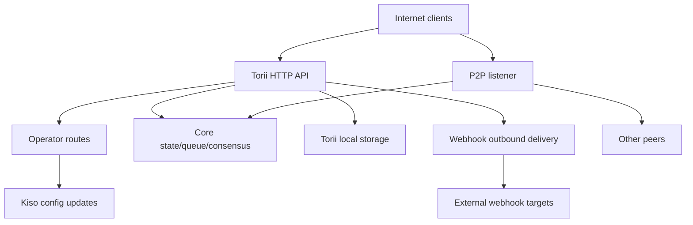

<!-- Auto-generated stub for Uzbek (uz) translation. Replace this content with the full translation. -->

---
lang: uz
direction: ltr
source: iroha-threat-model.md
status: complete
generator: scripts/sync_docs_i18n.py
source_hash: 766928cf0dcbfe3513c728bcf0b9fa697a330e8000bc6944ab61e8fcd59751ad
source_last_modified: "2026-02-07T13:27:25.009145+00:00"
translation_last_reviewed: 2026-04-02
translator: machine-google-reviewed
---

# Iroha tahdid modeli (repo: `iroha`)

## Ijroiya xulosasi
Operator marshrutlari umumiy internetdan qasddan kirish mumkin bo'lgan, lekin so'rov imzolari orqali autentifikatsiya qilinishi kerak bo'lgan va umumiy Torii so'nggi nuqtasida veb-kankalar/ilovalar yoqilgan bo'lsa, Internetga ochiq ommaviy blokcheyn o'rnatishda eng katta xavflar quyidagilardir: operator-samolyot kelishuvi (tasdiqlanmagan imzolangan so'rovlar). `/v1/configuration` va boshqa operator marshrutlari), SSRF va webhook yetkazib berish orqali chiquvchi suiiste'mol va tarif chegaralari shartli ravishda amalga oshiriladigan tranzaksiya/so'rov + oqim so'nggi nuqtalari orqali yuqori leverageli DoS; qo'shimcha ravishda, `x-forwarded-client-cert` mavjudligiga tayanadigan har qanday "mTLS talab etiladigan" pozitsiya Torii to'g'ridan-to'g'ri ta'sirlanganda buzg'unchi hisoblanadi. Dalillar: `crates/iroha_torii/src/lib.rs` (router + vositachi dastur + operator marshrutlari), `crates/iroha_torii/src/operator_auth.rs` (operator autentsiyasini yoqish/oʻchirish + `x-forwarded-client-cert` tekshirish), `crates/iroha_torii/src/webhook.rs` (chiqish HTTP mijozi), `crates/iroha_torii/src/webhook.rs` (chiqish tezligi), Sumeragi chegarasi

## Qamrov va taxminlarAmaldagi (ish vaqti / ishlab chiqarish yuzalari):
- Torii HTTP API serveri va oraliq dastur, jumladan “operator” marshrutlari, ilovalar API’si, veb-huklar, biriktirmalar, kontent va oqimning so‘nggi nuqtalari: `crates/iroha_torii/`, `crates/iroha_torii_shared/`
- Tugunni yuklash va komponent simlari (Torii + P2P + holat/navbat/konfiguratsiyani yangilash aktyori): `crates/irohad/src/main.rs`
- P2P transport va qo'l siqish sirtlari: `crates/iroha_p2p/`
- Konfiguratsiya shakllari va standart sozlamalari (ayniqsa, Torii auth sukut bo'yicha): `crates/iroha_config/src/parameters/{actual,defaults}.rs`
- Mijoz uchun DTO konfiguratsiyasini yangilash (`/v1/configuration` nimani o'zgartirishi mumkin): `crates/iroha_config/src/client_api.rs`
- Joylashtirish uchun qadoqlash asoslari: `Dockerfile` va `defaults/` da konfiguratsiya namunalari (ishlab chiqarishda oʻrnatilgan misol kalitlaridan foydalanmang).

Qo'llash doirasi tashqarisida (aniq talab qilinmasa):
- CI ish oqimlari va relizlarni avtomatlashtirish: `.github/`, `ci/`, `scripts/`
- Mobil/mijoz SDK va ilovalari: `IrohaSwift/`, `java/`, `examples/`
- Faqat hujjatlar uchun material: `docs/`Aniq taxminlar (sizning tushuntirishlaringiz asosida):
- Torii internetga ta'sir qiladi va autentifikatsiya qilinmagan mijozlarga kirishi mumkin (ba'zi so'nggi nuqtalar hali ham imzo yoki boshqa autentifikatsiyani talab qilishi mumkin).
- Operator marshrutlari (`/v1/configuration`, `/v1/nexus/lifecycle` va yoqilganda operator tomonidan himoyalangan telemetriya/profillash) hamma uchun ochiq boʻlishi uchun moʻljallangan va operator tomonidan boshqariladigan shaxsiy kalitdan imzo orqali autentifikatsiya qilinishi kerak. Dalil (joriy holat): `crates/iroha_torii/src/lib.rs` (`add_core_info_routes` amal qiladi `operator_layer`), `crates/iroha_torii/src/operator_auth.rs` (`enforce_operator_auth` / `authorize_operator_endpoint`).
- Operator imzosini tekshirishda konfiguratsiyadagi operator ochiq kalitlarining tugun-mahalliy ruxsat etilgan ro'yxatidan foydalanish kerak (joriy yo'riqnomada joriy operator eshigi sifatida ko'rsatilmagan). Joriy operator eshigining dalillari: `crates/iroha_torii/src/operator_auth.rs` (`authorize_operator_endpoint`) va mavjud kanonik so'rovni imzolash yordamchisi (xabar qurilishi): `crates/iroha_torii/src/app_auth.rs` (`canonical_request_message`).
- Torii ishonchli kirish ortida joylashtirilishi shart emas; shuning uchun `x-forwarded-client-cert` kabi sarlavhalar Torii to'g'ridan-to'g'ri ta'sirlanganda tajovuzkor tomonidan boshqariladigan sifatida ko'rib chiqilishi kerak. Dalillar: `crates/iroha_torii/src/lib.rs` (`HEADER_MTLS_FORWARD`, `norito_rpc_mtls_present`) va `crates/iroha_torii/src/operator_auth.rs` (`HEADER_MTLS_FORWARD`, `mtls_present`).
- Veb kancalar va qo'shimchalar umumiy Torii so'nggi nuqtasida yoqilgan. Dalillar: `crates/iroha_torii/src/lib.rs` (`/v1/webhooks` va `/v1/zk/attachments` uchun marshrutlar), `crates/iroha_torii/src/webhook.rs`, `crates/iroha_torii/src/zk_attachments.rs`.- Operator `torii.require_api_token = false` (standart `false`) o'rnatishi yoki saqlashi mumkin. Dalil: `crates/iroha_config/src/parameters/defaults.rs` (`torii::REQUIRE_API_TOKEN`).
- `/transaction` va `/query` ommaviy zanjir uchun foydalanish mumkin bo'lishi kutilmoqda. Eslatma: ular qo'shimcha ravishda "Norito-RPC" chiqarish bosqichi va ixtiyoriy "mTLS talab qilinadi" sarlavha mavjudligini tekshirish bilan o'rnatiladi. Dalil: `crates/iroha_torii/src/lib.rs` (`ConnScheme::from_request`, `evaluate_norito_rpc_gate`) va `crates/iroha_config/src/parameters/defaults.rs` (`torii::transport::norito_rpc::STAGE = "disabled"`).

Xavf darajasini sezilarli darajada o'zgartiradigan ochiq savollar:
- Operatorning ochiq kalitlari qayerda sozlangan (qaysi konfiguratsiya kaliti/formati) va kalitlar qanday aniqlanadi/aylanadi (kalit identifikatori, bir nechta faol kalitlar, bekor qilish)?
- Xabarni imzolashning aniq operatori formati va takror o'ynashdan himoyalanish (vaqt tamg'asi/nonce/counter + server tomonida takror o'ynash keshi) qanday va qaysi soat-qiyshiq siyosat qabul qilinadi? Mavjud kanonik so'rov yordamchisining yangiligi yo'qligiga dalil: `crates/iroha_torii/src/app_auth.rs` (`canonical_request_message`).
- Anonim vebhuklar uchun Torii ixtiyoriy manzillarga ruxsat berishi kutiladimi yoki u SSRF maqsad siyosatini qo'llashi kerakmi (RFC1918/localhost/link-local/metadata blokirovkasi va ixtiyoriy ravishda HTTPS talab qilinadi)?
- Qurilishingizda qaysi Torii funksiyalari yoqilgan (`telemetry`, `profiling`, `p2p_ws`, `app_api_https`, `app_api_wss`) va I010? kontentidan foydalanilganmi? Dalil: `crates/iroha_torii/Cargo.toml` (`[features]`).

## Tizim modeli### Asosiy komponentlar
- **Internet mijozlari** (hamyonlar, indekserlar, tadqiqotchilar, botlar): HTTP/Norito so'rovlarini yuboring va WS/SSE ulanishlarini oching.
- **Torii (HTTP API)**: avtoulovdan oldingi gating, ixtiyoriy API tokenini qo‘llash, API versiyasi bo‘yicha muzokaralar, masofaviy manzilni kiritish va ko‘rsatkichlar uchun o‘rta dasturli axum router. Dalil: `crates/iroha_torii/src/lib.rs` (`create_api_router`, `enforce_preauth`, `enforce_api_token`, `enforce_api_version`, `inject_remote_addr_header`).
- **Operator/auth-nazorat tekisligi (joriy) va kerakli holat**: operator marshrutlari hozirda `operator_auth::enforce_operator_auth` (WebAuthn/tokenlar; konfiguratsiya orqali faol ravishda o‘chirib qo‘yilishi mumkin) tomonidan himoyalangan, biroq sizning joylashtirish talabingiz operatorning umumiy kalitlari ruxsat etilgan ro‘yxati bilan tasdiqlangan imzoga asoslangan operator autentifikatsiyasidir. Kanonik so'rov xabari yordamchisi mavjud va uni xabarni yaratish uchun qayta ishlatish mumkin, ammo tasdiqlash konfiguratsiya kalitlaridan foydalanishga moslashtirilishi kerak (dunyo davlat hisoblari emas). Dalillar: `crates/iroha_torii/src/lib.rs` (`add_core_info_routes` `operator_layer` dan foydalanadi), `crates/iroha_torii/src/operator_auth.rs` (`authorize_operator_endpoint`), `crates/iroha_torii/src/app_auth.rs` (`crates/iroha_torii/src/app_auth.rs` (Sumeragi, Sumeragi00, Sumeragi00).- **Asosiy tugun komponentlari (jarayondagi)**: tranzaksiya navbati, holat/WSV, konsensus (Sumeragi), bloklarni saqlash (Kura), konfiguratsiyani yangilash aktyori (Kiso) va boshqalar, Torii ga o‘tkazildi. Dalil: `crates/irohad/src/main.rs` (`Torii::new_with_handle(...)` qabul qiladi `queue`, `state`, `kura`, `kiso`, I116NI0300 orqali boshlangan va `torii.start(...)`).
- **P2P tarmog'i**: shifrlangan, ramkali peer-to-peer transport va qo'l siqish; ixtiyoriy TLS-over-TCP mavjud, lekin sertifikatni tekshirishda ataylab ruxsat etiladi. Dalil: `crates/iroha_p2p/src/lib.rs` (turi taxallus `NetworkHandle<..., X25519Sha256, ChaCha20Poly1305>`), `crates/iroha_p2p/src/transport.rs` (`p2p_tls` moduli `NoCertificateVerification` bilan).
- **Torii mahalliy qat'iylik**: `./storage/torii` qo'shimchalar/webhooks/navbatlar uchun standart asosiy direktor. Dalil: `crates/iroha_config/src/parameters/defaults.rs` (`torii::data_dir()`), `crates/iroha_torii/src/webhook.rs` (doimiy `webhooks.json`), `crates/iroha_torii/src/zk_attachments.rs` (`./storage/torii/zk_attachments/` ostida saqlanadi).
- **Chiqish veb-huk maqsadlari**: Torii voqealarni ixtiyoriy `http://` URL manzillariga yetkaza oladi (va `https://`/`ws(s)://` faqat funksiyalar bilan). Dalil: `crates/iroha_torii/src/webhook.rs` (`http_post_plain`, `http_post_https`, `ws_send`).### Ma'lumotlar oqimi va ishonch chegaralari
- Internet mijozi → Torii HTTP API
  - Ma'lumotlar: Norito ikkilik (`SignedTransaction`, `SignedQuery`), JSON DTOs (app API), WS/SSE obunalari, sarlavhalar (jumladan, `x-api-token`).
  - Kanal: HTTP/1.1 + WebSocket + SSE (axum).
  - Kafolatlar: ixtiyoriy API tokeni (`torii.require_api_token`), avtoulovdan oldingi ulanish/stavkalarni belgilash, API versiyasi bo'yicha muzokaralar; ko'p ishlov beruvchilar har bir so'nggi nuqta tezligini shartli ravishda cheklaydi (`enforce=false` qachon chetlab o'tish mumkin). Dalillar: `crates/iroha_torii/src/lib.rs` (`enforce_preauth`, `validate_api_token`, `handler_post_transaction`, `handler_signed_query`), `crates/iroha_torii/src/limits.rs` (Sumeragi).
  - Tasdiqlash: ba'zi so'nggi nuqtalar (masalan, tranzaktsiyalar) bo'yicha tana cheklovlari, Norito dekodlash, ba'zi ilovalarning so'nggi nuqtalari uchun so'rovni imzolash (kanonik so'rov sarlavhalari). Dalil: `crates/iroha_torii/src/lib.rs` (`add_transaction_routes` `DefaultBodyLimit::max(...)` dan foydalanadi), `crates/iroha_torii/src/app_auth.rs` (`verify_canonical_request`).- Internet mijozi → "Operator" marshrutlari (Torii)
  - Ma'lumotlar: konfiguratsiya yangilanishlari (`ConfigUpdateDTO`), chiziqli hayot aylanishi rejalari, telemetriya/debug/status/metrikalar (yoqilganda).
  - Kanal: HTTP.
  - Kafolatlar: joriy repo ushbu marshrutlarni `operator_auth::enforce_operator_auth` o'rta dasturiy ta'minoti bilan o'tkazadi, bu esa `torii.operator_auth.enabled=false` da amalda no-op hisoblanadi; Sizning hohlagan holatingiz - konfiguratsiyadagi operator ochiq kalitlari yordamida imzoga asoslangan autentifikatsiya bo'lib, u ushbu chegarada amalga oshirilishi va bajarilishi kerak (va Torii to'g'ridan-to'g'ri ta'sirlansa, `x-forwarded-client-cert` ga tayanmasligi kerak). Dalil: `crates/iroha_torii/src/lib.rs` (`add_core_info_routes` amal qiladi `operator_layer`), `crates/iroha_torii/src/operator_auth.rs` (`authorize_operator_endpoint`, `mtls_present`).
  - Validatsiya: asosan DTO tahlili; `handle_post_configuration` da kriptografik avtorizatsiya yo'q (u `kiso.update_with_dto` ga vakil qiladi). Dalil: `crates/iroha_torii/src/routing.rs` (`handle_post_configuration`).

- Torii → Asosiy navbat/holat/konsensus (jarayonda)
  - Ma'lumotlar: tranzaktsiyalarni topshirish, so'rovlarni bajarish, holatni o'qish/yozish, konsensus telemetriya so'rovlari.
  - Kanal: jarayondagi Rust qo'ng'iroqlari (birgalikda `Arc` tutqichlari).
  - kafolatlar: qabul qilingan ishonchli chegara; xavfsizlik imtiyozli operatsiyalarni chaqirishdan oldin so'rovlarni to'g'ri autentifikatsiya qilish/avtorizatsiya qilish Torii ga bog'liq. Dalil: `crates/irohad/src/main.rs` (`Torii::new_with_handle(...)` simlari) va `routing::handle_*` chaqiruvchi Torii ishlov beruvchilari.- Torii → Kiso (konfiguratsiyani yangilash aktyori)
  - Ma'lumotlar: `ConfigUpdateDTO` jurnalni yozish, P2P ACL, tarmoq/transport sozlamalari, SoraNet qo'l siqish va boshqalarni o'zgartirishi mumkin.
  - Kanal: jarayondagi xabar/tutqich.
  - Kafolatlar: avtorizatsiya Torii chegarasida kutilmoqda; DTO yangilanishining o'zi qobiliyatga ega. Dalil: `crates/iroha_config/src/client_api.rs` (`ConfigUpdateDTO` maydonlariga `network_acl`, `transport.norito_rpc`, `soranet_handshake` va boshqalar kiradi).

- Torii → Mahalliy disk (`./storage/torii`)
  - Ma'lumotlar: veb-huk registrlari va navbatdagi etkazib berishlar; qo'shimchalar va sanitizer metama'lumotlari; GC/TTL harakati.
  - Kanal: fayl tizimi.
  - Kafolatlar: mahalliy OS ruxsatnomalari (konteyner Dockerfile-da ildiz bo'lmagan holda ishlaydi); "Ijarachi" tomonidan mantiqiy izolyatsiya API tokeniga yoki o'rta dastur tomonidan kiritilgan masofaviy IP sarlavhasiga asoslangan. Dalillar: `Dockerfile` (`USER iroha`), `crates/iroha_torii/src/lib.rs` (`inject_remote_addr_header`, `zk_attachments_tenant`).

- Torii → Webhook maqsadlari (chiqish)
  - Ma'lumotlar: voqea yuklari + imzo sarlavhasi.
  - Kanal: `http://` uchun xom TCP HTTP mijozi; yoqilganda `https://` uchun ixtiyoriy `hyper+rustls`; yoqilganda ixtiyoriy WS/WSS.
  - Kafolatlar: kutish vaqti/qayta urinishlar; kodda ruxsat berilgan manzillar ro'yxati ko'rinmaydi; CRUD vebhuk ochiq bo'lsa, URL tajovuzkor tomonidan ta'sirlanadi. Dalil: `crates/iroha_torii/src/webhook.rs` (`handle_create_webhook`, `http_post_plain/http_post`).- P2P tengdoshlari (ishonchsiz tarmoq) → P2P transport/qo'l siqish
  - Ma'lumotlar: qo'l siqish kirish so'zi/metama'lumotlar, ramkali shifrlangan xabarlar, konsensus xabarlari.
  - Kanal: P2P transporti (TCP/QUIC/va hokazo, xususiyatga bog'liq), shifrlangan foydali yuklar; ixtiyoriy TLS-over-TCP sertifikatni tekshirishga aniq ruxsat beradi.
  - Kafolatlar: dastur sathida shifrlash va imzolangan qo'l siqish; transport-qatlami TLS sertifikat bo'yicha autentifikatsiya qilmaydi. Dalil: `crates/iroha_p2p/src/lib.rs` (shifrlash turlari), `crates/iroha_p2p/src/transport.rs` (`NoCertificateVerification` sharh va amalga oshirish).

#### Diagramma

## Aktivlar va xavfsizlik maqsadlari| Aktiv | Nima uchun bu muhim | Xavfsizlik maqsadi (C/I/A) |
|---|---|---|
| Zanjir holati / WSV / bloklar | Butunlikdagi muvaffaqiyatsizliklar konsensus muvaffaqiyatsizlikka aylanadi; mavjudligidagi nosozliklar zanjirni to'xtatadi | I/A |
| Konsensus jonliligi (Sumeragi) | Ommaviy blokcheyn qiymati barqaror blok ishlab chiqarishga bog'liq | A |
| Tugun shaxsiy kalitlari (tengdosh identifikatori, imzo kalitlari) | Kalit kelishuvi identifikatorni egallab olish, imzo qo'yishni suiiste'mol qilish yoki tarmoqni qismlarga ajratish imkonini beradi | C/I |
| Ish vaqti konfiguratsiyasi (Kiso-yangilangan) | Tarmoq ACL va transport sozlamalarini boshqaradi; noto'g'ri foydalanish himoyani o'chirib qo'yishi yoki zararli tengdoshlarni qabul qilishi mumkin | I |
| Tranzaksiya navbati / mempul | Suv toshqini konsensusni och qoldirishi va CPU/xotirani chiqarishi mumkin | A |
| Torii qat'iylik (`./storage/torii`) | Diskning charchashi tugunni buzishi mumkin; saqlangan ma'lumotlar quyi oqimga ishlov berishga ta'sir qilishi mumkin | A (va ba'zan C/I) |
| Chiquvchi vebhuk kanali | SSRF uchun suiiste'mol qilinishi mumkin, ichki tarmoqlardan ma'lumotlarni chiqarish yoki ishonchli chiqish IP-dan skanerlash | C/I/A |
| Telemetriya/metrikalar/disk raskadrovka ma'lumotlari | Maqsadli hujumlar uchun foydali bo'lgan tarmoq topologiyasi va operatsion holatini oqishi mumkin | C |

## Hujumkor modeli### Imkoniyatlar
- Masofaviy, autentifikatsiya qilinmagan internet tajovuzkori o'zboshimchalik bilan HTTP so'rovlarini yuborishi, uzoq muddatli WS/SSE ulanishlarini ushlab turishi va foydali yuklarni (botnet) qayta o'ynashi yoki purkashi mumkin.
- Har qanday tomon kalitlarni yaratishi va imzolangan tranzaktsiyalar/so'rovlarni (ommaviy blokcheyn), shu jumladan katta hajmli spamni yuborishi mumkin.
- Zararli/buzilgan tengdosh P2P ga ulanishi va ruxsat etilgan cheklovlar doirasida protokolni suiiste'mol qilish, suv bosish yoki qo'l siqish bilan manipulyatsiya qilishga urinishi mumkin.
- Agar webhook CRUD ochilgan bo'lsa, tajovuzkor tajovuzkor tomonidan boshqariladigan webhook URL-manzillarini ro'yxatdan o'tkazishi va chiquvchi qayta qo'ng'iroqlarni qabul qilishi mumkin (va ularni ichki yo'nalishlarga yo'naltirishi mumkin).

### Qobiliyatsizlar
- To'g'ridan-to'g'ri mahalliy fayl tizimiga kirishning so'nggi nuqtasi yoki noto'g'ri sozlangan ovoz balandligi ruxsatnomalari bo'lmasa.
- Mavjud peer/operator kalitlari uchun kalitlarni murosasiz imzolash imkoniyati yo'q.
- Oddiy sharoitlarda zamonaviy kriptografiyani (X25519, ChaCha20-Poly1305, Ed25519) buzish imkoniyati mavjud emas.

## Kirish nuqtalari va hujum yuzalari| Yuzaki | Qanday erishildi | Ishonch chegarasi | Eslatmalar | Dalillar (repo yo'li / belgisi) |
|---|---|---|---|---|
| `POST /transaction` | Internet HTTP | Internet → Torii | Norito ikkilik imzolangan operatsiya; tezlikni cheklash shartli (`enforce` noto'g'ri bo'lishi mumkin) | `crates/iroha_torii/src/lib.rs` (`handler_post_transaction`, `ConnScheme::from_request`) |
| `POST /query` | Internet HTTP | Internet → Torii | Norito ikkilik imzolangan so'rov; tezlikni cheklash shartli (`enforce` noto'g'ri bo'lishi mumkin) | `crates/iroha_torii/src/lib.rs` (`handler_signed_query`) |
| Norito-RPC eshigi | Internet HTTP sarlavhalari | Internet → Torii | Chiqarish bosqichi + sarlavha mavjudligi orqali ixtiyoriy "mTLS talab qilinadi"; kanareyka `x-api-token` | dan foydalanadi `crates/iroha_torii/src/lib.rs` (`evaluate_norito_rpc_gate`, `HEADER_MTLS_FORWARD`) |
| `POST/GET/DELETE /v1/webhooks...` | Internet HTTP (ilova API) | Internet → Torii → chiquvchi | Dizayni bo'yicha anonim; webhook CRUD ixtiyoriy URL manzillariga chiquvchi yetkazib berish imkonini beradi; SSRF xavfi | `crates/iroha_torii/src/lib.rs` (`handler_webhooks_*`), `crates/iroha_torii/src/webhook.rs` (`http_post`) |
| `POST/GET /v1/zk/attachments...` | Internet HTTP (ilova API) | Internet → Torii → disk | Dizayni bo'yicha anonim; biriktirma sanitizer + dekompressiya + qat'iylik; disk/CPU tugash yuzasi (agar yoqilgan bo'lsa ijaraga olish API tokenidir, aks holda AOK qilingan sarlavha orqali masofaviy IP) | `crates/iroha_torii/src/lib.rs` (`handler_zk_attachments_*`, `zk_attachments_tenant`), `crates/iroha_torii/src/zk_attachments.rs` || `GET /v1/content/{bundle}/{path...}` | Internet HTTP | Internet → Torii → holat/saqlash | Auth rejimlarini qo'llab-quvvatlaydi + PoW + Range; chiqish cheklovchisi | `crates/iroha_torii/src/content.rs` (`handle_get_content`, `enforce_pow`, `enforce_auth`) |
| Oqim: `/v1/events/sse`, `/events` (WS), `/block/stream` (WS) | Internet | Internet → Torii | Uzoq muddatli ulanishlar; DoS yuzasi | `crates/iroha_torii/src/lib.rs` (`add_network_stream_routes`) |
| `GET/POST /v1/configuration` | Internet HTTP | Internet → operator marshrutlari → Kiso | Joylashtirish maqsadi: ruxsat berilgan ro'yxat kalitlari bilan tasdiqlangan operator imzolari; joriy repo uni faqat operator o'rta ta'minoti orqali himoya qiladi (marshrut guruhida imzo eshigi ko'rsatilmagan) va delegatlar Kiso | `crates/iroha_torii/src/lib.rs` (`add_core_info_routes`, `handler_post_configuration`), `crates/iroha_torii/src/operator_auth.rs` (`enforce_operator_auth`), `crates/iroha_torii/src/routing.rs` (`handle_post_configuration` (Sumeragi) kanonik so'rovni imzolash yordamchisi) |
| `POST /v1/nexus/lifecycle` | Internet HTTP | Internet → operator marshrutlari → asosiy | Imzo autentifikatsiyasi uchun mo'ljallangan operator so'nggi nuqtasi; Hozirda operator o'rta dasturiy ta'minoti tomonidan himoyalangan va agar operator autentsiyasi o'chirilgan bo'lsa, ommaviy bo'lishi mumkin | `crates/iroha_torii/src/lib.rs` (`add_core_info_routes`, `handler_post_nexus_lane_lifecycle`), `crates/iroha_torii/src/operator_auth.rs` (`authorize_operator_endpoint`) || Telemetriya/profillash so'nggi nuqtalari (xususiyatlar bilan himoyalangan) | Internet HTTP | Internet → operator marshrutlari | Operator tomonidan himoyalangan marshrut guruhlari; Agar operator autentsiyasi o'chirilgan bo'lsa va imzo eshigi mavjud bo'lmasa, ular ommaviy bo'lib, operatsion ma'lumotlarning sizib chiqishi yoki DoS vektorlari bo'lishi mumkin | `crates/iroha_torii/src/lib.rs` (`add_telemetry_routes`, `add_profiling_routes`), `crates/iroha_torii/src/operator_auth.rs` (`authorize_operator_endpoint`) |
| P2P TCP/TLS transportlari | Internet / teng tarmoq | Internet/tengdoshlar → P2P | Shifrlangan P2P ramkalar + qo'l siqish; TLS sertifikatini tekshirish yoqilganda ruxsat beriladi | `crates/iroha_p2p/src/lib.rs` (`NetworkHandle`), `crates/iroha_p2p/src/transport.rs` (`p2p_tls::NoCertificateVerification`) |

## Eng yaxshi suiiste'mol yo'llari

1. **Hujumkor maqsadi: ish vaqti konfiguratsiyasi yangilanishlari orqali tugun harakatlarini o‘z zimmasiga olish**
   1) Operator marshrutlariga kirish mumkin bo'lgan va operator autentifikatsiyasi mavjud bo'lmagan/aylanib o'tib bo'lmaydigan (masalan, operator autentifikatsiyasi o'chirilgan va imzo eshigi yo'q) Internetga ochiq Torii ni toping.  
   2) `POST /v1/configuration` `ConfigUpdateDTO` bilan tarmoq ACLlarini bo'shatadi yoki transport sozlamalarini o'zgartiradi.  
   3) Tengdosh sifatida qo'shiling yoki bo'limni/noto'g'ri konfiguratsiyani keltirib chiqaring; tajovuzkor tomonidan boshqariladigan infratuzilma orqali konsensus va/yoki marshrut tranzaktsiyalarini yomonlashtirish.  
   Ta'sir: tugunning (va potentsial tarmoqning) yaxlitligi va mavjudligining buzilishi.2. **Hujumchining maqsadi: qo‘lga olingan operator tomonidan imzolangan so‘rovni takrorlash**
   1) Bitta to‘g‘ri imzolangan operator so‘rovini oling (masalan, buzilgan operator mashinasi, noto‘g‘ri sozlangan proksi jurnallari yoki TLS xavfsiz tarzda tugatilgan muhit orqali).  
   2) Imzo sxemasi yangiligi (vaqt tamg'asi/nonce) va server tomonidan qayta ijro etishni rad etmasa, xuddi shu so'rovni umumiy operator marshrutlariga qarshi takrorlang.  
   3) Mavjudlikni pasaytiradigan yoki himoyani zaiflashtiradigan konfiguratsiyani qayta-qayta o'zgartirish, orqaga qaytarish yoki majburiy almashtirishlarni keltirib chiqaring.  
   Ta'sir: "imzoni tasdiqlash" ga qaramay, yaxlitlik/mavjudlik murosasi.  

3. **Hujumchining maqsadi: Norito-RPC tarqatilishini oʻzgartirish orqali darvoza himoyasini oʻchirib qoʻying**
   1) `POST /v1/configuration` yangilash uchun `transport.norito_rpc.stage` yoki `require_mtls`.  
   2) `/transaction` va `/query` ni majburan ochish yoki yopish, mavjudligi va qabul qilish nazoratiga ta'sir qiladi.  
   Ta'sir: maqsadli uzilish yoki kirish-nazoratni chetlab o'tish.4. **Hujumchining maqsadi: SSRF operatorning ichki tarmog‘iga**
   1) `POST /v1/webhooks` orqali ichki manzilga (masalan, RFC1918 xostiga, metadata IP, boshqaruv tekisligiga) ishora qiluvchi webhook yozuvini yarating.  
   2) Mos keladigan hodisalarni kuting; Torii chiquvchi HTTP so'rovlarini tarmoqdagi joylashuvidan yetkazib beradi.  
   3) Ichki xizmatlarni tekshirish uchun javoblar/statuslar/vaqt va takroriy urinishlardan foydalaning (va agar javoblar mazmuni boshqa joyda paydo bo'lsa, potentsial ravishda o'chirib tashlang).  
   Ta'sir: ichki tarmoq ta'siri, lateral harakat iskala, obro'ga zarar, metadata so'nggi nuqtalari orqali potentsial hisob ma'lumotlariga ta'sir qilish.  

5. **Hujumchi maqsadi: tranzaksiya/so‘rovni qabul qilish xizmatini rad etish**
   1) To'fon `POST /transaction` va `POST /query` amaldagi/yaroqsiz Norito jismlari bilan.  
   2) Ko'p WS/SSE obunalarini va sekin mijozlarni saqlang.  
   3) Tsiklning oldini olish uchun shartli tezlikni cheklashdan (`enforce=false`) normal ish rejimida foydalaning.  
   Ta'sir: CPU/xotiraning charchashi, navbatning to'yinganligi, konsensus to'xtashlari.  

6. **Hujumchi maqsadi: Diskni biriktirmalar orqali chiqarish**
   1) To'fon `/v1/zk/attachments` maksimal o'lchamdagi foydali yuklar va/yoki siqilgan arxivlarni kengaytirish chegaralariga yaqin.  
   2) Har bir ijarachiga yopilmasligi uchun bir nechta manba IP-laridan foydalaning (yoki ijarachi kalitining zaifligi).  
   3) TTL/GC ortda qolguncha davom eting; `./storage/torii` to'ldiring.  
   Ta'sir: tugunning ishdan chiqishi, bloklarni/tranzaksiyalarni qayta ishlashning mumkin emasligi.7. **Hujumchi maqsadi: Torii toʻgʻridan-toʻgʻri taʼsirlanganda “mTLS zarur” eshiklarini chetlab oʻtish**
   1) Operator Norito-RPC yoki operator autentsiyasi uchun `require_mtls` ni yoqadi.  
   2) Buzg'unchi so'rovlarni `x-forwarded-client-cert: <anything>` bilan yuboradi.  
   3) Sarlavhaning mavjudligi tekshirilsa, sarlavhaga hech qanday ishonchli kirish bo'lmasa.  
   Ta'sir: boshqaruv elementlari noto'g'ri qo'llanilgan; operator mTLS qo'llanilmaganda qo'llaniladi deb hisoblaydi.  

8. **Hujumchi maqsadi: tengdoshlar bilan aloqani pasaytirish / resurslarni iste'mol qilish**
   1) Zararli tengdosh qayta-qayta qoʻl berib koʻrishishga urinib koʻradi yoki maksimal oʻlchamdagi ramkalarni suv bosadi.  
   2) Sertifikatlar asosida erta rad etishning oldini olish uchun ruxsat beruvchi transport qatlami TLS dan (agar yoqilgan bo'lsa) foydalaning.  
   Ta'sir: ulanishning uzilishi, protsessordan foydalanish, tengdoshlarning mavjudligini kamaytirish.  

9. **Hujumchining maqsadi: telemetriya/debug so‘nggi nuqtalari orqali qayta tekshirish**
   1) Agar telemetriya/profillash yoqilgan bo'lsa va operator autentifikatsiyasi yo'q/aylanib o'tish mumkin bo'lsa, `/status`, `/metrics`, disk raskadrovka marshrutlarini qirib tashlang.  
   2) Vaqti-vaqti bilan hujumlar va aniq komponentlarni nishonga olish uchun sizib chiqqan topologiya/salomatlik ma'lumotlaridan foydalaning.  
   Ta'sir: tajovuzkorlarning muvaffaqiyati darajasi oshdi; mumkin bo'lgan ma'lumotlarni oshkor qilish.  

## Tahdid modeli jadvali| Tahdid identifikatori | Tahdid manbai | Old shartlar | Tahdid harakati | Ta'sir | Ta'sir qilingan aktivlar | Mavjud boshqaruv elementlari (dalil) | Bo'shliqlar | Tavsiya etilgan yumshatish choralari | Aniqlash g'oyalari | Ehtimollik | Ta'sirning jiddiyligi | Ustuvorlik |
|---|---|---|---|---|---|---|---|---|---|---|---|---|| TM-001 | Masofaviy internet hujumchisi | Torii internetga ochiq; operator marshrutlari umumiy; operator autentsiyasi yo'q/aylanib o'tish mumkin yoki imzoga asoslangan operator autentsiyasi amalga oshirilmagan/noto'g'ri amalga oshirilmagan | Ish vaqti konfiguratsiyasini, tarmoq ACLlarini yoki transport sozlamalarini o'zgartirish uchun operator marshrutlarini (masalan, `/v1/configuration`, `/v1/nexus/lifecycle`) chaqiring | Tugunni qabul qilish/bo'lish; yomon niyatli tengdoshlarni tan olish; himoyalarni o'chirish | Ish vaqti konfiguratsiyasi; konsensus jonliligi; zanjirning yaxlitligi; tengdosh kalitlari | Operator marshrutlari operator o'rtasida joylashgan, lekin `authorize_operator_endpoint` o'chirilganida `Ok(())` ni qaytaradi; yangilanish delegatlarini qo'shimcha avtorizatsiyasiz Kiso'ga sozlash. Dalillar: `crates/iroha_torii/src/lib.rs` (`add_core_info_routes`), `crates/iroha_torii/src/operator_auth.rs` (`authorize_operator_endpoint`), `crates/iroha_torii/src/routing.rs` (`handle_post_configuration`), Norito (Sumeragi) Operator marshrut guruhlarida imzoga asoslangan operator autentifikatsiyasi ko'rsatilmagan; Torii to'g'ridan-to'g'ri ta'sir qilganda sarlavhaga asoslangan "mTLS" aldash mumkin; qayta o'ynash himoyasi aniqlanmagan | Operatorning umumiy kalitlari konfiguratsiyasi ruxsat etilgan roʻyxati bilan tasdiqlangan operator yoʻnalishlari uchun majburiy imzoga asoslangan operator autentsiyasini amalga oshirish (bir nechta kalitlarni + kalit identifikatorlarini qoʻllab-quvvatlash); Cheklangan takrorlash keshi bilan yangilikni (vaqt tamg'asi + nonce) o'z ichiga oladi; TLS-ni oxirigacha qo'llash (`x-forwarded-client-cert`-ga ishonmang); qat'iy tarif chegaralarini qo'llang + barcha operator harakatlarida audit jurnali | Har qanday operator marshruti haqida ogohlantirish; audit-log konfiguratsiya farqlari; takroriy imzolarni/kelishmovchiliklarni aniqlash; noodatiy yangilanishni kuzatib boringchastota va manba IPlari | Yuqori (imzoni autentifikatsiya qilish + takroriy himoya qilish amalga oshirilgunga qadar) | Yuqori | **tanqidiy** || TM-002 | Masofaviy internet hujumchisi | Webhook CRUD anonim va internetga kirish mumkin; SSRF maqsad siyosati yo'q | Ichki/imtiyozli URL manzillariga mo'ljallangan vebhuklarni yarating va yetkazib berishni ishga tushiring | SSRF, ichki skanerlash, metadata hisob ma'lumotlariga ta'sir qilish va chiquvchi DoS | Webhook kanali; ichki tarmoq; mavjudligi | Veb kancalar mavjud; etkazib berishda taym-autlar/beklama/maksimal urinishlar qo'llaniladi; `http://` yetkazib berish xom TCP dan foydalanadi. Dalil: `crates/iroha_torii/src/lib.rs` (`handler_webhooks_*`), `crates/iroha_torii/src/webhook.rs` (`handle_create_webhook`, `http_post_plain`, `WebhookPolicy`) | Belgilangan manzillar roʻyxati/IP diapazoni bloklari yoʻq; `http://` ruxsat berilgan; DNS-ni qayta ulash/yo'naltirish boshqaruvlari ko'rinmaydi; webhook CRUD tezligini cheklash shartli (barqaror holatda samarali o'chirilishi mumkin) | Veb-huklarni yoqilgan holda saqlang, lekin SSRF boshqaruv elementlarini qo'shing: xususiy/loopback/link-local/meta-ma'lumotlar IP diapazonlari va xost nomlarini bloklash, + pin manzillarini hal qilish, qayta yo'naltirishni cheklash, chiquvchi parallellikni cheklash; yaratilish anonim bo'lgani uchun IP uchun har doim yoqilgan kvotalar + global cheklarni qo'shing va veb-huk yaratish/yangilash uchun ixtiyoriy PoW tokenini ko'rib chiqing | Jurnal va metrik veb-huk maqsadli URL + hal qilingan IP-lar; bloklangan manzillar haqida ogohlantirish; shaxsiy IP urinishlari va yuqori muvaffaqiyatsizlik/qayta urinishlar haqida ogohlantirish; webhook CRUD tezligi va navbatning toʻyinganligini nazorat qilish | Yuqori | Yuqori | **tanqidiy** || TM-003 | Masofaviy internet hujumchisi / spamer | Ommaviy `/transaction` va `/query`; shartli tarif chegarasi umumiy rejimlarda qo'llanilmaydi | Flood tx/so'rovlar, shuningdek WS/SSE oqimlari | CPU/xotiraning tugashi; navbatning to'yinganligi; konsensus stendlari | Mavjudligi (Torii + konsensus); navbat/mempul | Avtoulovdan oldingi eshik har bir IP uchun ulanishni cheklaydi va taqiqlashi mumkin. Dalil: `crates/iroha_torii/src/lib.rs` (`enforce_preauth`), `crates/iroha_torii/src/limits.rs` (`PreAuthGate`) | Ko'p kalit tezligini cheklovchilar shartli (`allow_conditionally` `enforce=false` qachon rost qaytaradi); taqsimlangan tajovuzkorlar IP chegaralarini chetlab o'tadi | Internetga ta'sir qilganda tx/so'rovlar/strimlar uchun har doim yoqilgan tezlik chegaralarini qo'shing; to'lov siyosatidan qat'i nazar, so'nggi nuqta uchun sozlanishi tarif chegaralarini qo'shing; qimmat so'nggi nuqtalarni PoW bilan himoya qiling yoki imzo/hisobga asoslangan kvotalar talab qiling | Monitor: oldindan rad etish, navbat uzunligi, tx/so'rovlar tezligi, WS/SSE faol ulanishlari; anomaliyalar va barqaror imkoniyatlar chegaralari haqida ogohlantirish | Yuqori | Yuqori | **yuqori** || TM-004 | Masofaviy internet hujumchisi | Telemetriya/profillash funksiyalari yoqilgan; operator authi o'chirilgan yoki imzo eshigi etishmayapti | `/status`, `/metrics`, disk raskadrovka so'nggi nuqtalarini qirib tashlang; qimmat disk raskadrovka holatini so'rang | Ma'lumotni oshkor qilish; operatsion DoS; maqsadli hujumni yoqish | Telemetriya / disk raskadrovka ma'lumotlari; mavjudligi | Telemetriya/profillash marshrut guruhlari `operator_auth::enforce_operator_auth` bilan qatlamlangan. Dalil: `crates/iroha_torii/src/lib.rs` (`add_telemetry_routes`, `add_profiling_routes`), `crates/iroha_torii/src/operator_auth.rs` (`authorize_operator_endpoint`) | Operator o'rta dasturi o'chirilganda no-op hisoblanadi; imzoga asoslangan operator autentsiyasi ushbu marshrut guruhlarida ko'rsatilmagan | Ushbu marshrut guruhlari uchun bir xil majburiy imzoga asoslangan operator autentini talab qilish; iloji bo'lsa, qattiq tezlik chegaralarini va javoblarni keshlashni qo'shing; sukut bo'yicha umumiy tugunlarda profil yaratish/disk raskadrovka so'nggi nuqtalarini ochishdan saqlaning | Kirish jurnallarini kuzatish; qirqish naqshlari va doimiy yuqori xarajat so'rovlari haqida ogohlantirish | O'rta | O'rta | **o'rta** || TM-005 | Masofaviy internet hujumchisi (noto'g'ri konfiguratsiya) | Operator `require_mtls` ni yoqadi, lekin Torii to'g'ridan-to'g'ri ta'sir qiladi (yoki proksi/sarlavhani tozalash kafolatlanmaydi) | “mTLS talab qilinadi” tekshiruvlarini qondirish uchun `x-forwarded-client-cert` soxtasi | Soxta xavfsizlik hissi; Norito-RPC / operator auth siyosati uchun aylanib o'tish | Operator/auth chegarasi; qabul nazorati | `require_mtls` sarlavha mavjudligi bilan tekshiriladi. Dalil: `crates/iroha_torii/src/lib.rs` (`HEADER_MTLS_FORWARD`, `norito_rpc_mtls_present`), `crates/iroha_torii/src/operator_auth.rs` (`mtls_present`) | Torii da mijoz sertifikatining kriptografik tekshiruvi yo'q; tashqi kirish shartnomasiga tayanadi | Torii hammaga ochiq bo'lsa, xavfsizlik uchun `x-forwarded-client-cert` ga ishonmang; agar mTLS kerak bo'lsa, Torii yoki mijoz sarlavhalarini yo'qotadigan ishonchli kirishda mijoz sertifikatini tekshirishni amalga oshiring; aks holda internetga qaragan joylashtirishlar uchun sarlavhaga asoslangan eshikni olib tashlang/e'tibor bermang | To'g'ridan-to'g'ri Torii ga yetib boradigan `x-forwarded-client-cert` ni o'z ichiga olgan har qanday so'rov bo'yicha ogohlantirish; Norito-RPC va operator autentsiyasi uchun log darvozasi natijalari; ruxsat etilgan trafikning keskin o'zgarishlarini kuzatib boring | Yuqori | Yuqori | **yuqori** || TM-006 | Masofaviy internet hujumchisi | Qo'shimchalar so'nggi nuqtalari anonim va internetga kirish mumkin; tajovuzkor maksimal o'lchamdagi yoki siqish bomba yuklarini yuborishi mumkin | Protsessor/diskni iste'mol qilish uchun sanitizer/dekompressiya/qat'iylikdan suiiste'mol qiling | Tugunning beqarorligi; diskning charchashi; yomonlashgan o'tkazish qobiliyati | Torii saqlash; mavjudligi | Birikma cheklovlari + dezinfektsiyalash vositasi va maksimal kengaytirish/arxiv chuqurligi mavjud. Dalil: `crates/iroha_config/src/parameters/defaults.rs` (`ATTACHMENTS_MAX_BYTES`, `ATTACHMENTS_MAX_EXPANDED_BYTES`, `ATTACHMENTS_MAX_ARCHIVE_DEPTH`, `ATTACHMENTS_SANITIZER_MODE`), `crates/iroha_torii/src/zk_attachments.rs` (Sumeragi, chegaralar), `crates/iroha_torii/src/lib.rs` (`handler_zk_attachments_*`, `zk_attachments_tenant`) | API tokenlari o'chirilgan bo'lsa, ijarachi identifikatori asosan IP-ga asoslangan; taqsimlangan manbalarni chetlab o'tish qopqoqlari; TTL hali ham ko'p kunlik to'plash imkonini beradi | Qo'shimchalar hamma uchun ochiq va anonim bo'lishi kerakligi sababli, global disk kvotalari + orqa bosimni tatbiq eting, standart sozlamalarni (TTL/maksimal bayt) kuchaytiring, OS darajasidagi sinov muhiti bilan dezinfektsiyalash vositasini subprocess rejimida saqlang va yozish uchun ixtiyoriy PoW chegarasini ko'rib chiqing; IP uchun kvotalar soxta sarlavhalar tomonidan chetlab o'tilmasligiga ishonch hosil qiling (`inject_remote_addr_header` dan foydalaning) | `./storage/torii` diskdan foydalanishni kuzatish; biriktirma yaratish tezligi, dezinfektsiyalash vositalarini rad etish va ijarachiga to'plash haqida ogohlantirish; trek GC lag | O'rta | Yuqori | **yuqori** || TM-007 | Zararli tengdosh | Peer P2P tinglovchisiga kirishi mumkin; ixtiyoriy ravishda TLS yoqilgan | To'fon qo'l siqish / ramkalar; resurslarni tugatishga urinish; erta rad etishning oldini olish uchun ruxsat beruvchi TLSdan foydalaning | Ulanishning buzilishi; resurslarni yoqish; qisman bo'linish | Mavjudligi; tengdosh ulanishi | Shifrlangan ramkalar + katta hajmli xabarlar uchun qo'l siqish xatolari. Dalillar: `crates/iroha_p2p/src/lib.rs` (`Error::FrameTooLarge`, qoʻl siqish xatolari), `crates/iroha_p2p/src/transport.rs` (`p2p_tls` ruxsat berilgan, lekin ilova qatlamida imzolangan qoʻl siqish kutilmoqda) | Transport qatlami autentifikatsiya qilmaydi; Yuqori darajadagi autentifikatsiyadan oldin DoS mumkin; per-peer/IP drossellari yetarli bo'lmasligi mumkin | IP/ASN uchun qat'iy ulanish chegaralarini qo'shing; qo'l siqish urinishlarini cheklash; umumiy tugunlarda ruxsat etilgan tengdosh kalitlarni talab qilishni ko'rib chiqing; maksimal ramka o'lchamlari konservativ bo'lishini ta'minlash; autentifikatsiya qilinmagan tengdoshlar uchun orqa bosim va erta tomchi qo'shing | Kiruvchi P2P ulanish tezligini kuzatib boring; takroriy qo'l siqishdagi nosozliklar va ramka-juda katta xatolar haqida ogohlantirish | O'rta | O'rta | **o'rta** || TM-008 | Ta'minot zanjiri / operator xatosi | Operator misol kalitlari/konfiguratsiyalar bilan joylashtiradi; bog'liqliklar buzilgan | Standart/misol kalitlari yoki xavfli standart kalitlardan foydalaning; qaramlikni o'g'irlash | Asosiy kelishuv; zanjir bo'limi; obro'sini yo'qotish | kalitlar; yaxlitlik; mavjudligi | Docker rootdan tashqari ishlaydi va standart sozlamalarni `/config` ga nusxalaydi. Dalil: `Dockerfile` (`USER iroha`, `COPY defaults ...`) | Misol konfiguratsiyalar o'rnatilgan namunaviy shaxsiy kalitlarni o'z ichiga olishi mumkin; `require_api_token=false` va `operator_auth.enabled=false` kabi xavfli standart sozlamalar | Ma'lum kalitlarni aniqlashda ishga tushirish ogohlantirishlari/muvaffaqiyatsiz yopilgan tekshiruvlarni qo'shing; "ommaviy tugun" qattiqlashtirilgan konfiguratsiya profilini jo'natish; chiqarish quvurida `cargo deny`/SBOM tekshiruvlarini amalga oshirish | `defaults/` da sirlar uchun CI gating; Ishonchsiz konfiguratsiya birikmalarida ish vaqti jurnali ogohlantirishi | O'rta | Yuqori | **yuqori** || TM-009 | Masofaviy internet hujumchisi | Imzoga asoslangan operator autentsiyasi yangiliksiz amalga oshiriladi; tajovuzkor kamida bitta haqiqiy imzolangan operator so'rovini kuzatishi mumkin | Ilgari imzolangan operator soʻrovini umumiy operator marshrutlariga qarshi takrorlang | Konfiguratsiyani takroriy o'zgartirishlar/qayta tiklashlar; maqsadli uzilishlar; himoya kuchlarining zaiflashishi | Ish vaqti konfiguratsiyasi; mavjudligi; auditning yaxlitligi | Kanonik imzo qo'yish yordamchisi xabarni usul/yo'l/so'rov/tana-xesh-dan tuzadi va vaqt tamg'asi/nonce ni o'z ichiga olmaydi. Dalil: `crates/iroha_torii/src/app_auth.rs` (`canonical_request_message`) | Takroriy himoya imzolarga xos emas; operator marshrutlari hozirda takroriy keshni ko'rsatmaydi/bir marta kuzatilmaydi | Imzolangan xabarga `timestamp` + `nonce` (yoki monotonik hisoblagich) ni qo'shing, soatning qattiq burilishini ta'minlang va operator identifikatori bilan cheklangan takroriy keshni saqlang; qayd qilish va dublikatlarni rad qilish | Ikki nusxadagi notes/so'rov xeshlari haqida ogohlantirish; operator harakatlarini identifikator va manba bo'yicha o'zaro bog'lash; takroriy rad etish uchun ko'rsatkichlarni qo'shing | O'rta | Yuqori | **yuqori** || TM-010 | Masofaviy hujumchi / insayder | Operator imzolash uchun shaxsiy kalit uni chiqarish mumkin bo'lgan joyda saqlanadi (disk/config/CI artefaktlari) | Operator shaxsiy kalitini o'g'irlash va haqiqiy imzolangan operator so'rovlarini chiqarish | Aniqlanishi past bo'lgan to'liq operator-samolyot kelishuvi | Operator kalitlari; ish vaqti konfiguratsiyasi; konsensus hayotiylik | Ba'zi Torii komponentlari allaqachon konfiguratsiyadan shaxsiy kalitlarni yuklaydi (masalan, oflayn emitent operatori kaliti). Dalil: `crates/iroha_torii/src/lib.rs` (`torii.offline_issuer.operator_private_key` ni `KeyPair`da o'qiydi), `Dockerfile` (root bo'lmagan holda ishlaydi) | Kalitni saqlash/aylantirish/HSM-dan foydalanish kod tomonidan qo'llanilmaydi; imzo autentsiyasi bu xavfni meros qilib oladi | Iloji bo'lsa, apparat tomonidan qo'llab-quvvatlanadigan kalitlardan (HSM/xavfsiz anklav) foydalaning; operator kalitlarini repo yoki dunyo tomonidan o'qiladigan konfiguratsiyaga joylashtirishdan saqlaning; qat'iy fayl ruxsatnomalari va aylanishini ta'minlash; operator harakatlari uchun multi-sig/eshikni ko'rib chiqing | Yangi IP/ASN dan operator harakatlari haqida ogohlantirish; operator harakatlarining o'zgarmas audit jurnalini yuritish; shubhali kalitlarni aylantiring | O'rta | Yuqori | **yuqori** |

## Kritiklikni kalibrlash

Ushbu repo + aniqlangan joylashtirish konteksti (internetga ochiq bo'lgan umumiy zanjir; operator marshrutlari ochiq va imzo bilan tasdiqlangan bo'lishi kerak; kafolatlangan ishonchli kirish yo'q) uchun jiddiylik darajalari quyidagilarni anglatadi:- **kritik**: Masofaviy, autentifikatsiya qilinmagan tajovuzkor tugun/tarmoq xatti-harakatlarini o'zgartirishi yoki ko'plab tugunlarda blok ishlab chiqarishni ishonchli tarzda to'xtatishi mumkin.
  - Misollar: `/v1/configuration` (TM-001) kabi operator marshrutlari uchun etishmayotgan/aylanib o'tiladigan imzo autentsiyasi; SSRF-ni imtiyozli chiqishdan metadata so'nggi nuqtalariga/klasterni boshqarish tekisligiga (TM-002); operator imzolash kalitini o'g'irlash to'g'ri imzolangan operator harakatlariga imkon beradi (TM-010).

- **yuqori**: Masofaviy tajovuzkor tugunning barqaror ishlashiga olib kelishi yoki real shartlar bilan operatorlar tayanishi mumkin bo'lgan xavfsizlik boshqaruvini chetlab o'tishi mumkin.
  - Misollar: shartli tezlikni cheklash faol bo'lmaganda yuqori hajmli tx/so'rovlarni qabul qilish DoS (TM-003); qo'shimchalar bilan boshqariladigan disk/CPU tugashi (TM-006); agar yangilik/takroriy rad etish bo'lmasa, olingan imzolangan operator so'rovini takrorlash (TM-009).

- **o'rta**: ma'noli ravishda aniqlashga yordam beradigan yoki unumdorlikni pasaytiradigan, lekin xususiyatga ega bo'lgan hujumlar, tajovuzkorning yuqori pozitsiyasini talab qiladi yoki allaqachon sezilarli darajada yumshatishga ega.
  - Misollar: yoqilganda telemetriya/profillash ekspozitsiyasi (TM-004); Cheklangan portlash radiusi (TM-007) bilan P2P qoʻl siqish suv toshqini.- **past**: nomaqbul shartlarni talab qiladigan hujumlar, cheklangan portlash radiusi yoki birinchi navbatda, oson yumshatish bilan ishlaydigan avtomatlar.
  - Misollar: blokcheyn (masalan, `/v1/health`, `/v1/peers`) uchun ochiq boʻlishi kutilayotgan va toʻgʻridan-toʻgʻri murosa qilishdan koʻra birinchi navbatda qidiruv uchun foydali boʻlgan, faqat oʻqish uchun moʻljallangan ommaviy soʻnggi nuqtalardan kichik maʼlumotlarning sizib chiqishi (bu yerda asosiy tahdidlar sanalmagan). Dalil: `crates/iroha_torii_shared/src/lib.rs` (`uri::HEALTH`, `uri::PEERS`).

## Xavfsizlik tekshiruvi uchun yoʻllarga eʼtibor qarating| Yo'l | Nima uchun bu muhim | Tegishli tahdid identifikatorlari |
|---|---|---|
| `crates/iroha_torii/src/lib.rs` | Router qurilishi, vositachi dasturlarga buyurtma berish, operator marshrut guruhlari, tx/so'rovlarni qayta ishlash vositalari, autentifikatsiya/stavka chegarasi qarorlari va ilova API simlari (veb-huklar/ilovalar) | TM-001, TM-002, TM-003, TM-004, TM-005, TM-006 |
| `crates/iroha_torii/src/operator_auth.rs` | Operatorni autentifikatsiya qilish xatti-harakatlarini yoqish/o'chirish; sarlavhaga asoslangan mTLS tekshiruvi; seanslar/tokenlar; operator-samolyot himoyasi va aylanib o'tish shartlarini tushunish uchun juda muhim | TM-001, TM-004, TM-005 |
| `crates/iroha_torii/src/routing.rs` | `/v1/configuration` ishlov beruvchilari qo'shimcha autentifikatsiyasiz Kiso'ga delegatsiya berishadi; ishlov beruvchilarning katta sirt maydoni | TM-001, TM-003 |
| `crates/iroha_config/src/client_api.rs` | `ConfigUpdateDTO` imkoniyatlarini belgilaydi (tarmoq ACL'lari, transport o'zgarishlari, qo'l siqish yangilanishlari) | TM-001, TM-009 |
| `crates/iroha_config/src/parameters/defaults.rs` | API tokenlari/operator auth/Norito-RPC bosqichi uchun standart holat; standart qo'shimchalar | TM-003, TM-006, TM-008 |
| `crates/iroha_torii/src/webhook.rs` | Chiquvchi HTTP mijozi va sxemasini qo'llab-quvvatlash; SSRF yuzasi; qat'iylik va yetkazib berish ishchi | TM-002 |
| `crates/iroha_torii/src/zk_attachments.rs` | Biriktirma dezinfektsiyalash vositasi, dekompressiya chegaralari, qat'iylik, ijarachi kaliti | TM-006 |
| `crates/iroha_torii/src/limits.rs` | Avtoulovdan oldingi eshik va tezlikni cheklovchi yordamchilar; shartli ijro harakati | TM-003 |
| `crates/iroha_torii/src/content.rs` | Kontentning so'nggi nuqtasi auth/PoW/Range va chiqish chegarasi; data exfil va DoS mulohazalari | TM-003 || `crates/iroha_torii/src/app_auth.rs` | Kanonik so'rovni imzolash (xabarni tuzish va imzoni tekshirish); Agar operator autentifikatsiyasi uchun qayta ishlatilsa, qayta o'ynash xavfini hisobga olish TM-001, TM-003, TM-009 |
| `crates/iroha_p2p/src/lib.rs` | Kripto tanlovlari, ramkalash cheklovlari, qo'l siqish xatolarini boshqarish; P2P xavf yuzasi | TM-007 |
| `crates/iroha_p2p/src/transport.rs` | TLS-over-TCP ruxsat etiladi; tashish xatti-harakatlari DoS yuzasiga ta'sir qiladi | TM-007 |
| `crates/irohad/src/main.rs` | Bootstraps Torii + P2P + konfiguratsiyani yangilash aktyori; qaysi sirtlar yoqilganligini aniqlaydi | TM-001, TM-008 |
| `defaults/nexus/config.toml` | Misol konfiguratsiyasi o'rnatilgan misol kalitlari va umumiy ulanish manzillarini o'z ichiga olishi mumkin; joylashtirish oyoq qurollari | TM-008 |
| `Dockerfile` | Konteynerning ishlash vaqti foydalanuvchi/ruxsatlari va standart konfiguratsiyani kiritish (asosiy material va operator-samolyot taʼsiri joylashtirishga sezgir) | TM-008, TM-010 |### Sifatni tekshirish
- Kirish punktlari qamrab olingan: tx/so'rov, oqim, veb-huklar, qo'shimchalar, kontent, operator/konfiguratsiya, telemetriya/profillash (xususiyatga ega), P2P.
- Tahdidlar bilan qoplangan ishonch chegaralari: Internet→Torii, Torii→Kiso/core/disk, Torii→webhook maqsadlari, tengdoshlar→P2P.
- Runtime va CI/dev ajratish: CI/docs/mobile aniq doiradan tashqarida.
- Foydalanuvchilarning tushuntirishlari aks ettirilgan: Internetga ochiq, operator marshrutlari ochiq, lekin imzo bilan tasdiqlangan bo'lishi kerak, kafolatlangan ishonchli kirish yo'q, ochiq Torii so'nggi nuqtasida veb-kankalar/ilovalar yoqilgan.
- “Qoʻl va farazlar”da aniq koʻrsatilgan taxminlar/ochiq savollar.

## Foydalanish bo'yicha eslatmalar
- Ushbu hujjat qasddan repo-asoslangan (dalil langarlar joriy kodga ishora qiladi); bir nechta yuqori ustuvor yumshatishlar (operator imzosi eshigi, webhook SSRF maqsad siyosati) hali mavjud bo'lmagan yangi kod/konfiguratsiyani talab qiladi.
- Sarlavhaga asoslangan har qanday “mTLS” signallari (masalan, `x-forwarded-client-cert`), ishonchli kirish ularni oʻchirib tashlamaguncha, tajovuzkor tomonidan boshqariladigan deb hisoblang.