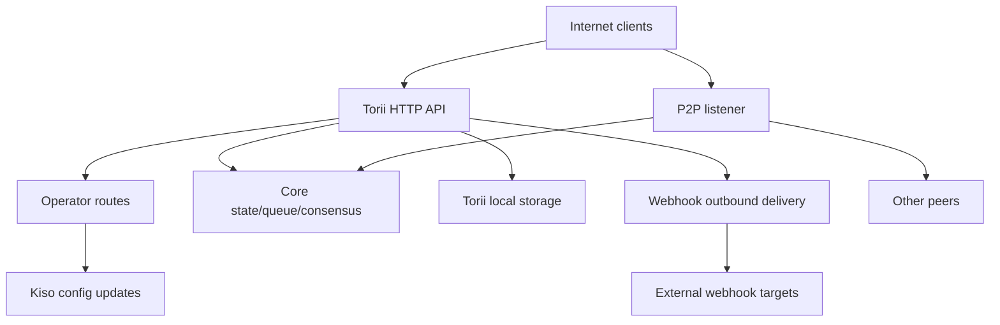

<!-- Auto-generated stub for Chinese (Simplified) (zh-hans) translation. Replace this content with the full translation. -->

---
lang: zh-hans
direction: ltr
source: iroha-threat-model.md
status: complete
generator: scripts/sync_docs_i18n.py
source_hash: 766928cf0dcbfe3513c728bcf0b9fa697a330e8000bc6944ab61e8fcd59751ad
source_last_modified: "2026-02-07T13:27:25.009145+00:00"
translation_last_reviewed: 2026-04-02
translator: machine-google-reviewed
---

# Iroha 威胁模型（存储库：`iroha`）

## 执行摘要
在暴露于互联网的公共区块链部署中，运营商路由有意可从公共互联网访问，但必须通过请求签名进行身份验证，并且在公共 Torii 端点上启用 Webhooks/附件，最大的风险是：运营商平面妥协（对 `/v1/configuration` 和其他运营商路由的未经身份验证或可重放的签名请求）、SSRF 和通过 Webhook 传递的出站滥用，以及通过事务/查询 + 流端点实现高杠杆 DoS，其中有条件地执行速率限制；此外，当 Torii 直接暴露时，任何依赖于 `x-forwarded-client-cert` 存在的“需要 mTLS”的姿势都是可欺骗的。证据：`crates/iroha_torii/src/lib.rs`（路由器+中间件+运营商路由），`crates/iroha_torii/src/operator_auth.rs`（运营商身份验证启用/禁用+ `x-forwarded-client-cert`检查），`crates/iroha_torii/src/webhook.rs`（出站HTTP客户端），`crates/iroha_torii/src/limits.rs`（条件速率限制）。

## 范围和假设范围内（运行时/生产表面）：
- Torii HTTP API 服务器和中间件，包括“操作员”路由、应用程序 API、Webhooks、附件、内容和流端点：`crates/iroha_torii/`、`crates/iroha_torii_shared/`
- 节点引导和组件接线（Torii + P2P + 状态/队列/配置更新参与者）：`crates/irohad/src/main.rs`
- P2P传输和握手表面：`crates/iroha_p2p/`
- 配置形状和默认值（特别是 Torii 身份验证默认值）：`crates/iroha_config/src/parameters/{actual,defaults}.rs`
- 面向客户端的配置更新 DTO（`/v1/configuration` 可以更改的内容）：`crates/iroha_config/src/client_api.rs`
- 部署打包基础知识：`Dockerfile`，以及 `defaults/` 中的示例配置（请勿在生产中使用嵌入式示例密钥）。

超出范围（除非明确要求）：
- CI 工作流程和发布自动化：`.github/`、`ci/`、`scripts/`
- 移动/客户端 SDK 和应用程序：`IrohaSwift/`、`java/`、`examples/`
- 仅文档材料：`docs/`明确的假设（基于您的澄清）：
- Torii 是互联网公开的，未经身份验证的客户端可以访问（某些端点可能仍需要签名或其他身份验证）。
- 操作员路由（`/v1/configuration`、`/v1/nexus/lifecycle` 和操作员门控遥测/分析（启用时））旨在可公开访问，并且应通过操作员控制的私钥签名进行身份验证。证据（当前状态）：`crates/iroha_torii/src/lib.rs`（`add_core_info_routes` 适用于 `operator_layer`）、`crates/iroha_torii/src/operator_auth.rs`（`enforce_operator_auth` / `authorize_operator_endpoint`）。
- 操作员签名验证应在配置中使用操作员公钥的节点本地白名单（未显示为当前路由器中已实现的操作员门）。当前操作员门的证据：`crates/iroha_torii/src/operator_auth.rs` (`authorize_operator_endpoint`)，以及现有规范请求签名助手（消息构造）的证据：`crates/iroha_torii/src/app_auth.rs` (`canonical_request_message`)。
- Torii 不一定部署在可信入​​口后面；因此，当 Torii 直接暴露时，像 `x-forwarded-client-cert` 这样的标头必须被视为攻击者控制的。证据：`crates/iroha_torii/src/lib.rs`（`HEADER_MTLS_FORWARD`、`norito_rpc_mtls_present`）和 `crates/iroha_torii/src/operator_auth.rs`（`HEADER_MTLS_FORWARD`、`mtls_present`）。
- 在公共 Torii 端点上启用 Webhook 和附件。证据：`crates/iroha_torii/src/lib.rs`（`/v1/webhooks` 和 `/v1/zk/attachments` 的路由）、`crates/iroha_torii/src/webhook.rs`、`crates/iroha_torii/src/zk_attachments.rs`。- 操作员可以设置或保留 `torii.require_api_token = false`（默认为 `false`）。证据：`crates/iroha_config/src/parameters/defaults.rs` (`torii::REQUIRE_API_TOKEN`)。
- `/transaction` 和 `/query` 预计可通过公链访问。注意：它们还受到“Norito-RPC”推出阶段和可选的“mTLS required”标头存在检查的控制。证据：`crates/iroha_torii/src/lib.rs`（`ConnScheme::from_request`、`evaluate_norito_rpc_gate`）和 `crates/iroha_config/src/parameters/defaults.rs`（`torii::transport::norito_rpc::STAGE = "disabled"`）。

会实质性改变风险排名的开放性问题：
- 操作员公钥在哪里配置（哪些配置密钥/格式），以及如何识别/轮换密钥（密钥 ID、多个活动密钥、撤销）？
- 确切的操作员签名消息格式和重播保护（时间戳/随机数/计数器+服务器端重播缓存）是什么，以及什么时钟偏差策略是可接受的？现有规范请求助手没有新鲜感的证据：`crates/iroha_torii/src/app_auth.rs` (`canonical_request_message`)。
- 对于匿名 Webhook，Torii 是否期望允许任意目标，或者是否应该强制执行 SSRF 目标策略（阻止 RFC1918/localhost/link-local/metadata 并可选择要求 HTTPS）？
- 您的版本中启用了哪些 Torii 功能（`telemetry`、`profiling`、`p2p_ws`、`app_api_https`、`app_api_wss`），以及是否使用了 `app_api` 内容？证据：`crates/iroha_torii/Cargo.toml` (`[features]`)。

## 系统模型### 主要组件
- **互联网客户端**（钱包、索引器、浏览器、机器人）：发送 HTTP/Norito 请求并打开 WS/SSE 连接。
- **Torii (HTTP API)**：带有用于预身份验证门控、可选 API 令牌强制执行、API 版本协商、远程地址注入和指标的中间件的 axum 路由器。证据：`crates/iroha_torii/src/lib.rs`（`create_api_router`、`enforce_preauth`、`enforce_api_token`、`enforce_api_version`、`inject_remote_addr_header`）。
- **操作员/身份验证控制平面（当前）和所需的状态**：操作员路由当前受 `operator_auth::enforce_operator_auth`（WebAuthn/令牌；可以通过配置有效禁用）保护，但您的部署要求是基于签名的操作员身份验证，并根据配置中的操作员公钥白名单进行验证。规范的请求消息助手存在，可以重用于消息构造，但需要调整验证以使用配置密钥（而不是世界状态帐户）。证据：`crates/iroha_torii/src/lib.rs`（`add_core_info_routes` 使用 `operator_layer`）、`crates/iroha_torii/src/operator_auth.rs`（`authorize_operator_endpoint`）、`crates/iroha_torii/src/app_auth.rs`（`canonical_request_message`） `verify_canonical_request`）。- **核心节点组件（进程中）**：交易队列，状态/WSV，共识（Sumeragi），块存储（Kura），配置更新参与者（Kiso）等，传递到Torii。证据：`crates/irohad/src/main.rs`（`Torii::new_with_handle(...)` 接收 `queue`、`state`、`kura`、`kiso`、`sumeragi`，并通过以下方式启动`torii.start(...)`）。
- **P2P 网络**：加密、成帧的点对点传输和握手；存在可选的 TLS-over-TCP，但有意允许证书验证。证据：`crates/iroha_p2p/src/lib.rs`（类型别名 `NetworkHandle<..., X25519Sha256, ChaCha20Poly1305>`）、`crates/iroha_p2p/src/transport.rs`（带有 `NoCertificateVerification` 的 `p2p_tls` 模块）。
- **Torii 本地持久性**：`./storage/torii` 附件/webhooks/队列的默认基本目录。证据：`crates/iroha_config/src/parameters/defaults.rs` (`torii::data_dir()`)、`crates/iroha_torii/src/webhook.rs`（保留 `webhooks.json`）、`crates/iroha_torii/src/zk_attachments.rs`（存储在 `./storage/torii/zk_attachments/` 下）。
- **出站 Webhook 目标**：Torii 可以将事件传递到任意 `http://` URL（以及仅具有功能的 `https://`/`ws(s)://`）。证据：`crates/iroha_torii/src/webhook.rs`（`http_post_plain`、`http_post_https`、`ws_send`）。### 数据流和信任边界
- 互联网客户端 → Torii HTTP API
  - 数据：Norito 二进制文件（`SignedTransaction`、`SignedQuery`）、JSON DTO（应用程序 API）、WS/SSE 订阅、标头（包括 `x-api-token`）。
  - 通道：HTTP/1.1 + WebSocket + SSE (axum)。
  - 保证：可选 API 令牌 (`torii.require_api_token`)、预身份验证连接/速率门控、API 版本协商；许多处理程序有条件地应用每个端点速率限制（当 `enforce=false` 时可以绕过）。证据：`crates/iroha_torii/src/lib.rs`（`enforce_preauth`、`validate_api_token`、`handler_post_transaction`、`handler_signed_query`）、`crates/iroha_torii/src/limits.rs`（`allow_conditionally`）。
  - 验证：某些端点（例如交易）的正文限制、Norito 解码、某些应用程序端点的请求签名（规范请求标头）。证据：`crates/iroha_torii/src/lib.rs`（`add_transaction_routes` 使用 `DefaultBodyLimit::max(...)`）、`crates/iroha_torii/src/app_auth.rs`（`verify_canonical_request`）。- 互联网客户端 → “运营商”路线 (Torii)
  - 数据：配置更新 (`ConfigUpdateDTO`)、通道生命周期计划、遥测/调试/状态/指标（启用时）。
  - 通道：HTTP。
  - 保证：当前的存储库使用 `operator_auth::enforce_operator_auth` 中间件来控制这些路由，这在 `torii.operator_auth.enabled=false` 时实际上是无操作的；您所需的姿势是使用配置中的操作员公钥进行基于签名的身份验证，必须在此边界实现和强制执行（如果直接暴露 Torii，则不得依赖 `x-forwarded-client-cert`）。证据：`crates/iroha_torii/src/lib.rs`（`add_core_info_routes` 适用于 `operator_layer`）、`crates/iroha_torii/src/operator_auth.rs`（`authorize_operator_endpoint`、`mtls_present`）。
  - 验证：主要是DTO解析； `handle_post_configuration` 本身没有加密授权（它委托给 `kiso.update_with_dto`）。证据：`crates/iroha_torii/src/routing.rs` (`handle_post_configuration`)。

- Torii → 核心队列/状态/共识（进程中）
  - 数据：交易提交、查询执行、状态读/写、共识遥测查询。
  - 通道：进程内 Rust 调用（共享 `Arc` 句柄）。
  - 保证：假定可信边界；安全性取决于 Torii 在调用特权操作之前正确验证/授权请求。证据：`crates/irohad/src/main.rs`（`Torii::new_with_handle(...)` 接线）和 Torii 处理程序调用 `routing::handle_*`。- Torii → Kiso（配置更新参与者）
  - 数据：`ConfigUpdateDTO` 可以修改日志记录、P2P ACL、网络/传输设置、SoraNet 握手等。
  - 通道：进程内消息/句柄。
  - 保证：预计在 Torii 边界获得授权；更新DTO本身是有能力的。证据：`crates/iroha_config/src/client_api.rs`（`ConfigUpdateDTO`字段包括`network_acl`、`transport.norito_rpc`、`soranet_handshake`等）。

- Torii → 本地磁盘 (`./storage/torii`)
  - 数据：webhook 注册表和排队交付；附件和消毒剂元数据； GC/TTL 行为。
  - 通道：文件系统。
  - 保证：本地操作系统权限（容器在 Dockerfile 中以非 root 身份运行）； “租户”的逻辑隔离基于 API 令牌或中间件注入的远程 IP 标头。证据：`Dockerfile` (`USER iroha`)、`crates/iroha_torii/src/lib.rs` (`inject_remote_addr_header`、`zk_attachments_tenant`)。

- Torii → Webhook 目标（出站）
  - 数据：事件负载+签名标头。
  - 通道：`http://` 的原始 TCP HTTP 客户端；启用时可选 `hyper+rustls` 用于 `https://`；启用时可选的 WS/WSS。
  - 保证：超时/重试；代码中没有可见的目标允许列表；如果 webhook CRUD 打开，则 URL 会受到攻击者的影响。证据：`crates/iroha_torii/src/webhook.rs`（`handle_create_webhook`、`http_post_plain/http_post`）。- P2P 对等点（不可信网络）→ P2P 传输/握手
  - 数据：握手序言/元数据、框架加密消息、共识消息。
  - 通道：P2P 传输（TCP/QUIC/等，取决于功能）、加密有效负载；可选的 TLS-over-TCP 明确允许证书验证。
  - 保证：应用层加密和签名握手；传输层 TLS 不通过证书进行身份验证。证据：`crates/iroha_p2p/src/lib.rs`（加密类型）、`crates/iroha_p2p/src/transport.rs`（`NoCertificateVerification` 注释和实现）。

####图

## 资产和安全目标|资产|为什么这很重要 |安全目标 (C/I/A) |
|---|---|---|
|链状态/WSV/区块 |诚信失败变成共识失败；可用性故障导致链条停滞我/A |
|共识活跃度 (Sumeragi) |公共区块链价值取决于持续的区块生产 |一个 |
|节点私钥（对等身份、签名密钥）|密钥泄露导致身份接管、签名滥用或网络分区 | C/I |
|运行时配置（Kiso 更新）|控制网络 ACL 和传输设置；滥用可能会禁用保护或允许恶意同行|我|
|交易队列/内存池 |洪泛会导致共识匮乏并耗尽 CPU/内存 |一个 |
| Torii 持久性 (`./storage/torii`) |磁盘耗尽可能导致节点崩溃；存储的数据可能会影响下游处理| A（有时是 C/I）|
|出站 webhook 通道 |可能被滥用于 SSRF、从内部网络泄露数据或从受信任的出口 IP 进行扫描 | C/I/A |
|遥测/指标/调试数据 |可以泄露对有针对性的攻击有用的网络拓扑和运行状态| C |

## 攻击者模型### 能力
- 远程、未经身份验证的互联网攻击者可以发送任意 HTTP 请求、持有长期 WS/SSE 连接以及重放或喷射有效负载（僵尸网络）。
- 任何一方都可以生成密钥并提交签名的交易/查询（公共区块链），包括大量垃圾邮件。
- 恶意/受损的对等方可以连接到 P2P 并尝试在允许的限制内滥用协议、洪泛或握手操作。
- 如果 webhook CRUD 暴露，攻击者可以注册攻击者控制的 webhook URL 并接收出站回调（并可能将它们引导到内部目的地）。

### 非能力
- 如果没有暴露的端点或错误配置的卷权限，则无法直接访问本地文件系统。
- 无法在不泄露密钥的情况下伪造现有对等/操作员密钥的签名。
- 在正常条件下没有假定能够破解现代密码学（X25519、ChaCha20-Poly1305、Ed25519）。

## 入口点和攻击面|表面|如何达到 |信任边界|笔记|证据（回购路径/符号）|
|---|---|---|---|---|
| `POST /transaction` |互联网 HTTP |互联网 → Torii | Norito 二进制签名交易；速率限制是有条件的（`enforce` 可能为 false）| `crates/iroha_torii/src/lib.rs` (`handler_post_transaction`, `ConnScheme::from_request`) |
| `POST /query` |互联网 HTTP |互联网 → Torii | Norito 二进制签名查询；速率限制是有条件的（`enforce` 可能为 false）| `crates/iroha_torii/src/lib.rs` (`handler_signed_query`) |
| Norito-RPC门|互联网 HTTP 标头 |互联网 → Torii |推出阶段 + 通过标头存在可选“需要 mTLS”；金丝雀使用 `x-api-token` | `crates/iroha_torii/src/lib.rs` (`evaluate_norito_rpc_gate`, `HEADER_MTLS_FORWARD`) |
| `POST/GET/DELETE /v1/webhooks...` |互联网 HTTP（应用程序 API）|互联网 → Torii → 出站 |设计为匿名； webhook CRUD 允许出站传送到任意 URL； SSRF 风险 | `crates/iroha_torii/src/lib.rs` (`handler_webhooks_*`)、`crates/iroha_torii/src/webhook.rs` (`http_post`) |
| `POST/GET /v1/zk/attachments...` |互联网 HTTP（应用程序 API）|互联网 → Torii → 磁盘 |设计为匿名；附件消毒+减压+坚持；磁盘/CPU 耗尽表面（如果启用，租户是 API 令牌，否则通过注入标头进行远程 IP）| `crates/iroha_torii/src/lib.rs`（`handler_zk_attachments_*`，`zk_attachments_tenant`），`crates/iroha_torii/src/zk_attachments.rs` || `GET /v1/content/{bundle}/{path...}` |互联网 HTTP |互联网 → Torii → 状态/存储 |支持auth模式+PoW+Range；出口限制器| `crates/iroha_torii/src/content.rs`（`handle_get_content`、`enforce_pow`、`enforce_auth`）|
|流媒体：`/v1/events/sse`、`/events` (WS)、`/block/stream` (WS) |互联网|互联网 → Torii |长期连接； DoS 表面 | `crates/iroha_torii/src/lib.rs` (`add_network_stream_routes`) |
| `GET/POST /v1/configuration` |互联网 HTTP |互联网 → 运营商路线 → 木曾 |部署意图：根据配置白名单密钥验证操作员签名；当前的存储库仅通过操作员中间件保护它（路由组上没有显示签名门）并将更新应用程序委托给 Kiso | `crates/iroha_torii/src/lib.rs`（`add_core_info_routes`、`handler_post_configuration`）、`crates/iroha_torii/src/operator_auth.rs`（`enforce_operator_auth`）、`crates/iroha_torii/src/routing.rs`（`handle_post_configuration`）、`crates/iroha_torii/src/app_auth.rs` （现有规范请求签名助手）|
| `POST /v1/nexus/lifecycle` |互联网 HTTP |互联网→运营商路线→核心|旨在进行签名验证的操作员端点；目前由运营商中间件保护，如果运营商身份验证被禁用，则可以公开 | `crates/iroha_torii/src/lib.rs`（`add_core_info_routes`、`handler_post_nexus_lane_lifecycle`）、`crates/iroha_torii/src/operator_auth.rs`（`authorize_operator_endpoint`）||遥测/分析端点（功能门控）|互联网 HTTP |互联网→运营商路线|运营商控制的路线组；如果操作员身份验证被禁用并且不存在签名门，这些信息就会公开并可能泄露操作数据或成为 DoS 向量 | `crates/iroha_torii/src/lib.rs`（`add_telemetry_routes`，`add_profiling_routes`），`crates/iroha_torii/src/operator_auth.rs`（`authorize_operator_endpoint`）|
| P2P TCP/TLS 传输 |互联网/对等网络|互联网/点对点 → P2P |加密P2P帧+握手；启用后允许 TLS 证书验证 | `crates/iroha_p2p/src/lib.rs` (`NetworkHandle`)、`crates/iroha_p2p/src/transport.rs` (`p2p_tls::NoCertificateVerification`) |

## 主要滥用路径

1. **攻击者目标：通过运行时配置更新接管节点行为**
   1) 查找互联网公开的 Torii，其中操作员路由可达且操作员身份验证不存在/可绕过（例如，操作员身份验证已禁用且无签名门）。  
   2) `POST /v1/configuration` 与 `ConfigUpdateDTO` 放松网络 ACL 或更改传输设置。  
   3) 作为对等点加入或引发分区/错误配置；降低共识和/或通过攻击者控制的基础设施路由交易。  
   影响：节点（以及潜在的网络）的完整性和可用性受到损害。2. **攻击者目标：重放捕获的操作员签名请求**
   1) 获取一个有效的签名操作员请求（例如，通过受损的操作员机器、错误配置的代理日志或 TLS 不安全终止的环境）。  
   2) 如果签名方案缺乏新鲜度（时间戳/随机数）并且服务器端重放拒绝，则针对公共运营商路由重放相同的请求。  
   3) 导致重复的配置更改、回滚或强制切换，从而降低可用性或削弱防御。  
   影响：尽管有“签名验证”，但完整性/可用性仍受到损害。  

3. **攻击者目标：通过更改 Norito-RPC 部署来禁用/控制保护**
   1) `POST /v1/configuration` 更新 `transport.norito_rpc.stage` 或 `require_mtls`。  
   2) 强制打开或强制关闭 `/transaction` 和 `/query`，影响可用性和准入控制。  
   影响：有针对性的中断或准入控制旁路。4. **攻击者目标：SSRF进入运营商内部网络**
   1) 通过 `POST /v1/webhooks` 创建指向内部目标（例如 RFC1918 主机、元数据 IP、控制平面）的 Webhook 条目。  
   2）等待匹配事件； Torii 从其网络位置传送出站 HTTP 请求。  
   3) 使用响应/状态/计时和重复重试来探测内部服务（如果响应内容在其他地方出现，则可能会泄露）。  
   影响：内部网络暴露、横向移动脚手架、声誉损害、通过元数据端点的潜在凭证暴露。  

5. **攻击者目标：拒绝交易/查询准入服务**
   1) 使用有效/无效的 Norito 主体淹没 `POST /transaction` 和 `POST /query`。  
   2) 维护大量 WS/SSE 订阅和缓慢的客户端。  
   3) 在正常操作中利用条件速率限制（`enforce=false`）以避免限制。  
   影响：CPU/内存耗尽、队列饱和、共识停滞。  

6. **攻击者目标：通过附件耗尽磁盘**
   1) 使用最大大小的有效负载和/或接近扩展限制的压缩档案来淹没 `/v1/zk/attachments`。  
   2) 使用多个源 IP（或任何租户密钥弱点）以避免每个租户的上限。  
   3）坚持直到TTL/GC滞后；填写`./storage/torii`。  
   影响：节点崩溃，无法处理区块/交易。7. **攻击者目标：当 Torii 直接暴露时绕过“需要 mTLS”的门**
   1) 操作员为 Norito-RPC 或操作员身份验证启用 `require_mtls`。  
   2）攻击者发送带有`x-forwarded-client-cert: <anything>`的请求。  
   3) 如果没有受信任的入口剥离标头，则标头存在检查通过。  
   影响：控制措施误用；运营商认为 mTLS 已强制执行，但事实并非如此。  

8. **攻击者目标：降低对等连接/消耗资源**
   1) 恶意对等方反复尝试握手或淹没接近最大大小的帧。  
   2) 利用宽松的传输层 TLS（如果启用）来避免基于证书的早期拒绝。  
   影响：连接流失、CPU 使用率、对等可用性降低。  

9. **攻击者目标：通过遥测/调试端点进行侦察**
   1) 如果启用了遥测/分析并且操作员身份验证丢失/可绕过，则抓取 `/status`、`/metrics`、调试路由。  
   2) 使用泄露的拓扑/运行状况数据来确定攻击时间并针对特定组件。  
   影响：提高攻击成功率；可能的信息泄露。  

## 威胁模型表|威胁ID |威胁来源|先决条件 |威胁行动|影响 |受影响的资产 |现有控制措施（证据）|差距|建议的缓解措施 |检测思路|可能性 |影响严重程度 |优先|
|---|---|---|---|---|---|---|---|---|---|---|---|---|| TM-001 |远程互联网攻击者| Torii 互联网公开；运营商路线是公开的；操作员身份验证不存在/可绕过或基于签名的操作员身份验证未实现/实施错误​​ |调用操作员路由（例如，`/v1/configuration`、`/v1/nexus/lifecycle`）以更改运行时配置、网络 ACL 或传输设置 |节点接管/分区；承认恶意的同伴；禁用保护 |运行时配置；共识活跃度；链条完整性；对等密钥 |算子路由位于算子中间件后面，但禁用时 `authorize_operator_endpoint` 返回 `Ok(())`；配置更新委托给 Kiso，无需额外授权。证据：`crates/iroha_torii/src/lib.rs` (`add_core_info_routes`)、`crates/iroha_torii/src/operator_auth.rs` (`authorize_operator_endpoint`)、`crates/iroha_torii/src/routing.rs` (`handle_post_configuration`)、`crates/iroha_config/src/client_api.rs` (`ConfigUpdateDTO`) |运营商路线组上不显示基于签名的运营商身份验证；当直接暴露 Torii 时，基于标头的“mTLS”是可欺骗的；重放保护未定义 |对根据运营商公钥配置白名单进行验证的运营商路由实施基于签名的强制运营商身份验证（支持多个密钥 + 密钥 ID）；包括新鲜度（时间戳+随机数）和有界重播缓存；端到端强制执行 TLS（不信任 `x-forwarded-client-cert`）；对所有操作员操作应用严格的速率限制 + 审核日志记录 |对任何命中的运营商路线发出警报；审核日志配置差异；检测重复的签名/随机数；监控异常更新频率和源IP |高（直到签名验证+重放保护得到实施和强制执行）|高| **关键** || TM-002 |远程互联网攻击者| Webhook CRUD 是匿名的且可通过互联网访问；没有 SSRF 目的地政策 |创建针对内部/特权 URL 的 Webhooks 并触发交付 | SSRF、内部扫描、元数据凭证暴露和出站 DoS | Webhook 通道；内部网络；可用性 | Webhook 存在；交付使用超时/退避/最大尝试次数； `http://` 传送使用原始 TCP。证据：`crates/iroha_torii/src/lib.rs` (`handler_webhooks_*`)、`crates/iroha_torii/src/webhook.rs` (`handle_create_webhook`、`http_post_plain`、`WebhookPolicy`) |无目的地白名单/IP 范围限制； `http://` 允许； DNS 重新绑定/重定向控件不可见； webhook CRUD 速率限制是有条件的（在稳定状态下可能会有效关闭）|保持 webhooks 启用，但添加 SSRF 控制：阻止私有/环回/链接本地/元数据 IP 范围和主机名、解析 + pin 地址、限制重定向、限制出站并发；因为创建是匿名的，所以添加始终开启的每 IP 配额 + 全局上限，并考虑使用可选的 PoW 令牌来创建/更新 Webhook |日志和指标 Webhook 目标 URL + 解析的 IP；对受阻目的地发出警报；针对私有 IP 尝试和高失败/重试率发出警报；监控 webhook CRUD 速率和队列饱和度 |高|高| **关键** || TM-003 |远程互联网攻击者/垃圾邮件发送者|公共 `/transaction` 和 `/query`；普通模式下不强制执行条件速率限制 |洪水 tx/查询提交，加上 WS/SSE 流 | CPU/内存耗尽；队列饱和；共识停滞|可用性（Torii + 共识）；队列/内存池 |预验证门限制每个 IP 的连接并可以禁止。证据：`crates/iroha_torii/src/lib.rs` (`enforce_preauth`)、`crates/iroha_torii/src/limits.rs` (`PreAuthGate`) |许多关键速率限制器都是有条件的（当 `enforce=false` 时，`allow_conditionally` 返回 true）；分布式攻击者绕过每个 IP 的限制当暴露在互联网上时，为 tx/query/streams 添加始终在线的速率限制；添加独立于费用政策的每个端点可配置速率限制；使用 PoW 保护昂贵的端点或需要基于签名/帐户的配额 |监控：预身份验证拒绝、队列长度、发送/查询速率、WS/SSE 活动连接；异常警报和持续容量限制|高|高| **高** || TM-004 |远程互联网攻击者|启用遥测/分析功能；操作员身份验证已禁用或签名门丢失 |抓取 `/status`、`/metrics`、调试端点；请求昂贵的调试状态|信息披露；运营 DoS；有针对性的攻击支持|遥测/调试数据；可用性 |遥测/分析路由组通过 `operator_auth::enforce_operator_auth` 分层。证据：`crates/iroha_torii/src/lib.rs`（`add_telemetry_routes`、`add_profiling_routes`）、`crates/iroha_torii/src/operator_auth.rs`（`authorize_operator_endpoint`）|禁用时操作员中间件是无操作的；这些路由组上未显示基于签名的操作员身份验证 |这些路由组需要相同的基于签名的强制操作员身份验证；在可行的情况下添加硬速率限制和响应缓存；默认情况下避免在公共节点上公开分析/调试端点 |跟踪访问日志；对抓取模式和持续的高成本请求发出警报|中等|中等| **中** || TM-005 |远程互联网攻击者（错误配置利用）|操作员启用 `require_mtls`，但 Torii 直接暴露（或不保证代理/标头清理） |欺骗 `x-forwarded-client-cert` 以满足“需要 mTLS”检查 |错误的安全感； Norito-RPC / 操作员身份验证策略的旁路门控操作员/授权边界；准入控制| `require_mtls` 通过标头是否存在进行检查。证据：`crates/iroha_torii/src/lib.rs`（`HEADER_MTLS_FORWARD`、`norito_rpc_mtls_present`）、`crates/iroha_torii/src/operator_auth.rs`（`mtls_present`）| Torii 处的客户端证书没有加密验证；依赖外部入口合约 |当 Torii 可公开访问时，请勿依赖 `x-forwarded-client-cert` 来确保安全；如果需要 mTLS，请在 Torii 或在剥离客户端标头的可信入口处强制执行客户端证书验证；否则删除/忽略面向互联网部署的基于标头的门 |对任何包含 `x-forwarded-client-cert` 直接到达 Torii 的请求发出警报；记录 Norito-RPC 和操作员身份验证的门结果；监控允许流量的突然变化|高|高| **高** || TM-006 |远程互联网攻击者|附件端点是匿名的且可通过互联网访问；攻击者可以发送最大大小或压缩炸弹有效负载|滥用sanitizer/解压/持久化消耗CPU/磁盘 |节点不稳定；磁盘耗尽；吞吐量下降| Torii 存储；可用性 |存在附件限制+消毒剂和最大扩展/存档深度。证据：`crates/iroha_config/src/parameters/defaults.rs`（`ATTACHMENTS_MAX_BYTES`、`ATTACHMENTS_MAX_EXPANDED_BYTES`、`ATTACHMENTS_MAX_ARCHIVE_DEPTH`、`ATTACHMENTS_SANITIZER_MODE`）、`crates/iroha_torii/src/zk_attachments.rs`（`inspect_bytes`，限制）， `crates/iroha_torii/src/lib.rs` (`handler_zk_attachments_*`, `zk_attachments_tenant`) |当 API 令牌关闭时，租户身份主要基于 IP；分布式资源绕过上限； TTL仍允许多日累积|因为附件必须是面向公众和匿名的，所以强制执行全局磁盘配额+背压，收紧默认值（TTL/最大字节），使用操作系统级沙箱将消毒程序保持在子进程模式，并考虑可选的 PoW 写入门控；确保每个 IP 配额不能被欺骗标头绕过（继续使用 `inject_remote_addr_header`） |监控`./storage/torii`的磁盘使用情况；关于附件创建率、消毒剂拒绝和每个租户累积的警报；跟踪 GC 滞后 |中等|高| **高** || TM-007 |恶意同行| Peer可以到达P2P监听者；可选择启用 TLS |洪水握手/帧；尝试耗尽资源；利用宽松的 TLS 避免早期拒绝 |连接性下降；资源消耗；部分分区|可用性；对等连接 |加密帧+超大消息的握手错误。证据：`crates/iroha_p2p/src/lib.rs`（`Error::FrameTooLarge`，握手错误），`crates/iroha_p2p/src/transport.rs`（`p2p_tls` 是允许的，但需要应用程序层签名握手）|传输层不进行身份验证；在更高级别的身份验证之前可能存在 DoS；每个对等/IP 限制可能不够 |为每个 IP/ASN 添加严格的连接限制；速率限制握手尝试；考虑在公共节点上要求列入白名单的对等密钥；确保最大帧尺寸是保守的；为未经身份验证的同行添加背压和早期下降 |监控入站P2P连接率；重复握手失败和帧过大错误的警报中等|中等| **中** || TM-008 |供应链/操作员错误|操作员使用示例密钥/配置进行部署；依赖关系受到损害 |使用默认/示例密钥或不安全的默认值；依赖劫持 |关键妥协；链式分区；声誉损失|钥匙；正直;可用性 | Docker 以非 root 身份运行并将默认值复制到 `/config` 中。证据：`Dockerfile`（`USER iroha`，`COPY defaults ...`）|示例配置可能包含嵌入的示例私钥；不安全的默认值，如 `require_api_token=false` 和 `operator_auth.enabled=false` |在检测已知示例键时添加启动警告/故障关闭检查；发布“公共节点”强化配置文件；在发布管道中强制执行 `cargo deny`/SBOM 检查 | `defaults/` 中机密的 CI 门控；关于不安全配置组合的运行时日志警告中等|高| **高** || TM-009 |远程互联网攻击者|基于签名的操作员认证实现没有新鲜感；攻击者可以观察到至少一个有效的签名操作员请求 |针对公共运营商路线重放之前有效的已签名运营商请求 |重复配置更改/回滚；有针对性的停电；防御能力的削弱|运行时配置；可用性；审计诚信|规范签名助手从方法/路径/查询/主体哈希构造消息，不包括时间戳/随机数。证据：`crates/iroha_torii/src/app_auth.rs` (`canonical_request_message`) |重放保护并不是签名所固有的；操作员路线当前不显示重播缓存/随机数跟踪 |在签名消息中包含 `timestamp` + `nonce`（或单调计数器），强制执行严格的时钟偏差，并维护由操作员身份键入的有界重播缓存；记录并拒绝重复项 |对重复的随机数/请求哈希值发出警报；按身份和来源关联操作员的操作；添加重放拒绝的指标 |中等|高| **高** || TM-010 |远程攻击者/内部人员|操作员签名私钥存储在可以泄露的位置（磁盘/配置/CI 工件）|窃取运营商私钥并发出有效签名的运营商请求 |操作员平面与低可检测性的全面妥协操作键；运行时配置；共识活跃度 |一些 Torii 组件已经从配置加载私钥（例如，离线发行者操作员密钥）。证据：`crates/iroha_torii/src/lib.rs`（将 `torii.offline_issuer.operator_private_key` 读入 `KeyPair`）、`Dockerfile`（以非 root 身份运行）|密钥存储/轮换/HSM 使用不是由代码强制执行的；签名auth会继承这个风险|尽可能使用硬件支持的密钥（HSM/安全飞地）；避免在存储库或世界可读的配置中嵌入操作员密钥；执行严格的文件权限和轮换；考虑操作员操作的多重签名/阈值 |针对新 IP/ASN 的操作员操作发出警报；维护操作员操作的不可变审计日志；怀疑时轮换钥匙 |中等|高| **高** |

## 临界校准

对于此存储库 + 澄清的部署上下文（暴露于互联网的公共链；运营商路由是公共的并且旨在进行签名验证；不保证可信入口），严重性级别意味着：- **严重**：未经身份验证的远程攻击者可以更改节点/网络行为或可靠地停止多个节点上的块生产。
  - 示例：`/v1/configuration` (TM-001) 等运营商路线缺少/可绕过签名验证；从特权出口 (TM-002) 到元数据端点/集群控制平面的 webhook SSRF；操作员签名密钥盗窃可实现有效的签名操作员操作 (TM-010)。

- **高**：在现实的先决条件下，远程攻击者可以导致节点持续 DoS 或绕过操作员可能依赖的安全控制。
  - 示例：当条件速率限制处于非活动状态时，大量 tx/query 准入 DoS (TM-003)；附件驱动的磁盘/CPU 耗尽（TM-006）；如果缺少新鲜度/重放拒绝，则重放捕获的签名操作员请求 (TM-009)。

- **中**：有意义地帮助侦察或降低性能的攻击，但要么是功能门控的，需要提升攻击者的位置，要么已经存在显着的缓解措施。
  - 示例：启用时的遥测/分析曝光 (TM-004)；具有有限爆炸半径的 P2P 握手洪泛（TM-007）。- **低**：攻击需要不太可能的先决条件、有限的爆炸半径或主要可轻松缓解的操作步枪。
  - 示例：来自公共只读端点的少量信息泄漏，这些端点预计对区块链公开（例如，`/v1/health`、`/v1/peers`），并且主要用于侦察而不是直接危害（此处未列为顶级威胁）。证据：`crates/iroha_torii_shared/src/lib.rs`（`uri::HEALTH`、`uri::PEERS`）。

## 安全审查的重点路径|路径|为什么这很重要 |相关威胁 ID |
|---|---|---|
| `crates/iroha_torii/src/lib.rs` |路由器构建、中间件排序、操作员路由组、tx/查询处理程序、身份验证/速率限制决策和应用程序 API 接线（webhooks/附件）| TM-001、TM-002、TM-003、TM-004、TM-005、TM-006 |
| `crates/iroha_torii/src/operator_auth.rs` |操作员授权启用/禁用行为；基于标头的 mTLS 检查；会话/令牌；对于操作员平面保护和了解旁路条件至关重要| TM-001、TM-004、TM-005 |
| `crates/iroha_torii/src/routing.rs` | `/v1/configuration` 处理程序委托给 Kiso，无需额外授权；处理机表面积大| TM-001、TM-003 |
| `crates/iroha_config/src/client_api.rs` |定义 `ConfigUpdateDTO` 功能（网络 ACL、传输更改、握手更新）| TM-001、TM-009 |
| `crates/iroha_config/src/parameters/defaults.rs` | API 令牌/操作员身份验证/Norito-RPC 阶段的默认状态；附件默认值 | TM-003、TM-006、TM-008 |
| `crates/iroha_torii/src/webhook.rs` |出站 HTTP 客户端和方案支持； SSRF表面；坚持与交付工作者| TM-002 |
| `crates/iroha_torii/src/zk_attachments.rs` |附件消毒剂、减压限制、持久性、租户密钥 | TM-006 |
| `crates/iroha_torii/src/limits.rs` |预授权门和速率限制助手；有条件执行行为| TM-003 |
| `crates/iroha_torii/src/content.rs` |内容端点身份验证/PoW/范围和出口限制；数据泄露和 DoS 考虑因素TM-003 || `crates/iroha_torii/src/app_auth.rs` |规范请求签名（消息构造和签名验证）；如果重复用于操作员身份验证，则需要考虑重放风险 | TM-001、TM-003、TM-009 |
| `crates/iroha_p2p/src/lib.rs` |加密选择、帧限制、握手错误处理； P2P风险面| TM-007 |
| `crates/iroha_p2p/src/transport.rs` | TLS-over-TCP 是允许的；传输行为影响DoS表面| TM-007 |
| `crates/irohad/src/main.rs` | Bootstraps Torii + P2P + 配置更新参与者；确定启用哪些表面 | TM-001、TM-008 |
| `defaults/nexus/config.toml` |示例配置可能包括嵌入的示例密钥和公共绑定地址；部署步枪| TM-008 |
| `Dockerfile` |容器运行时用户/权限和默认配置包含（关键材料和操作平面暴露对部署敏感）| TM-008、TM-010 |### 质量检查
- 涵盖的入口点：tx/查询、流媒体、webhooks、附件、内容、操作员/配置、遥测/分析（功能门控）、P2P。
- 威胁覆盖的信任边界：互联网→Torii、Torii→Kiso/core/disk、Torii→webhook 目标、对等点→P2P。
- 运行时与 CI/dev 分离：CI/docs/mobile 明确超出范围。
- 反映的用户澄清：互联网公开、运营商路由是公开的，但应进行签名身份验证、不保证可信入口、在公共 Torii 端点上启用 Webhooks/附件。
- “范围和假设”中明确列出的假设/开放式问题。

## 使用注意事项
- 本文档是有意重新定位的（证据锚点指向当前代码）；一些高优先级的缓解措施（操作员签名门、webhook SSRF 目标策略）需要尚不存在的新代码/配置。
- 将任何基于标头的“mTLS”信号（例如，`x-forwarded-client-cert`）视为攻击者控制，除非受信任的入口剥离并注入它们。