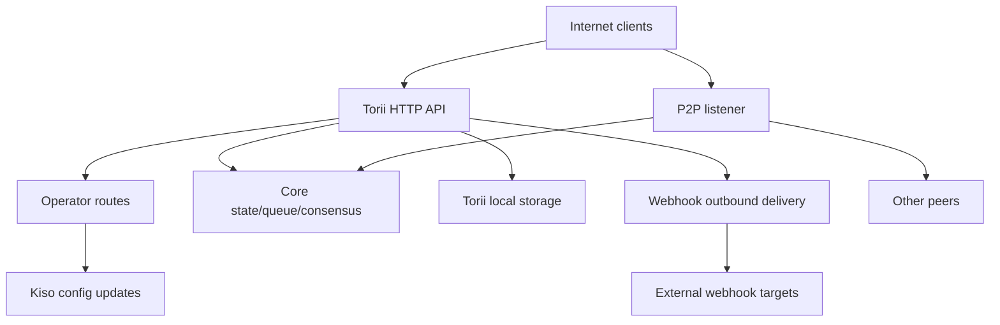

<!-- Auto-generated stub for Chinese (Traditional) (zh-hant) translation. Replace this content with the full translation. -->

---
lang: zh-hant
direction: ltr
source: iroha-threat-model.md
status: complete
generator: scripts/sync_docs_i18n.py
source_hash: 766928cf0dcbfe3513c728bcf0b9fa697a330e8000bc6944ab61e8fcd59751ad
source_last_modified: "2026-02-07T13:27:25.009145+00:00"
translation_last_reviewed: 2026-04-02
translator: machine-google-reviewed
---

# Iroha 威脅模型（儲存庫：`iroha`）

## 執行摘要
在暴露於互聯網的公共區塊鏈部署中，運營商路由有意可從公共互聯網訪問，但必須通過請求簽名進行身份驗證，並且在公共 Torii 端點上啟用 Webhooks/附件，最大的風險是：運營商平面妥協（對 `/v1/configuration` 和其他運營商路由的未經身份驗證或運營商通過的身份驗證或運營商通過 Web傳遞的出站濫用，以及透過事務/查詢 + 流端點實現高槓桿 DoS，其中有條件地執行速率限制；此外，當 Torii 直接暴露時，任何依賴於 `x-forwarded-client-cert` 存在的「需要 mTLS」的姿勢都是可欺騙的。證據：`crates/iroha_torii/src/lib.rs`（路由器+中間件+運營商路由），`crates/iroha_torii/src/operator_auth.rs`（運營商身份驗證啟用/禁用+ `x-forwarded-client-cert`檢查），`crates/iroha_torii/src/webhook.rs`（出站HTTP客戶端），I1HTTP客戶端）限制條件。

## 範圍和假設範圍內（運轉時/生產表面）：
- Torii HTTP API 伺服器和中間件，包括「操作員」路由、應用程式 API、Webhooks、附件、內容和流端點：`crates/iroha_torii/`、`crates/iroha_torii_shared/`
- 節點引導與元件接線（Torii + P2P + 狀態/佇列/設定更新參與者）：`crates/irohad/src/main.rs`
- P2P傳輸與握手錶面：`crates/iroha_p2p/`
- 配置形狀和預設值（特別是 Torii 驗證預設值）：`crates/iroha_config/src/parameters/{actual,defaults}.rs`
- 面向客戶端的設定更新 DTO（`/v1/configuration` 可以更改的內容）：`crates/iroha_config/src/client_api.rs`
- 部署打包基礎：`Dockerfile`，以及 `defaults/` 中的範例配置（請勿在生產中使用嵌入式範例金鑰）。

超出範圍（除非明確要求）：
- CI 工作流程與發布自動化：`.github/`、`ci/`、`scripts/`
- 行動/客戶端 SDK 和應用程式：`IrohaSwift/`、`java/`、`examples/`
- 僅限文件資料：`docs/`明確的假設（基於您的澄清）：
- Torii 是互聯網公開的，未經身份驗證的用戶端可以存取（某些端點可能仍需要簽名或其他身份驗證）。
- 操作員路由（`/v1/configuration`、`/v1/nexus/lifecycle` 和操作員門控遙測/分析（啟用時））旨在可公開訪問，並且應透過操作員控制的私鑰簽名進行身份驗證。證據（目前狀態）：`crates/iroha_torii/src/lib.rs`（`add_core_info_routes` 適用於 `operator_layer`）、`crates/iroha_torii/src/operator_auth.rs`（`enforce_operator_auth` / `authorize_operator_endpoint`）。
- 操作員簽署驗證應在設定中使用操作員公鑰的節點本機白名單（未顯示為目前路由器中已實現的操作員門）。目前操作員門的證據：`crates/iroha_torii/src/operator_auth.rs` (`authorize_operator_endpoint`)，以及現有規範請求簽署助手（訊息構造）的證據：`crates/iroha_torii/src/app_auth.rs` (`canonical_request_message`)。
- Torii 不一定部署在可信任入口後面；因此，當 Torii 直接暴露時，像 `x-forwarded-client-cert` 這樣的標頭必須被視為攻擊者控制的。證據：`crates/iroha_torii/src/lib.rs`（`HEADER_MTLS_FORWARD`、`norito_rpc_mtls_present`）和 `crates/iroha_torii/src/operator_auth.rs`（`HEADER_MTLS_FORWARD`、`mtls_present`）。
- 在公用 Torii 端點上啟用 Webhook 和附件。證據：`crates/iroha_torii/src/lib.rs`（`/v1/webhooks` 和 `/v1/zk/attachments` 的路由）、`crates/iroha_torii/src/webhook.rs`、`crates/iroha_torii/src/zk_attachments.rs`。- 操作員可以設定或保留 `torii.require_api_token = false`（預設為 `false`）。證據：`crates/iroha_config/src/parameters/defaults.rs` (`torii::REQUIRE_API_TOKEN`)。
- `/transaction` 和 `/query` 預計可透過公鏈存取。注意：它們也受到「Norito-RPC」推出階段和可選的「mTLS required」標頭存在檢查的控制。證據：`crates/iroha_torii/src/lib.rs`（`ConnScheme::from_request`、`evaluate_norito_rpc_gate`）和 `crates/iroha_config/src/parameters/defaults.rs`（`torii::transport::norito_rpc::STAGE = "disabled"`）。

會實質改變風險排名的開放性問題：
- 操作員公鑰在哪裡配置（哪些配置金鑰/格式），以及如何辨識/輪替金鑰（金鑰 ID、多個活動金鑰、撤銷）？
- 確切的操作員簽署訊息格式和重播保護（時間戳/隨機數/計數器+伺服器端重播快取）是什麼，以及什麼時鐘偏差策略是可接受的？現有規範請求助手沒有新鮮感的證據：`crates/iroha_torii/src/app_auth.rs` (`canonical_request_message`)。
- 對於匿名 Webhook，Torii 是否期望允許任意目標，或者是否應該強制執行 SSRF 目標策略（阻止 RFC1918/localhost/link-local/metadata 並可選擇要求 HTTPS）？
- 您的版本中啟用了哪些 Torii 功能（`telemetry`、`profiling`、`p2p_ws`、`app_api_https`、`app_api_wss`、`app_api_https`、`app_api_wss`18300138X 內容？證據：`crates/iroha_torii/Cargo.toml` (`[features]`)。

## 系統模型### 主要元件
- **網路用戶端**（錢包、索引器、瀏覽器、機器人）：發送 HTTP/Norito 請求並開啟 WS/SSE 連線。
- **Torii (HTTP API)**：axum 路由器，具有用於預先驗證門控、可選 API 令牌強制執行、API 版本協商、遠端位址注入和指標的中間件。證據：`crates/iroha_torii/src/lib.rs`（`create_api_router`、`enforce_preauth`、`enforce_api_token`、`enforce_api_version`、`inject_remote_addr_header`）。
- **操作員/驗證控制平面（目前）和所需的狀態**：操作員路由目前受 `operator_auth::enforce_operator_auth`（WebAuthn/令牌；可以透過設定有效停用）保護，但您的部署要求是基於簽署的操作員身分驗證，並根據設定中的操作員公鑰白名單進行驗證。規範的請求訊息助手存在，可以重用於訊息構造，但需要調整驗證以使用配置金鑰（而不是世界狀態帳戶）。證據：`crates/iroha_torii/src/lib.rs`（`add_core_info_routes` 使用 `operator_layer`）、`crates/iroha_torii/src/operator_auth.rs`（`authorize_operator_endpoint`）、`crates/iroha_torii/src/app_auth.rs`（I1885001505X） `verify_canonical_request`）。- **核心節點元件（進程中）**：交易佇列，狀態/WSV，共識（Sumeragi），區塊儲存（Kura），配置更新參與者（Kiso）等，傳遞到Torii。證據：`crates/irohad/src/main.rs`（`Torii::new_with_handle(...)` 接收`queue`、`state`、`kura`、`kiso`、`sumeragi`，並透過以下方式啟動`torii.start(...)`）。
- **P2P 網路**：加密、成幀的點對點傳輸和握手；存在可選的 TLS-over-TCP，但有意允許證書驗證。證據：`crates/iroha_p2p/src/lib.rs`（類型別名 `NetworkHandle<..., X25519Sha256, ChaCha20Poly1305>`）、`crates/iroha_p2p/src/transport.rs`（附 `NoCertificateVerification` 的 `p2p_tls` 模組）。
- **Torii 本機持久性**：`./storage/torii` 附件/webhooks/佇列的預設基本目錄。證據：`crates/iroha_config/src/parameters/defaults.rs` (`torii::data_dir()`)、`crates/iroha_torii/src/webhook.rs`（保留 `webhooks.json`）、`crates/iroha_torii/src/zk_attachments.rs`（儲存於 `./storage/torii/zk_attachments/` 下）。
- **出站 Webhook 目標**：Torii 可以將事件傳遞到任意 `http://` URL（以及僅具有功能的 `https://`/`ws(s)://`）。證據：`crates/iroha_torii/src/webhook.rs`（`http_post_plain`、`http_post_https`、`ws_send`）。### 資料流與信任邊界
- 網際網路用戶端 → Torii HTTP API
  - 資料：Norito 二進位（`SignedTransaction`、`SignedQuery`）、JSON DTO（應用程式 API）、WS/SSE 訂閱、標頭（包括 `x-api-token`）。
  - 頻道：HTTP/1.1 + WebSocket + SSE (axum)。
  - 保證：選用 API 令牌 (`torii.require_api_token`)、預先驗證連線/速率閘控、API 版本協商；許多處理程序有條件地應用每個端點速率限制（當 `enforce=false` 時可以繞過）。證據：`crates/iroha_torii/src/lib.rs`（`enforce_preauth`、`validate_api_token`、`handler_post_transaction`、`handler_signed_query`）、`crates/iroha_torii/src/limits.rs`（I185000195000X）。
  - 驗證：某些端點（例如交易）的正文限制、Norito 解碼、某些應用程式端點的請求簽章（規範請求標頭）。證據：`crates/iroha_torii/src/lib.rs`（`add_transaction_routes` 使用 `DefaultBodyLimit::max(...)`）、`crates/iroha_torii/src/app_auth.rs`（`verify_canonical_request`）。- 網路用戶端 → 「營運商」路線 (Torii)
  - 資料：配置更新 (`ConfigUpdateDTO`)、通道生命週期計畫、遙測/除錯/狀態/指標（啟用時）。
  - 通道：HTTP。
  - 保證：目前的儲存庫使用 `operator_auth::enforce_operator_auth` 中間件來控制這些路由，這在 `torii.operator_auth.enabled=false` 時實際上是無操作的；您所需的姿勢是使用配置中的操作員公鑰進行基於簽名的身份驗證，必須在此邊界實現和強制執行（如果直接暴露 Norito），則不得。證據：`crates/iroha_torii/src/lib.rs`（`add_core_info_routes` 適用於 `operator_layer`）、`crates/iroha_torii/src/operator_auth.rs`（`authorize_operator_endpoint`、`mtls_present`）。
  - 驗證：主要是DTO解析； `handle_post_configuration` 本身沒有加密授權（它委託給 `kiso.update_with_dto`）。證據：`crates/iroha_torii/src/routing.rs` (`handle_post_configuration`)。

- Torii → 核心佇列/狀態/共識（進程中）
  - 資料：交易提交、查詢執行、狀態讀/寫、共識遙測查詢。
  - 通道：進程內 Rust 呼叫（共享 `Arc` 句柄）。
  - 保證：假定可信任邊界；安全性取決於 Torii 在呼叫特權作業之前正確驗證/授權請求。證據：`crates/irohad/src/main.rs`（`Torii::new_with_handle(...)` 接線）和 Torii 處理程序呼叫 `routing::handle_*`。- Torii → Kiso（配置更新參與者）
  - 資料：`ConfigUpdateDTO` 可以修改日誌記錄、P2P ACL、網路/傳輸設定、SoraNet 握手等。
  - 通道：進程內訊息/句柄。
  - 保證：預計在 Torii 邊界獲得授權；更新DTO本身是有能力的。證據：`crates/iroha_config/src/client_api.rs`（`ConfigUpdateDTO`字段包括`network_acl`、`transport.norito_rpc`、`soranet_handshake`等）。

- Torii → 本機磁碟 (`./storage/torii`)
  - 數據：webhook 註冊表和排隊交付；附件和消毒劑元數據； GC/TTL 行為。
  - 頻道：檔案系統。
  - 保證：本機作業系統權限（容器在 Dockerfile 中以非 root 身分運作）； 「租用戶」的邏輯隔離是基於 API 令牌或中間件注入的遠端 IP 標頭。證據：`Dockerfile` (`USER iroha`)、`crates/iroha_torii/src/lib.rs` (`inject_remote_addr_header`、`zk_attachments_tenant`)。

- Torii → Webhook 目標（出站）
  - 資料：事件負載+簽署標頭。
  - 通道：`http://` 的原始 TCP HTTP 用戶端；啟用時可選 `hyper+rustls` 用於 `https://`；啟用時可選的 WS/WSS。
  - 保證：逾時/重試；程式碼中沒有可見的目標允許清單；如果 webhook CRUD 打開，則 URL 會受到攻擊者的影響。證據：`crates/iroha_torii/src/webhook.rs`（`handle_create_webhook`、`http_post_plain/http_post`）。- P2P 對等點（不可信網路）→ P2P 傳輸/握手
  - 資料：握手前言/元資料、框架加密訊息、共識訊息。
  - 通道：P2P 傳輸（TCP/QUIC/等，取決於功能）、加密有效負載；可選的 TLS-over-TCP 明確允許憑證驗證。
  - 保證：應用層加密和簽章握手；傳輸層 TLS 不透過憑證進行身份驗證。證據：`crates/iroha_p2p/src/lib.rs`（加密類型）、`crates/iroha_p2p/src/transport.rs`（`NoCertificateVerification` 註釋和實作）。

####圖

## 資產和安全目標|資產|為什麼這很重要 |安全目標 (C/I/A) |
|---|---|---|
|鏈狀態/WSV/區塊 |誠信失敗變成共識失敗；可用性故障導致鏈條停滯我/A |
|共識活躍度 (Sumeragi) |公共區塊鏈價值取決於持續的區塊生產 |一個 |
|節點私鑰（對等身分、簽署金鑰）|金鑰外洩導致身分接管、簽章濫用或網路分區 | C/I |
|運行時配置（Kiso 更新）|控制網路 ACL 和傳輸設定；濫用可能會停用保護或允許惡意同行|我|
|交易佇列/記憶體池 |洪氾會導致共識匱乏並耗盡 CPU/記憶體 |一個 |
| Torii 持久性 (`./storage/torii`) |磁碟耗盡可能導致節點崩潰；儲存的資料可能會影響下游處理| A（有時是 C/I）|
|出站 webhook 通道 |可能被濫用於 SSRF、從內部網路洩露資料或從受信任的出口 IP 進行掃描 | C/I/A |
|遙測/指標/偵錯資料 |可以洩漏對有針對性的攻擊有用的網路拓撲和運行狀態| C |

## 攻擊者模型### 能力
- 遠端、未經驗證的網路攻擊者可以發送任意 HTTP 請求、持有長期 WS/SSE 連線以及重播或噴射有效負載（殭屍網路）。
- 任何一方都可以產生金鑰並提交簽署的交易/查詢（公共區塊鏈），包括大量垃圾郵件。
- 惡意/受損的對等方可以連接到 P2P 並嘗試在允許的限制內濫用協定、洪氾或握手操作。
- 如果 webhook CRUD 暴露，攻擊者可以註冊攻擊者控制的 webhook URL 並接收出站回呼（並可能將它們引導到內部目的地）。

### 非能力
- 如果沒有暴露的端點或錯誤配置的磁碟區權限，則無法直接存取本機檔案系統。
- 無法在不洩漏金鑰的情況下偽造現有對等/操作員金鑰的簽章。
- 在正常條件下沒有假定能夠破解現代密碼學（X25519、ChaCha20-Poly1305、Ed25519）。

## 入口點和攻擊面|表面|如何達到 |信任邊界 |筆記|證據（回購路徑/符號）|
|---|---|---|---|---|
`POST /transaction` |網際網路 HTTP |網際網路 → Torii | Norito 二進位簽章交易；速率限制是有條件的（`enforce` 可能為 false）| `enforce` | `ConnScheme::from_request`) |
`POST /query` |網際網路 HTTP |網際網路 → Torii | Norito 二進位簽章查詢；速率限制是有條件的（`enforce` 可能為 false）| `enforce` 可能為 false）|
| Norito-RPC门|互联网 HTTP 标头 |互联网 → Torii |推出阶段 + 通过标头存在可选“需要 mTLS”；金丝雀使用 `x-api-token` | `crates/iroha_torii/src/lib.rs` (`evaluate_norito_rpc_gate`, `HEADER_MTLS_FORWARD`) |
| `POST/GET/DELETE /v1/webhooks...` |網際網路 HTTP（應用程式 API）|網際網路 → Torii → 出站 |設計為匿名；webhook CRUD 允許出站傳送到任意 URL； SSRF 風險 | `crates/iroha_torii/src/lib.rs` (Norito (I125021125255X)。 (`http_post`) |
| `POST/GET /v1/zk/attachments...` |互聯網 HTTP（應用程式 API）|互聯網 → Torii → 磁碟 |設計為匿名；附件消毒+減壓+堅持；磁碟/CPU 耗盡表面（如果啟用，租戶是 API 令牌，否則透過注入標頭進行遠端 IP）| `crates/iroha_torii/src/lib.rs`（`handler_zk_attachments_*`，`zk_attachments_tenant`），`crates/iroha_torii/src/zk_attachments.rs` || `GET /v1/content/{bundle}/{path...}` |互联网 HTTP |互联网 → Torii → 状态/存储 |支持auth模式+PoW+Range；出口限制器| `crates/iroha_torii/src/content.rs`（`handle_get_content`、`enforce_pow`、`enforce_auth`）|
|串流媒體：`/v1/events/sse`、`/events` (WS)、`/block/stream` (WS) |網際網路 → Torii |長期連線；多S 表面 | Norito (0002020000000
| `GET/POST /v1/configuration` |互聯網 HTTP |互聯網 → 運營商路線 → 木曾 |部署意圖：根據配置白名單密鑰驗證操作員簽名；當前的存儲庫僅通過操作員中間件保護它（路由組上沒有顯示簽名門）並將更新應用程序委託給 Kiso | `crates/iroha_torii/src/lib.rs`（`add_core_info_routes`、`handler_post_configuration`）、`crates/iroha_torii/src/operator_auth.rs`（`enforce_operator_auth`）、`crates/iroha_torii/src/routing.rs`（I1000279X）、`crates/iroha_torii/src/routing.rs`（I1000280200002020024X20028020200202020024X0024X02002020210024X0024X020020202100202020024X） （現有規範請求簽名助手）|
| `POST /v1/nexus/lifecycle` |互聯網 HTTP |互聯網→運營商路線→核心|旨在進行簽名驗證的操作員端點；目前由運營商中間件保護，如果運營商身份驗證被禁用，則可以公開 | `crates/iroha_torii/src/lib.rs`（`add_core_info_routes`、`handler_post_nexus_lane_lifecycle`）、`crates/iroha_torii/src/operator_auth.rs`（`authorize_operator_endpoint`）||遙測/分析端點（功能門控）|互聯網 HTTP |互聯網→運營商路線|運營商控制的路線組；如果操作員身份驗證被禁用並且不存在簽名門，這些資訊就會公開並可能洩露操作數據或成為 DoS 向量 | `crates/iroha_torii/src/lib.rs`（`add_telemetry_routes`，`add_profiling_routes`），`crates/iroha_torii/src/operator_auth.rs`（`authorize_operator_endpoint`）|
| P2P TCP/TLS 傳輸 |網際網路/對等網路|網際網路/點對點 → P2P |加密P2P訊框+握手；啟用後可讓 TLS 憑證驗證 | `crates/iroha_p2p/src/lib.rs` (`NetworkHandle`)、`crates/iroha_p2p/src/transport.rs` (I18707002904X (I18907) |

## 主要濫用路徑

1. **攻擊者目標：透過執行時間配置更新接管節點行為**
   1) 尋找互聯網公開的 Torii，其中操作員路由可達且操作員身份驗證不存在/可繞過（例如，操作員身份驗證已停用且無簽名門）。  
   2) `POST /v1/configuration` 與 `ConfigUpdateDTO` 放鬆網路 ACL 或更改傳輸設定。  
   3) 作為對等點加入或引發分區/錯誤配置；降低共識和/或透過攻擊者控制的基礎設施路由交易。  
   影響：節點（以及潛在的網路）的完整性和可用性受到損害。2. **攻擊者目標：重播捕獲的操作員簽章請求**
   1) 取得一個有效的簽章操作員請求（例如，透過受損的操作員機器、錯誤配置的代理日誌或 TLS 不安全終止的環境）。  
   2) 如果簽章方案缺乏新鮮度（時間戳記/隨機數）且伺服器端重播拒絕，則針對公用業者路由重播相同的請求。  
   3) 導致重複的配置變更、回滾或強制切換，從而降低可用性或削弱防禦。  
   影響：儘管有“簽名驗證”，但完整性/可用性仍受到損害。  

3. **攻擊者目標：透過更改 Norito-RPC 部署來停用/控制保護**
   1) `POST /v1/configuration` 更新 `transport.norito_rpc.stage` 或 `require_mtls`。  
   2) 強制開啟或強制關閉 `/transaction` 和 `/query`，影響可用性和存取控制。  
   影響：有針對性的中斷或存取控制旁路。4. **攻擊者目標：SSRF進入運營商內部網路**
   1) 透過 `POST /v1/webhooks` 建立指向內部目標（例如 RFC1918 主機、元資料 IP、控制平面）的 Webhook 條目。  
   2）等待匹配事件；Torii 從其網路位置傳送出站 HTTP 請求。  
   3) 使用回應/狀態/計時和重複重試來探測內部服務（如果回應內容在其他地方出現，則可能會洩漏）。  
   影響：內部網路暴露、橫向移動鷹架、聲譽損害、透過元資料端點的潛在憑證暴露。  

5. **攻擊者目標：拒絕交易/查詢進入服務**
   1) 使用有效/無效的 Norito 主體淹沒 `POST /transaction` 和 `POST /query`。  
   2) 維護大量 WS/SSE 訂閱和緩慢的客戶端。  
   3) 在正常操作中利用條件速率限制（`enforce=false`）以避免限制。  
   影響：CPU/記憶體耗盡、佇列飽和、共識停滯。  

6. **攻擊者目標：透過附件耗盡磁碟**
   1) 使用最大大小的有效負載和/或接近擴展限制的壓縮檔案來淹沒 `/v1/zk/attachments`。  
   2) 使用多個來源 IP（或任何租戶金鑰弱點）以避免每個租戶的上限。  
   3）堅持直到TTL/GC滯後；填寫`./storage/torii`。  
   影響：節點崩潰，無法處理區塊/交易。7. **攻擊者目標：當 Torii 直接暴露時繞過「需要 mTLS」的門**
   1) 操作員為 Norito-RPC 或操作員身分驗證啟用 `require_mtls`。  
   2）攻擊者發送帶有`x-forwarded-client-cert: <anything>`的請求。  
   3) 如果沒有受信任的入口剝離標頭，則標頭存在檢查通過。  
   影響：控制措施誤用；業者認為 mTLS 已強制執行，但事實並非如此。  

8. **攻擊者目標：降低對等連線/消耗資源**
   1) 惡意對等方反覆嘗試握手或淹沒接近最大大小的畫面。  
   2) 利用寬鬆的傳輸層 TLS（如果已啟用）來避免基於憑證的早期拒絕。  
   影響：連線流失、CPU 使用率、對等可用性降低。  

9. **攻擊者目標：透過遙測/調試端點進行偵察**
   1) 如果啟用了遙測/分析且操作員驗證遺失/可繞過，則抓取 `/status`、`/metrics`、偵錯路由。  
   2) 使用洩漏的拓撲/運行狀況資料來確定攻擊時間並針對特定組件。  
   影響：提高攻擊成功率；可能的資訊外洩。  

## 威脅模型表|威脅ID |威脅來源|先決條件 |威脅行動|影響 |受影響的資產 |現有控制措施（證據）|差距|建議的緩解措施 |檢測思路|可能性|影響嚴重程度 |優先|
|---|---|---|---|---|---|---|---|---|---|---|---|---|| TM-001 |遠端互聯網攻擊者| Torii 互聯網公開；運營商路線是公開的；操作員身份驗證不存在/可繞過或基於簽名的操作員身份驗證未實現/實施錯誤 |調用操作員路由（例如，`/v1/configuration`、I1810000331 |節點接管/分區；承認惡意的同伴；禁用保護 |運行時配置；共識活躍度；鏈條完整性；對等密鑰 |算子路由位於算子中間件後面，但禁用時 `authorize_operator_endpoint` 返回 `Ok(())`；配置更新委託給 Kiso，無需額外授權。證據：`crates/iroha_torii/src/lib.rs` (`add_core_info_routes`)、`crates/iroha_torii/src/operator_auth.rs` (`authorize_operator_endpoint`)、`crates/iroha_torii/src/routing.rs` (`handle_post_configuration`)、I1800323X 。 ID）；包括新鮮度（時間戳+隨機數）和有界重播快取；端到端強制執行 TLS（不信任 `x-forwarded-client-cert`）；對所有操作員操作應用嚴格的速率限制 + 審核日誌記錄 |對任何命中的運營商路線發出警報；審核日誌配置差異；檢測重複的簽名/隨機監控；頻率和來源IP |高（直到簽章驗證+重播保護得到實施和強制執行）|高| **關鍵** || TM-002 |遠端互聯網攻擊者| Webhook CRUD 是匿名的且可透過網際網路存取；沒有 SSRF 目的地政策 |建立針對內部/特權 URL 的 Webhooks 並觸發交付 | SSRF、內部掃描、元資料憑證暴露和出站 DoS | Webhook 通道；內部網路；可用性已證據：`crates/iroha_torii/src/lib.rs` (`handler_webhooks_*`)、`crates/iroha_torii/src/webhook.rs` (`handle_create_webhook`、`http_post_plain`、`WebhookPolicy`) |重新綁定/重定向控制不可見；webhook CRUD 速率限制是有條件的（在穩定狀態下可能會有效關閉） |保持 webhooks 啟用，但添加 SSRF 控制：阻止私有/環回/鏈接本地/元數據 IP 範圍和主機名稱、解析 + pin 地址、限制、限制出額站並發；因為全域配置是匿名的，所以開立上限、c/W 設置。 Webhook |日誌和指標 Webhook 目標 URL + 解析的 IP；對受阻目的地發出警報；針對私有 IP 嘗試和高失敗/重試率發出警報；監控 webhook CRUD 速率和隊列飽和度 |高|高| **關鍵** || TM-003 |遠端網際網路攻擊者/垃圾郵件傳送者|公共 `/transaction` 與 `/query`；普通模式下不強制執行條件速率限制 |洪水 tx/查詢提交，加上 WS/SSE 串流 | CPU/記憶體可用；的連線並可以禁止。證據：`crates/iroha_torii/src/lib.rs` (`enforce_preauth`)、`crates/iroha_torii/src/limits.rs` (`PreAuthGate`) |許多關鍵速率限制器都是有條件的（當 `enforce=false` 時，I1808003802020 02020202020243X 80202020202024343X）；的限制當暴露在互聯網上時，為 tx/query/streams 添加始終在線的速率限制； add per-endpoint configurable rate limits independent of fee policy;使用 PoW 保護昂貴的端點或需要基於簽名/帳戶的配額/代碼監控：預身份驗證、隊列長度、發送/ 警報器代碼/S|| TM-004 |遠端網際網路攻擊者|啟用遙測/分析功能；操作員身分驗證已停用或簽署閘門遺失 |抓取 `/status`、`/metrics`、偵錯端點；請求昂貴的偵錯狀態|資訊揭露；營運 DoS；有針對性的攻擊性支援數來使用遙測/除錯組；證據：`crates/iroha_torii/src/lib.rs`（`add_telemetry_routes`、`add_profiling_routes`）、`crates/iroha_torii/src/operator_auth.rs`（`authorize_operator_endpoint`）|停用時操作員中間件是無操作的簽名；這些路由組上未顯示的操作員驗證|這些路由組需要相同的基於簽名的強制操作員身份驗證；在可行的情況下添加硬速率限制和響應緩存；默認情況下避免在公共節點上公開分析/調試端點 |跟踪訪問日誌；對抓取模式和持續的高成本請求發出警報|中等|中等| **中** || TM-005 |遠端網際網路攻擊者（錯誤配置利用）|操作員啟用 `require_mtls`，但 Torii 直接暴露（或不保證代理/標頭清理） |欺騙 `x-forwarded-client-cert` 以滿足「需要 mTLS」檢查 |NT010/18000/180001001001000 mTLS；操作員身分驗證策略的旁路門控操作員/授權邊界；存取控制| `require_mtls` 透過標頭是否存在進行檢查。證據：`crates/iroha_torii/src/lib.rs`（`HEADER_MTLS_FORWARD`、`norito_rpc_mtls_present`）、`crates/iroha_torii/src/operator_auth.rs`（`mtls_present`）| Torii 憑證Torii 可公開存取時，請勿依賴 `x-forwarded-client-cert` 來確保安全；如果需要 mTLS，請在 Torii 或在剝離客戶端標頭的可信任入口處強制執行客戶端憑證驗證；否則刪除/忽略面向網際網路部署的任何包含標頭的閘門對 IX06018601860186018606186062424246242424p 40160162626262323 -2016263632年 -363個標頭的標頭的門碼 | Torii 的請求發出警報；記錄 Norito-RPC 和操作員身份驗證的門結果；監控允許流量的突然變化|高|高| **高** || TM-006 |遠端網際網路攻擊者|附件端點是匿名的且可透過網路存取；攻擊者可以傳送最大大小或壓縮炸彈有效負載|濫用sanitizer/解壓/持久化消耗CPU/磁碟 |節點不穩定；磁碟耗盡；吞吐量下降| Torii 儲存；可用性 |存在時有限製附加元件。證據：`crates/iroha_config/src/parameters/defaults.rs`（`ATTACHMENTS_MAX_BYTES`、`ATTACHMENTS_MAX_EXPANDED_BYTES`、`ATTACHMENTS_MAX_ARCHIVE_DEPTH`、`ATTACHMENTS_SANITIZER_MODE`）、`crates/iroha_torii/src/zk_attachments.rs`（I186085， `crates/iroha_torii/src/lib.rs` (`handler_zk_attachments_*`, `zk_attachments_tenant`) |當 API 令牌關閉時，租戶身分主要基於 IP；分散式資源繞過上限； TTL仍允許多日累積|因為附件必須是面向公眾和匿名的，所以強制執行全域磁碟配額+背壓，收緊預設值（TTL/最大位元組），使用作業系統級沙箱將消毒程序保持在子進程模式，並考慮可選的 PoW 寫入入門控；確保每個 IP 配額不能被欺騙標頭繞過（繼續使用 Norito）00377 |監控`./storage/torii`的磁碟使用情況；關於附件創建率、消毒劑拒絕和每個租戶累積的警報；跟踪 GC 滯後 |中等|高| **高** || TM-007 |惡意同行| Peer可以到達P2P監聽者；可選擇啟用 TLS |洪水握手/幀；嘗試耗盡資源；利用寬鬆的 TLS 避免早期拒絕 |連接性下降；資源消耗；部分分區|可用性；對等連接 |加密幀+超大消息的握手錯誤。證據：`crates/iroha_p2p/src/lib.rs`（`Error::FrameTooLarge`，握手錯誤），`crates/iroha_p2p/src/transport.rs`（`p2p_tls` 是允許的，但需要應用程式層簽名握手）|不進行驗證層（`p2p_tls`，允許的，但需要應用程式層簽名手法）|不進行傳輸層不進行驗證；在更高級別的每個身份驗證為每個 IP/A/A/A IP/AIP 為更高級別；添加嚴格的連接限制；速率限制握手嘗試；考慮在公共節點上要求列入白名單的對等密鑰；確保最大幀尺寸是保守的；為未經身份驗證的同行添加背壓和早期下降 |監控入站P2P連接率；重複握手失敗和幀過大錯誤的警報中等|中等| **中** || TM-008 |供應鏈/操作員錯誤|操作員使用範例金鑰/配置進行部署；依賴關係受到損害 |使用預設/範例金鑰或不安全的預設值；依賴劫持 |關鍵；鍊式分割區；聲譽損失|鑰匙；正直;可用性 | Docker 以非 root 身分運作並將預設值複製到 Docker 以非 root 身分運作並將預設值證據：`Dockerfile`（`USER iroha`，`COPY defaults ...`）|範例配置可能包含嵌入的範例私鑰；不安全的預設值，如 `require_api_token=false` 和 `operator_auth.enabled=false` |在偵測已知範例鍵時加入啟動警告/故障關閉檢查；發布「公共節點」強化設定檔；在發布管道中強制執行 `cargo deny`/SBOM 檢查 | `defaults/` 中機密的 CI 門控；關於不安全設定組合的運行時日誌中位警告 || TM-009 |遠端互聯網攻擊者|基於簽名的操作員認證實現沒有新鮮感；攻擊者可以觀察到至少一個有效的簽名操作員請求 |針對公共運營商路線重播之前有效的已簽名運營商請求 |重複配置更改/回滾；有針對性的停電；主體防禦能力的削弱|運行時配置；證據：`crates/iroha_torii/src/app_auth.rs` (`canonical_request_message`) |重播保護並不是簽章所固有的；操作員路線目前不顯示重播快取/隨機數追蹤 |在簽章訊息中包含 `timestamp` + `nonce`（或單調計數器），強制執行嚴格的時鐘偏差，並維護由操作員身份鍵入的有界重播快取；記錄並拒絕重複項 |對重複的隨機數/請求哈希值發出警報；按身份和來源關聯操作員的操作；添加重播拒絕的 |**中等|高| **高 |**| TM-010 |遠端攻擊者/內部人員|操作員簽署私鑰儲存在可以洩漏的位置（磁碟/配置/CI 工件）|竊取業者私鑰並發出有效簽章的業者請求 |操作員平面與低可偵測性的全面妥協操作鍵；執行時間設定；共識金鑰已載入一些 Torii 程式碼已載入設定檔。證據：`crates/iroha_torii/src/lib.rs`（將 `torii.offline_issuer.operator_private_key` 讀入 `KeyPair`）、`Dockerfile`（以非 root 身分運作）|金鑰儲存/輪替/HSM使用不是由程式碼強制執行的；簽署auth會繼承這個風險|盡可能使用硬體支援的金鑰（HSM/安全飛地）；避免在儲存庫或世界可讀的配置中嵌入操作員金鑰；執行嚴格的文件權限和輪替；考慮操作員操作的多重簽章/閾值 | 錯誤操作員金鑰；執行嚴格的文件權限和輪替；考慮操作員操作的多重簽章/閾值 | 錯誤作業轉送人；

## 臨界校準

對於此存儲庫 + 澄清的部署上下文（暴露於互聯網的公共鏈；運營商路由是公共的並且旨在進行簽名驗證；不保證可信任入口），嚴重性級別意味著：- **嚴重**：未經身份驗證的遠端攻擊者可以更改節點/網路行為或可靠地停止多個節點上的區塊生產。
  - 範例：`/v1/configuration` (TM-001) 等業者路線缺少/可繞過簽章驗證；從特權出口 (TM-002) 到元資料端點/叢集控制平面的 webhook SSRF；操作員簽署金鑰竊取可實現有效的簽章操作員操作 (TM-010)。

- **高**：在現實的先決條件下，遠端攻擊者可以導致節點持續 DoS 或繞過操作員可能依賴的安全控制。
  - 範例：當條件速率限制處於非活動狀態時，大量 tx/query 准入 DoS (TM-003)；附件驅動的磁碟/CPU 耗盡（TM-006）；如果缺少新鮮度/重播拒絕，則重播捕獲的簽章操作員請求 (TM-009)。

- **中**：有意義地幫助偵察或降低性能的攻擊，但要么是功能門控的，需要提升攻擊者的位置，要么已經存在顯著的緩解措施。
  - 範例：啟用時的遙測/分析曝光 (TM-004)；具有有限爆炸半徑的 P2P 握手洪氾（TM-007）。- **低**：攻擊需要不太可能的先決條件、有限的爆炸半徑或主要可輕鬆緩解的操作步槍。
  - 範例：來自公共只讀端點的少量資訊洩漏，這些端點預計對區塊鏈公開（例如，`/v1/health`、`/v1/peers`），並且主要用於偵察而不是直接危害（此處未列為頂級威脅）。證據：`crates/iroha_torii_shared/src/lib.rs`（`uri::HEALTH`、`uri::PEERS`）。

## 安全審查的重點路徑|路徑|為什麼這很重要 |相關威脅 ID |
|---|---|---|
| `crates/iroha_torii/src/lib.rs` |路由器建置、中間件排序、操作員路由群組、tx/查詢處理程序、驗證/速率限制決策和應用程式 API 接線（webhooks/附件）| TM-001、TM-002、TM-003、TM-004、TM-005、TM-006 |
| `crates/iroha_torii/src/operator_auth.rs` |操作員授權啟用/停用行為；基於標頭的 mTLS 檢查；會話/令牌；對於操作員平面保護和了解旁路條件至關重要| TM-001、TM-004、TM-005 |
| `crates/iroha_torii/src/routing.rs` | `/v1/configuration` 處理程序委託給 Kiso，無需額外授權；處理機表面積大| TM-001、TM-003 |
| `crates/iroha_config/src/client_api.rs` |定義 `ConfigUpdateDTO` 功能（網路 ACL、傳輸變更、握手更新）| TM-001、TM-009 |
| `crates/iroha_config/src/parameters/defaults.rs` | API 令牌/操作員驗證/Norito-RPC 階段的預設狀態；附件預設值 | TM-003、TM-006、TM-008 |
| `crates/iroha_torii/src/webhook.rs` |出站 HTTP 用戶端與方案支援； SSRF表面；堅持與交付工作者| TM-002 |
| `crates/iroha_torii/src/zk_attachments.rs` |附件消毒劑、減壓限制、持久性、租戶密鑰 | TM-006 |
| `crates/iroha_torii/src/limits.rs` |預授權門和速率限制助手；有條件執行行為| TM-003 |
| `crates/iroha_torii/src/content.rs` |內容端點身份驗證/PoW/範圍和出口限制；資料外洩和 DoS 考慮因素TM-003 || `crates/iroha_torii/src/app_auth.rs` |規範請求簽名（訊息構造和簽名驗證）；如果重複用於操作員身份驗證，則需要考慮重播風險 | TM-001、TM-003、TM-009 |
| `crates/iroha_p2p/src/lib.rs` |加密選擇、幀限制、握手錯誤處理； P2P風險面| TM-007 |
| `crates/iroha_p2p/src/transport.rs` | TLS-over-TCP 是允許的；傳輸行為影響DoS表面| TM-007 |
| `crates/irohad/src/main.rs` | Bootstraps Torii + P2P + 配置更新參與者；確定啟用哪些表面 | TM-001、TM-008 |
| `defaults/nexus/config.toml` |範例配置可能包括嵌入的範例金鑰和公共綁定位址；部署步槍| TM-008 |
| `Dockerfile` |容器運行時使用者/權限和預設配置包含（關鍵材料和操作平面暴露對部署敏感）| TM-008、TM-010 |### 品質檢查
- 涵蓋的入口點：tx/查詢、串流、webhooks、附件、內容、操作員/配置、遙測/分析（功能門控）、P2P。
- 威脅覆蓋的信任邊界：網際網路→Torii、Torii→Kiso/core/disk、Torii→webhook 目標、對等點→P2P。
- 運行時與 CI/dev 分離：CI/docs/mobile 明確超出範圍。
- 反映的使用者澄清：互聯網公開、運營商路由是公開的，但應進行簽名身份驗證、不保證可信任入口、在公共 Torii 端點上啟用 Webhooks/附件。
- 「範圍與假設」中明確列出的假設/開放式問題。

## 使用注意事項
- 本文檔是有意重新定位的（證據錨點指向當前代碼）；一些高優先級的緩解措施（操作員簽名門、webhook SSRF 目標策略）需要尚不存在的新代碼/配置。
- 將任何基於標頭的「mTLS」訊號（例如，`x-forwarded-client-cert`）視為攻擊者控制，除非受信任的入口剝離並註入它們。