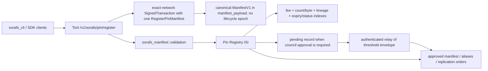

# Pin Registry Manifest Validation Status (SF-4)

This page records the completed SF-4 manifest-validation wiring for SoraFS pin
registration. The shared validation path now lives in `sorafs_manifest`, is used
by Torii submission handling, and is enforced by the on-chain pin registry entry
points before state or fee side effects.

## Implemented Goals

1. Host-side submission paths require one canonical signed transaction and
   verify its exact network, authority signature, sole
   `RegisterPinManifest`, manifest structure, chunking profile, pin policy, and
   governance envelopes before accepting proposals.
2. Torii and gateway-facing services reuse the same validation routines so hosts
   and clients see deterministic acceptance and refusal labels.
3. Unit and integration tests cover positive registration, validator error cases,
   governance-policy rejections, and no-side-effect failures.

## Current Architecture

## Shipped Components

- `sorafs_manifest::validation` provides shared chunker, pin-policy, and
  `ManifestV1` validation helpers.
- Full-manifest admission is bounded to 512 KiB of canonical Norito and rejects
  inline/unregistered chunker profiles, substituted profile geometry, inert
  root/CAR commitments, zero retention, duplicate aliases or metadata keys,
  oversized proof/metadata/signature collections, and invalid or replay-shaped
  Ed25519 council signatures. Signatures are verified over the manifest with
  its governance-signature list cleared, eliminating the self-reference.
- `manifest_pin_policy_constraints_from_config` maps governance configuration
  into `sorafs_manifest::PinPolicyConstraints`.
- `/v1/sorafs/pin/register` accepts only a canonical `SignedTransaction` for the
  exact runtime `NetworkId`, verifies its authority signature, requires exactly
  one `RegisterPinManifest`, and rejects non-canonical or oversized
  `manifest_payload` before queue admission. It returns stable `sorafs_pin_*`
  application-validation labels. Summary commitments supplied by callers are
  not an authority boundary, and client-supplied lifecycle epochs are not part
  of the instruction wire.
- `RegisterPinManifest` carries those exact canonical bytes. Consensus decodes
  them under explicit element, field, allocation, and depth budgets; revalidates
  the complete `ManifestV1`; and derives the manifest digest, embedded
  chunk-plan SHA3-256 digest, 36-byte content root CID, chunker handle, content length, and pin policy before any state or
  fee side effect. Consensus—not Torii—also enforces the
  `require_council_signatures` boundary: governed submissions stay pending and
  cannot publish aliases or issue replication orders. Core derives
  `submitted_epoch` from the executing block's consensus timestamp, charges
  deterministic global/per-authority count and byte summaries, enforces
  bounded lineage depth/fanout, writes authenticated expiry/status indexes, and
  collects the configured fee before publishing the record.
- The first `ApprovePinManifest` transition requires the actual bounded council
  envelope, verifies every strong Ed25519 signature over the registered manifest
  digest, rejects digest-only approval, and requires the consensus-derived
  approval epoch to fall between submission and retention expiry. A same-epoch
  replay may only reuse the already-recorded envelope digest; it cannot replace
  approval history.
  Only after all fallible validation and automatic-order construction succeeds
  are reserved aliases and replication orders published.
- Pin registration is a public paid operation for an authenticated transaction
  account: no general pin permission token is required, but the account pays
  the configured prepaid storage fee, which scales with rounded content bytes,
  replica count, and retention duration. It also consumes the account's
  deterministic quota. Attaching or
  reserving an alias requires `CanBindSorafsAlias`. The proof must be canonical bounded
  Norito, commit to the exact canonical content root CID and submission/retention epochs, contain at most a
  64-level Merkle path and 64 distinct sorted council signers, and fit within the
  1 MiB proof ceiling.
- `RetirePinManifest` is submitter-only and derives its retirement epoch from
  consensus time. Automatic expiry uses the same consensus clock and an
  authenticated ordered expiry index; manual and automatic retirement release
  live-content bytes and move the lifecycle-status marker transactionally.
  Retained record-count and successor-fanout charges are not recycled while
  their lifecycle records and indexes remain in consensus state.
  Retirement epochs cannot predate submission or approval, and reasons are
  bounded, canonical, control-free text.
- `GET /v1/sorafs/pin` executes the native finalized query and returns a
  `PinManifestPageV1` with at most 256 bounded summaries and 256 KiB of encoded
  page data. Continuation is an exclusive non-zero digest bound to the returned
  finalized height/hash, never an offset; the page includes O(1)
  consensus-maintained `charged_usage`. `GET /v1/sorafs/pin/{digest_hex}` is the
  bounded exact-record route for fields intentionally omitted from summaries.
- Tests cover chunker/profile checks, council-signature policy,
  replica floors/ceilings, retention ceilings, storage-class allowlists,
  on-chain registration acceptance, and governance-policy rejections.

## Completion Matrix

| Area | Status | Evidence |
|------|--------|----------|
| Shared validator | Done | `validate_chunker_handle`, `validate_pin_policy`, and `validate_manifest` live in `sorafs_manifest::validation`. |
| Policy wiring | Done | Governance config is mapped into `PinPolicyConstraints`; DTO and full-manifest paths use the same limits. |
| Torii integration | Done | `/v1/sorafs/pin/register` requires one exact-network signed native instruction with a canonical manifest payload and emits stable `sorafs_pin_*` error labels. |
| Contract enforcement | Done | `RegisterPinManifest` resource-bounds, canonicalizes, validates, charges, and derives every persisted manifest commitment plus submission epoch before state mutation; governed submissions remain pending until an envelope-backed approval relayed by an authenticated account. |
| Finalized reads | Done | The list is a height/hash-bound exclusive keyset page with row/byte ceilings and O(1) charged usage; exact bounded details use the digest route. |
| Tests | Done | Validator and integration tests cover policy, chunker geometry substitution, direct-instruction bypass, lifecycle-epoch hard cuts, quota/accounting/index failures, bounded finalized pages, council-envelope canonicalization/resource attacks, and side-effect guarantees. |
| Docs | Done | Architecture, manifest-pipeline, CLI, OpenAPI, status, and roadmap docs describe the shared validation path. |

## Operational Notes

- Manifest validation rejects unknown registered chunker profile IDs instead of
  inferring layout from inline parameters. The first release has one canonical
  Norito layout; alternate legacy flag layouts are rejected at Torii ingress.
- Council-signature requirements are driven by governance configuration. Torii
  always requires the signed instruction's `manifest_payload` so malformed full
  manifests can be rejected early, regardless of whether approval is automatic
  or governed. This host-side check is not the authority
  boundary: consensus keeps the record pending until `ApprovePinManifest`
  verifies the supplied threshold council envelope. Any authenticated account
  may relay that envelope; relaying it grants no registry authority.
- A pending manifest reserves its digest and alias claim against conflicts but
  does not publish the alias or create a replication order. Alias claims can
  only be supplied by an authority carrying `CanBindSorafsAlias`. The approval
  consensus-derived approval epoch becomes the issuance epoch for any deferred
  automatic replication order.
- Error labels are part of the operator contract. Keep Torii, CLI, OpenAPI, and
  tests aligned whenever adding validation cases.
- Large-manifest performance should be measured in release rehearsals; cache only
  deterministic digest results and never bypass validation.

## Remaining Rollout Evidence

1. Archive release-candidate logs for positive registration and governed-policy
   rejection through Torii and on-chain execution.
2. Attach OpenAPI/CLI examples that demonstrate the stable `sorafs_pin_*` labels
   for common failures.
3. Record any production performance baseline for large manifests in the
   migration ledger before widening operator usage.
